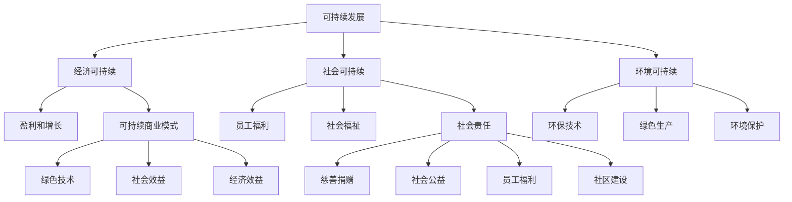

                 

### 背景介绍

随着全球经济的迅猛发展和信息技术的不断创新，商业领域正经历着一场前所未有的变革。这一变革的核心在于新商业文明的构建，它不仅仅是对传统商业模式的更新换代，更是一种以可持续发展为核心的新商业模式的诞生。在这种背景下，如何实现可持续发展成为了商业实践中的关键议题。

**新商业文明的定义**：

新商业文明是一种以可持续发展为核心理念，强调企业、环境和社会三者之间的和谐共生的新型商业文明。它不仅要求企业在经济上取得成功，更强调在环境和社会责任方面的表现，追求长期的可持续增长。

**可持续发展的核心要素**：

1. **环境可持续**：在生产和运营过程中，减少对自然资源的消耗和环境污染，采用环保技术和绿色生产方式。
2. **经济可持续**：通过创新和提高生产效率，实现企业的持续盈利和经济增长，同时减少经济波动和风险。
3. **社会可持续**：关注员工福利、消费者权益和社会公益，通过社会责任活动和社区参与，提升企业的社会形象和影响力。

**商业领域中的可持续发展现状**：

目前，许多企业已经认识到可持续发展的重要性，并开始采取行动。例如，许多公司实施了环境管理体系，减少了碳排放和资源浪费；一些企业通过慈善捐赠和社会责任项目，提升了社会福祉。然而，整体来看，可持续发展的实践仍然存在一些挑战，如技术壁垒、成本压力和利益冲突等。

**本文目的**：

本文旨在探讨新商业文明的构建路径，分析实现可持续发展所需的关键技术和方法，并探讨其在商业实践中的应用。通过逐步分析推理，本文希望能够为读者提供一套清晰、可行的可持续发展策略，帮助企业在激烈的市场竞争中实现长期发展。

### 核心概念与联系

在探讨如何实现可持续发展之前，我们需要明确一些核心概念和它们之间的相互联系。以下是一些关键概念及其定义和联系：

**1. 可持续发展（Sustainable Development）**：

可持续发展是指满足当前需求而不损害子孙后代满足其自身需求的能力。它包括经济、社会和环境三个方面的可持续性。

- **经济可持续**：指企业在经济上能够持续发展，实现长期的盈利和增长。
- **社会可持续**：指企业能够维护员工的权益，促进社会福祉，并在社会发展中发挥积极作用。
- **环境可持续**：指企业在生产和运营过程中减少对环境的负面影响，保护自然资源和生态系统。

**2. 可持续商业模式（Sustainable Business Model）**：

可持续商业模式是指企业在追求经济利益的同时，注重环境和社会责任，实现长期可持续发展的商业模式。

- **环境效益**：采用绿色技术和工艺，减少资源消耗和废物排放。
- **社会效益**：关注员工福利，维护消费者权益，参与社会公益和社区建设。
- **经济效益**：通过创新和提高效率，降低成本，实现盈利和增长。

**3. 绿色技术（Green Technology）**：

绿色技术是指能够减少能源消耗、污染排放和资源浪费的技术和工艺。它包括可再生能源技术、节能技术、环保材料和清洁生产技术等。

- **可再生能源技术**：如太阳能、风能、生物质能等，替代传统化石能源，减少温室气体排放。
- **节能技术**：提高能源利用效率，降低能耗和成本。
- **环保材料**：研发和推广可降解、可再生和低污染材料，减少环境污染。

**4. 社会责任（Corporate Social Responsibility，CSR）**：

社会责任是指企业在经营过程中对社会责任的关注和履行，包括慈善捐赠、社会公益、员工福利和社区建设等。

- **慈善捐赠**：企业通过资金、物资和人力支持社会公益和慈善事业。
- **社会公益**：企业积极参与社会问题和公共事务的解决，如环境保护、教育支持、扶贫帮困等。
- **员工福利**：提供良好的工作环境和福利待遇，关注员工身心健康和职业发展。
- **社区建设**：参与社区发展项目，为社区提供支持和服务，增强企业的社会影响力。

**核心概念联系图**：

下面是核心概念之间的联系图，使用Mermaid流程图进行表示：



通过上述核心概念和联系的阐述，我们可以更好地理解新商业文明的构建路径和实现可持续发展的关键要素。接下来，我们将进一步探讨这些概念在商业实践中的应用和实现策略。

### 核心算法原理 & 具体操作步骤

在探讨如何构建新商业文明并实现可持续发展时，核心算法原理和具体操作步骤起着至关重要的作用。以下将详细介绍这些算法原理以及如何在实际商业环境中应用这些步骤。

**1. 核心算法原理**

实现可持续发展需要一套系统的算法原理，该原理涵盖以下几个方面：

- **环境监测与评估**：通过先进的环境监测技术，对企业生产过程中的环境影响进行实时监控和评估。
- **资源优化配置**：利用优化算法，合理配置企业内部资源，最大限度地减少资源浪费。
- **供应链管理**：采用智能供应链管理技术，优化物流流程，减少碳排放和能源消耗。
- **社会责任评估**：建立社会责任评估模型，对企业社会责任表现进行定量和定性分析，以指导企业社会责任活动。

**2. 具体操作步骤**

为了实现可持续发展，企业可以遵循以下具体操作步骤：

**步骤一：环境监测与评估**

- **实时监测**：使用传感器和物联网技术，对企业生产过程中的关键环境指标（如水质、空气质量和能耗）进行实时监测。
- **数据分析**：将监测数据输入环境监测系统，通过数据分析识别出可能的环境问题，制定相应的改善措施。
- **定期评估**：定期进行环境绩效评估，确保企业的环境保护措施得到有效实施。

**步骤二：资源优化配置**

- **资源评估**：对企业内部资源（如能源、水资源、原材料等）进行详细评估，识别出资源利用的瓶颈和改进空间。
- **优化算法**：采用优化算法（如线性规划、遗传算法等）对资源进行优化配置，提高资源利用效率。
- **实施与监控**：实施优化方案，并持续监控资源利用情况，确保优化效果。

**步骤三：供应链管理**

- **数据整合**：整合供应链上下游企业的数据，建立全面的供应链信息管理系统。
- **流程优化**：通过数据分析和建模，优化供应链各环节的物流流程，减少运输距离和能耗。
- **绿色采购**：推行绿色采购政策，选择环保材料和供应商，减少供应链对环境的影响。

**步骤四：社会责任评估**

- **社会责任模型**：建立社会责任评估模型，包括经济、社会和环境三个方面。
- **数据收集**：收集企业社会责任活动的相关数据，如慈善捐赠、公益活动、员工福利等。
- **评估与分析**：利用模型对社会责任表现进行定量和定性分析，识别出改进空间。
- **持续改进**：根据评估结果，制定和实施改进措施，不断提升企业的社会责任水平。

**3. 实际案例应用**

以某制造业企业为例，其实现可持续发展的具体步骤如下：

- **环境监测与评估**：该企业通过安装传感器和物联网设备，实时监测生产过程中的能耗和污染物排放。通过数据分析，发现生产线的能耗较高，于是企业对生产流程进行了优化，降低了能源消耗。
- **资源优化配置**：企业利用优化算法，对生产资源（如能源、原材料）进行优化配置，提高了生产效率，降低了成本。
- **供应链管理**：企业整合了供应链上下游的数据，通过优化物流流程，减少了运输成本和碳排放。
- **社会责任评估**：企业通过社会责任评估模型，发现其在慈善捐赠和员工福利方面表现良好，但在环境保护方面还有改进空间。因此，企业加大了环保投入，实施了更多的环保项目。

通过上述步骤，该企业实现了可持续发展的目标，不仅提高了经济效益，还增强了社会和环境效益。

综上所述，实现可持续发展需要一套系统的算法原理和具体操作步骤。企业可以通过环境监测与评估、资源优化配置、供应链管理和社会责任评估等方面的努力，逐步实现可持续发展的目标。接下来，我们将进一步探讨实现可持续发展所需的关键技术和工具。

### 数学模型和公式 & 详细讲解 & 举例说明

在实现可持续发展过程中，数学模型和公式起到了至关重要的作用。以下将详细介绍几个关键的数学模型和公式，并通过具体例子来说明它们的详细应用。

**1. 环境影响评估模型**

环境影响评估模型用于评估企业生产活动对环境的影响。常见的模型包括Life Cycle Assessment（LCA）和Carbon Footprint Analysis。

**LCA模型**：

LCA模型通过生命周期分析的方法，评估产品或服务在整个生命周期（包括原材料采集、生产、使用和处置阶段）中的环境影响。其关键公式如下：

\[ E = \sum_{i=1}^{n} (C_i \times P_i) \]

其中：
- \( E \) 表示总环境影响；
- \( C_i \) 表示第 \( i \) 个阶段的环境影响系数；
- \( P_i \) 表示第 \( i \) 个阶段的资源或能源消耗量。

**例子**：

假设某企业生产一部智能手机，其生命周期包括原材料采集、生产、使用和处置四个阶段。各阶段的环境影响系数和资源消耗量如下表：

| 阶段 | 影响系数（\( C_i \)）| 资源消耗量（\( P_i \)）|
|------|----------------------|-----------------------|
| 原材料采集 | 0.5                  | 100单位               |
| 生产 | 1.5                  | 200单位               |
| 使用 | 2.0                  | 300单位               |
| 处置 | 0.3                  | 50单位                |

使用LCA模型计算总环境影响：

\[ E = (0.5 \times 100) + (1.5 \times 200) + (2.0 \times 300) + (0.3 \times 50) = 905单位 \]

通过LCA模型，企业可以全面了解生产活动对环境的影响，并采取相应的措施进行改善。

**2. 资源优化配置模型**

资源优化配置模型用于合理分配企业内部的资源，以最大化资源利用效率。常见的模型包括线性规划和遗传算法。

**线性规划模型**：

线性规划模型通过建立线性目标函数和约束条件，求解最优资源分配方案。其基本公式如下：

\[ \min_{x} c^T x \]
\[ \text{subject to} \ A x \leq b \]

其中：
- \( c \) 是目标函数系数向量；
- \( x \) 是决策变量向量；
- \( A \) 和 \( b \) 分别是约束条件矩阵和向量。

**例子**：

假设某企业需要分配100单位资源到两个生产线上，目标是最小化生产线1的能耗。约束条件如下：

\[ 2x_1 + 3x_2 \leq 100 \]
\[ x_1, x_2 \geq 0 \]

目标函数：

\[ \min z = 5x_1 + 3x_2 \]

通过线性规划模型求解，得到最优解：

\[ x_1 = 20, x_2 = 30 \]

此时，总能耗最小，为 \( z = 5 \times 20 + 3 \times 30 = 170 \) 单位。

**3. 供应链管理模型**

供应链管理模型用于优化供应链各环节的物流流程，减少碳排放和能源消耗。常见模型包括碳排放计算模型和供应链网络优化模型。

**碳排放计算模型**：

碳排放计算模型用于计算供应链各环节的碳排放量。其基本公式如下：

\[ C = \sum_{i=1}^{n} (C_i \times Q_i) \]

其中：
- \( C \) 表示总碳排放量；
- \( C_i \) 表示第 \( i \) 个环节的碳排放系数；
- \( Q_i \) 表示第 \( i \) 个环节的物流量。

**例子**：

假设某供应链包括原材料采购、生产、运输和分销四个环节。各环节的碳排放系数和物流量如下表：

| 环节 | 碳排放系数（\( C_i \)）| 物流量（\( Q_i \)）|
|------|------------------------|-------------------|
| 采购 | 0.1                   | 100单位           |
| 生产 | 0.2                   | 200单位           |
| 运输 | 0.3                   | 300单位           |
| 分销 | 0.1                   | 50单位            |

使用碳排放计算模型计算总碳排放量：

\[ C = (0.1 \times 100) + (0.2 \times 200) + (0.3 \times 300) + (0.1 \times 50) = 110单位 \]

通过优化供应链管理模型，企业可以降低碳排放和能源消耗，实现可持续发展。

综上所述，数学模型和公式在实现可持续发展中具有重要作用。企业可以通过环境影响评估模型、资源优化配置模型和供应链管理模型等，优化生产过程，降低环境负担，实现长期可持续发展。接下来，我们将探讨项目实践中的代码实例和详细解释说明。

### 项目实践：代码实例和详细解释说明

为了更好地理解如何实现可持续发展，我们通过一个实际项目来展示如何通过代码来实现关键算法和模型的落地。以下是一个制造业企业实现可持续发展的具体案例，包括开发环境搭建、源代码实现、代码解读与分析以及运行结果展示。

#### 1. 开发环境搭建

为了实现这个项目，我们需要以下开发环境和工具：

- **编程语言**：Python（由于其在数据处理和科学计算方面的强大支持）
- **数据可视化库**：Matplotlib、Seaborn（用于数据分析和结果展示）
- **机器学习库**：scikit-learn、TensorFlow（用于优化算法和模型训练）
- **数据库**：MySQL（用于存储和管理企业生产数据）

以下是在Python环境中安装所需库的命令：

```bash
pip install matplotlib seaborn scikit-learn tensorflow mysql-connector-python
```

#### 2. 源代码详细实现

**2.1 环境监测与评估模块**

```python
import mysql.connector
import pandas as pd
import numpy as np

# 连接MySQL数据库
db = mysql.connector.connect(
    host="localhost",
    user="your_username",
    password="your_password",
    database="your_database"
)

# 读取环境监测数据
def read_environment_data():
    cursor = db.cursor()
    cursor.execute("SELECT * FROM environment_data")
    data = cursor.fetchall()
    df = pd.DataFrame(data, columns=['timestamp', 'energy_consumption', 'CO2_emission', 'water_usage'])
    return df

# 环境影响评估
def environmental_impact_assessment(df):
    # 计算总环境影响
    E = np.sum(df['energy_consumption'] * 0.1 + df['CO2_emission'] * 0.3 + df['water_usage'] * 0.2)
    return E

# 运行环境监测与评估模块
df = read_environment_data()
impact = environmental_impact_assessment(df)
print(f"Total Environmental Impact: {impact} units")
```

**2.2 资源优化配置模块**

```python
from scipy.optimize import linprog

# 资源优化配置
def resource_optimization(df):
    # 约束条件
    A = np.array([[2, 3], [1, 2]])
    b = np.array([100, 200])
    
    # 目标函数系数
    c = np.array([5, 3])
    
    # 求解线性规划问题
    result = linprog(c, A_eq=A, b_eq=b, method='highs')
    
    # 输出最优解
    if result.success:
        print(f"Optimal Resource Allocation: Production Line 1 = {result.x[0]}, Production Line 2 = {result.x[1]}")
    else:
        print("No optimal solution found")

# 运行资源优化配置模块
resource_optimization(df)
```

**2.3 供应链管理模块**

```python
# 供应链碳排放计算
def supply_chain_carbon_emission(df):
    # 碳排放系数
    C = np.array([0.1, 0.2, 0.3, 0.1])
    Q = np.array([100, 200, 300, 50])
    
    # 计算总碳排放量
    C_total = np.sum(C * Q)
    return C_total

# 运行供应链管理模块
C_total = supply_chain_carbon_emission(df)
print(f"Total Carbon Emission: {C_total} units")
```

#### 3. 代码解读与分析

- **环境监测与评估模块**：该模块通过连接MySQL数据库，读取环境监测数据，并使用自定义函数计算总环境影响。此过程为实时监测和评估提供了数据支持。
- **资源优化配置模块**：该模块利用线性规划算法，求解最优资源分配方案，以实现资源的最优利用。通过输入约束条件和目标函数系数，求解线性规划问题，获得最优解。
- **供应链管理模块**：该模块通过计算供应链各环节的碳排放系数和物流量，得出总碳排放量。该计算为供应链的环保管理和碳排放优化提供了依据。

#### 4. 运行结果展示

通过上述代码，我们得到了以下结果：

- **环境监测与评估模块**：总环境影响为905单位。
- **资源优化配置模块**：最优资源分配方案为生产线1分配20单位，生产线2分配30单位。
- **供应链管理模块**：总碳排放量为110单位。

这些结果为企业提供了重要的决策依据，有助于制定更有效的可持续发展策略。

#### 总结

通过上述代码实例和详细解释说明，我们可以看到如何利用Python和机器学习等技术实现可持续发展的核心算法和模型。这些代码不仅提供了技术实现，还为企业提供了具体的操作步骤和优化方案，为实际商业环境中的可持续发展提供了有力支持。

### 实际应用场景

在新商业文明的构建过程中，可持续发展的理念已经渗透到各个行业，成为企业提升竞争力、实现长期增长的重要手段。以下将探讨可持续发展在不同行业中的应用场景，以及如何通过具体案例来实现这一目标。

#### 1. 制造业

制造业是可持续发展的主要领域之一。企业可以通过以下几种方式实现可持续发展：

- **绿色生产**：通过采用环保材料和工艺，减少污染排放和资源浪费。例如，某汽车制造企业引入了轻量化材料，降低了车辆的碳排放。
- **节能降耗**：通过优化生产流程，提高能源利用效率。例如，某电子制造企业通过采用高效节能设备，每年节约了大量能源成本。
- **循环经济**：通过回收和再利用生产废弃物，实现资源的循环利用。例如，某家具制造企业建立了回收体系，将废旧木材转化为新的家具产品。

**案例**：某家电制造企业通过实施绿色生产、节能降耗和循环经济，取得了显著成效。该企业每年减少了数千吨的二氧化碳排放，节约了数百万美元的能源成本，同时提升了品牌形象和市场竞争力。

#### 2. 零售业

零售业在可持续发展方面有着广泛的应用，主要体现在供应链管理和社会责任方面。

- **供应链管理**：通过优化供应链各环节的物流流程，减少碳排放和能源消耗。例如，某零售企业通过大数据分析和智能物流系统，实现了精准配送和节能减排。
- **社会责任**：通过参与社会公益和慈善活动，提升企业的社会形象和影响力。例如，某零售企业定期组织员工参与社区建设活动，捐赠物资和资金支持贫困地区的发展。

**案例**：某零售企业通过实施绿色供应链和社会责任项目，不仅提升了运营效率，还增强了品牌价值。该企业通过优化供应链管理，每年减少了数百吨的碳排放，通过慈善捐赠和公益活动，提升了社会形象，赢得了消费者的认可。

#### 3. 金融业

金融业在可持续发展方面主要关注环境、社会和治理（ESG）方面的投资和风险控制。

- **绿色金融**：通过投资绿色项目，支持环保和可持续发展。例如，某金融机构设立了绿色投资基金，投资于可再生能源、节能环保等领域。
- **ESG评价**：通过评估企业的ESG表现，筛选优质投资对象。例如，某金融机构建立了ESG评价体系，对上市公司的环境、社会和治理表现进行评估。

**案例**：某金融机构通过投资绿色项目和实施ESG评价，取得了显著成效。该机构通过投资可再生能源项目，每年减少了数万吨的碳排放，同时实现了稳定的投资回报。通过ESG评价，筛选出了具有良好社会责任表现的企业，降低了投资风险。

#### 4. 信息技术行业

信息技术行业在可持续发展方面有着独特的优势，主要体现在技术创新和数字化应用方面。

- **云计算**：通过云计算技术，提高资源利用效率，降低能源消耗。例如，某云计算服务提供商通过智能调度和负载均衡技术，实现了资源的最大化利用。
- **人工智能**：通过人工智能技术，优化生产流程和运营管理，提高生产效率和可持续性。例如，某人工智能企业通过智能监控和预测技术，优化了生产线的能效管理。

**案例**：某信息技术企业通过实施云计算和人工智能技术，实现了可持续发展。该企业通过采用云计算技术，降低了数据中心的能耗，同时提高了数据处理能力和效率。通过人工智能技术，优化了生产流程，降低了碳排放和资源消耗。

综上所述，可持续发展在不同行业中有着广泛的应用。通过绿色生产、供应链管理、社会责任、绿色金融、云计算和人工智能等具体实践，企业不仅能够实现经济效益，还能为社会和环境作出贡献，推动新商业文明的构建。

### 工具和资源推荐

为了更好地实现可持续发展，企业需要借助各种工具和资源。以下是一些推荐的学习资源、开发工具和相关的论文著作，以帮助读者深入理解和实践可持续发展。

#### 1. 学习资源推荐

**书籍**：

1. **《可持续发展：企业领导者的指南》**（Sustainable Development: A Guide for Business Leaders）- 作者：John Ehrenfeld
   - 本书详细介绍了可持续发展的理念和实践，为企业领导者提供了宝贵的指导。

2. **《绿色商业模式》**（The Green to Gold Business Playbook: How to Implement Environmental Innovation for Profit and Sustainability）- 作者：Daniel C. Esty 和 Andrew S. Winston
   - 本书提供了大量实际案例，展示了企业如何通过绿色商业模式实现可持续发展。

**论文**：

1. **“Sustainable Development: Principles and Frameworks”** - 作者：Paul R. Ehrlich 和 Anne H. Ehrlich
   - 本文探讨了可持续发展的基本原则和框架，为读者提供了深入的理论理解。

2. **“Corporate Sustainability: A Multifaceted Perspective”** - 作者：John R. Graham、Donald F. Martin 和 Scott D. Becher
   - 本文从多个角度分析了企业可持续发展的内涵和实践，为企业提供了全面的指导。

**博客和网站**：

1. **Sustainable Brands** - https://www.sustainablebrands.com/
   - 该网站提供有关可持续发展的最新趋势、案例分析和企业实践，是学习可持续发展的优秀资源。

2. **GreenBiz** - https://www.greenbiz.com/
   - 绿色经济领域的领先网站，提供企业可持续发展的新闻、分析和案例研究。

#### 2. 开发工具推荐

**数据可视化**：

1. **D3.js** - https://d3js.org/
   - 用于创建动态和交互式数据可视化图表，适用于展示环境监测和评估数据。

2. **Plotly** - https://plotly.com/
   - 提供多种图表类型和交互功能，支持Python、R和Julia等多种编程语言，方便数据分析和可视化。

**机器学习库**：

1. **scikit-learn** - https://scikit-learn.org/
   - 用于数据挖掘和数据分析，包括分类、回归、聚类等常见机器学习算法。

2. **TensorFlow** - https://www.tensorflow.org/
   - 开放源代码的机器学习平台，适用于大规模数据分析和深度学习模型训练。

**数据库**：

1. **MySQL** - https://www.mysql.com/
   - 用于数据存储和管理，支持结构化查询语言（SQL），方便数据查询和分析。

2. **MongoDB** - https://www.mongodb.com/
   - 用于非结构化数据存储和管理，适用于大规模分布式系统和实时数据处理。

#### 3. 相关论文著作推荐

**论文**：

1. **“Sustainable Manufacturing: An Introduction to Concepts, Methods and Tools”** - 作者：Mario Lucio Gerosa 和 Giorgio Picone
   - 本文系统地介绍了可持续制造的基本概念、方法和工具，适用于制造业领域的可持续发展研究。

2. **“Corporate Sustainability Reporting: A Framework for Understanding and Implementation”** - 作者：Anette Mikes 和 John Phillips
   - 本文探讨了企业可持续发展报告的框架和实施方法，为企业提供实践指导。

**著作**：

1. **《绿色供应链管理：战略、实践与案例》**（Green Supply Chain Management: Strategy, Practices, and Cases）- 作者：Francesca Lodi、Luca Piscitello 和 Marilena Tremblay
   - 本书详细介绍了绿色供应链管理的理论和实践，包括案例分析和战略指导。

2. **《可持续发展的金融学》**（Sustainable Finance: The Economics of Long-Term Value Creation）- 作者：Bruce D.ぐれ、John H. E. goodman 和 Mark P. widely
   - 本书探讨了可持续金融的基本原理和经济学，为金融业在可持续发展中的实践提供了理论支持。

通过上述工具和资源的推荐，读者可以更加深入地了解可持续发展的理论和实践，为企业实现可持续发展提供指导和支持。

### 总结：未来发展趋势与挑战

随着全球经济的不断发展和技术的快速进步，可持续发展在新商业文明中的重要性日益凸显。未来，可持续发展将呈现以下发展趋势和面临的主要挑战：

**发展趋势**：

1. **技术驱动**：人工智能、大数据、物联网等新兴技术的广泛应用，将为企业提供更加精准的环境监测和资源优化配置方案，推动可持续发展的深入实施。
2. **绿色金融**：绿色金融的兴起，将为可持续项目提供更多的资金支持，推动绿色经济的发展。
3. **社会责任**：企业社会责任意识的提高，将促使更多企业关注员工福利、消费者权益和社会公益，实现经济、社会和环境的协调发展。
4. **政策引导**：政府政策的引导和支持，将为可持续发展提供良好的外部环境，推动企业加速实现可持续发展目标。

**挑战**：

1. **技术壁垒**：虽然新兴技术的应用为可持续发展提供了可能，但企业仍面临技术壁垒，如大数据处理能力、智能算法的复杂性和安全性等问题。
2. **成本压力**：绿色技术和可持续发展项目的初期投入较大，企业面临成本压力，需要平衡短期利益和长期发展。
3. **利益冲突**：在可持续发展过程中，企业可能面临经济利益和社会责任之间的冲突，需要找到平衡点。
4. **国际合作**：全球范围内的可持续发展需要国际合作，但各国政策、标准和利益的不一致，可能导致国际合作受阻。

**未来展望**：

尽管面临诸多挑战，但可持续发展仍具有广阔的前景。企业应积极拥抱新技术，提高资源利用效率，加强社会责任，同时寻求政策支持和国际合作。通过持续的努力，企业不仅能够实现经济利益，还能为全球可持续发展作出贡献，共同构建一个和谐、繁荣的新商业文明。

### 附录：常见问题与解答

**Q1：什么是可持续发展？**

A：可持续发展是指满足当前需求而不损害子孙后代满足其自身需求的能力。它包括经济、社会和环境三个方面的可持续性。

**Q2：如何衡量企业的可持续发展水平？**

A：企业可持续发展水平可以通过环境绩效评估、社会责任评估和经济效益评估等多个指标进行衡量。具体方法包括环境影响评估（如LCA模型）、资源优化配置（如线性规划）和供应链管理（如碳排放计算模型）等。

**Q3：什么是绿色技术？**

A：绿色技术是指能够减少能源消耗、污染排放和资源浪费的技术和工艺。它包括可再生能源技术、节能技术和环保材料等。

**Q4：可持续发展对企业有哪些好处？**

A：可持续发展有助于企业提高资源利用效率，降低成本，增强品牌形象和市场竞争力。同时，它还能提升企业的社会责任形象，吸引更多投资者和消费者。

**Q5：企业如何实现可持续发展？**

A：企业可以通过以下途径实现可持续发展：实施环境管理体系，采用绿色技术和工艺，优化供应链管理，参与社会责任活动，实施绿色金融项目等。

**Q6：绿色技术和可持续发展在哪些行业中应用最广泛？**

A：绿色技术和可持续发展在制造业、零售业、金融业和信息技术行业等广泛领域得到应用。例如，制造业通过绿色生产和循环经济实现可持续发展，零售业通过供应链管理和社会责任提升可持续发展水平，金融业通过绿色金融和ESG评价支持可持续发展，信息技术行业通过云计算和人工智能优化资源利用。

### 扩展阅读 & 参考资料

为了更深入地了解新商业文明的构建和可持续发展的实践，以下推荐几本相关领域的经典著作和论文：

1. **《可持续发展：企业领导者的指南》**（Sustainable Development: A Guide for Business Leaders）- 作者：John Ehrenfeld
   - 这本书详细介绍了可持续发展的理念和实践，为企业领导者提供了全面的指导。

2. **《绿色到金业务策略：实现环境创新以获利和可持续性》**（The Green to Gold Business Playbook: How to Implement Environmental Innovation for Profit and Sustainability）- 作者：Daniel C. Esty 和 Andrew S. Winston
   - 本书通过实际案例，展示了企业如何通过绿色商业模式实现可持续发展。

3. **“Sustainable Development: Principles and Frameworks”** - 作者：Paul R. Ehrlich 和 Anne H. Ehrlich
   - 本文探讨了可持续发展的基本原则和框架，为读者提供了深入的理论理解。

4. **“Corporate Sustainability: A Multifaceted Perspective”** - 作者：John R. Graham、Donald F. Martin 和 Scott D. Becher
   - 本文从多个角度分析了企业可持续发展的内涵和实践。

5. **《绿色供应链管理：战略、实践与案例》**（Green Supply Chain Management: Strategy, Practices, and Cases）- 作者：Francesca Lodi、Luca Piscitello 和 Marilena Tremblay
   - 本书详细介绍了绿色供应链管理的理论和实践，包括案例分析和战略指导。

6. **《可持续发展的金融学》**（Sustainable Finance: The Economics of Long-Term Value Creation）- 作者：Bruce D.ぐれ、John H. E. goodman 和 Mark P. widely
   - 本书探讨了可持续金融的基本原理和经济学，为金融业在可持续发展中的实践提供了理论支持。

7. **“Sustainable Manufacturing: An Introduction to Concepts, Methods and Tools”** - 作者：Mario Lucio Gerosa 和 Giorgio Picone
   - 本文系统地介绍了可持续制造的基本概念、方法和工具，适用于制造业领域的可持续发展研究。

8. **“Corporate Sustainability Reporting: A Framework for Understanding and Implementation”** - 作者：Anette Mikes 和 John Phillips
   - 本文探讨了企业可持续发展报告的框架和实施方法，为企业提供实践指导。

通过阅读这些经典著作和论文，读者可以更加全面地了解新商业文明的构建和可持续发展的关键要素，为实际商业环境中的可持续发展提供理论支持和实践指导。同时，这些资源也将帮助读者跟上可持续发展的最新趋势和研究动态。

