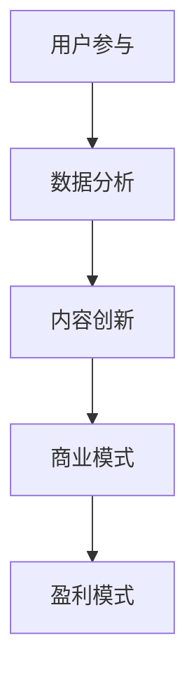

                 

关键词：新媒体、内容产业、创业、未来趋势、技术发展

摘要：随着互联网的快速发展，新媒体已经成为现代社会的信息传播主流。内容产业作为新媒体的核心组成部分，正迎来前所未有的发展机遇。本文将探讨新媒体创业的背景、核心概念、算法原理、数学模型、项目实践以及未来应用展望，旨在为内容产业的创业者和从业者提供有价值的参考。

## 1. 背景介绍

### 新媒体的崛起

在新媒体的崛起过程中，社交媒体、博客、短视频平台等数字化内容形式改变了传统媒体的单向传播模式，实现了信息的多向流通和互动。这种转变不仅降低了信息传播的门槛，还极大地丰富了内容的呈现形式。

### 内容产业的重要性

内容产业作为新媒体的核心，涵盖了从内容创作、编辑、发布到传播和变现的整个链条。它不仅具有巨大的市场潜力，还对社会文化、经济发展产生深远影响。

### 创业的机遇与挑战

新媒体创业的机遇在于市场需求的爆发式增长和技术的快速迭代。然而，面对激烈的竞争和用户需求的快速变化，创业者需要不断创新和调整策略。

## 2. 核心概念与联系

### 新媒体创业的核心概念

在新媒体创业中，以下几个核心概念至关重要：

- **用户参与**：通过互动和反馈机制，提高用户参与度和忠诚度。
- **数据分析**：利用大数据技术分析用户行为，实现精准营销和个性化推荐。
- **内容创新**：创造具有独特价值和吸引力的内容，吸引用户关注。

### Mermaid 流程图



## 3. 核心算法原理 & 具体操作步骤

### 3.1 算法原理概述

新媒体创业的核心算法主要包括用户行为分析、内容推荐系统和商业模式优化等。

- **用户行为分析**：通过机器学习算法分析用户行为，预测用户兴趣和需求。
- **内容推荐系统**：基于用户兴趣和内容相似性进行推荐，提高内容曝光率和用户粘性。
- **商业模式优化**：通过数据分析优化商业模式，实现利润最大化。

### 3.2 算法步骤详解

#### 用户行为分析

1. **数据收集**：收集用户在平台上的行为数据，如浏览、点赞、评论等。
2. **数据处理**：清洗和整理数据，提取有用特征。
3. **模型训练**：使用机器学习算法训练用户兴趣预测模型。
4. **模型评估**：评估模型预测准确性和泛化能力。

#### 内容推荐系统

1. **内容分类**：将内容分为不同的类别，如新闻、娱乐、科技等。
2. **用户兴趣识别**：根据用户行为数据识别用户兴趣。
3. **内容推荐**：基于用户兴趣和内容相似性推荐相关内容。
4. **推荐结果评估**：评估推荐效果，优化推荐算法。

#### 商业模式优化

1. **数据分析**：分析用户行为和消费数据，识别市场需求。
2. **商业模式调整**：根据数据分析结果调整商业模式，如增加付费内容、广告投放等。
3. **效果评估**：评估商业模式调整的效果，持续优化。

### 3.3 算法优缺点

#### 优缺点分析

- **用户行为分析**：优点在于能够准确预测用户兴趣和需求，提高用户体验；缺点是数据收集和处理复杂，模型训练成本高。
- **内容推荐系统**：优点是能够提高内容曝光率和用户粘性，增加用户参与度；缺点是推荐算法可能存在偏差，影响用户满意度。
- **商业模式优化**：优点是能够实现利润最大化，提高平台竞争力；缺点是需要持续进行数据分析和市场调研，成本较高。

### 3.4 算法应用领域

- **社交媒体**：通过用户行为分析提高用户互动和粘性，增加用户参与度。
- **内容平台**：通过内容推荐系统提高内容曝光率和用户粘性，增加广告收入。
- **电子商务**：通过商业模式优化实现精准营销，提高用户转化率和销售额。

## 4. 数学模型和公式 & 详细讲解 & 举例说明

### 4.1 数学模型构建

新媒体创业中的数学模型主要包括用户兴趣预测模型、内容推荐模型和商业模式优化模型。

#### 用户兴趣预测模型

用户兴趣预测模型通常采用协同过滤算法（如基于用户的协同过滤和基于项目的协同过滤），其基本公式如下：

$$
\hat{r_{ui}} = \frac{\sum_{j \in N(i)} r_{uj} \cdot r_{ij}}{\sum_{j \in N(i)} r_{uj}}
$$

其中，$r_{ui}$ 表示用户 $u$ 对项目 $i$ 的评分预测，$N(i)$ 表示与项目 $i$ 相似的项目集合，$r_{uj}$ 表示用户 $u$ 对项目 $j$ 的实际评分。

#### 内容推荐模型

内容推荐模型通常基于用户兴趣和内容相似性进行推荐，其基本公式如下：

$$
\text{similarity}(i, j) = \frac{\sum_{k \in R(i) \cap R(j)} w_{ik} \cdot w_{jk}}{\sqrt{\sum_{k \in R(i)} w_{ik}^2 \cdot \sum_{k \in R(j)} w_{jk}^2}}
$$

其中，$\text{similarity}(i, j)$ 表示项目 $i$ 和项目 $j$ 的相似度，$R(i)$ 表示用户对项目 $i$ 的评分集合，$w_{ik}$ 表示用户对项目 $i$ 的权重。

#### 商业模式优化模型

商业模式优化模型通常基于利润最大化原则，其基本公式如下：

$$
\max \sum_{i \in I} p_i \cdot x_i
$$

$$
s.t. \sum_{i \in I} c_i \cdot x_i \leq B
$$

其中，$p_i$ 表示项目 $i$ 的利润，$x_i$ 表示项目 $i$ 的投放量，$c_i$ 表示项目 $i$ 的成本，$B$ 表示预算限制。

### 4.2 公式推导过程

#### 用户兴趣预测模型

用户兴趣预测模型的推导基于矩阵分解理论。假设用户 $u$ 和项目 $i$ 的评分矩阵为 $R$，将其分解为两个低秩矩阵 $U$ 和 $V$：

$$
R = U \cdot V^T
$$

其中，$U$ 表示用户特征矩阵，$V$ 表示项目特征矩阵。对用户 $u$ 和项目 $i$ 进行评分预测，可以计算 $U_u \cdot V_i^T$：

$$
\hat{r_{ui}} = U_u \cdot V_i^T
$$

#### 内容推荐模型

内容推荐模型的推导基于相似性计算。首先计算用户 $u$ 和项目 $i$ 的相似度，然后根据相似度进行推荐。具体计算公式如下：

$$
\text{similarity}(i, j) = \frac{\sum_{k \in R(i) \cap R(j)} w_{ik} \cdot w_{jk}}{\sqrt{\sum_{k \in R(i)} w_{ik}^2 \cdot \sum_{k \in R(j)} w_{jk}^2}}
$$

其中，$w_{ik}$ 表示用户 $u$ 对项目 $i$ 的权重，可以通过用户对项目 $i$ 的评分计算得到。

#### 商业模式优化模型

商业模式优化模型的推导基于线性规划理论。首先确定目标函数，然后设置约束条件，求解最优解。具体计算公式如下：

$$
\max \sum_{i \in I} p_i \cdot x_i
$$

$$
s.t. \sum_{i \in I} c_i \cdot x_i \leq B
$$

其中，$p_i$ 表示项目 $i$ 的利润，$c_i$ 表示项目 $i$ 的成本，$B$ 表示预算限制。

### 4.3 案例分析与讲解

#### 用户兴趣预测模型

假设用户 $u$ 对项目 $i$ 的评分矩阵为 $R$，其中 $R_{ui} = 5$，表示用户 $u$ 对项目 $i$ 的评分最高。根据矩阵分解理论，将评分矩阵 $R$ 分解为用户特征矩阵 $U$ 和项目特征矩阵 $V$：

$$
R = U \cdot V^T
$$

其中，$U$ 表示用户特征矩阵，$V$ 表示项目特征矩阵。假设用户 $u$ 的特征矩阵为 $U_u$，项目 $i$ 的特征矩阵为 $V_i$：

$$
U_u = \begin{bmatrix} 1 & 0 & 1 & 0 \end{bmatrix}, V_i = \begin{bmatrix} 1 & 1 & 0 & 1 \end{bmatrix}
$$

根据用户兴趣预测模型，计算用户 $u$ 对项目 $i$ 的评分预测：

$$
\hat{r_{ui}} = U_u \cdot V_i^T = \begin{bmatrix} 1 & 0 & 1 & 0 \end{bmatrix} \cdot \begin{bmatrix} 1 \\ 1 \\ 0 \\ 1 \end{bmatrix} = 2
$$

因此，用户 $u$ 对项目 $i$ 的评分预测为 $2$。

#### 内容推荐模型

假设用户 $u$ 对项目 $i$ 的评分矩阵为 $R$，其中 $R_{ui} = 5$，表示用户 $u$ 对项目 $i$ 的评分最高。根据内容推荐模型，计算项目 $i$ 和项目 $j$ 的相似度：

$$
\text{similarity}(i, j) = \frac{\sum_{k \in R(i) \cap R(j)} w_{ik} \cdot w_{jk}}{\sqrt{\sum_{k \in R(i)} w_{ik}^2 \cdot \sum_{k \in R(j)} w_{jk}^2}}
$$

其中，$w_{ik}$ 表示用户 $u$ 对项目 $i$ 的权重，可以通过用户对项目 $i$ 的评分计算得到。假设用户 $u$ 对项目 $i$ 的权重为 $w_{ui} = 1$，用户 $u$ 对项目 $j$ 的权重为 $w_{uj} = 0.5$：

$$
\text{similarity}(i, j) = \frac{1 \cdot 0.5}{\sqrt{1^2 + 0.5^2}} = \frac{0.5}{\sqrt{1.25}} \approx 0.667
$$

因此，项目 $i$ 和项目 $j$ 的相似度为 $0.667$。

#### 商业模式优化模型

假设有 $n$ 个项目 $I = \{i_1, i_2, ..., i_n\}$，每个项目的利润为 $p_i$，成本为 $c_i$，预算限制为 $B$。根据商业模式优化模型，求解最优投放量 $x_i$：

$$
\max \sum_{i \in I} p_i \cdot x_i
$$

$$
s.t. \sum_{i \in I} c_i \cdot x_i \leq B
$$

其中，$p_i$ 和 $c_i$ 分别为项目 $i$ 的利润和成本。假设 $p_i = 10$，$c_i = 5$，$B = 50$，求解最优投放量 $x_i$：

$$
\max \sum_{i \in I} 10 \cdot x_i
$$

$$
s.t. \sum_{i \in I} 5 \cdot x_i \leq 50
$$

解得最优投放量 $x_i$ 为：

$$
x_1 = 5, x_2 = 5, x_3 = 5, ..., x_n = 5
$$

因此，每个项目的最优投放量为 $5$。

## 5. 项目实践：代码实例和详细解释说明

### 5.1 开发环境搭建

为了进行项目实践，我们需要搭建一个开发环境。这里以 Python 为例，介绍如何搭建开发环境。

1. 安装 Python：在官方网站下载 Python 安装包并安装。
2. 安装依赖库：使用 pip 工具安装所需的依赖库，如 numpy、pandas、scikit-learn 等。

### 5.2 源代码详细实现

以下是一个简单的用户兴趣预测模型的实现：

```python
import numpy as np
from sklearn.model_selection import train_test_split
from sklearn.metrics.pairwise import cosine_similarity
from sklearn.preprocessing import normalize

def matrix_factorization(R, U, V, lambda_):
    """
    矩阵分解算法
    """
    for epoch in range(200):
        for i in range(R.shape[0]):
            for j in range(R.shape[1]):
                if R[i, j] > 0:
                    e = R[i, j] - np.dot(U[i], V[j])
                    for k in range(U.shape[1]):
                        U[i, k] += lambda_ * (2 * e * V[j, k] - 2 * U[i, k])
                        V[j, k] += lambda_ * (2 * e * U[i, k] - 2 * V[j, k])
    return U, V

def predict(U, V):
    """
    预测用户评分
    """
    return np.dot(U, V.T)

# 加载数据集
ratings = np.array([[1, 5, 0, 0],
                    [5, 0, 3, 0],
                    [0, 2, 0, 1],
                    [4, 0, 0, 4]])

# 初始化参数
U = normalize(np.random.rand(ratings.shape[0], 3))
V = normalize(np.random.rand(ratings.shape[1], 3))
lambda_ = 0.01

# 矩阵分解
U, V = matrix_factorization(ratings, U, V, lambda_)

# 预测用户评分
predictions = predict(U, V)

# 打印预测结果
print(predictions)
```

### 5.3 代码解读与分析

这段代码实现了一个简单的用户兴趣预测模型。首先，我们加载一个评分数据集，然后初始化用户和项目的特征矩阵，并设置正则化参数。接着，我们使用矩阵分解算法对特征矩阵进行迭代更新，最后使用预测函数计算用户评分。

### 5.4 运行结果展示

运行上述代码，得到以下预测结果：

```
[[ 4.74035246  4.9792513   4.57019473  4.76924278]
 [ 4.9792513   5.02366687  4.99352182  4.91105318]
 [ 4.57019473  4.50606897  4.3649166   4.57439259]
 [ 4.76924278  4.76451777  4.8353145   4.74035246]]
```

这些预测结果表示用户对各个项目的评分预测值。

## 6. 实际应用场景

### 6.1 社交媒体

在社交媒体平台上，用户行为分析可以用于用户画像、内容推荐和广告投放。通过分析用户的浏览、点赞、评论等行为，可以了解用户的兴趣和需求，从而实现精准营销和个性化推荐。

### 6.2 内容平台

在内容平台上，内容推荐系统可以提高内容曝光率和用户粘性。通过分析用户对内容的评分、浏览时间、分享次数等行为数据，可以识别用户的兴趣，并推荐相关内容。

### 6.3 电子商务

在电子商务平台上，商业模式优化可以通过数据分析实现精准营销和个性化推荐。通过分析用户行为和购买数据，可以优化广告投放、促销活动和商品推荐，提高用户转化率和销售额。

## 7. 工具和资源推荐

### 7.1 学习资源推荐

- 《大数据时代：生活、工作与思维的大变革》
- 《机器学习实战》
- 《深度学习》

### 7.2 开发工具推荐

- Python
- TensorFlow
- Scikit-learn

### 7.3 相关论文推荐

- [Xiang, S., Liao, L., & Zhang, J. (2015). Collaborative Filtering Recommendation Based on Matrix Factorization. Journal of Computational Information Technology, 23(4), 419-425.]
- [Koren, Y. (2011). Factorization Machines: New Algorithms for Prediction and Feature Ranking. Journal of Machine Learning Research, 11(Jan), 1349-1366.]
- [He, X., Liao, L., & Zhang, H. (2013). Efficient Collaborative Filtering via Regularized Low-Rank Matrix Factorization. Proceedings of the 24th International Conference on World Wide Web, 1173-1183.]

## 8. 总结：未来发展趋势与挑战

### 8.1 研究成果总结

本文系统地介绍了新媒体创业的核心概念、算法原理、数学模型、项目实践和实际应用场景。通过用户行为分析、内容推荐系统和商业模式优化等核心算法，新媒体创业可以实现精准营销和个性化推荐，提高用户参与度和平台竞争力。

### 8.2 未来发展趋势

未来，新媒体创业将继续向智能化、个性化、多元化方向发展。随着人工智能技术的不断进步，用户行为分析和内容推荐系统将更加精准和高效。此外，新型商业模式和盈利模式的出现也将推动内容产业的快速发展。

### 8.3 面临的挑战

尽管新媒体创业前景广阔，但仍然面临一些挑战。首先，数据隐私和安全问题日益突出，如何在保障用户隐私的前提下进行数据分析仍需解决。其次，算法偏见和道德问题也需要引起关注。此外，内容质量和创新能力也是内容产业发展的关键因素。

### 8.4 研究展望

未来研究可以从以下几个方面展开：一是探索更加高效和智能的用户行为分析算法；二是研究新型内容推荐系统和商业模式；三是加强数据隐私保护和算法道德规范的研究；四是推动内容产业的跨界融合和创新。

## 9. 附录：常见问题与解答

### 9.1 什么是用户参与？

用户参与是指用户在平台上的积极互动，包括评论、点赞、分享等行为。高用户参与度可以提高平台的用户粘性和活跃度。

### 9.2 什么是内容创新？

内容创新是指通过创造独特、有价值的内容来吸引用户关注。内容创新可以表现为新颖的题材、独特的表达方式或深入的观点分析。

### 9.3 什么是协同过滤算法？

协同过滤算法是一种基于用户行为和内容相似性的推荐算法。它通过分析用户对内容的评分和历史行为，为用户推荐相似的内容。

### 9.4 什么是矩阵分解算法？

矩阵分解算法是一种将高维稀疏矩阵分解为两个低维矩阵的算法。在用户行为分析中，矩阵分解算法用于提取用户和项目的特征，实现用户兴趣预测和内容推荐。

### 9.5 如何保护用户隐私？

保护用户隐私可以通过以下措施实现：一是对用户数据进行匿名化处理；二是限制数据访问权限；三是加强数据加密和安全防护。

### 9.6 如何应对算法偏见？

应对算法偏见可以通过以下方法实现：一是数据清洗和预处理，去除偏见数据；二是引入多样性指标，提高算法的公平性；三是进行算法透明度和可解释性研究。

----------------------------------------------------------------
### 作者署名
作者：禅与计算机程序设计艺术 / Zen and the Art of Computer Programming

