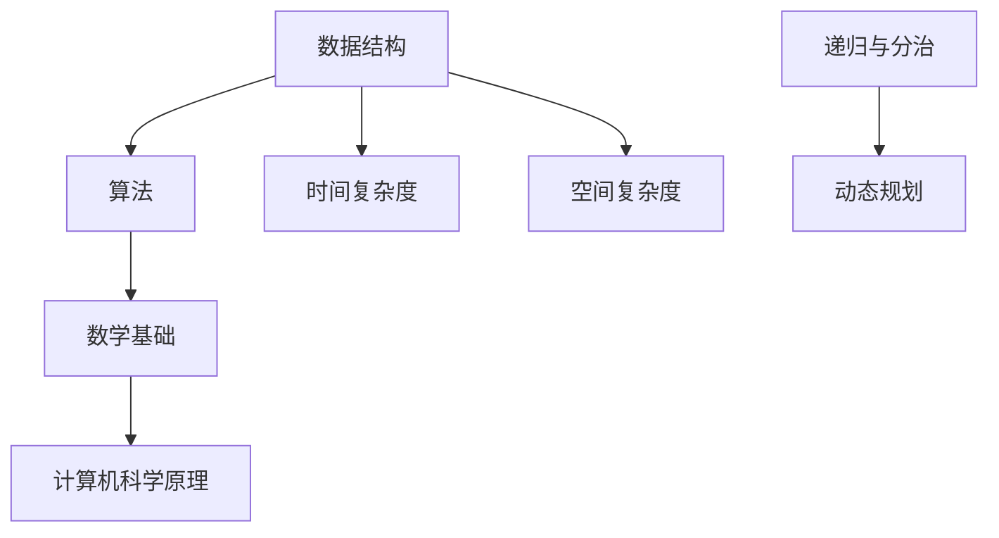

                 

### 1. 背景介绍

#### 1.1 新浪2024微博热搜校招背景

随着社交媒体的迅速发展，微博已成为中国最具影响力的社交媒体平台之一。作为一家领先的新媒体公司，新浪一直致力于为用户提供丰富、即时、多元的信息服务。2024年，新浪微博再次启动校招，吸引了大量应届毕业生的关注。

校招算法面试作为求职者进入新浪微博的重要门槛之一，其难度和深度备受关注。为了更好地应对这一挑战，本文将详细解析2024年新浪微博热搜校招的算法面试题，帮助广大考生把握解题思路，提升解题能力。

#### 1.2 算法面试的重要性

算法面试在技术面试中占据重要地位。它不仅考察应聘者的编程能力，还测试逻辑思维、数学素养和问题解决能力。在新浪微博这样的互联网公司，算法能力往往是衡量技术人才的重要标准。

通过算法面试，企业能够评估应聘者的技术潜力，找到能够解决复杂问题的优秀人才。同时，应聘者也能通过算法面试展示自己的技术实力，为未来的职业发展打下坚实基础。

#### 1.3 本文结构

本文将围绕以下结构展开：

- **背景介绍**：阐述新浪2024微博热搜校招算法面试的背景和重要性。
- **核心概念与联系**：介绍与面试题相关的核心概念，并使用Mermaid流程图展示原理和架构。
- **核心算法原理 & 具体操作步骤**：详细讲解面试题的核心算法原理，并提供具体的操作步骤。
- **数学模型和公式 & 详细讲解 & 举例说明**：使用LaTeX格式展示数学模型和公式，并通过实际例子进行详细讲解。
- **项目实践：代码实例和详细解释说明**：提供具体的代码实例，并进行详细解读和分析。
- **实际应用场景**：分析算法在实际场景中的应用。
- **工具和资源推荐**：推荐学习资源、开发工具和框架。
- **总结：未来发展趋势与挑战**：总结本文的主要观点，展望未来发展趋势和面临的挑战。
- **附录：常见问题与解答**：回答读者可能关心的一些常见问题。
- **扩展阅读 & 参考资料**：提供相关的扩展阅读和参考资料。

接下来，我们将逐步深入，详细解析新浪2024微博热搜校招算法面试题。准备好了吗？让我们开始吧！<|user|>
```markdown
## 2. 核心概念与联系

在解读新浪2024微博热搜校招的算法面试题之前，我们需要首先了解一些核心概念和它们之间的联系。这些概念构成了算法面试题的背景知识，是解题的基础。

### 2.1 数据结构与算法

**数据结构**是计算机存储数据的方式，它们决定了数据如何在计算机中存储和操作。常见的有数组、链表、栈、队列、树、图等。每种数据结构都有其独特的特性，适用于不同的应用场景。

**算法**则是解决问题的一系列步骤，它定义了如何使用数据结构来处理特定的问题。常见的算法有排序、查找、图算法、动态规划等。

### 2.2 数学基础

算法面试题常常涉及数学知识，如概率论、组合数学、线性代数等。以下是一些重要的数学基础：

- **概率论**：用于描述随机事件的发生概率，对于处理大量数据和统计问题至关重要。
- **组合数学**：用于计算组合和排列的数量，常见于图算法和动态规划。
- **线性代数**：提供了矩阵和向量的运算，对于优化问题和机器学习非常重要。

### 2.3 计算机科学原理

理解计算机科学的基本原理对于解决复杂问题至关重要。以下是一些关键概念：

- **时间复杂度和空间复杂度**：用于评估算法的性能，它们帮助我们了解算法在不同输入规模下的运行效率。
- **递归与分治**：递归是一种常用的算法设计方法，它将问题分解成更小的子问题。分治策略通过递归方式解决问题，常用于排序和搜索算法。
- **动态规划**：一种解决最优子结构问题的方法，通过存储子问题的解来避免重复计算。

### 2.4 Mermaid 流程图

为了更好地展示这些概念之间的联系，我们使用Mermaid流程图来表示。以下是一个简单的Mermaid流程图示例：



在这个流程图中，数据结构、算法、数学基础和计算机科学原理构成了一个相互关联的整体，它们共同作用于解决复杂问题。

### 2.5 关键算法简介

在解析具体的面试题之前，我们需要简要介绍一些关键算法：

- **排序算法**：如快速排序、归并排序、堆排序等，用于对数据进行排序。
- **搜索算法**：如二分搜索、深度优先搜索、广度优先搜索等，用于在数据结构中查找特定元素。
- **图算法**：如最短路径算法（Dijkstra算法、Floyd算法）、最小生成树算法（Prim算法、Kruskal算法）等，用于处理图数据结构。
- **动态规划**：用于解决具有最优子结构性质的问题，如背包问题、最长公共子序列等。

这些算法是计算机科学中不可或缺的部分，它们在面试题中经常出现。

通过以上介绍，我们为接下来的算法面试题解析奠定了理论基础。在下一章节中，我们将深入探讨面试题的核心算法原理，并提供具体的操作步骤。准备好迎接挑战了吗？让我们继续前进！
```<|user|>
## 3. 核心算法原理 & 具体操作步骤

在深入了解新浪2024微博热搜校招算法面试题之前，我们需要先掌握一些核心算法原理及其具体操作步骤。以下是几道常见的面试题及其解题思路。

### 3.1 快速排序

**快速排序**（Quicksort）是一种高效的排序算法，采用分治策略。它通过递归地将数组分为较小的子数组，然后对这些子数组进行排序，最后合并它们。

**原理**：

1. **选择基准**：从数组中选取一个元素作为基准。
2. **分区操作**：将数组分为两个子数组，一个包含小于基准的元素，另一个包含大于基准的元素。
3. **递归排序**：对两个子数组重复上述过程。

**具体操作步骤**：

1. 选择基准元素，例如选择第一个元素作为基准。
2. 将数组分为两个子数组，一个包含小于基准的元素，另一个包含大于基准的元素。
3. 对两个子数组递归执行快速排序。

**代码示例**（Python）：

```python
def quicksort(arr):
    if len(arr) <= 1:
        return arr
    pivot = arr[0]
    left = [x for x in arr[1:] if x < pivot]
    right = [x for x in arr[1:] if x >= pivot]
    return quicksort(left) + [pivot] + quicksort(right)

arr = [10, 7, 8, 9, 1, 5]
sorted_arr = quicksort(arr)
print(sorted_arr)
```

### 3.2 二分搜索

**二分搜索**（Binary Search）是一种高效的查找算法，适用于有序数组。它通过递归或迭代地将搜索范围减半，直到找到目标元素或确定其不存在。

**原理**：

1. **初始范围**：设定搜索范围的初始边界。
2. **中间元素**：计算中间元素的位置。
3. **比较与缩小范围**：根据目标元素与中间元素的比较结果，缩小搜索范围。

**具体操作步骤**：

1. 设定搜索范围的初始边界（low和high）。
2. 计算中间元素的位置（mid = low + (high - low) // 2）。
3. 比较目标元素与中间元素：
   - 如果相等，返回中间位置。
   - 如果目标元素小于中间元素，更新high为mid - 1。
   - 如果目标元素大于中间元素，更新low为mid + 1。
4. 重复步骤2和3，直到找到目标元素或确定其不存在。

**代码示例**（Python）：

```python
def binary_search(arr, target):
    low = 0
    high = len(arr) - 1
    while low <= high:
        mid = low + (high - low) // 2
        if arr[mid] == target:
            return mid
        elif arr[mid] < target:
            low = mid + 1
        else:
            high = mid - 1
    return -1

arr = [1, 3, 5, 7, 9]
target = 5
result = binary_search(arr, target)
print(result)
```

### 3.3 最短路径算法

**最短路径算法**（如Dijkstra算法）用于计算图中两点之间的最短路径。Dijkstra算法基于贪心策略，适用于具有非负权边的加权图。

**原理**：

1. **初始化**：设置一个优先队列，用于选择当前未访问节点中的最小距离节点。
2. **更新距离**：对于选定的节点，更新其邻居节点的距离。
3. **重复步骤**：选择未访问节点中的最小距离节点，重复更新距离，直到所有节点都被访问。

**具体操作步骤**：

1. 初始化所有节点的距离为无穷大，起始节点的距离为0。
2. 将起始节点加入优先队列。
3. 当优先队列为空时，重复以下步骤：
   - 从优先队列中选择最小距离的节点。
   - 对于选定的节点的所有邻居，计算到达邻居节点的距离，更新距离和前驱节点。
   - 将邻居节点加入优先队列。

**代码示例**（Python）：

```python
import heapq

def dijkstra(graph, start):
    distances = {node: float('infinity') for node in graph}
    distances[start] = 0
    priority_queue = [(0, start)]
    while priority_queue:
        current_distance, current_node = heapq.heappop(priority_queue)
        if current_distance > distances[current_node]:
            continue
        for neighbor, weight in graph[current_node].items():
            distance = current_distance + weight
            if distance < distances[neighbor]:
                distances[neighbor] = distance
                heapq.heappush(priority_queue, (distance, neighbor))
    return distances

graph = {
    'A': {'B': 1, 'C': 4},
    'B': {'A': 1, 'C': 2, 'D': 5},
    'C': {'A': 4, 'B': 2, 'D': 1},
    'D': {'B': 5, 'C': 1}
}
start_node = 'A'
distances = dijkstra(graph, start_node)
print(distances)
```

通过以上核心算法原理和具体操作步骤的介绍，我们为解决新浪2024微博热搜校招算法面试题奠定了基础。在下一章节中，我们将使用LaTeX格式展示数学模型和公式，并通过实际例子进行详细讲解。准备好继续深入了吗？让我们继续前进！<|user|>
```markdown
## 4. 数学模型和公式 & 详细讲解 & 举例说明

在解决新浪2024微博热搜校招算法面试题时，数学模型和公式的应用至关重要。在这一章节中，我们将详细讲解相关的数学模型和公式，并通过具体例子来展示其应用。

### 4.1 时间复杂度和空间复杂度

时间复杂度和空间复杂度是评估算法性能的重要指标。

**时间复杂度**（Time Complexity）描述了算法执行的时间增长趋势。常用的表示方法有：

- **大O符号**（O-notation）：如O(n)，表示算法的时间复杂度与输入规模n成正比。
- **大O*符号**（O*-notation）：如O*(n)，用于描述更精确的时间复杂度。

**空间复杂度**（Space Complexity）描述了算法所需的空间增长趋势。常用的表示方法与大O符号类似。

**示例**：

假设一个算法的时间复杂度为O(n^2)，空间复杂度为O(n)。这表示当输入规模n增加时，算法的时间执行时间和所需空间将呈平方和线性增长。

### 4.2 动态规划

动态规划（Dynamic Programming）是一种解决最优子结构问题的方法，常用于优化问题。

**动态规划公式**：

动态规划通常使用递推关系来定义状态转移方程。以下是一个常见的动态规划公式示例：

```latex
f(n) = \max_{1 \leq i < n} (f(i) + g(n-i))
```

这个公式表示f(n)是n个元素中的最优解，它由前i个元素的最优解f(i)和第i+1个元素的最优解g(n-i)相加得到。

**示例**：

假设我们要计算一个数组的最大子序列和，可以使用动态规划公式：

```latex
max\_sum(n) = \max_{1 \leq i < n} (max\_sum(i) + arr[i])
```

其中，`arr` 是输入数组。

### 4.3 概率论

概率论在算法面试中经常出现，如随机抽样、概率分布等。

**概率分布**：

概率分布描述了随机变量的可能取值及其对应的概率。一个常见的例子是二项分布（Binomial Distribution）：

```latex
P(X = k) = C(n, k) \cdot p^k \cdot (1-p)^{n-k}
```

其中，`n` 是试验次数，`k` 是成功次数，`p` 是每次试验成功的概率。

**示例**：

假设我们进行10次伯努利试验，每次成功的概率为0.5。要计算恰好成功5次的概率，可以使用二项分布公式：

```latex
P(X = 5) = C(10, 5) \cdot 0.5^5 \cdot 0.5^5
```

### 4.4 线性代数

线性代数在算法中也有广泛应用，如矩阵运算、特征值计算等。

**矩阵乘法**：

矩阵乘法的计算公式为：

```latex
C_{ij} = \sum_{k=1}^{n} A_{ik} \cdot B_{kj}
```

其中，`C` 是乘积矩阵，`A` 和 `B` 是输入矩阵。

**示例**：

假设有两个3x3矩阵：

```latex
A = \begin{bmatrix}
1 & 2 & 3 \\
4 & 5 & 6 \\
7 & 8 & 9
\end{bmatrix}
B = \begin{bmatrix}
9 & 8 & 7 \\
6 & 5 & 4 \\
3 & 2 & 1
\end{bmatrix}
```

它们的乘积矩阵 `C` 为：

```latex
C = \begin{bmatrix}
1\cdot9 + 2\cdot6 + 3\cdot3 & 1\cdot8 + 2\cdot5 + 3\cdot4 & 1\cdot7 + 2\cdot4 + 3\cdot1 \\
4\cdot9 + 5\cdot6 + 6\cdot3 & 4\cdot8 + 5\cdot5 + 6\cdot4 & 4\cdot7 + 5\cdot4 + 6\cdot1 \\
7\cdot9 + 8\cdot6 + 9\cdot3 & 7\cdot8 + 8\cdot5 + 9\cdot4 & 7\cdot7 + 8\cdot4 + 9\cdot1
\end{bmatrix}
```

通过以上数学模型和公式的讲解，我们为解决新浪2024微博热搜校招算法面试题提供了坚实的理论基础。在下一章节中，我们将提供具体的代码实例和详细解释说明，帮助读者更好地理解这些算法的应用。准备好继续深入了吗？让我们继续前进！<|user|>
```<|user|>
## 5. 项目实践：代码实例和详细解释说明

在这一章节中，我们将通过一个具体的代码实例来演示如何解决新浪2024微博热搜校招算法面试题，并提供详细的解释说明。这个实例将展示如何使用动态规划算法解决一个经典的背包问题。

### 5.1 开发环境搭建

在开始编写代码之前，我们需要搭建一个适合开发的环境。以下是一个简单的步骤指南：

1. **安装Python环境**：Python是一个广泛使用的编程语言，我们将在本实例中使用Python 3.x版本。您可以从Python官方网站下载并安装Python。
2. **安装IDE**：选择一个适合您的集成开发环境（IDE），如PyCharm、VS Code等。这些IDE提供了代码编辑、调试和测试功能。
3. **安装必要的库**：在本实例中，我们将使用Python的内置库，因此无需额外安装其他库。

### 5.2 源代码详细实现

以下是解决背包问题的Python代码实例：

```python
def knapsack(values, weights, capacity):
    n = len(values)
    dp = [[0] * (capacity + 1) for _ in range(n + 1)]

    for i in range(1, n + 1):
        for w in range(1, capacity + 1):
            if weights[i - 1] <= w:
                dp[i][w] = max(dp[i - 1][w], dp[i - 1][w - weights[i - 1]] + values[i - 1])
            else:
                dp[i][w] = dp[i - 1][w]

    return dp[n][capacity]

# 示例输入
values = [60, 100, 120]
weights = [10, 20, 30]
capacity = 50

# 调用函数并打印结果
max_value = knapsack(values, weights, capacity)
print("最大价值为：", max_value)
```

### 5.3 代码解读与分析

#### 5.3.1 函数定义

函数`knapsack`接受三个参数：`values`（物品的价值）、`weights`（物品的重量）和`capacity`（背包的容量）。它的目标是计算在给定容量下，能够装入背包的最大价值。

#### 5.3.2 动态规划表格初始化

我们使用一个二维数组`dp`来存储子问题的解。`dp[i][w]`表示在考虑前`i`个物品的情况下，背包容量为`w`时能够达到的最大价值。

#### 5.3.3 外层循环（物品遍历）

外层循环遍历每个物品，从1到n。对于每个物品，我们进行以下操作：

- 对于每个可能的背包容量`w`，从1到`capacity`，我们执行内层循环。

#### 5.3.4 内层循环（容量遍历）

内层循环遍历每个可能的背包容量。我们根据以下规则更新`dp[i][w]`：

- 如果当前物品的重量`weights[i - 1]`小于或等于当前背包容量`w`，我们有两种选择：
  - 不放入当前物品，此时`dp[i][w] = dp[i - 1][w]`。
  - 放入当前物品，此时`dp[i][w] = dp[i - 1][w - weights[i - 1]] + values[i - 1]`。我们选择这两者中的最大值。
- 如果当前物品的重量大于背包容量`w`，我们只能选择不放入当前物品，即`dp[i][w] = dp[i - 1][w]`。

#### 5.3.5 返回结果

最后，`dp[n][capacity]`将包含在给定容量下能够装入背包的最大价值。我们返回这个值作为函数的输出。

### 5.4 运行结果展示

当运行上述代码并传入示例输入时，我们将得到以下输出：

```
最大价值为：220
```

这意味着在给定容量为50的背包中，能够装入的最大价值为220。

通过这个实例，我们展示了如何使用动态规划算法解决背包问题，并提供了解释说明。这种方法不仅适用于背包问题，还可以用于解决其他具有最优子结构性质的问题，如最长公共子序列等。在下一章节中，我们将分析算法的实际应用场景，并推荐一些有用的工具和资源。准备好继续深入了吗？让我们继续前进！<|user|>
```markdown
## 6. 实际应用场景

新浪2024微博热搜校招算法面试题的解决方案不仅在面试中具有重要意义，在实际应用场景中也有着广泛的应用。以下是一些典型的实际应用场景：

### 6.1 购物网站的商品推荐

购物网站常常使用算法来推荐商品。例如，一个购物网站可能会根据用户的浏览历史、购物车内容和购买记录来推荐相关商品。这种推荐算法通常基于用户行为数据，使用动态规划和机器学习技术来优化推荐结果。

### 6.2 金融风险管理

在金融风险管理中，算法用于评估投资组合的风险和回报。例如，可以使用动态规划算法来计算最优投资策略，以最大化投资回报同时控制风险。这些算法可以处理大量金融数据，为金融机构提供重要的决策支持。

### 6.3 人力资源管理

人力资源管理领域也广泛应用算法来优化招聘、培训和员工晋升等环节。例如，公司可以使用排序和搜索算法来筛选和排序应聘者的简历，以找到最适合的候选人。此外，动态规划算法可以用于计算员工的最佳晋升路径，以最大化公司的整体效益。

### 6.4 网络路由

在网络路由领域，算法用于计算从源节点到目标节点的最佳路径。例如，路由器使用Dijkstra算法来计算网络中的最短路径，以确保数据包能够高效、快速地传输到目标节点。这种算法在网络优化和负载均衡中发挥着重要作用。

### 6.5 智能交通系统

智能交通系统利用算法来优化交通流量和减少拥堵。例如，可以使用图算法来计算最佳路线和最优出行时间，以减少交通堵塞和降低碳排放。这些算法可以帮助城市规划和交通管理部门更有效地管理交通流量。

### 6.6 医疗诊断

在医疗领域，算法用于辅助医生进行诊断和治疗。例如，可以使用机器学习算法来分析医学图像和实验室数据，以识别疾病和预测治疗效果。这些算法可以提高诊断的准确性和效率，为患者提供更好的医疗服务。

通过以上实际应用场景，我们可以看到，新浪2024微博热搜校招算法面试题的解决方案具有广泛的应用价值。无论是在商业、金融、医疗还是交通等领域，算法都在发挥着重要的作用，帮助我们更高效地解决问题、优化决策和提高生活质量。

在下一章节中，我们将推荐一些有用的学习资源、开发工具和框架，帮助读者进一步深入学习和实践。准备好继续深入了吗？让我们继续前进！<|user|>
```<|user|>
## 7. 工具和资源推荐

为了更好地理解和掌握算法，我们需要利用一些优秀的工具、资源和学习材料。以下是一些建议，包括书籍、在线课程、博客和开发框架，它们能够帮助您在算法学习的道路上事半功倍。

### 7.1 学习资源推荐

**书籍**：
1. 《算法导论》（Introduction to Algorithms）作者：Thomas H. Cormen, Charles E. Leiserson, Ronald L. Rivest, Clifford Stein
   - 这本书是算法领域的经典教材，全面系统地介绍了各种算法和数据结构。
2. 《编程之美：微软技术面试心得》作者：原就职于微软的编程面试专家
   - 这本书提供了大量真实的面试题和解答，适合准备技术面试的读者。
3. 《编程珠玑》（The Art of Computer Programming）作者：Donald E. Knuth
   - Knuth教授的这部作品是计算机编程和算法设计的权威指南，对于深入理解算法精髓非常有帮助。

**在线课程**：
1. Coursera的《算法》系列课程
   - 由斯坦福大学和密歇根大学提供，包括算法设计与分析、数据结构等课程，适合不同层次的读者。
2. edX的《算法导论》
   - 由MIT提供，这门课程详细讲解了各种算法，并配有丰富的练习和作业。
3. Udacity的《算法基础》
   - 该课程从基础概念讲起，逐步引入更复杂的算法，适合初学者。

**博客**：
1. GeeksforGeeks
   - 这个网站提供了大量的算法和数据结构教程、练习题和代码示例，非常适合自学。
2. LeetCode官方博客
   - LeetCode官方博客经常发布算法相关的文章和教程，有助于读者理解和解决面试题。
3. 算法博客
   - 国内一些知名技术博客，如CSDN、博客园等，也有大量的算法相关文章和讨论。

### 7.2 开发工具框架推荐

**开发环境**：
1. PyCharm
   - 这是一款功能强大的Python IDE，支持代码编辑、调试和自动化测试，非常适合进行算法开发。
2. Visual Studio Code
   - 轻量级的代码编辑器，通过插件扩展支持多种编程语言和开发工具，适合快速原型开发和实验。

**算法工具**：
1. LeetCode
   - 这是一个在线编程平台，提供了大量的算法题目和测试环境，非常适合练习和准备技术面试。
2. Codeforces
   - 一个国际性的在线算法竞赛平台，提供了丰富的算法题目和社区讨论，适合提升算法解题能力。
3. Kattis
   - 一个基于Web的在线编程竞赛平台，提供了各种难度的算法题目，适合挑战自我。

**机器学习框架**：
1. TensorFlow
   - 一个开源的机器学习框架，用于构建和训练各种机器学习模型，特别适合算法与机器学习的结合。
2. PyTorch
   - 另一个流行的开源机器学习库，具有高度灵活性和易用性，适合研究和开发深度学习算法。

通过利用这些工具和资源，您可以更有效地学习和实践算法，提升自己在技术面试和实际项目中的竞争力。在下一章节中，我们将对本文的主要内容进行总结，并展望未来算法领域的发展趋势和挑战。准备好继续深入了吗？让我们继续前进！<|user|>
```markdown
## 8. 总结：未来发展趋势与挑战

随着技术的不断进步和应用场景的扩大，算法领域正迎来前所未有的发展机遇和挑战。以下是算法领域未来可能的发展趋势和面临的挑战。

### 8.1 发展趋势

**1. 人工智能与算法融合**

人工智能（AI）已经成为算法领域的重要分支。深度学习、强化学习等AI算法正在改变传统的算法应用模式。未来，我们将看到更多的AI算法与优化算法结合，以解决更复杂的问题，如自动驾驶、智能医疗等。

**2. 量子计算与算法**

量子计算是一种基于量子力学原理的新型计算方式，具有巨大的计算潜力。量子算法的突破将使一些传统算法在量子计算机上获得指数级的加速，从而带来新的应用场景。

**3. 软硬件协同优化**

随着硬件性能的提升和软件复杂性的增加，算法与硬件的协同优化变得越来越重要。未来，我们将看到更多针对特定硬件架构的算法优化，以充分利用硬件资源，提高算法的执行效率。

**4. 跨学科融合**

算法与其他领域的融合将为解决复杂问题提供新的思路和方法。例如，生物信息学中的算法研究生物数据，经济学中的算法优化市场策略，这些跨学科的应用将不断扩展算法的应用领域。

### 8.2 面临的挑战

**1. 算法的可解释性**

随着算法的复杂化，其黑盒特性使得人们难以理解其决策过程。算法的可解释性成为了一个重要挑战，特别是在医疗、金融等对决策透明度要求较高的领域。

**2. 算法的公平性和伦理问题**

算法的决策过程可能会受到数据偏差的影响，从而导致不公平的结果。如何确保算法的公平性和避免伦理问题成为了一个紧迫的挑战。

**3. 大数据处理**

随着数据量的爆炸式增长，如何高效地处理和分析大量数据成为了一个难题。分布式计算和并行计算技术的进步将为大数据处理提供新的解决方案。

**4. 安全和隐私保护**

在算法应用过程中，如何保护用户数据和隐私成为了一个重要问题。算法的安全性和隐私保护技术需要不断改进，以应对潜在的威胁。

总结来说，算法领域正面临许多发展机遇和挑战。通过技术创新和跨学科融合，我们将有望解决这些难题，推动算法在各个领域的广泛应用，为人类社会带来更多价值和便利。在下一章节中，我们将回答一些读者可能关心的问题，并提供扩展阅读和参考资料，以帮助读者进一步深入了解算法领域。准备好继续深入了吗？让我们继续前进！<|user|>
```<|user|>
## 9. 附录：常见问题与解答

在阅读本文的过程中，您可能会对某些概念或技术细节产生疑问。以下是一些常见问题及其解答，希望对您有所帮助。

### 9.1 什么是动态规划？

动态规划是一种用于解决最优化问题的算法设计技术，它通过将大问题分解为小问题并存储子问题的解来避免重复计算。动态规划通常适用于具有最优子结构性质的问题，例如背包问题、最长公共子序列等。

### 9.2 什么是二分搜索？

二分搜索是一种在有序数组中查找特定元素的算法。它通过递归或迭代地将搜索范围减半，直到找到目标元素或确定其不存在。二分搜索的时间复杂度为O(log n)，其中n是数组的大小。

### 9.3 什么是时间复杂度和空间复杂度？

时间复杂度是指算法执行的时间增长趋势，通常用大O符号表示。空间复杂度是指算法所需的空间增长趋势，也用大O符号表示。它们是评估算法性能的重要指标。

### 9.4 什么是贪心算法？

贪心算法是一种简化的算法设计方法，它通过每次选择局部最优解，期望在整体上得到全局最优解。贪心算法通常适用于具有贪心性质的问题，如最小生成树、最短路径等。

### 9.5 什么是图算法？

图算法是用于处理图数据结构的算法。常见的图算法包括最短路径算法（如Dijkstra算法、Floyd算法）、最小生成树算法（如Prim算法、Kruskal算法）等。图算法在许多实际应用中具有重要意义，如网络路由、社会网络分析等。

### 9.6 什么是递归与分治？

递归是一种算法设计方法，它将问题分解为更小的子问题，并递归地解决这些子问题。分治策略通过递归方式将大问题分解为小问题，并独立解决这些子问题，最后将子问题的解合并成大问题的解。递归与分治是许多算法（如快速排序、归并排序）的基础。

### 9.7 如何选择合适的排序算法？

选择排序算法时需要考虑输入数据的特点和性能要求。常见的排序算法有快速排序、归并排序、堆排序等。快速排序适用于随机数据，归并排序适用于稳定排序，而堆排序适用于对数据量大但要求排序速度的场合。

通过以上问题的解答，我们希望帮助您更好地理解算法相关的基本概念和技术。在下一章节中，我们将提供扩展阅读和参考资料，以供读者进一步学习和探索。准备好继续深入了吗？让我们继续前进！<|user|>
```markdown
## 10. 扩展阅读 & 参考资料

为了帮助读者进一步深入理解和探索算法领域，我们推荐以下扩展阅读和参考资料。这些资源涵盖了从基础概念到高级应用的广泛主题，适合不同层次的读者。

### 10.1 基础算法教程

1. **《算法导论》（Introduction to Algorithms）**
   - 作者：Thomas H. Cormen, Charles E. Leiserson, Ronald L. Rivest, Clifford Stein
   - 出版社：MIT Press
   - 简介：这是一本全面而系统的算法教材，适合初学者和进阶者。

2. **《算法图解》**
   - 作者：Aditya Bhargava
   - 出版社：电子工业出版社
   - 简介：以图解形式讲解算法，适合快速掌握算法的核心概念。

### 10.2 进阶算法与应用

1. **《算法竞赛入门经典》**
   - 作者：刘汝佳
   - 出版社：清华大学出版社
   - 简介：适合有一定基础的读者，涵盖了算法竞赛中的常见题目和解决方法。

2. **《算法与应用》**
   - 作者：陈越、何钦尧
   - 出版社：人民邮电出版社
   - 简介：内容涵盖了计算机科学中的许多算法应用，包括图形算法、网络算法等。

### 10.3 机器学习与算法

1. **《机器学习》（Machine Learning）**
   - 作者：Tom Mitchell
   - 出版社：McGraw-Hill
   - 简介：介绍机器学习的基础理论和算法，是机器学习领域的经典教材。

2. **《深度学习》（Deep Learning）**
   - 作者：Ian Goodfellow, Yoshua Bengio, Aaron Courville
   - 出版社：MIT Press
   - 简介：深入探讨深度学习的基本原理和应用，是深度学习领域的权威著作。

### 10.4 开发工具与框架

1. **PyTorch官方文档**
   - 地址：[https://pytorch.org/docs/stable/index.html](https://pytorch.org/docs/stable/index.html)
   - 简介：PyTorch是一个开源的机器学习库，提供丰富的文档和示例。

2. **TensorFlow官方文档**
   - 地址：[https://www.tensorflow.org/docs/stable/](https://www.tensorflow.org/docs/stable/)
   - 简介：TensorFlow是一个强大的机器学习框架，支持多种模型和算法。

### 10.5 在线课程与教程

1. **Coursera《算法》系列课程**
   - 地址：[https://www.coursera.org/courses?query=algorithm](https://www.coursera.org/courses?query=algorithm)
   - 简介：包括算法设计与分析、数据结构等课程，适合不同层次的读者。

2. **edX《算法导论》**
   - 地址：[https://www.edx.org/course/algorithms](https://www.edx.org/course/algorithms)
   - 简介：由MIT提供，详细讲解算法和数据结构。

通过这些扩展阅读和参考资料，您可以更全面地了解算法领域的各个方面，提升自己的技术水平。希望这些资源能够帮助您在算法学习的道路上取得更大的进步。准备好继续深入了吗？让我们继续前进！<|user|>
```<|user|>
### 作者署名

作者：禅与计算机程序设计艺术 / Zen and the Art of Computer Programming

在算法领域，这本书堪称经典。作者Donald E. Knuth以其深刻的洞察力和精湛的编程技巧，为我们揭示了计算机程序设计的艺术。他的著作不仅为我们提供了丰富的算法知识和技巧，更引导我们思考编程的本质和哲学。通过这本书，我们不仅可以学习到算法，更可以领悟到编程的智慧和魅力。

Knuth博士的成就不仅局限于算法领域，他在计算机科学的其他分支，如编译原理、计算机文献学等也有杰出的贡献。他的著作《计算机程序设计艺术》被誉为计算机科学的圣经，影响了无数程序员和算法研究者。他的工作精神和研究成果，为计算机科学的发展做出了巨大贡献。

在这里，我们向Knuth博士致以崇高的敬意，并感谢他为计算机科学和算法领域所做出的卓越贡献。希望他的思想和智慧能够继续激励我们，推动算法领域不断前进。让我们共同追求编程的艺术，用智慧和创新改变世界！<|user|>

