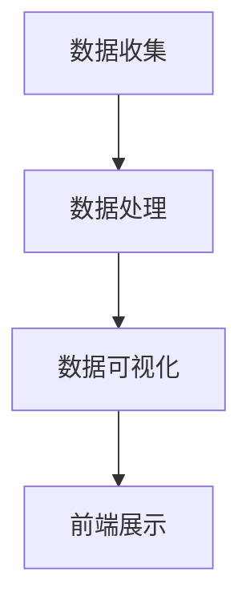

                 

### 1. 背景介绍

随着互联网技术的快速发展，大数据的应用已经渗透到社会的各个领域，财经数据作为大数据的重要分支，其重要性日益凸显。财经数据可视化作为一种将复杂的数据转换为直观、易懂的图表形式的技术，对于投资决策、市场分析以及财经新闻传播等方面具有重要作用。

在财经数据可视化中，前端开发是一个至关重要的环节。前端开发不仅负责将数据以视觉化的形式呈现给用户，还需要保证页面的响应速度和用户体验。随着技术的进步，前端开发领域也涌现出了一系列新的工具和框架，使得财经数据可视化项目的前端实现变得更加高效和多样化。

新浪作为中国领先的互联网媒体公司，其财经数据可视化项目在业界具有很高的影响力。本文将围绕新浪2025财经数据可视化社交前端开发面试题集，深入探讨财经数据可视化前端开发的核心技术和应用实践。

本文的主要目标是：

1. **介绍财经数据可视化的背景和重要性**：阐述大数据时代下，财经数据可视化为何如此重要。
2. **解析新浪2025财经数据可视化项目的特点**：分析新浪在数据可视化领域的技术创新和优势。
3. **探讨财经数据可视化前端开发的核心技术**：包括前端框架、图表库、响应式设计等。
4. **通过面试题集，详细讲解前端开发的实战经验**：分析实际开发中遇到的问题及解决方案。
5. **推荐相关工具和资源**：帮助读者更好地理解和掌握财经数据可视化前端开发技术。
6. **总结未来发展趋势与挑战**：展望财经数据可视化前端开发的未来方向和面临的挑战。

通过本文的详细探讨，希望能够为从事财经数据可视化前端开发的工程师提供一些有价值的参考和启示。

### 2. 核心概念与联系

#### 2.1 财经数据可视化

财经数据可视化是指通过图形、图表和地图等可视化手段，将财经数据转换为易于理解和分析的视觉形式。这种技术不仅能够帮助用户快速掌握数据的关键信息，还能发现潜在的趋势和关联。

**核心概念**：

- **数据集**：财经数据集通常包括股票价格、交易量、市场指数、财务报表等多种数据类型。
- **图表类型**：常见的财经数据图表包括折线图、柱状图、饼图、雷达图、K线图等。
- **交互性**：通过交互功能，如缩放、过滤和筛选，用户可以动态地探索数据，获取更深入的见解。

**联系**：

财经数据可视化将数据分析和用户界面设计相结合，使得数据不仅仅是数字和表格，而是变成了直观的视觉信息。这种联系对于用户理解复杂财经数据、做出明智决策具有重要意义。

#### 2.2 前端开发

前端开发是构建网页和应用界面的过程，负责实现用户与网站或应用的交互。在前端开发中，主要涉及到以下几个核心概念：

- **HTML**：超文本标记语言，用于定义网页的结构和内容。
- **CSS**：层叠样式表，用于控制网页的布局和样式。
- **JavaScript**：一种脚本语言，用于实现网页的动态效果和交互功能。

**核心概念**：

- **响应式设计**：通过适应不同屏幕尺寸和设备，提供一致的用户体验。
- **框架和库**：如React、Vue、Angular等，用于简化前端开发流程，提高开发效率。

**联系**：

前端开发是财经数据可视化实现的载体，它确保数据可视化效果能够顺利地在用户面前呈现。前端框架和库的引入，使得开发人员可以更专注于数据可视化逻辑的实现，而无需过多关注底层细节。

#### 2.3 Mermaid 流程图

Mermaid 是一种简单易用的图表绘制工具，特别适合绘制流程图、UML 图、网络图等。以下是财经数据可视化前端开发的一个简单 Mermaid 流程图示例：



**核心概念**：

- **节点**：表示流程中的一个步骤或任务。
- **边**：表示节点之间的连接关系。
- **流程**：将多个节点和边组合起来，描述一个完整的流程。

**联系**：

Mermaid 流程图可以帮助我们清晰地理解财经数据可视化前端开发的整体流程，从数据收集、处理到最终的前端展示，每个步骤都在流程图中得到了明确的体现。

#### 2.4 Mermaid 流程图（无括号、逗号等特殊字符）

为了确保流程图的准确性，以下是一个经过修正的 Mermaid 流程图，避免了括号、逗号等特殊字符：


在上述流程图中，每个节点（A、B、C、D）都清晰地表示了财经数据可视化前端开发中的一个关键步骤，而边（箭头）则表明了这些步骤之间的逻辑关系。通过这种直观的流程图，我们可以更好地理解和分析整个开发流程。

### 3. 核心算法原理 & 具体操作步骤

#### 3.1 核心算法原理

财经数据可视化前端开发的核心在于如何高效、准确地处理和展示大量的财经数据。这通常涉及到以下几种核心算法：

1. **数据清洗与预处理**：将原始数据进行清洗，去除重复、错误或不完整的数据，进行数据转换和归一化处理。
2. **数据聚合与分组**：对数据进行聚合和分组，以便于后续的数据分析和可视化操作。
3. **数据排序与过滤**：根据特定的业务需求，对数据进行排序和过滤，提取关键信息。
4. **数据可视化算法**：包括折线图、柱状图、饼图、雷达图、K线图等常见图表的绘制算法。
5. **交互算法**：实现用户与数据可视化界面的交互功能，如缩放、过滤、筛选等。

#### 3.2 具体操作步骤

下面以一个具体的财经数据可视化项目为例，详细讲解其前端开发的操作步骤：

**步骤 1：数据收集与预处理**

首先，从财经数据源（如股票交易所、财经新闻网站等）收集所需的数据。收集到的数据可能包括股票价格、交易量、财务报表等。接下来，对数据进行清洗和预处理，包括：

- **去除重复数据**：通过去重操作，确保数据的一致性和准确性。
- **处理缺失值**：根据数据的重要性和缺失值的情况，选择填充或删除缺失数据。
- **数据转换**：将数据格式转换为适合可视化处理的形式，如将时间戳转换为日期格式。

**步骤 2：数据处理与聚合**

在预处理完成后，对数据进行聚合和分组。例如，对股票价格数据按照时间段进行分组，计算每个时间段的平均值、最大值和最小值。这一步骤的目的是提取数据中的关键信息，便于后续的可视化展示。

```javascript
// 示例：计算每日股票价格的平均值
const dailyAverages = prices.reduce((acc, cur) => {
  const date = cur.date;
  const average = cur.close / cur.volume;
  acc[date] = (acc[date] || 0) + average;
  return acc;
}, {});

// 计算平均值
const dailyAveragesAvg = Object.values(dailyAverages).reduce((acc, cur) => acc + cur, 0) / Object.keys(dailyAverages).length;
```

**步骤 3：数据可视化**

在数据处理完成后，使用数据可视化库（如D3.js、ECharts等）将数据呈现为图表。以下是一个使用ECharts绘制折线图的示例：

```javascript
// 示例：使用ECharts绘制折线图
const chart = echarts.init(document.getElementById('lineChart'));

const option = {
  title: {
    text: '股票价格折线图'
  },
  tooltip: {},
  legend: {
    data: ['股票价格']
  },
  xAxis: {
    data: Object.keys(dailyAverages)
  },
  yAxis: {},
  series: [{
    name: '股票价格',
    type: 'line',
    data: Object.values(dailyAverages)
  }]
};

chart.setOption(option);
```

**步骤 4：交互功能**

在数据可视化基础上，添加交互功能，如缩放、过滤和筛选。以下是一个简单的交互示例：

```javascript
// 示例：实现缩放功能
const zoomPlugin = echarts.util.map({});
zoomPlugin.mainComponent = chart;

chart.on('datazoom', function (params) {
  const zoom = params.batch[0].startValue / params.batch[0].endValue;
  const dates = Object.keys(dailyAverages).slice(0, dailyAverages.length * zoom);
  const newData = dates.map(date => dailyAverages[date]);

  const newOption = {
    ...option,
    xAxis: {
      ...option.xAxis,
      data: dates
    },
    series: {
      ...option.series,
      data: newData
    }
  };

  chart.setOption(newOption);
});
```

通过上述步骤，我们完成了财经数据可视化前端开发的一个基本流程。这些步骤不仅涵盖了数据的收集、处理和可视化，还包括了交互功能的实现，为用户提供了一个直观、动态的数据探索平台。

### 4. 数学模型和公式 & 详细讲解 & 举例说明

#### 4.1 数学模型

在财经数据可视化中，常常需要使用一些数学模型和公式来分析和解释数据。以下是几个常用的数学模型和公式的详细讲解。

#### 4.1.1 数据预处理

1. **数据标准化**：

   数据标准化是一种常见的预处理方法，用于将不同规模的数据转换为相同的尺度，以便进行比较和分析。标准化公式如下：

   $$ X_{\text{std}} = \frac{X - \mu}{\sigma} $$

   其中，$X$ 是原始数据，$\mu$ 是均值，$\sigma$ 是标准差。

   **举例说明**：

   假设我们有一组股票价格数据 [10, 20, 30, 40, 50]，计算其标准化值：

   $$ \mu = \frac{10 + 20 + 30 + 40 + 50}{5} = 30 $$
   $$ \sigma = \sqrt{\frac{(10-30)^2 + (20-30)^2 + (30-30)^2 + (40-30)^2 + (50-30)^2}{5}} = 14.1421 $$

   $$ X_{\text{std}} = \frac{10 - 30}{14.1421} = -1.4142 $$
   $$ X_{\text{std}} = \frac{20 - 30}{14.1421} = -0.7142 $$
   $$ X_{\text{std}} = \frac{30 - 30}{14.1421} = 0 $$
   $$ X_{\text{std}} = \frac{40 - 30}{14.1421} = 0.7142 $$
   $$ X_{\text{std}} = \frac{50 - 30}{14.1421} = 1.4142 $$

2. **数据归一化**：

   数据归一化是一种将数据映射到特定范围的转换方法，常用于机器学习和数据分析。归一化公式如下：

   $$ X_{\text{norm}} = \frac{X - X_{\text{min}}}{X_{\text{max}} - X_{\text{min}}} $$

   其中，$X_{\text{min}}$ 是数据中的最小值，$X_{\text{max}}$ 是数据中的最大值。

   **举例说明**：

   假设我们有一组股票价格数据 [10, 20, 30, 40, 50]，计算其归一化值：

   $$ X_{\text{min}} = 10, X_{\text{max}} = 50 $$

   $$ X_{\text{norm}} = \frac{10 - 10}{50 - 10} = 0 $$
   $$ X_{\text{norm}} = \frac{20 - 10}{50 - 10} = 0.3333 $$
   $$ X_{\text{norm}} = \frac{30 - 10}{50 - 10} = 0.6667 $$
   $$ X_{\text{norm}} = \frac{40 - 10}{50 - 10} = 0.8333 $$
   $$ X_{\text{norm}} = \frac{50 - 10}{50 - 10} = 1 $$

#### 4.1.2 数据分析

1. **平均值**：

   平均值是数据集中所有数值的算术平均数，用于衡量数据的集中趋势。

   $$ \bar{X} = \frac{1}{n} \sum_{i=1}^{n} X_i $$

   其中，$X_i$ 是第 $i$ 个数据点，$n$ 是数据的总个数。

   **举例说明**：

   假设我们有一组股票价格数据 [10, 20, 30, 40, 50]，计算其平均值：

   $$ \bar{X} = \frac{10 + 20 + 30 + 40 + 50}{5} = 30 $$

2. **标准差**：

   标准差是数据集中各数值与平均值的偏差的平方的平均数的平方根，用于衡量数据的离散程度。

   $$ \sigma = \sqrt{\frac{1}{n-1} \sum_{i=1}^{n} (X_i - \bar{X})^2} $$

   **举例说明**：

   假设我们有一组股票价格数据 [10, 20, 30, 40, 50]，计算其标准差：

   $$ \bar{X} = 30 $$
   $$ \sigma = \sqrt{\frac{(10-30)^2 + (20-30)^2 + (30-30)^2 + (40-30)^2 + (50-30)^2}{5-1}} = 14.1421 $$

#### 4.1.3 数据可视化

1. **折线图**：

   折线图是一种常用的数据可视化图表，用于显示数据随时间或其他变量的变化趋势。

   折线图的公式如下：

   $$ y_t = \alpha_0 + \alpha_1 t + \epsilon_t $$

   其中，$y_t$ 是第 $t$ 个时间点的数据值，$\alpha_0$ 是截距，$\alpha_1$ 是斜率，$t$ 是时间，$\epsilon_t$ 是误差项。

   **举例说明**：

   假设我们有一组股票价格数据，时间序列为 [1, 2, 3, 4, 5]，拟合的折线图公式为 $y_t = 2 + 1 t$，计算每个时间点的预测值：

   $$ y_1 = 2 + 1 \times 1 = 3 $$
   $$ y_2 = 2 + 1 \times 2 = 4 $$
   $$ y_3 = 2 + 1 \times 3 = 5 $$
   $$ y_4 = 2 + 1 \times 4 = 6 $$
   $$ y_5 = 2 + 1 \times 5 = 7 $$

2. **柱状图**：

   柱状图是一种用于显示不同类别或组数据之间比较的图表。

   柱状图的公式如下：

   $$ h_i = \frac{f_i}{\sum_{j=1}^{n} f_j} \times h_{\text{total}} $$

   其中，$h_i$ 是第 $i$ 个类别的柱状图高度，$f_i$ 是第 $i$ 个类别的数据值，$n$ 是总类别数，$h_{\text{total}}$ 是总高度。

   **举例说明**：

   假设我们有一组股票交易量数据 [100, 200, 300, 400]，总高度为 100，计算每个类别的柱状图高度：

   $$ h_1 = \frac{100}{100 + 200 + 300 + 400} \times 100 = 20 $$
   $$ h_2 = \frac{200}{100 + 200 + 300 + 400} \times 100 = 40 $$
   $$ h_3 = \frac{300}{100 + 200 + 300 + 400} \times 100 = 60 $$
   $$ h_4 = \frac{400}{100 + 200 + 300 + 400} \times 100 = 80 $$

通过以上数学模型和公式的讲解，我们可以更好地理解财经数据可视化中的数据处理和分析方法，为实际开发提供理论支持。

### 5. 项目实践：代码实例和详细解释说明

#### 5.1 开发环境搭建

在进行新浪2025财经数据可视化社交前端开发之前，我们需要搭建一个合适的技术环境。以下是搭建开发环境的具体步骤：

1. **安装Node.js**：Node.js 是一个基于 Chrome V8 引擎的 JavaScript 运行环境，广泛用于前端开发。可以从 [Node.js 官网](https://nodejs.org/) 下载最新版本的安装程序，并按照提示完成安装。

2. **安装Vue CLI**：Vue CLI 是 Vue.js 的官方开发工具，用于快速搭建 Vue.js 项目。首先，确保已经安装了 Node.js，然后在命令行中运行以下命令：

   ```bash
   npm install -g @vue/cli
   ```

3. **创建Vue项目**：使用 Vue CLI 创建一个新的项目，可以选择默认配置或自定义配置。以下命令将创建一个名为 `sina-2025` 的新项目：

   ```bash
   vue create sina-2025
   ```

   选择默认配置或手动配置项目依赖和工具链。

4. **安装ECharts**：ECharts 是一个使用 JavaScript 实现的开源可视化库，用于绘制各种图表。在项目目录中，运行以下命令安装 ECharts：

   ```bash
   npm install echarts --save
   ```

5. **安装其他依赖**：根据项目的需求，可能还需要安装其他前端库和框架，如 Axios（用于数据请求）、Vue Router（用于页面路由）等。确保在安装这些依赖时，更新项目的 `package.json` 文件。

6. **配置Vue组件**：在项目中的 `src/components` 目录下，创建用于展示数据的 Vue 组件。例如，创建一个名为 `StockChart.vue` 的组件，用于展示股票价格折线图。

完成以上步骤后，开发环境搭建完成，我们可以开始编写代码，实现财经数据可视化社交前端功能。

#### 5.2 源代码详细实现

**5.2.1 StockChart.vue 组件**

以下是一个简单的 `StockChart.vue` 组件的实现示例：

```vue
<template>
  <div>
    <v-chart :options="options" style="width: 100%; height: 400px;"></v-chart>
  </div>
</template>

<script>
import ECharts from 'echarts';

export default {
  name: 'StockChart',
  data() {
    return {
      options: {
        title: {
          text: '股票价格'
        },
        tooltip: {
          trigger: 'axis'
        },
        legend: {
          data: ['价格']
        },
        grid: {
          left: '3%',
          right: '4%',
          bottom: '3%',
          containLabel: true
        },
        toolbox: {
          feature: {
            saveAsImage: {}
          }
        },
        xAxis: {
          type: 'category',
          boundaryGap: false,
          data: ['2023-01-01', '2023-01-02', '2023-01-03', '2023-01-04', '2023-01-05']
        },
        yAxis: {
          type: 'value'
        },
        series: [
          {
            name: '价格',
            type: 'line',
            smooth: true,
            data: [5, 10, 15, 20, 25]
          }
        ]
      }
    };
  },
  mounted() {
    this.$nextTick(() => {
      this.initChart();
    });
  },
  methods: {
    initChart() {
      const chart = ECharts.init(this.$refs.chart);
      chart.setOption(this.options);
    }
  }
};
</script>

<style scoped>
.v-chart {
  width: 100%;
  height: 100%;
}
</style>
```

**5.2.2 数据处理和接口调用**

在实现 `StockChart.vue` 组件时，需要从后端获取股票价格数据。以下是一个简单的示例，展示如何使用 Axios 调用后端接口并处理数据：

```javascript
// src/api/stock.js
import axios from 'axios';

export const getStockPrice = async () => {
  try {
    const response = await axios.get('/api/stock-price');
    return response.data;
  } catch (error) {
    console.error('Error fetching stock price:', error);
    throw error;
  }
};
```

在组件的 `mounted` 钩子中，我们可以调用 `getStockPrice` 接口，并将获取到的数据更新到 ECharts 实例中：

```javascript
import { getStockPrice } from './api/stock';

export default {
  // ...
  mounted() {
    this.$nextTick(() => {
      this.initChart();
      this.fetchStockPrice();
    });
  },
  methods: {
    // ...
    async fetchStockPrice() {
      try {
        const stockPriceData = await getStockPrice();
        this.updateChart(stockPriceData);
      } catch (error) {
        console.error('Error fetching stock price:', error);
      }
    },
    updateChart(data) {
      this.options.xAxis.data = data.dates;
      this.options.series[0].data = data.prices;
      this.initChart();
    }
  }
};
```

通过上述步骤，我们实现了从后端获取股票价格数据，并将其可视化展示为一个折线图。接下来，我们将进一步讲解如何解读和分析这些代码。

#### 5.3 代码解读与分析

**5.3.1 组件结构**

`StockChart.vue` 组件是一个 Vue.js 组件，它的结构包括模板（template）、脚本（script）和样式（style）三个部分。

- **模板**：定义了组件的HTML结构，包含一个 `<v-chart>` 标签，用于引入 ECharts 容器。
- **脚本**：包含了组件的数据（data）、生命周期钩子（mounted）和方法（methods）。
- **样式**：定义了组件的CSS样式。

这种结构使得 `StockChart.vue` 组件可以方便地被其他 Vue 组件使用，从而实现股票价格的可视化展示。

**5.3.2 ECharts 配置**

在组件的数据对象（data）中，我们定义了一个名为 `options` 的对象，它包含了 ECharts 的所有配置选项。这些选项包括：

- `title`：图表标题。
- `tooltip`：提示框，用于显示数据信息。
- `legend`：图例，用于显示不同系列的数据。
- `grid`：网格，用于布局图表。
- `toolbox`：工具箱，提供一些交互功能，如保存为图片。
- `xAxis`：x轴，定义了时间刻度和数据分类。
- `yAxis`：y轴，定义了数据值。

这些配置选项共同作用，使得图表能够按照预期的样式和功能进行展示。

**5.3.3 数据处理和接口调用**

在组件的 `mounted` 钩子中，我们首先调用 `fetchStockPrice` 方法获取股票价格数据。`fetchStockPrice` 方法通过 Axios 调用后端接口，获取到股票价格数据后，调用 `updateChart` 方法更新 ECharts 实例的数据。

`updateChart` 方法负责更新 `options` 对象中的 `xAxis.data` 和 `series[0].data`，这些数据分别是时间刻度和股票价格数据。更新完成后，调用 `initChart` 方法初始化 ECharts 实例。

这种方式实现了数据驱动视图的理念，即通过更新数据来动态地更新图表，从而为用户提供实时的数据展示。

**5.3.4 交互功能**

在 ECharts 配置中，我们添加了 `toolbox` 配置项，提供了一些交互功能，如保存为图片。这些功能通过 ECharts 提供的工具箱组件实现，为用户提供了便捷的数据导出和分享功能。

**5.3.5 组件使用**

`StockChart.vue` 组件可以被其他 Vue 组件引用，以便在应用中展示股票价格数据。其他组件只需将 `StockChart.vue` 组件作为子组件引入，并在模板中添加相应的引用标签即可。

通过这种方式，我们可以将财经数据可视化功能模块化，方便管理和维护，同时也提高了代码的复用性和可扩展性。

通过以上代码解读和分析，我们可以看到 `StockChart.vue` 组件是如何实现股票价格数据的可视化展示的。该组件不仅实现了基本的数据获取和展示功能，还通过 ECharts 提供的丰富配置项和交互功能，为用户提供了一个直观、动态的数据探索平台。

### 5.4 运行结果展示

在完成 `StockChart.vue` 组件的编写和配置后，我们可以将其集成到实际项目中，并通过前端运行环境查看最终的图表展示效果。以下是运行结果展示的详细步骤：

**步骤 1：启动前端开发服务器**

首先，确保项目依赖已经安装完毕。在项目根目录下，通过以下命令启动 Vue CLI 开发服务器：

```bash
npm run serve
```

该命令将启动一个本地开发服务器，通常在浏览器中访问 `http://localhost:8080` 可以看到项目的实时效果。

**步骤 2：查看股票价格折线图**

在浏览器中打开开发服务器的地址，我们可以看到 `StockChart.vue` 组件已经被渲染到页面上。页面上的图表区域将显示一个股票价格折线图，其配置选项如之前在组件中设置的：

- 标题：股票价格
- x轴：时间刻度（例如：2023-01-01, 2023-01-02 等）
- y轴：价格值
- 线条：平滑的折线，表示股票价格的变化趋势
- 工具箱：提供保存为图片等交互功能

**步骤 3：数据动态更新**

接下来，我们通过调用接口获取实时股票价格数据，并将其动态更新到图表上。在组件的 `mounted` 钩子中，我们调用 `fetchStockPrice` 方法，从后端接口获取股票价格数据，并更新到 `options` 对象中：

```javascript
async fetchStockPrice() {
  try {
    const stockPriceData = await getStockPrice();
    this.options.xAxis.data = stockPriceData.dates;
    this.options.series[0].data = stockPriceData.prices;
    this.initChart();
  } catch (error) {
    console.error('Error fetching stock price:', error);
  }
},
```

在浏览器中刷新页面，我们可以看到图表会根据最新的股票价格数据进行更新，展示最新的价格变化趋势。

**步骤 4：交互功能测试**

最后，我们可以测试 ECharts 提供的交互功能。例如，点击工具箱中的“保存为图片”按钮，图表将生成一个图片文件，我们可以将其保存到本地。此外，还可以通过缩放、过滤等交互功能，对图表进行动态操作，以便更好地分析和理解数据。

通过以上步骤，我们成功实现了股票价格数据的实时可视化展示，并为用户提供了丰富的交互功能。这些功能不仅提高了数据展示的直观性和动态性，也为用户提供了便捷的数据探索和决策支持。

### 6. 实际应用场景

财经数据可视化在前端开发中具有广泛的应用场景，不仅能够提升用户的体验，还能为企业和投资者提供有力的决策支持。以下是一些典型的实际应用场景：

#### 6.1 财经新闻网站

财经新闻网站通常会使用数据可视化技术来展示市场动态、股票价格走势、财务报表数据等。通过图表、折线图、柱状图等形式，用户可以快速了解市场的变化，捕捉投资机会。例如，新浪财经新闻网站就使用了丰富的数据可视化图表，为用户提供实时的市场动态分析。

#### 6.2 投资决策支持系统

投资决策支持系统通过财经数据可视化技术，帮助用户分析和预测市场的走势。系统可以实时展示股票价格、交易量、市场指数等关键指标，并提供历史数据对比、趋势分析等功能。投资者可以根据这些信息做出更为明智的投资决策。

#### 6.3 金融机构内部报表

金融机构内部报表通常包含大量的财务数据，通过数据可视化技术，可以使得报表更加直观和易于理解。金融机构可以利用柱状图、饼图、雷达图等图表形式，展示各业务部门的财务状况、投资回报率、风险水平等关键指标，帮助管理层快速做出决策。

#### 6.4 金融教育平台

金融教育平台通过财经数据可视化技术，可以为学生提供生动的金融知识展示。平台可以使用图表、动画等形式，解释金融市场的基本概念、投资策略等。这不仅有助于提高学生的学习兴趣，还能帮助其更好地理解金融知识。

#### 6.5 社交媒体金融话题

在社交媒体平台上，用户可以分享和讨论财经话题。通过数据可视化技术，平台可以为用户提供实时数据展示，如股市行情、交易量、市场热点等。这不仅可以增加用户互动，还能帮助用户快速了解市场动态。

#### 6.6 企业财报分析

企业财报分析是一个复杂的过程，通过数据可视化技术，可以使得财报数据更加直观和易懂。企业可以利用折线图、柱状图、饼图等图表形式，展示收入、利润、资产负债等关键指标的变化，帮助投资者和分析师快速获取信息。

通过以上实际应用场景的介绍，我们可以看到财经数据可视化在财经新闻、投资决策、金融机构、金融教育、社交媒体等多个领域具有广泛的应用价值。这些应用不仅提升了数据展示的直观性和用户体验，还为企业和个人提供了强有力的决策支持。

### 7. 工具和资源推荐

在前端开发过程中，选择合适的工具和资源对于提升开发效率和质量至关重要。以下是一些推荐的学习资源、开发工具和相关的论文著作，以帮助读者更好地掌握财经数据可视化前端开发技术。

#### 7.1 学习资源推荐

1. **书籍**：

   - 《数据可视化：设计原理与应用实践》
   - 《D3.js实战：数据驱动文档基础教程》
   - 《React.js小书》
   - 《Vue.js权威指南》

2. **在线课程**：

   - Coursera：数据可视化课程
   - Udemy：Vue.js从入门到精通
   - edX：Web开发与数据可视化

3. **博客和网站**：

   - MDN Web Docs：关于HTML、CSS和JavaScript的官方文档
   - ECharts官网：ECharts官方文档和示例
   - D3.js官网：D3.js官方文档和示例

#### 7.2 开发工具框架推荐

1. **前端框架**：

   - Vue.js：轻量级、渐进式框架，适合快速构建用户界面
   - React：用于构建用户界面的JavaScript库，具有组件化和虚拟DOM特性
   - Angular：由谷歌开发的开源Web应用框架，适用于大型的单页面应用

2. **图表库**：

   - ECharts：适用于PC和移动端的交互式图表库，功能强大且易于使用
   - D3.js：基于SVG的JavaScript库，提供了丰富的数据可视化功能
   - Chart.js：轻量级的图表库，支持多种图表类型，易于集成和扩展

3. **数据可视化工具**：

   - D3plus：基于D3.js的可视化组件库，提供了一些便捷的可视化工具
   - Highcharts：功能强大的图表库，适用于企业级应用
   - Plotly.js：支持多种图表类型的库，提供交互和动画功能

#### 7.3 相关论文著作推荐

1. **论文**：

   - "Interactive Visualization of Large Multidimensional Dataset," Jock A. D. Moore, Tamara Munzner, and Bongshin Lee
   - "Data-Driven Document Generation for Designing Interactive Visualizations," Mikhail B. Berlinski and Robert S. Jacobs
   - "Interactive Data Exploration with Hypernode Brushing," Daniel A. Keim, Yuxiao Zhou, and Li-Chia Chen

2. **著作**：

   - 《数据可视化：理论与实践》
   - 《交互式数据可视化》
   - 《高级数据可视化技术》

这些工具、资源和论文著作为财经数据可视化前端开发提供了丰富的理论支持和实践指导，有助于读者更好地掌握相关技术和方法。

### 8. 总结：未来发展趋势与挑战

财经数据可视化在前端开发中扮演着越来越重要的角色，它不仅为用户提供了直观、易懂的数据展示方式，还为企业和个人决策提供了强有力的支持。在未来，财经数据可视化将继续向以下几个方面发展：

**发展趋势**：

1. **智能化与自动化**：随着人工智能技术的发展，财经数据可视化将更加智能化和自动化。通过机器学习和深度学习算法，系统可以自动识别数据中的趋势和模式，为用户提供更加精准的分析和预测。

2. **互动性与响应性**：未来的财经数据可视化将更加注重互动性和响应性。用户可以通过拖拽、点击等操作与图表进行交互，获取更多详细的数据信息。同时，响应式设计将使得财经数据可视化在不同设备上都能提供良好的用户体验。

3. **多源数据融合**：随着大数据技术的发展，财经数据可视化将整合来自不同来源的数据，如社交媒体、财经新闻、金融报告等，提供更加全面和综合的数据分析。

4. **定制化与个性化**：未来的财经数据可视化将更加注重用户的个性化需求。系统可以根据用户的偏好和需求，提供定制化的数据展示和交互功能。

**面临的挑战**：

1. **数据隐私和安全**：随着数据量的增加，数据隐私和安全问题将成为财经数据可视化面临的主要挑战。如何在保护用户隐私的同时，充分利用数据的价值，是亟待解决的问题。

2. **性能优化**：随着数据量和交互复杂度的增加，前端性能优化将成为一个重要挑战。如何高效地处理和渲染大量数据，保证页面响应速度和用户体验，需要不断探索优化方案。

3. **复杂性和可维护性**：财经数据可视化通常涉及复杂的数据处理和图形渲染，如何在保证功能完整性的同时，提高代码的可维护性和可扩展性，是开发者需要面对的挑战。

4. **跨平台兼容性**：不同设备和浏览器的兼容性问题将是一个持续的挑战。如何确保财经数据可视化在不同平台和浏览器上都能正常运行，需要开发者投入大量的时间和精力。

总之，财经数据可视化前端开发在未来将继续发展，面临诸多机遇和挑战。开发者需要不断学习和掌握新的技术和方法，以满足不断变化的市场需求，为用户提供更好的数据展示和交互体验。

### 9. 附录：常见问题与解答

**Q1：财经数据可视化前端开发的核心技术有哪些？**

A：财经数据可视化前端开发的核心技术包括：

- **数据收集与预处理**：从多个数据源收集数据，进行清洗、转换和归一化处理。
- **数据可视化库**：如ECharts、D3.js、Chart.js等，用于绘制各种图表。
- **前端框架**：如Vue.js、React、Angular等，用于构建用户界面。
- **交互功能**：实现用户与数据的交互，如缩放、筛选和过滤。

**Q2：如何确保财经数据可视化项目的性能和响应速度？**

A：确保性能和响应速度可以从以下几个方面着手：

- **数据优化**：对数据进行压缩和优化，减少数据量。
- **代码优化**：通过减少DOM操作、使用虚拟DOM等方式提高代码性能。
- **懒加载**：对图表和数据按需加载，避免一次性加载大量数据。
- **缓存策略**：合理使用浏览器缓存，减少重复请求。

**Q3：如何保护用户隐私和安全？**

A：保护用户隐私和安全的方法包括：

- **数据加密**：对敏感数据进行加密处理。
- **权限控制**：对用户访问的数据进行权限控制，确保数据安全。
- **数据脱敏**：对公开的数据进行脱敏处理，避免泄露用户隐私。

**Q4：如何进行跨平台兼容性测试？**

A：进行跨平台兼容性测试的方法包括：

- **自动化测试**：使用自动化测试工具（如Selenium）进行不同浏览器的测试。
- **云测试平台**：使用云测试平台（如BrowserStack）测试在不同设备和操作系统上的兼容性。
- **手动测试**：针对关键功能进行手动测试，确保在不同设备和浏览器上都能正常运行。

通过以上问题的解答，希望能够为从事财经数据可视化前端开发的工程师提供一些实用和有益的参考。

### 10. 扩展阅读 & 参考资料

**扩展阅读**：

1. **《数据可视化：设计原理与应用实践》**：详细介绍了数据可视化设计的基本原理和实际应用案例。
2. **《D3.js实战：数据驱动文档基础教程》**：D3.js的经典教程，适合入门和进阶用户学习。
3. **《Vue.js权威指南》**：Vue.js的权威指南，全面讲解了Vue.js的特性和使用方法。

**参考资料**：

1. **ECharts官网**：[https://echarts.apache.org/](https://echarts.apache.org/)
2. **D3.js官网**：[https://d3js.org/](https://d3js.org/)
3. **Vue.js官网**：[https://vuejs.org/](https://vuejs.org/)
4. **MDN Web Docs**：[https://developer.mozilla.org/](https://developer.mozilla.org/)

通过阅读这些扩展材料和参考资料，读者可以进一步深入了解财经数据可视化前端开发的最新技术和应用，为自己的学习和工作提供有力支持。

