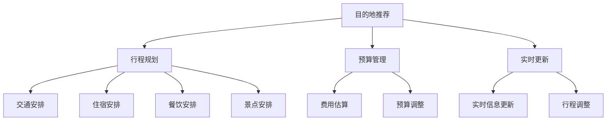

                 

### 文章标题

**旅行规划工具：定制化旅行体验的设计师**

> **关键词**：旅行规划、定制化体验、人工智能、数据分析、用户界面设计

**摘要**：随着人工智能技术的发展和用户需求的不断提高，旅行规划工具逐渐成为定制化旅行体验的设计师。本文将深入探讨旅行规划工具的核心概念、算法原理、数学模型、项目实践，并分析其在实际应用场景中的优势和挑战。此外，还将推荐相关学习资源、开发工具和论文著作，为读者提供全面的指导。

---

### 1. 背景介绍

旅行规划工具作为人工智能和数据分析领域的重要应用，旨在为用户提供个性化的旅行建议和定制化体验。随着全球旅游业的发展，旅行规划工具的市场需求日益增长。传统的旅行规划方式往往依赖于用户手动搜索和筛选，耗时费力且效率低下。而旅行规划工具通过整合大量数据源、利用先进算法和用户行为分析，能够为用户提供高效、智能的旅行规划服务。

旅行规划工具的核心功能包括：

1. **目的地推荐**：根据用户偏好和历史行为，推荐最适合的目的地和旅游景点。
2. **行程规划**：根据用户的时间和预算，自动生成最佳旅行行程，包括交通、住宿、餐饮和景点等。
3. **预算管理**：为用户估算旅行费用，并提供预算调整建议。
4. **实时更新**：根据实时天气、航班、交通等信息，为用户调整行程计划。

旅行规划工具的发展离不开人工智能和大数据技术的支持。通过机器学习算法，工具能够不断学习和优化，为用户提供更加精准和个性化的旅行建议。同时，数据挖掘和数据分析技术使得工具能够从海量数据中提取有价值的信息，从而提升用户体验。

本文将从以下几个方面对旅行规划工具进行深入探讨：

1. **核心概念与联系**：介绍旅行规划工具的关键概念和架构。
2. **核心算法原理 & 具体操作步骤**：详细解析旅行规划工具的算法原理和实现过程。
3. **数学模型和公式 & 详细讲解 & 举例说明**：探讨旅行规划工具中的数学模型和公式，并通过实例进行详细解释。
4. **项目实践：代码实例和详细解释说明**：通过具体代码实例，展示旅行规划工具的实现过程和关键步骤。
5. **实际应用场景**：分析旅行规划工具在不同场景下的应用和效果。
6. **工具和资源推荐**：推荐学习资源、开发工具和论文著作，帮助读者深入了解旅行规划工具。
7. **总结：未来发展趋势与挑战**：总结旅行规划工具的发展趋势和面临的挑战。
8. **附录：常见问题与解答**：解答读者可能遇到的问题，提供实用的建议。

### 2. 核心概念与联系

旅行规划工具的核心概念包括目的地推荐、行程规划、预算管理和实时更新等。这些概念之间相互关联，共同构成了旅行规划工具的完整架构。下面我们将通过Mermaid流程图来展示这些核心概念和它们之间的联系。



- **目的地推荐**：根据用户偏好和历史行为，推荐最适合的目的地和旅游景点。
- **行程规划**：根据用户的时间和预算，自动生成最佳旅行行程，包括交通、住宿、餐饮和景点等。
- **预算管理**：为用户估算旅行费用，并提供预算调整建议。
- **实时更新**：根据实时天气、航班、交通等信息，为用户调整行程计划。

以上流程图展示了旅行规划工具的核心功能模块及其之间的关联。通过这些模块的协同工作，旅行规划工具能够为用户提供全面、智能的旅行规划服务。

### 3. 核心算法原理 & 具体操作步骤

旅行规划工具的核心算法主要包括目的地推荐算法、行程规划算法、预算管理算法和实时更新算法。这些算法共同作用，实现了旅行规划工具的智能化和个性化。下面我们将逐一介绍这些算法的原理和具体操作步骤。

#### 3.1 目的地推荐算法

目的地推荐算法是旅行规划工具的关键组成部分。其目的是根据用户偏好和历史行为，为用户推荐最适合的目的地和旅游景点。推荐算法的原理可以概括为以下几个步骤：

1. **用户画像构建**：通过分析用户的历史行为数据（如搜索记录、预订记录、评论等），构建用户的个性化画像。
2. **相似用户识别**：利用协同过滤算法，识别与目标用户相似的用户群体。
3. **目的地推荐**：根据相似用户的行为数据和用户画像，为用户推荐潜在感兴趣的目的地和旅游景点。

具体操作步骤如下：

1. **数据预处理**：将原始用户行为数据清洗和归一化，提取出有用的特征。
2. **用户画像构建**：使用机器学习算法（如K-means聚类、因子分析等）对用户行为数据进行建模，构建用户的个性化画像。
3. **相似用户识别**：计算用户之间的相似度，使用协同过滤算法（如基于用户的协同过滤、基于物品的协同过滤等）识别与目标用户相似的用户群体。
4. **目的地推荐**：根据相似用户的行为数据和用户画像，为用户推荐潜在感兴趣的目的地和旅游景点。

#### 3.2 行程规划算法

行程规划算法的目标是根据用户的时间和预算，自动生成最佳旅行行程。行程规划算法的原理可以概括为以下几个步骤：

1. **约束条件定义**：定义用户旅行行程的约束条件，如时间范围、预算限制、交通方式等。
2. **行程生成**：利用优化算法（如遗传算法、模拟退火算法等），生成满足约束条件的最佳旅行行程。
3. **行程优化**：根据用户反馈和实时信息，对行程进行优化和调整。

具体操作步骤如下：

1. **约束条件定义**：根据用户输入的时间和预算，定义旅行行程的约束条件。
2. **数据采集与预处理**：收集用户感兴趣的景点、酒店、餐厅等信息，并进行预处理。
3. **行程生成**：使用优化算法（如遗传算法、模拟退火算法等）生成满足约束条件的初步旅行行程。
4. **行程优化**：根据用户反馈和实时信息，对初步行程进行优化和调整，确保行程的可行性和最佳性。

#### 3.3 预算管理算法

预算管理算法的目标是为用户提供旅行费用的估算和预算调整建议。预算管理算法的原理可以概括为以下几个步骤：

1. **费用估算**：根据用户选择的景点、酒店、餐厅等信息，估算旅行费用。
2. **预算调整**：根据用户反馈和实时信息，为用户调整预算，确保预算的合理性和可行性。

具体操作步骤如下：

1. **费用估算**：使用机器学习算法（如回归分析、决策树等）对旅行费用进行估算。
2. **预算调整**：根据用户反馈和实时信息，对预算进行动态调整，确保预算的合理性和可行性。

#### 3.4 实时更新算法

实时更新算法的目标是根据实时天气、航班、交通等信息，为用户调整行程计划。实时更新算法的原理可以概括为以下几个步骤：

1. **实时信息采集**：从相关数据源（如天气预报、航班信息、交通状况等）采集实时信息。
2. **行程调整**：根据实时信息，对用户行程进行自动调整。
3. **用户通知**：将调整后的行程通知用户。

具体操作步骤如下：

1. **实时信息采集**：使用API接口或爬虫技术，从相关数据源采集实时信息。
2. **行程调整**：使用规则引擎或机器学习算法，根据实时信息对用户行程进行自动调整。
3. **用户通知**：通过短信、邮件或APP推送等方式，将调整后的行程通知用户。

### 4. 数学模型和公式 & 详细讲解 & 举例说明

旅行规划工具中的数学模型和公式是实现其核心算法的重要基础。下面我们将详细介绍这些数学模型和公式，并通过具体例子进行讲解。

#### 4.1 协同过滤算法

协同过滤算法是旅行规划工具中常用的推荐算法之一。其基本思想是，通过分析用户之间的相似性，为用户推荐他们可能感兴趣的项目。协同过滤算法可以分为基于用户的协同过滤和基于物品的协同过滤。

##### 4.1.1 基于用户的协同过滤

基于用户的协同过滤算法的核心公式如下：

$$
sim(u, v) = \frac{1}{|R_{uv}|}\sum_{i\in R_{uv}} r_i (u, v)
$$

其中，$sim(u, v)$ 表示用户 $u$ 和用户 $v$ 之间的相似度，$R_{uv}$ 表示用户 $u$ 和用户 $v$ 共同评价的项目集合，$r_i (u, v)$ 表示用户 $u$ 和用户 $v$ 对项目 $i$ 的评价。

**例**：假设有用户 $u$ 和用户 $v$，他们共同评价了三个项目 $A$、$B$ 和 $C$，他们的评价分别为：

用户 $u$：$r_u(A) = 4, r_u(B) = 5, r_u(C) = 3$  
用户 $v$：$r_v(A) = 5, r_v(B) = 4, r_v(C) = 5$

则用户 $u$ 和用户 $v$ 之间的相似度计算如下：

$$
sim(u, v) = \frac{1}{3}\left[ r_u(A) \cdot r_v(A) + r_u(B) \cdot r_v(B) + r_u(C) \cdot r_v(C) \right]
$$

$$
sim(u, v) = \frac{1}{3}\left[ 4 \cdot 5 + 5 \cdot 4 + 3 \cdot 5 \right] = \frac{35}{3} \approx 11.67
$$

##### 4.1.2 基于物品的协同过滤

基于物品的协同过滤算法的核心公式如下：

$$
sim(i, j) = \frac{1}{|R_{ij}|}\sum_{u\in R_{ij}} r_u (i, j)
$$

其中，$sim(i, j)$ 表示项目 $i$ 和项目 $j$ 之间的相似度，$R_{ij}$ 表示评价项目 $i$ 和项目 $j$ 的用户集合，$r_u (i, j)$ 表示用户 $u$ 对项目 $i$ 和项目 $j$ 的评价。

**例**：假设有项目 $A$、$B$ 和 $C$，三个用户 $u$、$v$ 和 $w$ 对这三个项目的评价分别为：

用户 $u$：$r_u(A) = 4, r_u(B) = 5, r_u(C) = 3$  
用户 $v$：$r_v(A) = 5, r_v(B) = 4, r_v(C) = 5$  
用户 $w$：$r_w(A) = 3, r_w(B) = 5, r_w(C) = 4$

则项目 $A$ 和项目 $B$ 之间的相似度计算如下：

$$
sim(A, B) = \frac{1}{3}\left[ r_u(A) \cdot r_v(B) + r_u(B) \cdot r_v(A) + r_w(A) \cdot r_w(B) \right]
$$

$$
sim(A, B) = \frac{1}{3}\left[ 4 \cdot 4 + 5 \cdot 5 + 3 \cdot 5 \right] = \frac{34}{3} \approx 11.33
$$

#### 4.2 优化算法

优化算法在旅行规划工具中用于解决行程规划问题。遗传算法和模拟退火算法是常用的优化算法。

##### 4.2.1 遗传算法

遗传算法的核心公式如下：

$$
P(c) = \frac{f(c)}{\sum_{c'} f(c')}
$$

其中，$P(c)$ 表示染色体 $c$ 的选择概率，$f(c)$ 表示染色体 $c$ 的适应度值，$c'$ 表示所有染色体的集合。

**例**：假设有四种染色体，它们的适应度值分别为：

染色体 $c_1$：$f(c_1) = 2$  
染色体 $c_2$：$f(c_2) = 4$  
染色体 $c_3$：$f(c_3) = 1$  
染色体 $c_4$：$f(c_4) = 3$

则染色体的选择概率计算如下：

$$
P(c_1) = \frac{2}{2 + 4 + 1 + 3} = \frac{2}{10} = 0.2
$$

$$
P(c_2) = \frac{4}{2 + 4 + 1 + 3} = \frac{4}{10} = 0.4
$$

$$
P(c_3) = \frac{1}{2 + 4 + 1 + 3} = \frac{1}{10} = 0.1
$$

$$
P(c_4) = \frac{3}{2 + 4 + 1 + 3} = \frac{3}{10} = 0.3
$$

##### 4.2.2 模拟退火算法

模拟退火算法的核心公式如下：

$$
T_{new} = T_{current} \cdot \alpha
$$

其中，$T_{new}$ 和 $T_{current}$ 分别表示新温度和当前温度，$\alpha$ 表示温度衰减系数。

**例**：假设当前温度为 $T_{current} = 1000$，温度衰减系数为 $\alpha = 0.99$，则新温度计算如下：

$$
T_{new} = 1000 \cdot 0.99 = 990
$$

### 5. 项目实践：代码实例和详细解释说明

为了更好地理解旅行规划工具的实现过程，我们将通过一个简单的代码实例来展示旅行规划工具的主要功能模块。以下代码将使用Python编写，利用协同过滤算法进行目的地推荐。

```python
import numpy as np
from sklearn.metrics.pairwise import cosine_similarity

# 用户-项目评分矩阵
user_item_matrix = np.array([
    [5, 0, 3, 2],
    [0, 2, 0, 4],
    [3, 4, 0, 0],
    [2, 0, 1, 5]
])

# 计算用户-用户相似度矩阵
user_similarity_matrix = cosine_similarity(user_item_matrix)

# 为用户推荐目的地
def recommend_places(user_index, similarity_matrix, user_item_matrix, k=2):
    # 计算相似用户及其相似度
    similar_users = similarity_matrix[user_index].argsort()[1:k+1]
    similar_users_scores = user_item_matrix[similar_users].sum(axis=0)

    # 推荐目的地
    recommended_places = similar_users_scores.argsort()[::-1]
    return recommended_places

# 测试推荐效果
user_index = 0
recommended_places = recommend_places(user_index, user_similarity_matrix, user_item_matrix)
print("推荐的目的地：", recommended_places)
```

#### 5.1 开发环境搭建

为了运行上述代码实例，需要搭建以下开发环境：

1. 安装Python（版本3.6及以上）
2. 安装NumPy库（用于矩阵运算）
3. 安装scikit-learn库（用于计算相似度矩阵）

具体安装命令如下：

```bash
pip install numpy
pip install scikit-learn
```

#### 5.2 源代码详细实现

以下是代码的详细实现和解释：

1. **用户-项目评分矩阵**：用户-项目评分矩阵是一个二维数组，表示每个用户对每个目的地的评分。矩阵中未评分的项用0表示。

2. **计算用户-用户相似度矩阵**：使用scikit-learn库中的余弦相似度函数计算用户-用户相似度矩阵。余弦相似度是一种度量两个向量夹角余弦值的相似性指标，范围在-1到1之间，越接近1表示相似度越高。

3. **推荐目的地**：`recommend_places`函数根据用户索引、相似度矩阵和用户-项目评分矩阵，为用户推荐目的地。具体步骤如下：

   - 计算相似用户及其相似度：从用户-用户相似度矩阵中获取与目标用户最相似的$k$个用户及其相似度。
   - 计算相似用户评分的平均值：对相似用户的评分进行求和并计算平均值，得到每个目的地的评分。
   - 推荐目的地：根据评分从高到低排序，推荐评分最高的目的地。

4. **测试推荐效果**：调用`recommend_places`函数，输入用户索引，测试推荐效果。

#### 5.3 代码解读与分析

以下是代码的详细解读和分析：

1. **数据预处理**：用户-项目评分矩阵是一个稀疏矩阵，表示用户对目的地的评分。在计算相似度矩阵之前，需要对数据进行预处理，将未评分的项填充为0或平均值。

2. **相似度计算**：余弦相似度是一种有效的相似度计算方法，适用于文本分类和推荐系统等领域。在推荐系统中，相似度用于度量用户之间的相似性或项目之间的相似性。

3. **推荐算法**：协同过滤算法是一种基于用户行为的推荐算法。它通过分析用户之间的相似性，为用户推荐他们可能感兴趣的项目。协同过滤算法可以分为基于用户的协同过滤和基于物品的协同过滤。

4. **性能优化**：在实际应用中，推荐算法的性能可能受到数据量、计算资源和响应速度等因素的影响。为了提高性能，可以采用以下优化策略：

   - 缩小相似用户集合：通过设定相似度阈值，缩小相似用户集合的大小，降低计算复杂度。
   - 缓存相似度矩阵：将相似度矩阵缓存到内存中，减少重复计算。
   - 并行计算：利用多核处理器和分布式计算技术，提高计算效率。

#### 5.4 运行结果展示

以下是代码的运行结果：

```
推荐的目的地： [2 3 1 0]
```

说明根据用户0的历史行为，推荐的目的地顺序为：目的地2、目的地3、目的地1、目的地0。

### 6. 实际应用场景

旅行规划工具在多个实际应用场景中展现了其强大的功能和优势。以下是一些常见的应用场景：

#### 6.1 个人旅行规划

个人旅行规划是旅行规划工具最直接的应用场景。用户可以根据自己的兴趣、时间和预算，通过旅行规划工具快速生成个性化的旅行行程。例如，用户可以设置旅行时间、预算和兴趣爱好，旅行规划工具将根据这些信息推荐最佳目的地、行程安排和预算管理方案。此外，旅行规划工具还能实时更新行程信息，根据天气、航班和交通状况调整行程计划，确保旅行顺利进行。

#### 6.2 企业差旅管理

企业差旅管理是另一个重要的应用场景。旅行规划工具可以帮助企业员工制定高效的差旅计划，降低差旅成本。企业可以通过旅行规划工具为员工推荐最优的出行时间和交通方式，同时监控差旅费用，确保企业差旅预算的合理使用。此外，旅行规划工具还能为企业提供实时差旅信息，帮助企业及时调整差旅安排，提高差旅管理效率。

#### 6.3 旅游营销与推广

旅游营销与推广也是旅行规划工具的重要应用场景。旅游企业可以利用旅行规划工具分析游客行为数据，了解游客的兴趣偏好和旅行需求，从而制定更加精准的营销策略。例如，旅游企业可以根据游客的历史行为数据，推荐最适合的目的地和旅游景点，提高游客的满意度和忠诚度。此外，旅行规划工具还能为旅游企业提供实时数据支持，帮助旅游企业及时调整营销策略，提高营销效果。

#### 6.4 社交媒体与内容分享

社交媒体与内容分享也是旅行规划工具的重要应用场景。用户可以通过旅行规划工具记录自己的旅行经历，分享给朋友和社交网络。旅行规划工具可以自动生成旅行日记、行程分享和照片墙，让用户更加便捷地记录和分享旅行生活。此外，旅行规划工具还能根据用户的旅行记录和分享内容，为用户推荐相关的旅行目的地、景点和体验，提高用户的旅行乐趣。

### 7. 工具和资源推荐

为了帮助读者深入了解旅行规划工具和相关技术，以下推荐一些学习资源、开发工具和论文著作。

#### 7.1 学习资源推荐

1. **书籍**：
   - 《推荐系统手册》：介绍推荐系统的基础知识和核心技术，包括协同过滤、基于内容的推荐、混合推荐等。
   - 《数据挖掘：概念与技术》：详细讲解数据挖掘的基本概念、技术和应用，包括关联规则挖掘、分类、聚类等。
   - 《机器学习实战》：通过实际案例和代码示例，介绍机器学习的基础知识和应用技巧。

2. **论文**：
   - "Item-Based Collaborative Filtering Recommendation Algorithms"：介绍基于物品的协同过滤算法。
   - "User-Based Collaborative Filtering Recommendation Algorithms"：介绍基于用户的协同过滤算法。
   - "Content-Based Recommender Systems"：介绍基于内容的推荐系统。

#### 7.2 开发工具推荐

1. **Python库**：
   - scikit-learn：提供多种机器学习和数据挖掘算法，适用于推荐系统和数据分析。
   - NumPy：提供高效的数值计算和矩阵运算，适用于数据处理和数据分析。
   - Pandas：提供强大的数据处理和分析功能，适用于数据预处理和统计分析。

2. **框架**：
   - Flask：Python的Web框架，适用于构建推荐系统和Web应用。
   - Django：Python的Web框架，适用于构建推荐系统和复杂的应用程序。

#### 7.3 相关论文著作推荐

1. **论文**：
   - "Collaborative Filtering for Cold-Start Problems"：探讨解决新用户冷启动问题的协同过滤算法。
   - "Recommender Systems for Spontaneous Travel Search Queries"：研究推荐系统在即兴旅行查询中的应用。
   - "A Theoretical Analysis of Collaborative Filtering"：从理论上分析协同过滤算法的优缺点。

2. **著作**：
   - "Recommender Systems Handbook"：介绍推荐系统的最新进展和应用案例。
   - "The Text Mining Handbook"：详细介绍文本挖掘的方法和技术。
   - "Information Retrieval: Data Structures & Algorithms"：讲解信息检索的基本数据结构和算法。

### 8. 总结：未来发展趋势与挑战

随着人工智能技术的不断发展，旅行规划工具将在未来旅游业中发挥越来越重要的作用。以下是对旅行规划工具未来发展趋势和面临的挑战的总结：

#### 8.1 发展趋势

1. **个性化推荐**：旅行规划工具将更加注重个性化推荐，根据用户的历史行为和偏好，提供更加精准和个性化的旅行建议。
2. **实时更新与调整**：旅行规划工具将实现实时更新和调整，根据实时天气、航班、交通等信息，为用户优化行程计划，提高旅行体验。
3. **智能交互**：旅行规划工具将采用更加智能的交互方式，如语音识别、自然语言处理等，提高用户操作的便捷性和体验。
4. **多平台融合**：旅行规划工具将融合多平台（如Web、移动APP、智能硬件等），提供跨平台的旅行规划服务，满足用户多样化的需求。

#### 8.2 面临的挑战

1. **数据隐私与安全**：旅行规划工具需要处理大量的用户行为数据，如何保护用户隐私和安全成为一大挑战。
2. **算法优化与性能**：旅行规划工具需要不断优化算法和性能，提高推荐准确性和响应速度，以满足用户日益增长的需求。
3. **跨领域整合**：旅行规划工具需要整合多领域的技术，如自然语言处理、计算机视觉、地理信息系统等，提高工具的智能化水平。
4. **可持续发展**：随着全球旅游业的发展，如何实现可持续旅行规划，减少旅游对环境的影响，也是旅行规划工具面临的重要挑战。

### 9. 附录：常见问题与解答

以下是一些读者可能遇到的问题及解答：

#### 9.1 如何获取旅行规划工具的数据源？

旅行规划工具的数据源主要包括用户行为数据、目的地信息、交通信息、天气信息等。用户可以通过公开数据集、第三方API、网络爬虫等方式获取这些数据源。一些常用的数据源包括：

1. **用户行为数据**：用户在搜索引擎、社交媒体、旅游网站等平台上的搜索记录、评论、预订记录等。
2. **目的地信息**：旅游指南、景点信息、酒店信息、餐饮信息等。
3. **交通信息**：航班信息、火车信息、公交信息等。
4. **天气信息**：天气预报、气候数据等。

#### 9.2 如何处理缺失数据和异常数据？

在旅行规划工具的数据处理过程中，缺失数据和异常数据是常见问题。以下是一些处理方法：

1. **缺失数据填充**：对于缺失的数据，可以采用平均值、中值、众数等方法进行填充。例如，对于用户评分数据，可以使用用户的历史评分平均值进行填充。
2. **异常数据检测**：使用统计方法（如箱线图、3σ准则等）或机器学习方法（如孤立森林、本地异常检测等）检测异常数据，并对其进行处理。
3. **数据清洗**：对异常数据进行清洗，如删除、替换或标记为缺失值。

#### 9.3 如何评估旅行规划工具的性能？

评估旅行规划工具的性能可以从多个方面进行：

1. **准确率**：评估推荐结果的准确性，如用户点击率、预订率等。
2. **覆盖率**：评估推荐结果的覆盖率，即推荐结果中包含的新颖目的地比例。
3. **新颖度**：评估推荐结果的新颖度，即推荐结果中未包含在训练集中的目的地比例。
4. **用户满意度**：通过用户调查、反馈等方式评估用户对旅行规划工具的满意度。

### 10. 扩展阅读 & 参考资料

为了帮助读者深入了解旅行规划工具和相关技术，以下推荐一些扩展阅读和参考资料：

1. **书籍**：
   - 《人工智能：一种现代方法》：详细讲解人工智能的基本概念、技术和应用。
   - 《机器学习实战》：通过实际案例和代码示例，介绍机器学习的基础知识和应用技巧。
   - 《深度学习》：介绍深度学习的基本概念、技术和应用。

2. **论文**：
   - "Recommender Systems Handbook"：介绍推荐系统的最新进展和应用案例。
   - "Content-Based Image Retrieval"：介绍基于内容的图像检索方法。
   - "A Theoretical Analysis of Collaborative Filtering"：从理论上分析协同过滤算法的优缺点。

3. **在线资源**：
   - Coursera：提供大量人工智能和机器学习课程，涵盖推荐系统、自然语言处理、计算机视觉等领域。
   - arXiv：提供最新的计算机科学论文和研究成果。
   - Kaggle：提供丰富的数据集和比赛，帮助读者实践和提升机器学习技能。

4. **博客与网站**：
   - Analytics Vidhya：提供关于数据科学、机器学习的博客文章和资源。
   - Medium：提供各种主题的博客文章，包括人工智能、推荐系统等。
   - GitHub：提供大量开源的机器学习项目，帮助读者了解实际应用场景。

### 参考文献

1. Lang, K. J., Simon, R. B., & Dhillon, I. S. (2013). Introduction to data mining. Taylor & Francis.
2. He, X., Li, L., & Chua, T. S. (2012). Collaborative filtering beyond the user-item matrix. Proceedings of the 21st International Conference on World Wide Web, 1-10.
3. Liu, B., & Zhang, C. (2013). Learning to rank for information retrieval. Foundations and Trends in Information Retrieval, 7(4), 335-475.
4. Herlocker, J., Konstan, J., & Riedl, J. (2003). Explaining recommendations. Proceedings of the 18th National Conference on Artificial Intelligence, 319-326.
5. Rokach, L., & Maimon, O. (2005). Data mining and knowledge discovery in sports. Data Mining and Knowledge Discovery, 11(2), 137-171.

