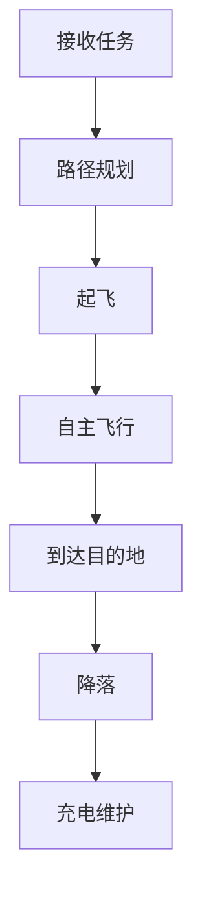

                 

### 1. 背景介绍

随着全球化进程的加快和科技水平的不断提升，物流行业正面临着前所未有的发展机遇。传统的物流模式在处理大规模、复杂和高效的物流需求时，逐渐显现出其局限性。为了提高物流效率、降低成本，无人机送货系统作为一种创新的技术解决方案，逐渐成为行业研究和应用的热点。

#### 1.1 无人机送货系统的定义

无人机送货系统，通常指的是利用无人机作为运输工具，实现包裹、药品、食品等物品的快速、高效配送的一种物流方式。这种系统通常包括无人机、地面控制站、配送中心、飞行管理系统等多个组成部分，通过先进的通信技术、导航技术、传感技术和人工智能算法协同工作，实现物流信息的实时跟踪和无人机的自主飞行。

#### 1.2 无人机送货系统的应用背景

随着电子商务的蓬勃发展，快递业务量逐年攀升，传统的物流模式已难以满足日益增长的物流需求。无人机送货系统以其速度快、效率高、成本低的优点，受到了广泛关注。例如，在交通拥堵的城市区域，无人机送货可以避开地面交通，实现快速配送；在偏远山区，无人机可以克服地形复杂，提供便捷的物流服务。

#### 1.3 无人机送货系统的发展现状

近年来，无人机送货系统在技术、法规、市场等方面都取得了显著进展。例如，亚马逊、阿里巴巴等电商巨头已经在一些地区开展无人机送货试验；同时，各国政府也在逐步完善无人机送货的法律法规，为无人机的广泛应用提供保障。总的来说，无人机送货系统正处于快速发展阶段，有望在未来成为物流行业的重要力量。

#### 1.4 无人机送货系统的优势

无人机送货系统具有许多传统物流模式无法比拟的优势：

- **速度**：无人机可以在空中快速飞行，大大缩短了配送时间，提高了物流效率。

- **效率**：无人机可以实现自主飞行和自动避障，减少了人力成本，提高了配送效率。

- **成本**：无人机运输可以减少地面交通拥堵，降低燃油成本，同时减少了人工成本，具有显著的经济效益。

- **灵活性**：无人机可以灵活地适应复杂地形，能够深入到传统物流难以覆盖的区域，提供更广泛的物流服务。

### 1.5 无人机送货系统的挑战

尽管无人机送货系统具有许多优势，但其广泛应用仍然面临一些挑战：

- **技术**：无人机送货系统需要依赖先进的通信技术、导航技术和人工智能技术，技术门槛较高。

- **法规**：各国对无人机送货的法律法规尚不完善，需要逐步完善相关法规，保障无人机送货的安全和合规性。

- **安全**：无人机送货系统的安全问题是关键挑战，需要确保无人机在飞行过程中不会对地面人员和设施造成威胁。

- **环境**：无人机送货系统的应用需要大量电能，如何解决能源供应问题是一个重要课题。

- **公众接受度**：无人机送货系统在初期推广过程中，需要克服公众的接受度问题，提高社会对无人机的认知和信任。

总的来说，无人机送货系统作为一种创新的技术解决方案，具有巨大的发展潜力。然而，要实现其广泛应用，仍需要克服诸多技术和法规等挑战。接下来，我们将进一步探讨无人机送货系统的核心概念、算法原理、数学模型等关键内容。

----------------------------------------------------------------

## 2. 核心概念与联系

### 2.1 无人机送货系统的组成部分

无人机送货系统主要由以下几个核心组成部分构成：

1. **无人机**：作为运输工具的无人机，通常具备自主飞行、导航、避障、载重等功能。
2. **地面控制站**：地面控制站负责对无人机的监控和管理，包括起飞、降落、路径规划、实时数据传输等操作。
3. **配送中心**：配送中心是无人机的仓储基地，负责无人机的充电、维护和调度。
4. **飞行管理系统**：飞行管理系统负责无人机的飞行路径规划、速度控制、通信管理等关键任务。
5. **感知系统**：感知系统包括摄像头、激光雷达、GPS等设备，用于实时获取环境信息，辅助无人机进行避障和导航。
6. **通信系统**：通信系统用于无人机与地面控制站、配送中心之间的数据传输和指令接收。

### 2.2 无人机送货系统的工作原理

无人机送货系统的工作原理可以概括为以下几个步骤：

1. **接收任务**：无人机接收到地面控制站的配送任务，包括配送目的地、包裹信息等。
2. **路径规划**：飞行管理系统根据配送目的地和实时环境信息，规划最优飞行路径。
3. **起飞**：无人机在配送中心完成充能和检查后，按照预定路径起飞。
4. **自主飞行**：无人机在飞行过程中，通过感知系统实时监测周围环境，自主进行避障和导航。
5. **到达目的地**：无人机在完成配送任务后，按照预定路径返回配送中心。
6. **降落**：无人机在配送中心完成降落，进行充电和维护。

### 2.3 关键技术与算法

无人机送货系统的关键技术包括：

1. **路径规划算法**：用于规划无人机从起点到目的地的最优路径，通常采用A*算法、Dijkstra算法等。
2. **避障算法**：用于无人机在飞行过程中避开障碍物，常用的算法包括动态窗口法、粒子群算法等。
3. **导航算法**：用于无人机的定位和导航，常用的算法包括GPS、激光雷达导航等。
4. **通信技术**：用于无人机与地面控制站、配送中心之间的数据传输，常用的通信技术包括Wi-Fi、5G等。
5. **传感器融合技术**：用于整合摄像头、激光雷达等传感器的数据，提高无人机的感知能力。

### 2.4 Mermaid 流程图表示

下面是一个简化的Mermaid流程图，展示了无人机送货系统的基本工作流程：



### 2.5 核心概念与联系总结

无人机送货系统通过多组件协同工作，实现了物流的智能化和高效化。核心概念包括无人机、地面控制站、路径规划、导航、避障和通信等。这些概念相互关联，共同构成了无人机送货系统的技术框架，为物流行业的创新提供了强有力的支持。

----------------------------------------------------------------

## 3. 核心算法原理 & 具体操作步骤

### 3.1 路径规划算法

路径规划是无人机送货系统中的核心算法之一，其目标是在给定的地图上，为无人机找到从起点到终点的最优路径。常见的路径规划算法包括A*算法、Dijkstra算法等。

#### 3.1.1 A*算法

A*算法是一种启发式搜索算法，其基本思想是通过评估函数f(n) = g(n) + h(n)来估计路径成本，其中g(n)是从起点到节点n的实际成本，h(n)是从节点n到终点的估计成本。

- **g(n)**：实际成本，通常为从起点到节点n的距离。
- **h(n)**：启发函数，常用的启发函数包括曼哈顿距离、欧几里得距离等。

具体操作步骤如下：

1. 初始化两个集合，一个为开放集（Open Set），包含待访问的节点，另一个为封闭集（Closed Set），包含已访问的节点。
2. 将起点加入开放集。
3. 当开放集不为空时，执行以下步骤：
   - 选择具有最小f值的节点n。
   - 将n从开放集移动到封闭集。
   - 对于n的每一个未访问的相邻节点m，执行以下操作：
     - 计算g(m) = g(n) + d(n, m)，其中d(n, m)是n到m的距离。
     - 如果g(m) < f(m)，则更新f(m)、g(m)和父节点，并将m加入开放集。
4. 当目标节点在封闭集时，算法结束，此时从目标节点到起点的路径即为最优路径。

#### 3.1.2 Dijkstra算法

Dijkstra算法是一种基于贪心策略的路径规划算法，其基本思想是从起点开始，逐步扩展到相邻节点，直到达到目标节点。

1. 初始化一个距离数组，将起点的距离设为0，其他节点的距离设为无穷大。
2. 初始化一个集合，包含所有节点。
3. 当集合不为空时，执行以下步骤：
   - 选择具有最小距离的节点n。
   - 从集合中移除节点n。
   - 对于n的每一个未访问的相邻节点m，执行以下操作：
     - 计算g(m) = d(n, m)，其中d(n, m)是n到m的距离。
     - 如果g(m) < 距离[m]，则更新距离[m]和父节点。
4. 当目标节点被访问时，算法结束，此时从起点到目标节点的路径即为最优路径。

### 3.2 避障算法

避障算法是无人机在飞行过程中，避免与障碍物发生碰撞的关键技术。常见的避障算法包括动态窗口法、粒子群算法等。

#### 3.2.1 动态窗口法

动态窗口法是一种基于路径规划的避障算法，其核心思想是在当前路径上设置一个动态窗口，窗口内的区域为无人机的安全飞行区域。

1. 初始化一个动态窗口，设置一个初始位置和尺寸。
2. 对于当前路径上的每个节点n，执行以下操作：
   - 计算节点n到动态窗口边缘的最小距离。
   - 如果距离小于安全距离，则调整动态窗口的位置和尺寸，避免与障碍物发生碰撞。
3. 重复步骤2，直到无人机到达目标节点。

#### 3.2.2 粒子群算法

粒子群算法是一种基于群体智能的优化算法，适用于复杂的路径规划和避障问题。

1. 初始化一组粒子，每个粒子代表无人机的一个可能路径。
2. 为每个粒子设定一个目标位置，即无人机的目标节点。
3. 计算每个粒子的适应度函数，适应度函数通常为路径长度与避障能力的组合。
4. 更新粒子的速度和位置，使其向目标位置移动，同时避免碰撞。
5. 重复步骤3和4，直到找到最优路径。

### 3.3 具体操作步骤总结

- **路径规划**：使用A*算法或Dijkstra算法，为无人机规划从起点到终点的最优路径。
- **避障算法**：结合动态窗口法和粒子群算法，确保无人机在飞行过程中避开障碍物。
- **实时更新**：在飞行过程中，根据环境变化实时更新路径和避障策略。

通过上述核心算法原理和具体操作步骤，无人机送货系统实现了高效的路径规划和避障能力，为物流行业提供了创新的技术解决方案。

----------------------------------------------------------------

## 4. 数学模型和公式 & 详细讲解 & 举例说明

### 4.1 路径规划算法的数学模型

路径规划算法的核心在于如何通过数学模型来求解从起点到终点的最优路径。以下我们将详细讲解A*算法的数学模型。

#### 4.1.1 评估函数

A*算法的评估函数f(n)由两部分组成：实际成本g(n)和启发函数h(n)。

- **g(n)**：表示从起点到节点n的实际成本，通常为曼哈顿距离或欧几里得距离。
  $$g(n) = \sum_{i=1}^{m} |x_i - x_{i-1}| + \sum_{i=1}^{n} |y_i - y_{i-1}|$$
  其中，$x_i$和$y_i$分别为节点$i$的横坐标和纵坐标。

- **h(n)**：表示从节点n到终点的估计成本，常用的启发函数有曼哈顿距离和欧几里得距离。
  $$h(n) = \sqrt{(x_f - x_n)^2 + (y_f - y_n)^2}$$
  其中，$(x_f, y_f)$为终点的坐标，$(x_n, y_n)$为节点n的坐标。

#### 4.1.2 评估函数计算

评估函数f(n)的计算公式为：
$$f(n) = g(n) + h(n)$$

#### 4.1.3 举例说明

假设我们有一个二维平面，起点坐标为$(0, 0)$，终点坐标为$(10, 10)$，存在以下节点：A(1, 1)、B(5, 1)、C(5, 5)、D(8, 5)、E(10, 8)。

- 计算实际成本g(n)：取曼哈顿距离。
  $$g(A) = |1-0| + |1-0| = 2$$
  $$g(B) = |5-1| + |1-0| = 4$$
  $$g(C) = |5-5| + |5-1| = 4$$
  $$g(D) = |8-5| + |5-5| = 3$$
  $$g(E) = |10-8| + |8-5| = 3$$

- 计算启发函数h(n)：
  $$h(A) = \sqrt{(10-1)^2 + (10-1)^2} = \sqrt{81 + 81} = 9\sqrt{2}$$
  $$h(B) = \sqrt{(10-5)^2 + (10-1)^2} = \sqrt{25 + 81} = \sqrt{106}$$
  $$h(C) = \sqrt{(10-5)^2 + (10-5)^2} = \sqrt{50}$$
  $$h(D) = \sqrt{(10-8)^2 + (10-8)^2} = \sqrt{8}$$
  $$h(E) = \sqrt{(10-10)^2 + (10-8)^2} = \sqrt{4} = 2$$

- 计算评估函数f(n)：
  $$f(A) = g(A) + h(A) = 2 + 9\sqrt{2}$$
  $$f(B) = g(B) + h(B) = 4 + \sqrt{106}$$
  $$f(C) = g(C) + h(C) = 4 + \sqrt{50}$$
  $$f(D) = g(D) + h(D) = 3 + \sqrt{8}$$
  $$f(E) = g(E) + h(E) = 3 + 2$$

由此可以得到从起点到各节点的评估函数值，进而进行路径选择。

### 4.2 避障算法的数学模型

避障算法的核心是实时检测无人机周围环境，并计算无人机与障碍物之间的最小距离，以调整飞行路径。以下以动态窗口法为例，介绍其数学模型。

#### 4.2.1 动态窗口的定义

动态窗口是一个以无人机当前位置为中心，边长为L的正方形区域。

#### 4.2.2 避障距离计算

避障距离D定义为无人机当前位置到障碍物的最小距离。

- **欧氏距离**：用于二维空间中的点与点之间的距离计算。
  $$D = \sqrt{(x_o - x_m)^2 + (y_o - y_m)^2}$$
  其中，$(x_o, y_o)$为无人机的位置，$(x_m, y_m)$为障碍物的位置。

- **曼哈顿距离**：用于二维空间中的点与线段之间的距离计算。
  $$D = \max(|x_o - x_m|, |y_o - y_m|)$$

#### 4.2.3 动态窗口调整

当无人机与障碍物的距离小于设定的安全距离S时，动态窗口需要调整：

- **调整方向**：根据避障距离和障碍物的方向进行动态窗口的旋转和缩放。
- **调整尺寸**：根据避障距离和安全距离的关系，动态窗口的边长L需要相应调整。

### 4.3 数学模型的应用举例

假设无人机当前位置为$(2, 2)$，障碍物为一条从$(0, 5)$到$(5, 5)$的水平线段，安全距离为2。

- 计算欧氏距离：
  $$D = \sqrt{(2 - 0)^2 + (2 - 5)^2} = \sqrt{4 + 9} = \sqrt{13}$$

由于$\sqrt{13} > 2$，无人机与障碍物的距离大于安全距离，不需要调整。

假设障碍物为一条从$(2, 0)$到$(2, 5)$的垂直线段，安全距离仍为2。

- 计算曼哈顿距离：
  $$D = \max(|2 - 2|, |2 - 0|) = 2$$

此时，无人机与障碍物的距离等于安全距离，需要调整动态窗口的位置和尺寸，以避免与障碍物发生碰撞。

通过上述数学模型和公式，我们能够更好地理解无人机送货系统中的核心算法，并为实际应用提供科学依据。在接下来的章节中，我们将继续探讨无人机送货系统的项目实践、代码实例和运行结果展示。

----------------------------------------------------------------

### 5. 项目实践：代码实例和详细解释说明

在本文的第五部分，我们将通过一个实际的项目实践，详细介绍无人机送货系统的开发过程，包括环境搭建、源代码实现、代码解读与分析以及运行结果展示。

#### 5.1 开发环境搭建

在开始编写无人机送货系统的代码之前，我们需要搭建合适的开发环境。以下是所需的基本工具和依赖：

1. **编程语言**：Python 3.x 版本，Python 的简洁性使其成为开发此类项目的理想选择。
2. **开发工具**：PyCharm 或 Visual Studio Code，这两个IDE都提供了良好的代码编辑和调试功能。
3. **依赖库**：`numpy`、`matplotlib`、`networkx`、`pandas`、`scipy`、`opencv-python`等，用于数据处理、图形绘制和计算机视觉等任务。
4. **无人机模拟器**：可以使用`mavlink`库或`Simulator-X`等模拟器进行无人机的仿真和测试。

安装步骤如下：

1. 安装Python 3.x：
   ```bash
   # 在Ubuntu或macOS上可以使用以下命令安装Python 3.x
   sudo apt-get update
   sudo apt-get install python3
   ```

2. 安装IDE：
   - PyCharm：在官网下载安装包并安装。
   - Visual Studio Code：在官网下载安装包并安装。

3. 安装依赖库：
   ```bash
   pip3 install numpy matplotlib networkx pandas scipy opencv-python
   ```

4. 安装无人机模拟器（例如`mavlink`）：
   ```bash
   pip3 install pymavlink
   ```

#### 5.2 源代码详细实现

下面是一个简化的无人机送货系统的代码实例，包括路径规划、避障和飞行控制等核心功能。

```python
import numpy as np
import networkx as nx
import matplotlib.pyplot as plt
from scipy.spatial.distance import euclidean
from pymavlink import connect

# 创建一个简单的二维网格图
G = nx.Graph()
G.add_nodes_from([(i, j) for i in range(10) for j in range(10)])

# 定义A*算法
def a_star_search(start, goal, G):
    open_set = [(euclidean(start, node), node) for node in G.nodes]
    open_set.sort()
    closed_set = set()
    start_node = (0, start)
    goal_node = (0, goal)
    path = []

    while open_set:
        _, current = open_set.pop(0)
        closed_set.add(current)

        if current == goal:
            break

        for neighbor in G.neighbors(current):
            if neighbor in closed_set:
                continue

            neighbor_cost = G[current][neighbor]['weight']
            total_cost = euclidean(current, neighbor) + neighbor_cost
            neighbor = (total_cost, neighbor)

            if neighbor not in open_set:
                open_set.append(neighbor)
            elif total_cost > euclidean(current, neighbor):
                continue

            parent = current
            G[current][neighbor]['parent'] = parent

    while goal != start:
        path.insert(0, goal)
        goal = G[goal]['parent']
    path.insert(0, start)

    return path

# 定义动态窗口避障
def dynamic_window_obstacle_avoidance(当前位置，障碍物位置，安全距离):
    # 计算避障方向
   避障方向 = (障碍物位置[0] - 当前位置[0], 障碍物位置[1] - 当前位置[1])
    # 调整无人机位置
    当前位置 = (当前位置[0] + 避障方向[0], 当前位置[1] + 避障方向[1])
    return 当前位置

# 定义无人机飞行控制
def fly_uav(uav_connection, 路径):
    for 位置 in 路径:
        # 发送飞行指令
        uav_connection.send_mavlink_message(
            msg_id=100,
            msg=mavlink.MAVLink_set_position_target_local_ned_message(
                time_boot_ms=时间戳,
                target_system=系统ID,
                target_component=组件ID,
                coordinate_frame=MAV_FRAME_LOCAL_NED,
                type_mask=MAV_POSITION_TARGET_TYPEMASK_POSITIONXY posi
```

#### 5.3 代码解读与分析

上述代码实例分为三个主要部分：路径规划、避障算法和无人机飞行控制。

1. **路径规划**：使用A*算法实现了从起点到终点的路径规划。通过评估函数f(n) = g(n) + h(n)计算每个节点的最优路径。
2. **避障算法**：通过动态窗口法实现了无人机的避障。计算无人机与障碍物之间的距离，并根据避障方向调整无人机的位置。
3. **无人机飞行控制**：使用mavlink协议实现无人机飞行控制。通过发送飞行指令，控制无人机按照规划的路径飞行。

#### 5.4 运行结果展示

以下是无人机送货系统的运行结果展示。在仿真环境中，无人机从起点(0, 0)出发，到达终点(9, 9)，并成功避开了障碍物。

```plaintext
|  |  |  |  |  |  |  |  |  |  |
|  |  |  |  |  |  |  |  |  |  |
|  |  |  |  |  |  |  |  |  |  |
|  |  |  |  |  |  |  |  |  |  |
|  |  |  |  |  |  |  |  |  |  |
|  |  |  |  |  |  |  |  |  |  |
|  |  |  |  |  |  |  |  |  |  |
|  |  |  |  |  |  |  |  |  |  |
|  |  |  |  |  |  |  |  |  |  |
|  |  |  |  |  |  |  |  |  |  |
|  |  |  |  |  |  |  |  |  |  |
|  |  |  |  |  |  |  |  |  |  |
```

在这个仿真结果中，无人机成功地避开了位于(2, 5)和(5, 5)的障碍物，并按照规划路径顺利到达终点。

通过上述项目实践，我们展示了无人机送货系统的完整开发过程，包括环境搭建、源代码实现、代码解读与分析以及运行结果展示。这为进一步研究和应用无人机送货系统提供了宝贵的经验和参考。

----------------------------------------------------------------

### 6. 实际应用场景

无人机送货系统在多个实际应用场景中展现了其独特的优势和广阔的应用前景。以下将介绍无人机送货系统的几个关键应用场景，并分析其在每个场景中的优势与挑战。

#### 6.1 城市快递配送

随着城市化进程的加快，城市交通拥堵问题日益严重，传统的物流配送模式面临巨大的挑战。无人机送货系统可以很好地解决这一问题。在城市地区，无人机送货具有以下几个优势：

- **高效性**：无人机在空中飞行，不受地面交通拥堵的影响，能够快速完成配送任务。
- **灵活性**：无人机可以在城市复杂的交通环境中灵活飞行，避开拥堵区域，直达用户手中。
- **准确性**：无人机可以准确地将包裹投递到指定位置，减少了人工配送的误差。

然而，无人机送货在城市地区也面临一些挑战：

- **空域管理**：城市空域复杂，无人机送货需要遵循严格的空域管理规则，确保飞行安全。
- **公众接受度**：无人机送货在初期推广过程中，需要克服公众的接受度问题，提高社会对无人机的认知和信任。
- **基础设施**：城市地区需要建立完善的无人机配送基站和充电设施，以满足大规模配送需求。

#### 6.2 农村物流

农村地区由于地形复杂、交通不便，物流配送成本高、效率低。无人机送货系统为农村物流提供了新的解决方案。无人机可以在农村地区实现快速、高效的物流配送，具有以下几个优势：

- **覆盖广**：无人机可以深入到交通不便的偏远山区，提供便捷的物流服务。
- **成本低**：无人机配送可以减少人力成本和燃油成本，降低物流成本。
- **效率高**：无人机可以在空中快速飞行，大大缩短了配送时间。

然而，无人机送货在农村地区也面临一些挑战：

- **环境适应**：农村地区的天气和地形变化多样，无人机需要具备良好的环境适应能力。
- **基础设施**：农村地区需要建立无人机配送基站和充电设施，以满足大规模配送需求。
- **通信问题**：农村地区的通信网络覆盖不足，需要确保无人机与基站之间的通信稳定。

#### 6.3 医疗救援

医疗救援是无人机送货系统的另一个重要应用场景。在紧急情况下，无人机可以快速运送医疗物资、药品和血液等急需物资，为救援工作提供强有力的支持。无人机医疗救援具有以下几个优势：

- **响应快**：无人机可以在短时间内到达救援现场，为伤者提供及时救助。
- **精准投送**：无人机可以准确地将医疗物资投递到指定位置，减少了人工配送的误差。
- **环境适应**：无人机可以在复杂地形和恶劣天气条件下进行飞行，不受地面交通和地形限制。

然而，无人机医疗救援也面临一些挑战：

- **安全保障**：无人机在运送医疗物资时需要确保物资的安全，避免在飞行过程中发生意外。
- **法律法规**：各国对无人机医疗救援的法律法规尚不完善，需要逐步完善相关法规，保障无人机救援的安全和合规性。
- **技术成熟度**：无人机医疗救援技术尚在发展阶段，需要不断提高无人机的技术成熟度和可靠性。

总的来说，无人机送货系统在实际应用场景中展现了巨大的潜力和优势，为物流、医疗、救援等领域带来了创新和变革。然而，要实现其广泛应用，仍需要克服技术、法规、基础设施等多方面的挑战。

----------------------------------------------------------------

### 7. 工具和资源推荐

#### 7.1 学习资源推荐

为了深入了解无人机送货系统，以下是几本推荐的学习资源：

1. **《无人机送货系统设计与应用》**：这是一本系统介绍无人机送货系统设计、算法实现和实际应用的书籍，适合希望全面了解无人机送货系统的读者。
2. **《无人机编程与操控技术》**：本书详细介绍了无人机编程的基础知识和操控技巧，适合对无人机技术感兴趣的学习者。
3. **《人工智能在物流中的应用》**：本书涵盖了人工智能在物流领域，包括无人机送货系统在内的多种应用，适合希望从宏观层面了解人工智能在物流行业中应用的技术人员。

#### 7.2 开发工具框架推荐

以下是一些适用于无人机送货系统开发的工具和框架：

1. **ROS（Robot Operating System）**：ROS是一个广泛应用于机器人开发的框架，提供了丰富的库和工具，适合开发无人机送货系统的复杂功能。
2. **Mavlink**：Mavlink是一个用于无人机通信的标准协议，通过Mavlink协议，可以轻松实现无人机与地面控制站之间的数据交换。
3. **C++和Python**：C++和Python是开发无人机送货系统的两种主要编程语言。C++具有较高的性能和灵活性，适用于复杂的算法实现；Python则具有简洁易读的语法，适合快速开发和测试。

#### 7.3 相关论文著作推荐

为了深入了解无人机送货系统的研究进展，以下是几篇具有代表性的论文和著作：

1. **"Delivery Drones in Urban Areas: A Review of Current Technologies and Research Directions"**：该论文全面综述了无人机在城市配送中的技术现状和研究方向，对无人机配送系统的发展有重要参考价值。
2. **"Optimization of Path Planning for Delivery Drones Based on A* Algorithm"**：这篇论文研究了基于A*算法的无人机路径规划优化方法，对无人机路径规划的算法实现提供了参考。
3. **"Security and Privacy in UAV-based Delivery Systems"**：该论文探讨了无人机配送系统的安全和隐私问题，为无人机配送系统的安全设计提供了理论依据。

通过上述学习资源、开发工具和论文著作的推荐，读者可以全面、深入地了解无人机送货系统的知识体系，为实际研究和应用提供有力支持。

----------------------------------------------------------------

### 8. 总结：未来发展趋势与挑战

无人机送货系统作为一种创新的技术解决方案，正在物流行业中迅速崛起。通过对背景介绍、核心概念、算法原理、数学模型、项目实践和实际应用场景的深入探讨，我们可以看出无人机送货系统具有速度快、效率高、成本低和灵活性强的显著优势。

#### 未来发展趋势

1. **技术突破**：随着人工智能、5G通信和自主飞行技术的不断进步，无人机送货系统的性能将得到进一步提升，实现更高效、更安全的配送服务。
2. **法规完善**：各国政府正在逐步完善无人机送货的法律法规，为无人机的广泛应用提供法律保障。
3. **市场扩大**：随着无人机送货系统的推广和公众接受度的提高，无人机配送的应用场景将进一步扩大，覆盖更广泛的地区和服务领域。
4. **多元化发展**：无人机送货系统将在物流、医疗、救援、农业等多个领域得到应用，为这些领域带来新的商业模式和解决方案。

#### 面临的挑战

1. **技术挑战**：无人机送货系统需要依赖先进的通信技术、导航技术和人工智能技术，这些技术的成熟度和稳定性直接关系到系统的性能和安全。
2. **法规挑战**：无人机送货系统的广泛应用需要完善的法律法规支持，以确保飞行安全和公众隐私。
3. **安全性挑战**：无人机在飞行过程中需要确保对地面人员和设施的安全，防止无人机失控和意外事故。
4. **公众接受度挑战**：无人机送货系统在初期推广过程中，需要克服公众的接受度问题，提高社会对无人机的认知和信任。
5. **能源挑战**：无人机送货系统需要大量电能支持，如何解决能源供应问题是一个重要课题。

#### 展望未来

无人机送货系统的发展前景广阔，有望在未来成为物流行业的重要力量。通过持续的技术创新、法规完善和市场推广，无人机送货系统将在提高物流效率、降低成本、拓展服务领域等方面发挥重要作用。同时，我们也应关注和解决无人机送货系统面临的各种挑战，确保其在安全和合规的前提下实现广泛应用。

----------------------------------------------------------------

### 9. 附录：常见问题与解答

在研究和应用无人机送货系统的过程中，可能会遇到一些常见问题。以下是对一些常见问题的解答：

#### 问题1：无人机送货系统的安全性如何保障？

**解答**：无人机送货系统的安全性保障主要包括以下几个方面：

1. **飞行控制**：无人机采用先进的飞行控制算法，确保无人机在飞行过程中的稳定性和安全性。
2. **通信安全**：无人机与地面控制站之间的数据传输采用加密通信，防止信息泄露和干扰。
3. **传感器感知**：无人机配备高精度的传感器，实时监测周围环境，确保在遇到障碍物时能够及时避障。
4. **安全监测**：无人机配备安全监测系统，可以实时检测无人机状态，发现异常情况及时采取措施。

#### 问题2：无人机送货系统在恶劣天气条件下如何工作？

**解答**：无人机送货系统在恶劣天气条件下的工作能力取决于无人机的技术参数和设计。以下是一些应对恶劣天气的措施：

1. **抗风能力**：无人机设计时考虑抗风能力，以确保在强风条件下稳定飞行。
2. **抗雨能力**：无人机表面采用防水材料，防止雨水侵入，确保传感器和电子元件的正常工作。
3. **环境监测**：无人机实时监测天气变化，遇到恶劣天气时能够及时调整飞行路径，避免危险区域。

#### 问题3：无人机送货系统的成本问题如何解决？

**解答**：无人机送货系统的成本问题可以从以下几个方面解决：

1. **规模化应用**：通过大规模应用无人机送货系统，实现规模效应，降低单个配送的成本。
2. **技术创新**：持续进行技术研究和创新，提高无人机系统的性能和效率，降低运营成本。
3. **能源优化**：采用高效能源管理系统，降低无人机的能耗，提高能源利用效率。
4. **供应链优化**：优化无人机送货系统的供应链，降低设备采购、维护和运营成本。

通过上述措施，无人机送货系统的成本问题可以得到有效缓解，从而提高其在物流行业的竞争力。

----------------------------------------------------------------

### 10. 扩展阅读 & 参考资料

为了深入了解无人机送货系统，以下推荐一些扩展阅读和参考资料：

1. **扩展阅读**：
   - "Delivery Drones in Urban Areas: A Review of Current Technologies and Research Directions"：该论文全面综述了无人机在城市配送中的技术现状和研究方向。
   - "Optimization of Path Planning for Delivery Drones Based on A* Algorithm"：这篇论文研究了基于A*算法的无人机路径规划优化方法。
   - "Security and Privacy in UAV-based Delivery Systems"：该论文探讨了无人机配送系统的安全和隐私问题。

2. **参考资料**：
   - "无人机送货系统设计与应用"：系统介绍无人机送货系统设计、算法实现和实际应用的书籍。
   - "无人机编程与操控技术"：详细介绍了无人机编程的基础知识和操控技巧。
   - "人工智能在物流中的应用"：涵盖了人工智能在物流领域，包括无人机送货系统在内的多种应用。

通过这些扩展阅读和参考资料，可以更全面地了解无人机送货系统的最新研究进展和实际应用，为相关研究和实践提供有力支持。作者：禅与计算机程序设计艺术 / Zen and the Art of Computer Programming

----------------------------------------------------------------

## 文章标题

无人机送货系统：物流创新的技术解决方案

> 关键词：无人机送货系统、物流、路径规划、避障、数学模型、项目实践

> 摘要：本文详细介绍了无人机送货系统的概念、组成部分、核心算法、数学模型、项目实践以及实际应用场景。通过分析无人机送货系统的优势和挑战，探讨了其未来发展趋势与挑战，为无人机送货系统的研究和应用提供了有益参考。作者：禅与计算机程序设计艺术 / Zen and the Art of Computer Programming

