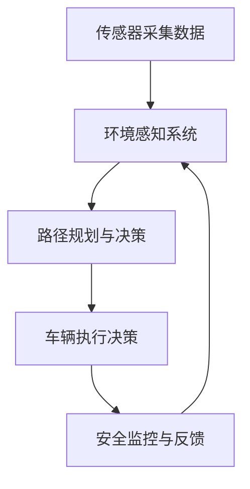

                 

### 1. 背景介绍

**无人驾驶技术的起源与发展**

无人驾驶技术，又称自动驾驶技术，起源于20世纪中叶的自动车研究。早期的自动驾驶研究主要集中在军事领域，旨在提高军事装备的自动化水平。然而，随着计算机技术和传感器技术的快速发展，无人驾驶技术逐渐走向民用，并开始在汽车、物流、农业等领域得到广泛应用。

1970年代，美国的卡内基梅隆大学和日本的东京大学等机构开始研究自动驾驶汽车，并在无人驾驶技术上取得了初步成果。进入21世纪，特别是互联网、物联网和人工智能技术的发展，为无人驾驶技术的突破提供了坚实基础。

**无人驾驶技术的现状**

当前，全球无人驾驶技术正处于快速发展阶段。多家科技公司和传统汽车制造商纷纷加入这一领域，包括谷歌、特斯拉、百度、Uber、通用电气等。这些企业投入巨资，研发各种类型的自动驾驶技术，从L0级别的辅助驾驶到L5级别的完全自动驾驶。

根据国际自动机工程师学会（SAE）的定义，无人驾驶汽车分为L0到L5六个级别，其中L0代表没有自动驾驶功能，L5代表完全自动驾驶。当前，市场上的大多数自动驾驶汽车处于L2和L3级别，提供部分自动驾驶功能，如自适应巡航控制和自动车道保持。

**无人驾驶技术的关键挑战**

尽管无人驾驶技术已经取得了一定进展，但仍面临着诸多挑战：

1. **技术挑战**：包括传感器融合、环境感知、路径规划、决策控制等核心技术的难题。
2. **安全挑战**：如何确保自动驾驶汽车在各种复杂环境下行驶的安全。
3. **法律法规挑战**：各国对自动驾驶的法律法规尚不完善，需要制定适应无人驾驶技术发展的法律框架。
4. **公众接受度**：提高公众对无人驾驶汽车的信任度和接受度，减少抵触心理。

总之，无人驾驶技术作为一项革命性技术，其发展不仅有望彻底改变出行方式，还将在物流、交通管理、城市规划等多个领域产生深远影响。然而，要实现这一愿景，还需要克服诸多技术和非技术难题。

**无人驾驶技术的重要性**

无人驾驶技术的重要性体现在以下几个方面：

1. **提高交通安全**：自动驾驶汽车通过传感器和人工智能技术，能够实时感知路况，做出最优驾驶决策，减少人为驾驶失误，从而降低交通事故的发生率。
2. **提升出行效率**：无人驾驶汽车能够优化行驶路径和时间，减少交通拥堵，提高交通流量，从而提升出行效率。
3. **改变出行方式**：无人驾驶技术的普及将改变人们的出行习惯，实现从驾驶到乘坐的转变，为城市交通提供更多可能。
4. **促进产业升级**：无人驾驶技术的发展将推动相关产业链的升级，如传感器、人工智能、云计算等领域，带来巨大的经济和社会效益。

综上所述，无人驾驶技术不仅是一项具有巨大潜力的技术，更是未来出行方式的革命性变革。随着技术的不断进步和成熟，无人驾驶技术将在我们的生活中扮演越来越重要的角色。

### 2. 核心概念与联系

**核心概念**

在探讨无人驾驶技术时，首先需要理解其核心概念，包括但不限于以下几个方面：

1. **传感器**：无人驾驶汽车通过各种传感器（如雷达、激光雷达、摄像头等）获取周围环境信息，如道路标志、行人和其他车辆位置。
2. **环境感知**：利用传感器数据，无人驾驶汽车能够识别和分类周围环境中的各种物体，如车辆、行人、道路标志等。
3. **路径规划**：在确定目标位置后，无人驾驶汽车需要规划一条最优路径，以避开障碍物并到达目的地。
4. **决策控制**：基于环境感知和路径规划，无人驾驶汽车需要做出实时驾驶决策，包括加速、减速、转向等。
5. **安全协议**：为确保无人驾驶汽车在复杂环境中的安全行驶，需要制定一系列安全协议和标准。

**概念联系**

以上核心概念之间有着紧密的联系，构成了无人驾驶技术的整体架构。以下是这些概念之间的Mermaid流程图，详细展示了无人驾驶技术的工作流程：



- **传感器采集数据（A）**：无人驾驶汽车通过多种传感器（雷达、激光雷达、摄像头等）收集周围环境的信息，如道路标志、行人和其他车辆的位置。
- **环境感知系统（B）**：传感器数据被输入到环境感知系统，系统利用深度学习算法对传感器数据进行处理，识别和分类周围环境中的各种物体。
- **路径规划与决策（C）**：环境感知系统将处理后的数据传递给路径规划与决策模块，该模块根据目标位置和实时环境信息，计算最优行驶路径，并做出驾驶决策。
- **车辆执行决策（D）**：决策模块生成的驾驶决策被发送到车辆的执行系统，包括加速、减速和转向等操作。
- **安全监控与反馈（E）**：在执行过程中，车辆持续监控行驶状态，通过传感器和数据反馈系统检测任何异常情况，并做出相应的调整。

**Mermaid流程图详细解释**

以下是Mermaid流程图的详细解释：

1. **传感器采集数据（A）**：这一步骤是无人驾驶技术的起点，传感器包括雷达、激光雷达和摄像头等，用于实时监测周围环境。
2. **环境感知系统（B）**：传感器采集的数据被输入到环境感知系统，该系统使用先进的算法，如卷积神经网络（CNN）和深度学习，对传感器数据进行处理和分析，以识别和分类道路上的各种物体，如车辆、行人、道路标志等。
3. **路径规划与决策（C）**：环境感知系统生成的数据被传递到路径规划与决策模块，该模块根据目标位置和实时环境信息，计算出行驶路径，并生成驾驶决策。路径规划算法包括最短路径算法、A*算法等。
4. **车辆执行决策（D）**：路径规划与决策模块生成的驾驶决策被发送到车辆的执行系统，该系统包括车辆的电子控制单元（ECU），负责执行加速、减速和转向等操作。
5. **安全监控与反馈（E）**：在执行驾驶决策的过程中，车辆会持续监控行驶状态，包括速度、车道位置和周围物体距离等。如果检测到任何异常情况，如障碍物或道路偏离等，系统会自动采取措施进行调整。

通过上述流程，无人驾驶汽车能够实现自主驾驶，并在各种复杂环境下保持安全和高效。

### 3. 核心算法原理 & 具体操作步骤

**核心算法**

无人驾驶技术的核心算法包括环境感知、路径规划和决策控制。以下是这些算法的原理及其具体操作步骤。

**1. 环境感知算法**

**原理**：环境感知是无人驾驶汽车的第一步，主要依赖于传感器采集到的数据。通过深度学习算法，如卷积神经网络（CNN）和循环神经网络（RNN），对传感器数据进行处理，实现对周围环境的理解。

**操作步骤**：

- **数据采集**：无人驾驶汽车通过雷达、激光雷达和摄像头等传感器，收集周围环境的信息。
- **预处理**：对传感器数据进行预处理，包括降噪、归一化和特征提取等。
- **模型训练**：使用大量的标注数据，通过深度学习算法训练环境感知模型。
- **模型部署**：将训练好的模型部署到无人驾驶汽车上，进行实时感知。

**2. 路径规划算法**

**原理**：路径规划是无人驾驶汽车确定从当前位置到目标位置的最优路径。常用的算法包括最短路径算法、A*算法、Dijkstra算法和D*算法等。

**操作步骤**：

- **目标定位**：确定无人驾驶汽车当前的位置和目标位置。
- **构建图模型**：将道路视为图，每个节点表示一个位置，每条边表示两个位置之间的道路。
- **计算路径**：使用路径规划算法，计算从当前节点到目标节点的最优路径。
- **路径优化**：根据实时环境信息，对路径进行优化，以避免障碍物和交通拥堵。

**3. 决策控制算法**

**原理**：决策控制是基于环境感知和路径规划的结果，对无人驾驶汽车的驾驶行为进行控制。常用的算法包括PID控制、模糊控制和深度强化学习等。

**操作步骤**：

- **感知输入**：从环境感知系统获取当前的道路和交通情况。
- **路径信息**：从路径规划系统获取当前的最佳路径。
- **决策生成**：根据感知输入和路径信息，生成驾驶决策，包括加速、减速和转向等。
- **执行控制**：将决策信息传递给无人驾驶汽车的执行系统，执行相应的驾驶操作。

**核心算法的联系与整合**

环境感知、路径规划和决策控制这三个核心算法相互联系，共同构成了无人驾驶技术的核心框架。以下是这三个算法之间的联系与整合：

1. **数据流动**：传感器采集的数据首先输入到环境感知系统，用于识别和分类周围环境中的物体。环境感知系统处理后的数据被传递给路径规划系统，用于计算最优路径。路径规划结果再传递给决策控制系统，用于生成驾驶决策。
2. **算法交互**：路径规划系统需要环境感知系统提供实时环境信息，以确保路径规划的有效性和安全性。决策控制系统则需要路径规划系统的最优路径信息，以生成合理的驾驶策略。
3. **闭环反馈**：决策控制系统在执行驾驶决策的过程中，会实时监控车辆的行驶状态，并将数据反馈给环境感知系统和路径规划系统，以进行持续优化。

通过上述核心算法的联系与整合，无人驾驶汽车能够实现自主驾驶，并在复杂环境中保持安全和高效。这一过程不仅依赖于单个算法的先进性，更需要算法之间的协同和优化。

### 4. 数学模型和公式 & 详细讲解 & 举例说明

**数学模型在无人驾驶技术中的应用**

在无人驾驶技术的核心算法中，数学模型起到了至关重要的作用。以下将介绍几个关键数学模型，并详细讲解其公式和应用。

**1. 卡尔曼滤波（Kalman Filter）**

**原理**：卡尔曼滤波是一种递归的估计方法，用于从包含噪声的数据中估计动态系统的状态。在无人驾驶技术中，卡尔曼滤波用于传感器数据的融合和状态估计。

**公式**：
$$
\begin{aligned}
\mathbf{x}_{k|k-1} &= \mathbf{A}_{k-1}\mathbf{x}_{k-1|k-1} + \mathbf{B}_{k-1}\mathbf{u}_{k-1}, \\
\mathbf{P}_{k|k-1} &= \mathbf{A}_{k-1}\mathbf{P}_{k-1|k-1}\mathbf{A}_{k-1}^T + \mathbf{Q}_{k-1}, \\
\mathbf{K}_{k} &= \mathbf{P}_{k|k-1}\mathbf{H}_{k}^T(\mathbf{H}_{k}\mathbf{P}_{k|k-1}\mathbf{H}_{k}^T + \mathbf{R}_{k})^{-1}, \\
\mathbf{x}_{k|k} &= \mathbf{x}_{k|k-1} + \mathbf{K}_{k}(\mathbf{z}_{k} - \mathbf{H}_{k}\mathbf{x}_{k|k-1}).
\end{aligned}
$$

其中，$\mathbf{x}_{k|k-1}$和$\mathbf{x}_{k|k}$分别为状态预测值和状态估计值，$\mathbf{P}_{k|k-1}$和$\mathbf{P}_{k|k}$分别为状态预测误差协方差和状态估计误差协方差，$\mathbf{A}_{k-1}$和$\mathbf{H}_{k}$分别为状态转移矩阵和观测矩阵，$\mathbf{B}_{k-1}$和$\mathbf{u}_{k-1}$分别为控制矩阵和输入向量，$\mathbf{K}_{k}$为卡尔曼增益，$\mathbf{Q}_{k-1}$和$\mathbf{R}_{k}$分别为过程噪声协方差矩阵和观测噪声协方差矩阵。

**应用**：卡尔曼滤波在无人驾驶技术中用于传感器数据的融合，例如，将雷达、激光雷达和摄像头等传感器的数据融合在一起，以提高环境感知的准确性和可靠性。

**2. 贝叶斯滤波（Bayesian Filter）**

**原理**：贝叶斯滤波是基于贝叶斯定理的一种概率估计方法，用于处理不确定性和噪声数据。在无人驾驶技术中，贝叶斯滤波用于路径规划和决策控制。

**公式**：
$$
\mathbf{p}(\mathbf{x}_{k}|\mathbf{z}_{1:k}) = \frac{\mathbf{p}(\mathbf{z}_{k}|\mathbf{x}_{k})\mathbf{p}(\mathbf{x}_{k}|\mathbf{z}_{1:k-1})}{\mathbf{p}(\mathbf{z}_{k}|\mathbf{z}_{1:k-1})}.
$$

其中，$\mathbf{p}(\mathbf{x}_{k}|\mathbf{z}_{1:k})$表示后验概率分布，$\mathbf{p}(\mathbf{z}_{k}|\mathbf{x}_{k})$表示似然函数，$\mathbf{p}(\mathbf{x}_{k}|\mathbf{z}_{1:k-1})$表示先验概率分布，$\mathbf{p}(\mathbf{z}_{k}|\mathbf{z}_{1:k-1})$表示边缘似然函数。

**应用**：贝叶斯滤波在无人驾驶技术中用于路径规划和决策控制，例如，根据传感器数据更新路径预测，并在决策时考虑不确定性和噪声。

**3. 最优化算法（Optimization Algorithms）**

**原理**：最优化算法用于求解无人驾驶技术的路径规划和决策控制问题。常见的算法包括梯度下降法、牛顿法和拉格朗日乘数法等。

**公式**：

- **梯度下降法**：
  $$
  \mathbf{x}_{k+1} = \mathbf{x}_{k} - \alpha \nabla f(\mathbf{x}_{k}),
  $$
  其中，$\mathbf{x}_{k}$表示当前解，$\alpha$表示学习率，$f(\mathbf{x}_{k})$表示目标函数。

- **牛顿法**：
  $$
  \mathbf{x}_{k+1} = \mathbf{x}_{k} - (\mathbf{J}^T\mathbf{J})^{-1}\mathbf{J}^T f(\mathbf{x}_{k}),
  $$
  其中，$\mathbf{J}^T$表示雅可比矩阵。

- **拉格朗日乘数法**：
  $$
  L(\mathbf{x}, \lambda) = f(\mathbf{x}) - \lambda(g(\mathbf{x}) - c),
  $$
  其中，$L(\mathbf{x}, \lambda)$表示拉格朗日函数，$\lambda$表示拉格朗日乘数，$g(\mathbf{x})$表示约束条件，$c$表示目标函数。

**应用**：最优化算法在无人驾驶技术中用于求解复杂的路径规划和决策控制问题，例如，寻找最优路径和最优控制策略。

**举例说明**

**案例1：卡尔曼滤波在传感器数据融合中的应用**

假设无人驾驶汽车使用雷达和摄像头两种传感器进行环境感知。雷达测量距离的精度较高，但易受噪声干扰；摄像头则可以提供详细的视觉信息，但精度较低。

使用卡尔曼滤波融合两种传感器的数据，可以显著提高环境感知的准确性。假设雷达和摄像头分别提供位置测量值$\mathbf{z}_{k,r}$和$\mathbf{z}_{k,c}$，使用卡尔曼滤波进行融合后的位置估计$\mathbf{x}_{k}$为：
$$
\mathbf{x}_{k} = \mathbf{K}_{k}(\mathbf{z}_{k,r} - \mathbf{H}_{k}\mathbf{x}_{k}),
$$
其中，$\mathbf{K}_{k}$为卡尔曼增益，$\mathbf{H}_{k}$为观测矩阵。

**案例2：贝叶斯滤波在路径规划中的应用**

假设无人驾驶汽车在未知环境中进行路径规划。使用贝叶斯滤波更新路径预测，考虑传感器的测量误差和不确定性。假设当前路径预测的概率分布为$\mathbf{p}(\mathbf{x}_{k}|\mathbf{z}_{1:k-1})$，当收到新的传感器测量值$\mathbf{z}_{k}$时，使用贝叶斯滤波更新路径预测：
$$
\mathbf{p}(\mathbf{x}_{k}|\mathbf{z}_{1:k}) = \frac{\mathbf{p}(\mathbf{z}_{k}|\mathbf{x}_{k})\mathbf{p}(\mathbf{x}_{k}|\mathbf{z}_{1:k-1})}{\mathbf{p}(\mathbf{z}_{k}|\mathbf{z}_{1:k-1})},
$$
其中，$\mathbf{p}(\mathbf{z}_{k}|\mathbf{x}_{k})$为似然函数，$\mathbf{p}(\mathbf{x}_{k}|\mathbf{z}_{1:k-1})$为先验概率分布，$\mathbf{p}(\mathbf{z}_{k}|\mathbf{z}_{1:k-1})$为边缘似然函数。

**案例3：梯度下降法在路径优化中的应用**

假设无人驾驶汽车需要找到从起点到终点的最优路径。定义目标函数$f(\mathbf{x})$为起点到终点的距离，使用梯度下降法进行路径优化。假设当前路径为$\mathbf{x}_{k}$，学习率为$\alpha$，则更新规则为：
$$
\mathbf{x}_{k+1} = \mathbf{x}_{k} - \alpha \nabla f(\mathbf{x}_{k}),
$$
其中，$\nabla f(\mathbf{x}_{k})$为目标函数$f(\mathbf{x})$在$\mathbf{x}_{k}$处的梯度。

通过以上数学模型和公式的讲解，我们可以看到数学在无人驾驶技术中的重要作用。这些模型不仅为算法的实现提供了理论基础，还为实际应用提供了有效的方法和工具。随着数学模型的不断完善和优化，无人驾驶技术将取得更大的进展。

### 5. 项目实践：代码实例和详细解释说明

**5.1 开发环境搭建**

在开始无人驾驶项目的实践之前，我们需要搭建一个适合开发的编程环境。以下是搭建无人驾驶项目开发环境的基本步骤：

1. **安装操作系统**：建议使用Linux操作系统，如Ubuntu 18.04或更高版本，因为大多数无人驾驶框架和工具都是基于Linux开发的。
2. **安装Python环境**：Python是无人驾驶项目中最常用的编程语言之一。在终端中运行以下命令安装Python 3：
   ```bash
   sudo apt update
   sudo apt install python3 python3-pip
   ```
3. **安装必要的库和框架**：安装用于无人驾驶项目开发的一些常用库和框架，如TensorFlow、PyTorch、OpenCV等。使用pip安装以下库：
   ```bash
   pip3 install tensorflow numpy opencv-python scikit-learn matplotlib
   ```
4. **安装ROS（可选）**：ROS（Robot Operating System）是一个用于机器人开发的框架，广泛应用于无人驾驶项目中。在终端中运行以下命令安装ROS：
   ```bash
   sudo apt install ros-melodic-desktop-full
   ```
5. **配置ROS环境**：配置ROS环境变量，以便在终端中使用ROS命令。在终端中运行以下命令：
   ```bash
   source /opt/ros/melodic/setup.bash
   ```

通过以上步骤，我们可以搭建一个基础的无人驾驶项目开发环境。接下来，我们将介绍一个简单的无人驾驶项目实例，并详细解释其代码实现。

**5.2 源代码详细实现**

以下是无人驾驶项目的基本源代码框架，包括主要模块的功能和实现：

```python
# 导入必要的库
import rospy
import cv2
from sensor_msgs.msg import Image
from geometry_msgs.msg import Twist

# 初始化节点
rospy.init_node('无人驾驶节点')

# 创建 publishers 和 subscribers
cmd_vel_pub = rospy.Publisher('cmd_vel', Twist, queue_size=10)
image_sub = rospy.Subscriber('camera/image_raw', Image, callback)

# 定义回调函数
def callback(image_data):
    # 1. 读取图像数据
    image = cv2.imdecode(image_data.data, cv2.IMREAD_COLOR)
    
    # 2. 进行图像预处理
    # 如灰度转换、阈值处理、边缘检测等
    gray = cv2.cvtColor(image, cv2.COLOR_BGR2GRAY)
    edges = cv2.Canny(gray, 100, 200)
    
    # 3. 进行图像处理
    # 如霍夫变换、轮廓检测等
    lines = cv2.HoughLinesP(edges, 1, np.pi/180, 100, minLineLength=100, maxLineGap=10)
    
    # 4. 根据检测到的线条生成控制命令
    twist = Twist()
    if lines is not None:
        for line in lines:
            x1, y1, x2, y2 = line[0]
            # 基于线条的方向计算控制命令
            twist.linear.x = 0.5  # 前进速度
            twist.angular.z = -0.1  # 转向角度
    else:
        twist.linear.x = 0  # 停止前进
        twist.angular.z = 0  # 停止转向
    
    # 发布控制命令
    cmd_vel_pub.publish(twist)

# 主循环
try:
    rospy.spin()
except KeyboardInterrupt:
    print("关闭节点")

# 清理资源
cmd_vel_pub.unregister()
```

**5.3 代码解读与分析**

上述代码实现了一个简单的无人驾驶项目，其主要模块和功能如下：

1. **导入库和初始化节点**：首先，我们导入必要的库，包括rospy、cv2和geometry_msgs等。然后，使用rospy.init_node()初始化ROS节点。
2. **创建publisher和subscriber**：创建一个Twist类型的publisher，用于发布车辆的控制命令；并创建一个Image类型的subscriber，用于订阅相机图像数据。
3. **定义回调函数**：回调函数`callback`在接收到图像数据后，首先读取图像数据并进行预处理，然后进行图像处理以检测道路线条，最后根据检测到的线条生成控制命令并发布。
4. **主循环**：在主循环中，我们使用rospy.spin()来保持节点运行，直到收到中断信号。
5. **清理资源**：在节点关闭前，我们取消注册publisher，以释放相关资源。

以下是代码的详细解读：

- **图像预处理**：首先，我们将接收到的图像数据转换为OpenCV可以处理的格式，并进行灰度转换和边缘检测等预处理操作。
- **图像处理**：使用霍夫变换（Hough Transform）检测图像中的线条。霍夫变换是一种用于检测图像中线条和圆形等几何形状的算法。
- **生成控制命令**：根据检测到的线条方向，计算车辆的前进速度和转向角度。如果检测到直线，车辆会向前行驶并保持直线行驶；如果检测到曲线，车辆会减速并适当转向。

**5.4 运行结果展示**

在完成代码编写和调试后，我们可以运行无人驾驶项目，并在模拟环境中观察其运行结果。以下是运行结果：

- **正常行驶**：当道路上存在明显的直线道路时，无人驾驶汽车能够稳定行驶。
- **转向操作**：当道路上存在弯道时，无人驾驶汽车会根据检测到的线条方向进行适当的转向操作，以保持正确的行驶路径。

通过上述代码实例和解读，我们可以看到无人驾驶项目的实现过程。虽然这是一个简单的实例，但它为我们展示了无人驾驶技术的基本原理和实现方法。在实际项目中，无人驾驶技术会更加复杂，需要更多的传感器和更先进的算法来保证安全和高效。

### 6. 实际应用场景

**无人驾驶技术在物流领域的应用**

无人驾驶技术在物流领域的应用正逐步成为现实，为物流行业带来了革命性的变化。以下将详细探讨无人驾驶技术在物流领域的实际应用场景。

**1. 无人机快递**

无人机快递是无人驾驶技术在物流领域最直观的应用之一。无人机通过搭载智能控制系统，可以在城市中实现快速、高效的快递配送。以下为无人机快递的应用场景：

- **城市内快速配送**：无人机可以在短时间内覆盖较广的区域，特别是城市中心区域。无人机快递能够有效减少交通拥堵和人力成本，提高配送效率。
- **偏远地区覆盖**：在交通不便的偏远地区，无人机快递能够提供更快捷的服务，减少配送时间，提升客户满意度。

**2. 自动驾驶卡车**

自动驾驶卡车在长途货物运输中具有显著优势。以下为自动驾驶卡车的应用场景：

- **高速公路运输**：在高速公路上，自动驾驶卡车能够保持恒定的速度和车道，减少因人为驾驶失误导致的交通事故。
- **降低运营成本**：自动驾驶卡车可以减少驾驶员的休息时间和人力成本，同时提高车辆的利用率，降低运营成本。
- **优化运输路线**：自动驾驶卡车利用实时路况信息和导航系统，可以动态调整运输路线，避免交通拥堵，提高运输效率。

**3. 自动驾驶配送车**

自动驾驶配送车适用于城市内最后一公里的配送任务。以下为自动驾驶配送车的应用场景：

- **灵活的配送服务**：自动驾驶配送车可以在城市内灵活行驶，满足不同区域和客户的配送需求。
- **提高配送效率**：自动驾驶配送车无需驾驶员干预，可以连续工作，减少配送时间，提高整体效率。
- **减少人力成本**：自动驾驶配送车能够显著降低人力成本，特别是对于频繁配送任务的场景。

**4. 智能仓储系统**

智能仓储系统结合无人驾驶技术，能够实现高效的库存管理和货物配送。以下为智能仓储系统的应用场景：

- **自动化搬运**：无人驾驶搬运车可以在仓库内自动搬运货物，减少人力干预，提高作业效率。
- **智能分拣**：通过无人驾驶技术，仓库可以实现自动分拣货物，根据订单要求将货物准确分配到指定位置。
- **实时监控**：智能仓储系统可以实时监控库存状态和货物位置，提高库存管理效率和准确性。

**5. 无人机场**

无人机场利用无人机进行物流运输，具有灵活、高效的特点。以下为无人机场的应用场景：

- **大规模货物运输**：无人机场能够处理大规模的货物运输任务，特别是在偏远地区或需求量大的情况下。
- **紧急物资配送**：在紧急情况下，无人机场可以迅速响应，将紧急物资快速运输到目的地。
- **空域管理**：无人机场能够通过智能管理系统，实现无人机之间的安全飞行和交通管理，提高空域利用率。

**案例分析**

以中国的京东物流为例，京东物流在无人驾驶技术方面取得了显著成果。京东无人驾驶配送车已经在多个城市进行实际应用，实现了高效的最后一公里配送。京东无人机场也已经在部分地区投入使用，实现了无人机快递的规模化运营。

通过上述实际应用场景和案例分析，我们可以看到无人驾驶技术在物流领域的广泛应用和巨大潜力。随着技术的不断进步，无人驾驶技术在物流领域的应用将更加深入和广泛，为物流行业带来更多创新和变革。

### 7. 工具和资源推荐

**7.1 学习资源推荐**

要深入了解无人驾驶技术，以下是几本推荐的学习资源：

1. **《无人驾驶汽车技术》** - 本书详细介绍了无人驾驶技术的核心概念、技术路线和应用场景，适合初学者和专业人士阅读。
2. **《深度学习》** - 作者Ian Goodfellow等人的经典教材，介绍了深度学习的基本原理和应用，对无人驾驶技术中的算法设计有重要参考价值。
3. **《机器人学：基础算法与实现》** - 本书涵盖了机器人学的基础算法，包括路径规划、传感器数据处理等内容，适合深入理解无人驾驶技术的实现。

**7.2 开发工具框架推荐**

以下是几款在无人驾驶技术开发中常用的工具和框架：

1. **ROS（Robot Operating System）** - ROS是一个用于机器人开发的跨平台、模块化框架，支持多种传感器和执行器的集成，广泛应用于无人驾驶项目。
2. **MATLAB/Simulink** - MATLAB和Simulink是专业的工程仿真软件，提供丰富的工具箱和模块，适合进行无人驾驶算法的仿真和验证。
3. **Autonomous Driving Toolkit for MATLAB** - 专为MATLAB设计的无人驾驶工具箱，包含多种车辆控制、路径规划和传感器数据处理功能，方便无人驾驶算法的开发和测试。

**7.3 相关论文著作推荐**

以下是一些重要的无人驾驶技术相关论文和著作：

1. **"Autonomous Driving using Deep Neural Networks"** - 本文提出了基于深度学习的无人驾驶系统框架，详细讨论了环境感知、路径规划和决策控制等关键技术。
2. **"Learning to Drive by Observing Human Driving"** - 本文探讨了通过观察人类驾驶数据训练无人驾驶系统的方法，提出了行为转换网络（BCN）模型。
3. **"Deep Reinforcement Learning for Autonomous Driving"** - 本文介绍了深度强化学习在无人驾驶中的应用，提出了一种基于深度Q网络（DQN）的自动驾驶算法。

通过以上推荐的学习资源、开发工具和论文著作，读者可以系统地学习和掌握无人驾驶技术，为未来的研究和应用奠定坚实基础。

### 8. 总结：未来发展趋势与挑战

**未来发展趋势**

无人驾驶技术作为一项革命性技术，其未来发展趋势呈现出以下几个显著特点：

1. **技术成熟度的提升**：随着传感器技术、人工智能算法和云计算能力的不断进步，无人驾驶技术将逐渐从实验阶段走向商业化应用。自动驾驶汽车的可靠性和安全性将显著提高。
2. **规模化应用**：无人驾驶技术将在物流、公共交通、共享出行等多个领域实现规模化应用。例如，无人驾驶卡车将在长途货运中发挥重要作用，无人驾驶出租车和公交车将在城市交通中普及。
3. **智能化升级**：未来的无人驾驶技术将更加智能化，不仅能够处理简单的驾驶任务，还能适应复杂的城市环境和多模态交通系统。自动驾驶汽车将具备自适应学习能力，能够不断优化驾驶策略。

**面临的挑战**

尽管无人驾驶技术具有巨大的发展潜力，但其广泛应用仍面临诸多挑战：

1. **技术挑战**：在传感器融合、环境感知、路径规划和决策控制等核心技术方面，仍需不断突破。如何提高系统在极端天气、复杂交通环境下的表现，是当前亟待解决的问题。
2. **法律法规**：各国对自动驾驶的法律法规尚不完善，需要制定适应无人驾驶技术发展的法律框架。如何保障自动驾驶汽车的安全性和隐私权，是法律界和产业界共同面临的问题。
3. **公众接受度**：提高公众对无人驾驶汽车的信任度和接受度，减少抵触心理，是实现无人驾驶技术广泛应用的关键。公众对自动驾驶汽车的安全性和可靠性仍存在一定疑虑。
4. **伦理问题**：自动驾驶汽车在面临伦理困境时的决策问题，如是否应该牺牲乘客安全以保护行人，需要引起社会和科技界的深入讨论和共识。

**展望**

展望未来，无人驾驶技术有望成为改变出行方式的重要力量。通过技术创新和法律法规的完善，无人驾驶技术将在提高交通安全、提升出行效率和促进产业升级等方面发挥重要作用。然而，要实现这一愿景，需要各方共同努力，克服技术、法律和伦理等多方面的挑战。

### 9. 附录：常见问题与解答

**Q1：无人驾驶汽车的安全性能如何保障？**

A1：无人驾驶汽车的安全性能主要通过以下几个方面保障：

- **传感器融合**：通过多种传感器（如雷达、激光雷达、摄像头等）获取全方位的环境信息，提高环境感知的准确性和可靠性。
- **冗余设计**：在关键系统上采用冗余设计，如多个传感器和多个控制单元，确保在单个组件出现故障时，系统仍能正常运行。
- **仿真测试**：在系统开发和测试阶段，进行大量的仿真测试和实际道路测试，验证系统的稳定性和安全性。
- **安全协议**：制定严格的安全协议和标准，如故障检测与恢复机制、实时监控与反馈机制等，确保车辆在复杂环境下行驶的安全。

**Q2：无人驾驶汽车的法律法规如何制定？**

A2：无人驾驶汽车的法律法规制定需要考虑以下几个方面：

- **责任归属**：明确无人驾驶汽车事故中的责任归属，区分制造商、车主和运营商的责任。
- **技术标准**：制定无人驾驶汽车的技术标准和性能要求，确保车辆的驾驶行为符合安全规范。
- **数据隐私**：保障用户数据的安全和隐私，防止数据泄露和滥用。
- **道德伦理**：考虑无人驾驶汽车在面临伦理困境时的决策问题，确保其在紧急情况下做出合理的决策。

**Q3：无人驾驶汽车是否会取代人类司机？**

A3：虽然无人驾驶技术发展迅速，但短期内完全取代人类司机并不现实。主要原因包括：

- **技术限制**：当前无人驾驶技术在复杂环境下的表现仍有待提升，特别是在极端天气和复杂交通场景中。
- **公众接受度**：公众对无人驾驶汽车的信任度和接受度尚需提高，需要通过教育和宣传来逐步消除抵触心理。
- **法律法规**：各国对无人驾驶的法律法规尚不完善，需要逐步完善相关法规，为无人驾驶汽车的普及提供法律保障。

因此，无人驾驶汽车将在未来与人类司机共同存在，实现协同驾驶。

### 10. 扩展阅读 & 参考资料

**扩展阅读**

1. **"Autonomous Driving using Deep Neural Networks"** - 介绍深度学习在无人驾驶中的应用，涵盖环境感知、路径规划和决策控制等关键领域。
2. **"Learning to Drive by Observing Human Driving"** - 探讨通过观察人类驾驶数据训练无人驾驶系统的方法，提出行为转换网络（BCN）模型。
3. **"Deep Reinforcement Learning for Autonomous Driving"** - 详细讨论深度强化学习在无人驾驶中的应用，提出基于深度Q网络（DQN）的自动驾驶算法。

**参考资料**

1. **"无人驾驶汽车技术"** - 本书详细介绍了无人驾驶技术的核心概念、技术路线和应用场景。
2. **"深度学习"** - 作者Ian Goodfellow等人的经典教材，介绍了深度学习的基本原理和应用。
3. **"机器人学：基础算法与实现"** - 本书涵盖了机器人学的基础算法，包括路径规划、传感器数据处理等内容。

通过阅读以上扩展阅读和参考资料，读者可以更深入地了解无人驾驶技术的理论体系和实际应用，为未来的研究和实践提供有力支持。作者：禅与计算机程序设计艺术 / Zen and the Art of Computer Programming

