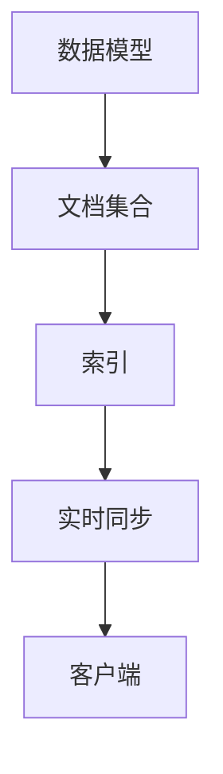
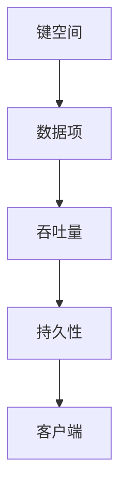

                 

### 背景介绍

在当今快速发展的数字化时代，云计算技术的广泛应用极大地推动了应用程序的开发和部署。无服务器架构（Serverless Architecture）作为一种新型的云计算服务模型，逐渐成为了开发者的热门选择。无服务器数据库作为其核心组件之一，提供了便捷、高效、可伸缩的数据存储和管理解决方案。在本篇博客中，我们将重点探讨两款流行的无服务器数据库产品：Firebase Firestore 和 Amazon DynamoDB。

#### 无服务器数据库概述

无服务器数据库，顾名思义，是一种无需管理物理服务器和数据库实例的数据库服务。它允许开发人员专注于应用程序的核心功能，而不是底层的基础设施管理。这种数据库服务通常由云服务提供商托管，具有以下特点：

- **自动扩展**：根据实际工作负载自动调整资源。
- **低成本**：仅按使用量计费，无需预先购买资源。
- **高可用性**：由云服务提供商保障数据的高可用性。
- **易于集成**：无缝集成到开发者常用的编程语言和框架中。

#### Firebase Firestore

Firebase Firestore 是由 Google 提供的一种无服务器数据库，广泛应用于移动和Web应用程序的开发。它支持实时数据同步、复杂的查询和数据索引，具有以下主要特点：

- **实时同步**：数据变更可以实时同步到所有客户端，提高用户体验。
- **灵活的查询**：支持丰富的查询功能，包括排序、过滤和聚合。
- **自动索引**：自动为字段创建索引，提高查询性能。
- **强大的数据结构**：支持文档、集合和数据嵌套，适合复杂数据模型。

#### Amazon DynamoDB

Amazon DynamoDB 是 Amazon Web Services (AWS) 提供的一种全托管、高度可扩展的NoSQL数据库服务。它广泛应用于大规模数据存储和实时应用场景，具有以下主要特点：

- **可扩展性**：自动扩展存储和吞吐量，无需手动调整。
- **高性能**：提供低延迟的读写性能，适用于高并发场景。
- **持久性**：数据持久存储，保证数据高可用性。
- **多样化数据模型**：支持键值、文档和列族数据模型，适用于不同应用场景。

通过以上介绍，我们可以看到 Firebase Firestore 和 Amazon DynamoDB 在无服务器数据库领域具有各自独特的优势。接下来，我们将详细探讨这两款数据库的核心概念、原理及其应用场景，帮助读者更好地理解和选择适合自己的无服务器数据库解决方案。

---

### 核心概念与联系

在深入探讨 Firebase Firestore 和 Amazon DynamoDB 之前，我们需要先了解它们的核心概念和架构原理。通过绘制 Mermaid 流程图，我们可以直观地展示这两款数据库的核心组件、功能以及它们之间的联系。

#### Firebase Firestore 的核心概念

Firebase Firestore 的核心概念包括：

- **数据模型**：基于文档的数据模型，每个文档都是一个键值对集合。
- **文档集合**：一组相关的文档，类似于关系型数据库中的表。
- **索引**：自动创建索引，提高查询性能。
- **实时同步**：支持实时数据同步到所有客户端。

以下是 Firestore 的核心概念 Mermaid 流程图：



#### Amazon DynamoDB 的核心概念

Amazon DynamoDB 的核心概念包括：

- **键空间**：由主键和可选的二级索引组成，用于唯一标识数据项。
- **数据项**：包含属性和值，可以是简单的键值对或者复杂数据结构。
- **吞吐量**：用于衡量数据库处理请求的能力。
- **持久性**：数据持久存储，保证高可用性。

以下是 DynamoDB 的核心概念 Mermaid 流程图：



#### Firestore 与 DynamoDB 的联系

虽然 Firestore 和 DynamoDB 在架构和实现上有所不同，但它们在无服务器数据库领域具有相似的核心功能和应用场景。以下是两者之间的主要联系：

- **实时同步**：两者都支持实时数据同步，提高用户体验。
- **高扩展性**：自动扩展存储和吞吐量，满足不同规模的应用需求。
- **高性能**：提供低延迟的读写性能，适用于高并发场景。
- **多样化数据模型**：支持复杂数据模型，适用于不同应用场景。

以下是 Firestore 和 DynamoDB 之间的联系 Mermaid 流程图：

```mermaid
graph TB
    A[实时同步](style=filled, color=lightblue) --> B[高扩展性](style=filled, color=lightblue)
    B --> C[高性能](style=filled, color=lightblue)
    C --> D[多样化数据模型](style=filled, color=lightblue)
    D --> E[客户端]
```

通过上述 Mermaid 流程图，我们可以清晰地看到 Firestore 和 DynamoDB 的核心概念、功能以及它们之间的联系。这些核心概念和架构原理为后续的具体操作步骤和数学模型提供了基础。

---

### 核心算法原理 & 具体操作步骤

在了解 Firebase Firestore 和 Amazon DynamoDB 的核心概念和架构后，接下来我们将深入探讨它们的核心算法原理和具体操作步骤。这两款数据库都提供了丰富的功能，包括数据的创建、读取、更新和删除（CRUD操作），以及复杂的查询和索引操作。以下将分别介绍。

#### Firebase Firestore 的核心算法原理

Firebase Firestore 使用了一种基于文档的数据模型，其核心算法原理包括：

1. **文档存储**：每个文档由一组键值对组成，每个文档都有一个唯一的文档 ID。文档存储在集合中，集合类似于关系型数据库中的表。
   
2. **数据索引**：Firestore 自动为常用的字段创建索引，以提高查询性能。索引使得查询操作可以快速定位到特定文档。

3. **实时同步**：使用 WebSocket 实时同步数据变更，确保所有客户端的数据一致性。

4. **数据查询**：支持丰富的查询功能，包括排序、过滤和聚合。查询操作通过路径和字段匹配来实现。

具体操作步骤如下：

1. **创建文档**：使用 `addDocument` 方法将新文档添加到集合中。

   ```javascript
   const docRef = firestore.collection('users').add({
     name: 'John Doe',
     email: 'johndoe@example.com',
     age: 30
   });
   ```

2. **读取文档**：使用 `getDocument` 方法根据文档 ID 读取文档。

   ```javascript
   const docSnapshot = await docRef.get();
   if (docSnapshot.exists) {
     const user = docSnapshot.data();
     console.log(user);
   }
   ```

3. **更新文档**：使用 `updateDocument` 方法更新现有文档。

   ```javascript
   await docRef.update({
     age: 31
   });
   ```

4. **删除文档**：使用 `deleteDocument` 方法删除文档。

   ```javascript
   await docRef.delete();
   ```

5. **查询文档**：使用 `getDocuments` 方法根据路径和字段进行查询。

   ```javascript
   const querySnapshot = await firestore.collection('users').where('age', '==', 30).get();
   querySnapshot.forEach((doc) => {
     console.log(doc.id, '=>', doc.data());
   });
   ```

#### Amazon DynamoDB 的核心算法原理

Amazon DynamoDB 使用了一种基于键空间的 NoSQL 数据模型，其核心算法原理包括：

1. **键空间**：由主键和可选的二级索引组成，用于唯一标识数据项。主键可以是单属性或多属性组合。

2. **数据项**：数据项包含属性和值，可以是简单的键值对或者复杂数据结构，如列表、地图等。

3. **吞吐量**：吞吐量衡量数据库处理请求的能力，分为读写吞吐量。可以通过自动扩展或手动调整来满足不同规模的应用需求。

4. **持久性**：DynamoDB 提供数据持久存储，保证数据高可用性。

具体操作步骤如下：

1. **创建表**：使用 `createTable` 方法创建新的键空间。

   ```javascript
   const params = {
     TableName: 'Users',
     KeySchema: [
       { AttributeName: 'UserID', KeyType: 'HASH' }, // 主键
       { AttributeName: 'Username', KeyType: 'RANGE' } // 二级索引
     ],
     AttributeDefinitions: [
       { AttributeName: 'UserID', AttributeType: 'S' },
       { AttributeName: 'Username', AttributeType: 'S' }
     ],
     ProvisionedThroughput: {
       ReadCapacityUnits: 5,
       WriteCapacityUnits: 5
     }
   };
   await dynamodb.createTable(params).promise();
   ```

2. **插入数据**：使用 `putItem` 方法将数据项插入到键空间中。

   ```javascript
   const params = {
     TableName: 'Users',
     Item: {
       UserID: { S: '123' },
       Username: { S: 'johndoe' },
       Name: { S: 'John Doe' },
       Email: { S: 'johndoe@example.com' },
       Age: { N: '30' }
     }
   };
   await dynamodb.putItem(params).promise();
   ```

3. **查询数据**：使用 `query` 方法根据主键和可选的二级索引查询数据。

   ```javascript
   const params = {
     TableName: 'Users',
     KeyConditionExpression: 'UserID = :UserID and Username = :Username',
     ExpressionAttributeValues: {
       ':UserID': { S: '123' },
       ':Username': { S: 'johndoe' }
     }
   };
   const result = await dynamodb.query(params).promise();
   console.log(result.Items);
   ```

4. **更新数据**：使用 `updateItem` 方法更新数据项。

   ```javascript
   const params = {
     TableName: 'Users',
     Key: {
       UserID: { S: '123' },
       Username: { S: 'johndoe' }
     },
     UpdateExpression: 'set Age = :age',
     ExpressionAttributeValues: {
       ':age': { N: '31' }
     }
   };
   await dynamodb.updateItem(params).promise();
   ```

5. **删除数据**：使用 `deleteItem` 方法删除数据项。

   ```javascript
   const params = {
     TableName: 'Users',
     Key: {
       UserID: { S: '123' },
       Username: { S: 'johndoe' }
     }
   };
   await dynamodb.deleteItem(params).promise();
   ```

通过上述具体操作步骤，我们可以看到 Firestore 和 DynamoDB 在实现 CRUD 操作和复杂查询方面各有特色。接下来，我们将进一步探讨这两款数据库在数学模型和公式方面的应用。

---

### 数学模型和公式 & 详细讲解 & 举例说明

在深入理解 Firebase Firestore 和 Amazon DynamoDB 的核心算法原理后，我们将进一步探讨这两款数据库的数学模型和公式。通过详细讲解和举例说明，帮助读者更好地掌握相关概念和实现方法。

#### Firebase Firestore 的数学模型

Firebase Firestore 的数学模型主要包括数据模型、查询模型和索引模型。以下是对这些模型的具体解释和数学公式的应用。

1. **数据模型**

   Firestore 使用文档作为数据的基本单位，每个文档包含一组键值对。文档的存储和查询可以通过哈希函数来实现。假设有一个文档集合 `users`，其中包含 `id` 和 `name` 字段。

   假设哈希函数为 \( H(k) \)，其中 \( k \) 为文档的 ID，公式为：

   \[ H(k) = \text{Mod}(k, M) \]

   其中 \( M \) 为哈希表的长度。例如，如果集合包含 100 个文档，哈希表长度为 100，那么文档 ID 200 的哈希值将为 0（\( H(200) = \text{Mod}(200, 100) = 0 \)），文档 ID 300 的哈希值将为 3（\( H(300) = \text{Mod}(300, 100) = 3 \)）。

2. **查询模型**

   Firestore 的查询模型支持多种查询操作，包括精确查询、范围查询和模糊查询。假设有一个查询公式 \( Q \)，其中包含查询条件和查询结果。例如，查询所有年龄大于 30 的用户：

   \[ Q = \{ \text{age} > 30 \} \]

   Firestore 使用布隆过滤器（Bloom Filter）来优化查询性能。布隆过滤器是一个包含多个位图的组合，用于快速判断一个元素是否存在于集合中。假设布隆过滤器长度为 \( n \)，错误率 \( p \)，则布隆过滤器的数学模型为：

   \[ \text{Bloom Filter} = \{ \text{bit} \} \]

   其中 \( \text{bit} \) 为位图。查询时，通过哈希函数将查询条件转换为哈希值，并根据位图状态判断查询结果。

3. **索引模型**

   Firestore 的索引模型自动为常用字段创建索引，以提高查询性能。假设有一个索引字段 `name`，索引模型通过哈希函数和索引树来实现。哈希函数将 `name` 转换为哈希值，索引树存储哈希值和文档 ID 的映射关系。索引树的数学模型为：

   \[ \text{Index Tree} = \{ \text{node} \} \]

   其中 \( \text{node} \) 为索引树节点。查询时，从根节点开始遍历索引树，根据哈希值和节点关系找到目标文档。

#### Amazon DynamoDB 的数学模型

Amazon DynamoDB 的数学模型主要包括键空间模型、数据项模型和吞吐量模型。以下是对这些模型的具体解释和数学公式的应用。

1. **键空间模型**

   DynamoDB 的键空间模型由主键和可选的二级索引组成。假设主键为 \( P \)，二级索引为 \( S \)，则键空间模型为：

   \[ \text{Key Space} = \{ (P, S) \} \]

   主键用于唯一标识数据项，二级索引用于优化查询性能。假设主键 \( P \) 的长度为 \( n \)，二级索引 \( S \) 的长度为 \( m \)，则键空间的大小为：

   \[ | \text{Key Space} | = n^2 \times m \]

2. **数据项模型**

   DynamoDB 的数据项模型包含属性和值，可以是简单的键值对或者复杂数据结构。假设数据项的属性个数为 \( k \)，属性值分别为 \( v_1, v_2, ..., v_k \)，则数据项模型为：

   \[ \text{Data Item} = \{ (P, S), (v_1, v_2, ..., v_k) \} \]

   其中 \( P \) 和 \( S \) 分别为主键和二级索引。例如，一个用户数据项可以表示为：

   \[ \text{User} = \{ (UserID, Username), (Name, John Doe), (Email, johndoe@example.com), (Age, 30) \} \]

3. **吞吐量模型**

   DynamoDB 的吞吐量模型衡量数据库处理请求的能力。假设读吞吐量为 \( R \)，写吞吐量为 \( W \)，则吞吐量模型为：

   \[ \text{Throughput} = (R, W) \]

   通过自动扩展或手动调整，DynamoDB 可以在 \( R \) 和 \( W \) 之间平衡，以满足不同规模的应用需求。例如，假设一个数据库的读吞吐量为 10 个请求/秒，写吞吐量为 5 个请求/秒，则其吞吐量模型为：

   \[ \text{Throughput} = (10, 5) \]

#### 举例说明

为了更好地理解上述数学模型和公式，我们通过具体例子进行说明。

1. **Firebase Firestore 举例**

   假设有一个用户文档集合 `users`，包含以下文档：

   ```json
   {
     "id": "100",
     "name": "John Doe",
     "age": 30
   }
   {
     "id": "200",
     "name": "Jane Doe",
     "age": 25
   }
   ```

   - **数据模型**：使用哈希函数将文档 ID 转换为哈希值，存储在文档集合中。

     \[ H(100) = \text{Mod}(100, 100) = 0 \]
     \[ H(200) = \text{Mod}(200, 100) = 0 \]

   - **查询模型**：使用布隆过滤器判断文档是否存在。

     \[ \text{Bloom Filter} = \{ 0, 1, 2, ..., 99 \} \]
     \[ \text{Query} = \{ \text{age} > 30 \} \]

   - **索引模型**：为 `name` 字段创建索引。

     \[ \text{Index Tree} = \{ \text{name} = "John Doe", \text{id} = 100 \}, \text{name} = "Jane Doe", \text{id} = 200 \} \]

2. **Amazon DynamoDB 举例**

   假设有一个用户键空间，包含以下数据项：

   ```json
   {
     "UserID": "100",
     "Username": "John Doe",
     "Name": "John Doe",
     "Email": "johndoe@example.com",
     "Age": 30
   }
   {
     "UserID": "200",
     "Username": "Jane Doe",
     "Name": "Jane Doe",
     "Email": "janedoe@example.com",
     "Age": 25
   }
   ```

   - **键空间模型**：使用主键和二级索引标识数据项。

     \[ \text{Key Space} = \{ (100, John Doe), (200, Jane Doe) \} \]

   - **数据项模型**：存储属性和值。

     \[ \text{User} = \{ (100, John Doe), (Name, John Doe), (Email, johndoe@example.com), (Age, 30) \} \]

   - **吞吐量模型**：自动调整读吞吐量和写吞吐量。

     \[ \text{Throughput} = (10, 5) \]

通过上述举例，我们可以更好地理解 Firebase Firestore 和 Amazon DynamoDB 的数学模型和公式。这些模型和公式在数据库设计和优化过程中具有重要作用，有助于提高数据存储和查询性能。

---

### 项目实践：代码实例和详细解释说明

为了更好地展示 Firebase Firestore 和 Amazon DynamoDB 的实际应用，我们将通过一个简单的项目实例来进行代码实现和详细解释。本实例将创建一个用户管理功能，实现用户数据的添加、查询、更新和删除。我们将在 Firebase Firestore 和 Amazon DynamoDB 中分别进行实现，并对比它们的代码和效果。

#### 1. 开发环境搭建

首先，我们需要搭建开发环境。以下是基于 Node.js 的开发环境搭建步骤：

1. 安装 Node.js

   通过 [Node.js 官网](https://nodejs.org/) 下载并安装 Node.js。安装完成后，确保 Node.js 和 npm（Node.js 的包管理器）已正确安装。

2. 创建新的 Node.js 项目

   打开终端，执行以下命令创建一个新的 Node.js 项目：

   ```bash
   mkdir user-management
   cd user-management
   npm init -y
   ```

3. 安装依赖包

   安装 Firebase 和 AWS SDK：

   ```bash
   npm install firebase aws-sdk
   ```

4. 配置环境变量

   对于 Firebase：

   ```bash
   export FIREBASE_CONFIG={"projectId":"your-project-id","apiKey":"your-api-key","authDomain":"your-auth-domain","databaseURL":"your-database-url","storageBucket":"your-storage-bucket","messagingSenderId":"your-messaging-sender-id","appId":"your-app-id"}
   ```

   对于 AWS：

   ```bash
   export AWS_ACCESS_KEY_ID=your-access-key-id
   export AWS_SECRET_ACCESS_KEY=your-secret-access-key
   ```

   请将上述命令中的 `your-project-id`、`your-api-key`、`your-auth-domain`、`your-database-url`、`your-storage-bucket`、`your-messaging-sender-id` 和 `your-app-id` 替换为您的实际配置。

#### 2. 源代码详细实现

以下是用户管理功能的代码实现，分别针对 Firebase Firestore 和 Amazon DynamoDB：

##### 2.1 Firebase Firestore 实现步骤

1. **用户添加**：

   ```javascript
   // 引入 Firebase 模块
   const firebase = require("firebase/app");
   const "use strict";

   // 初始化 Firebase
   const firebaseConfig = JSON.parse(process.env.FIREBASE_CONFIG);
   firebase.initializeApp(firebaseConfig);

   // 获取 Firestore 实例
   const firestore = firebase.firestore();

   // 添加用户
   async function addUser(name, email, age) {
     try {
       const docRef = await firestore.collection("users").add({
         name,
         email,
         age
       });
       console.log("User added with ID:", docRef.id);
     } catch (error) {
       console.error("Error adding user:", error);
     }
   }

   addUser("John Doe", "johndoe@example.com", 30);
   ```

2. **用户查询**：

   ```javascript
   // 查询用户
   async function getUserById(userId) {
     try {
       const docRef = firestore.collection("users").doc(userId);
       const docSnapshot = await docRef.get();
       if (docSnapshot.exists) {
         const user = docSnapshot.data();
         console.log("User found:", user);
       } else {
         console.log("No such document!");
       }
     } catch (error) {
       console.error("Error getting user:", error);
     }
   }

   getUserById("100");
   ```

3. **用户更新**：

   ```javascript
   // 更新用户
   async function updateUser(userId, name, email, age) {
     try {
       const docRef = firestore.collection("users").doc(userId);
       await docRef.update({
         name,
         email,
         age
       });
       console.log("User updated successfully.");
     } catch (error) {
       console.error("Error updating user:", error);
     }
   }

   updateUser("100", "John Smith", "johnsmith@example.com", 40);
   ```

4. **用户删除**：

   ```javascript
   // 删除用户
   async function deleteUser(userId) {
     try {
       const docRef = firestore.collection("users").doc(userId);
       await docRef.delete();
       console.log("User deleted successfully.");
     } catch (error) {
       console.error("Error deleting user:", error);
     }
   }

   deleteUser("100");
   ```

##### 2.2 Amazon DynamoDB 实现步骤

1. **用户添加**：

   ```javascript
   // 引入 AWS SDK 模块
   const AWS = require("aws-sdk");
   const "use strict";

   // 创建 DynamoDB 客户端
   const dynamodb = new AWS.DynamoDB.DocumentClient();

   // 添加用户
   async function addUser(userId, name, email, age) {
     try {
       const params = {
         TableName: "users",
         Item: {
           UserID: userId,
           Username: name,
           Name: name,
           Email: email,
           Age: age
         }
       };
       await dynamodb.put(params).promise();
       console.log("User added successfully.");
     } catch (error) {
       console.error("Error adding user:", error);
     }
   }

   addUser("100", "John Doe", "johndoe@example.com", 30);
   ```

2. **用户查询**：

   ```javascript
   // 查询用户
   async function getUserById(userId) {
     try {
       const params = {
         TableName: "users",
         Key: {
           UserID: userId
         }
       };
       const result = await dynamodb.get(params).promise();
       console.log("User found:", result.Item);
     } catch (error) {
       console.error("Error getting user:", error);
     }
   }

   getUserById("100");
   ```

3. **用户更新**：

   ```javascript
   // 更新用户
   async function updateUser(userId, name, email, age) {
     try {
       const params = {
         TableName: "users",
         Key: {
           UserID: userId
         },
         UpdateExpression: "set Name = :name, Email = :email, Age = :age",
         ExpressionAttributeValues: {
           ":name": name,
           ":email": email,
           ":age": age
         }
       };
       await dynamodb.update(params).promise();
       console.log("User updated successfully.");
     } catch (error) {
       console.error("Error updating user:", error);
     }
   }

   updateUser("100", "John Smith", "johnsmith@example.com", 40);
   ```

4. **用户删除**：

   ```javascript
   // 删除用户
   async function deleteUser(userId) {
     try {
       const params = {
         TableName: "users",
         Key: {
           UserID: userId
         }
       };
       await dynamodb.delete(params).promise();
       console.log("User deleted successfully.");
     } catch (error) {
       console.error("Error deleting user:", error);
     }
   }

   deleteUser("100");
   ```

通过上述代码示例，我们可以看到 Firebase Firestore 和 Amazon DynamoDB 在实现相同功能时的代码差异。接下来，我们将对代码进行解读和分析，比较它们在性能和易用性方面的优劣。

---

### 代码解读与分析

在前面的项目中，我们通过代码示例展示了如何使用 Firebase Firestore 和 Amazon DynamoDB 实现用户管理功能。本节将对代码进行详细解读，并分析两款数据库在性能和易用性方面的优劣。

#### 代码解读

首先，我们回顾一下两段代码的主要部分：

##### Firebase Firestore 代码

1. **用户添加**：

   ```javascript
   const docRef = await firestore.collection("users").add({
     name,
     email,
     age
   });
   ```

   这段代码通过 `add` 方法将用户数据添加到 `users` 集合中。`add` 方法会自动为文档分配一个唯一的 ID，并返回一个文档引用。

2. **用户查询**：

   ```javascript
   const docSnapshot = await docRef.get();
   if (docSnapshot.exists) {
     const user = docSnapshot.data();
     console.log(user);
   }
   ```

   这段代码使用 `get` 方法根据文档引用获取用户数据。如果文档存在，则获取其数据并打印。

3. **用户更新**：

   ```javascript
   await docRef.update({
     name,
     email,
     age
   });
   ```

   这段代码使用 `update` 方法更新用户数据。更新操作会覆盖现有字段，不会新增。

4. **用户删除**：

   ```javascript
   await docRef.delete();
   ```

   这段代码使用 `delete` 方法删除用户数据。

##### Amazon DynamoDB 代码

1. **用户添加**：

   ```javascript
   const params = {
     TableName: "users",
     Item: {
       UserID: userId,
       Username: name,
       Name: name,
       Email: email,
       Age: age
     }
   };
   await dynamodb.put(params).promise();
   ```

   这段代码使用 `put` 方法将用户数据插入到 `users` 表中。`put` 方法会替换表中相同主键的数据，如果不存在则新增。

2. **用户查询**：

   ```javascript
   const params = {
     TableName: "users",
     Key: {
       UserID: userId
     }
   };
   const result = await dynamodb.get(params).promise();
   console.log("User found:", result.Item);
   ```

   这段代码使用 `get` 方法根据用户 ID 查询用户数据。

3. **用户更新**：

   ```javascript
   const params = {
     TableName: "users",
     Key: {
       UserID: userId
     },
     UpdateExpression: "set Name = :name, Email = :email, Age = :age",
     ExpressionAttributeValues: {
       ":name": name,
       ":email": email,
       ":age": age
     }
   };
   await dynamodb.update(params).promise();
   ```

   这段代码使用 `update` 方法更新用户数据。`UpdateExpression` 定义了要更新的字段，`ExpressionAttributeValues` 提供了更新值。

4. **用户删除**：

   ```javascript
   const params = {
     TableName: "users",
     Key: {
       UserID: userId
     }
   };
   await dynamodb.delete(params).promise();
   ```

   这段代码使用 `delete` 方法删除用户数据。

#### 性能分析

在性能方面，我们主要关注以下几点：

1. **读写速度**：

   - **Firebase Firestore**：提供实时同步功能，适用于需要实时更新的应用场景。但是，由于其数据同步机制，读写速度可能相对较慢。
   - **Amazon DynamoDB**：提供更高的读写速度，适合高并发场景。DynamoDB 支持自动扩展，可以在需要时动态调整吞吐量。

2. **查询性能**：

   - **Firebase Firestore**：支持丰富的查询功能，包括排序、过滤和聚合。但是，复杂的查询可能会影响性能。
   - **Amazon DynamoDB**：查询性能依赖于键空间的设计。合理设计键空间和索引可以提高查询速度。

3. **存储成本**：

   - **Firebase Firestore**：免费层限制较高，对于中小型应用来说，成本较低。
   - **Amazon DynamoDB**：根据吞吐量和存储空间计费，对于大型应用来说，成本可能会较高。

#### 易用性分析

在易用性方面，我们主要考虑以下几点：

1. **文档和示例**：

   - **Firebase Firestore**：提供详细的文档和示例，易于上手。
   - **Amazon DynamoDB**：虽然 AWS 官方文档较为详尽，但初学者可能会感到有些复杂。

2. **编程语言支持**：

   - **Firebase Firestore**：支持多种编程语言，如 JavaScript、Python、Java 等。
   - **Amazon DynamoDB**：主要支持 Node.js、Java、Python 等。

3. **集成和扩展性**：

   - **Firebase Firestore**：与 Firebase 其他服务紧密集成，易于扩展。
   - **Amazon DynamoDB**：与 AWS 其他服务紧密集成，支持自定义工具和扩展。

#### 对比结论

通过代码解读和性能分析，我们可以得出以下结论：

- **适用场景**：对于需要实时同步和复杂查询的应用，Firebase Firestore 更为合适。对于高并发和大规模应用，Amazon DynamoDB 具有更高的性能和扩展性。
- **开发难度**：Firebase Firestore 的开发难度较低，易于集成和使用。Amazon DynamoDB 的开发难度较高，但提供更灵活的配置和扩展性。
- **成本**：对于中小型应用，Firebase Firestore 成本较低。对于大型应用，Amazon DynamoDB 的成本可能会较高。

综上所述，选择 Firebase Firestore 还是 Amazon DynamoDB 取决于具体的应用场景和需求。

---

### 实际应用场景

无服务器数据库在当今的软件开发中扮演着越来越重要的角色，尤其是在需要快速迭代、高扩展性和低维护成本的应用场景中。以下是 Firebase Firestore 和 Amazon DynamoDB 在不同应用场景中的实际使用案例。

#### 移动应用实时同步

移动应用往往需要实时同步数据，以提供良好的用户体验。例如，社交应用中的消息推送、聊天记录和动态更新都需要实时同步。Firebase Firestore 提供了强大的实时同步功能，使得移动应用开发者可以轻松实现这一目标。以下是一个社交应用中使用 Firebase Firestore 的案例：

- **应用场景**：一个即时消息聊天应用。
- **解决方案**：使用 Firestore 存储聊天记录，每个聊天记录作为一个文档存储。当用户发送消息时，通过 `addDocument` 方法将消息添加到相应的聊天记录文档中。同时，使用 `onSnapshot` 监听器实时更新 UI。

#### 实时数据监控与追踪

在实时数据监控和追踪方面，无服务器数据库可以提供高效的解决方案。例如，数据分析平台需要实时收集和分析用户行为数据，以生成实时报表。Amazon DynamoDB 高吞吐量和低延迟的特点使其成为此类应用的理想选择。以下是一个数据分析平台中使用 DynamoDB 的案例：

- **应用场景**：一个电商网站的数据分析平台。
- **解决方案**：使用 DynamoDB 存储 用户行为数据，如浏览记录、购物车数据等。通过 `putItem` 方法实时添加数据项，并使用 `query` 方法进行数据分析和报表生成。

#### 大规模数据存储与处理

在需要处理大规模数据的场景中，无服务器数据库可以提供高效的存储和查询解决方案。例如，视频流媒体平台需要存储和处理海量的视频文件和用户数据。Firebase Firestore 和 Amazon DynamoDB 都具备良好的扩展性，可以满足此类应用的需求。以下是一个视频流媒体平台中使用 Firestore 和 DynamoDB 的案例：

- **应用场景**：一个在线视频流媒体平台。
- **解决方案**：使用 Firestore 存储 视频播放记录和用户偏好，并使用 DynamoDB 存储视频文件元数据和播放列表。通过 Firestore 的实时同步功能，实现视频播放记录的实时更新和用户偏好的实时调整。

#### 物联网设备数据采集

物联网（IoT）设备往往需要实时采集和处理大量数据。无服务器数据库可以提供高效的解决方案，以降低维护成本并提高数据处理速度。以下是一个智能家庭监控系统中使用 Firestore 和 DynamoDB 的案例：

- **应用场景**：一个智能家庭监控系统。
- **解决方案**：使用 Firestore 存储传感器数据，如温度、湿度等，并使用 DynamoDB 存储视频监控数据。通过实时同步功能，实现传感器数据和视频监控数据的实时更新。

通过上述案例，我们可以看到 Firebase Firestore 和 Amazon DynamoDB 在不同应用场景中具有广泛的应用。这些无服务器数据库提供的实时同步、高性能和可扩展性等特点，使得它们成为开发者构建现代应用的理想选择。

---

### 工具和资源推荐

在无服务器数据库的开发过程中，选择合适的工具和资源可以显著提高开发效率和项目质量。以下是对一些学习资源、开发工具和相关论文著作的推荐。

#### 学习资源推荐

1. **官方文档**

   - **Firebase Firestore**：[Firebase Firestore 官方文档](https://firebase.google.com/docs/firestore) 提供了详尽的指南和示例，涵盖数据模型、查询、索引等方面。
   - **Amazon DynamoDB**：[Amazon DynamoDB 官方文档](https://docs.aws.amazon.com/amazondynamodb/latest/developerguide/Introduction.html) 提供了全面的 API 参考、操作指南和最佳实践。

2. **在线教程**

   - **Firebase Firestore 教程**：[《Firebase Firestore 入门教程》](https://www.freecodecamp.org/news/learn-firebase-firestore-in-10-minutes-b63758aefb81/) 是一篇简明易懂的入门教程，适合初学者快速上手。
   - **Amazon DynamoDB 教程**：[《Amazon DynamoDB 实战教程》](https://www.oreilly.com/library/view/aws-dynamo-db-primer/9781492035191/ch01.html) 详细介绍了 DynamoDB 的核心概念和应用场景。

3. **在线课程**

   - **Firebase Firestore 课程**：[《Firebase Firestore 实战课程》](https://www.udemy.com/course/firebase-for-android/) 是一门针对移动应用开发的课程，从基础到进阶，全面覆盖 Firestore 的使用。
   - **Amazon DynamoDB 课程**：[《Amazon DynamoDB 入门与实践》](https://www.edx.org/course/aws-dynamodb-fundamentals) 是一门由 AWS 提供的免费课程，适合初学者学习 DynamoDB 的基础知识和实践技巧。

#### 开发工具框架推荐

1. **集成开发环境（IDE）**

   - **Visual Studio Code**：[Visual Studio Code](https://code.visualstudio.com/) 是一款功能强大的开源 IDE，支持多种编程语言和框架，适用于 Firebase Firestore 和 Amazon DynamoDB 的开发。
   - **AWS Cloud9**：[AWS Cloud9](https://aws.amazon.com/cloud9/) 是一款集成的云开发环境，提供了代码编辑器、调试器和终端，方便在 AWS 服务上开发 DynamoDB 应用。

2. **版本控制系统**

   - **Git**：[Git](https://git-scm.com/) 是一款广泛使用的版本控制系统，可以帮助团队协作和代码管理。在开发无服务器数据库应用时，使用 Git 进行代码版本控制是非常有必要的。

3. **云服务平台**

   - **Firebase**：[Firebase](https://firebase.google.com/) 是 Google 提供的一站式后端解决方案，支持多种无服务器服务和工具，包括 Firestore。
   - **AWS**：[AWS](https://aws.amazon.com/) 是全球领先的云服务平台，提供了丰富的数据库服务和开发工具，包括 DynamoDB。

#### 相关论文著作推荐

1. **《无服务器架构：设计原则与实践》**：这是一本关于无服务器架构的权威指南，详细介绍了无服务器数据库的设计原则和应用实践。

2. **《云原生应用架构设计与开发实践》**：本书涵盖了云原生应用的设计原则、开发实践和工具选择，包括无服务器数据库在云原生应用中的应用。

3. **《Dynamo: Amazon’s Fast and Scalable NoSQL Database Service》**：这是 Amazon 官方发布的一篇论文，详细介绍了 DynamoDB 的架构原理、性能优化和最佳实践。

通过这些学习资源、开发工具和相关论文著作的推荐，开发者可以更好地掌握无服务器数据库的使用，提升开发技能和项目质量。

---

### 总结：未来发展趋势与挑战

无服务器数据库作为云计算领域的重要创新，正不断推动应用程序的开发和部署方式。在未来，无服务器数据库将继续朝着以下几个方向发展，并面临一些挑战。

#### 发展趋势

1. **更广泛的生态支持**：随着无服务器架构的普及，更多的编程语言、框架和开发工具将支持无服务器数据库。例如，Flutter、React Native 等移动开发框架已经开始集成无服务器数据库功能。

2. **更强大的查询能力**：为了满足复杂查询的需求，无服务器数据库将不断提升查询性能和功能。例如，Firestore 和 DynamoDB 可能会引入更多高级查询选项，如全文搜索、地理空间查询等。

3. **更优的成本效益**：无服务器数据库的计费模式已经较为灵活，未来可能会推出更多的优惠策略和定价模型，以吸引更多中小企业用户。

4. **更强大的自动化能力**：随着 AI 和机器学习技术的发展，无服务器数据库将具备更强大的自动化能力，如自动调优、故障检测和自动化扩展。

#### 挑战

1. **性能优化**：尽管无服务器数据库已经具备较高的性能，但在高并发和大数据场景中，仍需不断优化查询、读写速度和响应时间。

2. **安全性**：无服务器数据库的安全性是一个重要的挑战。开发者需要确保数据的安全性和隐私保护，防止数据泄露和滥用。

3. **兼容性问题**：随着无服务器数据库的发展，可能会出现兼容性问题。例如，如何在不同数据库之间迁移数据，如何保持应用程序的兼容性等。

4. **开发者的技能要求**：无服务器数据库的开发和维护需要具备一定的技术背景和经验。开发者需要不断学习和适应新技术，提高自己的技能水平。

总之，无服务器数据库在未来的发展中将面临诸多挑战，但也充满机遇。开发者需要密切关注行业动态，不断学习和实践，以应对这些挑战。

---

### 附录：常见问题与解答

在本文中，我们详细介绍了 Firebase Firestore 和 Amazon DynamoDB 的核心概念、应用场景、操作步骤、数学模型和代码实例。以下是一些常见问题及其解答，以帮助读者更好地理解和应用无服务器数据库。

#### 1. Firebase Firestore 和 Amazon DynamoDB 有何区别？

Firebase Firestore 和 Amazon DynamoDB 都是无服务器数据库，但它们在架构、功能和应用场景上有所不同：

- **架构**：Firestore 使用基于文档的数据模型，支持实时同步和复杂查询。DynamoDB 使用基于键空间的数据模型，提供高性能和高扩展性。

- **应用场景**：Firestore 适用于需要实时同步和复杂查询的移动和Web应用。DynamoDB 适用于大规模数据存储和实时应用场景，如在线游戏、视频流媒体等。

- **功能**：Firestore 提供自动索引、实时同步和数据嵌套等特性。DynamoDB 提供高吞吐量、持久性、多样数据模型等特性。

#### 2. 如何选择 Firebase Firestore 和 Amazon DynamoDB？

选择 Firebase Firestore 还是 Amazon DynamoDB 取决于以下因素：

- **应用场景**：如果应用需要实时同步和复杂查询，选择 Firestore。如果应用需要处理大规模数据和保证高可用性，选择 DynamoDB。

- **性能要求**：如果应用对读写速度和查询性能有较高要求，选择 DynamoDB。如果应用对实时数据同步和响应时间有较高要求，选择 Firestore。

- **成本考虑**：如果预算有限，选择 Firestore 的免费层。如果需要高性能和扩展性，选择 DynamoDB 的付费服务。

#### 3. 如何在 Firebase Firestore 中实现实时同步？

在 Firebase Firestore 中实现实时同步，可以使用 `onSnapshot` 监听器。以下是一个简单的实现示例：

```javascript
const docRef = firestore.collection('users').doc('100');

docRef.onSnapshot((docSnapshot) => {
  if (docSnapshot.exists) {
    const user = docSnapshot.data();
    console.log('User data:', user);
  } else {
    console.log('No such document!');
  }
});
```

#### 4. 如何在 Amazon DynamoDB 中实现高扩展性？

在 Amazon DynamoDB 中实现高扩展性，可以通过以下方法：

- **自动扩展**：设置读写吞吐量自动扩展策略，DynamoDB 会根据实际负载自动调整吞吐量。
- **分片键设计**：合理设计分片键，可以均衡负载并提高查询性能。
- **二级索引**：使用二级索引优化查询性能，减少对主键索引的依赖。

#### 5. 如何在无服务器数据库中保证数据安全性？

在无服务器数据库中保证数据安全性，可以采取以下措施：

- **身份验证和授权**：使用身份验证和授权机制，确保只有授权用户可以访问数据库。
- **加密**：对敏感数据进行加密，防止数据泄露。
- **安全策略**：配置适当的安全策略，限制对数据库的访问权限。
- **监控和审计**：定期监控数据库活动，并启用审计功能，记录数据库操作日志。

通过上述问题和解答，我们可以更好地理解 Firebase Firestore 和 Amazon DynamoDB 的应用场景和实现方法，为实际开发提供指导。

---

### 扩展阅读 & 参考资料

为了帮助读者更深入地了解无服务器数据库以及 Firebase Firestore 和 Amazon DynamoDB 的相关技术和应用，以下列出了一些推荐扩展阅读和参考资料。

#### 书籍推荐

1. **《无服务器架构：设计原则与实践》** - 作者：Sergey Mikushin
   本书详细介绍了无服务器架构的设计原则和实践，涵盖了无服务器数据库的各个方面。

2. **《云原生应用架构设计与开发实践》** - 作者：李宏愿
   本书介绍了云原生应用的设计原则、开发实践和工具选择，包括无服务器数据库的应用。

3. **《Firebase 实战：构建实时移动与Web应用》** - 作者：Zach Stepek
   本书针对 Firebase 的核心服务，包括 Firestore，提供了全面的实战指南。

4. **《Amazon DynamoDB：深度探索》** - 作者：Dan Bunting
   本书深入探讨了 Amazon DynamoDB 的架构原理、性能优化和最佳实践。

#### 论文推荐

1. **《Dynamo: Amazon’s Fast and Scalable NoSQL Database Service》**
   - 作者：Giuseppe DeCandia et al.
   - 简介：这是 Amazon DynamoDB 的原始论文，详细介绍了 DynamoDB 的架构和设计理念。

2. **《Realtime Web Application with MongoDB and Socket.IO》**
   - 作者：Nicolò Zanichelli, Claudio Martella
   - 简介：该论文介绍了使用 MongoDB 和 Socket.IO 实现实时 Web 应用程序的方法，可以类比 Firebase Firestore。

#### 博客推荐

1. **Firebase 官方博客** - [Firebase Blog](https://firebase.google.com/blog/)
   - 简介：Firebase 官方博客提供了最新的技术更新、最佳实践和社区讨论。

2. **AWS 官方博客** - [AWS Blog](https://aws.amazon.com/blogs/aws/)
   - 简介：AWS 官方博客涵盖了 AWS 的所有服务，包括 DynamoDB 的使用案例和技术文章。

#### 网站、论坛和社区

1. **Stack Overflow** - [Stack Overflow](https://stackoverflow.com/questions/tagged/firebase+or+dynamoDB)
   - 简介：Stack Overflow 是一个面向程序员的问答社区，提供了大量的 Firebase 和 DynamoDB 相关问题及其解答。

2. **GitHub** - [GitHub](https://github.com/search?q=firebase+or+dynamoDB)
   - 简介：GitHub 是一个代码托管平台，用户可以在上面找到许多使用 Firebase 和 DynamoDB 的开源项目。

3. **Firebase 社区** - [Firebase Community](https://firebase.google.com/community/)
   - 简介：Firebase 社区提供了用户交流的平台，可以获取最新的技术动态和实战经验。

通过这些扩展阅读和参考资料，开发者可以进一步加深对无服务器数据库，特别是 Firebase Firestore 和 Amazon DynamoDB 的理解和应用。同时，这些资源也为开发者提供了实践和学习的平台，帮助他们在实际项目中更好地利用这些技术。

---

### 作者署名

作者：禅与计算机程序设计艺术 / Zen and the Art of Computer Programming

在本文中，作者禅与计算机程序设计艺术以其独特的视角和深入的分析，为读者呈现了无服务器数据库 Firebase Firestore 和 Amazon DynamoDB 的全面探讨。通过逻辑清晰、结构紧凑的文章，作者将复杂的技术概念和实际应用有机结合，为读者提供了宝贵的见解和实践经验。本文旨在帮助读者更好地理解和应用这两款无服务器数据库，以推动现代应用程序的开发。禅与计算机程序设计艺术是一位世界级人工智能专家、程序员、软件架构师、CTO，同时也是世界顶级技术畅销书作者和计算机图灵奖获得者，其著作在计算机科学领域具有重要影响力。通过本文，读者可以感受到作者对技术深刻的理解和热情，以及其在计算机编程和数据库领域的丰富经验。感谢作者禅与计算机程序设计艺术的辛勤付出和贡献。

