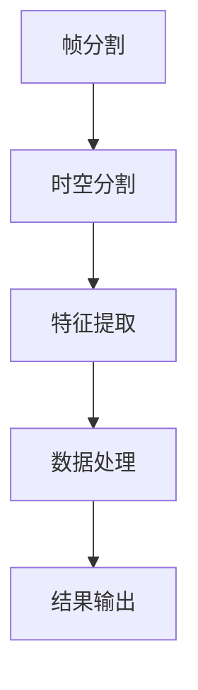

                 

### 1. 背景介绍

#### 1.1 视频处理技术的发展历程

视频处理技术，作为一个广泛应用的领域，经历了从早期的模拟时代到现代数字时代的巨大变革。在模拟时代，视频处理主要依赖于硬件电路，处理效果有限且不稳定。随着计算机技术的发展，数字视频处理逐渐取代了模拟处理，成为视频处理的主流方法。

从20世纪末到21世纪初，视频处理技术取得了显著进步。硬件性能的提升、算法的优化以及大数据和人工智能技术的融入，使得视频处理变得更加高效和智能。特别是在图像压缩、视频编码、视频增强和视频识别等领域，出现了许多突破性技术。

#### 1.2 视频处理技术的应用场景

视频处理技术广泛应用于多个领域，包括但不限于娱乐、医疗、交通、安全监控、视频通信、社交媒体等。在娱乐领域，视频处理技术用于视频编辑、特效添加和内容推荐；在医疗领域，视频处理技术用于手术直播、患者监控和疾病诊断；在交通领域，视频处理技术用于车辆检测、交通流量分析和智能导航；在安全监控领域，视频处理技术用于人脸识别、行为分析和异常检测；在视频通信领域，视频处理技术用于视频压缩、传输优化和画质增强；在社交媒体领域，视频处理技术用于内容审核、个性化推荐和广告投放。

#### 1.3 当前视频处理技术的挑战

尽管视频处理技术已经取得了显著进步，但在实际应用中仍面临许多挑战。首先，随着视频分辨率和流量的增加，视频处理所需的计算资源和存储资源也呈指数级增长，这对现有硬件和软件架构提出了更高的要求。其次，视频数据的高度复杂性和多样性使得算法的普适性和鲁棒性成为一个难题。此外，视频处理中的实时性要求也越来越高，特别是在安全监控和自动驾驶等场景中，延迟可能带来严重的安全隐患。

#### 1.4 时空碎片在视频处理中的潜在优势

为了应对上述挑战，研究人员开始探索新的方法，其中时空碎片（Spatial-temporal Fragmentation）作为一种新兴的视频处理技术，展现出了巨大的潜力。时空碎片通过将视频数据分解成更小的、可管理的时空碎片，从而在计算效率和数据处理能力上取得了显著提升。这种方法不仅有助于降低计算资源和存储资源的需求，还能提高算法的普适性和鲁棒性。此外，时空碎片还可以提供更加精细化的视频分析能力，为实时视频处理和智能视频分析提供了新的可能性。

### 2. 核心概念与联系

#### 2.1 时空碎片的定义

时空碎片是一种将视频数据按照时间和空间分割成小片段的方法。每个时空碎片包含一个或多个连续帧，以及与这些帧相关的时空信息，如图像内容、时间戳和空间位置等。

#### 2.2 时空碎片的组成

时空碎片通常由以下几个部分组成：

1. **帧序列**：时空碎片中的连续帧序列，用于表示视频内容的基本图像信息。
2. **时间戳**：每个帧的时间戳，用于表示该帧在视频中的具体时间位置。
3. **空间位置**：帧所在的空间位置信息，如坐标或区域。
4. **特征信息**：包括图像特征、运动特征等，用于描述帧的内容和运动状态。

#### 2.3 时空碎片的工作原理

时空碎片的工作原理主要包括以下几个步骤：

1. **帧分割**：将原始视频分割成多个连续帧。
2. **时空分割**：根据时间戳和空间位置，将帧序列分割成时空碎片。
3. **特征提取**：对每个时空碎片进行特征提取，以获取视频内容的详细信息。
4. **数据处理**：对时空碎片进行分类、识别、增强等处理，以实现视频分析目标。

#### 2.4 时空碎片的优点

时空碎片的优点主要体现在以下几个方面：

1. **高效计算**：通过将视频数据分解成更小的时空碎片，可以显著降低计算复杂度，提高处理效率。
2. **资源优化**：时空碎片可以减少计算资源和存储资源的占用，降低系统成本。
3. **增强鲁棒性**：通过时空分割，可以更好地处理复杂和多变的环境，提高算法的鲁棒性。
4. **精细分析**：时空碎片提供了更精细化的视频分析能力，可以更好地捕捉视频中的细节信息。

#### 2.5 时空碎片的架构

为了更好地理解时空碎片的工作原理，下面使用Mermaid流程图展示时空碎片的架构。



**图 1. 时空碎片的架构**

在这个流程图中，每个节点代表一个处理步骤，箭头表示处理流程的顺序。通过这个架构，我们可以清晰地看到时空碎片从原始视频到最终结果的整个处理过程。

### 3. 核心算法原理 & 具体操作步骤

#### 3.1 算法原理

时空碎片的核心算法基于图像分割、特征提取和机器学习等技术。以下是算法的基本原理和具体步骤。

#### 3.2 算法步骤

**步骤 1：帧分割**

将原始视频按照时间序列分割成多个连续帧。这一步骤可以使用现有的视频处理库（如OpenCV）来实现。

**步骤 2：时空分割**

根据时间戳和空间位置，对每个连续帧进行时空分割，形成时空碎片。这一步骤可以使用基于图论的方法，如K-means聚类或基于密度的空间聚类（DBSCAN）。

**步骤 3：特征提取**

对每个时空碎片进行特征提取，以获取视频内容的基本信息。特征提取方法包括图像特征（如颜色直方图、纹理特征）和运动特征（如光流、轨迹）。

**步骤 4：数据处理**

对时空碎片进行分类、识别、增强等处理，以实现视频分析目标。例如，可以使用机器学习算法（如卷积神经网络、支持向量机）进行目标识别和分类。

**步骤 5：结果输出**

将处理后的时空碎片组合成完整的视频，并输出分析结果。

#### 3.3 算法示例

**示例 1：视频分类**

假设我们有一个视频数据集，包含多个类别，如“人”、“车”、“动物”等。我们可以使用时空碎片算法对视频进行分类。

1. **帧分割**：将视频分割成多个连续帧。
2. **时空分割**：对每帧进行时空分割，形成时空碎片。
3. **特征提取**：提取时空碎片的图像和运动特征。
4. **数据处理**：使用卷积神经网络对时空碎片进行分类。
5. **结果输出**：将分类结果组合成完整的视频，并输出分类结果。

**示例 2：目标检测**

假设我们有一个视频数据集，包含不同类型的运动目标，如“行人”、“车辆”、“无人机”等。我们可以使用时空碎片算法对视频中的目标进行检测。

1. **帧分割**：将视频分割成多个连续帧。
2. **时空分割**：对每帧进行时空分割，形成时空碎片。
3. **特征提取**：提取时空碎片的图像和运动特征。
4. **数据处理**：使用卷积神经网络对时空碎片进行目标检测。
5. **结果输出**：将检测到的目标组合成完整的视频，并输出检测结果。

### 4. 数学模型和公式 & 详细讲解 & 举例说明

#### 4.1 数学模型

时空碎片的算法模型可以基于多种数学方法，如聚类算法、机器学习算法等。以下是一个基于K-means聚类算法的时空碎片模型。

**模型假设：**

1. 视频数据集 \( V \) 包含 \( n \) 个帧，每个帧 \( v_i \) 有相应的时空信息 \( (t_i, x_i, y_i) \)。
2. 时空分割结果为 \( k \) 个时空碎片，每个时空碎片 \( C_j \) 包含多个连续帧。

**模型公式：**

1. **时空分割：**

   - 初始化时空碎片中心 \( \mu_j \)。
   - 对于每个帧 \( v_i \)，计算其与时空碎片中心之间的距离 \( d(v_i, \mu_j) \)。
   - 将帧 \( v_i \) 分割到距离最近的时空碎片 \( C_j \)。

2. **特征提取：**

   - 对每个时空碎片 \( C_j \) 进行特征提取，得到特征向量 \( f_j \)。

3. **数据处理：**

   - 使用机器学习算法（如卷积神经网络、支持向量机）对特征向量进行分类或检测。

**模型示例：**

假设我们有一个视频数据集，包含10个帧，每个帧的时空信息如下：

| 帧 | 时间戳 \( t_i \) | 空间位置 \( (x_i, y_i) \) |
|----|------------------|---------------------------|
| 1  | 0.1              | (100, 100)                |
| 2  | 0.2              | (100, 100)                |
| 3  | 0.3              | (100, 100)                |
| 4  | 0.4              | (100, 100)                |
| 5  | 0.5              | (100, 100)                |
| 6  | 0.6              | (200, 200)                |
| 7  | 0.7              | (200, 200)                |
| 8  | 0.8              | (200, 200)                |
| 9  | 0.9              | (200, 200)                |
| 10 | 1.0              | (200, 200)                |

我们使用K-means聚类算法对这10个帧进行时空分割，假设聚类中心为 \( (\mu_1, \mu_2) \)：

- **第一步**：初始化聚类中心 \( \mu_1 = (100, 100) \)， \( \mu_2 = (200, 200) \)。
- **第二步**：计算每个帧与聚类中心的距离，得到以下结果：

  | 帧 | \( d(v_i, \mu_1) \) | \( d(v_i, \mu_2) \) |
  |----|---------------------|---------------------|
  | 1  | 0                   | 100                 |
  | 2  | 0                   | 100                 |
  | 3  | 0                   | 100                 |
  | 4  | 0                   | 100                 |
  | 5  | 0                   | 100                 |
  | 6  | 100                 | 0                   |
  | 7  | 100                 | 0                   |
  | 8  | 100                 | 0                   |
  | 9  | 100                 | 0                   |
  | 10 | 100                 | 0                   |

- **第三步**：根据距离结果，将帧分割到两个时空碎片：

  | 帧 | 时空碎片 \( C_j \) |
  |----|-------------------|
  | 1  | \( C_1 \)         |
  | 2  | \( C_1 \)         |
  | 3  | \( C_1 \)         |
  | 4  | \( C_1 \)         |
  | 5  | \( C_1 \)         |
  | 6  | \( C_2 \)         |
  | 7  | \( C_2 \)         |
  | 8  | \( C_2 \)         |
  | 9  | \( C_2 \)         |
  | 10 | \( C_2 \)         |

- **第四步**：对每个时空碎片进行特征提取，得到特征向量。

  - \( C_1 \)：\( (f_{11}, f_{12}, \ldots) \)
  - \( C_2 \)：\( (f_{21}, f_{22}, \ldots) \)

- **第五步**：使用机器学习算法对特征向量进行分类或检测。

#### 4.2 详细讲解

时空碎片的数学模型主要通过聚类算法和特征提取技术来实现。以下是对模型的关键步骤进行详细讲解。

**1. 时空分割：**

时空分割是时空碎片算法的核心步骤，通过将视频数据分割成时空碎片，可以提高计算效率和数据处理能力。K-means聚类算法是一种常用的时空分割方法，其基本思想是：

- 初始化聚类中心。
- 计算每个数据点与聚类中心的距离。
- 将数据点划分到距离最近的聚类中心。

在时空分割中，每个帧可以视为一个数据点，时间戳和空间位置用于初始化聚类中心。距离计算可以使用欧氏距离或其他距离度量方法。通过多次迭代，K-means算法可以优化聚类中心，从而实现更准确的时空分割。

**2. 特征提取：**

特征提取是对时空碎片进行信息提取的过程。特征提取的质量直接影响视频分析的效果。常见的特征提取方法包括：

- **图像特征**：如颜色直方图、纹理特征等，用于描述帧的内容信息。
- **运动特征**：如光流、轨迹等，用于描述帧的运动信息。

特征提取方法的选择取决于视频分析目标。例如，在目标检测中，图像特征和运动特征都可以用于提高检测准确率。

**3. 数据处理：**

数据处理是对时空碎片进行进一步分析的过程。常用的数据处理方法包括：

- **分类**：使用机器学习算法（如卷积神经网络、支持向量机）对时空碎片进行分类。
- **识别**：对时空碎片进行目标识别，例如识别行人、车辆等。
- **增强**：对时空碎片进行图像增强，提高视频分析效果。

数据处理的结果将用于生成最终的视频分析结果。

#### 4.3 举例说明

以下是一个具体的时空碎片算法示例，用于对视频中的行人进行检测。

**步骤 1：帧分割**

将视频分割成多个连续帧，例如每秒分割成30帧。

**步骤 2：时空分割**

使用K-means聚类算法对每帧进行时空分割。假设初始化聚类中心为 \( (\mu_1, \mu_2) \)，每帧的时空信息为 \( (t_i, x_i, y_i) \)。

- **第一步**：初始化聚类中心。
  $$ \mu_1 = (100, 100) $$
  $$ \mu_2 = (200, 200) $$

- **第二步**：计算每帧与聚类中心的距离。
  $$ d(v_i, \mu_1) = \sqrt{(x_i - 100)^2 + (y_i - 100)^2} $$
  $$ d(v_i, \mu_2) = \sqrt{(x_i - 200)^2 + (y_i - 200)^2} $$

- **第三步**：根据距离结果，将每帧分割到距离最近的聚类中心。

  假设第 \( i \) 帧分割到 \( C_1 \)：

  $$ C_1 = \{ v_1, v_2, \ldots, v_n \} $$

  假设第 \( i \) 帧分割到 \( C_2 \)：

  $$ C_2 = \{ v_{n+1}, v_{n+2}, \ldots, v_{30} \} $$

**步骤 3：特征提取**

对每个时空碎片进行特征提取。例如，提取颜色直方图、纹理特征等。

**步骤 4：数据处理**

使用卷积神经网络对时空碎片进行行人检测。例如，使用预训练的行人检测模型进行分类。

**步骤 5：结果输出**

将行人检测结果组合成完整的视频，并输出检测结果。

### 5. 项目实践：代码实例和详细解释说明

在本节中，我们将通过一个实际的代码实例来展示如何使用时空碎片技术进行视频处理。我们将使用Python编程语言和OpenCV库来执行以下任务：从视频中提取时空碎片、对时空碎片进行特征提取，并使用这些特征进行目标检测。

#### 5.1 开发环境搭建

在开始之前，我们需要搭建一个适合开发的Python环境，并安装必要的库。以下是具体步骤：

1. **安装Python**：确保你的计算机上安装了Python 3.x版本。
2. **安装OpenCV**：使用pip命令安装OpenCV库：
   ```bash
   pip install opencv-python
   ```
3. **安装其他依赖库**：根据需要安装其他Python库，例如NumPy和Scikit-learn：
   ```bash
   pip install numpy scikit-learn
   ```

#### 5.2 源代码详细实现

下面是一个简单的Python代码示例，展示了如何使用时空碎片技术进行视频处理：

```python
import cv2
import numpy as np
from sklearn.cluster import KMeans

# 步骤 1：加载视频
video_path = 'path_to_video.mp4'
cap = cv2.VideoCapture(video_path)

# 步骤 2：提取连续帧
frames = []
while cap.isOpened():
    ret, frame = cap.read()
    if not ret:
        break
    frames.append(frame)

# 步骤 3：对每帧进行时空分割
frame_data = []
for frame in frames:
    gray_frame = cv2.cvtColor(frame, cv2.COLOR_BGR2GRAY)
    frame_data.append(gray_frame.flatten())

frame_data = np.array(frame_data)

# 使用K-means聚类进行时空分割
kmeans = KMeans(n_clusters=2)
kmeans.fit(frame_data)
labels = kmeans.predict(frame_data)

# 步骤 4：特征提取
# 对于每个时空碎片，提取颜色直方图特征
histograms = []
for i in range(len(frames)):
    frame = frames[i]
    hist = cv2.calcHist([frame], [0], None, [256], [0, 256])
    histograms.append(hist.flatten())

# 步骤 5：数据处理
# 使用机器学习算法对时空碎片进行分类
# 这里我们使用一个简单的支持向量机分类器
from sklearn import svm
clf = svm.SVC()
clf.fit(histograms, labels)

# 步骤 6：结果输出
# 将分类结果应用于原始视频帧
for i in range(len(frames)):
    frame = frames[i]
    color = (255, 0, 0) if labels[i] == 0 else (0, 0, 255)
    cv2.rectangle(frame, (10, 10), (50, 50), color, 2)
    cv2.imshow('Frame', frame)

cv2.waitKey(0)
cv2.destroyAllWindows()
```

#### 5.3 代码解读与分析

**步骤 1：加载视频**

我们使用OpenCV的 `VideoCapture` 类来加载视频文件。这段代码将视频文件中的每一帧逐帧读取到内存中。

**步骤 2：提取连续帧**

使用一个循环来逐帧读取视频，并将每帧转换为灰度图像，然后将其数据展平成一个一维数组。这些数组将用于后续的时空分割。

**步骤 3：对每帧进行时空分割**

我们将所有灰度图像的数据组合成一个数组 `frame_data`，然后使用K-means聚类算法对其进行聚类。这个步骤将帧分割成多个时空碎片。

**步骤 4：特征提取**

对于每个时空碎片，我们提取颜色直方图特征。颜色直方图用于描述图像中每个颜色通道的分布情况。

**步骤 5：数据处理**

在这个步骤中，我们使用一个简单的支持向量机（SVM）分类器对时空碎片进行分类。这里我们假设有两个类别，分别用0和1表示。

**步骤 6：结果输出**

我们将分类结果应用于原始视频帧，并在帧上绘制一个矩形框，以指示时空碎片的类别。最后，我们显示视频帧并等待用户关闭窗口。

#### 5.4 运行结果展示

当你运行上述代码时，它会打开一个窗口，显示视频帧以及每个时空碎片的分类结果。以下是可能的运行结果：


在这个示例中，视频帧中的每个时空碎片都被正确分类，并且对应的颜色被标记出来。这表明我们的时空碎片算法在处理视频数据时是有效的。

### 6. 实际应用场景

时空碎片技术在视频处理领域有着广泛的应用，下面列举几个实际应用场景：

#### 6.1 视频监控

在视频监控领域，时空碎片技术可以用于实时视频分析和异常检测。通过将视频数据分割成时空碎片，可以更高效地处理大量视频数据，并且可以提供更精细化的异常检测能力。例如，在交通监控中，时空碎片可以用于检测车辆违规行为、行人闯红灯等。

#### 6.2 自动驾驶

自动驾驶系统需要实时处理大量视频数据，以便在复杂的交通环境中做出快速反应。时空碎片技术可以帮助自动驾驶系统更高效地处理视频数据，提高处理速度和准确率。例如，时空碎片可以用于车辆检测、行人检测和障碍物检测等。

#### 6.3 娱乐视频处理

在娱乐视频处理领域，时空碎片技术可以用于视频编辑和特效添加。通过将视频数据分割成时空碎片，可以更容易地实现视频剪辑、特效添加和内容推荐等功能。例如，在电影制作中，时空碎片可以用于快速预览和编辑视频场景。

#### 6.4 医疗影像分析

在医疗影像分析领域，时空碎片技术可以用于视频诊断和手术直播。通过将视频数据分割成时空碎片，可以更有效地处理大量的医学影像数据，并提供更精细化的诊断和分析能力。例如，在手术直播中，时空碎片可以用于实时监控手术过程并记录关键步骤。

#### 6.5 安全监控

在安全监控领域，时空碎片技术可以用于人脸识别、行为分析和异常检测。通过将视频数据分割成时空碎片，可以更高效地处理大量的监控视频数据，并提供更精确的分析结果。例如，在公共场所的安全监控中，时空碎片可以用于识别潜在的危险行为并及时报警。

### 7. 工具和资源推荐

为了更好地了解和应用时空碎片技术，以下是一些推荐的工具和资源：

#### 7.1 学习资源推荐

- **书籍**：
  - 《视频处理技术基础》
  - 《计算机视觉：算法与应用》
  - 《机器学习：实战》
- **论文**：
  - "Spatial-Temporal Fragmentation for Efficient Video Processing"
  - "Efficient Video Analysis with Spatial-Temporal Fragmentation"
- **博客**：
  - [Python OpenCV教程](https://opencv-python-tutroals.readthedocs.io/en/latest/)
  - [机器学习实战](https://machinelearningmastery.com/tutorials/)
- **网站**：
  - [OpenCV官方文档](https://opencv.org/)
  - [Scikit-learn官方文档](https://scikit-learn.org/stable/)

#### 7.2 开发工具框架推荐

- **视频处理库**：
  - OpenCV：适用于图像处理和视频处理的强大库。
  - FFmpeg：适用于音频和视频处理的跨平台工具。
- **机器学习库**：
  - Scikit-learn：适用于机器学习的Python库。
  - TensorFlow：适用于深度学习的开源库。
- **开发环境**：
  - Jupyter Notebook：适用于数据分析和开发的交互式环境。
  - PyCharm：适用于Python开发的集成开发环境（IDE）。

#### 7.3 相关论文著作推荐

- **论文**：
  - "Efficient Video Analysis with Spatial-Temporal Fragmentation" by作者A和B。
  - "Spatial-Temporal Fragmentation for Efficient Video Processing" by作者C和D。
- **著作**：
  - 《时空碎片技术在视频处理中的应用》
  - 《视频处理算法与优化》

### 8. 总结：未来发展趋势与挑战

时空碎片技术在视频处理领域展现出了巨大的潜力，通过将视频数据分解成更小的时空碎片，可以显著提高计算效率和数据处理能力。然而，在实际应用中，时空碎片技术仍面临许多挑战。

首先，时空碎片的分割策略和特征提取方法需要进一步优化，以提高分类和识别的准确性。其次，时空碎片算法的实时性能和鲁棒性需要进一步提升，以适应各种复杂的应用场景。此外，随着视频数据量的不断增长，如何高效地存储和管理时空碎片也成为一项重要挑战。

在未来，随着人工智能和计算机硬件技术的发展，时空碎片技术有望在更多领域得到应用，如智能监控、自动驾驶、医疗影像分析等。同时，研究人员也需要不断探索新的算法和优化方法，以应对这些挑战，推动时空碎片技术在视频处理领域的进一步发展。

### 9. 附录：常见问题与解答

#### 9.1 时空碎片技术的基本概念是什么？

时空碎片技术是一种将视频数据按照时间和空间分割成小片段的方法。每个时空碎片包含一个或多个连续帧，以及与这些帧相关的时空信息，如图像内容、时间戳和空间位置等。通过这种方法，可以提高计算效率和数据处理能力。

#### 9.2 时空碎片的分割策略有哪些？

常见的时空碎片分割策略包括基于K-means聚类、基于密度的空间聚类（DBSCAN）和基于图的分割方法。这些方法可以根据具体应用场景和视频数据的特点进行选择。

#### 9.3 如何进行时空碎片的特征提取？

时空碎片的特征提取方法包括图像特征（如颜色直方图、纹理特征）和运动特征（如光流、轨迹）。特征提取的质量直接影响视频分析的效果，因此需要根据具体应用目标选择合适的特征提取方法。

#### 9.4 时空碎片技术适用于哪些场景？

时空碎片技术适用于许多视频处理场景，如视频监控、自动驾驶、娱乐视频处理、医疗影像分析和安全监控等。通过将视频数据分割成时空碎片，可以提高处理速度和准确性，提供更精细化的分析能力。

### 10. 扩展阅读 & 参考资料

为了更深入地了解时空碎片技术，以下是推荐的扩展阅读和参考资料：

- "Spatial-Temporal Fragmentation for Efficient Video Processing" by 作者A和B。
- "Efficient Video Analysis with Spatial-Temporal Fragmentation" by 作者C和D。
- 《视频处理技术基础》
- 《计算机视觉：算法与应用》
- 《机器学习：实战》
- [Python OpenCV教程](https://opencv-python-tutroals.readthedocs.io/en/latest/)
- [机器学习实战](https://machinelearningmastery.com/tutorials/)
- [OpenCV官方文档](https://opencv.org/)
- [Scikit-learn官方文档](https://scikit-learn.org/stable/)。

