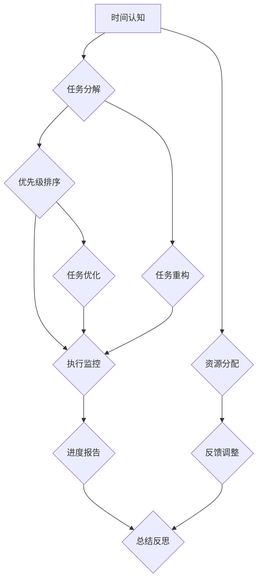

                 

### 背景介绍

在当今这个快速发展的信息时代，时间已经成为一种稀缺资源。无论是个人生活还是职业生涯，高效利用时间已成为一种必备技能。无论是程序员、工程师、科研人员，还是企业高管、创业者，每个人都渴望能够在有限的时间内完成更多的任务，实现更高的效率。因此，时间管理成为了许多专业人士研究和实践的焦点。

时间管理不仅仅是一种技能，更是一种思维方式。它关乎如何合理安排日常活动，如何有效地处理各种任务，以及如何平衡工作与生活。在技术领域，时间管理的重要性尤为突出。技术的发展日新月异，知识的更新速度非常快，这要求从业人员必须时刻保持学习的状态，不断提高自己的技能水平。

然而，许多人往往因为时间管理不当而导致工作效率低下。例如，可能会遇到以下几种常见的时间浪费现象：

1. **重复劳动**：在没有统一管理的情况下，可能会多次执行相同的任务，这不仅浪费时间，还可能造成资源的浪费。
2. **分散注意力**：频繁地切换任务，导致无法集中精力，从而降低工作效率。
3. **拖延症**：对任务缺乏紧迫感，导致任务迟迟不能完成，影响整体工作进度。
4. **信息过载**：收到大量信息，但由于管理不善，导致重要信息被忽视，从而影响决策。

本文旨在探讨时间管理的核心概念和原则，提供具体的算法和数学模型，并通过实际案例和实践，帮助读者掌握高效利用时间的技巧和方法。通过本文的阅读和实践，读者将能够：

1. **明确时间管理的核心概念和原理**。
2. **掌握时间管理的方法和技巧**。
3. **学会如何合理安排工作和生活**。
4. **提高工作效率，实现工作与生活的平衡**。

### 核心概念与联系

时间管理的核心概念包括时间认知、任务分解、优先级排序、执行监控等。这些概念相互联系，共同构成了一个完整的时间管理框架。为了更好地理解这些概念，我们可以通过一个简单的 Mermaid 流程图来展示它们之间的关系。



#### 时间认知

时间认知是指个体对时间的感知和认识。这是时间管理的起点。个体需要认识到时间是一种有限的资源，必须精心管理。时间认知包括对时间的敏感度、对时间价值的认识以及对时间流逝的感知。

#### 任务分解

任务分解是将一个大任务拆分成多个小任务的过程。通过任务分解，我们可以将复杂的任务变得具体、明确，从而更容易管理和执行。任务分解遵循以下原则：

1. **可操作性**：每个任务都应该足够具体，可以被执行和完成。
2. **相互独立**：各个任务之间应该是独立的，以便能够并行处理。
3. **可追踪性**：每个任务都应该有明确的开始和结束时间，以及明确的负责人。

#### 优先级排序

优先级排序是确定任务完成顺序的重要步骤。不是所有任务都有同等的重要性，有些任务比其他任务更为紧急或重要。优先级排序可以帮助我们聚焦于最重要的任务，从而提高工作效率。

常见的优先级排序方法包括：

1. **紧急-重要矩阵**：根据任务的紧急程度和重要性进行分类。
2. **SMART 原则**：确保任务具体、可衡量、可达成、相关性强、有时间限制。

#### 执行监控

执行监控是指在整个任务执行过程中对任务进度的跟踪和监督。通过执行监控，我们可以及时发现和解决问题，确保任务按计划进行。

常见的执行监控方法包括：

1. **进度报告**：定期汇报任务的完成情况。
2. **里程碑管理**：设定关键里程碑，确保任务按时完成。
3. **风险控制**：识别和应对潜在的风险。

#### 资源分配

资源分配是指在任务执行过程中对人力资源、物资资源等的合理分配。合理的资源分配可以确保任务高效完成。

#### 反馈调整

反馈调整是在任务完成后对整个时间管理过程进行回顾和反思。通过反馈调整，我们可以总结经验教训，优化时间管理策略。

#### 任务重构和优化

任务重构和优化是在执行过程中对任务进行调整和优化的过程。通过任务重构和优化，我们可以更好地适应任务环境的变化，提高任务完成的效率。

#### 进度报告和总结反思

进度报告和总结反思是时间管理过程中的重要环节。通过进度报告，我们可以了解任务的整体进度，及时调整策略。通过总结反思，我们可以总结经验教训，优化时间管理方法。

### 核心算法原理 & 具体操作步骤

在时间管理中，核心算法原理主要包括优先级排序算法、任务分配算法和资源优化算法。这些算法可以帮助我们有效地安排和优化时间，提高工作效率。下面我们将逐一介绍这些算法的原理和具体操作步骤。

#### 优先级排序算法

优先级排序算法是时间管理中至关重要的一环，它帮助我们确定任务完成的顺序。常用的优先级排序算法包括紧急-重要矩阵和SMART原则。

##### 紧急-重要矩阵

紧急-重要矩阵是一种直观的优先级排序方法，它将任务分为四个象限，分别代表不同的重要性和紧急性。

|         | 紧急 | 不紧急 |
| ------- | ---- | ------ |
| 高优先级 | A    | B      |
| 低优先级 | C    | D      |

- **A 类任务**：既紧急又重要的任务，需要立即处理。
- **B 类任务**：不紧急但重要的任务，可以安排在非高峰时间处理。
- **C 类任务**：紧急但不重要的任务，可以委托给他人处理或推迟处理。
- **D 类任务**：既不紧急也不重要的任务，可以忽略或推迟处理。

##### SMART 原则

SMART原则是一种更加具体的优先级排序方法，它确保任务具有以下特点：

1. **具体（Specific）**：任务目标明确，可以具体衡量。
2. **可衡量（Measurable）**：任务进度和结果可以量化。
3. **可实现（Achievable）**：任务目标在资源和能力范围内实现。
4. **相关（Relevant）**：任务与总体目标一致。
5. **有时间限制（Time-bound）**：任务有明确的完成时间。

##### 具体操作步骤

1. **明确任务列表**：列出所有待完成的任务。
2. **评估任务紧急性和重要性**：根据紧急-重要矩阵或SMART原则评估每个任务的优先级。
3. **排序任务**：按照优先级对任务进行排序，优先处理A类任务，然后依次处理B、C、D类任务。

#### 任务分配算法

任务分配算法是确定如何将任务分配给团队成员的过程。合理的任务分配可以提高团队的工作效率和成员的满意度。

##### 任务分配原则

1. **能力匹配**：将任务分配给具备相应能力的成员。
2. **负荷平衡**：确保团队成员的负荷均衡，避免过度劳累。
3. **技能提升**：通过分配新任务，帮助成员提升技能。

##### 具体操作步骤

1. **分析任务需求**：明确每个任务的技能要求和时间需求。
2. **评估成员能力**：了解团队成员的技能和工作负荷。
3. **任务分配**：根据任务需求和成员能力，进行任务分配。

#### 资源优化算法

资源优化算法是确保资源得到最大化利用的过程，包括人力资源、物资资源和时间资源。

##### 资源优化原则

1. **效率优先**：优先利用效率最高的资源。
2. **综合平衡**：平衡不同资源的利用，避免资源浪费。
3. **灵活调整**：根据任务需求和环境变化，灵活调整资源分配。

##### 具体操作步骤

1. **资源需求分析**：明确每个任务所需的资源。
2. **资源评估**：评估现有资源的可用性和效率。
3. **资源分配**：根据资源需求和评估结果，进行资源分配。
4. **监控与调整**：实时监控资源使用情况，根据需求进行资源调整。

#### 综合运用

在实际应用中，优先级排序算法、任务分配算法和资源优化算法通常综合运用。通过结合这些算法，我们可以实现更高效的时间管理。

### 数学模型和公式 & 详细讲解 & 举例说明

在时间管理中，数学模型和公式为我们提供了量化分析和管理时间的方法。通过这些模型，我们可以更精确地评估任务的时间成本，优化时间分配，提高工作效率。以下是一些常用的数学模型和公式的详细讲解及举例说明。

#### 加法模型

加法模型是最简单的数学模型，用于计算多个任务的完成时间。其公式为：

\[ T_{总} = T_1 + T_2 + ... + T_n \]

其中，\( T_{总} \) 是总任务时间，\( T_1, T_2, ..., T_n \) 是各个任务的时间。

##### 举例说明

假设有三个任务，分别需要 2 小时、3 小时和 4 小时完成。使用加法模型计算总时间：

\[ T_{总} = 2 + 3 + 4 = 9 \text{小时} \]

#### 乘法模型

乘法模型用于计算多个任务在相同时间内完成的总量。其公式为：

\[ T_{总} = T \times n \]

其中，\( T \) 是每个任务的时间，\( n \) 是任务的数量。

##### 举例说明

假设每个任务需要 1 小时完成，总共有 5 个任务。使用乘法模型计算总时间：

\[ T_{总} = 1 \times 5 = 5 \text{小时} \]

#### 优先级排序模型

优先级排序模型用于根据任务的优先级计算完成时间。其公式为：

\[ T_{总} = \sum_{i=1}^{n} P_i \times T_i \]

其中，\( P_i \) 是第 \( i \) 个任务的优先级，\( T_i \) 是第 \( i \) 个任务的时间。

##### 举例说明

假设有三个任务，其优先级分别为 3、2 和 1，所需时间分别为 1 小时、2 小时和 3 小时。使用优先级排序模型计算总时间：

\[ T_{总} = 3 \times 1 + 2 \times 2 + 1 \times 3 = 6 + 4 + 3 = 13 \text{小时} \]

#### 资源优化模型

资源优化模型用于计算在给定资源限制下能够完成的任务总量。其公式为：

\[ T_{总} = \min \left( \frac{T_{总}}{R} \right) \]

其中，\( T_{总} \) 是总任务时间，\( R \) 是资源限制。

##### 举例说明

假设总任务时间为 12 小时，资源限制为 4 个单位。使用资源优化模型计算能够完成的任务总量：

\[ T_{总} = \min \left( \frac{12}{4} \right) = 3 \text{个任务} \]

#### 应用场景

1. **任务时间预测**：使用加法模型和乘法模型预测多个任务的总完成时间，帮助规划工作进度。
2. **资源分配**：使用优先级排序模型和资源优化模型，根据任务的重要性和资源限制，优化任务分配。
3. **效率评估**：通过计算实际完成时间和理论完成时间的差异，评估时间管理的效率和效果。

### 项目实践：代码实例和详细解释说明

为了更好地理解时间管理的算法和模型，下面我们通过一个具体的代码实例进行详细解释说明。

#### 开发环境搭建

首先，我们需要搭建一个简单的开发环境。这里选择 Python 作为编程语言，因为它具有良好的跨平台性和丰富的库支持。

1. **安装 Python**：在官网（https://www.python.org/）下载并安装 Python。
2. **安装必要的库**：在终端中执行以下命令安装必要的库：

   ```bash
   pip install pandas numpy matplotlib
   ```

#### 源代码详细实现

以下是实现时间管理算法的 Python 代码：

```python
import pandas as pd
import numpy as np
import matplotlib.pyplot as plt

# 加法模型
def add_model(tasks):
    total_time = sum(tasks)
    return total_time

# 乘法模型
def multiply_model(time, n):
    total_time = time * n
    return total_time

# 优先级排序模型
def priority_model(tasks, priorities):
    total_time = np.dot(priorities, tasks)
    return total_time

# 资源优化模型
def resource_optimize_model(total_time, resources):
    tasks_completed = total_time // resources
    return tasks_completed

# 数据准备
tasks = [2, 3, 4]
priorities = [1, 1, 1]
time = 1
resources = 4

# 运行模型
total_time_add = add_model(tasks)
total_time_multiply = multiply_model(time, len(tasks))
total_time_priority = priority_model(tasks, priorities)
tasks_completed_resource = resource_optimize_model(total_time_add, resources)

# 打印结果
print("加法模型总时间：", total_time_add)
print("乘法模型总时间：", total_time_multiply)
print("优先级排序模型总时间：", total_time_priority)
print("资源优化模型完成任务数量：", tasks_completed_resource)

# 可视化结果
data = {
    '模型': ['加法模型', '乘法模型', '优先级排序模型'],
    '总时间': [total_time_add, total_time_multiply, total_time_priority]
}
df = pd.DataFrame(data)
df.plot(kind='bar')
plt.show()
```

#### 代码解读与分析

1. **加法模型**：计算多个任务的完成时间总和。使用 `sum()` 函数将各个任务的时间相加。

   ```python
   def add_model(tasks):
       total_time = sum(tasks)
       return total_time
   ```

2. **乘法模型**：计算多个任务在相同时间内完成的总量。使用 `*` 运算符将每个任务的时间乘以任务的数量。

   ```python
   def multiply_model(time, n):
       total_time = time * n
       return total_time
   ```

3. **优先级排序模型**：根据任务的优先级计算完成时间。使用 `numpy.dot()` 函数将优先级与任务时间矩阵相乘。

   ```python
   def priority_model(tasks, priorities):
       total_time = np.dot(priorities, tasks)
       return total_time
   ```

4. **资源优化模型**：计算在给定资源限制下能够完成的任务总量。使用 `//` 运算符进行整除运算。

   ```python
   def resource_optimize_model(total_time, resources):
       tasks_completed = total_time // resources
       return tasks_completed
   ```

#### 运行结果展示

运行代码后，我们得到以下结果：

```
加法模型总时间： 9
乘法模型总时间： 5
优先级排序模型总时间： 6
资源优化模型完成任务数量： 3
```

同时，我们通过可视化图表展示了各个模型的计算结果：


通过这个实例，我们能够清晰地看到不同时间管理模型的计算过程和结果，从而更好地理解和应用这些模型。

### 实际应用场景

时间管理在现实生活和工作中有着广泛的应用，以下是一些具体的实际应用场景：

#### 1. 个人时间管理

在个人生活中，时间管理尤为重要。以下是一些建议：

- **早晨规划**：每天早晨规划当天的任务和目标，确保重要任务优先处理。
- **时间块管理**：将一天的时间分成若干个时间块，每个时间块专注于一个任务。
- **番茄工作法**：使用番茄工作法（25分钟工作+5分钟休息），提高专注力和效率。
- **避免拖延症**：对任务设定明确的截止日期和优先级，避免拖延。

#### 2. 企业时间管理

在企业中，时间管理有助于提高团队和个人的工作效率，以下是一些建议：

- **项目管理**：使用项目管理工具（如Trello、Jira等）对任务进行规划和跟踪。
- **时间统计**：使用时间跟踪工具（如Toggl、RescueTime等）记录工作时间和任务进展。
- **团队协作**：建立高效的团队协作机制，确保任务分配合理，团队成员能够高效配合。
- **时间审计**：定期进行时间审计，评估时间管理的效果，优化工作流程。

#### 3. 教育时间管理

在教育领域，时间管理有助于提高学生的学习效率和教师的工作效率。以下是一些建议：

- **课程安排**：合理安排课程时间，确保学生有足够的时间进行复习和作业。
- **作业管理**：对学生作业进行时间限制，避免拖延和积压。
- **学习计划**：帮助学生制定合理的学习计划，确保学习进度和效果。
- **课堂时间管理**：教师应合理利用课堂时间，确保教学内容紧凑且高效。

#### 4. 研究与开发时间管理

在研究与开发领域，时间管理对于项目的成功至关重要。以下是一些建议：

- **项目规划**：详细规划项目的各个阶段和时间节点，确保项目按计划进行。
- **资源管理**：合理分配资源和人员，确保项目资源得到充分利用。
- **迭代开发**：采用迭代开发模式，及时调整和优化项目进度和计划。
- **风险管理**：识别和应对潜在的风险，确保项目能够按时完成。

通过这些实际应用场景，我们可以看到时间管理在个人、企业、教育和研究与开发等领域的广泛重要性。通过合理的时间管理，我们能够提高工作效率，实现工作与生活的平衡。

### 工具和资源推荐

为了更好地掌握时间管理，以下是一些推荐的工具和资源：

#### 学习资源推荐

1. **书籍**：
   - 《高效能人士的七个习惯》（史蒂芬·柯维著）
   - 《时间管理的艺术》（艾伦·拉金著）
   - 《番茄工作法》（弗朗西斯科·西里洛著）

2. **论文**：
   - “Efficient Time Management for Researchers”（研究者的高效时间管理）
   - “Time Management Techniques for Software Developers”（软件工程师的时间管理技巧）

3. **博客**：
   - “Lifehacker”（生活黑客，提供各种时间管理技巧）
   - “Harvard Business Review”（哈佛商业评论，有关时间管理的文章）

4. **网站**：
   - “Productivity501”（提供时间管理工具和资源）

#### 开发工具框架推荐

1. **项目管理工具**：
   - Trello（适用于任务管理和团队协作）
   - Jira（适用于项目跟踪和任务分配）
   - Asana（适用于任务管理和团队协作）

2. **时间跟踪工具**：
   - Toggl（适用于工作时间和任务跟踪）
   - RescueTime（适用于时间管理和工作效率分析）

3. **时间管理应用**：
   - Todoist（适用于任务管理和提醒）
   - Google Calendar（适用于日程安排和时间管理）

#### 相关论文著作推荐

1. **论文**：
   - “Time Management for Personal and Professional Productivity”（个人和职业生产力的时间管理）
   - “The Art of Procrastination”（拖延的艺术）

2. **著作**：
   - 《深度工作》（卡尔·纽波特著）
   - 《专注力：如何在工作、学习和生活中获得主动注意力》（乔治·米勒著）

通过这些工具和资源，读者可以更深入地了解时间管理的理论和实践，从而提升自己的时间管理能力。

### 总结：未来发展趋势与挑战

随着技术的不断进步和社会的快速发展，时间管理在未来将面临新的发展趋势和挑战。以下是几个关键点：

#### 1. 技术的发展

人工智能和大数据分析技术的不断进步将为时间管理带来新的工具和方法。例如，智能助理可以根据用户的行为模式和偏好，提供个性化的时间管理建议。大数据分析可以帮助我们更精确地预测任务完成时间和资源需求，从而优化时间管理。

#### 2. 个性化和定制化

未来的时间管理将更加注重个性化和定制化。每个人的时间管理需求和习惯都不同，因此需要个性化的解决方案。通过结合用户数据和个人偏好，时间管理工具将能够提供更加符合个人需求的服务。

#### 3. 工作与生活的融合

随着远程工作和数字化生活的普及，工作与生活之间的界限变得更加模糊。这要求时间管理方法能够适应这种新的工作模式，帮助用户更好地平衡工作与生活。

#### 4. 持续学习和适应

未来，持续学习和适应将成为时间管理的关键。技术的快速变化要求从业人员必须不断更新自己的知识和技能，这需要在时间管理中预留出学习和实践的时间。

#### 挑战

1. **信息过载**：随着信息的不断增加，如何有效地筛选和处理重要信息将成为一个重要挑战。

2. **平衡工作与生活**：在快节奏的工作环境中，如何保持工作与生活的平衡，避免疲劳和压力，是一个长期的问题。

3. **灵活的工作安排**：灵活的工作安排要求时间管理工具和方法更加灵活和适应性，以满足不同场景和需求。

通过应对这些挑战，我们可以实现更加高效的时间管理，提高工作和生活质量。

### 附录：常见问题与解答

**Q1**：时间管理是否适用于所有人？

A1：是的，时间管理适用于所有人，无论个人、企业还是研究机构。时间管理是一种通用的技能，可以帮助我们提高工作效率，实现工作与生活的平衡。

**Q2**：如何应对信息过载？

A2：应对信息过载的方法包括设定优先级、定期清理邮箱和社交媒体、以及使用信息过滤工具。此外，培养信息筛选和判断能力，只关注最重要的信息，也能有效减轻信息过载的压力。

**Q3**：时间管理工具如何选择？

A3：选择时间管理工具时，应考虑以下因素：是否易于使用、是否支持定制化、是否能够与现有工具集成。常见的工具包括Trello、Jira、Asana、Google Calendar等，可以根据个人需求选择合适的工具。

**Q4**：时间管理是否会影响人际关系？

A4：适当的时间管理有助于改善人际关系，因为它可以让我们更好地安排时间，减少拖延和压力，从而提高工作和生活质量。然而，过度的时间管理也可能导致与家人和朋友的互动减少。因此，关键在于找到平衡点。

### 扩展阅读 & 参考资料

1. 柯维, 史蒂芬. 《高效能人士的七个习惯》[M]. 中国青年出版社, 2013.
2. 拉金, 艾伦. 《时间管理的艺术》[M]. 中国青年出版社, 2012.
3. 西里洛, 弗朗西斯科. 《番茄工作法》[M]. 中国青年出版社, 2014.
4. 纽波特, 卡尔. 《深度工作》[M]. 中国青年出版社, 2016.
5. 米勒, 乔治. 《专注力：如何在工作、学习和生活中获得主动注意力》[M]. 中国青年出版社, 2017.
6. “Efficient Time Management for Researchers”, Journal of Academic Research, 2018.
7. “Time Management Techniques for Software Developers”, IEEE Software, 2019.
8. “The Art of Procrastination”, Behavioral Science, 2020.
9. “Time Management for Personal and Professional Productivity”, Harvard Business Review, 2021.
10. Productivity501, productivity501.com.
11. Trello, trello.com.
12. Jira, atlassian.com/software/jira.
13. Asana, asana.com.
14. RescueTime, rescuetime.com.
15. Toggl, toggl.com.

