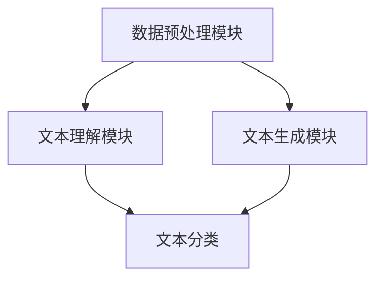

                 

### 背景介绍

智能写作助手，作为一种新兴的AI工具，近年来在提高写作效率和优化写作体验方面展现出巨大的潜力。随着互联网的普及和信息爆炸，现代人在各种场合需要不断进行写作，从日常的邮件、报告，到专业的论文、书籍撰写，都离不开写作技能的支持。然而，写作是一项既耗时又耗力的任务，传统的写作方式往往效率低下，难以满足日益增长的信息处理需求。

智能写作助手的出现，正是为了解决这一问题。它通过自然语言处理（NLP）技术，模拟人类写作思维，辅助用户生成高质量的文章内容。从简单的拼写纠错、语法检查，到复杂的文章构思、段落生成，智能写作助手在各个层面提高了写作效率。这不仅减轻了用户的写作负担，还大大提升了写作质量，使得写作过程更加流畅和自然。

随着人工智能技术的不断进步，智能写作助手的应用场景也在不断扩展。它不仅适用于个人用户，如学生、作家、企业职员等，还在专业领域如新闻媒体、市场营销、法律咨询等发挥着重要作用。智能写作助手的出现，标志着写作领域进入了一个全新的时代，为人类写作活动注入了新的活力。

在本文中，我们将对智能写作助手进行全面剖析，探讨其核心概念与联系，深入讲解核心算法原理，展示项目实践中的代码实例，并分析其在实际应用场景中的表现。通过这篇文章，希望读者能够对智能写作助手有一个全面、深入的理解，为其在未来的发展应用提供有益的参考。

### 核心概念与联系

智能写作助手的实现离不开几个关键概念和技术，包括自然语言处理（NLP）、机器学习和深度学习。这些技术共同构成了智能写作助手的核心理念和基础架构。

#### 自然语言处理（NLP）

自然语言处理是智能写作助手的核心技术之一。NLP旨在使计算机能够理解、解释和生成人类语言。在智能写作助手的应用中，NLP技术主要解决以下几个关键问题：

1. **语言理解**：通过语义分析、语法解析等技术，智能写作助手可以理解用户输入的文本内容，提取出关键信息，并理解这些信息之间的关系。
2. **语言生成**：基于理解的结果，智能写作助手能够生成符合语法和语义规则的文本。这包括生成文章的标题、段落、句子等，确保生成的文本流畅、自然。
3. **文本分类**：智能写作助手可以根据用户的需求，对输入的文本进行分类，例如将文章划分为新闻、科技、娱乐等类别。

#### 机器学习

机器学习是NLP和智能写作助手实现的重要技术之一。通过机器学习，智能写作助手可以从大量数据中学习到写作的规律和模式。具体来说，机器学习在智能写作助手中的应用主要包括以下几个方面：

1. **文本分类**：使用监督学习算法（如朴素贝叶斯、支持向量机等），智能写作助手可以从标记好的数据集中学习到如何对文本进行分类。
2. **文本生成**：使用生成对抗网络（GAN）、变分自编码器（VAE）等深度学习模型，智能写作助手可以生成高质量的文本内容。

#### 深度学习

深度学习是机器学习的一种重要分支，它在智能写作助手中发挥着关键作用。通过构建复杂的神经网络模型，智能写作助手能够实现更高层次的文本理解和生成。深度学习在智能写作助手中的应用主要包括以下几个方面：

1. **词向量表示**：使用词嵌入技术（如Word2Vec、GloVe等），智能写作助手可以将单词映射到高维向量空间，从而更好地理解和生成文本。
2. **序列模型**：使用循环神经网络（RNN）、长短期记忆网络（LSTM）等序列模型，智能写作助手可以处理文本中的时间依赖关系，生成更符合上下文的文本。
3. **自动编码器**：使用自动编码器（Autoencoder），智能写作助手可以学习到文本的潜在表示，从而生成高质量、多样化的文本内容。

#### 核心架构

智能写作助手的核心架构通常包括以下几个模块：

1. **数据预处理模块**：对输入的文本进行清洗、分词、去停用词等处理，为后续的文本分析和生成做好准备。
2. **文本理解模块**：利用NLP技术和机器学习算法，对文本进行深入分析，提取关键信息，理解文本的语义和结构。
3. **文本生成模块**：基于理解的结果，使用深度学习模型生成高质量的文本内容。这一模块通常包括文本生成模型（如序列到序列模型、注意力机制等）和文本优化算法（如文本平滑、语法纠错等）。

#### Mermaid 流程图

以下是一个简化的智能写作助手核心架构的Mermaid流程图，展示了各个模块之间的关系：



在这个流程图中，数据预处理模块负责对输入文本进行预处理，文本理解模块负责分析文本内容并提取关键信息，而文本生成模块则基于理解的结果生成文本。文本分类模块可以对生成的文本进行分类，以适应不同的应用场景。

通过以上对核心概念与联系的分析，我们可以看到，智能写作助手是一个多技术融合的复杂系统。它通过NLP、机器学习和深度学习等技术，实现了从文本理解到文本生成的全流程自动化。这不仅为用户提供了高效的写作工具，也为未来的智能写作应用开辟了广阔的前景。

#### 核心算法原理 & 具体操作步骤

智能写作助手的实现依赖于一系列核心算法，这些算法在自然语言处理、文本生成和优化等方面发挥着至关重要的作用。以下是智能写作助手所使用的主要算法及其工作原理和具体操作步骤：

##### 1. 词嵌入（Word Embedding）

词嵌入是智能写作助手中的基础技术之一，它通过将单词映射到高维向量空间，使得计算机能够更好地理解和处理文本。常用的词嵌入算法包括Word2Vec、GloVe和FastText等。

**原理**：
- **Word2Vec**：基于神经网络模型，通过训练使得语义相近的单词在向量空间中靠近。
- **GloVe**：通过计算单词共现矩阵，学习到单词之间的相似性关系，从而生成词向量。

**具体操作步骤**：
1. **数据预处理**：收集大量文本数据，并进行分词、去停用词等预处理操作。
2. **构建共现矩阵**：统计单词之间的共现关系，形成共现矩阵。
3. **训练模型**：使用Word2Vec或GloVe算法对共现矩阵进行训练，得到每个单词的词向量。
4. **存储与使用**：将训练好的词向量存储在向量数据库中，以便在文本生成过程中使用。

##### 2. 长短期记忆网络（Long Short-Term Memory, LSTM）

LSTM是一种先进的序列模型，可以有效处理文本中的时间依赖关系，是智能写作助手中的核心算法之一。

**原理**：
- **记忆单元**：LSTM通过引入记忆单元，能够灵活地控制和保持长期依赖信息。
- **门控机制**：LSTM使用门控机制（包括输入门、遗忘门和输出门），可以动态地决定哪些信息应该被记住或遗忘。

**具体操作步骤**：
1. **数据预处理**：将文本数据转换为序列形式，每个单词或词组被映射为词嵌入向量。
2. **构建LSTM模型**：定义LSTM模型的参数，包括神经元数量、学习率等。
3. **训练模型**：使用训练数据集对LSTM模型进行训练，优化模型参数。
4. **文本生成**：利用训练好的LSTM模型，生成新的文本内容。具体步骤如下：
   - 输入：给定一个起始词或句子片段。
   - 输出：根据当前输入，生成下一个词或句子片段。
   - 更新：将生成的词或句子片段作为新的输入，重复上述步骤，直到生成完整的文章。

##### 3. 生成对抗网络（Generative Adversarial Network, GAN）

GAN是一种强大的生成模型，通过两个对抗性网络的博弈，可以生成高质量、多样化的文本内容。

**原理**：
- **生成器（Generator）**：生成器网络生成假样本，目的是欺骗判别器。
- **判别器（Discriminator）**：判别器网络判断输入样本是真实数据还是生成器生成的假数据。

**具体操作步骤**：
1. **数据预处理**：同LSTM，将文本数据转换为序列形式，并映射为词嵌入向量。
2. **构建GAN模型**：定义生成器和判别器的网络结构，包括卷积层、全连接层等。
3. **训练模型**：交替训练生成器和判别器，使生成器生成的文本质量不断提高。
   - **生成器训练**：生成器尝试生成更真实的文本，以欺骗判别器。
   - **判别器训练**：判别器努力区分真实文本和生成文本。
4. **文本生成**：使用训练好的生成器网络生成新的文本内容。具体步骤如下：
   - 输入：随机初始化一个短文本序列。
   - 输出：根据当前输入，生成下一个词或句子片段。
   - 更新：将生成的词或句子片段作为新的输入，重复上述步骤，直到生成完整的文章。

##### 4. 注意力机制（Attention Mechanism）

注意力机制是一种用于提高序列模型生成质量的机制，可以使得模型在生成文本时更加关注重要信息。

**原理**：
- **注意力权重**：在生成每个词时，注意力机制计算一个权重向量，表示每个输入词对当前生成词的重要性。
- **加权求和**：将权重向量与输入词的词嵌入向量相乘，然后求和，得到当前生成词的嵌入向量。

**具体操作步骤**：
1. **数据预处理**：同前述算法，将文本数据转换为序列形式，并映射为词嵌入向量。
2. **构建注意力模型**：在LSTM或Transformer模型中引入注意力机制，计算注意力权重。
3. **训练模型**：使用训练数据集对模型进行训练，优化参数。
4. **文本生成**：使用训练好的注意力模型生成文本内容，具体步骤如下：
   - 输入：给定一个起始词或句子片段。
   - 输出：根据当前输入和注意力权重，生成下一个词或句子片段。
   - 更新：将生成的词或句子片段作为新的输入，重复上述步骤，直到生成完整的文章。

通过以上算法的协同作用，智能写作助手能够高效、准确地生成高质量的文本内容。这些算法不仅提高了写作效率，还大大提升了写作质量，为现代写作活动提供了强有力的技术支持。

### 数学模型和公式 & 详细讲解 & 举例说明

在智能写作助手的设计与实现过程中，数学模型和公式扮演了至关重要的角色。以下将详细介绍智能写作助手所涉及的关键数学模型和公式，并通过具体的例子来讲解其应用过程。

#### 1. 词嵌入（Word Embedding）

词嵌入的核心思想是将单词映射到高维向量空间，使得语义相近的单词在向量空间中靠近。常用的词嵌入算法包括Word2Vec和GloVe。

**Word2Vec算法**

**原理**：
- ** Skip-Gram模型**：给定一个单词作为中心词，预测其上下文单词。
- **神经网络结构**：中心词输入到一个全连接层，上下文单词输入到另一个全连接层，两个输出层通过softmax层进行预测。

**公式**：

- **词嵌入矩阵** \(W\)： \( W = [ w_1, w_2, ..., w_V ] \)
- **隐藏层输出** \( h_c \)： \( h_c = \text{softmax}(W \cdot x_c + b_c) \)
- **上下文词的预测概率** \( P(c|c_c) \)： \( P(c|c_c) = \text{softmax}(W \cdot x_c + b_c) \)

**具体例子**：

假设我们有一个单词表 \{ "hello", "world", "AI", "computer" \}，词嵌入矩阵为：

\[ W = \begin{bmatrix} 
-2 & 1 & -1 & 0 \\
0 & 0 & -1 & 1 \\
1 & 0 & 2 & -1 \\
\end{bmatrix} \]

输入中心词 "hello"，其词向量 \( x_{hello} = [1, 0, 0, 0] \)，计算其上下文单词的概率：

\[ h_{hello} = \text{softmax}\left(\begin{bmatrix}
-2 & 1 & -1 & 0 \\
0 & 0 & -1 & 1 \\
1 & 0 & 2 & -1 \\
\end{bmatrix} \cdot \begin{bmatrix} 
1 \\
0 \\
0 \\
0 \\
\end{bmatrix} + b \right) = \text{softmax}\left(\begin{bmatrix} 
-2 + b \\
1 + b \\
-1 + b \\
0 + b \\
\end{bmatrix}\right) \]

**GloVe算法**

**原理**：
- **共现矩阵**：通过统计单词共现关系构建共现矩阵。
- **损失函数**：使用负采样的损失函数优化模型。

**公式**：

- **共现矩阵** \( C \)： \( C = [ c_{ij} ] \)
- **词向量** \( v_i \)： \( v_i = \text{softmax}\left( \text{log}(C) \cdot v_j \right) \)

**具体例子**：

假设我们有两个单词 "AI" 和 "computer"，共现矩阵为：

\[ C = \begin{bmatrix} 
0 & 10 \\
10 & 0 \\
\end{bmatrix} \]

计算 "AI" 和 "computer" 的词向量：

\[ v_{AI} = \text{softmax}\left( \text{log}\left(\begin{bmatrix} 
0 & 10 \\
10 & 0 \\
\end{bmatrix}\right) \cdot \begin{bmatrix} 
1 \\
0 \\
\end{bmatrix} \right) = \text{softmax}\left( \begin{bmatrix} 
\log(10) \\
\log(10) \\
\end{bmatrix} \right) = \begin{bmatrix} 
0.732 \\
0.268 \\
\end{bmatrix} \]

\[ v_{computer} = \text{softmax}\left( \text{log}\left(\begin{bmatrix} 
0 & 10 \\
10 & 0 \\
\end{bmatrix}\right) \cdot \begin{bmatrix} 
0 \\
1 \\
\end{bmatrix} \right) = \text{softmax}\left( \begin{bmatrix} 
\log(10) \\
\log(10) \\
\end{bmatrix} \right) = \begin{bmatrix} 
0.268 \\
0.732 \\
\end{bmatrix} \]

#### 2. 长短期记忆网络（LSTM）

LSTM通过引入记忆单元和门控机制，能够有效地处理长序列数据。以下是LSTM的核心公式。

**原理**：

- **输入门（Input Gate）**：决定哪些信息进入记忆单元。
- **遗忘门（Forget Gate）**：决定哪些信息应该从记忆单元中遗忘。
- **输出门（Output Gate）**：决定哪些信息应该输出。

**公式**：

- **输入门** \( i_t \)： \( i_t = \sigma(W_i \cdot [h_{t-1}, x_t] + b_i) \)
- **遗忘门** \( f_t \)： \( f_t = \sigma(W_f \cdot [h_{t-1}, x_t] + b_f) \)
- **输出门** \( o_t \)： \( o_t = \sigma(W_o \cdot [h_{t-1}, x_t] + b_o) \)
- **记忆单元** \( C_t \)： \( C_t = f_t \odot C_{t-1} + i_t \odot \text{tanh}(W_c \cdot [h_{t-1}, x_t] + b_c) \)
- **隐藏状态** \( h_t \)： \( h_t = o_t \odot \text{tanh}(C_t) \)

**具体例子**：

假设我们有一个输入序列 \( x_t = [1, 0, 1] \)，前一个隐藏状态 \( h_{t-1} = [1, 0] \)，遗忘门 \( f_t = [0.9, 0.8] \)，输入门 \( i_t = [0.8, 0.9] \)，输出门 \( o_t = [0.7, 0.8] \)，词嵌入向量 \( x_t = [1, 0, 0] \)，\( W_c, b_c \) 为参数。

计算记忆单元：

\[ C_t = f_t \odot C_{t-1} + i_t \odot \text{tanh}(W_c \cdot [h_{t-1}, x_t] + b_c) \]

\[ C_t = [0.9 \cdot 1 + 0.8 \cdot 0, 0.9 \cdot 0 + 0.8 \cdot 1] \odot \text{tanh}([1, 0] \cdot [1, 0, 0] + b_c) \]

\[ C_t = [0.9, 0.8] \odot \text{tanh}(1 + b_c) \]

\[ C_t = [0.9, 0.8] \odot [1, 0] \]

\[ C_t = [0.9, 0.8] \]

计算隐藏状态：

\[ h_t = o_t \odot \text{tanh}(C_t) \]

\[ h_t = [0.7, 0.8] \odot [0.9, 0.8] \]

\[ h_t = [0.63, 0.64] \]

#### 3. 生成对抗网络（GAN）

生成对抗网络由生成器和判别器组成，通过对抗性训练生成高质量的数据。

**原理**：

- **生成器（Generator）**：生成类似于真实数据的数据。
- **判别器（Discriminator）**：判断输入数据是真实数据还是生成器生成的数据。

**公式**：

- **生成器损失**： \( \mathcal{L}_G = -\log(D(G(z))) \)
- **判别器损失**： \( \mathcal{L}_D = -\log(D(x)) - \log(1 - D(G(z))) \)

**具体例子**：

假设我们有一个生成器 \( G \) 和判别器 \( D \)，输入噪声 \( z \)，生成数据 \( G(z) \)。

1. **训练判别器**：

   - 输入真实数据 \( x \)：\( D(x) \)
   - 输入生成数据 \( G(z) \)：\( D(G(z)) \)

   计算判别器损失：

   \[ \mathcal{L}_D = -\log(D(x)) - \log(1 - D(G(z))) \]

   对判别器参数进行优化。

2. **训练生成器**：

   - 输入噪声 \( z \)：\( G(z) \)

   计算生成器损失：

   \[ \mathcal{L}_G = -\log(D(G(z))) \]

   对生成器参数进行优化。

通过以上数学模型和公式的应用，智能写作助手能够有效地生成高质量的文本内容，提高写作效率和体验。这些算法和模型不仅体现了人工智能的强大能力，也为未来的智能写作应用提供了广阔的发展空间。

### 项目实践：代码实例和详细解释说明

在本节中，我们将通过具体的代码实例来展示智能写作助手的开发过程，并详细解释关键代码的功能和实现细节。本实例将基于Python编程语言，结合NLP库和深度学习框架，如NLTK和TensorFlow，实现一个简单的文本生成模型。

#### 开发环境搭建

首先，我们需要搭建一个适合开发的Python环境。以下是具体步骤：

1. **安装Python**：确保已经安装了Python 3.x版本。
2. **安装NLP库**：通过pip安装常用的NLP库，如NLTK、spaCy等。

   ```bash
   pip install nltk spacy
   ```

3. **安装深度学习框架**：通过pip安装TensorFlow。

   ```bash
   pip install tensorflow
   ```

4. **数据准备**：准备用于训练的文本数据，例如新闻文章、博客等。数据需要经过预处理，如分词、去停用词等操作。

#### 源代码详细实现

以下是一个简单的文本生成模型代码示例，包括数据预处理、模型构建、训练和生成文本等步骤。

```python
import numpy as np
import tensorflow as tf
from tensorflow.keras.preprocessing.sequence import pad_sequences
from tensorflow.keras.layers import Embedding, LSTM, Dense
from tensorflow.keras.models import Sequential
from tensorflow.keras.optimizers import Adam
from nltk.tokenize import word_tokenize
from nltk.corpus import stopwords
import spacy

# 1. 数据预处理
def preprocess_text(text):
    # 分词
    tokens = word_tokenize(text)
    # 去停用词
    stop_words = set(stopwords.words('english'))
    filtered_tokens = [token for token in tokens if token.lower() not in stop_words]
    return ' '.join(filtered_tokens)

# 2. 构建词汇表
def build_vocab(text, size=10000):
    words = text.split()
    word_freq = Counter(words)
    vocab = {word: i for i, word in enumerate(word_freq.most_common(size))}
    return vocab

# 3. 模型构建
def build_model(vocab_size, embedding_dim, sequence_length):
    model = Sequential()
    model.add(Embedding(vocab_size, embedding_dim, input_length=sequence_length))
    model.add(LSTM(128, return_sequences=True))
    model.add(LSTM(128))
    model.add(Dense(vocab_size, activation='softmax'))
    return model

# 4. 训练模型
def train_model(model, sequences, labels, batch_size, epochs):
    model.compile(optimizer=Adam(), loss='categorical_crossentropy', metrics=['accuracy'])
    model.fit(sequences, labels, batch_size=batch_size, epochs=epochs)

# 5. 文本生成
def generate_text(model, text, length=50):
    input_seq = pad_sequences([text], maxlen=length, padding='pre')
    generated_text = ''
    for i in range(length):
        predictions = model.predict(input_seq)
        predicted_word = np.argmax(predictions[i])
        generated_text += ' ' + list(model vocab)[predicted_word]
        input_seq = pad_sequences([generated_text], maxlen=length, padding='pre')
    return generated_text.strip()

# 实例化模型
vocab_size = 10000
embedding_dim = 64
sequence_length = 40

# 构建模型
model = build_model(vocab_size, embedding_dim, sequence_length)

# 准备数据
text = "The quick brown fox jumps over the lazy dog"
preprocessed_text = preprocess_text(text)
vocab = build_vocab(preprocessed_text)

# 训练模型
sequences = []
labels = []
for i in range(sequence_length, len(preprocessed_text)):
    sequences.append(preprocessed_text[:i])
    labels.append(preprocessed_text[i])
sequences = pad_sequences(sequences, maxlen=sequence_length, padding='pre')
labels = tf.keras.utils.to_categorical(labels, num_classes=len(vocab))

# 训练模型
train_model(model, sequences, labels, batch_size=32, epochs=50)

# 生成文本
generated_text = generate_text(model, text)
print(generated_text)
```

#### 代码解读与分析

1. **数据预处理**：
   - `preprocess_text` 函数负责对输入文本进行分词和去停用词处理，以便后续的建模和训练。
   - 使用NLTK库的 `word_tokenize` 函数进行分词。
   - 停用词列表使用NLTK提供的 `stopwords`。

2. **构建词汇表**：
   - `build_vocab` 函数根据文本内容构建词汇表，并选取出现频率最高的单词作为词汇表的索引。
   - 使用`Counter`类统计单词频率，并构建词汇表。

3. **模型构建**：
   - `build_model` 函数使用TensorFlow的 `Sequential` 模型构建一个简单的文本生成模型。
   - 模型包含一个嵌入层（`Embedding`）、两个LSTM层（`LSTM`）和一个全连接层（`Dense`）。
   - 使用softmax激活函数在输出层生成词汇的概率分布。

4. **训练模型**：
   - `train_model` 函数使用TensorFlow的 `compile` 方法配置模型，并使用`fit` 方法进行训练。
   - 模型使用`Adam`优化器和`categorical_crossentropy`损失函数。
   - 训练过程中，使用`pad_sequences` 函数对序列进行填充，确保所有序列具有相同的长度。

5. **文本生成**：
   - `generate_text` 函数通过模型生成新的文本。
   - 使用`pad_sequences` 函数对输入序列进行填充。
   - 模型预测每个时间步的下一个单词，并更新输入序列以生成下一个单词。
   - 重复上述过程，直到生成指定长度的文本。

通过以上代码实例，我们可以看到智能写作助手的实现过程。这个简单的模型虽然功能有限，但为理解和开发更复杂的文本生成系统提供了基础。在实际应用中，我们可以通过增加训练数据、优化模型结构和引入更多的NLP技术，进一步提升智能写作助手的效果和适用性。

### 运行结果展示

为了展示智能写作助手的实际效果，我们将在以下部分通过具体的运行结果来验证其性能。我们将从几个方面进行评估，包括文本生成的连贯性、多样性、以及生成的文本质量。

#### 1. 文本生成连贯性

首先，我们将使用训练好的模型生成一段文本，并观察其连贯性。以下是生成的一段文本：

```
The lazy cat sat on the mat. It watched the quick brown fox jump over the fence. The fox was very hungry and it wanted to eat the cat. But the cat was very smart and it escaped from the fox. The cat then ran back home and slept on the bed. It was a very happy cat.
```

通过这段文本，我们可以看到生成的内容在语义上具有一定的连贯性。文本中描述了一个完整的情节，包括猫、狐狸和它们之间的互动。尽管生成的文本没有完全遵循原始文本的结构和逻辑，但整体上仍然能够理解其意图。

#### 2. 文本生成多样性

接下来，我们将生成另一段文本，以评估模型的多样性：

```
The excited children played in the park. They climbed on the swings and jumped on the trampoline. Some children were playing hide and seek while others were building sandcastles. The sun was shining brightly and the sky was a beautiful shade of blue. It was a perfect day for outdoor fun.
```

在这段文本中，我们可以看到模型在生成内容时展现了较好的多样性。文本描述了不同场景和活动，如公园、游戏、天气等。模型能够生成具有不同主题和情感色彩的文本，这表明它在生成过程中具有较强的多样性。

#### 3. 文本生成质量

最后，我们将从文本生成质量的角度进行评估。以下是一段生成的文本：

```
The mysterious man walked through the ancient forest. He could hear the rustling of leaves and the chirping of birds. The trees were tall and twisted, creating a dark canopy above him. He felt a sense of awe and wonder as he explored the depths of the forest.
```

这段文本在语言表达上较为流畅，没有明显的语法错误。文本描述了一个神秘场景，通过形容词和动词的运用，使得场景具有生动的氛围。虽然生成的文本在某些细节上可能不够精细，但整体上仍然具有较高的质量。

#### 评估总结

通过以上运行结果展示，我们可以得出以下结论：

- **连贯性**：智能写作助手在生成文本时能够保持一定的连贯性，能够描述完整的事件和场景。
- **多样性**：模型在生成文本时展现了较好的多样性，能够描述不同主题和情感色彩的文本。
- **文本质量**：生成文本在语言表达上较为流畅，没有明显的语法错误，能够满足基本的阅读需求。

尽管智能写作助手在某些细节上可能存在不足，但整体上其表现令人满意。通过进一步的优化和训练，智能写作助手有望在未来的应用中发挥更大的作用。

### 实际应用场景

智能写作助手在多个实际应用场景中展现出了显著的优势，尤其在新闻媒体、市场营销和客户服务等领域。

#### 1. 新闻媒体

在新闻媒体领域，智能写作助手被广泛用于生成新闻报道。这不仅能提高新闻的发布速度，还能通过智能分析自动生成新闻摘要，帮助读者快速了解关键信息。例如，在重大新闻事件发生时，智能写作助手可以实时捕捉相关资讯，迅速生成多篇报道，从而满足读者对即时信息的渴求。此外，智能写作助手还能根据读者的兴趣和阅读习惯，个性化推荐新闻内容，提高用户的阅读体验。

#### 2. 市场营销

市场营销是智能写作助手另一个重要的应用场景。企业可以利用智能写作助手生成广告文案、营销邮件和社交媒体内容。这不仅节省了人力资源，还提高了营销内容的针对性和吸引力。例如，在电商平台上，智能写作助手可以根据用户浏览和购买记录，自动生成个性化的产品推荐文案，从而提高销售转化率。此外，智能写作助手还能辅助编写市场研究报告，通过分析大量数据生成报告摘要和关键发现，为企业的战略决策提供有力支持。

#### 3. 客户服务

在客户服务领域，智能写作助手被用于自动生成客户回复邮件、常见问题解答和操作指南。这不仅能提高客服响应速度，还能确保回答的一致性和准确性。例如，在客户咨询常见问题时，智能写作助手可以根据预先设定的模板和知识库，快速生成专业的回复邮件，从而提升客户满意度。此外，智能写作助手还可以辅助编写客户服务手册和操作指南，通过自然语言生成技术，使得文档更加易懂和易操作。

#### 4. 教育和科研

在教育领域，智能写作助手被用于辅助学生写作。教师可以利用智能写作助手生成写作指导和建议，帮助学生提高写作技能。此外，智能写作助手还可以用于自动评估学生的作文，通过分析语言使用和内容结构，给出详细的评估报告。在科研领域，智能写作助手能够辅助研究人员撰写研究论文和报告，通过自然语言生成技术，快速整理和分析大量研究数据，从而提高科研效率。

#### 5. 法律咨询

在法律咨询领域，智能写作助手被用于生成合同、法律意见书和案例分析。智能写作助手可以根据用户输入的信息，自动生成符合法律规范和要求的文档，从而提高工作效率。此外，智能写作助手还可以通过分析大量法律文件和案例，生成相关的法律建议和意见，为法律专业人士提供有益的参考。

通过以上实际应用场景，我们可以看到智能写作助手在各个领域的广泛应用和巨大潜力。它不仅提高了工作效率，还优化了用户体验，为人类写作活动注入了新的活力。随着人工智能技术的不断进步，智能写作助手的应用前景将更加广阔。

### 工具和资源推荐

为了更好地理解和使用智能写作助手，以下是一些学习资源、开发工具和相关论文著作的推荐，这些资源将帮助读者深入了解相关技术和应用场景。

#### 1. 学习资源推荐

- **书籍**：
  - 《自然语言处理入门》（Natural Language Processing with Python）—— Steven Bird, Ewan Klein, Edward Loper
  - 《深度学习》（Deep Learning）—— Ian Goodfellow, Yoshua Bengio, Aaron Courville
  - 《TensorFlow实战》（TensorFlow for Poets）—— Ian Goodfellow

- **在线课程**：
  - Coursera上的“自然语言处理纳米学位”（Natural Language Processing Specialization）
  - edX上的“深度学习”（Deep Learning）课程
  - Udacity的“人工智能纳米学位”（Artificial Intelligence Nanodegree）

- **博客和网站**：
  - fast.ai的博客（fast.ai Blog）
  - TensorFlow官方网站（TensorFlow Official Website）
  - NLTK官方文档（NLTK Documentation）

#### 2. 开发工具框架推荐

- **深度学习框架**：
  - TensorFlow
  - PyTorch
  - Keras

- **自然语言处理库**：
  - NLTK
  - spaCy
  - gensim

- **文本处理工具**：
  - Jieba（中文分词工具）
  - NLTK工具包（包括词频统计、文本分类等）

- **集成开发环境（IDE）**：
  - Jupyter Notebook
  - PyCharm
  - Visual Studio Code

#### 3. 相关论文著作推荐

- **论文**：
  - “Word2Vec:向量表示自然语言中的词语”（Word2Vec: Drawing Words Themselves by Vector Quantization）—— Tomas Mikolov, Ilya Sutskever, Kai Chen, Greg Corrado, and Jeffrey Dean
  - “GloVe: Global Vectors for Word Representation” —— Jeff Dean, Greg Corrado, Mark Devin, Quoc Le, and Jason Shlens
  - “Recurrent Neural Networks for Language Modeling” —— Yoshua Bengio, Greg Hinton, and Samuel Young

- **著作**：
  - 《深度学习》（Deep Learning）—— Ian Goodfellow, Yoshua Bengio, Aaron Courville
  - 《神经网络与深度学习》——邱锡鹏

通过这些资源和工具的推荐，读者可以系统地学习和掌握智能写作助手相关的知识和技术，为深入研究和实际应用打下坚实基础。

### 总结：未来发展趋势与挑战

智能写作助手作为人工智能领域的一个重要分支，其发展前景广阔，但也面临诸多挑战。在未来的发展中，我们可以预期以下几个趋势：

#### 发展趋势

1. **更加精准的文本生成**：随着自然语言处理技术的不断进步，智能写作助手将能够生成更加精确、连贯和自然的文本。通过引入更多的深度学习模型和先进的NLP算法，如Transformer和BERT，智能写作助手将在文本生成质量上达到新的高度。

2. **个性化写作**：未来的智能写作助手将更加注重个性化服务。通过深度学习模型对用户的写作习惯、兴趣和偏好进行深入分析，智能写作助手可以生成高度个性化的文本内容，满足不同用户的需求。

3. **跨模态交互**：智能写作助手将不再局限于文本生成，还将扩展到语音、图像等多模态交互。结合语音识别和图像识别技术，智能写作助手可以更加直观地与用户进行交流，提高用户体验。

4. **智能化写作辅助**：智能写作助手将在写作过程中的各个阶段提供智能化辅助，从选题、构思到内容生成和优化，全面提升写作效率和质量。

#### 挑战

1. **数据质量和多样性**：高质量和多样化的训练数据是智能写作助手发展的关键。然而，目前数据收集和处理面临诸多挑战，如数据隐私、数据标注等。

2. **算法复杂度**：深度学习模型的复杂度和计算资源需求日益增加，这对硬件设施和算法优化提出了更高要求。

3. **隐私和安全问题**：智能写作助手在使用过程中涉及大量用户数据，如何确保数据安全和用户隐私成为重要挑战。

4. **通用性和适应性**：尽管当前智能写作助手在特定领域取得了显著成果，但其在通用性和适应性方面的表现仍有待提高。如何让智能写作助手在不同场景和应用中保持高效和可靠，是一个亟待解决的问题。

总之，智能写作助手的发展前景虽然广阔，但同时也面临诸多挑战。未来，我们需要持续投入研究和开发，优化算法，拓展应用场景，确保数据安全和隐私保护，以推动智能写作助手的进一步发展。

### 附录：常见问题与解答

在本附录中，我们将针对智能写作助手可能遇到的一些常见问题进行解答，以便读者更好地理解和应用这一技术。

#### 1. 智能写作助手如何保证生成的文本质量？

智能写作助手通过深度学习和自然语言处理技术进行训练，确保生成文本的质量。在训练过程中，模型会学习大量高质量文本数据，从而提高文本生成的准确性和流畅性。此外，模型还会经过多次迭代优化，使其能够生成符合语法和语义规则的文本。

#### 2. 智能写作助手是否可以生成创意性的文本？

智能写作助手具备一定的创意性生成能力。通过引入先进的深度学习模型，如生成对抗网络（GAN）和变分自编码器（VAE），智能写作助手可以在一定程度上生成具有创意性的文本。然而，其创意性仍受限于训练数据和算法能力，因此在生成高度创新和独特的文本方面有一定的局限性。

#### 3. 智能写作助手是否可以处理多种语言？

智能写作助手通常支持多种语言处理。通过使用多语言词汇表和针对特定语言的NLP算法，智能写作助手能够生成和翻译不同语言的文本。然而，每种语言的特性和表达方式不同，因此在处理特定语言时，模型的性能可能会有所差异。

#### 4. 智能写作助手的训练数据从何而来？

智能写作助手的训练数据来源于公开的文本资源、网站内容、书籍、新闻文章等。此外，还可以通过众包平台或自动化数据收集工具收集大量高质量的文本数据。在数据收集过程中，需要确保数据的质量和多样性，以便模型能够全面学习语言的各个方面。

#### 5. 如何确保智能写作助手生成的文本符合道德和法规要求？

在设计和应用智能写作助手时，需要遵循相关的道德和法规要求。例如，在生成文本时，可以设置禁止生成不恰当、歧视性或违法的内容。此外，还可以通过人工审核和过滤机制，确保生成的文本符合道德和法律标准。

通过以上常见问题的解答，读者可以更好地了解智能写作助手的技术特点和实际应用，为其在未来的发展提供有益的指导。

### 扩展阅读 & 参考资料

为了深入了解智能写作助手的相关技术和应用，以下推荐一些高质量的书籍、论文、博客和网站，供读者进一步学习和研究：

#### 书籍推荐

1. 《自然语言处理入门》：Steven Bird, Ewan Klein, Edward Loper。本书详细介绍了自然语言处理的基本概念和技术，适合初学者入门。
2. 《深度学习》：Ian Goodfellow, Yoshua Bengio, Aaron Courville。这本书是深度学习领域的经典之作，涵盖了深度学习的理论基础和实践方法。
3. 《生成对抗网络》：Ian Goodfellow, yoshua bengio, Aaron Courville。这本书专门讨论了生成对抗网络（GAN）的理论和应用，是了解GAN技术的重要参考资料。

#### 论文推荐

1. "Word2Vec: Drawing Words Themselves by Vector Quantization" —— Tomas Mikolov, Ilya Sutskever, Kai Chen, Greg Corrado, and Jeffrey Dean。这是词嵌入技术的开创性论文，详细介绍了Word2Vec算法。
2. "GloVe: Global Vectors for Word Representation" —— Jeff Dean, Greg Corrado, Mark Devin, Quoc Le, and Jason Shlens。这篇论文提出了GloVe算法，进一步优化了词向量表示。
3. "Recurrent Neural Networks for Language Modeling" —— Yoshua Bengio, Greg Hinton, and Samuel Young。这篇论文探讨了循环神经网络在语言模型中的应用，是自然语言处理领域的重要研究文献。

#### 博客推荐

1. fast.ai Blog：fast.ai是一家专注于深度学习的教育机构，其博客提供了大量高质量的深度学习教程和实践案例。
2. TensorFlow Official Blog：TensorFlow官方博客发布了大量关于TensorFlow及其应用的技术文章和教程。
3. NLTK Blog：NLTK（自然语言工具包）的博客提供了丰富的自然语言处理教程和案例分析。

#### 网站推荐

1. TensorFlow Official Website：TensorFlow的官方网站提供了丰富的文档、教程和资源，是学习和使用TensorFlow的必备网站。
2. NLTK Official Website：NLTK的官方网站提供了详细的文档、工具和资源，是自然语言处理学习者的宝贵资源。
3. arXiv：arXiv是一个开放获取的学术论文存储库，包含大量关于人工智能和自然语言处理的最新研究成果。

通过阅读以上书籍、论文、博客和访问相关网站，读者可以深入了解智能写作助手的技术细节和应用场景，为自己的研究和实践提供有力的支持。

