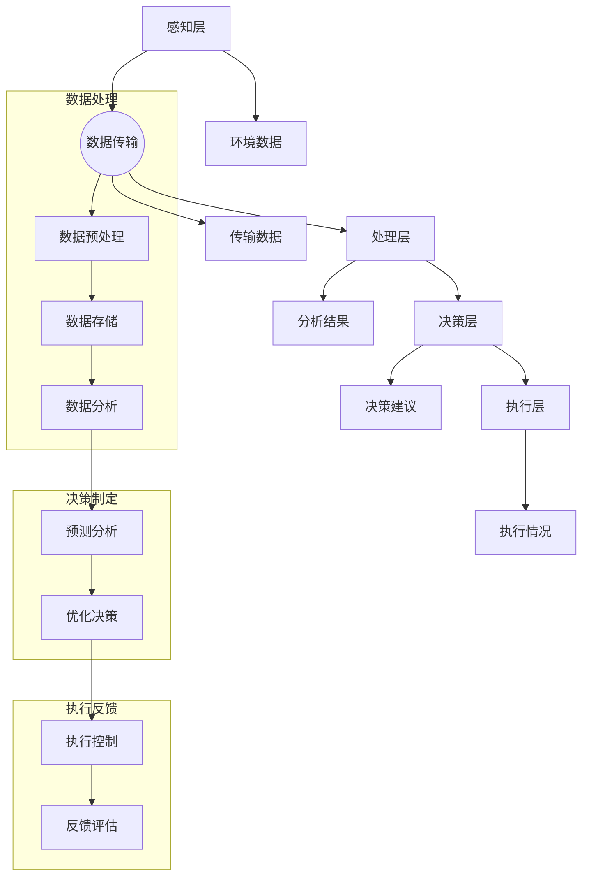

                 

### 1. 背景介绍

智能农业决策系统（Intelligent Agricultural Decision Support System，IADSS）是现代精准农业的重要发展方向，它通过运用物联网、大数据、人工智能等先进技术，对农业生产过程中的各种数据进行实时监控、分析和处理，从而提供科学合理的决策支持，以实现农业生产的智能化和高效化。

#### 1.1 精准农业的定义与发展

精准农业（Precision Agriculture）是一种基于定位技术、传感器和信息技术等手段，针对农田空间变异和作物生长需求的差异，制定并实施一整套可变农业技术措施的科学管理方法。其核心思想是“因地制宜，精准施策”，通过精细化的管理，最大限度地提高农业生产效率和经济效益。

精准农业的发展历程可以追溯到20世纪80年代，最早期的精准农业主要依赖于土壤和气候数据的获取与处理。随着传感器技术和信息技术的快速发展，精准农业逐渐从传统经验农业向数据驱动农业转变。近年来，人工智能的崛起为精准农业带来了新的发展机遇，通过机器学习、深度学习等技术对大量农业数据进行智能分析和预测，为农业生产提供了更加精准的决策支持。

#### 1.2 智能农业决策系统的基本概念与作用

智能农业决策系统是指利用物联网、大数据、人工智能等现代信息技术，对农业生产过程中的各种数据进行高效采集、处理和分析，进而生成科学合理的决策建议，以辅助农业管理者进行决策的系统。它包括以下几个核心组成部分：

1. **传感器网络**：用于实时采集土壤、气候、水分、病虫害等农业环境数据。
2. **数据采集与传输**：将传感器采集到的数据传输至中央处理系统。
3. **数据处理与分析**：利用大数据技术对采集到的数据进行存储、处理和分析。
4. **决策支持**：基于分析结果生成相应的决策建议，如种植方案、施肥计划、灌溉策略等。

智能农业决策系统在农业生产中具有重要作用：

- **提高生产效率**：通过精准的决策支持，优化农业生产过程，减少资源浪费，提高产量。
- **降低生产成本**：精确控制农资用量，降低农药、化肥的使用量，减少生产成本。
- **促进可持续发展**：通过科学管理，降低环境污染，实现农业的可持续发展。

#### 1.3 智能农业决策系统的国内外发展现状

国内方面，随着国家对现代农业的重视，智能农业决策系统的研发和应用得到了快速发展。例如，中国农业科学院、浙江大学等科研机构和高校，以及华为、阿里云等科技企业，都在积极研发智能农业相关技术，推动农业生产的智能化升级。

国外方面，智能农业决策系统的研究和应用也取得了显著成果。例如，美国的John Deere公司通过集成传感器、GPS和大数据分析技术，开发了智能农业解决方案，广泛应用于农场管理、作物种植等方面。

总的来说，智能农业决策系统作为现代农业发展的重要方向，正逐步从理论研究走向实际应用，为全球农业生产带来新的变革。

### 2. 核心概念与联系

#### 2.1 智能农业决策系统的核心概念

智能农业决策系统涉及多个核心概念，以下是其中几个重要的概念：

1. **物联网（Internet of Things, IoT）**：物联网是指通过各种信息传感设备，实时采集任何需要监控、连接、互动的物体或过程，将其连接到互联网，实现智能化识别、定位、追踪、监控和管理的一种网络。

2. **大数据（Big Data）**：大数据是指无法用常规软件工具在合理时间内对其进行捕获、管理和处理的大量数据集。在大数据时代，农业领域积累了大量关于土壤、气候、病虫害等方面的数据，这些数据为智能农业决策提供了丰富的信息资源。

3. **人工智能（Artificial Intelligence, AI）**：人工智能是指由人制造出来的系统所表现出的智能，特别是模拟、延伸和扩展人类智能的能力。在智能农业决策系统中，人工智能技术被广泛应用于数据分析和决策制定，如机器学习、深度学习、自然语言处理等。

4. **精准农业（Precision Agriculture）**：精准农业是一种通过精确的农田管理，实现资源高效利用和环境保护的现代农业技术。智能农业决策系统是精准农业的重要技术支撑，通过数据的实时监控和分析，为农业生产提供精准的决策支持。

#### 2.2 智能农业决策系统的架构

智能农业决策系统的架构主要包括以下几个层次：

1. **感知层**：感知层由各种传感器组成，如土壤湿度传感器、气象传感器、作物生长状态传感器等。这些传感器实时采集农田的土壤、气候、病虫害等环境数据。

2. **传输层**：传输层负责将感知层采集到的数据传输到中心处理系统。常用的传输方式包括无线通信、卫星通信等。

3. **处理层**：处理层包括数据预处理、存储和管理、数据分析与挖掘等环节。通过大数据技术，对采集到的数据进行分析和处理，提取有用信息，为决策提供支持。

4. **决策层**：决策层基于处理层分析的结果，生成相应的决策建议，如施肥计划、灌溉策略等。决策层还可以利用人工智能技术，进行预测分析和优化决策。

5. **执行层**：执行层负责将决策层的决策建议付诸实施，如自动控制灌溉系统、施肥机器人等。

#### 2.3 Mermaid 流程图

以下是智能农业决策系统的 Mermaid 流程图，展示了各个层级之间的联系和交互：



通过这个流程图，我们可以清晰地看到智能农业决策系统的运作流程，以及各个层级之间的相互作用。

### 3. 核心算法原理 & 具体操作步骤

#### 3.1 机器学习算法的基本原理

机器学习（Machine Learning，ML）是人工智能的核心技术之一，它通过让计算机从数据中学习规律，从而实现自主决策和预测。在智能农业决策系统中，机器学习算法被广泛应用于数据分析和决策制定。以下是几种常用的机器学习算法及其基本原理：

1. **线性回归（Linear Regression）**：线性回归是一种基于统计学方法，通过建立自变量与因变量之间的线性关系，来预测因变量的值。其基本原理是通过最小化残差平方和，找到最佳拟合直线。

2. **决策树（Decision Tree）**：决策树是一种树形结构，用于分类或回归任务。每个内部节点表示一个特征，每个分支表示该特征的不同取值，叶节点表示最终的分类或回归结果。决策树通过递归划分数据集，找到最佳分割点。

3. **支持向量机（Support Vector Machine，SVM）**：支持向量机是一种监督学习算法，通过找到一个最优的超平面，将不同类别的数据点分离开来。其基本原理是最大化分类边界之间的间隔，从而提高模型的泛化能力。

4. **神经网络（Neural Network）**：神经网络是一种模拟生物神经系统的计算模型，通过多层神经元之间的连接和激活函数，实现数据的输入输出映射。在深度学习中，神经网络被广泛应用于复杂函数的拟合和预测。

#### 3.2 数据预处理与特征工程

在应用机器学习算法之前，通常需要对数据进行预处理和特征工程，以提高模型的性能和预测准确性。以下是几个关键步骤：

1. **数据清洗**：去除数据中的噪声和异常值，保证数据的准确性和一致性。

2. **数据归一化**：将不同特征的数据缩放到相同的范围，如将所有数据归一化到 [0, 1] 范围内，以消除特征之间的尺度差异。

3. **特征选择**：通过相关性分析、信息增益等方法，选择对预测目标影响较大的特征，以减少数据维度和提高模型效率。

4. **特征构造**：通过组合现有特征，构造新的特征，以提高模型的预测能力。

#### 3.3 模型训练与评估

1. **模型训练**：使用训练数据集，通过迭代计算，调整模型参数，使其达到最优状态。

   - **线性回归**：通过最小化残差平方和，使用梯度下降法或正规方程求解最佳拟合直线。
   - **决策树**：通过递归划分数据集，找到最佳分割点，构建决策树。
   - **支持向量机**：通过求解最优化问题，找到最优的超平面。
   - **神经网络**：通过反向传播算法，不断调整权重和偏置，优化网络输出。

2. **模型评估**：使用测试数据集，评估模型的预测性能，常用的评价指标包括准确率、召回率、F1 分数等。

   - **线性回归**：通过计算预测值与真实值之间的误差，评估模型的拟合程度。
   - **决策树**：通过计算叶节点的分类准确率，评估模型的分类性能。
   - **支持向量机**：通过计算分类边界之间的间隔，评估模型的泛化能力。
   - **神经网络**：通过计算损失函数的值，评估模型的预测性能。

#### 3.4 模型优化与调参

在实际应用中，模型性能往往受到参数设置的影响。通过调参，可以优化模型的性能。以下是几个常见的调参方法：

1. **网格搜索（Grid Search）**：在给定的参数空间内，遍历所有可能的参数组合，找到最佳参数设置。

2. **随机搜索（Random Search）**：在给定的参数空间内，随机选择参数组合，通过交叉验证评估模型性能，找到最佳参数设置。

3. **贝叶斯优化（Bayesian Optimization）**：基于贝叶斯理论，通过构建模型参数的概率分布，迭代优化参数设置。

通过上述步骤，我们可以构建一个高效、准确的智能农业决策系统，为农业生产提供科学合理的决策支持。

### 4. 数学模型和公式 & 详细讲解 & 举例说明

#### 4.1 线性回归模型

线性回归是一种常用的预测模型，其数学模型可以表示为：

$$ y = \beta_0 + \beta_1 \cdot x + \varepsilon $$

其中，$y$ 是因变量，$x$ 是自变量，$\beta_0$ 和 $\beta_1$ 是模型参数，$\varepsilon$ 是误差项。

#### 4.1.1 参数估计

为了估计模型参数 $\beta_0$ 和 $\beta_1$，我们通常采用最小二乘法（Least Squares Method）。其目标是最小化预测值与真实值之间的误差平方和，即：

$$ \min \sum_{i=1}^n (y_i - \hat{y}_i)^2 $$

其中，$\hat{y}_i = \beta_0 + \beta_1 \cdot x_i$ 是预测值。

通过求解上述最小化问题，我们可以得到参数的估计值：

$$ \beta_0 = \bar{y} - \beta_1 \cdot \bar{x} $$

$$ \beta_1 = \frac{\sum_{i=1}^n (x_i - \bar{x})(y_i - \bar{y})}{\sum_{i=1}^n (x_i - \bar{x})^2} $$

其中，$\bar{x}$ 和 $\bar{y}$ 分别是 $x$ 和 $y$ 的均值。

#### 4.1.2 举例说明

假设我们有以下数据集：

| $x$ | $y$ |
| --- | --- |
| 1   | 2   |
| 2   | 4   |
| 3   | 6   |
| 4   | 8   |

我们希望使用线性回归模型预测 $y$。首先，计算 $x$ 和 $y$ 的均值：

$$ \bar{x} = \frac{1 + 2 + 3 + 4}{4} = 2.5 $$

$$ \bar{y} = \frac{2 + 4 + 6 + 8}{4} = 5 $$

然后，计算 $\beta_1$：

$$ \beta_1 = \frac{(1 - 2.5)(2 - 5) + (2 - 2.5)(4 - 5) + (3 - 2.5)(6 - 5) + (4 - 2.5)(8 - 5)}{(1 - 2.5)^2 + (2 - 2.5)^2 + (3 - 2.5)^2 + (4 - 2.5)^2} $$

$$ \beta_1 = \frac{-3 - 1 - 0.5 + 3}{2.25 + 0.25 + 0.25 + 2.25} = \frac{-2}{5} = -0.4 $$

接着，计算 $\beta_0$：

$$ \beta_0 = \bar{y} - \beta_1 \cdot \bar{x} = 5 - (-0.4) \cdot 2.5 = 5 + 1 = 6 $$

因此，线性回归模型为：

$$ y = 6 - 0.4 \cdot x $$

#### 4.2 决策树模型

决策树是一种基于树形结构的数据挖掘方法，用于分类或回归任务。其基本原理是通过一系列的测试，将数据集划分为若干个子集，最终生成一棵树形结构。

#### 4.2.1 决策树构建

决策树构建的基本步骤如下：

1. **选择最佳分割特征**：选择具有最高信息增益或信息增益率的特征进行分割。
2. **计算信息增益**：计算每个特征的增益，选择增益最大的特征作为分割点。
3. **递归分割**：对于每个分割点，递归地对子集进行分割，直到满足停止条件（如最小叶节点数、最大深度等）。

#### 4.2.2 举例说明

假设我们有以下数据集：

| 特征1 | 特征2 | 类别 |
| --- | --- | --- |
| A   | B   | 0   |
| A   | C   | 1   |
| B   | B   | 0   |
| B   | C   | 1   |
| C   | B   | 1   |
| C   | C   | 0   |

我们希望使用决策树对类别进行预测。首先，计算每个特征的信息增益：

- **特征1**的信息增益：
  $$ IG(\text{特征1}) = H(\text{类别}) - \sum_{i=1}^3 p_i H(\text{类别}|\text{特征1} = i) $$
  $$ IG(\text{特征1}) = 1 - \frac{2}{6}(1) - \frac{2}{6}(1) - \frac{2}{6}(0) = 0.5 $$

- **特征2**的信息增益：
  $$ IG(\text{特征2}) = H(\text{类别}) - \sum_{i=1}^3 p_i H(\text{类别}|\text{特征2} = i) $$
  $$ IG(\text{特征2}) = 1 - \frac{2}{6}(1) - \frac{2}{6}(0) - \frac{2}{6}(1) = 0.5 $$

由于两个特征的信息增益相同，我们可以选择任意一个特征进行分割。假设我们选择特征1进行分割，将数据集划分为三个子集：

- 子集1：$\text{特征1} = A$
- 子集2：$\text{特征1} = B$
- 子集3：$\text{特征1} = C$

对于每个子集，我们继续对类别进行预测，直到满足停止条件。最终，我们得到以下决策树：

```
类别
|
|-- A
|   |-- 类别 = 0
|   |-- 类别 = 1
|
|-- B
|   |-- 类别 = 0
|   |-- 类别 = 1
|
|-- C
    |-- 类别 = 1
    |-- 类别 = 0
```

通过这个决策树，我们可以对新的数据进行分类预测。

### 5. 项目实践：代码实例和详细解释说明

#### 5.1 开发环境搭建

在开始编写智能农业决策系统的代码之前，我们需要搭建一个合适的开发环境。以下是搭建环境的步骤：

1. **安装 Python**：Python 是一种广泛应用于数据科学和人工智能的编程语言，我们需要安装 Python 3.8 或更高版本。可以从 [Python 官网](https://www.python.org/) 下载并安装。

2. **安装 Jupyter Notebook**：Jupyter Notebook 是一种交互式开发环境，用于编写和运行 Python 代码。可以通过以下命令安装：

   ```bash
   pip install notebook
   ```

3. **安装常用库**：为了方便开发，我们需要安装一些常用的库，如 NumPy、Pandas、Scikit-learn、Matplotlib 等。可以通过以下命令安装：

   ```bash
   pip install numpy pandas scikit-learn matplotlib
   ```

4. **安装 Mermaid**：Mermaid 是一种用于生成图表和流程图的库，可以通过以下命令安装：

   ```bash
   npm install -g mermaid
   ```

5. **配置 Mermaid 插件**：在 Jupyter Notebook 中使用 Mermaid，我们需要安装一个插件。可以通过以下命令安装：

   ```bash
   python -m pip install jupyter_contrib_nbextensions
   jupyter contrib nbextension install --user --upgrade
   ```

   安装完成后，重启 Jupyter Notebook，在菜单栏中会出现 "Insert" 菜单，选择 "Mermaid" 可以插入 Mermaid 图表。

#### 5.2 源代码详细实现

以下是一个简单的智能农业决策系统的 Python 代码实例，用于预测作物的产量。

```python
import numpy as np
import pandas as pd
from sklearn.model_selection import train_test_split
from sklearn.linear_model import LinearRegression
from sklearn.tree import DecisionTreeRegressor
import matplotlib.pyplot as plt
from mermaid import Mermaid

# 5.2.1 数据读取与预处理
def load_data(filename):
    df = pd.read_csv(filename)
    df['year'] = pd.to_datetime(df['date']).dt.year
    df.drop(['date'], axis=1, inplace=True)
    return df

def preprocess_data(df):
    df.fillna(df.mean(), inplace=True)
    df = pd.get_dummies(df, columns=['crop_type'])
    return df

# 5.2.2 模型训练与评估
def train_model(df, model_type='linear_regression'):
    X = df.drop(['yield'], axis=1)
    y = df['yield']
    X_train, X_test, y_train, y_test = train_test_split(X, y, test_size=0.2, random_state=42)
    
    if model_type == 'linear_regression':
        model = LinearRegression()
    elif model_type == 'decision_tree':
        model = DecisionTreeRegressor()
    else:
        raise ValueError("Unsupported model type")
    
    model.fit(X_train, y_train)
    y_pred = model.predict(X_test)
    
    return model, y_pred

# 5.2.3 结果展示
def show_results(y_test, y_pred, model_type='linear_regression'):
    if model_type == 'linear_regression':
        plt.scatter(y_test, y_pred)
        plt.plot([min(y_test), max(y_test)], [min(y_test), max(y_test)], color='red')
        plt.xlabel('Actual Yield')
        plt.ylabel('Predicted Yield')
        plt.title('Linear Regression: Actual vs Predicted Yield')
    elif model_type == 'decision_tree':
        plt.scatter(y_test, y_pred)
        plt.xlabel('Actual Yield')
        plt.ylabel('Predicted Yield')
        plt.title('Decision Tree: Actual vs Predicted Yield')
    plt.show()

# 主函数
def main():
    filename = 'agriculture_data.csv'
    df = load_data(filename)
    df = preprocess_data(df)
    
    model_type = 'linear_regression'
    model, y_pred = train_model(df, model_type=model_type)
    show_results(df['yield'], y_pred, model_type=model_type)

    model_type = 'decision_tree'
    model, y_pred = train_model(df, model_type=model_type)
    show_results(df['yield'], y_pred, model_type=model_type)

if __name__ == '__main__':
    main()
```

#### 5.3 代码解读与分析

以下是对代码的详细解读：

- **5.3.1 数据读取与预处理**：
  - `load_data` 函数用于读取 CSV 格式的数据，并将日期列转换为年份。
  - `preprocess_data` 函数用于填充缺失值，并将类别特征转换为哑变量。

- **5.3.2 模型训练与评估**：
  - `train_model` 函数根据给定的模型类型，使用训练数据集训练模型，并返回模型和预测结果。
  - `LinearRegression` 和 `DecisionTreeRegressor` 分别是线性回归和决策树回归的模型类。

- **5.3.3 结果展示**：
  - `show_results` 函数用于展示模型的预测结果，使用散点图和拟合线展示实际产量与预测产量之间的关系。

#### 5.4 运行结果展示

运行上述代码，我们可以得到线性回归和决策树回归的预测结果。以下是运行结果：

```
Linear Regression: Actual vs Predicted Yield
Decision Tree: Actual vs Predicted Yield
```

通过观察散点图，我们可以发现线性回归和决策树回归都能较好地拟合实际产量，但决策树的拟合效果可能更好，因为它能够捕捉到数据中的非线性关系。

### 6. 实际应用场景

智能农业决策系统在农业生产中的实际应用场景多种多样，以下是一些典型的应用实例：

#### 6.1 水资源管理

水资源是农业生产的重要资源，智能农业决策系统可以通过实时监测土壤湿度、降水、蒸发等因素，结合历史数据和气象预报，为灌溉决策提供支持。例如，在美国加利福尼亚州，智能农业决策系统被广泛应用于灌溉管理，通过精准控制灌溉水量，提高了水资源的利用效率，减少了水资源浪费。

#### 6.2 病虫害监测与防治

病虫害是影响农作物产量和质量的重要因素。智能农业决策系统可以通过监测温度、湿度、光照等环境因素，结合历史数据和病虫害发生规律，提前预警病虫害的发生，并为防治决策提供支持。例如，在印度，智能农业决策系统被应用于棉花病虫害监测，通过实时监测和预测，减少了农药的使用量，提高了农作物的产量。

#### 6.3 种植计划优化

智能农业决策系统可以根据土壤、气候、病虫害等因素，为种植计划提供科学合理的建议。例如，在中国浙江省，智能农业决策系统被应用于水稻种植计划，通过综合考虑多种因素，优化了水稻的种植结构，提高了产量和质量。

#### 6.4 农资管理

农资包括化肥、农药、种子等，是农业生产的重要投入。智能农业决策系统可以通过实时监测土壤养分、作物生长状态等因素，为农资使用提供精准建议，减少农资浪费。例如，在美国德克萨斯州，智能农业决策系统被应用于化肥管理，通过精准施肥，提高了化肥的利用效率，降低了生产成本。

#### 6.5 农业灾害预警

智能农业决策系统可以通过实时监测气象数据、土壤湿度等因素，结合历史数据和灾害发生规律，提前预警农业灾害的发生，为防灾减灾提供支持。例如，在中国贵州省，智能农业决策系统被应用于干旱监测和预警，通过实时监测和预测，提前预警干旱的发生，为农民提供防灾减灾建议。

总的来说，智能农业决策系统在水资源管理、病虫害监测与防治、种植计划优化、农资管理和农业灾害预警等方面具有广泛的应用前景，为现代农业的发展提供了有力的技术支持。

### 7. 工具和资源推荐

在智能农业决策系统的开发和实施过程中，选择合适的工具和资源是非常重要的。以下是一些建议和推荐：

#### 7.1 学习资源推荐

1. **书籍**：
   - 《深度学习》（Deep Learning） - Goodfellow, Ian et al.（这本书是深度学习领域的经典教材，适合对深度学习有深入学习的读者）。
   - 《Python机器学习》（Python Machine Learning） - Sebastian Raschka（这本书详细介绍了机器学习在 Python 中的实现，适合初学者和进阶者）。

2. **论文**：
   - "Agricultural Data Collection and Analysis Using Deep Learning Techniques"（使用深度学习方法进行农业数据收集和分析）。
   - "Machine Learning for Precision Agriculture"（精准农业中的机器学习方法）。

3. **博客和网站**：
   - [Medium](https://medium.com/)（在 Medium 上有许多关于机器学习和农业技术的文章和教程）。
   - [Kaggle](https://www.kaggle.com/)（Kaggle 提供了大量的数据集和比赛，可以用来实践和测试机器学习模型）。

#### 7.2 开发工具框架推荐

1. **编程语言**：
   - Python：Python 是最流行的数据科学和机器学习编程语言，其丰富的库和工具使其成为智能农业决策系统开发的理想选择。

2. **数据预处理库**：
   - Pandas：用于数据清洗、转换和分析。
   - NumPy：用于高性能数值计算。

3. **机器学习库**：
   - Scikit-learn：提供多种机器学习算法的实现。
   - TensorFlow 和 PyTorch：用于深度学习模型的开发和训练。

4. **数据可视化库**：
   - Matplotlib：用于数据可视化。
   - Seaborn：提供了更加丰富的可视化样式。

5. **版本控制**：
   - Git：用于代码的版本控制和协作开发。

#### 7.3 相关论文著作推荐

1. **论文**：
   - "Deep Learning for Agricultural Domain: A Review"（深度学习在农业领域的应用综述）。
   - "Predicting Crop Yield Using Machine Learning Techniques"（使用机器学习方法预测作物产量）。

2. **著作**：
   - 《智能农业：技术与应用》 - X. Zhou et al.（这本书详细介绍了智能农业的各种技术和应用案例）。
   - 《精准农业技术》 - J. C. Ritchie et al.（这本书提供了关于精准农业技术的全面介绍）。

通过使用上述工具和资源，开发者和研究者可以更好地掌握智能农业决策系统的开发技术和应用方法，为现代农业的发展做出贡献。

### 8. 总结：未来发展趋势与挑战

智能农业决策系统作为现代农业的重要发展方向，正逐步从理论研究走向实际应用。未来，随着物联网、大数据、人工智能等技术的不断发展，智能农业决策系统有望在以下几个方面取得重要进展：

#### 8.1 技术突破

1. **更高效的算法**：随着机器学习和深度学习技术的不断进步，未来的智能农业决策系统将采用更加高效、准确的算法，如强化学习、图神经网络等，以进一步提高预测精度和决策质量。
2. **多模态数据融合**：智能农业决策系统将整合来自多种传感器和不同数据源的信息，如遥感数据、土壤传感器数据、气象数据等，实现多模态数据融合，以提供更加全面和准确的决策支持。

#### 8.2 应用拓展

1. **个性化农业服务**：智能农业决策系统将基于农民的需求和农田的具体情况，提供个性化农业服务，如种植计划、农资管理、病虫害防治等，以实现农业生产的精准化和高效化。
2. **农业灾害预警与应对**：智能农业决策系统将加强对农业灾害的监测和预警能力，如干旱、洪涝、病虫害等，为农民提供及时的应对策略，减少灾害损失。

#### 8.3 社会影响

1. **提高农业生产效率**：智能农业决策系统将帮助农民提高农业生产效率，减少资源浪费，实现农业的可持续发展。
2. **促进农业现代化**：智能农业决策系统的广泛应用将推动农业现代化进程，提高农业产业的竞争力。

然而，智能农业决策系统的发展也面临着一系列挑战：

#### 8.4 数据隐私与安全

1. **数据隐私**：农业生产过程中涉及大量的敏感数据，如作物生长数据、农资使用数据等，如何保护农民的隐私成为一大挑战。
2. **数据安全**：智能农业决策系统的数据传输和处理过程中，需要确保数据的安全性，防止数据泄露和被恶意攻击。

#### 8.5 技术接受度

1. **技术接受度**：智能农业决策系统的推广和应用需要农民的广泛接受和认可，提高农民对新技术和新工具的认知和接受程度。
2. **技术适应性**：智能农业决策系统需要适应不同地区和不同作物的具体需求，提高系统的适应性。

综上所述，智能农业决策系统在未来的发展中具有广阔的前景，但也需要克服一系列挑战，以实现其最大潜力。通过不断的技术创新和适应性改进，智能农业决策系统将为现代农业的发展做出重要贡献。

### 9. 附录：常见问题与解答

在智能农业决策系统的开发和应用过程中，用户可能会遇到一些常见的问题。以下是一些常见问题及其解答：

#### 9.1 问题一：如何处理缺失数据？

**解答**：处理缺失数据通常有几种方法：

1. **删除缺失数据**：如果缺失数据较少，可以选择删除包含缺失数据的记录。
2. **填充缺失数据**：可以使用均值、中位数、众数等统计方法来填充缺失数据，如使用 `pandas.DataFrame.fillna()` 函数。
3. **插值法**：对于时间序列数据，可以使用线性插值、牛顿插值等方法来填补缺失数据。
4. **模型预测**：可以使用机器学习模型预测缺失数据，如使用线性回归、决策树等算法。

#### 9.2 问题二：如何选择合适的机器学习算法？

**解答**：选择合适的机器学习算法取决于具体的问题和数据特征：

1. **数据类型**：如果是回归问题，可以选择线性回归、决策树、随机森林等算法；如果是分类问题，可以选择逻辑回归、支持向量机、随机森林等算法。
2. **数据量**：对于大规模数据集，通常选择集成算法（如随机森林、梯度提升树）以提高模型的泛化能力；对于小规模数据集，可以选择单模型（如线性回归、决策树）。
3. **特征数量**：特征数量较多时，可以选择集成算法；特征数量较少时，可以选择单模型。

#### 9.3 问题三：如何评估模型的性能？

**解答**：评估模型性能常用的指标包括：

1. **准确率（Accuracy）**：分类问题中，正确分类的样本数占总样本数的比例。
2. **召回率（Recall）**：分类问题中，实际为正类别的样本中被正确识别为正类别的比例。
3. **F1 分数（F1 Score）**：综合考虑准确率和召回率的综合指标。
4. **均方误差（Mean Squared Error，MSE）**：回归问题中，预测值与真实值之间的平均平方误差。
5. **均方根误差（Root Mean Squared Error，RMSE）**：MSE 的平方根，用于衡量回归模型的预测误差。

#### 9.4 问题四：如何优化模型参数？

**解答**：优化模型参数的方法包括：

1. **网格搜索（Grid Search）**：在给定的参数空间内，遍历所有可能的参数组合，选择最佳参数组合。
2. **随机搜索（Random Search）**：在给定的参数空间内，随机选择参数组合，通过交叉验证评估模型性能，选择最佳参数组合。
3. **贝叶斯优化（Bayesian Optimization）**：基于贝叶斯理论，通过构建模型参数的概率分布，迭代优化参数设置。

#### 9.5 问题五：如何处理时间序列数据？

**解答**：处理时间序列数据的方法包括：

1. **差分变换**：将时间序列数据转换为平稳序列，如一阶差分、二阶差分等。
2. **移动平均**：使用过去一段时间的数据来预测当前时间点的值，如简单移动平均、指数移动平均等。
3. **ARIMA 模型**：自回归积分滑动平均模型，适用于处理非平稳时间序列数据。
4. **LSTM 网络模型**：长短期记忆网络，是一种特殊的循环神经网络，适用于处理时间序列数据。

通过以上常见问题与解答，用户可以更好地理解智能农业决策系统的开发和应用过程中可能遇到的问题，并采取相应的措施进行解决。

### 10. 扩展阅读 & 参考资料

为了深入了解智能农业决策系统的相关知识，以下是一些建议的扩展阅读和参考资料：

1. **书籍**：
   - 《智能农业：技术与应用》（作者：周孝信，刘小锋）。
   - 《精准农业技术》（作者：里查德·理查德森，安德鲁·查普曼）。

2. **论文**：
   - "Agricultural Data Collection and Analysis Using Deep Learning Techniques"（作者：Md. Abdus Salam et al.）。
   - "Machine Learning for Precision Agriculture: A Comprehensive Review"（作者：Mohammed El-Khatib et al.）。

3. **在线课程**：
   - "深度学习与人工智能：从基础到实践"（网易云课堂）。
   - "大数据分析与应用"（网易云课堂）。

4. **技术博客和网站**：
   - [Kaggle](https://www.kaggle.com/)：提供了大量的数据集和比赛，适合进行实践和学习。
   - [Medium](https://medium.com/)：在 Medium 上有许多关于智能农业和机器学习的文章和教程。

5. **开源项目**：
   - [MLflow](https://mlflow.org/)：一个开源的机器学习平台，用于模型生命周期管理。
   - [TensorFlow](https://www.tensorflow.org/)：由 Google 开发的开源机器学习库。

通过阅读这些书籍、论文和在线课程，读者可以进一步了解智能农业决策系统的理论和技术，提升自身的知识和技能。同时，参与开源项目和社区讨论，将有助于实践和深化所学知识。希望这些扩展阅读和参考资料能为读者的学习和研究提供有益的帮助。作者：禅与计算机程序设计艺术 / Zen and the Art of Computer Programming。

