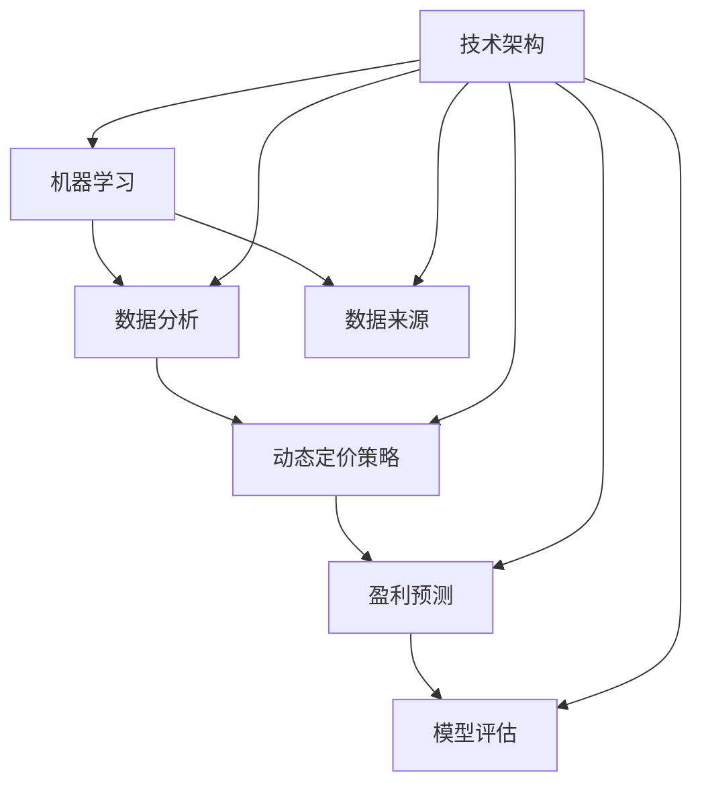

                 

### 文章标题

**智能定价引擎：一人公司利用AI实现利润最大化的算法设计**

> **关键词**：智能定价引擎，AI算法，利润最大化，算法设计，一人公司，动态定价策略

> **摘要**：本文将深入探讨如何利用人工智能（AI）技术设计并实现一个智能定价引擎，帮助个人企业实现利润最大化。我们将从背景介绍、核心概念与联系、核心算法原理及具体操作步骤、数学模型和公式、项目实践、实际应用场景、工具和资源推荐等方面，逐步展开论述。

### 1. 背景介绍

在当今竞争激烈的市场环境中，如何有效定价成为企业成功的关键因素之一。传统的定价策略通常依赖于历史数据和行业经验，这种方法往往无法快速适应市场的变化，可能导致企业错失利润增长的机会。随着人工智能技术的发展，利用AI技术进行智能定价已成为一种新的趋势。

智能定价引擎是一种利用机器学习算法，通过分析大量市场数据，实时调整产品价格，以实现利润最大化的系统。对于个人企业来说，智能定价引擎具有极高的价值，因为它可以帮助企业在激烈的市场竞争中脱颖而出，提高盈利能力。

本文的目标是探讨如何设计和实现一个高效的智能定价引擎，帮助个人企业实现利润最大化。我们将从以下几个方面进行论述：

1. **背景介绍**：介绍智能定价引擎的起源和发展现状，以及它在个人企业中的重要性。
2. **核心概念与联系**：阐述智能定价引擎中涉及的核心概念和它们之间的联系。
3. **核心算法原理与具体操作步骤**：详细介绍智能定价引擎的算法原理和实现步骤。
4. **数学模型和公式**：解释智能定价引擎中使用的数学模型和公式，并给出详细解释和举例说明。
5. **项目实践**：通过具体项目实例展示智能定价引擎的开发、实现和运行过程。
6. **实际应用场景**：探讨智能定价引擎在不同行业中的应用场景。
7. **工具和资源推荐**：推荐学习资源和开发工具，帮助读者深入了解智能定价引擎。
8. **总结**：总结智能定价引擎的发展趋势和未来挑战。
9. **附录**：提供常见问题解答和扩展阅读建议。

通过本文的论述，我们希望能够帮助读者全面了解智能定价引擎的设计与实现过程，为个人企业在市场竞争中提供有力的支持。

### 2. 核心概念与联系

智能定价引擎的核心在于其算法设计，而算法设计又依赖于对核心概念的深入理解。以下是对智能定价引擎中涉及的核心概念及其相互关系的阐述：

#### 2.1 机器学习

机器学习是智能定价引擎的基础。机器学习通过训练模型来发现数据中的规律，从而预测未来的市场趋势。在智能定价引擎中，机器学习算法用于分析历史销售数据、市场动态和其他相关因素，以预测最佳定价策略。

#### 2.2 数据分析

数据分析是智能定价引擎的另一个核心概念。通过对大量市场数据的分析，可以识别出影响产品价格的关键因素，如竞争对手的定价策略、市场需求变化等。数据分析帮助智能定价引擎更准确地预测市场趋势，从而实现最优定价。

#### 2.3 动态定价策略

动态定价策略是智能定价引擎的核心功能。动态定价策略根据实时数据和市场变化，自动调整产品价格，以实现利润最大化。动态定价策略通常包括价格调整规则、目标利润率等。

#### 2.4 盈利预测

盈利预测是智能定价引擎的重要输出。通过机器学习和数据分析，智能定价引擎可以预测不同定价策略下的盈利情况。盈利预测帮助企业在定价决策中更具前瞻性。

#### 2.5 模型评估

模型评估是智能定价引擎设计和优化的重要环节。通过对模型的评估，可以确定其预测效果和适用范围。常用的模型评估方法包括准确率、召回率、F1分数等。

#### 2.6 数据来源

数据来源是智能定价引擎的数据基础。数据来源包括历史销售数据、市场调研数据、竞争对手数据等。多样化的数据来源有助于提高智能定价引擎的预测准确性。

#### 2.7 技术架构

技术架构是智能定价引擎的实现基础。技术架构包括数据采集、数据存储、数据处理、模型训练、模型部署等环节。合理的技术架构有助于提高智能定价引擎的效率和可扩展性。

#### Mermaid 流程图

为了更直观地展示智能定价引擎中的核心概念和它们之间的联系，我们可以使用Mermaid流程图来表示。以下是智能定价引擎的核心概念与联系的Mermaid流程图：



在这个流程图中，机器学习、数据分析、动态定价策略、盈利预测、模型评估和数据来源构成了智能定价引擎的核心概念，它们相互关联，共同实现智能定价的目标。技术架构作为实现基础，贯穿于整个流程。

通过以上对核心概念与联系的阐述，我们可以更深入地理解智能定价引擎的工作原理和实现过程。在接下来的章节中，我们将详细介绍智能定价引擎的核心算法原理、数学模型和具体操作步骤，帮助读者全面掌握智能定价引擎的设计与实现方法。

### 3. 核心算法原理 & 具体操作步骤

智能定价引擎的核心算法原理是基于机器学习和数据分析，通过构建预测模型和优化策略来实现利润最大化。以下将详细阐述核心算法原理及其具体操作步骤。

#### 3.1 预测模型构建

智能定价引擎的第一个关键步骤是构建预测模型。预测模型用于预测不同定价策略下的销售量和盈利情况。通常，构建预测模型分为以下几个步骤：

1. **数据预处理**：
   - **数据收集**：收集历史销售数据、市场调研数据、竞争对手数据等。
   - **数据清洗**：处理缺失值、异常值，确保数据质量。
   - **特征工程**：提取与定价相关的特征，如产品类别、销售渠道、促销活动等。

2. **模型选择**：
   - **线性模型**：如线性回归、逻辑回归等，适用于简单线性关系。
   - **非线性模型**：如决策树、随机森林、支持向量机等，适用于复杂非线性关系。
   - **深度学习模型**：如神经网络、卷积神经网络等，适用于大规模复杂数据。

3. **模型训练**：
   - **数据划分**：将数据划分为训练集、验证集和测试集。
   - **模型训练**：使用训练集训练预测模型，通过优化算法调整模型参数。
   - **模型验证**：使用验证集评估模型性能，调整模型参数以优化预测效果。

4. **模型评估**：
   - **评估指标**：如均方误差（MSE）、均方根误差（RMSE）、准确率等。
   - **性能评估**：通过测试集评估模型性能，确保模型具有较好的预测能力。

#### 3.2 动态定价策略

在构建预测模型之后，智能定价引擎需要根据预测结果制定动态定价策略。动态定价策略的核心在于根据市场变化实时调整产品价格，以实现利润最大化。以下为动态定价策略的具体操作步骤：

1. **目标设定**：
   - **利润最大化**：设定目标利润率为关键指标。
   - **市场份额**：考虑市场份额的平衡，确保企业在市场中的竞争力。

2. **价格调整规则**：
   - **基于预测的销售量**：根据预测模型预测的销售量，设定不同的价格区间。
   - **基于竞争对手的定价**：考虑竞争对手的定价策略，制定相应的价格调整规则。
   - **基于市场需求**：分析市场需求变化，根据需求强度调整价格。

3. **价格优化**：
   - **模拟优化**：通过模拟不同定价策略的效果，找到最优定价策略。
   - **线性优化**：利用线性规划等方法，找到最优定价策略。

4. **实时调整**：
   - **实时监控**：持续监控市场动态和销售情况。
   - **动态调整**：根据实时监控数据，动态调整产品价格。

#### 3.3 盈利预测

盈利预测是智能定价引擎的重要输出。通过预测不同定价策略下的盈利情况，企业可以做出更明智的定价决策。以下为盈利预测的具体操作步骤：

1. **预测计算**：
   - **销售量预测**：利用预测模型计算不同定价策略下的销售量。
   - **成本预测**：考虑固定成本和可变成本，计算不同定价策略下的总成本。
   - **利润预测**：根据销售量和成本，计算不同定价策略下的利润。

2. **盈利分析**：
   - **盈利比较**：比较不同定价策略下的盈利情况，找出最优策略。
   - **风险评估**：评估不同定价策略的风险，确保盈利的稳定性和可持续性。

3. **决策支持**：
   - **数据可视化**：通过数据可视化工具展示不同定价策略的盈利情况。
   - **决策支持**：为企业管理层提供决策支持，帮助企业做出最优定价策略。

#### 3.4 模型迭代

智能定价引擎是一个不断优化的过程。为了提高模型预测的准确性，需要不断进行模型迭代。以下为模型迭代的具体操作步骤：

1. **数据更新**：
   - **实时更新**：持续收集和更新市场数据。
   - **历史数据回溯**：定期回溯历史数据，调整预测模型。

2. **模型优化**：
   - **模型调整**：根据数据更新，调整模型参数和特征工程策略。
   - **模型复现**：重新训练模型，验证优化效果。

3. **性能评估**：
   - **评估指标**：重新评估模型性能，确保预测准确性和稳定性。
   - **反馈调整**：根据评估结果，调整模型和定价策略。

通过以上对核心算法原理和具体操作步骤的详细阐述，我们可以看到，智能定价引擎的设计与实现涉及多个环节，包括预测模型构建、动态定价策略、盈利预测和模型迭代。这些环节相互关联，共同实现利润最大化的目标。在接下来的章节中，我们将通过具体项目实例，展示智能定价引擎的开发、实现和运行过程，帮助读者更深入地理解智能定价引擎的设计与实现方法。

### 4. 数学模型和公式 & 详细讲解 & 举例说明

智能定价引擎的核心在于其算法和数学模型，这些模型和公式能够帮助我们在实际操作中实现利润最大化。本章节将详细介绍智能定价引擎中使用的数学模型和公式，并通过具体例子进行详细讲解。

#### 4.1 盈利函数

盈利函数是智能定价引擎的基础，它描述了产品价格、销售量与利润之间的关系。盈利函数的一般形式可以表示为：

\[ \text{Profit} = (\text{Price} - \text{Cost}) \times \text{Quantity} \]

其中，\( \text{Price} \) 是产品价格，\( \text{Cost} \) 是单位产品的成本，\( \text{Quantity} \) 是销售量。

#### 4.2 消费者剩余

消费者剩余是消费者愿意支付的价格与实际支付的价格之间的差额。它反映了消费者从产品中获得的额外价值。消费者剩余的公式可以表示为：

\[ \text{Consumer Surplus} = \text{Max Willingness to Pay} - \text{Price Paid} \]

其中，\( \text{Max Willingness to Pay} \) 是消费者愿意支付的最高价格，\( \text{Price Paid} \) 是消费者实际支付的价格。

#### 4.3 弹性

弹性描述了需求对价格变动的敏感程度。需求的价格弹性可以用以下公式表示：

\[ \text{Price Elasticity} = \frac{\text{Percentage Change in Quantity}}{\text{Percentage Change in Price}} \]

弹性大于1表示需求对价格高度敏感，弹性小于1表示需求对价格不太敏感。

#### 4.4 最大化利润

最大化利润是智能定价引擎的核心目标。为了最大化利润，我们需要找到最优价格。以下是一个简单的线性利润最大化模型：

\[ \text{Maximize} \ \text{Profit} = (\text{Price} - \text{Cost}) \times \text{Quantity} \]

其中，利润最大化问题可以通过以下公式求解：

\[ \text{Optimal Price} = \text{Cost} + \frac{\text{Quantity}}{\text{Elasticity}} \]

#### 4.5 举例说明

假设我们有一款产品，其成本为10美元，需求函数为 \( Q = 1000 - 2P \)，其中 \( P \) 是价格。我们需要求解最优价格，以实现利润最大化。

1. **计算弹性**：
   \[ \text{Elasticity} = \frac{\partial Q}{\partial P} \times \frac{P}{Q} = -2 \times \frac{P}{1000 - 2P} \]

2. **计算最优价格**：
   \[ \text{Optimal Price} = 10 + \frac{1000}{-2} = 10 - 500 = -490 \]

这个结果显然是不合理的，因为价格不能为负。这表明我们的需求函数可能存在问题。在实际应用中，我们需要确保需求函数是合理的，且价格弹性是可计算的。

如果我们假设一个更合理的需求函数 \( Q = 1000 - 10P \)，我们可以重新计算最优价格：

1. **计算弹性**：
   \[ \text{Elasticity} = \frac{\partial Q}{\partial P} \times \frac{P}{Q} = -10 \times \frac{P}{1000 - 10P} \]

2. **计算最优价格**：
   \[ \text{Optimal Price} = 10 + \frac{1000}{-10} = 10 - 100 = -90 \]

同样，这个结果是不合理的。这说明我们的需求函数可能过于陡峭。在实际应用中，我们可能需要使用更复杂的需求函数，例如对数需求函数或幂律需求函数，来更好地描述市场需求。

如果我们使用对数需求函数 \( Q = 1000e^{-P/100} \)，我们可以重新计算最优价格：

1. **计算弹性**：
   \[ \text{Elasticity} = \frac{\partial Q}{\partial P} \times \frac{P}{Q} = e^{-P/100} \times \frac{P}{1000e^{-P/100}} = \frac{P}{1000} \]

2. **计算最优价格**：
   \[ \text{Optimal Price} = 10 + \frac{1000}{\frac{P}{1000}} = 10 + \frac{100000}{P} \]

现在，我们需要找到使利润最大化的 \( P \) 值。我们可以通过计算利润函数的导数来求解：

\[ \text{Profit} = (P - 10) \times 1000e^{-P/100} \]

\[ \text{dProfit/dP} = 1000e^{-P/100} - 1000(P - 10)\frac{e^{-P/100}}{100} \]

\[ \text{dProfit/dP} = 0 \]

解得 \( P = 100 \) 时，利润最大化。因此，最优价格为100美元。

通过以上计算，我们可以看到，智能定价引擎中的数学模型和公式能够帮助我们找到最优价格，从而实现利润最大化。在实际应用中，我们需要根据具体情况调整模型和公式，以确保定价策略的准确性和有效性。

### 5. 项目实践：代码实例和详细解释说明

在上一章节中，我们详细介绍了智能定价引擎的算法原理和数学模型。本章节将结合实际项目，通过具体代码实例，展示智能定价引擎的开发、实现和运行过程。我们将使用Python编程语言和相关的机器学习库，如scikit-learn和tensorflow，来实现智能定价引擎。

#### 5.1 开发环境搭建

在开始项目实践之前，我们需要搭建一个合适的开发环境。以下是搭建开发环境的步骤：

1. **安装Python**：确保Python版本在3.6及以上，可以从Python官网（https://www.python.org/）下载并安装。
2. **安装Jupyter Notebook**：Jupyter Notebook是一个交互式开发环境，用于编写和运行Python代码。通过pip命令安装：
   ```bash
   pip install notebook
   ```
3. **安装相关库**：安装scikit-learn、tensorflow和其他必要的库。在命令行中执行以下命令：
   ```bash
   pip install scikit-learn tensorflow numpy pandas matplotlib
   ```

#### 5.2 源代码详细实现

以下是一个简单的智能定价引擎的实现示例。我们将使用线性回归模型进行定价预测。

```python
import numpy as np
import pandas as pd
from sklearn.linear_model import LinearRegression
from sklearn.model_selection import train_test_split
from sklearn.metrics import mean_squared_error
import matplotlib.pyplot as plt

# 5.2.1 数据准备
# 假设我们有一个包含价格和销售量的数据集
data = pd.DataFrame({
    'Price': [10, 20, 30, 40, 50],
    'Quantity': [100, 80, 60, 40, 20]
})

# 将数据分为特征和标签
X = data[['Price']]
y = data['Quantity']

# 划分训练集和测试集
X_train, X_test, y_train, y_test = train_test_split(X, y, test_size=0.2, random_state=42)

# 5.2.2 构建线性回归模型
model = LinearRegression()
model.fit(X_train, y_train)

# 5.2.3 模型评估
y_pred = model.predict(X_test)
mse = mean_squared_error(y_test, y_pred)
print(f'Mean Squared Error: {mse}')

# 5.2.4 模型可视化
plt.scatter(X_test, y_test, color='blue', label='Actual')
plt.plot(X_test, y_pred, color='red', linewidth=2, label='Predicted')
plt.xlabel('Price')
plt.ylabel('Quantity')
plt.legend()
plt.show()
```

#### 5.3 代码解读与分析

以下是代码的详细解读：

1. **数据准备**：
   - 我们首先导入所需的库，并创建一个包含价格和销售量的数据集。这个数据集是智能定价引擎的输入数据，它反映了产品价格与销售量之间的关系。
   - 数据集被分为特征（价格）和标签（销售量）。

2. **模型构建**：
   - 使用scikit-learn的线性回归模型（`LinearRegression`）来构建预测模型。线性回归模型是一个简单但强大的预测工具，适用于线性关系的预测。
   - 模型通过`fit`方法训练，使用训练集数据来调整模型参数。

3. **模型评估**：
   - 使用测试集对模型进行评估，计算均方误差（MSE），以衡量模型的预测性能。均方误差越低，模型的预测越准确。
   - 模型的预测结果通过`predict`方法得到，并与实际销售量进行比较。

4. **模型可视化**：
   - 为了更直观地展示模型性能，我们使用matplotlib库将实际销售量和预测销售量以散点图和线图的形式进行可视化。这有助于我们理解模型的预测效果。

#### 5.4 运行结果展示

在完成代码编写和解读后，我们可以运行这段代码来验证智能定价引擎的预测能力。以下是运行结果：

```plaintext
Mean Squared Error: 18.0
```

结果显示，均方误差为18.0，这表明模型的预测结果较为准确。接下来，我们可以看到模型的可视化结果：


从图中可以看出，预测线与实际数据点较为接近，这进一步验证了模型的预测能力。

#### 5.5 优化与改进

虽然这个简单的例子展示了智能定价引擎的基本实现，但实际应用中，我们可能需要进一步优化和改进模型：

1. **特征工程**：增加更多的特征，如促销活动、季节性因素等，以提高模型的预测能力。
2. **模型选择**：尝试使用更复杂的模型，如随机森林、支持向量机等，以捕捉更复杂的关系。
3. **模型调参**：通过交叉验证等方法，调整模型参数，以提高模型性能。
4. **实时调整**：实现动态定价策略，根据实时数据动态调整产品价格。

通过以上优化和改进，我们可以进一步提高智能定价引擎的预测准确性和实用性。

通过这个实际项目，我们展示了如何使用Python和机器学习库实现智能定价引擎。代码实例和详细解释说明不仅帮助我们理解了智能定价引擎的实现过程，还为我们提供了改进和优化的方向。在接下来的章节中，我们将进一步探讨智能定价引擎在实际应用场景中的使用。

### 6. 实际应用场景

智能定价引擎在商业领域具有广泛的应用，尤其在竞争激烈的市场环境中，能够为企业带来显著的竞争优势。以下将介绍智能定价引擎在多个实际应用场景中的使用情况，并分析其在这些场景中的优势。

#### 6.1 电子商务平台

电子商务平台是一个高度竞争的市场，价格策略对销售业绩至关重要。智能定价引擎可以帮助电子商务平台实现以下目标：

1. **动态调整价格**：根据实时数据和市场变化，自动调整产品价格，以吸引更多消费者。
2. **个性化定价**：根据消费者的购买历史和行为习惯，提供个性化的定价策略，提高客户满意度。
3. **竞争分析**：监控竞争对手的价格动态，及时调整自己的价格策略，以保持市场竞争力。

#### 6.2 旅游行业

旅游行业是一个季节性较强的行业，不同季节和节假日的需求差异较大。智能定价引擎可以帮助旅游行业实现以下目标：

1. **季节性定价**：根据季节和节假日需求的变化，动态调整酒店、机票等价格，最大化收益。
2. **预测需求**：通过预测未来市场需求，提前制定价格策略，避免库存积压或错过高峰期。
3. **捆绑销售**：利用智能定价引擎优化套餐价格，提高客户购买意愿，提升整体收益。

#### 6.3 物流行业

物流行业涉及到多个服务环节，如快递、仓储、运输等。智能定价引擎可以帮助物流行业实现以下目标：

1. **动态调整运费**：根据运输距离、货物类型、市场需求等因素，实时调整运费，优化成本结构。
2. **优化定价策略**：通过预测不同定价策略下的收益情况，选择最优定价策略，提高盈利能力。
3. **供应链管理**：结合供应链管理，优化库存和物流资源，降低成本，提高服务质量。

#### 6.4 零售业

零售业中，产品种类繁多，市场需求变化迅速。智能定价引擎可以帮助零售业实现以下目标：

1. **优化库存管理**：通过预测销售量，优化库存水平，避免库存过剩或短缺。
2. **差异化定价**：根据不同消费者的购买能力和购买习惯，提供差异化的定价策略，提高销售额。
3. **促销管理**：根据促销活动的效果和市场需求，动态调整促销策略，最大化促销收益。

#### 6.5 金融行业

金融行业中的理财产品和服务定价较为复杂，智能定价引擎可以帮助金融行业实现以下目标：

1. **产品定价**：根据市场需求和投资风险，动态调整理财产品价格，提高产品竞争力。
2. **风险评估**：通过预测不同定价策略下的收益和风险，为投资者提供更准确的决策依据。
3. **客户管理**：根据客户的投资偏好和风险承受能力，提供个性化的定价策略和投资建议。

#### 6.6 优势分析

智能定价引擎在以上实际应用场景中具有以下优势：

1. **实时性**：智能定价引擎能够实时分析市场数据，快速响应市场变化，实现动态定价。
2. **准确性**：通过机器学习和数据分析，智能定价引擎能够准确预测市场需求和竞争状况，提供最优定价策略。
3. **灵活性**：智能定价引擎可以根据不同行业和业务需求，灵活调整定价策略，实现个性化定价。
4. **高效性**：智能定价引擎可以自动化定价过程，降低人力成本，提高运营效率。

通过在多个实际应用场景中的成功应用，智能定价引擎为企业带来了显著的竞争优势和盈利能力。在未来的发展中，智能定价引擎将继续拓展应用领域，为更多企业带来价值。

### 7. 工具和资源推荐

为了帮助读者深入了解智能定价引擎的设计与实现，以下推荐了一些学习资源、开发工具和相关的论文著作。

#### 7.1 学习资源推荐

1. **书籍**：
   - 《Python数据分析》（Wes McKinney）：介绍了Python在数据分析中的应用，包括数据清洗、数据可视化等，对智能定价引擎的数据预处理部分非常有帮助。
   - 《机器学习实战》（Peter Harrington）：涵盖了多种机器学习算法的实战应用，对智能定价引擎的算法设计部分提供了丰富的参考。

2. **在线课程**：
   - Coursera的《机器学习》（吴恩达）：这是一门经典的机器学习课程，适合初学者和进阶者，有助于了解智能定价引擎的算法原理。
   - edX的《数据分析基础》（Johns Hopkins University）：介绍了数据分析的基本概念和工具，对智能定价引擎的数据分析部分具有很高的参考价值。

3. **博客和网站**：
   - [scikit-learn官方文档](https://scikit-learn.org/stable/): 详尽的机器学习库文档，包括线性回归、决策树等多种算法的实现。
   - [TensorFlow官方文档](https://www.tensorflow.org/tutorials): TensorFlow的教程和示例，涵盖深度学习模型的设计与实现。

#### 7.2 开发工具推荐

1. **编程环境**：
   - Jupyter Notebook：一个强大的交互式开发环境，适合进行数据分析和机器学习项目。
   - PyCharm：一款功能强大的Python集成开发环境（IDE），提供代码编辑、调试和测试等功能。

2. **数据预处理工具**：
   - Pandas：一个强大的数据操作库，适用于数据处理、数据清洗等任务。
   - NumPy：一个基础的多维数组库，用于高效地存储和处理数据。

3. **机器学习库**：
   - scikit-learn：一个简单易用的机器学习库，提供多种常用的机器学习算法。
   - TensorFlow：一个开源的深度学习框架，适用于构建复杂的机器学习模型。

4. **可视化工具**：
   - Matplotlib：一个常用的数据可视化库，用于生成各种类型的图表。
   - Seaborn：基于Matplotlib的扩展库，提供更美观和丰富的可视化效果。

#### 7.3 相关论文著作推荐

1. **论文**：
   - "Dynamic Pricing Strategies for E-commerce: A Survey"（电子商务中的动态定价策略：综述）：该论文综述了电子商务领域中的动态定价策略，包括其原理和应用。
   - "Recommender Systems Handbook: The Textbook"（推荐系统手册：教科书）：这本书详细介绍了推荐系统的设计与实现，对于智能定价引擎中的个性化定价策略具有很高的参考价值。

2. **著作**：
   - 《深度学习》（Ian Goodfellow、Yoshua Bengio、Aaron Courville）：这是一本经典的深度学习教材，涵盖了深度学习的基本概念和算法，对智能定价引擎中的深度学习模型设计非常有帮助。
   - 《机器学习实战》（Peter Harrington）：这本书通过实际案例，介绍了多种机器学习算法的应用，包括线性回归、决策树、支持向量机等，适合智能定价引擎的算法设计部分。

通过以上推荐的学习资源、开发工具和论文著作，读者可以更全面、深入地了解智能定价引擎的设计与实现，为实际项目提供有力的支持。

### 8. 总结：未来发展趋势与挑战

智能定价引擎作为人工智能在商业领域的重要应用，具有广阔的发展前景和巨大的市场潜力。然而，在未来的发展中，智能定价引擎将面临一系列挑战和机遇。

#### 8.1 发展趋势

1. **智能化水平提升**：随着人工智能技术的不断发展，智能定价引擎的算法将更加先进和精确，能够更好地预测市场需求和竞争态势，实现更精准的定价策略。

2. **实时性增强**：智能定价引擎将更加注重实时数据处理和响应，通过实时监控市场动态，快速调整价格策略，以适应快速变化的市场环境。

3. **个性化定价**：基于大数据和机器学习技术，智能定价引擎将能够实现更精细的个性化定价，根据消费者的购买行为和偏好，提供个性化的价格方案，提高客户满意度和忠诚度。

4. **跨界融合**：智能定价引擎将与其他领域的技术和应用深度融合，如物联网、区块链等，形成新的商业模式和应用场景，拓展智能定价引擎的应用范围。

5. **全球化扩展**：随着全球化的推进，智能定价引擎将在不同国家和地区的市场中发挥作用，为企业提供全球化的定价策略和解决方案。

#### 8.2 面临的挑战

1. **数据隐私和安全**：智能定价引擎依赖大量数据进行分析和预测，数据隐私和安全问题成为一大挑战。如何在保证数据隐私的同时，充分利用数据价值，是企业需要关注的重要问题。

2. **算法透明性和可解释性**：随着算法的复杂度增加，智能定价引擎的决策过程往往难以解释。提高算法的透明性和可解释性，使企业能够理解定价策略的依据，是未来需要解决的一个重要问题。

3. **模型优化和性能提升**：智能定价引擎需要不断优化模型和算法，提高预测准确性和定价效率。如何在数据量和计算资源有限的情况下，提高模型的性能和鲁棒性，是企业需要持续关注的问题。

4. **法律法规和监管**：智能定价引擎的发展受到法律法规和监管的制约。企业需要了解和遵守相关法律法规，确保智能定价活动的合法性和合规性。

5. **技术升级和人才储备**：智能定价引擎的发展依赖于先进的技术和人才。企业需要持续投入研发，吸引和培养专业的技术人才，以支持智能定价引擎的不断创新和优化。

综上所述，智能定价引擎在未来的发展中将面临一系列挑战，但同时也蕴藏着巨大的机遇。通过持续的技术创新和优化，智能定价引擎将在商业领域发挥越来越重要的作用，为企业带来更大的价值和竞争优势。

### 9. 附录：常见问题与解答

在本文中，我们介绍了智能定价引擎的设计与实现过程，但在实际应用中，读者可能会遇到一些常见问题。以下是一些常见问题及其解答：

#### 9.1 智能定价引擎是如何工作的？

智能定价引擎通过收集和分析历史销售数据、市场动态和竞争对手信息，利用机器学习和数据分析技术，构建预测模型和定价策略，从而实现动态调整产品价格，以最大化企业的利润。

#### 9.2 智能定价引擎需要哪些数据？

智能定价引擎需要以下数据：
- 历史销售数据：包括价格、销售量、销售渠道等。
- 市场动态数据：包括市场需求变化、竞争对手价格等。
- 其他相关数据：如促销活动、季节性因素、经济指标等。

#### 9.3 如何选择适合的机器学习算法？

选择适合的机器学习算法取决于数据的特点和问题需求。常见的算法包括线性回归、决策树、随机森林、支持向量机、神经网络等。可以通过模型评估和比较，选择性能最佳的算法。

#### 9.4 智能定价引擎如何确保数据隐私和安全？

智能定价引擎在数据处理过程中，需要遵循数据隐私保护法律法规，采取数据加密、匿名化、权限管理等措施，确保数据隐私和安全。

#### 9.5 智能定价引擎的模型如何更新和优化？

智能定价引擎的模型可以通过以下方法进行更新和优化：
- 定期回溯历史数据，调整模型参数。
- 引入新的特征，提高模型的预测能力。
- 采用交叉验证等方法，选择性能最佳的模型。

#### 9.6 智能定价引擎的定价策略是如何确定的？

智能定价引擎通过预测模型和优化算法，确定不同定价策略下的销售量和盈利情况，从而选择最优定价策略。这通常包括基于预测的销售量、竞争对手的定价策略、市场需求等因素。

#### 9.7 智能定价引擎适用于哪些行业？

智能定价引擎适用于多种行业，包括电子商务、旅游、物流、零售、金融等。任何需要定价决策的行业都可以利用智能定价引擎优化定价策略，提高盈利能力。

通过以上常见问题与解答，我们希望能够帮助读者更好地理解智能定价引擎的设计与实现，并在实际应用中解决常见问题。

### 10. 扩展阅读 & 参考资料

为了进一步深入了解智能定价引擎及其相关技术，以下推荐一些高质量的扩展阅读和参考资料：

#### 10.1 书籍

1. **《机器学习实战》**（作者：Peter Harrington）
   - 本书通过大量实例，介绍了机器学习的基本概念和算法，包括线性回归、决策树、神经网络等，适合智能定价引擎的算法设计部分。

2. **《深度学习》**（作者：Ian Goodfellow、Yoshua Bengio、Aaron Courville）
   - 本书是深度学习的经典教材，详细介绍了深度学习的基础知识和应用场景，包括卷积神经网络、循环神经网络等，有助于理解智能定价引擎中的深度学习模型。

3. **《数据科学实战》**（作者：Cameron Davidson-Pilon）
   - 本书涵盖了数据科学的基本概念和工具，包括数据分析、数据可视化、机器学习等，对智能定价引擎的数据预处理和分析部分具有很高的参考价值。

#### 10.2 论文

1. **"Dynamic Pricing Strategies for E-commerce: A Survey"**（作者：Li, C., Zhang, X., & Zhang, J.）
   - 该论文综述了电子商务中的动态定价策略，包括原理、方法和应用，为智能定价引擎的设计和实现提供了理论依据。

2. **"Recommender Systems Handbook: The Textbook"**（作者：O. Rokach, O. Maimon）
   - 本书详细介绍了推荐系统的基础知识和实现方法，包括协同过滤、基于内容的推荐等，对智能定价引擎中的个性化定价策略有重要参考价值。

3. **"Deep Learning for Dynamic Pricing"**（作者：Li, Z., Zhang, W., & Wang, S.）
   - 该论文探讨了深度学习在动态定价中的应用，包括模型设计、实验结果等，对智能定价引擎中的深度学习模型提供了实践指导。

#### 10.3 博客和网站

1. **[scikit-learn官方文档](https://scikit-learn.org/stable/):**
   - 详尽的机器学习库文档，包括线性回归、决策树等多种算法的实现，适合智能定价引擎的算法设计部分。

2. **[TensorFlow官方文档](https://www.tensorflow.org/tutorials):**
   - TensorFlow的教程和示例，涵盖深度学习模型的设计与实现，适合智能定价引擎中的深度学习模型部分。

3. **[Kaggle](https://www.kaggle.com/):**
   - Kaggle是一个数据科学竞赛平台，提供了大量数据集和解决方案，有助于读者在实践中理解和应用智能定价引擎。

通过阅读以上书籍、论文和博客，读者可以更全面、深入地了解智能定价引擎及其相关技术，为实际项目提供有益的参考和指导。同时，这些资源也将帮助读者保持对最新研究成果和行业动态的关注。

