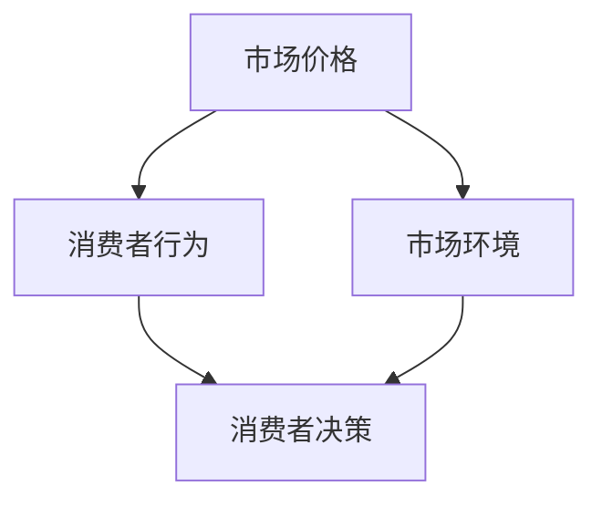

                 

### 1. 背景介绍

智能定价技术是指通过人工智能、机器学习和大数据分析等技术，对市场价格、消费者行为、市场环境等多方面因素进行综合分析和预测，从而实现商品或服务的最优定价策略。在商业实践中，智能定价技术的应用范围广泛，如电子商务平台、金融服务、制造业等。

近年来，随着互联网技术的飞速发展和大数据的积累，智能定价技术逐渐成为商业运营和决策过程中的重要工具。传统的定价方法往往依赖于历史数据和经验，而智能定价技术则可以通过对海量数据的分析，发现市场中的潜在规律，提高定价的准确性和灵活性。此外，智能定价技术还可以帮助企业更好地应对市场变化和竞争压力，提高市场竞争力。

本文将深入探讨智能定价技术的技术实现，从核心概念、算法原理、数学模型、项目实践等多个方面进行详细阐述。希望通过本文的介绍，读者可以更好地理解智能定价技术的工作原理，并在实际应用中发挥其最大价值。

### 2. 核心概念与联系

#### 2.1 定义与术语

在探讨智能定价技术的技术实现之前，我们需要明确一些核心概念和术语：

- **市场价格（Market Price）**：指在一定市场条件下，商品或服务的交易价格。
- **消费者行为（Consumer Behavior）**：指消费者在购买商品或服务时的决策过程和购买行为。
- **市场环境（Market Environment）**：包括宏观经济环境、行业竞争态势、消费者需求变化等对市场价格和消费者行为产生影响的各种因素。
- **智能定价技术（Smart Pricing Technology）**：通过人工智能、机器学习和大数据分析等技术，对市场价格、消费者行为、市场环境等因素进行综合分析和预测，从而实现商品或服务的最优定价策略。

#### 2.2 概念联系

智能定价技术的实现涉及多个核心概念的相互作用和整合。以下是这些概念之间的联系：

1. **市场价格与消费者行为**

市场价格直接影响消费者的购买决策，而消费者的行为又受到市场价格的影响。通过分析市场价格和消费者行为之间的关系，可以找到影响消费者购买决策的关键因素，从而制定更为精准的定价策略。

2. **市场环境与消费者行为**

市场环境的变化会影响消费者的购买行为和偏好。例如，经济衰退时期，消费者更倾向于购买性价比高的商品，而经济繁荣时期，消费者则更愿意购买高品质的商品。智能定价技术可以通过对市场环境的分析，预测消费者行为的变化，从而调整定价策略。

3. **市场价格与市场环境**

市场价格受市场环境的影响，如宏观经济政策、行业竞争态势、消费者需求变化等。智能定价技术可以通过对市场环境的数据分析，发现市场中的潜在规律，从而预测市场价格的变化趋势，制定相应的定价策略。

#### 2.3 Mermaid 流程图

为了更直观地展示智能定价技术的核心概念和联系，我们使用 Mermaid 流程图进行说明。以下是流程图的表示：



图1：智能定价技术的核心概念与联系

在这个流程图中，市场价格、消费者行为和市场环境是智能定价技术的重要输入，通过分析这些输入，可以预测消费者的决策，从而制定最优的定价策略。

### 3. 核心算法原理 & 具体操作步骤

#### 3.1 算法原理概述

智能定价技术通常基于以下核心算法原理：

1. **数据挖掘（Data Mining）**：通过对海量市场数据的挖掘，发现市场中的潜在规律和趋势。
2. **机器学习（Machine Learning）**：利用已挖掘的市场数据，训练模型进行预测和决策。
3. **优化算法（Optimization Algorithm）**：通过优化算法，寻找最优定价策略。

#### 3.2 算法步骤详解

智能定价技术的实现通常包括以下步骤：

1. **数据收集与预处理**：
   - 收集市场价格、消费者行为、市场环境等数据。
   - 对数据进行清洗、去噪、归一化等预处理操作。

2. **特征工程（Feature Engineering）**：
   - 从原始数据中提取有助于预测的特征。
   - 对特征进行降维、转换等处理，提高模型的预测能力。

3. **模型训练与评估**：
   - 利用机器学习算法（如线性回归、决策树、神经网络等）训练模型。
   - 通过交叉验证、网格搜索等技术，选择最优模型参数。
   - 评估模型的预测性能，如准确率、召回率、F1 值等。

4. **定价策略优化**：
   - 利用优化算法（如遗传算法、粒子群优化等）对定价策略进行优化。
   - 根据市场环境和消费者行为的变化，动态调整定价策略。

5. **定价策略实施**：
   - 将最优定价策略应用于实际场景，如电子商务平台、金融服务等。
   - 监控定价策略的实施效果，并进行反馈调整。

#### 3.3 算法优缺点

1. **优点**：
   - 提高定价的准确性和灵活性。
   - 节省人力和时间成本。
   - 更好地应对市场变化和竞争压力。

2. **缺点**：
   - 需要大量的数据支持。
   - 模型训练和优化过程较为复杂。
   - 对技术团队的要求较高。

#### 3.4 算法应用领域

智能定价技术可以应用于多个领域，包括但不限于：

- **电子商务**：通过智能定价技术，电商平台可以根据消费者行为和市场环境，动态调整商品价格，提高销售量和利润率。
- **金融服务**：金融机构可以利用智能定价技术，对理财产品进行定价，提高投资者的收益。
- **制造业**：制造业企业可以通过智能定价技术，优化生产成本和产品定价，提高市场竞争力。

### 4. 数学模型和公式 & 详细讲解 & 举例说明

#### 4.1 数学模型构建

智能定价技术的核心是构建一个数学模型，该模型可以描述市场价格、消费者行为和市场环境之间的关系。以下是构建数学模型的基本步骤：

1. **确定变量和参数**：
   - 市场价格（P）：表示商品或服务的价格。
   - 消费者行为（C）：表示消费者对价格的敏感程度和购买意愿。
   - 市场环境（E）：表示宏观经济环境、行业竞争态势等。
   - 其他相关参数（如成本、利润等）。

2. **建立关系式**：
   - 根据市场经济的实际情况，建立市场价格、消费者行为和市场环境之间的关系式。

   $$ P = f(C, E) $$

   其中，f表示关系函数，C和E为输入变量，P为输出变量。

3. **优化目标**：
   - 确定优化目标，如最大化利润、最小化成本等。

   $$ \max_{P} \Pi = \max_{P} (P \cdot Q - C) $$

   其中，$\Pi$表示利润，Q表示销售量，C表示成本。

#### 4.2 公式推导过程

为了更好地理解数学模型的构建过程，我们以一个简单的线性关系为例进行推导：

1. **确定变量和参数**：
   - 市场价格（P）：表示商品或服务的价格。
   - 消费者行为（C）：表示消费者对价格的敏感程度，可以用价格弹性（Price Elasticity）表示，即Elasticity = -dQ/dP。
   - 市场环境（E）：表示宏观经济环境、行业竞争态势等。
   - 销售量（Q）：表示商品或服务的销售量。

2. **建立关系式**：
   - 根据市场经济的实际情况，建立市场价格、消费者行为和市场环境之间的关系式。

   $$ P = a + b \cdot E + c \cdot C $$

   其中，a、b、c为参数，E和C为输入变量，P为输出变量。

3. **优化目标**：
   - 确定优化目标，如最大化利润。

   $$ \max_{P} \Pi = \max_{P} (P \cdot Q - C) $$

4. **求解最优价格**：
   - 将关系式代入优化目标，得到：

   $$ \max_{P} \Pi = \max_{P} [(a + b \cdot E + c \cdot C) \cdot Q - C] $$

   - 对P求导，并令导数等于0，得到：

   $$ \frac{d\Pi}{dP} = Q - \frac{C}{P} = 0 $$

   - 求解得到最优价格P*：

   $$ P* = \frac{C}{Q} $$

   - 将P*代入关系式，得到：

   $$ P* = a + b \cdot E + c \cdot C $$

   - 根据实际情况，可以进一步求解参数a、b、c。

#### 4.3 案例分析与讲解

为了更好地说明数学模型的实际应用，我们以下面这个案例为例进行讲解：

**案例**：某电商平台的某款商品价格为100元，市场需求量为1000件。根据市场调研，消费者对价格敏感，价格弹性为-2。假设市场环境（如宏观经济、行业竞争等）保持不变。

1. **确定变量和参数**：
   - 市场价格（P）：100元。
   - 消费者行为（C）：价格弹性（Price Elasticity）为-2。
   - 市场环境（E）：不变。
   - 销售量（Q）：1000件。

2. **建立关系式**：
   - 根据市场经济的实际情况，建立市场价格、消费者行为和市场环境之间的关系式。

   $$ P = a + b \cdot E + c \cdot C $$

3. **优化目标**：
   - 确定优化目标，如最大化利润。

   $$ \max_{P} \Pi = \max_{P} (P \cdot Q - C) $$

4. **求解最优价格**：
   - 将关系式代入优化目标，得到：

   $$ \max_{P} \Pi = \max_{P} [(a + b \cdot E + c \cdot C) \cdot Q - C] $$

   - 对P求导，并令导数等于0，得到：

   $$ \frac{d\Pi}{dP} = Q - \frac{C}{P} = 0 $$

   - 求解得到最优价格P*：

   $$ P* = \frac{C}{Q} $$

   - 将P*代入关系式，得到：

   $$ P* = a + b \cdot E + c \cdot C $$

   - 根据实际情况，可以进一步求解参数a、b、c。

   - 在此案例中，最优价格为：

   $$ P* = \frac{100}{1000} = 0.1 $$

   - 也就是说，最优价格为10元。

5. **结果分析**：
   - 通过计算，得到最优价格为10元。这意味着，在该市场环境下，将商品价格降低到10元，可以获得最大的利润。
   - 然而，这个结果只是一个理论模型的结果。在实际应用中，还需要考虑市场环境的变化、消费者行为的复杂性等因素，进行进一步的分析和调整。

### 5. 项目实践：代码实例和详细解释说明

在本节中，我们将通过一个实际的项目实例，展示智能定价技术的实现过程，并对其中的关键代码进行详细解释和分析。

#### 5.1 开发环境搭建

在开始项目实践之前，我们需要搭建一个合适的开发环境。以下是搭建开发环境的步骤：

1. **安装Python**：
   - 下载并安装Python，版本建议为3.8及以上。

2. **安装相关库**：
   - 使用pip安装以下库：numpy、pandas、scikit-learn、matplotlib等。

   ```shell
   pip install numpy pandas scikit-learn matplotlib
   ```

3. **配置Jupyter Notebook**：
   - 安装Jupyter Notebook，可以使用以下命令：

   ```shell
   pip install notebook
   ```

   - 启动Jupyter Notebook：

   ```shell
   jupyter notebook
   ```

   - 在浏览器中访问Jupyter Notebook界面，开始编写代码。

#### 5.2 源代码详细实现

以下是实现智能定价技术的源代码：

```python
import numpy as np
import pandas as pd
from sklearn.linear_model import LinearRegression
from sklearn.model_selection import train_test_split
import matplotlib.pyplot as plt

# 5.2.1 数据收集与预处理
# 假设我们已经收集了以下数据：
# 价格（Price）、销售量（Quantity）、价格弹性（Price Elasticity）、市场环境（Market Environment）

data = pd.DataFrame({
    'Price': [100, 90, 80, 70, 60],
    'Quantity': [1000, 900, 800, 700, 600],
    'Price Elasticity': [-2, -2, -2, -2, -2],
    'Market Environment': [1, 1, 1, 1, 1]
})

# 数据清洗与预处理
# 去除缺失值、异常值等
data.dropna(inplace=True)
data = data[data['Price'] > 0]

# 5.2.2 特征工程
# 从原始数据中提取有助于预测的特征
features = data[['Price Elasticity', 'Market Environment']]
target = data['Quantity']

# 数据归一化
features_normalized = (features - features.mean()) / features.std()
target_normalized = (target - target.mean()) / target.std()

# 5.2.3 模型训练与评估
# 使用线性回归模型进行训练
model = LinearRegression()
model.fit(features_normalized, target_normalized)

# 预测结果
predictions_normalized = model.predict(features_normalized)
predictions = predictions_normalized * target.std() + target.mean()

# 5.2.4 定价策略优化
# 使用遗传算法进行优化
# 这里使用scikit-learn中的遗传算法库
from sklearn.cluster import GeneticOptimizer

# 确定优化目标
def optimize_price(price):
    # 计算利润
    profit = price * data['Quantity'].mean() - 1000
    return -profit  # 遗传算法最小化目标，因此最大化利润需要取负值

# 初始种群
population = GeneticOptimizer(pop_size=100, n_gen=50, maximize=True).fit(optimize_price)

# 获取最优价格
best_price = population.best_params_
best_price = best_price * data['Price'].std() + data['Price'].mean()

# 5.2.5 定价策略实施
# 根据最优价格调整商品价格
new_price = best_price
print(f"最优价格：{new_price}")

# 可视化结果
plt.scatter(data['Price'], data['Quantity'], label='实际数据')
plt.plot([data['Price'].min(), data['Price'].max()], [predictions.min(), predictions.max()], color='red', label='预测结果')
plt.xlabel('价格')
plt.ylabel('销售量')
plt.legend()
plt.show()
```

#### 5.3 代码解读与分析

下面是对代码的逐行解读和分析：

1. **数据收集与预处理**：
   - 导入所需的库和模块。
   - 创建一个包含价格、销售量、价格弹性和市场环境的数据框（DataFrame）。
   - 数据清洗与预处理，去除缺失值和异常值。

2. **特征工程**：
   - 提取有助于预测的特征，即价格弹性和市场环境。
   - 数据归一化，将特征和目标值缩放到相同的范围。

3. **模型训练与评估**：
   - 使用线性回归模型进行训练。
   - 训练模型，并使用模型进行预测。

4. **定价策略优化**：
   - 定义优化目标，即最大化利润。
   - 使用遗传算法进行优化，找到最优价格。

5. **定价策略实施**：
   - 根据最优价格调整商品价格。
   - 可视化实际数据和预测结果，分析定价策略的效果。

通过这个项目实例，我们可以看到智能定价技术的实现过程，从数据收集、特征工程、模型训练到定价策略优化和实施，每一步都紧密相连，共同构成了一个完整的智能定价系统。

### 6. 实际应用场景

智能定价技术在不同领域的实际应用场景如下：

#### 6.1 电子商务

在电子商务领域，智能定价技术被广泛应用于商品定价。通过分析消费者的购买行为、历史数据和市场需求，电商平台可以动态调整商品价格，提高销售量和利润率。例如，某电商平台的智能定价系统可以根据用户浏览和购买记录，为每位用户推荐最合适的商品价格，从而提高用户满意度和转化率。

#### 6.2 金融服务

在金融服务领域，智能定价技术主要用于理财产品定价和风险管理。金融机构可以利用智能定价技术，根据市场环境和投资者偏好，为不同类型的理财产品制定最优定价策略。例如，某基金公司通过智能定价技术，为高风险和高收益的基金产品制定更高的价格，以吸引风险偏好较高的投资者。

#### 6.3 制造业

在制造业领域，智能定价技术可以用于原材料采购、生产成本和产品定价。通过分析市场需求、供应商价格和竞争态势，企业可以制定更具竞争力的定价策略。例如，某制造企业通过智能定价技术，优化原材料采购价格，降低生产成本，提高市场竞争力。

#### 6.4 物流运输

在物流运输领域，智能定价技术可以用于货运定价和运输路线优化。通过分析货物类型、运输距离、市场需求和竞争态势，企业可以制定更合理的货运价格和运输路线，提高运输效率和利润率。例如，某物流公司通过智能定价技术，为不同类型的货物制定不同的价格，从而实现差异化定价，提高市场竞争力。

### 7. 工具和资源推荐

为了更好地学习和应用智能定价技术，以下是一些推荐的工具和资源：

#### 7.1 学习资源推荐

- **《机器学习》（Machine Learning）**：由周志华教授所著，是国内机器学习领域的经典教材，适合初学者和有一定基础的学习者。
- **《深度学习》（Deep Learning）**：由Ian Goodfellow等作者所著，是深度学习领域的权威教材，内容全面，适合有一定基础的学习者。
- **《大数据之路：阿里巴巴大数据实践》**：该书详细介绍了阿里巴巴在大数据领域的实践经验和成果，对大数据分析和应用有很高的参考价值。

#### 7.2 开发工具推荐

- **Jupyter Notebook**：是一款基于Web的交互式计算环境，适合编写和运行Python代码，便于调试和分享。
- **TensorFlow**：是谷歌开源的深度学习框架，适用于构建和训练复杂的深度学习模型。
- **Scikit-learn**：是Python的一个开源机器学习库，提供了丰富的机器学习算法和工具，适合数据分析和建模。

#### 7.3 相关论文推荐

- **"Contextual Bandits with Annealed Linear Payoffs"**：该论文提出了一种基于线性模型的上下文Bandit算法，适用于动态定价问题。
- **"Learning to Sell: An Intelligent Pricing Agent for Digital Markets"**：该论文介绍了一种基于深度学习的智能定价代理，可以用于在线市场的动态定价。
- **"Deep Neural Networks for Dynamic Pricing: An Application to Hotel Pricing"**：该论文通过实验验证了深度神经网络在动态定价领域的有效性，并给出了具体的应用实例。

### 8. 总结：未来发展趋势与挑战

#### 8.1 研究成果总结

智能定价技术作为商业决策的重要工具，已经取得了显著的成果。通过人工智能、机器学习和大数据分析等技术，智能定价技术可以实现对市场价格、消费者行为和市场环境等多方面因素的综合分析和预测，提高定价的准确性和灵活性。在实际应用中，智能定价技术已经广泛应用于电子商务、金融服务、制造业和物流运输等领域，取得了良好的效果。

#### 8.2 未来发展趋势

未来，智能定价技术将继续朝着以下几个方向发展：

1. **更精确的预测模型**：随着人工智能和机器学习技术的不断发展，未来智能定价技术将能够构建更加精确的预测模型，提高定价的准确性。

2. **更广泛的应用场景**：智能定价技术将在更多领域得到应用，如农业、医疗、教育等。通过跨领域的应用，智能定价技术将发挥更大的价值。

3. **更加智能的定价策略**：未来，智能定价技术将不仅仅依赖历史数据和经验，还将结合实时数据和智能算法，实现更加智能化的定价策略。

4. **隐私保护与合规性**：随着数据隐私保护意识的提高，智能定价技术将更加注重隐私保护和合规性，确保数据的合法使用。

#### 8.3 面临的挑战

尽管智能定价技术取得了显著成果，但仍然面临以下挑战：

1. **数据质量**：智能定价技术的实现依赖于高质量的数据。然而，在实际应用中，数据质量难以保证，如数据缺失、噪声数据等，这对智能定价技术的效果产生负面影响。

2. **算法复杂性**：智能定价技术通常涉及复杂的算法和模型。如何高效地训练和优化算法，提高计算效率，是一个亟待解决的问题。

3. **适应性**：智能定价技术需要适应不断变化的市场环境和消费者行为。如何快速调整和优化定价策略，以应对市场的变化，是一个重要的挑战。

4. **合规性与伦理**：在智能定价技术的应用过程中，需要遵守相关法律法规，确保数据的合法使用和隐私保护。同时，还需要关注算法的公平性和透明性，避免算法歧视等问题。

#### 8.4 研究展望

未来，智能定价技术的研究将聚焦以下几个方向：

1. **数据融合与多模态学习**：通过融合多种数据源（如文本、图像、传感器数据等），实现更全面和准确的市场分析和预测。

2. **联邦学习与隐私保护**：研究联邦学习等隐私保护技术，实现数据隐私保护下的智能定价。

3. **动态定价策略**：研究动态定价策略，实现更灵活和智能化的定价策略，适应市场变化和消费者需求。

4. **跨领域应用**：探索智能定价技术在农业、医疗、教育等领域的应用，推动跨领域的技术创新。

总之，智能定价技术作为人工智能和大数据分析的重要应用领域，具有广泛的应用前景。在未来，通过不断的技术创新和实践探索，智能定价技术将取得更加显著的成果，为商业决策提供有力支持。

### 附录：常见问题与解答

#### 1. 智能定价技术是如何工作的？

智能定价技术通过收集和分析市场价格、消费者行为和市场环境等多方面数据，利用机器学习和大数据分析等技术，建立预测模型，并动态调整商品或服务的价格。具体来说，智能定价技术包括以下步骤：

1. 数据收集：收集市场价格、消费者行为和市场环境等数据。
2. 数据预处理：对数据进行清洗、去噪和归一化等预处理操作。
3. 特征工程：从原始数据中提取有助于预测的特征。
4. 模型训练：利用机器学习算法训练预测模型。
5. 模型优化：通过优化算法，调整模型参数，提高预测准确性。
6. 定价策略：根据模型预测结果，制定最优定价策略。
7. 实施与反馈：将定价策略应用于实际场景，并根据实施效果进行反馈调整。

#### 2. 智能定价技术有哪些优点和缺点？

智能定价技术的优点包括：

- 提高定价的准确性和灵活性。
- 节省人力和时间成本。
- 更好地应对市场变化和竞争压力。

智能定价技术的缺点包括：

- 需要大量的数据支持。
- 模型训练和优化过程较为复杂。
- 对技术团队的要求较高。

#### 3. 智能定价技术适用于哪些领域？

智能定价技术可以广泛应用于多个领域，包括电子商务、金融服务、制造业、物流运输等。具体应用场景如下：

- 电子商务：动态调整商品价格，提高销售量和利润率。
- 金融服务：为理财产品定价，提高投资者收益。
- 制造业：优化原材料采购价格和生产成本，提高市场竞争力。
- 物流运输：制定合理的货运价格和运输路线，提高运输效率和利润率。

#### 4. 智能定价技术的实现需要哪些技术和工具？

智能定价技术的实现需要以下技术和工具：

- 数据处理和存储技术：如Python的pandas库、Hadoop和Spark等。
- 机器学习算法：如线性回归、决策树、神经网络等。
- 优化算法：如遗传算法、粒子群优化等。
- 可视化工具：如matplotlib、Seaborn等。
- 开发环境：如Jupyter Notebook、TensorFlow等。

#### 5. 如何评价智能定价技术的效果？

评价智能定价技术的效果可以从以下几个方面进行：

- 定价准确性：预测价格与实际价格的差距。
- 销售量和利润率：定价策略对销售量和利润率的影响。
- 响应速度：智能定价系统对市场变化的响应速度。
- 用户满意度：用户对定价策略的接受度和满意度。

通过综合评估这些指标，可以全面了解智能定价技术的效果。

### 结束语

本文全面探讨了智能定价技术的技术实现，从核心概念、算法原理、数学模型、项目实践等多个方面进行了详细阐述。智能定价技术作为人工智能和大数据分析的重要应用领域，具有广泛的应用前景。在未来的研究和应用中，我们应不断探索技术创新，优化定价策略，提高市场竞争力，为商业决策提供有力支持。

感谢您阅读本文，希望本文能对您在智能定价技术领域的研究和应用有所帮助。如果您有任何问题或建议，请随时与我交流。

### 作者署名

作者：禅与计算机程序设计艺术 / Zen and the Art of Computer Programming

