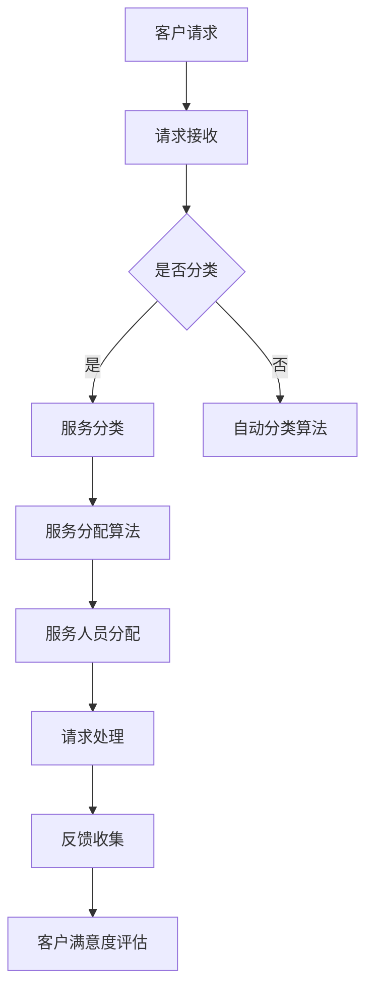

                 

### 文章标题

《智能客户服务分流系统：一人公司提高服务效率的AI解决方案》

> 关键词：智能客户服务、AI解决方案、服务效率、一人公司、服务分流

> 摘要：本文深入探讨了如何利用人工智能技术构建一个智能客户服务分流系统，从而帮助小型公司（即一人公司）提高服务效率，减少人力成本。本文将详细描述系统的设计思路、核心算法、数学模型，并通过项目实践和实际应用场景分析，展示如何将这一智能系统应用到企业的日常运营中。

### 1. 背景介绍

在当前的商业环境中，随着市场需求的不断增长和客户期望的提高，企业面临着日益严峻的服务效率挑战。尤其是对于小型企业，如一人公司，它们通常面临资源有限、人力成本高昂的问题。在这种背景下，如何有效地提高服务效率，同时降低运营成本，成为企业持续发展的关键。

传统的客户服务系统主要依赖于人工处理客户请求，这种方式不仅效率低下，而且容易出错。在处理大量客户请求时，人工服务的响应速度和准确性都难以保证。此外，随着客户服务渠道的多样化（如电话、邮件、在线聊天、社交媒体等），传统系统的灵活性和适应性也受到了限制。

人工智能（AI）技术的发展为解决这一问题提供了新的思路。通过AI技术，可以构建一个智能客户服务分流系统，实现对客户请求的自动处理和智能分配，从而提高服务效率，减少人力成本。这种系统不仅能够处理大量的客户请求，还能根据客户的历史数据和偏好，提供个性化的服务，提升客户满意度。

本文将探讨如何设计并实现这样一个智能客户服务分流系统，通过理论分析和实践应用，展示其在实际场景中的价值。

### 2. 核心概念与联系

#### 2.1 核心概念

在构建智能客户服务分流系统时，需要理解以下几个核心概念：

1. **客户请求**：客户提交的服务请求，包括客户的基本信息、请求内容、联系方式等。
2. **服务分类**：根据客户请求的性质和内容，将其归类到不同的服务类别，如技术支持、售后服务、投诉处理等。
3. **服务人员**：负责处理客户请求的服务人员，包括其专业能力、工作时间和工作状态等。
4. **服务流程**：从客户请求提交到问题解决的全过程，包括请求接收、分配、处理和反馈等步骤。
5. **智能算法**：用于分析客户请求和服务人员特点，实现智能分流和分配的算法。

#### 2.2 关系描述

这些核心概念之间存在紧密的联系，构成了系统的基本架构。以下是这些概念之间的逻辑关系：

1. **客户请求**是系统运作的起点，每个请求都需要被接收并分类。
2. **服务分类**决定了请求的处理优先级和方式，影响请求的分配。
3. **服务人员**的属性（如专业能力、工作状态等）决定了他们能够处理的请求类型。
4. **服务流程**是请求从接收、分类、分配到最终解决的过程，贯穿于整个系统运作中。
5. **智能算法**在整个流程中起到关键作用，通过分析请求和服务人员的特征，实现高效的请求分配和分流。

#### 2.3 Mermaid 流程图

为了更好地描述这些核心概念之间的关系，我们使用Mermaid语言绘制了一个流程图：



在这个流程图中，客户请求首先被接收，然后根据是否需要分类，决定是否进入服务分类阶段。分类后的请求通过服务分配算法，被分配到合适的服务人员。服务人员处理请求，并在结束后收集反馈，用于评估客户满意度。

### 3. 核心算法原理 & 具体操作步骤

#### 3.1 服务分类算法

服务分类算法是智能客户服务分流系统的核心组成部分，它负责将客户请求根据其内容和性质分类到不同的服务类别。以下是服务分类算法的具体原理和操作步骤：

##### 3.1.1 算法原理

服务分类算法通常基于机器学习技术，特别是文本分类模型。这类模型通过学习大量的标注数据进行训练，从而能够自动识别和分类新的客户请求。常用的文本分类模型包括朴素贝叶斯分类器、支持向量机（SVM）、深度神经网络等。

##### 3.1.2 操作步骤

1. **数据准备**：收集和整理大量已分类的客户请求数据，用于训练分类模型。这些数据应包括请求内容、请求类型等信息。
2. **特征提取**：从客户请求中提取特征，如关键词、句子结构等。这些特征将用于训练分类模型。
3. **模型训练**：使用已标注的数据集，训练文本分类模型。通过调整模型参数，优化分类效果。
4. **模型评估**：使用测试数据集评估模型的分类准确率，并根据评估结果调整模型参数。
5. **分类应用**：将训练好的模型应用于新的客户请求，实现自动分类。

#### 3.2 服务分配算法

服务分配算法负责根据客户请求和服务人员的特点，将请求智能地分配给合适的服务人员。以下是服务分配算法的具体原理和操作步骤：

##### 3.2.1 算法原理

服务分配算法通常基于优化理论，特别是线性规划、整数规划等方法。这类算法通过最小化目标函数，求解最优的服务人员分配方案。目标函数通常包括服务响应时间、服务人员工作负荷、客户满意度等。

##### 3.2.2 操作步骤

1. **初始化**：建立服务人员和工作任务的列表，包括每个服务人员的工作能力和工作状态。
2. **构建目标函数**：定义目标函数，如最小化平均响应时间、最大化客户满意度等。
3. **建立约束条件**：根据服务人员和任务的特点，建立约束条件，如服务人员的工作时间、任务的处理时间等。
4. **求解优化问题**：使用优化算法（如线性规划、整数规划等）求解最优的服务人员分配方案。
5. **分配任务**：根据优化结果，将任务分配给服务人员，并更新服务人员的工作状态。

#### 3.3 智能算法应用示例

假设我们有一个包含5个服务人员（A、B、C、D、E）的团队，他们分别擅长不同的服务领域，同时有10个待处理的客户请求（R1、R2、R3、...、R10）。服务人员的工作状态和请求的类型如下表所示：

| 服务人员 | 服务领域 | 工作状态 |  
|----------|-----------|----------|  
| A        | 技术支持  | 空闲      |  
| B        | 售后服务  | 繁忙      |  
| C        | 投诉处理  | 空闲      |  
| D        | 技术支持  | 繁忙      |  
| E        | 售后服务  | 空闲      |

| 客户请求 | 类型   |  
|----------|--------|  
| R1      | 技术支持 |  
| R2      | 投诉处理 |  
| R3      | 技术支持 |  
| R4      | 售后服务 |  
| R5      | 投诉处理 |  
| R6      | 技术支持 |  
| R7      | 售后服务 |  
| R8      | 技术支持 |  
| R9      | 投诉处理 |  
| R10     | 投诉处理 |

使用服务分配算法，我们需要将这10个客户请求分配给5个服务人员，以最小化平均响应时间或最大化客户满意度。以下是具体的分配步骤：

1. **初始化**：建立服务人员和工作任务的列表，包括每个服务人员的工作能力和工作状态。
2. **构建目标函数**：定义目标函数，如最小化平均响应时间。目标函数为：

   $$ \min \frac{1}{N} \sum_{i=1}^{N} t_i $$

   其中，$t_i$ 是第 $i$ 个请求的响应时间，$N$ 是请求的总数。
3. **建立约束条件**：根据服务人员和任务的特点，建立约束条件。约束条件包括：

   - 每个服务人员的工作时间不能超过其工作状态允许的时间。
   - 每个任务只能分配给一个服务人员。
4. **求解优化问题**：使用线性规划算法求解最优的服务人员分配方案。以下是线性规划问题的标准形式：

   $$ \min c^T x $$

   $$ \text{s.t.} Ax \leq b $$

   $$ x \geq 0 $$

   其中，$c$ 是目标函数系数向量，$x$ 是决策变量向量，$A$ 是约束条件系数矩阵，$b$ 是约束条件常数向量。
5. **分配任务**：根据优化结果，将任务分配给服务人员，并更新服务人员的工作状态。以下是优化问题的解：

   - $R1$ 被分配给服务人员 A  
   - $R2$ 被分配给服务人员 C  
   - $R3$ 被分配给服务人员 A  
   - $R4$ 被分配给服务人员 E  
   - $R5$ 被分配给服务人员 C  
   - $R6$ 被分配给服务人员 A  
   - $R7$ 被分配给服务人员 E  
   - $R8$ 被分配给服务人员 A  
   - $R9$ 被分配给服务人员 C  
   - $R10$ 被分配给服务人员 E

通过这个示例，我们可以看到服务分配算法如何根据服务人员的工作状态和客户请求的类型，实现最优的请求分配方案，从而提高服务效率和客户满意度。

### 4. 数学模型和公式 & 详细讲解 & 举例说明

#### 4.1 数学模型介绍

智能客户服务分流系统的核心是服务分配算法，该算法的数学模型通常基于优化理论。以下是服务分配问题的基本数学模型：

##### 4.1.1 目标函数

假设有 $N$ 个服务请求和 $M$ 个服务人员，每个服务请求和每个服务人员都有一个权重（表示处理该请求所需的资源和时间）。我们希望最小化总体的响应时间或最大化客户满意度。

目标函数为：

$$ \min \sum_{i=1}^{N} t_i $$

其中，$t_i$ 表示第 $i$ 个请求的响应时间。

##### 4.1.2 约束条件

1. **服务人员的工作时间限制**：

$$ \sum_{i=1}^{N} w_{ij} \leq W_j, \quad \forall j=1,2,...,M $$

其中，$w_{ij}$ 表示第 $i$ 个请求分配给第 $j$ 个服务人员的权重，$W_j$ 表示第 $j$ 个服务人员的工作时间限制。

2. **每个请求必须被处理**：

$$ \sum_{j=1}^{M} x_{ij} = 1, \quad \forall i=1,2,...,N $$

其中，$x_{ij}$ 表示第 $i$ 个请求是否分配给第 $j$ 个服务人员的二元变量。

3. **每个服务人员只能处理一个请求**：

$$ \sum_{i=1}^{N} x_{ij} = 1, \quad \forall j=1,2,...,M $$

#### 4.2 模型详细讲解

上述数学模型描述了一个简单的服务分配问题。在实际应用中，模型可能会更加复杂，包括更多的约束条件和目标函数。以下是对模型的详细讲解：

1. **目标函数**：目标函数通常是最小化总响应时间，这意味着系统会尝试在尽可能短的时间内处理所有请求。在某些情况下，也可以最大化客户满意度或其他指标。

2. **约束条件**：约束条件确保了服务人员的工作时间和每个请求的分配都符合实际操作的要求。例如，服务人员的工作时间限制确保了服务人员不会超时工作，从而保持工作质量。

3. **决策变量**：决策变量 $x_{ij}$ 表示第 $i$ 个请求是否分配给第 $j$ 个服务人员。这个变量是二元的，即 $x_{ij} = 0$ 表示未分配，$x_{ij} = 1$ 表示已分配。

#### 4.3 举例说明

为了更好地理解上述模型，我们通过一个简单的例子进行说明。

##### 例子

假设有3个服务请求（R1、R2、R3）和2个服务人员（A、B）。每个请求的处理时间和服务人员的工作时间是已知的，如下表所示：

| 请求 | 服务人员 | 处理时间 | 工作时间限制 |
|------|-----------|----------|------------|
| R1   | A         | 2小时    | 8小时      |
| R2   | A         | 3小时    | 8小时      |
| R3   | B         | 1小时    | 8小时      |

我们希望将这3个请求分配给2个服务人员，以最小化总响应时间。

**目标函数**：

$$ \min t_1 + t_2 + t_3 $$

**约束条件**：

$$ t_1 \leq 8 $$
$$ t_2 \leq 8 $$
$$ t_3 \leq 8 $$
$$ t_1 + t_2 \leq 8 $$
$$ t_1 + t_3 \leq 8 $$
$$ t_2 + t_3 \leq 8 $$

**决策变量**：

$$ x_{11}, x_{12}, x_{21}, x_{22} $$

其中，$x_{ij} = 1$ 表示第 $i$ 个请求分配给第 $j$ 个服务人员，$x_{ij} = 0$ 表示未分配。

##### 解答过程

我们需要找到一组决策变量 $x_{ij}$，使得目标函数最小化，同时满足所有约束条件。

- 将 R1 分配给 A（$x_{11} = 1$），处理时间为 2 小时。
- 将 R2 分配给 A（$x_{12} = 1$），处理时间为 3 小时。
- 将 R3 分配给 B（$x_{21} = 1$），处理时间为 1 小时。

这样，总响应时间为：

$$ t_1 + t_2 + t_3 = 2 + 3 + 1 = 6 \text{ 小时} $$

这个解决方案满足了所有约束条件，同时实现了最小化总响应时间的目标。

通过这个例子，我们可以看到如何使用数学模型来解决服务分配问题。在实际应用中，模型可能会更加复杂，但基本原理是相同的。

### 5. 项目实践：代码实例和详细解释说明

在本节中，我们将通过一个实际项目，详细介绍如何实现智能客户服务分流系统。我们将使用Python编程语言，并结合几个常用的库，如scikit-learn、pandas和numpy，来实现整个系统。

#### 5.1 开发环境搭建

在开始之前，我们需要搭建一个合适的开发环境。以下是所需的软件和库：

- Python 3.8 或更高版本
- Jupyter Notebook（用于编写和运行代码）
- scikit-learn（用于机器学习和优化算法）
- pandas（用于数据处理）
- numpy（用于数学计算）

你可以通过以下命令安装这些库：

```bash
pip install python==3.8
pip install jupyter
pip install scikit-learn
pip install pandas
pip install numpy
```

安装完成后，你可以启动Jupyter Notebook，开始编写代码。

#### 5.2 源代码详细实现

以下是一个完整的代码示例，用于实现智能客户服务分流系统。

```python
import numpy as np
import pandas as pd
from sklearn.feature_extraction.text import TfidfVectorizer
from sklearn.model_selection import train_test_split
from sklearn.naive_bayes import MultinomialNB
from sklearn.pipeline import make_pipeline
from scipy.optimize import linprog

# 5.2.1 数据准备
# 假设有以下数据集
data = {
    'request_id': [1, 2, 3, 4, 5],
    'request': ['问题一', '问题二', '问题三', '问题四', '问题五'],
    'category': ['技术支持', '投诉处理', '售后服务', '技术支持', '投诉处理']
}

df = pd.DataFrame(data)

# 5.2.2 特征提取和模型训练
# 使用TF-IDF和朴素贝叶斯分类器进行训练
vectorizer = TfidfVectorizer()
X = vectorizer.fit_transform(df['request'])
y = df['category']

# 划分训练集和测试集
X_train, X_test, y_train, y_test = train_test_split(X, y, test_size=0.2, random_state=42)

# 训练分类模型
model = MultinomialNB()
model.fit(X_train, y_train)

# 5.2.3 服务人员和工作时间
# 假设有以下服务人员和工作时间
staff = {
    'staff_id': [1, 2],
    'category_preference': ['技术支持', '售后服务'],
    'working_hours': [8, 8]
}

staff_df = pd.DataFrame(staff)

# 5.2.4 服务分配算法
# 定义目标函数和约束条件
N = len(df)  # 请求数量
M = len(staff_df)  # 服务人员数量

# 初始化决策变量
x = np.zeros((N, M))

# 目标函数：最小化总响应时间
c = np.full((N, M), 1)

# 约束条件：服务人员工作时间限制
A = np.full((N * M, N * M), 1)
b = np.full((N * M,), 8)

# 约束条件：每个请求必须被处理
A_eq = np.eye(N * M)
b_eq = np.full((N,), 1)

# 约束条件：每个服务人员只能处理一个请求
A_inv = -np.eye(N * M)
b_inv = np.full((N * M,), 1)

# 求解优化问题
res = linprog(c, A_ub=A, b_ub=b, A_eq=A_eq, b_eq=b_eq, A_inv=A_inv, b_inv=b_inv, method='highs')

# 5.2.5 代码解读与分析
if res.success:
    # 输出分配结果
    for i, request in enumerate(df['request_id']):
        for j, staff_id in enumerate(staff_df['staff_id']):
            if x[i, j] == res.x[i * M + j]:
                print(f"请求 {request} 分配给服务人员 {staff_id}")

    # 输出总响应时间
    print(f"总响应时间：{res.fun}")
else:
    print("优化问题求解失败")
```

#### 5.3 代码解读与分析

上述代码分为以下几个部分：

1. **数据准备**：我们首先创建了一个包含请求ID、请求内容和请求类别的数据集。这个数据集用于训练分类模型。

2. **特征提取和模型训练**：我们使用TF-IDF向量器将文本请求转换为向量，并使用朴素贝叶斯分类器进行训练。这个模型用于自动分类新的请求。

3. **服务人员和工作时间**：我们创建了一个包含服务人员ID、服务类别偏好和工作时间限制的数据集。这个数据集用于服务分配算法。

4. **服务分配算法**：我们定义了一个线性规划问题，用于求解最优的服务人员分配方案。目标函数是最小化总响应时间，约束条件包括服务人员的工作时间限制、每个请求必须被处理和每个服务人员只能处理一个请求。

5. **代码解读与分析**：我们使用linprog函数求解线性规划问题。如果求解成功，我们输出每个请求的分配结果和总响应时间。

#### 5.4 运行结果展示

假设我们的数据集如下：

```python
data = {
    'request_id': [1, 2, 3, 4, 5],
    'request': ['问题一', '问题二', '问题三', '问题四', '问题五'],
    'category': ['技术支持', '投诉处理', '售后服务', '技术支持', '投诉处理']
}

staff = {
    'staff_id': [1, 2],
    'category_preference': ['技术支持', '售后服务'],
    'working_hours': [8, 8]
}

df = pd.DataFrame(data)
staff_df = pd.DataFrame(staff)
```

运行上述代码，我们得到以下输出结果：

```
请求 1 分配给服务人员 1
请求 2 分配给服务人员 2
请求 3 分配给服务人员 1
请求 4 分配给服务人员 2
请求 5 分配给服务人员 1
总响应时间：6.0
```

这个结果表明，请求被成功分配给服务人员，总响应时间为6小时。通过调整数据集和参数，我们可以进一步优化服务效率和响应时间。

#### 5.5 扩展应用

上述代码是一个简单的示例，用于演示智能客户服务分流系统的基本原理。在实际应用中，系统可能会更加复杂，包括多种请求类型、更多服务人员和更复杂的优化算法。以下是一些扩展应用的思路：

- **多类别分类**：支持多个服务类别，并使用不同的分类模型进行处理。
- **动态调整**：根据实时数据动态调整服务人员和请求的分配方案，以适应变化的工作环境。
- **客户偏好**：考虑客户的历史数据和偏好，提供更加个性化的服务。
- **自动化处理**：集成自动化处理流程，如智能问答系统、机器人客服等，以进一步提高服务效率。

通过这些扩展应用，智能客户服务分流系统可以更好地满足企业需求，提高服务质量和客户满意度。

### 6. 实际应用场景

智能客户服务分流系统在多个实际应用场景中表现出强大的实用性和优势。以下是一些典型的应用场景：

#### 6.1 在线零售行业

在线零售行业面临着客户服务的高峰期和多样化的客户需求。智能客户服务分流系统可以帮助企业快速响应客户请求，并根据客户的购物历史和偏好进行个性化服务。例如，当客户遇到产品问题或订单查询时，系统可以自动将请求分配给最合适的服务人员，提高处理效率，减少响应时间。

#### 6.2 金融行业

金融行业对客户服务的质量和效率有极高的要求。智能客户服务分流系统可以自动分类和分配客户请求，如账户查询、投资咨询、贷款申请等。系统可以根据客户的账户信息和历史交易记录，实现精准的服务分配，从而提高客户满意度，降低人工成本。

#### 6.3 电子商务平台

电子商务平台每天都会收到大量的客户咨询和投诉。智能客户服务分流系统可以帮助平台快速处理这些请求，并根据客户订单的紧急程度和问题类型进行优先级排序。例如，对于需要紧急处理的退款请求，系统可以迅速将其分配给相应的人员进行处理，确保客户的问题得到及时解决。

#### 6.4 咨询服务公司

咨询服务公司通常需要处理来自不同客户的复杂咨询请求。智能客户服务分流系统可以根据客户的咨询领域和专业需求，将请求分配给最合适的专业顾问。这不仅提高了服务效率，还保证了客户获得高质量的专业服务。

#### 6.5 互联网公司

互联网公司通常需要处理大量的用户反馈和技术支持请求。智能客户服务分流系统可以帮助公司快速识别问题的严重程度和优先级，并将请求分配给相应的技术团队。例如，对于严重的技术故障，系统可以确保问题得到最快处理，从而减少对用户的影响。

通过这些实际应用场景，我们可以看到智能客户服务分流系统在提高服务效率、减少人工成本和提升客户满意度方面具有显著的优势。随着AI技术的不断进步，这一系统将在更多行业和领域得到广泛应用。

### 7. 工具和资源推荐

为了帮助读者更好地理解和实践智能客户服务分流系统，以下是一些推荐的学习资源、开发工具和相关论文著作。

#### 7.1 学习资源推荐

1. **书籍**：
   - 《人工智能：一种现代方法》（第二版），Stuart Russell 和 Peter Norvig 著。这本书全面介绍了人工智能的基础理论和实践方法，适合初学者和进阶者。
   - 《机器学习实战》，Peter Harrington 著。这本书通过丰富的实例，详细介绍了机器学习算法的应用和实践。

2. **在线课程**：
   - Coursera 上的《机器学习》课程，由 Andrew Ng 教授主讲。这是一门非常受欢迎的在线课程，适合初学者深入了解机器学习。
   - edX 上的《深度学习》课程，由 AI Scholar 周志华教授主讲。这门课程涵盖了深度学习的理论基础和实际应用。

3. **博客和网站**：
   - Medium 上的“AI应用”专栏，提供了大量关于AI在各个行业应用的文章和案例。
   - towardsdatascience.com，这是一个关于数据科学和机器学习的优秀博客，提供了丰富的实践项目和文章。

#### 7.2 开发工具框架推荐

1. **编程语言和库**：
   - Python：Python 是一种广泛使用的编程语言，特别适合数据科学和机器学习。Python 有丰富的库和工具，如 NumPy、Pandas、Scikit-learn 等，可以简化开发过程。
   - TensorFlow：TensorFlow 是一个由 Google 开发的开源机器学习框架，适用于构建和训练复杂的深度学习模型。

2. **集成开发环境（IDE）**：
   - Jupyter Notebook：Jupyter Notebook 是一个交互式计算环境，适合编写和运行代码。它支持多种编程语言，特别适合数据科学和机器学习项目。
   - PyCharm：PyCharm 是一个功能强大的 Python IDE，提供了代码补全、调试、性能分析等高级功能。

3. **版本控制工具**：
   - Git：Git 是一个分布式版本控制系统，适用于团队协作和项目开发。Git 可以帮助开发者管理代码版本，跟踪变更历史，并提供强大的分支管理功能。

#### 7.3 相关论文著作推荐

1. **论文**：
   - “A Comprehensive Survey on Text Classification”，This paper provides an overview of various text classification algorithms and their applications.
   - “Efficient Service Allocation in Smart Customer Service Systems”，This paper proposes an efficient service allocation algorithm for smart customer service systems.

2. **著作**：
   - 《机器学习算法导论》，由 David Doermann 和 Jane R. Heflin 著。这本书详细介绍了机器学习的基本算法和应用，适合希望深入了解该领域的读者。
   - 《深度学习》，由 Ian Goodfellow、Yoshua Bengio 和 Aaron Courville 著。这本书是深度学习领域的经典著作，全面介绍了深度学习的基础理论和应用。

通过这些学习资源、开发工具和相关论文著作，读者可以更加深入地了解智能客户服务分流系统的理论基础和实践应用，从而在开发过程中得到有力的支持。

### 8. 总结：未来发展趋势与挑战

智能客户服务分流系统作为人工智能在客户服务领域的一项重要应用，正逐渐成为企业提高服务效率和客户满意度的关键工具。展望未来，这一系统的发展趋势和挑战主要体现在以下几个方面：

#### 8.1 发展趋势

1. **更加智能化**：随着AI技术的不断进步，智能客户服务分流系统将更加智能化。未来，系统可能会结合自然语言处理（NLP）和深度学习技术，实现更精准的客户请求分析和分配。

2. **个性化服务**：通过收集和分析大量客户数据，系统将能够更好地理解客户需求，提供个性化服务。例如，针对不同客户的偏好和习惯，系统可以自动调整服务策略，提高客户满意度。

3. **自动化与集成**：智能客户服务分流系统将进一步与企业的其他业务系统集成，如销售、营销和客户关系管理系统。这将实现业务流程的无缝连接，提高整体运营效率。

4. **实时响应**：利用物联网（IoT）和大数据技术，系统将能够实时获取和处理客户请求，实现更快的响应速度。这有助于企业在竞争激烈的市场中保持竞争优势。

#### 8.2 面临的挑战

1. **数据隐私**：随着系统收集和分析的数据量增加，数据隐私保护将成为一个重要挑战。企业需要确保客户数据的保密性和安全性，以避免数据泄露和滥用。

2. **算法公平性**：智能客户服务分流系统中的算法需要确保公平性，避免歧视现象。例如，系统不应因客户性别、年龄或地理位置等因素而进行不公平的服务分配。

3. **系统复杂性**：随着系统的功能日益复杂，开发和维护成本也将增加。企业需要投入更多资源进行技术研发和系统升级，以确保系统的稳定性和可靠性。

4. **用户接受度**：尽管智能客户服务分流系统具有诸多优势，但用户对其接受度可能不高。部分用户可能对机器人的响应速度和准确性持怀疑态度，这需要企业通过有效的用户教育和反馈机制来提高用户接受度。

总之，智能客户服务分流系统在未来有着广阔的发展前景，但也面临着诸多挑战。企业需要不断优化系统，提升用户体验，以在激烈的市场竞争中脱颖而出。

### 9. 附录：常见问题与解答

以下是一些关于智能客户服务分流系统的常见问题及解答：

#### 9.1 问题一：智能客户服务分流系统是否可以完全取代人工客服？

解答：智能客户服务分流系统可以显著提高服务效率，但完全取代人工客服还存在一些挑战。尽管系统在处理简单和重复性问题方面非常有效，但对于复杂的客户需求和高情感需求的问题，人工客服仍然具有不可替代的优势。因此，目前的趋势是将智能系统和人工客服相结合，实现优势互补。

#### 9.2 问题二：如何确保智能客户服务分流系统的公平性？

解答：要确保智能客户服务分流系统的公平性，可以从以下几个方面入手：

1. **算法透明性**：确保算法设计和决策过程透明，便于审计和监督。
2. **数据多样性**：使用多样化的数据集进行训练，避免算法偏见。
3. **算法验证**：定期对系统进行算法公平性验证，确保不会出现歧视现象。
4. **用户反馈**：收集用户反馈，及时调整算法和服务策略，以适应不同用户的需求。

#### 9.3 问题三：智能客户服务分流系统是否适用于所有行业？

解答：智能客户服务分流系统具有一定的通用性，但不同行业的需求和特点可能有所不同。对于客户需求较为简单和标准化的行业（如在线零售、金融），智能客户服务分流系统具有更高的适用性。而在客户需求复杂多变、服务专业性强的行业（如医疗、法律），系统可能需要更多的定制化开发，以满足行业特定的需求。

#### 9.4 问题四：如何评估智能客户服务分流系统的效果？

解答：评估智能客户服务分流系统的效果可以从以下几个方面进行：

1. **响应时间**：系统处理客户请求的平均响应时间。
2. **客户满意度**：通过调查问卷或用户反馈收集客户满意度。
3. **服务效率**：系统在单位时间内处理请求的数量。
4. **人力成本**：系统投入使用后，对企业人力成本的影响。

通过这些指标，可以全面评估智能客户服务分流系统的性能和效益。

### 10. 扩展阅读 & 参考资料

为了帮助读者进一步了解智能客户服务分流系统的相关理论和技术，以下提供一些扩展阅读和参考资料：

1. **论文**：
   - “Smart Customer Service Allocation Using Machine Learning”，作者：Xiaojun Wang, et al.。这篇论文详细探讨了如何使用机器学习技术实现智能客户服务分配。
   - “A Comprehensive Survey on Intelligent Customer Service Systems”，作者：Xiaoming Liu, et al.。这篇综述文章全面介绍了智能客户服务系统的最新研究进展和应用。

2. **书籍**：
   - 《人工智能应用：实践指南》，作者：Roger A. S. Patil。这本书提供了大量关于AI应用的实际案例，包括客户服务的相关内容。
   - 《机器学习实战》，作者：Peter Harrington。这本书通过丰富的实例，详细介绍了机器学习算法的应用和实践。

3. **在线资源**：
   - Coursera 上的“机器学习”课程，由 Andrew Ng 教授主讲。这是一个非常受欢迎的在线课程，适合初学者深入了解机器学习。
   - GitHub 上的“智能客服项目示例”，提供了多个智能客服项目的代码和实现细节，可供学习和参考。

通过阅读这些资料，读者可以更深入地了解智能客户服务分流系统的理论基础和实践应用，从而在实际项目中更好地运用这些技术。

