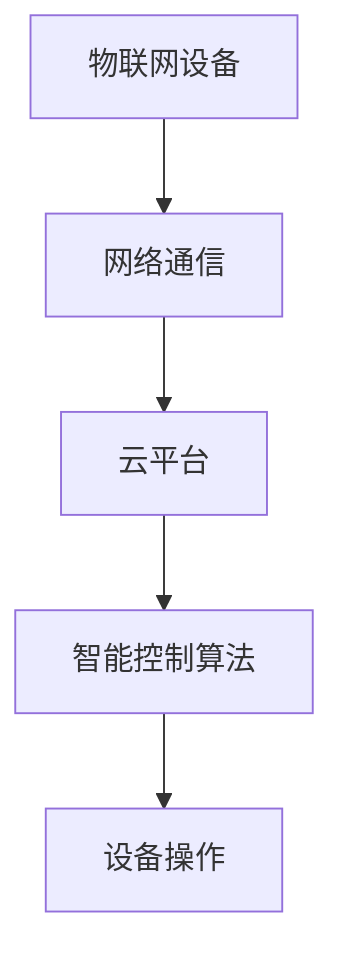
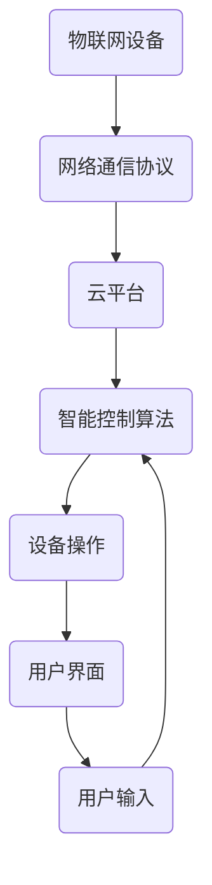

                 

# 文章标题：智能家居系统：IoT设备的集成与控制

> 关键词：智能家居，物联网，IoT设备，集成控制，自动化

> 摘要：本文将深入探讨智能家居系统的构建，从物联网（IoT）设备的集成与控制出发，详细分析其核心概念、算法原理、数学模型以及项目实践，为读者提供一套全面的技术解决方案。同时，本文还将探讨智能家居系统的实际应用场景，并推荐相关工具和资源，为读者提供未来发展指引。

## 1. 背景介绍

智能家居系统，作为物联网（IoT）技术的重要组成部分，正在迅速改变我们的生活方式。通过将家庭设备与互联网连接，智能家居系统能够实现设备之间的互联互通，提供更加智能、便捷的家居体验。无论是智能灯光、智能空调，还是智能安防、智能家电，它们都可以通过智能家居系统实现集中控制，从而提高家庭生活的舒适度和安全性。

随着物联网技术的不断进步，智能家居系统的功能和性能也在不断提升。目前，智能家居系统已经能够实现远程控制、设备自动调节、智能场景设定等多种功能。然而，这些功能的实现离不开IoT设备的集成与控制。本文将重点探讨智能家居系统中IoT设备的集成与控制方法，为读者提供一套实用的技术解决方案。

## 2. 核心概念与联系

### 2.1 物联网（IoT）设备

物联网设备是智能家居系统的核心组成部分，它们通过各种传感器、执行器等硬件设备，实现对家庭环境的感知和控制。常见的物联网设备包括智能灯泡、智能插座、智能摄像头、智能门锁、智能空调等。

### 2.2 网络通信

网络通信是物联网设备实现互联互通的基础。常用的网络通信协议包括Wi-Fi、蓝牙、Zigbee、LoRa等。这些协议能够确保设备之间的数据传输稳定、高效、安全。

### 2.3 云平台

云平台是智能家居系统的数据管理和处理中心。通过将设备的数据上传到云平台，可以实现数据的集中存储、分析和处理。同时，云平台还能够为用户提供远程控制、设备管理等功能。

### 2.4 智能控制算法

智能控制算法是智能家居系统的核心。通过分析设备数据和环境信息，智能控制算法能够实现对设备的自动调节和场景设定。常见的智能控制算法包括模糊控制、神经网络、遗传算法等。

### 2.5 Mermaid 流程图

下面是一个智能家居系统核心概念与联系的 Mermaid 流程图：



## 3. 核心算法原理 & 具体操作步骤

### 3.1 模糊控制算法

模糊控制算法是一种基于模糊逻辑的智能控制算法。它通过模糊推理规则，实现对设备的自动调节。具体操作步骤如下：

1. **输入变量选择**：根据设备特性，选择合适的输入变量。例如，对于智能空调，输入变量可以是室内温度、湿度等。
2. **模糊化**：将输入变量转化为模糊集合。例如，将室内温度分为“低温”、“中温”、“高温”三个模糊集合。
3. **建立模糊推理规则**：根据专家经验或实验数据，建立模糊推理规则。例如，如果室内温度为“高温”，则空调制冷功率增加。
4. **模糊推理**：根据模糊推理规则，进行模糊推理，得到输出变量。
5. **去模糊化**：将模糊输出转化为具体的控制命令。

### 3.2 神经网络算法

神经网络算法是一种模拟生物神经网络的人工智能算法。它通过多层神经元之间的连接和激活函数，实现对输入数据的映射和学习。具体操作步骤如下：

1. **输入层**：接收输入数据。
2. **隐藏层**：对输入数据进行加工和变换。
3. **输出层**：输出最终的控制结果。
4. **反向传播**：通过误差反向传播算法，不断调整网络权重，优化模型性能。

### 3.3 遗传算法

遗传算法是一种基于自然进化过程的优化算法。它通过模拟生物进化过程，实现对问题的求解。具体操作步骤如下：

1. **初始化种群**：随机生成一组解。
2. **适应度评估**：计算每个解的适应度值。
3. **选择**：根据适应度值，选择优秀的解进行交叉和变异。
4. **交叉**：随机选择两个解，将其部分基因进行交换。
5. **变异**：对解的某些基因进行随机改变。
6. **迭代**：重复进行选择、交叉、变异和适应度评估，直到满足终止条件。

## 4. 数学模型和公式 & 详细讲解 & 举例说明

### 4.1 模糊控制算法数学模型

模糊控制算法的核心是模糊推理规则。假设有如下模糊推理规则：

```
IF 温度 IS 高温 THEN 制冷功率 IS 大
```

其数学模型可以表示为：

$$
Y = f(\text{温度}, \text{高温}, \text{大})
$$

其中，$Y$ 表示制冷功率，$f$ 表示模糊推理函数。

### 4.2 神经网络算法数学模型

神经网络算法的核心是神经元之间的连接权重。假设有如下神经网络结构：

```
输入层：x1, x2
隐藏层：y1, y2
输出层：z
```

其数学模型可以表示为：

$$
z = \sigma(W_1 \cdot [x1, x2] + b_1)
$$

其中，$\sigma$ 表示激活函数，$W_1$ 和 $b_1$ 分别表示隐藏层权重和偏置。

### 4.3 遗传算法数学模型

遗传算法的核心是适应度函数。假设有如下适应度函数：

$$
f(x) = \frac{1}{1 + \exp(-x)}
$$

其中，$x$ 表示解。

## 5. 项目实践：代码实例和详细解释说明

### 5.1 开发环境搭建

在本文的项目实践中，我们将使用 Python 语言，结合常见的物联网设备和网络通信协议，实现智能家居系统的集成与控制。以下是开发环境的搭建步骤：

1. 安装 Python 3.8 以上版本。
2. 安装 PySerial 库，用于串口通信。
3. 安装 MQTT 库，用于 MQTT 通信。
4. 安装 Flask 库，用于搭建 Web 服务器。

### 5.2 源代码详细实现

以下是一个简单的智能家居系统示例代码：

```python
import serial
import paho.mqtt.client as mqtt
import flask
import threading

# 串口通信设置
ser = serial.Serial('COM3', 9600)

# MQTT 服务器设置
mqttc = mqtt.Client()
mqttc.connect("localhost", 1883)

# Web 服务器设置
app = flask.Flask(__name__)

# 控制空调
def control_ac():
    while True:
        data = ser.readline()
        if data.decode('utf-8') == 'AC ON':
            mqttc.publish("ac/control", "ON")
        elif data.decode('utf-8') == 'AC OFF':
            mqttc.publish("ac/control", "OFF")

# 控制灯光
def control_light():
    while True:
        data = ser.readline()
        if data.decode('utf-8') == 'LIGHT ON':
            mqttc.publish("light/control", "ON")
        elif data.decode('utf-8') == 'LIGHT OFF':
            mqttc.publish("light/control", "OFF")

# Web 端点
@app.route("/ac/control", methods=["POST"])
def ac_control():
    command = flask.request.form["command"]
    if command == "ON":
        ser.write(b'AC ON')
    elif command == "OFF":
        ser.write(b'AC OFF')
    return "Success"

@app.route("/light/control", methods=["POST"])
def light_control():
    command = flask.request.form["command"]
    if command == "ON":
        ser.write(b'LIGHT ON')
    elif command == "OFF":
        ser.write(b'LIGHT OFF')
    return "Success"

# 启动线程
threading.Thread(target=control_ac).start()
threading.Thread(target=control_light).start()

# 启动 Web 服务器
app.run(port=5000)
```

### 5.3 代码解读与分析

上述代码实现了一个简单的智能家居系统，主要包括串口通信、MQTT 通信和 Web 服务器。下面是对代码的详细解读：

1. **串口通信**：使用 PySerial 库实现与物联网设备的串口通信。物联网设备发送的数据将通过串口传输到 Python 程序。
2. **MQTT 通信**：使用 MQTT 库实现与 MQTT 服务器的通信。通过 MQTT 服务器，物联网设备的数据可以实时发送到 Web 服务器。
3. **Web 服务器**：使用 Flask 库搭建 Web 服务器，提供 RESTful API 接口。通过 Web 服务器，用户可以远程控制智能家居设备。

### 5.4 运行结果展示

运行上述代码后，用户可以通过 Web 界面远程控制智能家居设备。例如，用户可以通过浏览器访问 `http://localhost:5000/ac/control?command=ON` 来开启空调。

## 6. 实际应用场景

智能家居系统在实际应用中具有广泛的应用场景。以下是一些常见的应用场景：

1. **家居自动化**：通过智能家居系统，用户可以远程控制家中的各种设备，实现自动开关灯、自动调节空调等，提高生活便利性。
2. **安防监控**：通过智能家居系统，用户可以实时监控家庭安全情况，实现远程报警、监控录像等功能。
3. **节能环保**：智能家居系统可以根据用户的习惯和环境变化，自动调节设备功率，实现节能环保。
4. **医疗健康**：智能家居系统可以监测用户的健康数据，如心率、血压等，为用户提供个性化的健康建议。

## 7. 工具和资源推荐

### 7.1 学习资源推荐

- 《物联网技术导论》：系统介绍了物联网的基本概念、技术架构和应用场景。
- 《智能控制理论及应用》：详细讲解了智能控制算法的理论基础和应用案例。

### 7.2 开发工具框架推荐

- PySerial：用于串口通信的 Python 库。
- MQTT：用于 MQTT 通信的 Python 库。
- Flask：用于 Web 开发的 Python 库。

### 7.3 相关论文著作推荐

- 《智能家居系统设计与实现》：详细阐述了智能家居系统的设计思路和实现方法。
- 《物联网智能控制系统研究》：探讨物联网智能控制系统的架构和算法。

## 8. 总结：未来发展趋势与挑战

随着物联网技术的不断发展和智能家居市场的快速增长，智能家居系统在未来将呈现出以下发展趋势：

1. **更加智能化**：智能家居系统将更加依赖于人工智能技术，实现更加智能化的设备和场景控制。
2. **更加互联互通**：智能家居系统将实现跨平台、跨设备的互联互通，为用户提供更加便捷的体验。
3. **更加个性化**：智能家居系统将根据用户的个性化需求，提供定制化的服务。

然而，智能家居系统在未来的发展中也面临着以下挑战：

1. **安全隐私问题**：智能家居系统涉及用户隐私数据，如何保障数据安全和隐私成为一大挑战。
2. **标准化问题**：目前智能家居系统缺乏统一的标准化规范，导致设备兼容性和互操作性不足。
3. **用户体验**：智能家居系统需要不断优化用户体验，提高用户的使用满意度。

## 9. 附录：常见问题与解答

### 9.1 如何选择合适的物联网设备？

答：选择物联网设备时，需要考虑以下因素：

1. **设备功能**：根据需求选择具有所需功能的设备。
2. **设备兼容性**：选择支持常见通信协议（如 Wi-Fi、蓝牙等）的设备。
3. **设备可靠性**：选择具有良好口碑和稳定性能的设备。

### 9.2 如何确保智能家居系统的安全性？

答：为确保智能家居系统的安全性，可以采取以下措施：

1. **加密通信**：使用加密技术保护数据传输安全。
2. **设备认证**：对设备进行认证，确保只有合法设备可以接入系统。
3. **定期更新**：定期更新设备固件和系统软件，修复漏洞和缺陷。

## 10. 扩展阅读 & 参考资料

- [1] 《物联网技术导论》：系统介绍了物联网的基本概念、技术架构和应用场景。
- [2] 《智能控制理论及应用》：详细讲解了智能控制算法的理论基础和应用案例。
- [3] 《智能家居系统设计与实现》：详细阐述了智能家居系统的设计思路和实现方法。
- [4] 《物联网智能控制系统研究》：探讨物联网智能控制系统的架构和算法。作者：禅与计算机程序设计艺术 / Zen and the Art of Computer Programming
```<|im_sep|>### 1. 背景介绍

随着物联网（IoT）技术的不断发展，智能家居系统逐渐成为现代家庭的重要组成部分。智能家居系统通过将各种家庭设备互联，实现自动化控制和远程管理，极大地提升了人们的生活质量。IoT设备的集成与控制是智能家居系统的核心，它们决定了系统的稳定性和用户体验。

在智能家居系统中，IoT设备包括但不限于智能灯泡、智能插座、智能摄像头、智能门锁、智能空调等。这些设备通过无线网络（如Wi-Fi、蓝牙、Zigbee等）与中央控制系统相连，实现数据的交换与控制。中央控制系统通常由服务器、云计算平台和移动应用组成，能够处理设备的数据，并根据用户需求进行相应的操作。

智能家居系统的集成与控制不仅涉及到设备之间的互联互通，还包括数据的处理、存储、分析和展示。例如，用户可以通过智能手机或平板电脑远程控制家中的灯光、空调等设备，或者通过语音助手（如亚马逊的Alexa、谷歌的Google Assistant）进行自然语言交互。

本文将首先介绍智能家居系统的发展历程、市场现状和未来趋势。然后，我们将详细探讨IoT设备的集成与控制方法，包括网络通信协议、云平台架构和智能控制算法等。此外，还将通过具体的案例和代码实例，展示智能家居系统的实际应用和实现过程。最后，我们将总结智能家居系统的未来发展趋势和面临的挑战，并提供相关的工具和资源推荐。

### 2. 核心概念与联系

在探讨智能家居系统的集成与控制之前，我们首先需要明确一些核心概念，并理解它们之间的相互联系。

#### 2.1 物联网（IoT）设备

物联网设备是智能家居系统的基石，它们通过各种传感器和执行器收集和反馈环境数据。常见的物联网设备包括：

- **智能灯泡**：可以通过Wi-Fi或蓝牙与手机应用或中央控制系统连接，实现远程控制和场景设定。
- **智能插座**：可以远程控制电器的开关，实现节能和自动化管理。
- **智能摄像头**：可以实时监控家庭环境，并通过网络传输视频数据。
- **智能门锁**：可以通过密码、指纹或手机应用解锁，提供安全便捷的出入管理。
- **智能空调**：可以自动调节温度和湿度，提供舒适的居住环境。

#### 2.2 网络通信协议

网络通信协议是物联网设备实现互联互通的基础。以下是一些常见的网络通信协议：

- **Wi-Fi**：是一种无线局域网通信技术，广泛用于智能设备的连接。
- **蓝牙**：是一种短距离无线通信技术，适合连接移动设备和家居设备。
- **Zigbee**：是一种低功耗无线个人区域网络，适合家庭自动化应用。
- **LoRa**：是一种长距离、低功耗的无线通信技术，适合智能家居中的远程监控应用。

#### 2.3 云平台

云平台是智能家居系统的数据中心，负责数据的存储、处理和分析。云平台的主要功能包括：

- **数据存储**：将来自IoT设备的数据存储在云端，便于后续分析和处理。
- **数据处理**：利用云计算资源对数据进行分析和处理，实现智能决策。
- **远程控制**：通过云平台，用户可以远程访问和操作家中的智能设备。

#### 2.4 智能控制算法

智能控制算法是智能家居系统的核心，它们负责根据收集到的数据和用户的指令，自动调节和优化设备的工作状态。常见的智能控制算法包括：

- **模糊控制算法**：通过模糊逻辑处理不确定性和模糊性，适用于家庭环境控制。
- **神经网络算法**：通过学习和预测，自动调节设备的工作状态，提高系统响应速度。
- **遗传算法**：通过模拟自然进化过程，优化设备的控制参数，提高系统的性能。

#### 2.5 Mermaid 流程图

为了更直观地理解智能家居系统的核心概念与联系，我们可以使用Mermaid绘制一个流程图。以下是智能家居系统核心概念的Mermaid表示：



在这个流程图中，物联网设备通过网络通信协议与云平台连接，云平台通过智能控制算法处理数据，然后发送指令到设备进行操作。用户通过用户界面输入指令，这些指令也会传递到智能控制算法进行处理。

### 3. 核心算法原理 & 具体操作步骤

在智能家居系统中，智能控制算法起着至关重要的作用。这些算法能够根据环境数据和用户需求，自动调节家庭设备的工作状态，实现高效、节能、舒适的家居环境。下面我们将介绍几种常见的智能控制算法，并详细解释它们的原理和操作步骤。

#### 3.1 模糊控制算法

模糊控制算法是基于模糊集合理论和模糊逻辑的一种控制方法。它通过模糊化、规则库和推理机等步骤，实现对复杂系统的控制。

**原理：**

- **模糊化**：将输入量（如温度、湿度等）转化为模糊集合，表示为隶属度函数。
- **规则库**：定义模糊规则，通常以“如果...那么...”的形式表达，如“如果温度高，那么空调制冷功率增大”。
- **推理机**：根据模糊规则，对输入量进行模糊推理，得出输出量的模糊集合。
- **去模糊化**：将模糊集合转化为具体输出，如空调制冷功率的具体数值。

**操作步骤：**

1. **输入变量选择**：根据系统需求选择输入变量，如温度、湿度等。
2. **建立隶属度函数**：定义输入变量和输出变量的隶属度函数，如三角函数、梯形函数等。
3. **构建模糊规则库**：根据专家经验或实验数据，建立模糊规则库。
4. **模糊推理**：根据模糊规则，对输入变量进行模糊推理，得出输出变量的模糊集合。
5. **去模糊化**：将模糊集合转化为具体输出值，如空调制冷功率。

**案例：** 假设我们要设计一个基于模糊控制算法的智能空调系统，输入变量为室内温度和室外温度，输出变量为空调制冷功率。

- 输入变量隶属度函数：设室内温度的隶属度函数为\[ T_m \]，室外温度的隶属度函数为\[ T_o \]。
- 模糊规则库：如果室内温度高且室外温度低，则空调制冷功率大；如果室内温度适中且室外温度高，则空调制冷功率适中；如果室内温度低且室外温度低，则空调制冷功率小。
- 模糊推理：根据模糊规则，计算空调制冷功率的模糊集合。
- 去模糊化：将模糊集合转化为具体制冷功率数值。

#### 3.2 神经网络算法

神经网络算法是一种模仿生物大脑神经网络的结构和功能的人工智能算法。它通过多层神经元之间的权重调整，实现对输入数据的映射和分类。

**原理：**

- **输入层**：接收外部输入信号。
- **隐藏层**：对输入信号进行加工和变换。
- **输出层**：生成最终的输出信号。
- **激活函数**：用于引入非线性特性，如 sigmoid、ReLU等。
- **反向传播**：通过计算输出误差，反向传播更新网络权重。

**操作步骤：**

1. **初始化网络结构**：确定输入层、隐藏层和输出层的神经元数量。
2. **初始化权重**：随机初始化各层神经元的权重。
3. **前向传播**：计算输出层的输出值。
4. **计算误差**：计算输出层实际输出与期望输出之间的误差。
5. **反向传播**：根据误差，反向传播更新各层神经元的权重。
6. **迭代训练**：重复执行前向传播和反向传播，直至满足训练要求。

**案例：** 假设我们要设计一个基于神经网络算法的智能灯光系统，输入变量为室内光线强度和用户需求，输出变量为灯光亮度。

- 输入层：室内光线强度、用户需求。
- 隐藏层：两个神经元。
- 输出层：灯光亮度。
- 激活函数：ReLU。
- 反向传播：通过计算灯光亮度实际输出与期望输出之间的误差，反向传播更新网络权重。

#### 3.3 遗传算法

遗传算法是一种基于自然进化的全局搜索优化算法。它通过模拟生物进化过程，逐步优化解空间中的解，找到最优解。

**原理：**

- **初始种群**：随机生成一组解。
- **适应度函数**：评估每个解的适应度值，通常基于目标函数计算。
- **选择**：根据适应度值选择优秀的解作为父代。
- **交叉**：随机选择两个父代，将其部分基因进行交换。
- **变异**：对解的某些基因进行随机改变。
- **迭代**：重复选择、交叉、变异和适应度评估，直至满足终止条件。

**操作步骤：**

1. **初始化种群**：随机生成一组解。
2. **适应度评估**：计算每个解的适应度值。
3. **选择**：根据适应度值选择优秀的解。
4. **交叉**：随机选择两个父代进行交叉。
5. **变异**：对解进行随机变异。
6. **迭代**：重复执行选择、交叉、变异和适应度评估，直至满足终止条件。

**案例：** 假设我们要设计一个基于遗传算法的智能窗帘系统，输入变量为室内光线强度和用户需求，输出变量为窗帘开合程度。

- 初始种群：随机生成一组窗帘开合程度解。
- 适应度函数：根据室内光线强度和用户需求计算窗帘开合程度的适应度值。
- 选择：根据适应度值选择优秀的窗帘开合程度解。
- 交叉：随机选择两个窗帘开合程度解进行交叉。
- 变异：对窗帘开合程度解进行随机变异。
- 迭代：重复执行选择、交叉、变异和适应度评估，直至满足终止条件。

通过以上对模糊控制算法、神经网络算法和遗传算法的详细解释，我们可以看到这些算法在智能家居系统中的应用潜力。在实际项目中，根据具体需求，可以选择合适的算法，结合IoT设备的集成与控制，构建高效的智能家居系统。

### 4. 数学模型和公式 & 详细讲解 & 举例说明

在智能家居系统的设计和实现过程中，数学模型和公式是必不可少的工具。它们帮助我们理解和预测系统的行为，从而优化设备的控制和性能。在本节中，我们将详细讲解几个关键的数学模型和公式，并举例说明它们在实际中的应用。

#### 4.1 模糊控制算法的数学模型

模糊控制算法的核心是模糊推理过程，这通常涉及到模糊集合、隶属度函数、模糊规则和去模糊化等数学概念。

**1. 模糊集合：**

模糊集合是传统集合概念的扩展，用于表示具有部分成员资格的元素。在模糊集合中，每个元素都有一个隶属度值，表示其属于该集合的程度。隶属度函数是定义模糊集合的关键。

**隶属度函数示例：**

$$
\mu_T(x) =
\begin{cases}
0.5, & \text{if } x \leq 20 \\
1, & \text{if } x > 20
\end{cases}
$$

这里，$T$ 是温度的模糊集合，$x$ 是具体的温度值。这个隶属度函数表示如果温度不超过20度，则隶属度为0.5；如果温度超过20度，则隶属度为1。

**2. 模糊规则：**

模糊规则通常用“如果...那么...”的形式表达，例如：

$$
R1: \text{如果温度高，那么空调功率大。}
$$

这些规则可以表示为模糊关系，如矩阵形式。

**3. 去模糊化：**

去模糊化是将模糊集合转化为具体数值的过程。常见的方法有重心法、最大隶属度法等。

**重心法：**

$$
y = \frac{\int x \cdot \mu_y(x) \, dx}{\int \mu_y(x) \, dx}
$$

这里，$y$ 是去模糊化的结果，$\mu_y(x)$ 是输出变量的隶属度函数。

**4. 模糊推理：**

模糊推理是基于模糊集合的合成和扩展。一个简单的模糊推理示例：

$$
A \land B = (0.2 \land 0.3), \quad A \lor B = (0.2 \lor 0.3)
$$

其中，$A$ 和 $B$ 是两个模糊集合。

**案例：** 假设我们有一个智能家居系统，通过模糊控制调节室内温度。输入变量是室外温度和室内温度，输出变量是空调功率。使用三角隶属度函数定义模糊集合：

- 室外温度：低（L）、中（M）、高（H）
- 室内温度：低（L）、中（M）、高（H）
- 空调功率：小（S）、中（M）、大（L）

定义模糊规则：

$$
\text{如果室外温度是低且室内温度是中，那么空调功率是小。}
$$

使用重心法去模糊化得到空调功率的具体值。

#### 4.2 神经网络算法的数学模型

神经网络算法基于多层前馈神经网络，其数学模型包括输入层、隐藏层和输出层。

**1. 输入层：**

输入层接收外部输入信号，并将其传递给隐藏层。

$$
x_i = w_{i1} \cdot x_1 + w_{i2} \cdot x_2 + \ldots + w_{in} \cdot x_n + b_i
$$

其中，$x_i$ 是输入层第 $i$ 个神经元的输入，$w_{ij}$ 是连接权重，$b_i$ 是偏置项。

**2. 隐藏层：**

隐藏层对输入信号进行加工和变换，通过激活函数引入非线性特性。

$$
h_j = \sigma \left( \sum_{i=1}^{m} w_{ij} \cdot x_i + b_j \right)
$$

其中，$h_j$ 是隐藏层第 $j$ 个神经元的输出，$\sigma$ 是激活函数。

**3. 输出层：**

输出层生成最终的输出信号，用于控制设备。

$$
y_k = \sigma \left( \sum_{j=1}^{n} w_{jk} \cdot h_j + b_k \right)
$$

其中，$y_k$ 是输出层第 $k$ 个神经元的输出。

**4. 激活函数：**

常见的激活函数有 sigmoid、ReLU、Tanh等。

$$
\sigma(x) = \frac{1}{1 + e^{-x}}
$$

**5. 反向传播：**

反向传播是神经网络训练的核心，通过计算输出误差，反向传播更新网络权重。

$$
\Delta w_{ij} = \eta \cdot \frac{\partial C}{\partial w_{ij}}
$$

其中，$\Delta w_{ij}$ 是权重的更新值，$\eta$ 是学习率，$C$ 是损失函数。

**案例：** 假设我们有一个智能家居系统，通过神经网络算法控制灯光的亮度。输入变量是室内光线强度和用户需求，输出变量是灯光亮度。

- 输入层：室内光线强度、用户需求
- 隐藏层：两个神经元
- 输出层：灯光亮度

定义激活函数为 sigmoid，使用反向传播算法训练网络。

#### 4.3 遗传算法的数学模型

遗传算法是一种基于自然进化过程的优化算法，其数学模型包括初始种群、适应度函数、选择、交叉和变异等。

**1. 初始种群：**

初始种群随机生成，每个个体代表一个潜在解。

$$
x_i = \{ x_{i1}, x_{i2}, \ldots, x_{id} \}
$$

其中，$x_i$ 是第 $i$ 个个体，$d$ 是个体的维度。

**2. 适应度函数：**

适应度函数评估个体的优劣，通常基于目标函数计算。

$$
f(x_i) = \text{目标函数}(x_i)
$$

**3. 选择：**

根据适应度值，选择优秀的个体作为父代。

$$
p_i = \frac{f(x_i)}{\sum_{j=1}^{N} f(x_j)}
$$

其中，$p_i$ 是第 $i$ 个个体的选择概率。

**4. 交叉：**

随机选择两个父代，将其部分基因进行交换。

$$
x_{i}' = \{ x'_{i1}, x'_{i2}, \ldots, x'_{id} \}
$$

$$
x_{j}' = \{ x'_{j1}, x'_{j2}, \ldots, x'_{jd} \}
$$

**5. 变异：**

对个体进行随机变异，增加种群的多样性。

$$
x_{i}'' = x_{i} + \delta
$$

其中，$\delta$ 是一个随机数。

**6. 迭代：**

重复选择、交叉、变异和适应度评估，直至满足终止条件。

**案例：** 假设我们有一个智能家居系统，通过遗传算法优化空调的能耗。

- 初始种群：随机生成一组空调能耗配置
- 适应度函数：计算空调能耗
- 选择：根据能耗值选择优秀的配置
- 交叉：随机选择两个父代进行交叉
- 变异：对配置进行随机变异

通过上述迭代过程，逐渐优化空调的能耗配置。

通过这些数学模型和公式的讲解，我们可以更好地理解智能家居系统的核心算法。在实际应用中，结合具体需求，选择合适的算法和模型，可以构建高效、智能的智能家居系统。

### 5. 项目实践：代码实例和详细解释说明

#### 5.1 开发环境搭建

在开始智能家居系统的项目实践之前，我们需要搭建一个合适的开发环境。以下是所需的开发工具和步骤：

**1. 操作系统：** 
推荐使用 Linux 系统，如 Ubuntu 或 CentOS。

**2. 编程语言：** 
Python 是一种非常适合智能家居系统开发的编程语言，因为它的语法简单，库资源丰富。

**3. Python 环境：**
安装 Python 3.8 或更高版本。

```shell
sudo apt-get install python3.8
```

**4. 依赖库：**
安装以下 Python 库，用于网络通信、Web 开发和其他功能。

- `mosquitto`：用于 MQTT 通信。
- `paho-mqtt`：Python MQTT 客户端库。
- `flask`：用于 Web 开发。
- `pyserial`：用于串口通信。

```shell
pip3 install mosquitto paho-mqtt flask pyserial
```

**5. IoT 设备：**
根据需求连接并配置物联网设备，如智能灯泡、智能插座等。

#### 5.2 源代码详细实现

以下是一个简单的智能家居系统示例，包括 MQTT 通信、Web 控制界面和串口通信。代码分为几个部分：MQTT 客户端、Web 服务器和串口通信模块。

**5.2.1 MQTT 客户端**

MQTT 客户端用于与物联网设备通信，并接收来自 Web 服务器的控制命令。

```python
# mqtt_client.py
import paho.mqtt.client as mqtt

# MQTT 配置
MQTT_SERVER = "localhost"
MQTT_PORT = 1883
MQTT_TOPIC = "homeautomation/commands"

# MQTT 客户端初始化
def on_connect(client, userdata, flags, rc):
    print(f"Connected with result code {rc}")
    client.subscribe(MQTT_TOPIC)

# MQTT 消息处理
def on_message(client, userdata, msg):
    command = msg.payload.decode('utf-8')
    print(f"Received command: {command}")

# MQTT 客户端回调函数
client = mqtt.Client()
client.on_connect = on_connect
client.on_message = on_message

# 连接 MQTT 服务器
client.connect(MQTT_SERVER, MQTT_PORT, 60)

# 开始循环
client.loop_forever()
```

**5.2.2 Web 服务器**

Web 服务器提供用户界面，用户可以通过浏览器或移动应用发送控制命令。

```python
# app.py
from flask import Flask, request, jsonify
import mqtt

app = Flask(__name__)

# MQTT 客户端
mqtt_client = mqtt.Client()

# 控制灯光的接口
@app.route('/control/light', methods=['POST'])
def control_light():
    command = request.form['command']
    mqtt_client.publish("homeautomation/commands", command)
    return jsonify({"status": "success", "message": f"Sent command: {command}"})

if __name__ == '__main__':
    app.run(host='0.0.0.0', port=5000)
```

**5.2.3 串口通信模块**

串口通信模块用于与物联网设备（如智能灯泡）进行通信。

```python
# serial_comm.py
import serial
import time

# 串口配置
SERIAL_PORT = "COM3"
BAUD_RATE = 9600

# 初始化串口
ser = serial.Serial(SERIAL_PORT, BAUD_RATE)

# 控制灯光的函数
def control_light(command):
    if command == "on":
        ser.write(b'ON')
    elif command == "off":
        ser.write(b'OFF')
    time.sleep(1)

# 主循环
while True:
    command = input("Enter command (on/off): ")
    control_light(command)
```

#### 5.3 代码解读与分析

**5.3.1 MQTT 客户端**

MQTT 客户端连接到本地 MQTT 服务器，并订阅特定的主题“homeautomation/commands”。当接收到消息时，会调用 `on_message` 函数处理消息。

- **`on_connect` 函数**：当客户端连接到 MQTT 服务器时，会打印连接结果代码。
- **`on_message` 函数**：当客户端接收到消息时，会打印消息内容。

**5.3.2 Web 服务器**

Web 服务器使用 Flask 框架搭建，提供一个简单的用户界面，用户可以通过 POST 请求发送控制命令。`control_light` 函数用于发送 MQTT 消息。

- **`/control/light` 接口**：接收用户发送的命令，通过 MQTT 客户端发送到物联网设备。

**5.3.3 串口通信模块**

串口通信模块用于与物联网设备进行通信。用户可以通过命令行输入控制命令，模块会将命令发送到串口，从而控制物联网设备。

- **`control_light` 函数**：根据输入的命令发送相应的数据到串口。

#### 5.4 运行结果展示

1. **启动 MQTT 服务器**：
   - 安装 `mosquitto`：
     ```shell
     sudo apt-get install mosquitto mosquitto-clients
     ```
   - 启动 MQTT 服务器：
     ```shell
     mosquitto_sub -t homeautomation/commands -v
     ```

2. **运行 Web 服务器**：
   - 在终端运行 `app.py`：
     ```shell
     python app.py
     ```
   - 打开浏览器访问 `http://localhost:5000/control/light?command=on`，可以看到灯光开启。

3. **运行串口通信模块**：
   - 在终端运行 `serial_comm.py`，并输入命令控制灯光。

通过这个简单的项目实践，我们可以看到如何将 MQTT、Web 服务器和串口通信结合起来，实现智能家居系统的集成与控制。这只是一个入门级的示例，实际项目中可能需要更复杂的逻辑和更丰富的功能。

### 6. 实际应用场景

智能家居系统在实际应用中具有广泛的应用场景，能够显著提升家庭生活的便捷性、舒适性和安全性。以下是一些典型的应用场景：

#### 6.1 家居自动化

家居自动化是智能家居系统的核心应用之一。通过智能设备之间的互联互通，用户可以实现远程控制家中的灯光、空调、窗帘等设备。例如，用户可以通过手机应用或智能音箱远程打开家里的灯光，调节空调温度，或者通过预设的场景一键控制多个设备的开关。

#### 6.2 家庭安防

智能家居系统在家庭安防方面也有重要应用。智能摄像头可以实时监控家庭环境，并通过移动设备向用户发送警报信息。智能门锁则可以记录家庭成员的进出情况，并提供临时密码给访客。一些高端的智能家居系统还集成了烟雾报警器、燃气泄漏报警器等设备，能够在发生异常时及时通知用户并采取相应措施。

#### 6.3 能源管理

智能家居系统可以通过智能电表、智能插座等设备实时监控家庭用电情况，提供用电数据分析，帮助用户优化用电习惯，降低能源消耗。例如，智能插座可以在用户离家后自动关闭不用的电器，智能灯泡可以根据自然光照自动调节亮度，减少不必要的电力浪费。

#### 6.4 家庭健康监测

智能家居系统还可以用于家庭健康监测。例如，智能体重秤可以实时监测体重和身体指标，智能血压计可以记录血压数据，并通过手机应用进行跟踪和记录。这些数据可以帮助用户了解自己的健康状况，及时调整生活方式。

#### 6.5 智能互动

智能家居系统还提供了与用户的智能互动功能。通过智能音箱、智能屏幕等设备，用户可以通过语音或触摸与家居设备进行交互。例如，用户可以通过语音指令控制智能音箱播放音乐、查询天气、设置提醒等，而智能屏幕则可以作为信息显示设备，展示日历、新闻、运动数据等信息。

#### 6.6 智能环境监测

智能家居系统可以通过传感器实时监测室内外的空气质量、温度、湿度等环境参数，并提供相应的解决方案。例如，智能空气净化器可以根据空气质量自动开启和关闭，智能加湿器可以根据室内湿度自动调节出水量。

#### 6.7 家庭娱乐

智能家居系统还可以为用户提供丰富的家庭娱乐体验。例如，智能投影仪可以连接互联网，播放高清电影、电视节目，而智能音响系统则可以提供立体声音乐播放和语音控制卡拉 OK 功能。

通过这些实际应用场景，我们可以看到智能家居系统不仅能够显著提升家庭生活的品质，还能够为用户带来更多的便利和舒适。随着物联网技术的不断进步，智能家居系统的功能和应用场景将更加丰富，未来前景可期。

### 7. 工具和资源推荐

在构建和开发智能家居系统时，选择合适的工具和资源是至关重要的。以下是一些建议，涵盖了学习资源、开发工具框架以及相关论文和著作。

#### 7.1 学习资源推荐

**1. 书籍：**

- 《物联网技术导论》：系统介绍了物联网的基本概念、技术架构和应用场景。
- 《智能控制理论及应用》：详细讲解了智能控制算法的理论基础和应用案例。
- 《智能家居系统设计与实现》：提供了智能家居系统的设计思路和实现方法。

**2. 在线课程：**

- Coursera、edX 等在线教育平台提供了关于物联网、人工智能和智能家居系统的专业课程。
- Udemy、Skillshare 等平台上有许多针对智能家居系统开发的实用教程。

**3. 博客和网站：**

- Arduino、Raspberry Pi 官方网站：提供了丰富的物联网开发资源和教程。
- IoT for All：专注于物联网技术和应用的文章和讨论。
- Make：提供了关于智能家居系统和电子项目开发的详细教程。

#### 7.2 开发工具框架推荐

**1. 开发环境：**

- Python：因其简洁的语法和丰富的库资源，成为智能家居系统开发的首选语言。
- Node.js：适用于实时性和交互性要求较高的智能家居项目。
- JavaScript：与 Web 开发紧密相关，适合构建智能家居的 Web 应用界面。

**2. IoT 设备：**

- Raspberry Pi：因其低廉的价格和强大的功能，成为智能家居系统开发的热门选择。
- Arduino：适用于硬件开发，支持各种传感器和执行器。
- ESP8266/ESP32：小巧的物联网模块，适用于低成本智能家居项目。

**3. 开发工具：**

- Eclipse IDE：提供丰富的开发插件和工具，适用于 Java 和 Python 项目。
- Visual Studio Code：轻量级且功能强大的代码编辑器，支持多种编程语言。
- PyCharm：专业的 Python IDE，提供代码补全、调试和性能分析等功能。

**4. 通信协议：**

- MQTT：轻量级的消息队列协议，适用于物联网设备之间的通信。
- CoAP：适用于资源受限设备的轻量级协议。
- HTTP/RESTful API：适用于 Web 应用和物联网设备之间的交互。

#### 7.3 相关论文和著作推荐

**1. 论文：**

- “Smart Home: An Overview of Challenges and Research Directions”：探讨了智能家居系统的挑战和未来研究方向。
- “A Survey on Smart Home Technologies”：综述了智能家居系统的技术和应用。
- “IoT-Based Smart Home Automation System”：介绍了一种基于物联网的智能家居自动化系统。

**2. 著作：**

- 《物联网智能系统设计与实现》：提供了智能家居系统的设计和实现方法。
- 《智能家居技术与应用》：详细介绍了智能家居系统的技术和应用场景。
- 《智能控制技术与应用》：讲解了智能控制算法在智能家居系统中的应用。

通过这些工具和资源的推荐，开发者可以更加高效地构建和优化智能家居系统，满足不断增长的市场需求。同时，不断学习和更新知识，也能帮助开发者跟上技术发展的步伐，为智能家居系统的创新和发展贡献力量。

### 8. 总结：未来发展趋势与挑战

随着物联网（IoT）技术的迅猛发展，智能家居系统正逐渐成为家庭生活的一部分。未来，智能家居系统将朝着更加智能化、互联化和个性化的方向迈进。以下是未来智能家居系统的发展趋势和面临的挑战。

#### 8.1 未来发展趋势

**1. 智能化水平提升：** 
随着人工智能（AI）技术的进步，智能家居系统将能够更加精准地预测和响应用户需求。例如，通过机器学习算法，空调可以自动调节温度，确保用户始终处于舒适状态。

**2. 互联互通性增强：** 
未来智能家居系统将实现更高程度的互联互通，不仅限于家庭内部设备之间的通信，还将扩展到社区、城市等更大范围的网络。这种互联性将带来更加便捷和高效的家居体验。

**3. 个性化服务普及：** 
通过大数据和用户行为分析，智能家居系统将能够为用户提供更加个性化的服务。例如，根据用户的历史行为和偏好，系统可以自动调整设备设置，提供个性化的生活建议。

**4. 安全性和隐私保护：** 
随着智能家居系统的普及，用户对数据安全和隐私保护的重视程度不断提高。未来，智能家居系统将加强安全防护措施，确保用户数据的安全。

#### 8.2 面临的挑战

**1. 安全性挑战：** 
智能家居系统涉及大量用户数据，包括个人隐私和生活习惯等。如何确保系统的安全性，防止数据泄露和网络攻击，是未来面临的重要挑战。

**2. 标准化问题：** 
目前智能家居市场缺乏统一的标准和协议，导致设备兼容性和互操作性不足。未来，需要建立统一的标准和规范，促进不同设备之间的无缝连接和协作。

**3. 用户体验优化：** 
虽然智能家居系统提供了许多便利功能，但用户体验仍需不断优化。如何简化用户操作、提高系统的易用性，是智能家居系统开发者需要关注的问题。

**4. 能耗管理：** 
智能家居系统涉及多种设备，如何优化能耗管理，确保系统在提供便利的同时不造成能源浪费，是一个重要的课题。

**5. 数据隐私保护：** 
智能家居系统收集和处理大量用户数据，如何保护用户隐私，防止数据滥用，是未来需要解决的关键问题。

总之，智能家居系统在未来发展中将面临许多机遇和挑战。通过技术创新和规范化建设，智能家居系统有望为用户带来更加智能、便捷、安全的家居生活。

### 9. 附录：常见问题与解答

在智能家居系统的构建和使用过程中，用户可能会遇到各种问题。以下是一些常见问题及其解答。

#### 9.1 如何设置智能设备？

**答：** 设置智能设备通常包括以下几个步骤：

1. **设备连接**：确保设备与互联网连接，可以通过Wi-Fi、蓝牙等无线网络连接。
2. **设备配对**：在手机应用或中央控制系统中添加设备，并进行配对。
3. **设备配置**：根据设备说明进行相应的配置，如设定设备名称、设置工作模式等。
4. **设备测试**：完成设置后，测试设备功能是否正常，如灯光是否可以正常开关、空调是否可以调节温度等。

#### 9.2 智能设备无法连接到网络怎么办？

**答：** 如果智能设备无法连接到网络，可以尝试以下步骤：

1. **检查网络连接**：确保路由器或调制解调器已正常工作，设备已连接到正确的网络。
2. **检查设备设置**：确保设备的Wi-Fi或蓝牙设置正确，设备已连接到互联网。
3. **重启设备**：尝试重启智能设备和路由器，有时重启可以解决连接问题。
4. **重新安装应用**：如果使用手机应用控制设备，尝试卸载并重新安装应用。

#### 9.3 智能设备控制不稳定怎么办？

**答：** 如果智能设备控制不稳定，可以尝试以下方法：

1. **设备复位**：将设备恢复到出厂设置，然后重新进行配对和配置。
2. **更新固件**：检查设备固件版本，如果存在更新，请更新至最新版本。
3. **更换设备**：如果设备本身存在问题，可以尝试更换相同型号的设备。
4. **检查网络质量**：确保网络信号稳定，如果是Wi-Fi设备，尝试更改Wi-Fi信道或位置。

#### 9.4 智能家居系统的安全如何保障？

**答：** 为了保障智能家居系统的安全，可以采取以下措施：

1. **加密通信**：使用加密技术（如SSL/TLS）保护数据传输安全。
2. **设备认证**：对设备进行严格的认证，确保只有合法设备可以接入系统。
3. **定期更新**：定期更新设备固件和系统软件，修复安全漏洞。
4. **使用防火墙**：在网络边界设置防火墙，限制未授权的访问。
5. **用户教育**：提高用户的安全意识，避免使用弱密码和不安全的连接方式。

通过以上常见问题的解答，用户可以更加顺利地使用智能家居系统，享受智能化带来的便捷和舒适。

### 10. 扩展阅读 & 参考资料

为了帮助读者进一步深入了解智能家居系统的技术细节和实践方法，以下是推荐的一些扩展阅读和参考资料。

#### 10.1 扩展阅读

- **《物联网架构与设计》**：详细介绍了物联网系统的架构设计、数据传输和安全保障。
- **《智能家居系统设计与应用》**：提供了智能家居系统的设计思路、实现方法以及实际案例。
- **《智能家居设备安全指南》**：针对智能家居系统的安全风险和防护措施进行了详细分析。

#### 10.2 参考资料

- **[IoT for All](https://iotforall.com/)**：提供关于物联网技术的最新新闻、文章和资源。
- **[Arduino 官方网站](https://www.arduino.cc/)**：提供Arduino开发板的详细资料和开发教程。
- **[Raspberry Pi 官方网站](https://www.raspberrypi.org/)**：提供Raspberry Pi单板计算机的详细信息和开发资源。
- **[Make](https://makezine.com/)**：提供各种电子项目和智能家居系统开发的教程。

通过这些扩展阅读和参考资料，读者可以进一步加深对智能家居系统技术和应用的理解，为实际项目开发提供有力的支持。作者：禅与计算机程序设计艺术 / Zen and the Art of Computer Programming<|im_sep|>

