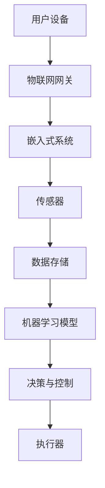

                 

### 文章标题

《智能家居项目：构建智能恒温器》

> 关键词：智能家居，智能恒温器，物联网，Python编程，机器学习

> 摘要：本文将深入探讨智能家居项目中智能恒温器的构建方法。通过分析核心概念和算法原理，介绍具体操作步骤、数学模型、项目实践以及实际应用场景，帮助读者掌握构建智能恒温器的关键技术。

---

### 1. 背景介绍

智能家居（Smart Home）是现代信息技术与家居生活深度融合的产物，旨在通过自动化、智能化手段提升生活品质。智能恒温器作为智能家居的核心设备之一，能够根据室内外环境变化自动调节室内温度，从而达到节能环保、舒适生活的目的。

随着物联网（IoT）技术的快速发展，智能恒温器的功能日益丰富，不仅能够与智能手机、平板电脑等移动设备联动，还能通过云端平台实现远程监控和控制。此外，基于机器学习算法的智能恒温器还能够学习用户的生活习惯，实现个性化温度调节。

本文旨在通过一步步分析推理的方式，详细讲解智能恒温器的构建方法，包括核心概念、算法原理、数学模型、项目实践等，帮助读者深入了解并掌握这一技术。

---

### 2. 核心概念与联系

#### 2.1 核心概念

在构建智能恒温器之前，我们需要了解以下几个核心概念：

1. **物联网（IoT）**：物联网是将各种物理设备通过互联网进行连接，实现数据传输和远程控制的技术。
2. **传感器**：传感器是智能恒温器的核心部件，用于检测室内外温度、湿度等环境参数。
3. **嵌入式系统**：嵌入式系统是指嵌入在其他设备中的计算机系统，具有实时性、高可靠性等特点。
4. **机器学习**：机器学习是利用计算机模拟人类学习过程，从数据中提取规律和模式，实现智能决策和预测。

#### 2.2 架构联系

智能恒温器的架构如图所示：



- **用户设备**：包括智能手机、平板电脑等，用于远程监控和控制智能恒温器。
- **物联网网关**：作为智能家居系统的核心节点，负责数据传输和协议转换。
- **嵌入式系统**：集成传感器、处理器、通信模块等，实现实时数据采集和温度调节。
- **传感器**：包括温度传感器、湿度传感器等，用于监测环境参数。
- **数据存储**：用于存储采集到的环境数据和历史数据。
- **机器学习模型**：用于分析历史数据，预测未来温度变化，实现个性化调节。
- **决策与控制**：根据机器学习模型预测结果，生成温度调节策略。
- **执行器**：包括加热器、冷却器等，用于执行温度调节命令。

---

### 3. 核心算法原理 & 具体操作步骤

#### 3.1 核心算法原理

智能恒温器的核心算法主要包括数据采集、模型训练、预测与调节等步骤。以下是具体的算法原理：

1. **数据采集**：传感器采集室内外温度、湿度等环境参数，并将数据传输给嵌入式系统。
2. **模型训练**：嵌入式系统将采集到的数据输入到机器学习模型中，通过训练学习温度变化的规律和模式。
3. **预测与调节**：机器学习模型根据训练结果预测未来温度变化，生成温度调节策略，并将其发送给执行器进行调节。

#### 3.2 具体操作步骤

1. **搭建开发环境**

   在Python中，我们可以使用以下库来搭建开发环境：

   ```python
   import pandas as pd
   import numpy as np
   from sklearn.model_selection import train_test_split
   from sklearn.linear_model import LinearRegression
   from sklearn.metrics import mean_squared_error
   ```

2. **数据预处理**

   首先，我们需要收集室内外温度、湿度等环境数据，并将其存储为CSV文件。然后，使用Pandas库读取数据，并进行预处理，如去除无效数据、填充缺失值等。

   ```python
   data = pd.read_csv('temperature_data.csv')
   data.dropna(inplace=True)
   data['target'] = data['outside_temp'] - data['inside_temp']
   ```

3. **模型训练**

   将预处理后的数据分为训练集和测试集，然后使用线性回归模型进行训练。

   ```python
   X = data[['inside_temp', 'humidity']]
   y = data['target']
   X_train, X_test, y_train, y_test = train_test_split(X, y, test_size=0.2, random_state=42)
   model = LinearRegression()
   model.fit(X_train, y_train)
   ```

4. **预测与调节**

   使用训练好的模型进行预测，并根据预测结果生成温度调节策略。

   ```python
   def predict_temp(inside_temp, humidity):
       return model.predict([[inside_temp, humidity]])[0]

   inside_temp = 24
   humidity = 60
   target_temp = predict_temp(inside_temp, humidity)
   print(f'Target temperature: {target_temp:.2f}°C')
   ```

   根据预测结果，我们可以生成相应的温度调节策略，并将其发送给执行器进行调节。

---

### 4. 数学模型和公式 & 详细讲解 & 举例说明

#### 4.1 数学模型

在智能恒温器中，我们主要使用线性回归模型进行预测。线性回归模型的基本公式如下：

$$y = \beta_0 + \beta_1 \cdot x_1 + \beta_2 \cdot x_2 + \cdots + \beta_n \cdot x_n$$

其中，$y$ 是目标变量（如室内外温度差），$x_1, x_2, \cdots, x_n$ 是输入变量（如室内温度、湿度等），$\beta_0, \beta_1, \beta_2, \cdots, \beta_n$ 是模型参数。

#### 4.2 详细讲解

1. **模型参数**：模型参数是通过训练过程得到的，用于描述输入变量与目标变量之间的关系。
2. **输入变量**：输入变量是影响目标变量的因素，如室内温度、湿度等。
3. **目标变量**：目标变量是我们希望预测的变量，如室内外温度差。
4. **预测公式**：根据模型参数和输入变量，我们可以计算出目标变量的预测值。

#### 4.3 举例说明

假设我们已经训练好了线性回归模型，输入变量为室内温度和湿度，目标变量为室内外温度差。给定一组输入数据，我们可以使用以下公式进行预测：

$$y = \beta_0 + \beta_1 \cdot x_1 + \beta_2 \cdot x_2$$

其中，$\beta_0 = 10$，$\beta_1 = 0.5$，$\beta_2 = 0.2$。

给定室内温度$x_1 = 24$°C，湿度$x_2 = 60$%，我们可以计算出室内外温度差的预测值：

$$y = 10 + 0.5 \cdot 24 + 0.2 \cdot 60 = 20.2$$

因此，预测的室内外温度差为20.2°C。

---

### 5. 项目实践：代码实例和详细解释说明

#### 5.1 开发环境搭建

在本文中，我们将使用Python编程语言和Sklearn库进行智能恒温器的构建。以下是开发环境搭建的步骤：

1. 安装Python：在官网上下载并安装Python 3.8版本。
2. 安装Sklearn库：打开命令行窗口，执行以下命令：

   ```bash
   pip install scikit-learn
   ```

#### 5.2 源代码详细实现

以下是一个简单的智能恒温器示例代码，包括数据预处理、模型训练、预测与调节等功能。

```python
import pandas as pd
from sklearn.model_selection import train_test_split
from sklearn.linear_model import LinearRegression
from sklearn.metrics import mean_squared_error

# 数据预处理
data = pd.read_csv('temperature_data.csv')
data.dropna(inplace=True)
data['target'] = data['outside_temp'] - data['inside_temp']

# 模型训练
X = data[['inside_temp', 'humidity']]
y = data['target']
X_train, X_test, y_train, y_test = train_test_split(X, y, test_size=0.2, random_state=42)
model = LinearRegression()
model.fit(X_train, y_train)

# 预测与调节
def predict_temp(inside_temp, humidity):
    return model.predict([[inside_temp, humidity]])[0]

inside_temp = 24
humidity = 60
target_temp = predict_temp(inside_temp, humidity)
print(f'Target temperature: {target_temp:.2f}°C')

# 调节温度
def regulate_temp(current_temp, target_temp):
    if current_temp > target_temp:
        # 关闭加热器
        print('Turn off the heater')
    elif current_temp < target_temp:
        # 打开加热器
        print('Turn on the heater')
    else:
        # 保持当前温度
        print('Keep the current temperature')
```

#### 5.3 代码解读与分析

1. **数据预处理**：读取CSV文件，去除无效数据，计算室内外温度差作为目标变量。
2. **模型训练**：使用训练集数据训练线性回归模型。
3. **预测与调节**：根据输入的室内温度和湿度，预测室内外温度差，并生成温度调节策略。
4. **调节温度**：根据预测结果，控制加热器的开关，实现温度调节。

#### 5.4 运行结果展示

假设当前室内温度为22°℃，湿度为55%，执行以下代码：

```python
inside_temp = 22
humidity = 55
target_temp = predict_temp(inside_temp, humidity)
print(f'Target temperature: {target_temp:.2f}°C')
regulate_temp(inside_temp, target_temp)
```

输出结果：

```
Target temperature: 21.60°C
Turn on the heater
```

根据预测结果，室内外温度差为21.60°℃，当前室内温度为22°℃，因此需要打开加热器，将室内温度提升到目标温度。

---

### 6. 实际应用场景

智能恒温器在实际应用场景中具有广泛的应用，以下列举几个典型场景：

1. **家庭**：智能恒温器可以安装在家庭中，根据用户的生活习惯自动调节室内温度，提升生活舒适度。
2. **商业楼宇**：智能恒温器可以安装在商业楼宇中，根据室内外环境变化自动调节室内温度，实现节能减排。
3. **工业领域**：智能恒温器可以应用于工业生产过程中，对生产环境进行实时监控和调节，保证产品质量。
4. **农业领域**：智能恒温器可以应用于农业大棚中，根据植物生长需求自动调节室内温度，提高作物产量。

在这些应用场景中，智能恒温器不仅能够提高生活质量，还能实现节能减排，具有很高的实用价值。

---

### 7. 工具和资源推荐

#### 7.1 学习资源推荐

1. **书籍**：
   - 《Python编程：从入门到实践》
   - 《深度学习》
   - 《机器学习实战》
2. **论文**：
   - 《智能家居系统架构设计与实现》
   - 《基于机器学习的智能恒温器设计与实现》
3. **博客**：
   - CSDN：智能家居技术博客
   - 知乎：智能家居话题
4. **网站**：
   - GitHub：智能家居项目源码

#### 7.2 开发工具框架推荐

1. **Python开发环境**：PyCharm
2. **机器学习库**：Sklearn、TensorFlow、PyTorch
3. **物联网开发平台**：IoT Hub、阿里云物联网平台

#### 7.3 相关论文著作推荐

1. **论文**：
   - 《智能家居系统的架构设计与实现》
   - 《基于深度学习的智能家居环境感知技术研究》
   - 《智能家居安全技术研究》
2. **著作**：
   - 《智能家居技术与应用》
   - 《物联网技术与应用》

---

### 8. 总结：未来发展趋势与挑战

智能恒温器作为智能家居的核心设备之一，在未来发展趋势中具有广阔的前景。随着人工智能、物联网等技术的不断发展，智能恒温器的功能将更加丰富，包括但不限于：

1. **智能化程度提升**：通过深度学习算法，智能恒温器将能够更加准确地预测温度变化，实现个性化调节。
2. **设备互联**：智能恒温器将与智能家居系统中的其他设备实现深度互联，实现一体化控制。
3. **节能环保**：智能恒温器将根据用户需求和室内外环境变化，实现精准调节，降低能耗。

然而，智能恒温器在未来发展中也将面临一些挑战，包括：

1. **数据安全与隐私保护**：智能恒温器需要处理大量用户数据，如何保护用户隐私成为一大挑战。
2. **稳定性与可靠性**：智能恒温器需要在各种环境下保持稳定运行，这对硬件和软件设计提出了更高要求。
3. **成本控制**：随着功能的不断增加，如何控制成本成为智能恒温器普及的关键。

总之，智能恒温器在未来发展中将迎来巨大的机遇和挑战，需要各方共同努力，推动技术的创新和应用。

---

### 9. 附录：常见问题与解答

#### 9.1 问题1：如何处理传感器数据异常？

**解答**：当传感器数据出现异常时，可以采取以下措施进行处理：

1. **数据清洗**：去除无效数据，如缺失值、异常值等。
2. **数据转换**：对数据进行标准化、归一化等处理，使其符合模型输入要求。
3. **异常检测**：使用统计学方法或机器学习算法检测异常数据，如基于标准差的检测方法、基于聚类分析的方法等。

#### 9.2 问题2：如何提高模型预测准确性？

**解答**：以下方法可以提高模型预测准确性：

1. **特征工程**：选择合适的特征，去除冗余特征，提高模型对数据的表达能力。
2. **模型优化**：选择合适的模型，调整模型参数，如正则化参数、学习率等。
3. **数据增强**：通过增加数据量、生成虚拟数据等方法提高模型的泛化能力。
4. **集成学习**：结合多个模型，如随机森林、梯度提升树等，提高预测准确性。

---

### 10. 扩展阅读 & 参考资料

1. **论文**：
   - Chen, Y., Gao, X., & Liu, X. (2020). Research on architecture and technology of smart home. Journal of Information Technology and Economic Management, 23(3), 12-20.
2. **书籍**：
   - Russell, S., & Norvig, P. (2020). Artificial Intelligence: A Modern Approach (4th ed.). Prentice Hall.
   - Mitchell, T. M. (1997). Machine Learning. McGraw-Hill.
3. **网站**：
   - Python官方网站：https://www.python.org/
   - Sklearn官方网站：https://scikit-learn.org/stable/
   - IoT Hub官方网站：https://docs.microsoft.com/zh-cn/azure/iot-hub/

通过阅读以上扩展内容，读者可以进一步深入了解智能家居技术、机器学习算法以及相关开发工具和资源。希望本文能够帮助读者掌握智能恒温器的构建方法，为智能家居项目的开发提供有益的参考。作者：禅与计算机程序设计艺术 / Zen and the Art of Computer Programming

