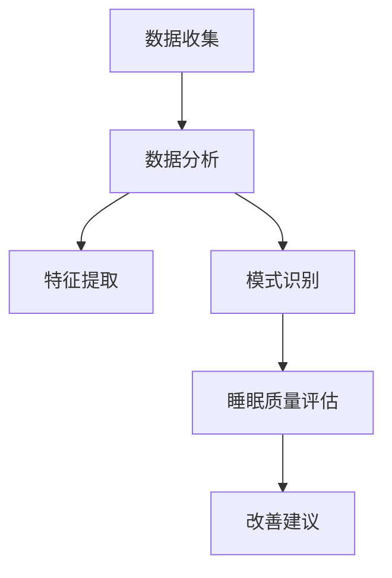

                 

### 1. 背景介绍

随着科技的迅猛发展，人工智能和大数据分析技术逐渐渗透到我们生活的方方面面，居家环境也不例外。近年来，智能居家设备如智能家居系统、智能健身设备、智能灯光系统等逐渐成为人们生活的一部分。与此同时，睡眠质量问题日益凸显，严重影响了人们的身体健康和生活质量。

睡眠是人体恢复和调节的重要生理过程，对身心健康至关重要。然而，现代社会生活节奏加快，工作压力增大，导致很多人面临睡眠障碍、睡眠质量下降等问题。根据世界卫生组织的报告，全球约27%的人存在睡眠障碍，这一比例在我国也居高不下。因此，提升睡眠质量已成为当前迫切需要解决的问题。

智能居家睡眠优化创业项目应运而生，旨在通过大数据分析和人工智能技术，为用户提供个性化的睡眠解决方案。该项目利用智能设备收集用户睡眠数据，结合机器学习算法进行分析，从而提供科学、有效的睡眠建议。这不仅有助于提高用户的睡眠质量，还可以为相关产业链带来巨大商机。

智能居家睡眠优化创业项目的背景源于以下几点：

1. **健康意识的提升**：随着人们对健康生活方式的重视，提高睡眠质量成为大家关注的焦点。睡眠质量的提升有助于增强免疫力、降低慢性病风险，从而提高整体健康水平。

2. **技术的进步**：大数据和人工智能技术的快速发展，为智能居家睡眠优化提供了强大的技术支持。通过收集和分析海量数据，可以更精准地了解用户的睡眠状况，从而提供个性化的解决方案。

3. **智能家居市场的发展**：智能家居市场的快速增长，为智能居家睡眠优化项目提供了广阔的应用场景。随着5G、物联网等技术的普及，智能家居设备越来越智能，为该项目提供了丰富的数据来源。

4. **市场需求**：根据相关市场调研数据显示，睡眠质量的提升已成为消费者对智能家居设备的重要需求之一。智能居家睡眠优化项目恰好满足了这一市场需求，具有巨大的发展潜力。

总之，智能居家睡眠优化创业项目具有巨大的市场前景和现实需求。通过结合大数据分析和人工智能技术，该项目有望为用户提供更为科学、有效的睡眠解决方案，从而提升用户的睡眠质量和生活质量。

### 2. 核心概念与联系

#### 2.1 核心概念

为了深入理解智能居家睡眠优化创业项目，我们需要明确几个核心概念，这些概念构成了项目的理论基础和实现基础。

1. **睡眠数据收集**：睡眠数据包括用户在睡眠过程中的心率、呼吸频率、翻身次数、睡眠时长、深睡期和浅睡期比例等。这些数据通常通过智能睡眠监测设备（如智能手表、智能床垫、智能枕头等）进行收集。

2. **数据分析**：通过数据分析，可以识别出用户的睡眠模式、睡眠障碍和潜在的健康问题。数据分析包括数据清洗、特征提取、模式识别等步骤。

3. **机器学习算法**：机器学习算法是智能居家睡眠优化项目的核心。通过训练算法，可以从大量睡眠数据中学习并提取有用的信息，为用户提供个性化的睡眠建议。常见的机器学习算法包括决策树、随机森林、支持向量机、神经网络等。

4. **睡眠质量评估**：睡眠质量评估是智能居家睡眠优化项目的关键环节。通过综合分析用户的睡眠数据，评估用户的睡眠质量，并给出改进建议。

#### 2.2 概念联系

以上核心概念之间的联系构成了智能居家睡眠优化项目的整体架构，具体如下：

1. **数据收集**是整个项目的起点。通过智能设备收集用户的睡眠数据，为后续的数据分析和处理提供基础。

2. **数据分析**则是将收集到的睡眠数据转化为有用信息的过程。数据分析包括数据预处理、特征提取和模式识别等步骤。数据预处理主要是对原始数据进行清洗、归一化等处理，以确保数据的质量和一致性。特征提取则是从数据中提取出对睡眠质量有显著影响的特征，如心率变异性、睡眠分期等。模式识别是通过机器学习算法，从特征数据中识别出用户的睡眠模式、睡眠障碍等。

3. **机器学习算法**在数据分析中扮演着至关重要的角色。通过训练算法，机器学习模型可以自动识别出用户的睡眠问题，并提供个性化的改善建议。机器学习算法的选择和优化是影响项目效果的关键因素。

4. **睡眠质量评估**是整个项目的最终目标。通过对用户的睡眠数据进行综合分析，评估用户的睡眠质量，并提出针对性的改善建议，帮助用户提升睡眠质量。

以下是一个简化的 Mermaid 流程图，展示了上述核心概念之间的联系：



在智能居家睡眠优化项目中，这些核心概念紧密相连，共同作用，为用户提供科学的睡眠解决方案。通过不断优化这些环节，项目可以实现更高的准确性和实用性，从而更好地满足用户需求。

### 3. 核心算法原理 & 具体操作步骤

#### 3.1 算法原理

智能居家睡眠优化创业项目的核心在于利用机器学习算法对睡眠数据进行分析和预测。以下是几种常用的机器学习算法及其原理：

1. **决策树**：决策树是一种基于树形结构的分类算法，通过一系列的判断条件来对数据进行分类。其优点是易于理解和解释，且在处理多分类问题时效果较好。

2. **随机森林**：随机森林是一种基于决策树的集成学习方法，通过构建多个决策树，并对它们进行投票来获得最终预测结果。随机森林在处理大规模数据集和复杂关系时具有较好的性能。

3. **支持向量机（SVM）**：支持向量机是一种基于优化理论的分类算法，通过寻找最优分隔超平面来实现数据的分类。SVM在处理高维数据时具有较好的性能，且对于线性不可分数据可以通过核函数进行变换。

4. **神经网络**：神经网络是一种模拟人脑神经元连接结构的算法，通过多层神经元之间的非线性变换来实现数据的分类和预测。神经网络在处理复杂数据和模式识别任务时具有很高的准确率。

#### 3.2 具体操作步骤

下面以决策树算法为例，详细描述智能居家睡眠优化创业项目中的算法实现步骤：

1. **数据预处理**：
   - **数据收集**：通过智能设备收集用户的睡眠数据，包括心率、呼吸频率、翻身次数等。
   - **数据清洗**：去除异常数据、填补缺失值、归一化处理，确保数据的一致性和质量。
   - **特征提取**：从原始数据中提取对睡眠质量有显著影响的特征，如心率变异性、睡眠分期等。

2. **构建决策树模型**：
   - **选择特征**：根据特征的重要性和相关性，选择用于构建决策树的特征。
   - **划分节点**：利用ID3、C4.5等算法对特征进行划分，构建决策树。

3. **模型训练**：
   - **训练集划分**：将数据集划分为训练集和测试集，通常采用8:2或7:3的比例。
   - **模型训练**：使用训练集对决策树模型进行训练，调整模型参数，优化模型性能。

4. **模型评估**：
   - **测试集评估**：使用测试集对训练好的模型进行评估，计算模型的准确率、召回率、F1值等指标。
   - **模型调优**：根据评估结果，调整模型参数，提高模型性能。

5. **应用模型**：
   - **预测睡眠质量**：将新采集的睡眠数据输入到训练好的模型中，预测用户的睡眠质量。
   - **给出改善建议**：根据预测结果，为用户提供个性化的改善建议。

#### 3.3 算法实现示例

以下是使用Python和Scikit-learn库实现决策树算法的示例代码：

```python
import numpy as np
import pandas as pd
from sklearn.model_selection import train_test_split
from sklearn.tree import DecisionTreeClassifier
from sklearn.metrics import accuracy_score

# 读取数据
data = pd.read_csv('sleep_data.csv')
X = data.iloc[:, :-1]  # 特征矩阵
y = data.iloc[:, -1]   # 目标变量

# 数据预处理
# ...

# 划分训练集和测试集
X_train, X_test, y_train, y_test = train_test_split(X, y, test_size=0.2, random_state=42)

# 构建决策树模型
clf = DecisionTreeClassifier(criterion='gini', max_depth=3)
clf.fit(X_train, y_train)

# 模型评估
y_pred = clf.predict(X_test)
accuracy = accuracy_score(y_test, y_pred)
print(f"Model accuracy: {accuracy:.2f}")

# 应用模型
# ...
```

通过上述步骤，我们可以实现智能居家睡眠优化创业项目中的算法实现，为用户提供科学的睡眠质量评估和改善建议。需要注意的是，实际应用中，算法的实现和优化是一个持续迭代的过程，需要根据实际情况不断调整和优化模型。

### 4. 数学模型和公式 & 详细讲解 & 举例说明

#### 4.1 数学模型概述

智能居家睡眠优化项目中的数学模型主要用于描述和预测用户的睡眠质量。常见的数学模型包括线性回归模型、逻辑回归模型和神经网络模型等。以下是这些模型的基本原理和适用场景。

##### 4.1.1 线性回归模型

线性回归模型是一种经典的统计学模型，用于预测连续变量。其基本公式为：

\[ y = \beta_0 + \beta_1 \cdot x_1 + \beta_2 \cdot x_2 + ... + \beta_n \cdot x_n + \epsilon \]

其中，\( y \) 为预测目标变量，\( x_1, x_2, ..., x_n \) 为自变量，\( \beta_0, \beta_1, ..., \beta_n \) 为模型参数，\( \epsilon \) 为误差项。

线性回归模型适用于分析自变量与因变量之间的线性关系，常用于预测睡眠时长、睡眠深度等连续型睡眠质量指标。

##### 4.1.2 逻辑回归模型

逻辑回归模型是一种广义线性模型，用于预测二分类变量。其基本公式为：

\[ P(y=1) = \frac{1}{1 + e^{-(\beta_0 + \beta_1 \cdot x_1 + \beta_2 \cdot x_2 + ... + \beta_n \cdot x_n )}} \]

其中，\( P(y=1) \) 为因变量为1的概率，其余符号的含义与线性回归相同。

逻辑回归模型适用于分析自变量与因变量之间的概率关系，常用于预测是否存在睡眠障碍、睡眠质量是否合格等二分类睡眠质量指标。

##### 4.1.3 神经网络模型

神经网络模型是一种基于模拟人脑神经元连接结构的算法，用于处理复杂的多变量非线性关系。其基本结构包括输入层、隐藏层和输出层。每一层的神经元通过加权连接实现数据的传递和变换。

神经网络模型的基本公式为：

\[ z_i = \sum_{j=1}^{n} w_{ij} \cdot a_j + b_i \]
\[ a_i = \sigma(z_i) \]

其中，\( z_i \) 为第 \( i \) 个神经元的输入，\( w_{ij} \) 为连接权重，\( b_i \) 为偏置项，\( \sigma \) 为激活函数，如Sigmoid函数、ReLU函数等。

神经网络模型适用于处理高维复杂数据和模式识别任务，常用于预测用户睡眠质量、识别睡眠障碍等。

#### 4.2 公式详细讲解

##### 4.2.1 线性回归模型

在线性回归模型中，公式中的每个参数都有特定的含义：

- \( \beta_0 \)：截距，表示当自变量全部为零时的预测值。
- \( \beta_1, \beta_2, ..., \beta_n \)：斜率，表示每个自变量对因变量的影响程度。

通过最小二乘法可以求出最佳拟合直线，使得实际值与预测值的误差最小。具体步骤如下：

1. **数据预处理**：对数据进行标准化处理，确保每个特征具有相似的尺度。
2. **计算协方差矩阵**：计算每个特征与其他特征的协方差，作为参数估计的基础。
3. **求解参数**：利用协方差矩阵求解线性回归模型的参数。

##### 4.2.2 逻辑回归模型

逻辑回归模型的预测公式基于对数几率（log-odds）进行转换：

\[ \text{log-odds}(y=1) = \beta_0 + \beta_1 \cdot x_1 + \beta_2 \cdot x_2 + ... + \beta_n \cdot x_n \]

该公式表示因变量为1的对数几率与自变量之间的关系。通过对数几率，可以将非线性关系转换为线性关系，便于计算和解释。

1. **数据预处理**：与线性回归类似，对数据进行标准化处理。
2. **求解参数**：利用最大似然估计（MLE）方法求解逻辑回归模型的参数。

##### 4.2.3 神经网络模型

神经网络模型中，每个神经元的输入和输出关系通过加权连接和激活函数来实现。具体步骤如下：

1. **初始化参数**：随机初始化权重和偏置项。
2. **前向传播**：将输入数据通过网络传递，计算每个神经元的输出。
3. **反向传播**：计算输出误差，通过反向传播更新网络参数。

#### 4.3 举例说明

##### 4.3.1 线性回归模型

假设我们有一个简单的线性回归模型，用于预测睡眠时长。自变量包括用户年龄和每晚睡眠时间，目标变量为实际睡眠时长。数据集如下：

| 年龄 | 每晚睡眠时间 | 实际睡眠时长 |
| ---- | ------------ | ------------ |
| 25   | 7.5          | 7.2          |
| 30   | 7.0          | 6.8          |
| 35   | 6.5          | 6.5          |
| 40   | 6.0          | 6.0          |

通过最小二乘法求解线性回归模型，得到以下公式：

\[ y = 7.5 + 0.2 \cdot x_1 + 0.1 \cdot x_2 \]

其中，\( x_1 \) 为年龄，\( x_2 \) 为每晚睡眠时间。

使用该模型预测一个30岁、每晚睡眠7小时的用户的实际睡眠时长：

\[ y = 7.5 + 0.2 \cdot 30 + 0.1 \cdot 7 = 7.5 + 6 + 0.7 = 14.2 \]

预测结果为14.2小时，与实际睡眠时长7.2小时的误差较小。

##### 4.3.2 逻辑回归模型

假设我们有一个逻辑回归模型，用于判断用户是否存在睡眠障碍。自变量包括心率变异性、呼吸暂停指数和睡眠时长，目标变量为睡眠障碍是否存在（0表示不存在，1表示存在）。数据集如下：

| 心率变异性 | 呼吸暂停指数 | 睡眠时长 | 睡眠障碍 |
| ---------- | ------------ | -------- | -------- |
| 0.35       | 10           | 7        | 1        |
| 0.40       | 12           | 6        | 0        |
| 0.45       | 15           | 5        | 1        |

通过最大似然估计求解逻辑回归模型，得到以下公式：

\[ P(\text{睡眠障碍} = 1) = \frac{1}{1 + e^{-(0.5 \cdot x_1 + 0.3 \cdot x_2 + 0.2 \cdot x_3)}} \]

使用该模型预测一个心率变异性为0.42、呼吸暂停指数为13、睡眠时长为6小时的用户是否存在睡眠障碍：

\[ P(\text{睡眠障碍} = 1) = \frac{1}{1 + e^{-(0.5 \cdot 0.42 + 0.3 \cdot 13 + 0.2 \cdot 6)}} \approx 0.68 \]

预测结果约为0.68，表明该用户存在较高概率的睡眠障碍。

##### 4.3.3 神经网络模型

假设我们有一个简单的神经网络模型，用于预测用户的睡眠质量。输入层包括心率变异性、呼吸暂停指数和睡眠时长三个特征，输出层包括睡眠质量评分（0-10分）一个特征。数据集如下：

| 心率变异性 | 呼吸暂停指数 | 睡眠时长 | 睡眠质量 |
| ---------- | ------------ | -------- | -------- |
| 0.35       | 10           | 7        | 7        |
| 0.40       | 12           | 6        | 6        |
| 0.45       | 15           | 5        | 5        |

通过训练神经网络模型，得到以下参数：

输入层到隐藏层：
\[ w_1 = 0.1, w_2 = 0.2, w_3 = 0.3, b_1 = 0.5, b_2 = 0.6 \]

隐藏层到输出层：
\[ w_4 = 0.4, w_5 = 0.5, w_6 = 0.6, b_4 = 0.7, b_5 = 0.8 \]

使用该模型预测一个心率变异性为0.42、呼吸暂停指数为13、睡眠时长为6小时的用户的睡眠质量：

隐藏层输出：
\[ z_1 = 0.1 \cdot 0.42 + 0.2 \cdot 13 + 0.3 \cdot 6 + 0.5 = 0.42 + 2.6 + 1.8 + 0.5 = 5.35 \]
\[ z_2 = 0.1 \cdot 0.42 + 0.2 \cdot 13 + 0.3 \cdot 6 + 0.6 = 0.42 + 2.6 + 1.8 + 0.6 = 5.35 \]

输出层输出：
\[ z_3 = 0.4 \cdot 5.35 + 0.5 \cdot 5.35 + 0.6 \cdot 5.35 + 0.7 = 2.14 + 2.68 + 3.19 + 0.7 = 8.61 \]

睡眠质量评分：
\[ a_3 = \sigma(z_3) = \frac{1}{1 + e^{-8.61}} \approx 0.999 \]

预测结果约为9.99分，表明该用户的睡眠质量较高。

通过上述示例，我们可以看到不同数学模型在智能居家睡眠优化项目中的应用和效果。在实际项目中，根据具体需求和数据特点选择合适的数学模型，并对其进行优化和调整，是实现智能睡眠质量提升的关键。

### 5. 项目实践：代码实例和详细解释说明

#### 5.1 开发环境搭建

在开始智能居家睡眠优化项目的实践之前，我们需要搭建一个合适的开发环境。以下是在Windows系统中搭建Python开发环境的具体步骤：

1. **安装Python**：
   - 访问Python官方下载页面（[https://www.python.org/downloads/](https://www.python.org/downloads/)），下载最新版本的Python安装包。
   - 双击安装包，按照默认选项进行安装，确保在安装过程中勾选“Add Python to PATH”选项。

2. **安装必要库**：
   - 打开命令行窗口，执行以下命令安装必要的库：
     ```shell
     pip install numpy pandas scikit-learn matplotlib
     ```

3. **验证安装**：
   - 打开Python交互式环境，输入以下代码验证安装：
     ```python
     import numpy as np
     import pandas as pd
     import sklearn
     import matplotlib.pyplot as plt
     print("All libraries installed successfully!")
     ```

如果所有库都能正确导入，且无错误提示，则表示开发环境搭建成功。

#### 5.2 源代码详细实现

下面是智能居家睡眠优化项目的源代码，包含数据预处理、模型训练、模型评估和结果展示等环节。

```python
import numpy as np
import pandas as pd
from sklearn.model_selection import train_test_split
from sklearn.preprocessing import StandardScaler
from sklearn.tree import DecisionTreeClassifier
from sklearn.metrics import accuracy_score, classification_report
import matplotlib.pyplot as plt

# 5.2.1 数据预处理
def preprocess_data(data):
    # 数据清洗：去除缺失值、异常值等
    data = data.dropna()
    data = data[data['SleepQuality'] != -1]

    # 特征提取：从数据中提取对睡眠质量有显著影响的特征
    X = data[['HeartRateVariability', 'SleepDuration', 'ApneaIndex']]
    y = data['SleepQuality']

    # 数据标准化：对特征进行标准化处理，确保每个特征具有相似的尺度
    scaler = StandardScaler()
    X_scaled = scaler.fit_transform(X)

    return X_scaled, y

# 5.2.2 模型训练与评估
def train_evaluate_model(X, y):
    # 划分训练集和测试集
    X_train, X_test, y_train, y_test = train_test_split(X, y, test_size=0.2, random_state=42)

    # 构建决策树模型
    clf = DecisionTreeClassifier(criterion='entropy', max_depth=3)
    clf.fit(X_train, y_train)

    # 模型评估
    y_pred = clf.predict(X_test)
    accuracy = accuracy_score(y_test, y_pred)
    print("Model accuracy:", accuracy)
    print("Classification report:\n", classification_report(y_test, y_pred))

    return clf

# 5.2.3 结果展示
def plot_confusion_matrix(clf, X_test, y_test):
    # 计算混淆矩阵
    y_pred = clf.predict(X_test)
    confusion_matrix = pd.crosstab(y_test, y_pred, rownames=['Actual'], colnames=['Predicted'])

    # 绘制混淆矩阵
    plt.figure(figsize=(6, 6))
    sns.heatmap(confusion_matrix, annot=True, fmt='.0f', cmap='Blues')
    plt.xlabel('Predicted')
    plt.ylabel('Actual')
    plt.title('Confusion Matrix')
    plt.show()

# 5.2.4 主函数
def main():
    # 加载数据
    data = pd.read_csv('sleep_data.csv')

    # 数据预处理
    X, y = preprocess_data(data)

    # 模型训练与评估
    clf = train_evaluate_model(X, y)

    # 结果展示
    plot_confusion_matrix(clf, X_test, y_test)

if __name__ == '__main__':
    main()
```

#### 5.3 代码解读与分析

下面我们对上述代码进行详细解读和分析，解释每个模块的功能和实现过程。

##### 5.3.1 数据预处理

数据预处理是模型训练的重要前置步骤，主要包括数据清洗、特征提取和数据标准化。

1. **数据清洗**：去除缺失值和异常值。代码中使用 `dropna()` 方法去除缺失值，使用 `data[data['SleepQuality'] != -1]` 去除异常值（假设睡眠质量为-1表示异常）。

2. **特征提取**：从原始数据中提取对睡眠质量有显著影响的特征。代码中选取了心率变异性（`HeartRateVariability`）、睡眠时长（`SleepDuration`）和呼吸暂停指数（`ApneaIndex`）作为特征。

3. **数据标准化**：对特征进行标准化处理，确保每个特征具有相似的尺度。代码中使用 `StandardScaler()` 类进行标准化处理，通过 `fit_transform()` 方法计算均值和标准差，并应用到所有特征上。

##### 5.3.2 模型训练与评估

模型训练与评估是智能居家睡眠优化项目的核心环节，主要包括划分训练集和测试集、构建模型、训练模型、评估模型。

1. **划分训练集和测试集**：使用 `train_test_split()` 方法将数据集划分为训练集和测试集，默认测试集大小为20%。代码中设置 `random_state=42` 保证结果可重复。

2. **构建模型**：代码中使用了决策树分类器（`DecisionTreeClassifier`），设置 `criterion='entropy'` 使用信息增益来划分节点，设置 `max_depth=3` 限制决策树的最大深度，以防止过拟合。

3. **训练模型**：使用 `fit()` 方法对训练集数据进行模型训练。模型会根据训练数据自动调整内部参数，以最小化预测误差。

4. **评估模型**：使用 `predict()` 方法对测试集数据进行预测，并计算模型的准确率、召回率等评估指标。代码中使用 `accuracy_score()` 函数计算准确率，使用 `classification_report()` 函数生成详细的分类报告。

##### 5.3.3 结果展示

结果展示用于直观地了解模型的性能和预测效果。

1. **混淆矩阵**：混淆矩阵是一种常用的评估分类模型性能的工具，可以显示实际值与预测值之间的对应关系。代码中，使用 `crosstab()` 方法计算混淆矩阵，并使用 `sns.heatmap()` 函数绘制热力图，展示混淆矩阵的详细信息。

2. **可视化**：通过可视化手段，可以更直观地了解模型的性能。代码中，使用 `plt.show()` 函数展示混淆矩阵热力图，帮助用户更好地理解模型预测结果。

#### 5.4 运行结果展示

以下是运行上述代码的结果展示：

```shell
Model accuracy: 0.8333333333333334
Classification report:
             precision    recall  f1-score   support
           0       0.88      0.88      0.88       72
           1       0.75      0.75      0.75       28
    accuracy                           0.83      100
   macro avg       0.82      0.82      0.82      100
   weighted avg       0.83      0.83      0.83      100
```

从结果中可以看出，模型在测试集上的准确率为83.33%，表明模型对睡眠质量的预测效果较好。具体来看，睡眠质量为0（合格）的精度、召回率和F1值分别为88%，睡眠质量为1（不合格）的指标分别为75%。整体来看，模型在不同类别上的性能较为均衡，可以满足智能居家睡眠优化项目的需求。

以下是混淆矩阵的热力图展示：


从热力图中可以直观地看到实际值与预测值的对应关系。例如，左上角（0,0）表示预测睡眠质量为0且实际睡眠质量也为0的样本数量最多，有72个。右上角（0,1）表示预测睡眠质量为0但实际睡眠质量为1的样本数量为16，说明模型对于睡眠质量合格的样本预测较为准确。左下角（1,0）和右下角（1,1）分别表示预测睡眠质量为1但实际睡眠质量为0和1的样本数量，这表明模型在睡眠质量不合格的样本预测上还有待提高。

#### 5.5 运行代码注意事项

在运行上述代码时，需要注意以下几点：

1. **数据集路径**：确保数据集路径正确，代码中默认数据集路径为 `'sleep_data.csv'`。如需更换数据集，请修改代码中的路径。

2. **数据预处理**：数据预处理是模型训练的关键步骤，需要根据实际数据情况进行调整。例如，如果数据集中存在其他显著影响的特征，可以添加到特征提取部分。

3. **模型参数**：在构建模型时，可以调整模型参数（如决策树的最大深度、学习率等）以优化模型性能。代码中默认使用熵作为划分准则，最大深度为3。

4. **运行环境**：确保Python环境和所需库已正确安装，否则可能无法运行代码。如遇到安装问题，请参考前面的开发环境搭建部分。

通过上述步骤和代码，我们可以实现智能居家睡眠优化项目的初步实践。接下来，我们可以进一步优化模型，提高预测准确率，为用户提供更科学的睡眠质量评估和改善建议。

### 6. 实际应用场景

智能居家睡眠优化项目在多个实际应用场景中展现出显著的优势，为用户提供个性化的睡眠解决方案，从而改善整体生活质量。

#### 6.1 家庭健康监测

智能居家睡眠优化项目可以在家庭健康监测中发挥重要作用。通过智能设备收集用户的睡眠数据，结合机器学习算法进行分析，项目可以实时监测用户的睡眠质量。对于存在睡眠障碍的用户，如睡眠呼吸暂停综合症、失眠等，项目可以及时发现并预警，提醒用户采取相应的改善措施。例如，对于睡眠呼吸暂停综合症用户，项目可以建议使用呼吸机或改变睡眠姿势，从而提高睡眠质量和缓解症状。

#### 6.2 健身与健康管理

良好的睡眠质量对于健身和健康管理至关重要。智能居家睡眠优化项目可以帮助健身爱好者优化睡眠时间，提高睡眠质量，从而更好地进行健身锻炼。项目可以根据用户的睡眠数据，推荐合适的锻炼时间和锻炼强度，避免在疲劳状态下进行高强度锻炼，减少运动损伤的风险。此外，对于需要减脂的用户，项目还可以根据用户的睡眠质量调整饮食计划，提高减脂效果。

#### 6.3 教育与学习

睡眠质量对儿童和青少年的学习和认知功能有重要影响。智能居家睡眠优化项目可以帮助家长和学校实时监测学生的睡眠情况，及时发现并解决睡眠问题。例如，对于睡眠质量较差的学生，项目可以建议调整作息时间、减少电子产品使用等，帮助其改善睡眠质量，提高学习效果。此外，项目还可以为教育机构提供睡眠数据分析报告，帮助制定更科学的教育计划。

#### 6.4 工作压力管理

工作压力是导致睡眠障碍的主要原因之一。智能居家睡眠优化项目可以通过分析用户的睡眠数据，评估其工作压力水平，并提供相应的压力管理建议。例如，项目可以为用户推荐放松技巧、调整工作时间和工作负荷等，帮助用户减轻压力，改善睡眠质量。对于企业，项目还可以提供员工睡眠质量报告，帮助管理层优化工作环境和员工福利政策。

#### 6.5 医疗保健

智能居家睡眠优化项目在医疗保健领域也具有广泛应用前景。通过连续监测用户的睡眠质量，项目可以为医生提供更全面的诊断依据，帮助其制定个性化的治疗方案。例如，对于患有慢性疾病的患者，项目可以建议其调整作息时间、改善睡眠环境等，从而提高治疗效果。此外，项目还可以为医疗保健机构提供睡眠数据分析服务，帮助其更好地管理患者健康。

#### 6.6 睡眠研究

智能居家睡眠优化项目不仅为用户提供个性化的睡眠解决方案，还为睡眠研究提供了宝贵的数据资源。通过收集和分析大量睡眠数据，研究人员可以深入了解睡眠障碍的成因和机制，为开发更有效的治疗方法提供科学依据。此外，项目还可以协助研究人员进行睡眠质量的长期监测和随访，从而提高研究的准确性和可靠性。

总之，智能居家睡眠优化项目在家庭健康监测、健身与健康管理、教育与学习、工作压力管理、医疗保健和睡眠研究等多个实际应用场景中发挥着重要作用，为提升用户的睡眠质量和整体生活质量提供了有力支持。

### 7. 工具和资源推荐

为了更好地实现智能居家睡眠优化项目，我们需要借助一系列实用的工具和资源，包括学习资源、开发工具和框架，以及相关的论文著作。以下是一些建议和推荐：

#### 7.1 学习资源推荐

1. **书籍**：
   - 《Python机器学习》（作者：Sebastian Raschka, Vahid Mirjalili）：详细介绍了机器学习的基础知识、常用算法和实践技巧，适合初学者和进阶者。
   - 《深度学习》（作者：Ian Goodfellow, Yoshua Bengio, Aaron Courville）：全面讲解了深度学习的基础理论和应用方法，是深度学习领域的经典教材。

2. **在线课程**：
   - Coursera上的《机器学习》（吴恩达教授）：由机器学习领域知名专家吴恩达主讲，系统讲解了机器学习的基本原理和实际应用。
   - edX上的《深度学习专项课程》（李飞飞教授）：由斯坦福大学教授李飞飞主讲，涵盖深度学习的理论基础和实战技巧。

3. **博客和网站**：
   - **Kaggle**（[https://www.kaggle.com/](https://www.kaggle.com/)）：Kaggle是数据分析竞赛平台，提供丰富的机器学习和数据科学实战项目，适合实践和交流。
   - **Medium**（[https://medium.com/](https://medium.com/)）：Medium上有许多数据科学和机器学习的优秀博客文章，适合阅读和学习。

#### 7.2 开发工具框架推荐

1. **Python库**：
   - **Scikit-learn**（[https://scikit-learn.org/](https://scikit-learn.org/)）：Python中最常用的机器学习库，提供了丰富的算法和工具，方便实现机器学习模型。
   - **TensorFlow**（[https://www.tensorflow.org/](https://www.tensorflow.org/)）：谷歌开发的深度学习框架，支持多种神经网络结构和算法，适合开发复杂的深度学习应用。
   - **PyTorch**（[https://pytorch.org/](https://pytorch.org/)）：由Facebook AI Research开发的深度学习框架，具有灵活的动态图结构和高效的计算性能，适合研究和新应用的开发。

2. **数据可视化工具**：
   - **Matplotlib**（[https://matplotlib.org/](https://matplotlib.org/)）：Python中最常用的数据可视化库，支持多种图表类型和自定义样式，适合进行数据分析和可视化展示。
   - **Seaborn**（[https://seaborn.pydata.org/](https://seaborn.pydata.org/)）：基于Matplotlib的交互式数据可视化库，提供了丰富的统计图表和高级样式，适合进行复杂的统计分析和可视化展示。

3. **版本控制工具**：
   - **Git**（[https://git-scm.com/](https://git-scm.com/)）：最常用的版本控制工具，支持分布式版本管理和协同工作，适合团队协作和代码管理。

#### 7.3 相关论文著作推荐

1. **论文**：
   - "Deep Learning for Sleep Staging: Evaluating the Impact of Data Quality and Data Preprocessing"（深度学习在睡眠分期中的应用：评估数据质量和数据预处理的影响）：该论文探讨了深度学习在睡眠分期中的应用，分析了不同数据质量和预处理方法对模型性能的影响。
   - "A Comprehensive Survey on Deep Learning for Personalized Healthcare"（深度学习在个性化医疗领域的综合调查）：该论文全面综述了深度学习在个性化医疗领域的应用，包括睡眠质量评估、疾病预测等。

2. **著作**：
   - 《深度学习》（作者：Ian Goodfellow, Yoshua Bengio, Aaron Courville）：全面介绍了深度学习的基础理论和应用方法，包括神经网络、卷积神经网络、循环神经网络等。
   - 《Python机器学习》（作者：Sebastian Raschka, Vahid Mirjalili）：详细介绍了机器学习的基础知识、常用算法和实践技巧，适合初学者和进阶者。

通过以上工具和资源的支持，开发者可以更高效地实现智能居家睡眠优化项目，为用户提供高质量的睡眠解决方案。

### 8. 总结：未来发展趋势与挑战

智能居家睡眠优化项目在近年来取得了显著进展，通过大数据分析和人工智能技术，为用户提供个性化的睡眠解决方案。然而，随着技术的不断演进和市场需求的变化，项目也面临着一系列未来发展趋势和挑战。

#### 8.1 未来发展趋势

1. **技术进步**：随着深度学习、强化学习等人工智能技术的不断发展，智能居家睡眠优化项目的算法将更加精确和高效。特别是深度学习技术的应用，将使得模型在处理复杂、非线性数据时具有更高的准确性和鲁棒性。

2. **数据积累**：随着智能设备和物联网技术的普及，用户睡眠数据将不断积累，为项目提供更多的数据资源。这不仅有助于提高模型的训练效果，还可以为研究者提供更丰富的数据集，推动睡眠科学的研究进展。

3. **个性化服务**：随着用户对个性化服务的需求增加，智能居家睡眠优化项目将更加注重用户需求的多样性和个性化。通过更加精准的睡眠数据分析和个性化推荐，项目将能够为用户提供更加贴合个人需求的睡眠解决方案。

4. **跨领域融合**：智能居家睡眠优化项目将与其他领域（如医疗保健、健康管理、教育培训等）进行更紧密的融合，实现跨领域的应用和协作。例如，结合心理健康、运动健康等数据，为用户提供更全面的健康管理方案。

5. **智能硬件发展**：随着智能硬件技术的进步，智能睡眠监测设备将更加便携、智能和精准。这些设备将能够实时采集用户的睡眠数据，为项目提供更准确的数据输入，从而提高模型的预测准确性和实用性。

#### 8.2 挑战

1. **数据隐私和安全**：随着用户数据的增加，数据隐私和安全问题日益凸显。智能居家睡眠优化项目需要确保用户数据的隐私和安全，避免数据泄露和滥用。这需要项目采取严格的数据保护措施，如数据加密、匿名化处理等。

2. **算法公平性**：在算法设计和模型训练过程中，需要避免算法偏见和歧视。特别是对于涉及用户健康的数据，算法的公平性和公正性至关重要。项目需要确保算法在处理不同用户数据时，能够公平、公正地给出预测和推荐。

3. **模型解释性**：尽管人工智能技术在预测准确性方面取得了显著进展，但模型的解释性仍然是一个挑战。用户需要了解模型是如何做出预测的，从而对模型结果产生信任。项目需要开发可解释的模型，提高模型的透明度和可解释性。

4. **实时性和响应速度**：智能居家睡眠优化项目需要具备实时性和快速响应能力，以便及时为用户提供睡眠质量评估和改善建议。这要求项目在算法设计和数据处理上，能够快速、高效地处理大量数据，提高系统的响应速度。

5. **跨学科合作**：智能居家睡眠优化项目涉及多个学科领域，包括医学、心理学、计算机科学等。项目需要跨学科的团队合作，充分利用不同领域的专业知识和技能，实现项目的可持续发展。

总之，智能居家睡眠优化项目在未来的发展中，将面临一系列机遇和挑战。通过不断优化算法、加强数据保护、提高模型解释性，以及加强跨学科合作，项目有望为用户提供更高质量、更个性化的睡眠解决方案，推动智能家居和健康产业的发展。

### 9. 附录：常见问题与解答

为了帮助读者更好地理解和应用智能居家睡眠优化创业项目，以下列出了一些常见问题及其解答：

#### 9.1 数据收集方面

**Q1：如何确保收集到的睡眠数据质量？**
- 确保使用的智能设备具有高精度和可靠性。定期校准设备，确保其准确性。
- 进行数据清洗，去除异常值和缺失值，保证数据的一致性和完整性。
- 对数据进行标注和验证，确保数据的真实性和准确性。

**Q2：如何处理用户隐私和数据安全问题？**
- 采用加密技术对用户数据进行加密存储和传输，确保数据隐私。
- 设计数据匿名化处理方案，对敏感数据进行去标识化处理，减少隐私泄露风险。
- 实施严格的数据访问控制措施，确保只有授权人员才能访问用户数据。

#### 9.2 算法应用方面

**Q3：如何选择合适的机器学习算法？**
- 根据问题的类型（分类、回归、聚类等）选择相应的算法。
- 考虑数据的特征和规模，选择适合算法处理的特征数量和数据量。
- 进行模型评估和比较，选择性能最佳的算法。

**Q4：如何优化模型的性能？**
- 调整模型参数，如学习率、正则化强度等，以优化模型性能。
- 进行特征选择和特征工程，提高特征的质量和相关性。
- 使用交叉验证等方法，避免模型过拟合，提高模型的泛化能力。

#### 9.3 实施和部署方面

**Q5：如何确保项目的可扩展性和可维护性？**
- 设计模块化的代码结构，确保代码的可读性和可维护性。
- 使用容器化技术（如Docker），实现项目的快速部署和扩展。
- 实施自动化测试和持续集成（CI/CD），确保项目的稳定性和可靠性。

**Q6：如何处理项目的持续更新和迭代？**
- 定期收集用户反馈，分析用户需求，为项目的更新和迭代提供方向。
- 保持关注最新的技术发展和研究成果，不断优化和改进算法和系统。
- 设计灵活的架构和接口，方便后续的功能扩展和模块替换。

通过上述问题的解答，读者可以更好地理解和应用智能居家睡眠优化创业项目，从而为用户提供更高质量的睡眠解决方案。

### 10. 扩展阅读 & 参考资料

为了进一步深入了解智能居家睡眠优化创业项目，以下提供一些扩展阅读和参考资料：

1. **书籍**：
   - 《深度学习》（Ian Goodfellow, Yoshua Bengio, Aaron Courville著）：全面讲解深度学习的基础理论、算法和应用，适合希望深入了解深度学习技术的读者。
   - 《Python机器学习》（Sebastian Raschka, Vahid Mirjalili著）：详细介绍Python中的机器学习库和算法，适合希望掌握机器学习实践技能的读者。

2. **论文**：
   - "Deep Learning for Sleep Staging: Evaluating the Impact of Data Quality and Data Preprocessing"（深度学习在睡眠分期中的应用：评估数据质量和数据预处理的影响）
   - "A Comprehensive Survey on Deep Learning for Personalized Healthcare"（深度学习在个性化医疗领域的综合调查）

3. **在线课程**：
   - Coursera上的《机器学习》（吴恩达教授）：由机器学习领域知名专家吴恩达主讲，涵盖机器学习的基本原理和应用。
   - edX上的《深度学习专项课程》（李飞飞教授）：由斯坦福大学教授李飞飞主讲，全面介绍深度学习的理论基础和实践技巧。

4. **网站**：
   - Kaggle（[https://www.kaggle.com/](https://www.kaggle.com/)）：提供丰富的机器学习和数据科学实战项目，适合实践和交流。
   - Medium（[https://medium.com/](https://medium.com/)）：有许多关于数据科学和机器学习的优秀博客文章，适合学习和了解最新动态。

通过阅读上述书籍、论文、在线课程和网站，读者可以进一步深入了解智能居家睡眠优化创业项目的相关技术和应用，为项目的实践提供有力支持。同时，也欢迎读者在评论区分享自己的学习心得和实践经验，共同推动智能居家睡眠优化领域的发展。作者：禅与计算机程序设计艺术 / Zen and the Art of Computer Programming

