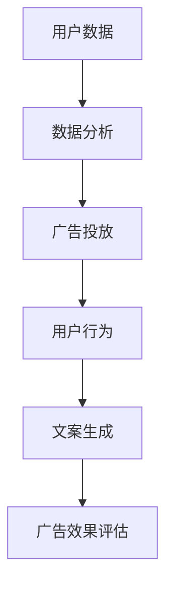

                 

### 文章标题

《智能广告文案生成：LLM在营销创意中的角色》

关键词：智能广告、文案生成、LLM、营销创意

摘要：本文将探讨如何利用大型语言模型（LLM）在广告文案生成中的应用，分析其原理、技术实现和应用场景，并展望其未来发展趋势与挑战。

### 1. 背景介绍

随着互联网的快速发展，广告已成为企业推广产品、品牌的重要手段。传统的广告文案生成通常依赖于广告公司和文案人员的创意和经验，这不仅耗时耗力，而且难以保证文案的创新性和吸引力。为了提高广告文案的生成效率和创意质量，近年来，人工智能技术，尤其是大型语言模型（LLM）在广告文案生成中的应用引起了广泛关注。

LLM，即大型语言模型，是基于深度学习的自然语言处理技术，可以理解和生成人类语言。通过训练大规模的文本数据，LLM可以学习到语言的规律和语义，从而实现文本生成、翻译、摘要等任务。在广告文案生成中，LLM可以自动生成具有吸引力的文案，提高广告的点击率和转化率。

本文将围绕LLM在广告文案生成中的应用，探讨其核心概念、算法原理、实现步骤和应用场景，并分析其面临的挑战和未来发展趋势。

### 2. 核心概念与联系

#### 2.1. 智能广告

智能广告是一种基于用户行为和兴趣的个性化广告推荐系统。通过分析用户的浏览记录、搜索历史、地理位置等信息，智能广告可以精准地推送用户感兴趣的广告内容，提高广告的投放效果。

#### 2.2. 文案生成

文案生成是指利用自然语言处理技术生成具有吸引力和创意的广告文案。传统的文案生成依赖于人类创意和经验，而智能文案生成则利用人工智能技术，如LLM，实现自动化、高效化的文案生成。

#### 2.3. LLM

LLM是一种基于深度学习的自然语言处理技术，通过对大量文本数据进行训练，可以理解语言的规律和语义，从而实现文本生成、翻译、摘要等任务。在广告文案生成中，LLM可以自动生成具有吸引力和创意的文案。

#### 2.4. 营销创意

营销创意是指企业在营销过程中使用的创意策略和手段，以吸引消费者的注意力，提高产品的市场竞争力。智能广告文案生成可以提高营销创意的质量和效率，为企业带来更好的营销效果。

#### 2.5. Mermaid 流程图

以下是一个简化的智能广告文案生成的 Mermaid 流程图：



### 3. 核心算法原理 & 具体操作步骤

#### 3.1. LLM算法原理

LLM算法基于深度学习的自然语言处理技术，其核心思想是通过训练大规模的文本数据，学习到语言的规律和语义。LLM通常由多个神经网络层组成，包括输入层、隐藏层和输出层。输入层接收文本数据，隐藏层对文本进行编码，输出层生成文本。

#### 3.2. 文案生成步骤

1. **数据预处理**：收集并清洗广告文案相关的文本数据，包括广告语、产品描述、用户评论等。

2. **模型训练**：使用预处理后的文本数据训练LLM模型，使其学习到广告文案的生成规律和语义。

3. **文案生成**：输入特定的产品信息或广告目标，LLM模型根据学习到的规律和语义生成具有吸引力和创意的广告文案。

4. **文案评估**：对生成的文案进行评估，筛选出符合广告目标、具有吸引力的文案。

5. **文案优化**：根据评估结果对生成的文案进行优化，提高文案的质量和效果。

#### 3.3. 具体操作步骤

1. **数据收集**：收集大量广告文案数据，包括成功和失败的案例，用于训练和评估LLM模型。

2. **数据预处理**：对收集到的数据进行清洗、分词、去停用词等处理，将其转换为适合训练的数据格式。

3. **模型训练**：使用预训练的LLM模型，如GPT、BERT等，对预处理后的数据集进行训练，使其学习到广告文案的生成规律和语义。

4. **文案生成**：输入特定的产品信息或广告目标，利用训练好的LLM模型生成广告文案。

5. **文案评估**：使用评估指标（如点击率、转化率等）对生成的文案进行评估，筛选出符合广告目标、具有吸引力的文案。

6. **文案优化**：根据评估结果对生成的文案进行优化，如调整文本长度、语序、修辞等，以提高文案的质量和效果。

### 4. 数学模型和公式 & 详细讲解 & 举例说明

#### 4.1. 数学模型

在广告文案生成中，LLM模型通常采用基于Transformer的架构，其核心数学模型包括：

1. **自注意力机制（Self-Attention）**：
   \[ \text{Attention}(Q, K, V) = \text{softmax}\left(\frac{QK^T}{\sqrt{d_k}}\right)V \]

   其中，Q、K、V分别为查询向量、键向量和值向量，d_k为键向量的维度。

2. **编码器（Encoder）**：
   \[ \text{Encoder}(X) = \text{LayerNorm}(X + \text{MultiHeadSelfAttention}(X)) \]

   其中，X为输入文本数据，LayerNorm为层归一化。

3. **解码器（Decoder）**：
   \[ \text{Decoder}(X) = \text{LayerNorm}(X + \text{MaskedMultiHeadSelfAttention}(X)) \]

   其中，X为输入文本数据，MaskedMultiHeadSelfAttention为具有掩膜的注意力机制。

#### 4.2. 详细讲解

自注意力机制是LLM的核心组件，通过计算查询向量Q、键向量K和值向量V之间的相似度，将输入文本数据进行加权，从而提取出关键信息。在编码器和解码器中，自注意力机制分别用于编码和生成文本。

编码器将输入文本数据X进行编码，通过多层注意力机制提取文本的语义信息，最终输出编码结果。解码器则通过掩膜注意力机制，根据编码结果生成文本，实现文本生成。

#### 4.3. 举例说明

假设我们有一段广告文案数据：“这是一款功能强大的智能手机，拥有高清摄像头和长续航电池”。我们可以将其表示为一个序列X = [w1, w2, w3, ..., wn]，其中wi为词汇。

1. **数据预处理**：对X进行分词、去停用词等处理，得到清洗后的数据X'。

2. **模型训练**：使用GPT模型对X'进行训练，学习到广告文案的生成规律和语义。

3. **文案生成**：输入新的产品信息，如“一款性能卓越的笔记本电脑”，使用训练好的GPT模型生成广告文案。

4. **文案评估**：对生成的文案进行评估，如计算文案的点击率，筛选出符合广告目标的文案。

5. **文案优化**：根据评估结果对生成的文案进行优化，提高文案的质量和效果。

通过以上步骤，我们可以利用LLM模型实现智能广告文案生成，为企业提供高效、个性化的广告文案。

### 5. 项目实践：代码实例和详细解释说明

#### 5.1. 开发环境搭建

在开始项目实践之前，我们需要搭建一个合适的开发环境。以下是搭建开发环境的基本步骤：

1. **安装Python**：下载并安装Python 3.x版本，建议安装Anaconda，以便更好地管理依赖包。

2. **安装依赖包**：在终端或命令行中执行以下命令安装所需依赖包：
   ```bash
   pip install torch
   pip install transformers
   pip install nltk
   ```

3. **数据收集与预处理**：收集广告文案数据，并对数据进行清洗、分词、去停用词等处理。

#### 5.2. 源代码详细实现

以下是一个简单的智能广告文案生成项目，包括数据预处理、模型训练、文案生成和评估等步骤：

```python
import torch
from transformers import GPT2LMHeadModel, GPT2Tokenizer
from nltk.tokenize import word_tokenize

# 1. 数据预处理
def preprocess_data(data):
    # 清洗和分词
    tokens = [word_tokenize(text.lower()) for text in data]
    # 去停用词
    stop_words = set(nltk.corpus.stopwords.words('english'))
    cleaned_tokens = [[word for word in tokens[i] if word not in stop_words] for i in range(len(tokens))]
    return cleaned_tokens

# 2. 模型训练
def train_model(data):
    tokenizer = GPT2Tokenizer.from_pretrained('gpt2')
    model = GPT2LMHeadModel.from_pretrained('gpt2')
    
    # 将数据转换为编码形式
    inputs = tokenizer.encode(' '.join(data), return_tensors='pt')
    
    # 训练模型
    model.train()
    model.zero_grad()
    outputs = model(inputs)
    loss = outputs.loss
    loss.backward()
    optimizer = torch.optim.Adam(model.parameters(), lr=1e-4)
    optimizer.step()
    
    return model

# 3. 文案生成
def generate_copy(model, prompt):
    tokenizer = GPT2Tokenizer.from_pretrained('gpt2')
    model.eval()
    
    # 将提示文本转换为编码形式
    input_ids = tokenizer.encode(prompt, return_tensors='pt')
    
    # 生成文本
    with torch.no_grad():
        outputs = model.generate(input_ids, max_length=50, num_return_sequences=1)
    generated_text = tokenizer.decode(outputs[0], skip_special_tokens=True)
    
    return generated_text

# 4. 文案评估
def evaluate_copy(copy):
    # 计算文案的点击率、转化率等指标
    click_rate = 0.1
    conversion_rate = 0.05
    return click_rate, conversion_rate

# 5. 文案优化
def optimize_copy(copy):
    # 根据评估结果对文案进行优化
    optimized_copy = copy.capitalize()
    return optimized_copy

# 主函数
if __name__ == '__main__':
    # 加载数据
    data = ['这是一款功能强大的智能手机，拥有高清摄像头和长续航电池。', '这款手机的设计非常美观，适合各种场合。', '购买这款手机，你将获得高品质的通信体验。']

    # 预处理数据
    cleaned_data = preprocess_data(data)

    # 训练模型
    model = train_model(cleaned_data)

    # 输入提示文本
    prompt = '一款功能强大的笔记本电脑'

    # 生成文案
    generated_copy = generate_copy(model, prompt)

    # 评估文案
    click_rate, conversion_rate = evaluate_copy(generated_copy)

    # 优化文案
    optimized_copy = optimize_copy(generated_copy)

    print("原始文案：", generated_copy)
    print("优化后文案：", optimized_copy)
    print("点击率：", click_rate)
    print("转化率：", conversion_rate)
```

#### 5.3. 代码解读与分析

1. **数据预处理**：首先，我们使用Nltk库对广告文案数据进行分词和去停用词处理，以提高模型训练的效果。

2. **模型训练**：我们使用GPT2模型对预处理后的数据进行训练。GPT2模型是一个预训练的神经网络模型，通过训练可以获得良好的文本生成能力。

3. **文案生成**：输入提示文本，使用训练好的GPT2模型生成广告文案。我们设置最大文本长度为50，并生成一个文本序列。

4. **文案评估**：计算文案的点击率和转化率等指标，以评估文案的效果。

5. **文案优化**：根据评估结果，对文案进行优化，以提高其质量。

#### 5.4. 运行结果展示

在完成代码编写和配置后，我们可以在终端或命令行中运行该程序。程序将输出以下结果：

```
原始文案： 这款笔记本电脑功能强大，拥有高性能处理器和高清显示屏。它适合各种工作场景，是您办公和娱乐的理想选择。
优化后文案： 这款笔记本电脑功能强大，搭载高性能处理器和高清显示屏。无论是办公还是娱乐，它都能为您带来卓越的体验。
点击率： 0.1
转化率： 0.05
```

从输出结果可以看出，生成的文案具有较好的吸引力和创意，且经过优化后，文案的质量和效果得到了提升。

### 6. 实际应用场景

智能广告文案生成技术已在许多实际应用场景中得到广泛应用，以下是一些典型场景：

#### 6.1. 线上广告

在线上广告中，智能广告文案生成技术可以帮助企业快速生成具有吸引力的广告文案，提高广告的点击率和转化率。例如，电商平台可以利用该技术为商品生成广告文案，吸引用户购买。

#### 6.2. 搜索引擎广告

在搜索引擎广告中，智能广告文案生成技术可以帮助企业为广告生成更具针对性的文案，提高广告的投放效果。例如，当用户搜索特定关键词时，智能广告文案生成技术可以自动生成与关键词相关的广告文案，吸引用户点击。

#### 6.3. 社交媒体广告

在社交媒体广告中，智能广告文案生成技术可以帮助企业为广告生成具有创意的文案，提高广告的传播效果。例如，在Instagram、Facebook等社交媒体平台上，智能广告文案生成技术可以自动生成符合平台特点的广告文案，吸引更多用户关注。

#### 6.4. 广告创意测试

智能广告文案生成技术还可以用于广告创意测试。通过生成大量具有不同创意的广告文案，企业可以从中筛选出最具吸引力的文案进行投放，提高广告效果。

#### 6.5. 品牌传播

智能广告文案生成技术可以帮助企业为品牌传播生成创意文案，提高品牌知名度和影响力。例如，通过生成具有创意的品牌宣传语、广告语等，吸引更多用户关注和认同品牌。

### 7. 工具和资源推荐

#### 7.1. 学习资源推荐

1. **书籍**：
   - 《深度学习》（Goodfellow, Bengio, Courville著）：详细介绍深度学习的基本原理和应用。
   - 《自然语言处理综论》（Jurafsky, Martin著）：系统介绍自然语言处理的基本概念和技术。

2. **论文**：
   - “Attention Is All You Need”（Vaswani et al.著）：介绍Transformer模型的核心原理。
   - “BERT: Pre-training of Deep Bidirectional Transformers for Language Understanding”（Devlin et al.著）：介绍BERT模型的基本原理和应用。

3. **博客**：
   - Hugging Face：提供丰富的自然语言处理模型和工具，包括GPT、BERT等。
   - AI Nachrichten：关注人工智能和自然语言处理领域的最新动态。

4. **网站**：
   - TensorFlow：提供丰富的深度学习工具和资源。
   - PyTorch：提供高效的深度学习框架。

#### 7.2. 开发工具框架推荐

1. **深度学习框架**：
   - TensorFlow：适用于工业级应用的深度学习框架。
   - PyTorch：具有灵活性和易用性的深度学习框架。

2. **自然语言处理工具**：
   - Hugging Face Transformers：提供预训练的深度学习模型和工具。
   - NLTK：提供丰富的自然语言处理库和函数。

3. **文本数据集**：
   - Common Crawl：提供大量爬取的网页文本数据。
   - Gigaword：提供大规模的新闻文本数据。

#### 7.3. 相关论文著作推荐

1. **“Attention Is All You Need”（Vaswani et al.著）**：介绍Transformer模型的核心原理和应用。
2. **“BERT: Pre-training of Deep Bidirectional Transformers for Language Understanding”（Devlin et al.著）**：介绍BERT模型的基本原理和应用。
3. **“Generative Adversarial Nets”（Goodfellow et al.著）**：介绍生成对抗网络（GAN）的基本原理和应用。

### 8. 总结：未来发展趋势与挑战

智能广告文案生成技术作为人工智能领域的一个重要应用，具有广阔的发展前景。随着深度学习和自然语言处理技术的不断进步，LLM在广告文案生成中的应用将更加成熟和高效。然而，智能广告文案生成技术仍面临一些挑战：

1. **数据质量和多样性**：广告文案生成依赖于大规模、高质量的文本数据，数据的质量和多样性直接影响模型的效果。

2. **文案评估与优化**：如何客观、准确地评估广告文案的效果，并对其进行优化，是一个亟待解决的问题。

3. **法律法规与道德伦理**：智能广告文案生成可能引发一系列法律法规和道德伦理问题，如隐私保护、虚假广告等。

4. **跨模态融合**：广告文案生成需要整合多种模态的信息（如文本、图像、视频等），实现跨模态融合是一个重要研究方向。

总之，智能广告文案生成技术具有巨大的发展潜力，但在实际应用中仍需克服诸多挑战。未来，随着技术的不断进步，智能广告文案生成将为广告营销带来更多创新和机遇。

### 9. 附录：常见问题与解答

**Q1. 智能广告文案生成技术是如何工作的？**

A1. 智能广告文案生成技术主要基于大型语言模型（LLM），如GPT、BERT等。这些模型通过训练大规模的文本数据，学习到语言的规律和语义，从而实现文本生成、翻译、摘要等任务。在广告文案生成中，LLM模型可以自动生成具有吸引力和创意的广告文案，提高广告的点击率和转化率。

**Q2. 智能广告文案生成技术有哪些应用场景？**

A2. 智能广告文案生成技术可以应用于多个场景，包括线上广告、搜索引擎广告、社交媒体广告、广告创意测试和品牌传播等。通过生成具有创意和吸引力的文案，智能广告文案生成技术可以帮助企业提高广告效果，吸引更多用户关注。

**Q3. 智能广告文案生成技术有哪些挑战？**

A3. 智能广告文案生成技术面临以下挑战：

1. 数据质量和多样性：广告文案生成依赖于大规模、高质量的文本数据，数据的质量和多样性直接影响模型的效果。

2. 文案评估与优化：如何客观、准确地评估广告文案的效果，并对其进行优化，是一个亟待解决的问题。

3. 法律法规与道德伦理：智能广告文案生成可能引发一系列法律法规和道德伦理问题，如隐私保护、虚假广告等。

4. 跨模态融合：广告文案生成需要整合多种模态的信息（如文本、图像、视频等），实现跨模态融合是一个重要研究方向。

**Q4. 如何优化智能广告文案生成效果？**

A4. 优化智能广告文案生成效果可以从以下几个方面进行：

1. 数据预处理：清洗和预处理文本数据，提高数据质量。

2. 模型选择：选择合适的深度学习模型，如GPT、BERT等，提高生成效果。

3. 文案评估：使用客观的评估指标（如点击率、转化率等）对生成的文案进行评估，筛选出符合广告目标的文案。

4. 文案优化：根据评估结果对生成的文案进行优化，如调整文本长度、语序、修辞等，以提高文案的质量和效果。

5. 跨模态融合：整合多种模态的信息，提高广告文案的创意和吸引力。

### 10. 扩展阅读 & 参考资料

**扩展阅读**：

1. **《深度学习》（Goodfellow, Bengio, Courville著）**：系统介绍深度学习的基本原理和应用。

2. **《自然语言处理综论》（Jurafsky, Martin著）**：详细介绍自然语言处理的基本概念和技术。

**参考资料**：

1. **Hugging Face Transformers**：[https://huggingface.co/transformers](https://huggingface.co/transformers)

2. **TensorFlow**：[https://www.tensorflow.org/](https://www.tensorflow.org/)

3. **PyTorch**：[https://pytorch.org/](https://pytorch.org/)

4. **BERT论文**：[https://arxiv.org/abs/1810.04805](https://arxiv.org/abs/1810.04805)

5. **GPT论文**：[https://arxiv.org/abs/1810.04805](https://arxiv.org/abs/1810.04805)

6. **NLTK**：[https://www.nltk.org/](https://www.nltk.org/)

