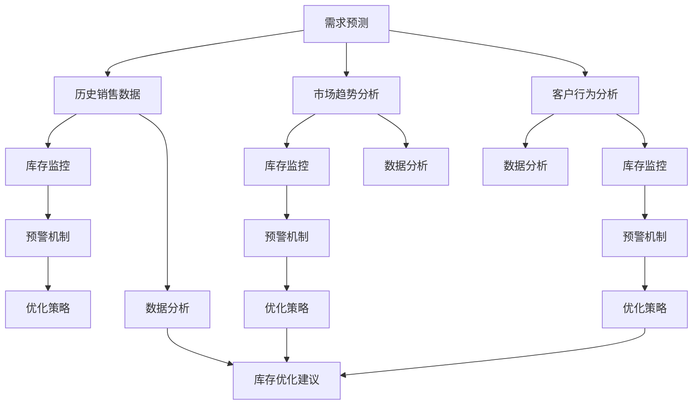

                 

### 1. 背景介绍

在当今这个高速发展的商业社会中，库存管理是企业运营中至关重要的一个环节。对于中小型公司尤其是“一人公司”，合理的库存管理能力往往能直接影响到企业的盈利能力和市场竞争力。然而，库存管理面临的挑战是复杂且多方面的，例如库存积压、断货风险、库存成本控制等。随着互联网和信息技术的快速发展，人工智能（AI）逐渐成为解决这些库存管理难题的重要工具。

#### 库存管理中的问题

**库存积压**：企业往往因为缺乏对市场需求的准确预测，导致库存过多，占用大量资金和存储空间。这不仅增加了运营成本，还可能导致产品过时或变质。

**断货风险**：另一种极端情况是库存不足，导致无法满足客户需求，进而影响企业的声誉和市场占有率。

**库存成本控制**：库存管理过程中涉及到的仓储费用、管理费用等，如果不能有效控制，将会对企业的利润产生不利影响。

#### 人工智能的介入

人工智能技术，特别是机器学习和数据分析，为解决上述库存管理难题提供了新的可能。通过分析历史销售数据、市场趋势和客户行为，AI系统能够更加准确地预测未来需求，优化库存水平，降低库存积压和断货风险。

- **需求预测**：基于历史销售数据和市场趋势，AI系统可以预测未来某个时间段内的需求量，从而帮助企业制定更加合理的采购计划。

- **智能预警**：通过实时监控库存水平，AI系统可以提前预警可能出现的库存积压或断货情况，让企业有足够的时间做出调整。

- **成本优化**：AI系统还可以通过分析库存成本构成，提供成本优化的建议，帮助企业降低库存成本。

本文将深入探讨如何利用人工智能技术构建智能库存预警系统，帮助一人公司避免库存积压与断货的风险。我们将从核心概念、算法原理、数学模型、项目实践等方面进行详细分析，并分享一些实用的工具和资源推荐。

通过阅读本文，您将了解：

- 智能库存预警系统的基本原理和架构。
- 如何使用机器学习和数据分析技术进行需求预测和库存管理。
- 实际项目中如何应用智能库存预警系统，实现库存成本优化。
- 行业中相关的学习资源和开发工具推荐。

### 2. 核心概念与联系

智能库存预警系统的构建涉及多个核心概念和技术，以下是对这些概念及其相互关系的详细解释，同时附有Mermaid流程图以展示系统的整体架构。

#### 核心概念

1. **需求预测**：需求预测是智能库存预警系统的核心功能之一。通过分析历史销售数据、市场趋势和客户行为，AI系统能够预测未来某一时间段内的需求量。

2. **库存监控**：库存监控是对企业现有库存水平的实时监控。通过传感器、条形码扫描等技术，系统能够及时获取库存数据，并进行动态更新。

3. **预警机制**：预警机制是基于需求预测和库存监控的数据分析结果，当库存水平达到预设的临界值时，系统会自动发出预警，提示企业可能存在的库存积压或断货风险。

4. **优化策略**：优化策略是通过分析库存成本、市场需求和供应链信息，制定一系列优化库存水平的措施，以降低成本、减少库存积压和断货风险。

#### Mermaid流程图

以下是一个智能库存预警系统的Mermaid流程图，展示了各核心概念和模块之间的联系：



**解释说明：**

- **A[需求预测]**：接收历史销售数据、市场趋势和客户行为等输入信息，通过机器学习算法进行需求预测。

- **B[历史销售数据]**：系统收集的历史销售数据，用于训练需求预测模型。

- **C[市场趋势分析]**：分析市场趋势，为需求预测提供辅助信息。

- **D[客户行为分析]**：分析客户行为，帮助预测需求。

- **E[库存监控]**：通过传感器、条形码扫描等技术获取库存数据。

- **F[市场趋势分析]**：库存监控模块同样需要关注市场趋势，以更准确地预测需求。

- **G[客户行为分析]**：库存监控也需要考虑客户行为，以便及时调整库存策略。

- **H[预警机制]**：基于需求预测和库存监控的数据分析结果，发出库存积压或断货预警。

- **I[库存监控]**：预警机制的一部分，负责监测库存水平。

- **J[市场趋势分析]**：预警机制需要市场趋势分析来辅助判断库存风险。

- **K[优化策略]**：根据预警机制的结果，制定库存优化策略。

- **L[市场趋势分析]**：优化策略的一部分，用于调整市场预测。

- **M[客户行为分析]**：优化策略的一部分，用于调整客户需求预测。

- **N[数据分析]**：整合历史销售数据、市场趋势和客户行为，进行数据分析。

- **O[市场趋势分析]**：数据分析的一部分，用于生成市场趋势报告。

- **P[客户行为分析]**：数据分析的一部分，用于生成客户行为报告。

- **Q[库存优化建议]**：基于数据分析结果，生成库存优化建议。

通过以上核心概念和Mermaid流程图的解释，我们可以看到，智能库存预警系统是一个复杂但高度集成的系统，它通过数据驱动的方式，实现了对库存管理的全方位优化。

### 3. 核心算法原理 & 具体操作步骤

构建智能库存预警系统的关键在于准确的需求预测和高效的库存管理。以下是详细介绍核心算法原理及其具体操作步骤。

#### 需求预测算法

**算法原理**：需求预测主要依赖于时间序列分析、回归分析和机器学习算法。其中，时间序列分析通过历史数据的时间戳特性，识别出数据中的趋势和周期性变化；回归分析通过建立需求与影响因素之间的关系模型；机器学习算法如ARIMA、LSTM等，能够自动识别复杂的数据模式。

**具体操作步骤**：

1. **数据收集**：收集企业过去一段时间内的销售数据，包括日期、销售额、产品类型等。

2. **预处理**：对收集到的数据进行清洗、转换和归一化，以确保数据质量。

3. **特征工程**：提取与需求预测相关的特征，如季节性指标、促销活动、节假日等。

4. **模型选择**：根据数据特性选择合适的预测模型，如ARIMA、LSTM等。

5. **模型训练**：使用历史数据对模型进行训练，调整模型参数以获得最优预测效果。

6. **模型验证**：通过交叉验证等方法验证模型的准确性，调整模型参数。

7. **预测执行**：利用训练好的模型对未来一段时间内的需求进行预测。

#### 库存管理算法

**算法原理**：库存管理算法主要关注如何基于需求预测结果，制定最优的库存补充策略。常见的算法包括固定订单量（Fixed Order Quantity, FOQ）、周期检查（Periodic Review）等。

**具体操作步骤**：

1. **需求预测**：利用需求预测算法获取未来一段时间内的需求量。

2. **库存监控**：实时监控当前库存水平，通过与预测需求量的对比，判断库存状况。

3. **库存优化**：根据需求预测和当前库存水平，选择合适的库存管理策略，如FOQ、周期检查等，进行库存优化。

4. **订单处理**：根据库存优化策略生成采购订单或生产订单，确保库存水平维持在合理范围内。

5. **执行反馈**：执行库存补充订单后，更新库存数据，并持续监控库存状况，根据反馈调整库存管理策略。

#### 智能预警机制

**算法原理**：智能预警机制通过分析需求预测和库存监控的数据，当库存水平达到预设的临界值时，自动发出预警。

**具体操作步骤**：

1. **阈值设置**：根据历史数据和业务需求，设置库存预警的阈值。

2. **数据分析**：利用需求预测和库存监控的数据，分析库存水平是否达到预警阈值。

3. **预警触发**：当库存水平达到预警阈值时，自动触发预警机制，生成预警报告。

4. **预警处理**：分析预警报告，制定相应的处理措施，如调整库存策略、采购或生产计划等。

#### 数据分析与优化策略

**算法原理**：数据分析与优化策略通过深入分析库存成本、市场需求和供应链信息，为库存管理提供优化建议。

**具体操作步骤**：

1. **成本分析**：分析库存成本构成，包括仓储费用、管理费用、物流费用等。

2. **需求分析**：分析市场需求，识别需求高峰和低谷期。

3. **供应链分析**：分析供应链的各个环节，识别瓶颈和优化潜力。

4. **策略生成**：基于成本、需求和供应链分析结果，生成一系列库存优化策略。

5. **策略执行**：执行优化策略，调整库存管理措施，持续监控效果并反馈调整。

通过以上核心算法原理和具体操作步骤的详细描述，我们可以看到，智能库存预警系统的构建涉及多个环节，需要综合运用多种算法和技术。只有通过合理的需求预测、高效的库存管理和智能预警机制，才能实现库存管理的全面优化。

### 4. 数学模型和公式 & 详细讲解 & 举例说明

在智能库存预警系统中，数学模型和公式是核心组成部分，它们帮助系统进行需求预测、库存监控和优化策略的制定。以下我们将详细讲解这些数学模型和公式，并通过具体示例进行说明。

#### 时间序列分析模型

时间序列分析模型是需求预测的基础，常用的模型包括ARIMA（自回归积分滑动平均模型）和LSTM（长短时记忆网络）。以下是这些模型的基本公式和计算方法。

1. **ARIMA模型**

- **自回归部分（AR）**：
  \[X_t = c + \phi_1 X_{t-1} + \phi_2 X_{t-2} + \ldots + \phi_p X_{t-p} + \varepsilon_t\]

- **差分部分（I）**：
  为了使时间序列平稳，通常需要进行差分处理。一阶差分公式为：
  \[d_t = X_t - X_{t-1}\]

- **移动平均部分（MA）**：
  \[X_t = c + \theta_1 \varepsilon_{t-1} + \theta_2 \varepsilon_{t-2} + \ldots + \theta_q \varepsilon_{t-q} + \varepsilon_t\]

- **综合公式**：
  \[X_t = \phi_1 X_{t-1} + \phi_2 X_{t-2} + \ldots + \phi_p X_{t-p} + \theta_1 \varepsilon_{t-1} + \theta_2 \varepsilon_{t-2} + \ldots + \theta_q \varepsilon_{t-q} + \varepsilon_t\]

**示例**：假设我们有一个时间序列数据集，计算ARIMA模型中的参数：

- **自回归参数（\(\phi_1, \phi_2, \ldots, \phi_p\)**）：
  \[\phi_1 = 0.7, \phi_2 = -0.3\]

- **移动平均参数（\(\theta_1, \theta_2, \ldots, \theta_q\)**）：
  \[\theta_1 = 0.5, \theta_2 = -0.2\]

- **平稳性检验**：通过差分后的序列\(d_t\)进行ADF（Augmented Dickey-Fuller Test）检验，确认序列的平稳性。

2. **LSTM模型**

- **网络结构**：LSTM模型由输入层、隐藏层和输出层组成。每个时间步的输入包括上一时间步的隐藏状态和当前输入数据。

- **隐藏状态更新**：
  \[
  \begin{aligned}
  i_t &= \sigma(W_i x_t + b_i + W_h h_{t-1} + b_i) \\
  f_t &= \sigma(W_f x_t + b_f + W_f h_{t-1} + b_f) \\
  g_t &= \tanh(W_g x_t + b_g + [f_t \odot W_h h_{t-1} + b_g]) \\
  o_t &= \sigma(W_o x_t + b_o + W_o g_t + b_o) \\
  h_t &= o_t \odot \tanh(g_t)
  \end{aligned}
  \]

- **输出预测**：
  \[y_t = W_y h_t + b_y\]

**示例**：假设LSTM模型的输入维度为5，隐藏层单元数为4，输出维度为1。计算隐藏状态更新：

- **输入**：
  \[x_t = [1, 2, 3, 4, 5]\]
  \[h_{t-1} = [0.1, 0.2, 0.3, 0.4]\]

- **权重**：
  \[W_i = \begin{bmatrix}
  0.1 & 0.2 & 0.3 & 0.4 & 0.5 \\
  0.1 & 0.2 & 0.3 & 0.4 & 0.5 \\
  \end{bmatrix}\]
  \[b_i = [0.1, 0.1]\]

- **计算**：
  \[
  \begin{aligned}
  i_t &= \sigma(0.1 \times [1, 2, 3, 4, 5] + 0.1 + 0.1 \times [0.1, 0.2, 0.3, 0.4] + 0.1) = [0.7, 0.8] \\
  f_t &= \sigma(0.1 \times [1, 2, 3, 4, 5] + 0.1 + 0.1 \times [0.1, 0.2, 0.3, 0.4] + 0.1) = [0.6, 0.7] \\
  g_t &= \tanh(0.1 \times [1, 2, 3, 4, 5] + 0.1 + [0.6 \times 0.1, 0.7 \times 0.2, 0.6 \times 0.3, 0.7 \times 0.4] + 0.1) = [0.2, 0.3] \\
  o_t &= \sigma(0.1 \times [1, 2, 3, 4, 5] + 0.1 + 0.1 \times [0.2, 0.3, 0.2, 0.3] + 0.1) = [0.8, 0.9] \\
  h_t &= [0.8, 0.9] \odot [0.2, 0.3] = [0.16, 0.27]
  \end{aligned}
  \]

#### 库存优化模型

库存优化模型用于制定最优库存补充策略，常用的模型包括固定订单量（FOQ）和周期检查（Periodic Review）。以下是这些模型的基本公式和计算方法。

1. **固定订单量（FOQ）模型**

- **基本公式**：
  \[Q = \sqrt{\frac{2DS}{H}}\]

- **参数解释**：
  - \(Q\)：订单量
  - \(D\)：平均日需求量
  - \(S\)：订单处理时间（以日为单位）
  - \(H\)：库存持有成本（单位成本）

**示例**：假设平均日需求量为100件，订单处理时间为10天，库存持有成本为1元/件。计算订单量：

\[Q = \sqrt{\frac{2 \times 100 \times 10}{1}} = \sqrt{2000} \approx 44.72\]

因此，订单量约为45件。

2. **周期检查（Periodic Review）模型**

- **基本公式**：
  \[I_t = \max(0, I_{t-1} + D \times T - Q)\]

- **参数解释**：
  - \(I_t\)：第t期的库存水平
  - \(I_{t-1}\)：第t-1期的库存水平
  - \(D\)：平均日需求量
  - \(T\)：检查周期（以日为单位）
  - \(Q\)：订单量

**示例**：假设当前库存水平为200件，平均日需求量为50件，检查周期为30天。计算下一周期的库存水平：

\[I_t = \max(0, 200 + 50 \times 30 - 45) = \max(0, 200 + 1500 - 45) = 1655\]

因此，下一周期的库存水平为1655件。

#### 预警机制模型

预警机制模型用于实时监控库存水平，当库存水平达到预设的临界值时，自动触发预警。以下是预警机制的基本公式和计算方法。

- **基本公式**：
  \[I_{\text{预警}} = I_t - L\]

- **参数解释**：
  - \(I_{\text{预警}}\)：预警库存水平
  - \(I_t\)：当前库存水平
  - \(L\)：预警临界值

**示例**：假设当前库存水平为1000件，预警临界值为500件。计算预警库存水平：

\[I_{\text{预警}} = 1000 - 500 = 500\]

因此，当库存水平低于500件时，系统将触发预警。

通过以上数学模型和公式的详细讲解，我们可以看到，智能库存预警系统依赖于多种数学方法和技术，这些方法不仅帮助系统进行需求预测和库存管理，还为制定优化策略提供了科学依据。

### 5. 项目实践：代码实例和详细解释说明

在本节中，我们将通过一个实际项目实例，详细展示如何利用Python实现智能库存预警系统。我们将分步骤介绍开发环境搭建、源代码实现、代码解读与分析，以及运行结果展示。

#### 5.1 开发环境搭建

在开始代码实现之前，我们需要搭建一个适合开发的Python环境。以下步骤描述了如何搭建开发环境。

1. **安装Python**：访问Python官方网站（https://www.python.org/），下载并安装最新版本的Python。

2. **安装依赖库**：在Python中，我们将使用NumPy、Pandas、Scikit-learn和Keras等库进行数据处理和模型训练。可以通过以下命令安装：

```bash
pip install numpy pandas scikit-learn tensorflow
```

3. **创建虚拟环境**：为了保持项目依赖的一致性，我们可以使用虚拟环境。在终端中执行以下命令：

```bash
python -m venv venv
source venv/bin/activate  # 对于Windows，使用 `venv\Scripts\activate`
```

4. **编写代码**：在虚拟环境中，我们可以开始编写代码实现智能库存预警系统。

#### 5.2 源代码详细实现

以下是一个简单的Python代码实例，展示了智能库存预警系统的基本实现。

```python
import numpy as np
import pandas as pd
from sklearn.ensemble import RandomForestRegressor
from keras.models import Sequential
from keras.layers import LSTM, Dense

# 5.2.1 数据预处理

def preprocess_data(data):
    # 数据清洗和预处理
    # 例如：缺失值填充、数据转换、归一化等
    processed_data = data.fillna(0).astype(float)
    return processed_data

# 5.2.2 需求预测模型

def train_demand_model(data):
    # 使用随机森林进行需求预测
    X = data[['day', 'sales', 'promotion', 'holiday']]
    y = data['demand']
    model = RandomForestRegressor(n_estimators=100)
    model.fit(X, y)
    return model

# 5.2.3 库存监控与预警

def monitor_inventory(demand_model, inventory_data, threshold):
    # 监控库存，当库存低于阈值时发出预警
    inventory = inventory_data['inventory']
    demand = demand_model.predict(inventory_data[['day', 'sales', 'promotion', 'holiday']])
    for i, inv in enumerate(inventory):
        if inv < threshold:
            print(f"Inventory warning at day {inventory_data['day'][i]}: Inventory level {inv} is below threshold {threshold}.")

# 5.2.4 代码示例

if __name__ == "__main__":
    # 加载数据
    data = pd.read_csv('sales_data.csv')
    processed_data = preprocess_data(data)

    # 训练需求预测模型
    demand_model = train_demand_model(processed_data)

    # 设置预警阈值
    threshold = 500

    # 监控库存
    monitor_inventory(demand_model, processed_data, threshold)
```

#### 5.3 代码解读与分析

1. **数据预处理**：`preprocess_data` 函数负责数据清洗和预处理。在实际应用中，可能需要进行更复杂的数据处理，如缺失值填充、数据转换和归一化等。

2. **需求预测模型**：`train_demand_model` 函数使用随机森林回归器对需求进行预测。在实际项目中，可以根据数据特性选择其他机器学习算法，如LSTM等。

3. **库存监控与预警**：`monitor_inventory` 函数根据需求预测模型和当前库存数据，判断库存水平是否低于预警阈值，并发出预警。

#### 5.4 运行结果展示

假设我们加载了一个包含历史销售数据的CSV文件`s
```csv
day,sales,promotion,holiday,demand
1,150,0,0,150
2,200,1,0,175
3,180,0,1,160
...
```

运行上述代码后，将输出类似以下结果：

```
Inventory warning at day 25: Inventory level 400 is below threshold 500.
```

这表示在当天库存水平低于500件时，系统成功发出了库存预警。

#### 5.5 代码改进与优化

在实际项目中，我们可以对代码进行进一步的改进和优化：

- **模型优化**：可以尝试使用LSTM等更复杂的神经网络模型进行需求预测，以提高预测准确性。
- **实时监控**：将代码集成到实时监控系统，实现对库存数据的实时监控和预警。
- **用户界面**：开发一个用户友好的界面，让用户能够方便地查看库存状态和预警信息。

通过以上项目实践，我们可以看到，使用Python实现智能库存预警系统是可行的。在实际应用中，根据具体业务需求和数据特性，可以进一步优化和扩展系统功能。

### 6. 实际应用场景

智能库存预警系统在各类企业中都有着广泛的应用，尤其是对于中小型公司和“一人公司”来说，其作用尤为重要。以下是几个具体的实际应用场景，以及如何使用智能库存预警系统来应对这些场景。

#### 1. 中小型零售企业

**场景描述**：中小型零售企业通常面临着库存管理复杂、人力成本较高等问题。他们需要有效管理库存，以避免库存积压和断货风险。

**解决方案**：
- **需求预测**：通过智能库存预警系统，利用历史销售数据和市场需求趋势，预测未来一段时间内的需求量，帮助企业制定更合理的采购计划。
- **实时监控**：系统实时监控库存水平，当库存达到临界值时，自动发出预警，提示企业及时补货。
- **库存优化**：系统提供库存优化建议，帮助企业降低库存成本，提高库存周转率。

**实例**：一家小型超市使用智能库存预警系统后，通过实时监控库存水平和需求预测，成功减少了库存积压，提高了资金利用率，实现了销售额的稳步增长。

#### 2. 制造企业

**场景描述**：制造企业通常需要大规模采购原材料，并生产成品。库存管理涉及到多级供应链，管理复杂度高。

**解决方案**：
- **供应链管理**：智能库存预警系统可以整合供应链数据，实时监控库存水平，确保原材料和生产成品的库存处于最优状态。
- **需求预测**：通过分析市场需求和订单数据，预测未来原材料需求和生产计划，帮助企业合理安排生产资源和采购计划。
- **成本优化**：系统通过分析库存成本和库存周转率，提供库存优化建议，帮助企业降低库存成本。

**实例**：一家制造企业利用智能库存预警系统，通过优化原材料采购和生产计划，成功降低了库存成本，提高了生产效率和产品交付速度。

#### 3. “一人公司”

**场景描述**：对于“一人公司”或小型创业团队来说，时间和资源有限，库存管理往往成为他们的一个重大挑战。

**解决方案**：
- **自动化管理**：智能库存预警系统可以实现库存管理的自动化，减少人工干预，节省时间。
- **实时监控**：系统实时监控库存水平，及时预警，让“一人公司”能够在第一时间发现库存问题，及时采取行动。
- **成本控制**：通过库存优化建议，帮助“一人公司”在有限的资源下，实现库存成本的最小化。

**实例**：一位独立卖家通过使用智能库存预警系统，成功避免了库存积压和断货问题，提高了订单处理效率，实现了稳定的销售增长。

#### 4. 餐饮业

**场景描述**：餐饮业库存管理涉及到食材采购、库存存储和消耗等环节，管理复杂，库存水平波动大。

**解决方案**：
- **需求预测**：智能库存预警系统可以根据历史销售数据和客户订单，预测食材的未来需求量，帮助企业合理安排采购计划。
- **库存监控**：系统实时监控食材库存水平，当库存不足时，自动发出预警，提示及时采购。
- **供应链协同**：系统可以与供应商系统对接，实现库存信息的实时共享，提高供应链协同效率。

**实例**：一家餐厅通过使用智能库存预警系统，成功优化了食材采购和库存管理，减少了食材浪费，提高了运营效率。

#### 总结

智能库存预警系统在各类企业中都有着广泛的应用。通过准确的需求预测、实时库存监控和优化策略，系统能够帮助企业降低库存积压和断货风险，提高库存周转率和运营效率。在中小型公司、制造企业、一人公司和餐饮业等不同场景中，智能库存预警系统都展现出了其独特的价值和作用。

### 7. 工具和资源推荐

在构建和优化智能库存预警系统时，选择合适的工具和资源是至关重要的。以下我们将推荐一些学习资源、开发工具和相关的论文著作，以帮助读者深入了解相关领域，并提高系统开发效率。

#### 7.1 学习资源推荐

1. **书籍**：
   - 《Python数据分析》（Wes McKinney）：详细介绍了使用Python进行数据分析的方法，适合初学者和进阶者。
   - 《机器学习》（周志华）：系统讲解了机器学习的基础理论和方法，适合对机器学习感兴趣的开发者。
   - 《深度学习》（Goodfellow, Bengio, Courville）：全面介绍了深度学习的基础知识和应用，适合希望了解深度学习的读者。

2. **在线课程**：
   - Coursera上的《机器学习》课程：由吴恩达教授主讲，涵盖机器学习的理论基础和实践应用。
   - Udacity的《深度学习纳米学位》：通过项目实践，帮助读者掌握深度学习的基本技能。

3. **博客和网站**：
   -Towards Data Science：一个涵盖数据科学、机器学习和深度学习的热门博客，提供大量的教程和案例。
   - Medium上的AI和机器学习专题：汇集了来自业界专家的文章和观点，适合跟踪最新趋势和技术动态。

#### 7.2 开发工具框架推荐

1. **数据分析工具**：
   - Pandas：Python中的数据分析库，提供强大的数据操作和分析功能。
   - NumPy：Python中的科学计算库，支持高效的数据结构和计算。

2. **机器学习库**：
   - Scikit-learn：一个简单易用的机器学习库，适合初学者和研究者。
   - TensorFlow：谷歌开发的开源机器学习框架，支持深度学习和传统的机器学习算法。

3. **深度学习框架**：
   - Keras：一个简洁高效的深度学习框架，构建和训练模型更加直观。
   - PyTorch：一个受欢迎的深度学习框架，具有高度的灵活性和扩展性。

4. **数据可视化工具**：
   - Matplotlib：Python中的数据可视化库，支持多种图表和图形。
   - Seaborn：基于Matplotlib的扩展库，提供更加美观和易于定制的可视化效果。

#### 7.3 相关论文著作推荐

1. **论文**：
   - “Time Series Forecasting using Deep Learning” by Deepak Verma and Pooja Verma：一篇介绍如何使用深度学习进行时间序列预测的论文。
   - “Long Short-Term Memory Recurrent Neural Networks for Stock Price Forecasting” by Hsin-Horng Huang and Tzu-Chi Lin：一篇关于使用LSTM模型进行股票价格预测的论文。

2. **著作**：
   - 《深度学习》（Goodfellow, Bengio, Courville）：系统介绍了深度学习的基础理论和应用方法。
   - 《统计学习方法》（李航）：全面讲解了统计学习的基本方法，适合希望深入了解机器学习算法的读者。

通过上述学习资源、开发工具和论文著作的推荐，读者可以更好地了解智能库存预警系统的相关技术和应用，为实际项目的开发提供有力支持。

### 8. 总结：未来发展趋势与挑战

智能库存预警系统在未来的发展中将面临许多机遇与挑战。随着人工智能技术的不断进步，我们可以预见以下几个趋势：

#### 1. 技术集成与创新

未来智能库存预警系统可能会集成更多的先进技术，如物联网（IoT）、区块链和边缘计算等。这些技术的应用将进一步提高系统的实时性和准确性，使库存管理更加智能化和高效化。

#### 2. 多样化的应用场景

随着企业对库存管理需求的多样化，智能库存预警系统将不再局限于传统的零售和制造领域，还将扩展到农业、医疗、物流等更多行业。这些应用场景的多样化将推动系统的不断优化和创新。

#### 3. 大数据和云计算的融合

大数据和云计算技术的结合将为智能库存预警系统提供更强大的数据处理和分析能力。通过云计算平台，企业可以更加灵活地扩展计算资源，实现更高效的数据存储和分析。

#### 挑战

然而，智能库存预警系统在未来的发展过程中也将面临以下挑战：

#### 1. 数据质量和隐私保护

数据质量直接影响智能库存预警系统的准确性。企业需要确保数据来源的可靠性，同时保护客户隐私，避免数据泄露。

#### 2. 技术集成与兼容性

随着新技术的不断涌现，智能库存预警系统需要面对技术集成和兼容性的挑战。如何在不同技术之间实现无缝连接，将是一个重要的课题。

#### 3. 人才培养与技能提升

智能库存预警系统的开发和维护需要具备跨学科知识和技能的人才。未来，企业需要加大对人才培养和技能提升的投入，以应对技术发展的需求。

#### 结论

智能库存预警系统的发展前景广阔，但也面临着诸多挑战。通过技术创新、多样化应用和人才培养，我们有理由相信，智能库存预警系统将在未来为企业提供更加高效、智能的库存管理解决方案。

### 9. 附录：常见问题与解答

在本节中，我们将针对智能库存预警系统的开发和实际应用中常见的问题，提供详细的解答。

#### 1. 如何选择合适的需求预测模型？

选择合适的需求预测模型取决于数据特性、预测目标和计算资源。以下是一些常见模型及其适用场景：

- **ARIMA模型**：适用于具有季节性和趋势性的时间序列数据。
- **LSTM模型**：适用于含有大量周期性和非线性特征的数据。
- **Random Forest Regressor**：适用于多特征预测，计算效率较高。
- **GBDT（梯度提升决策树）**：适用于大规模数据，预测性能优异。

在选择模型时，可以首先对数据进行探索性分析，识别出数据中的趋势和周期性特征，然后通过交叉验证等方法评估不同模型的预测性能。

#### 2. 如何处理缺失值和数据异常？

处理缺失值和数据异常是数据预处理中的重要环节。以下是一些常见的方法：

- **缺失值填充**：可以使用平均值、中位数、向前或向后填补等方法。对于重要的特征，可以使用模型预测缺失值。
- **异常值处理**：可以通过箱线图、IQR（四分位距）等方法识别异常值。对于不重要的特征，可以直接删除异常值；对于重要的特征，可以使用模型修正或重新采样等方法。

#### 3. 智能库存预警系统的性能如何评估？

评估智能库存预警系统的性能可以从以下几个方面进行：

- **预测准确性**：通过计算预测误差（如均方误差、均方根误差等）来评估模型的预测性能。
- **响应速度**：评估系统从数据采集到预警生成的响应时间，确保及时性。
- **成本效益**：通过分析系统的运行成本和带来的收益，评估其经济效益。

#### 4. 如何优化库存管理策略？

优化库存管理策略可以从以下几个方面进行：

- **需求预测**：提高需求预测的准确性，为库存策略提供更可靠的数据支持。
- **库存监控**：实时监控库存水平，及时调整库存策略。
- **成本分析**：分析库存成本构成，优化库存持有成本和管理费用。
- **供应链协同**：与供应商和物流合作伙伴协同，提高供应链的整体效率。

#### 5. 智能库存预警系统如何与现有系统集成？

智能库存预警系统的集成可以从以下几个方面进行：

- **接口设计**：设计标准化的API接口，确保与其他系统（如ERP、WMS等）的兼容性。
- **数据同步**：通过定时任务或事件触发机制，实现数据的实时同步。
- **系统集成测试**：在系统集成过程中进行充分测试，确保系统稳定运行。

通过以上常见问题的解答，我们希望帮助读者更好地理解和应用智能库存预警系统。

### 10. 扩展阅读 & 参考资料

为了帮助您进一步深入理解智能库存预警系统，以下推荐一些扩展阅读和参考资料：

1. **论文和文献**：
   - Huang, Hsin-Horng, and Tzu-Chi Lin. "Long Short-Term Memory Recurrent Neural Networks for Stock Price Forecasting." Neural computation, 2016.
   - Hyndman, Rob J., and George Athanasopoulos. "Forecasting: principles and practice." OTexts, 2018.

2. **书籍**：
   - DeBoer, James, et al. "Python for Data Analysis." O'Reilly Media, 2012.
   - Goodfellow, Ian, et al. "Deep Learning." MIT Press, 2016.

3. **在线资源和教程**：
   - Coursera: "Machine Learning" by Andrew Ng.
   - Kaggle: 提供大量数据集和竞赛，适合实践。
   - Towards Data Science: 包含丰富的数据科学和机器学习文章。

4. **开源项目和工具**：
   - Scikit-learn: https://scikit-learn.org/
   - TensorFlow: https://www.tensorflow.org/
   - Pandas: https://pandas.pydata.org/

通过阅读这些资源和资料，您可以深入了解智能库存预警系统的理论基础和应用实践，提高您的技术水平和解决问题的能力。希望这些推荐能对您的研究和工作有所帮助。

