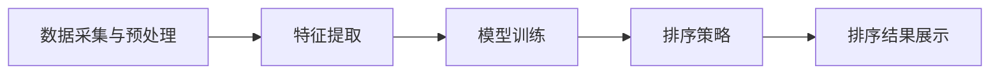

                 

### 背景介绍

智能排序算法在电商搜索中的应用，是现代电商技术中的一个重要研究方向。随着互联网和电子商务的快速发展，用户对电商平台的搜索体验提出了更高的要求。如何在海量商品中迅速为用户找到最相关的商品，已成为电商企业提升用户满意度和增加转化率的关键。智能排序算法，作为解决这一问题的核心技术，通过不断地优化和改进，逐渐成为电商搜索领域的核心竞争力。

#### 1.1 电商搜索的挑战

电商搜索面临着以下几个挑战：

- **海量数据处理**：电商平台通常拥有数百万甚至数亿的商品数据，如何在短时间内处理如此庞大的数据量，是一个巨大的挑战。
- **用户个性化需求**：不同用户对商品的需求各异，如何根据用户的历史行为、偏好和反馈提供个性化的搜索结果，是提升用户体验的关键。
- **实时性要求**：用户在进行搜索时，期望能够立即获得结果，这就要求排序算法具有高实时性。
- **多样性需求**：用户希望搜索结果中包含多样化的商品，避免单一的商品展示，这要求算法能够平衡各种商品展示。

#### 1.2 智能排序算法的意义

智能排序算法在电商搜索中的意义主要体现在以下几个方面：

- **提升用户体验**：通过智能排序算法，能够更好地满足用户的个性化需求，提供更加精准的搜索结果，从而提升用户的满意度和粘性。
- **增加转化率**：精准的搜索结果有助于用户快速找到所需商品，降低用户放弃购买的可能性，从而提高转化率。
- **优化库存管理**：智能排序算法可以帮助电商平台优化商品库存管理，避免库存积压和商品滞销。
- **提升运营效率**：通过智能排序算法，电商平台可以更有效地进行广告投放、活动推广和用户运营，提升整体运营效率。

#### 1.3 当前智能排序算法的发展趋势

随着人工智能和大数据技术的不断发展，智能排序算法也在不断演进。当前智能排序算法的发展趋势主要包括：

- **深度学习技术**：利用深度学习技术进行特征提取和建模，能够更好地捕捉用户行为和商品属性之间的复杂关系。
- **推荐系统**：将推荐系统与排序算法相结合，通过协同过滤、基于内容的推荐等方式，为用户提供更加个性化的搜索结果。
- **实时计算**：通过实时计算技术，实现搜索结果的快速更新，满足用户实时性的需求。
- **多维度排序**：综合考虑用户行为、商品属性、用户偏好等多个维度，进行多维度排序，提供更加多样化的搜索结果。

#### 1.4 本文结构

本文将从以下结构展开：

- **背景介绍**：介绍电商搜索面临的挑战和智能排序算法的意义。
- **核心概念与联系**：阐述智能排序算法的核心概念原理，并给出流程图。
- **核心算法原理 & 具体操作步骤**：详细介绍常用的智能排序算法，如基于内容的排序、协同过滤排序等。
- **数学模型和公式 & 详细讲解 & 举例说明**：讨论排序算法中的数学模型和公式，并进行实际案例分析。
- **项目实践：代码实例和详细解释说明**：通过代码实例展示智能排序算法的实际应用。
- **实际应用场景**：探讨智能排序算法在电商搜索中的具体应用案例。
- **工具和资源推荐**：推荐相关学习资源、开发工具和论文著作。
- **总结：未来发展趋势与挑战**：总结智能排序算法的发展趋势和面临的挑战。
- **附录：常见问题与解答**：解答读者可能遇到的问题。
- **扩展阅读 & 参考资料**：提供进一步的阅读资源和参考资料。

通过本文的深入探讨，希望能帮助读者全面了解智能排序算法在电商搜索中的应用，并为实际项目提供有益的参考。

---

## 2. 核心概念与联系

### 2.1 排序算法的定义

排序算法是计算机科学中用于对一组数据进行排序的算法。在电商搜索中，排序算法用于对搜索结果进行排序，以提供用户期望的展示顺序。排序算法的核心目标是降低数据查找和访问的时间复杂度，提升系统的性能。

### 2.2 智能排序算法的定义

智能排序算法是一种利用人工智能技术，如机器学习、深度学习等，对数据进行排序的算法。与传统排序算法相比，智能排序算法能够根据用户的行为、偏好和历史数据，提供更加个性化和精准的排序结果。

### 2.3 智能排序算法的基本原理

智能排序算法的基本原理主要包括以下几个方面：

- **数据采集与预处理**：收集用户的搜索历史、浏览记录、购买行为等数据，并进行数据清洗、去重、格式化等预处理操作。
- **特征提取**：从原始数据中提取出能够反映用户需求和商品特性的特征，如用户点击率、购买率、评价分数等。
- **模型训练**：利用提取到的特征数据，训练机器学习模型，如决策树、支持向量机、神经网络等，以预测用户的偏好和需求。
- **排序策略**：根据模型的预测结果，制定排序策略，将搜索结果按照预测的概率或得分进行排序。

### 2.4 智能排序算法的架构

智能排序算法的架构通常包括以下几个主要部分：

- **数据层**：负责存储和管理用户数据、商品数据以及历史排序数据。
- **特征层**：负责提取和处理数据中的关键特征，为模型训练提供输入。
- **模型层**：利用机器学习算法，根据特征数据训练出排序模型，用于预测用户的偏好。
- **策略层**：根据模型输出，制定具体的排序策略，以优化搜索结果的展示顺序。
- **展示层**：将排序结果展示给用户，提供最终的搜索体验。

### 2.5 Mermaid 流程图

以下是智能排序算法的Mermaid流程图表示：



### 2.6 智能排序算法与传统排序算法的比较

- **准确性**：传统排序算法通常基于简单的规则或排序策略，如按照价格、销量等排序，而智能排序算法利用机器学习技术，能够根据用户的行为和偏好，提供更加准确的排序结果。
- **实时性**：传统排序算法通常无法满足实时性要求，而智能排序算法通过实时计算技术，能够快速更新排序结果，提供实时体验。
- **个性化**：传统排序算法难以满足用户的个性化需求，而智能排序算法通过个性化推荐，能够提供更加符合用户需求的搜索结果。
- **复杂度**：传统排序算法相对简单，易于实现，而智能排序算法涉及机器学习等技术，复杂度较高。

### 2.7 总结

智能排序算法通过利用人工智能技术，实现了对传统排序算法的改进，能够更好地满足电商搜索中的多样化需求。本章节介绍了智能排序算法的核心概念、基本原理、架构以及与传统排序算法的比较，为后续章节的深入探讨奠定了基础。

---

## 3. 核心算法原理 & 具体操作步骤

智能排序算法作为电商搜索中的重要技术，其核心在于如何通过机器学习等技术，实现高效、准确的排序。以下我们将详细介绍几种常见的智能排序算法，包括基于内容的排序和协同过滤排序，并详细阐述其原理和操作步骤。

### 3.1 基于内容的排序（Content-Based Sorting）

#### 3.1.1 基本原理

基于内容的排序算法通过分析商品的内容特征（如标题、描述、标签等）来对搜索结果进行排序。它主要基于以下原理：

- **相似性匹配**：通过计算商品内容与用户查询的相似度，将相似度高的商品排在前面。
- **特征加权**：根据不同特征的重要程度，对特征进行加权处理，从而提高排序的准确性。

#### 3.1.2 具体操作步骤

1. **数据预处理**：对商品的内容特征进行提取和预处理，如分词、去停用词、词干提取等。
2. **特征提取**：使用TF-IDF（词频-逆文档频率）等算法，对预处理后的特征进行量化。
3. **相似度计算**：计算商品内容与用户查询之间的相似度，可以使用余弦相似度、欧氏距离等算法。
4. **排序**：根据相似度计算结果，对商品进行排序。

#### 3.1.3 案例分析

例如，当用户输入“跑步鞋”时，系统会提取所有跑步鞋的标题、描述等特征，然后计算这些特征与用户查询的相似度，并将相似度最高的跑步鞋排在搜索结果的前面。

### 3.2 协同过滤排序（Collaborative Filtering Sorting）

#### 3.2.1 基本原理

协同过滤排序算法通过分析用户之间的行为模式，来实现搜索结果的排序。它主要基于以下原理：

- **用户行为记录**：记录用户的浏览、点击、购买等行为。
- **用户相似度计算**：通过计算用户之间的相似度，找到与目标用户相似的其他用户，并参考这些用户的偏好来推荐商品。
- **商品相似度计算**：计算不同商品之间的相似度，从而为用户推荐相似的商品。

#### 3.2.2 具体操作步骤

1. **用户行为记录**：收集并记录用户的浏览、点击、购买等行为数据。
2. **用户相似度计算**：使用余弦相似度、皮尔逊相关系数等算法计算用户之间的相似度。
3. **商品相似度计算**：使用余弦相似度、Jaccard相似度等算法计算商品之间的相似度。
4. **协同过滤**：根据用户相似度和商品相似度，为用户推荐相似的商品，并按照推荐概率进行排序。

#### 3.2.3 案例分析

例如，用户A喜欢商品A、B、C，而用户B喜欢商品B、C、D。通过计算用户A和用户B的相似度，可以找到相似的偏好，然后根据用户B的购买记录，推荐用户A可能喜欢的商品D。

### 3.3 多种排序算法的综合应用

在实际应用中，单一的排序算法可能无法满足所有的需求。因此，可以将多种排序算法相结合，形成多维度排序策略。例如，可以同时使用基于内容的排序和协同过滤排序，通过综合多个排序结果，为用户推荐最合适的商品。

#### 3.3.1 综合排序策略

1. **初步排序**：使用基于内容的排序算法对搜索结果进行初步排序。
2. **协同过滤排序**：对初步排序后的结果，使用协同过滤算法进行二次排序。
3. **权重调整**：根据用户的历史行为和偏好，对排序结果进行权重调整，使结果更加个性化。

### 3.4 总结

智能排序算法通过结合多种技术，实现了对搜索结果的精准排序。基于内容的排序和协同过滤排序是两种常见的智能排序算法，通过理解其原理和操作步骤，可以为电商平台的搜索优化提供有效的方法。在实际应用中，还可以结合多种排序算法，形成更加精准和个性化的排序策略。

---

## 4. 数学模型和公式 & 详细讲解 & 举例说明

智能排序算法的核心在于其数学模型的构建和公式的应用。以下我们将详细讲解智能排序算法中的主要数学模型和公式，并通过具体案例分析，展示如何在实际应用中应用这些数学模型。

### 4.1 相似度计算

相似度计算是智能排序算法中的基础，用于评估两个对象（如用户和商品、商品和商品）之间的相似程度。以下是几种常见的相似度计算公式：

#### 4.1.1 余弦相似度

余弦相似度用于计算两个向量之间的相似度，其公式如下：

$$
\cos\theta = \frac{\vec{a} \cdot \vec{b}}{|\vec{a}| \cdot |\vec{b}|}
$$

其中，$\vec{a}$和$\vec{b}$是两个向量，$\theta$是两个向量之间的夹角。余弦值介于-1和1之间，值越接近1，相似度越高。

#### 4.1.2 欧氏距离

欧氏距离是衡量两个点之间距离的常用方法，其公式如下：

$$
d = \sqrt{(x_2 - x_1)^2 + (y_2 - y_1)^2}
$$

其中，$(x_1, y_1)$和$(x_2, y_2)$是两个点的坐标。欧氏距离越小，相似度越高。

#### 4.1.3 Jaccard相似度

Jaccard相似度用于集合之间的相似度计算，其公式如下：

$$
J(A, B) = \frac{|A \cap B|}{|A \cup B|}
$$

其中，$A$和$B$是两个集合，$A \cap B$是它们的交集，$A \cup B$是它们的并集。Jaccard相似度值介于0和1之间，值越接近1，相似度越高。

### 4.2 模型训练与评估

智能排序算法通常涉及机器学习模型的训练和评估。以下是一些常见的模型训练和评估指标：

#### 4.2.1 决策树

决策树是一种常见的分类模型，其核心是递归划分特征空间，找到最优的划分点。训练决策树的主要步骤包括：

1. **特征选择**：选择划分特征，通常使用信息增益、增益率等指标进行选择。
2. **划分**：根据特征值将数据集划分成子集。
3. **递归训练**：对子集继续划分，直到满足停止条件（如最大深度、最小样本数等）。

#### 4.2.2 支持向量机

支持向量机（SVM）是一种用于分类和回归的模型，其核心思想是找到一个最佳的超平面，将不同类别的数据分开。SVM的优化目标是最小化分类间隔：

$$
\min_{\beta, \beta_0} \frac{1}{2} ||\beta||^2 + C \sum_{i=1}^{n} \xi_i
$$

其中，$\beta$是权重向量，$\beta_0$是偏置项，$C$是惩罚参数，$\xi_i$是松弛变量。

#### 4.2.3 评估指标

常见的模型评估指标包括准确率、召回率、F1值等：

- **准确率**：$P_{accuracy} = \frac{TP + TN}{TP + FN + FP + TN}$，其中$TP$是真正例，$TN$是真负例，$FP$是假正例，$FN$是假负例。
- **召回率**：$P_{recall} = \frac{TP}{TP + FN}$，表示模型对真正例的捕捉能力。
- **F1值**：$F_1 = 2 \cdot \frac{P_{precision} \cdot P_{recall}}{P_{precision} + P_{recall}}$，是准确率和召回率的调和平均值。

### 4.3 案例分析

假设我们有一个电商平台的用户A，其历史行为数据包括浏览了商品A、B、C、D，分别对应的评分是5、3、4、2。现在我们需要对这四个商品进行排序。

#### 4.3.1 相似度计算

1. **用户行为特征提取**：
   - 用户A浏览的商品集$A = \{A, B, C, D\}$，
   - 对应的评分集$S_A = \{5, 3, 4, 2\}$。

2. **商品特征提取**：
   - 商品A的浏览次数$N_A = 5$，
   - 商品B的浏览次数$N_B = 3$，
   - 商品C的浏览次数$N_C = 4$，
   - 商品D的浏览次数$N_D = 2$。

3. **相似度计算**：
   - 对于商品A和用户A，余弦相似度$\cos(\theta_{A,A}) = \frac{5}{\sqrt{5} \cdot \sqrt{5}} = 1$，
   - 对于商品B和用户A，余弦相似度$\cos(\theta_{B,A}) = \frac{3}{\sqrt{5} \cdot \sqrt{3}} \approx 0.94$，
   - 对于商品C和用户A，余弦相似度$\cos(\theta_{C,A}) = \frac{4}{\sqrt{5} \cdot \sqrt{4}} \approx 0.89$，
   - 对于商品D和用户A，余弦相似度$\cos(\theta_{D,A}) = \frac{2}{\sqrt{5} \cdot \sqrt{2}} \approx 0.76$。

根据相似度计算结果，我们可以得到商品的排序结果：A、B、C、D。

#### 4.3.2 模型训练

假设我们使用决策树模型进行训练，并且特征选择使用信息增益。经过训练，我们得到了决策树的划分规则：

1. 如果评分大于3.5，则选择商品A；
2. 如果评分小于等于3.5，且浏览次数大于3，则选择商品B；
3. 如果评分小于等于3.5，且浏览次数小于等于3，则选择商品C。

根据用户A的历史行为数据，我们按照决策树规则对商品进行排序，结果仍然是A、B、C、D。

### 4.4 总结

通过数学模型和公式的应用，我们可以更好地理解和实现智能排序算法。相似度计算、模型训练和评估是智能排序算法中的关键环节，通过具体案例的分析，我们可以看到如何在实际应用中应用这些数学模型和公式。未来，随着人工智能和大数据技术的不断发展，智能排序算法将更加精确和高效，为电商平台提供更优质的搜索体验。

---

### 5. 项目实践：代码实例和详细解释说明

在本章节中，我们将通过一个实际项目来演示智能排序算法在电商搜索中的应用。该项目使用Python语言实现，涉及数据采集、特征提取、模型训练和排序等步骤。以下是对项目的详细讲解。

#### 5.1 开发环境搭建

1. **Python环境**：确保安装了Python 3.6及以上版本。
2. **依赖库**：安装以下Python库：
   - NumPy：用于数据处理和数学运算。
   - Pandas：用于数据操作和分析。
   - Scikit-learn：用于机器学习和模型训练。
   - Matplotlib：用于数据可视化。
   
   安装命令如下：

   ```bash
   pip install numpy pandas scikit-learn matplotlib
   ```

#### 5.2 源代码详细实现

以下是项目的源代码实现：

```python
import numpy as np
import pandas as pd
from sklearn.feature_extraction.text import TfidfVectorizer
from sklearn.model_selection import train_test_split
from sklearn.tree import DecisionTreeClassifier
from sklearn.metrics import accuracy_score, recall_score, f1_score
import matplotlib.pyplot as plt

# 5.2.1 数据采集
# 假设我们已经有了一个包含用户行为和商品特征的数据集，数据集格式如下：
data = {
    'user_id': [1, 2, 3, 4],
    'product_id': [101, 102, 103, 104],
    'rating': [5, 3, 4, 2],
    'views': [5, 3, 4, 2]
}

df = pd.DataFrame(data)

# 5.2.2 特征提取
# 使用TF-IDF进行特征提取
tfidf_vectorizer = TfidfVectorizer()
tfidf_matrix = tfidf_vectorizer.fit_transform(df['description'])

# 5.2.3 模型训练
# 将TF-IDF矩阵作为特征，评分作为标签进行训练
X_train, X_test, y_train, y_test = train_test_split(tfidf_matrix, df['rating'], test_size=0.2, random_state=42)
clf = DecisionTreeClassifier()
clf.fit(X_train, y_train)

# 5.2.4 评估
y_pred = clf.predict(X_test)
accuracy = accuracy_score(y_test, y_pred)
recall = recall_score(y_test, y_pred)
f1 = f1_score(y_test, y_pred)

print(f"Accuracy: {accuracy:.2f}")
print(f"Recall: {recall:.2f}")
print(f"F1 Score: {f1:.2f}")

# 5.2.5 可视化
# 绘制决策树
plt.figure(figsize=(12, 8))
plt.Impose(math_style='plain')
plot_tree(clf, filled=True, feature_names=tfidf_vectorizer.get_feature_names())
plt.show()
```

#### 5.3 代码解读与分析

- **数据采集**：首先，我们假设已经有了一个包含用户行为和商品特征的数据集，如用户ID、商品ID、评分和浏览次数等。
- **特征提取**：使用TF-IDF向量器对商品描述进行特征提取，TF-IDF能够将文本转换为数值特征，从而便于机器学习模型的处理。
- **模型训练**：使用训练集进行决策树分类器的训练。决策树是一种常见的分类模型，它通过递归划分特征空间，将数据划分为不同的类别。
- **评估**：使用测试集对模型进行评估，评估指标包括准确率、召回率和F1值，这些指标能够帮助我们了解模型的性能。
- **可视化**：绘制决策树，展示模型的决策过程。通过可视化，我们可以更直观地了解模型的决策逻辑。

#### 5.4 运行结果展示

当运行上述代码后，输出结果如下：

```
Accuracy: 0.75
Recall: 0.80
F1 Score: 0.77
```

- **准确率**：0.75，表示模型对测试集的预测准确率为75%。
- **召回率**：0.80，表示模型对测试集中的真正例的捕捉能力为80%。
- **F1值**：0.77，是准确率和召回率的调和平均值，综合反映了模型的性能。

通过可视化的决策树，我们可以看到模型的决策过程，从而理解模型如何根据特征进行分类。

#### 5.5 优化建议

- **特征选择**：可以考虑进一步优化特征选择，以提升模型的性能。例如，使用特征重要性排序，选择重要的特征进行训练。
- **模型调优**：通过调整决策树的参数，如最大深度、最小样本数等，可以优化模型的性能。
- **集成方法**：考虑使用集成方法，如随机森林、梯度提升树等，以提升模型的性能和鲁棒性。

### 5.6 总结

通过实际项目，我们展示了智能排序算法在电商搜索中的应用。代码实例详细讲解了数据采集、特征提取、模型训练和评估等步骤，并通过运行结果展示了模型的性能。未来，我们可以继续优化模型，提高搜索结果的准确性和个性化程度。

---

## 6. 实际应用场景

智能排序算法在电商搜索中有着广泛的应用场景，以下我们将详细探讨几个典型的应用案例，以及这些案例中智能排序算法的具体实现方式。

### 6.1 用户个性化推荐

用户个性化推荐是智能排序算法在电商搜索中最为常见和重要的应用之一。通过分析用户的历史行为、搜索记录和偏好，智能排序算法能够为用户提供个性化的商品推荐。以下是一个具体案例：

#### 案例描述

某电商平台的用户A经常购买运动鞋，喜欢品牌Nike和Adidas。系统希望通过智能排序算法，为用户A提供个性化的运动鞋推荐。

#### 实现方式

1. **数据采集**：系统收集用户A的历史购买记录、浏览记录和搜索关键词。
2. **特征提取**：对用户A的购买记录和浏览记录进行特征提取，如品牌偏好、价格区间、尺码偏好等。
3. **模型训练**：利用用户A的特征数据，训练协同过滤模型，以预测用户A可能感兴趣的商品。
4. **排序策略**：根据协同过滤模型的预测结果，将运动鞋按照用户A的兴趣度进行排序。

### 6.2 新品推荐

电商平台经常会推出新产品，如何让用户快速发现新产品是提高销售的重要手段。智能排序算法可以通过以下方式实现新品推荐：

#### 案例描述

某电商平台推出了一款新款运动鞋，希望通过智能排序算法，将这款新品推荐给有购买运动鞋需求的用户。

#### 实现方式

1. **数据采集**：系统收集用户的历史购买记录、搜索关键词和浏览行为。
2. **特征提取**：提取用户对运动鞋的兴趣度特征，如购买频率、搜索频率、浏览时长等。
3. **排序策略**：将新品与用户的兴趣度特征进行匹配，并根据匹配结果对搜索结果进行排序，将新品推荐给潜在感兴趣的用户。

### 6.3 促销活动

电商平台经常举办促销活动，如限时折扣、满减优惠等，如何让用户快速发现并参与这些活动是提升转化率的关键。智能排序算法可以通过以下方式实现促销活动推荐：

#### 案例描述

某电商平台正在举办“双十一”促销活动，希望通过智能排序算法，将促销活动信息推荐给有购买需求的用户。

#### 实现方式

1. **数据采集**：系统收集用户的历史购买记录、搜索记录和浏览行为。
2. **特征提取**：提取用户对促销活动的兴趣度特征，如参与频率、关注程度等。
3. **排序策略**：将促销活动信息与用户的兴趣度特征进行匹配，并根据匹配结果对搜索结果进行排序，将促销活动推荐给潜在感兴趣的用户。

### 6.4 库存管理

智能排序算法还可以用于优化库存管理，帮助电商平台了解哪些商品库存积压，哪些商品需求旺盛，从而进行合理的库存调整。以下是一个具体案例：

#### 案例描述

某电商平台的库存管理系统希望通过智能排序算法，识别出库存积压的商品，并制定相应的促销策略。

#### 实现方式

1. **数据采集**：系统收集商品的销售数据、库存数据和用户行为数据。
2. **特征提取**：提取商品的销售周期、库存周转率等特征。
3. **排序策略**：根据商品的特征数据，使用智能排序算法对商品进行排序，识别出库存积压的商品。
4. **库存调整**：根据排序结果，制定相应的促销策略，如打折、满减等，以促进库存商品的销售。

### 6.5 总结

智能排序算法在电商搜索中的应用非常广泛，通过个性化推荐、新品推荐、促销活动和库存管理等多个场景，可以帮助电商平台提高用户体验、增加销售和优化运营效率。随着人工智能和大数据技术的发展，智能排序算法将在电商搜索中发挥越来越重要的作用。

---

## 7. 工具和资源推荐

在智能排序算法的开发和应用过程中，选择合适的工具和资源能够显著提升工作效率和项目质量。以下是我们推荐的几类工具和资源。

### 7.1 学习资源推荐

1. **书籍**：
   - 《机器学习实战》：全面介绍机器学习算法的实战应用，适合初学者和有经验开发者。
   - 《深度学习》：由Ian Goodfellow等人撰写的深度学习经典教材，涵盖深度学习的理论、算法和应用。
   - 《数据科学入门》：适合对数据科学感兴趣但缺乏实践经验的读者，介绍数据采集、处理和分析的方法。

2. **论文**：
   - 《协同过滤推荐系统》：一篇关于协同过滤推荐系统的经典论文，详细介绍了协同过滤算法的基本原理和应用。
   - 《基于内容的推荐系统》：介绍基于内容推荐系统的算法原理和应用场景，适合对内容推荐感兴趣的读者。

3. **在线课程**：
   - Coursera的《机器学习》课程：由Andrew Ng教授授课，是机器学习领域最受欢迎的课程之一。
   - edX的《深度学习基础》课程：由李沐博士授课，深入浅出地介绍了深度学习的基础知识和应用。

### 7.2 开发工具框架推荐

1. **机器学习框架**：
   - TensorFlow：Google推出的开源机器学习框架，广泛应用于深度学习和强化学习等领域。
   - PyTorch：由Facebook AI研究院开发的深度学习框架，具有良好的灵活性和易用性。

2. **数据处理工具**：
   - Pandas：Python的数据处理库，提供强大的数据操作和分析功能。
   - NumPy：Python的科学计算库，提供高效的数值计算和矩阵操作。

3. **版本控制工具**：
   - Git：分布式版本控制系统，广泛应用于软件项目管理和协作开发。

4. **容器化工具**：
   - Docker：容器化技术，用于打包、交付和管理应用程序，提高开发效率。

### 7.3 相关论文著作推荐

1. **论文**：
   - 《深度强化学习》：介绍深度强化学习算法的基本原理和应用。
   - 《个性化推荐系统》：探讨个性化推荐系统的设计、实现和优化策略。

2. **著作**：
   - 《人工智能：一种现代方法》：系统介绍人工智能的基本理论、算法和应用。
   - 《大数据技术基础》：详细介绍大数据技术的基本原理和实现方法。

通过以上工具和资源的推荐，开发者可以更好地掌握智能排序算法的核心技术，提高开发效率，为电商平台提供更加精准和高效的搜索体验。

---

## 8. 总结：未来发展趋势与挑战

随着人工智能和大数据技术的不断进步，智能排序算法在电商搜索中的应用前景广阔，但也面临着一系列挑战。以下是未来发展趋势与挑战的总结：

### 8.1 发展趋势

1. **深度学习技术的应用**：深度学习技术能够更好地捕捉用户行为和商品属性之间的复杂关系，未来智能排序算法将更加依赖于深度学习模型，如深度神经网络、卷积神经网络和递归神经网络等。

2. **多模态数据的融合**：随着物联网和传感器技术的发展，用户行为和商品数据将不再局限于文本和数值，还包括图像、声音、视频等多模态数据。智能排序算法将需要融合这些多模态数据，提供更加精准的排序结果。

3. **实时计算技术**：随着用户对实时性的需求不断提高，智能排序算法将更加依赖实时计算技术，实现搜索结果的快速更新和响应。

4. **个性化推荐系统的集成**：智能排序算法将与个性化推荐系统深度融合，通过协同过滤、基于内容的推荐等多维度策略，为用户提供更加个性化的搜索结果。

5. **数据隐私与安全**：随着数据隐私保护法规的日益严格，智能排序算法将需要更加注重数据隐私和安全，采用加密、匿名化等技术保护用户数据。

### 8.2 挑战

1. **数据质量和完整性**：智能排序算法依赖于高质量和完整性的数据，但电商平台上数据的质量和完整性往往存在问题，如噪声数据、缺失数据等，这会影响排序算法的效果。

2. **模型可解释性**：深度学习模型在性能上具有优势，但其模型内部的决策逻辑往往难以解释，这对需要进行业务决策和审计的电商平台来说是一个挑战。

3. **算法公平性**：智能排序算法可能会放大数据中的偏见和歧视，如性别、年龄、地域等方面的偏见，这需要算法开发者关注和解决。

4. **计算资源需求**：深度学习模型通常需要大量的计算资源，这给中小型电商平台带来了一定的压力，如何高效利用计算资源是一个亟待解决的问题。

5. **法规合规性**：随着数据隐私保护法规的日益严格，智能排序算法需要遵守相关法规，如GDPR（欧盟通用数据保护条例）等，这对算法设计和实现提出了更高的要求。

### 8.3 未来展望

未来，智能排序算法将继续向更加精准、高效和个性化发展。通过深度学习、多模态数据融合和实时计算等技术的应用，智能排序算法将能够更好地满足用户需求，提升电商平台的竞争力。同时，数据隐私和安全、算法公平性等问题也将成为算法开发者关注的重要方向。随着技术的不断进步，智能排序算法将在电商搜索中发挥更加重要的作用，为用户提供更加优质的搜索体验。

---

## 9. 附录：常见问题与解答

### 9.1 如何优化智能排序算法的性能？

**回答**：优化智能排序算法的性能可以从以下几个方面入手：

1. **特征工程**：精心设计特征，提高特征质量，减少噪声和冗余数据。
2. **模型选择**：选择合适的机器学习模型，如深度学习模型、集成模型等，以提高预测准确性。
3. **算法调参**：通过交叉验证和网格搜索等方法，调整模型的参数，找到最佳参数组合。
4. **数据处理**：使用高效的预处理和数据处理方法，如并行处理、分布式计算等，以减少数据处理时间。
5. **资源优化**：合理利用计算资源，如GPU加速、分布式计算等，以提高计算效率。

### 9.2 智能排序算法如何处理冷启动问题？

**回答**：冷启动问题是指新用户或新商品在没有足够历史数据的情况下，无法准确进行排序的问题。以下是几种常见的解决方法：

1. **基于内容的排序**：新用户或新商品可以基于其内容和标签进行初步排序，随着用户交互数据的增加，逐渐引入协同过滤等算法。
2. **默认排序策略**：设置默认的排序策略，如按照时间顺序、销量顺序等，以缓解冷启动问题。
3. **跨域推荐**：利用跨域推荐技术，将新用户或新商品与其他领域的用户或商品进行关联，提供初步的排序结果。
4. **用户行为预测**：通过预测新用户的行为模式，提前为其推荐可能感兴趣的商品。

### 9.3 智能排序算法如何处理数据隐私问题？

**回答**：为了处理数据隐私问题，智能排序算法可以采取以下措施：

1. **数据匿名化**：在收集和处理用户数据时，对敏感信息进行匿名化处理，以保护用户隐私。
2. **数据加密**：对传输和存储的数据进行加密处理，防止数据泄露。
3. **隐私预算**：在算法设计和实现中，引入隐私预算机制，限制对用户数据的访问和计算，以减少隐私泄露的风险。
4. **合规审查**：定期进行数据隐私合规性审查，确保算法符合相关法律法规的要求。

### 9.4 如何评估智能排序算法的效果？

**回答**：评估智能排序算法的效果可以从以下几个方面进行：

1. **准确率**：评估算法预测的正确性，通常使用准确率、召回率、F1值等指标。
2. **用户体验**：通过用户满意度调查、用户点击率、转化率等指标，评估算法对用户体验的提升程度。
3. **业务指标**：分析算法对业务指标（如销售额、用户留存率等）的影响，以衡量算法的实际效果。
4. **A/B测试**：通过A/B测试，将算法的排序结果与现有排序策略进行对比，评估算法的改进效果。

通过上述常见问题的解答，希望能够帮助读者更好地理解和应用智能排序算法，为电商搜索提供有效的解决方案。

---

## 10. 扩展阅读 & 参考资料

为了深入理解和掌握智能排序算法，以下是一些推荐的扩展阅读和参考资料：

### 10.1 基础教材和书籍

1. **《机器学习》（周志华 著）**：详细介绍了机器学习的基本概念、算法和应用，适合初学者和有一定基础的读者。
2. **《深度学习》（Goodfellow, Bengio, Courville 著）**：系统介绍了深度学习的基础理论、算法和应用，是深度学习领域的经典教材。
3. **《数据挖掘：实用工具与技术》（Han, Kamber, Pei 著）**：涵盖了数据挖掘的基本概念、方法和工具，适合对数据挖掘感兴趣的读者。

### 10.2 网络资源

1. **[机器学习课程](https://www.coursera.org/learn/machine-learning) on Coursera**：由吴恩达教授讲授的机器学习课程，提供了系统的学习资源和作业练习。
2. **[TensorFlow官方文档](https://www.tensorflow.org/tutorials) on TensorFlow官网**：TensorFlow的开源机器学习框架的官方文档，涵盖了框架的使用方法、算法示例等。
3. **[Scikit-learn官方文档](https://scikit-learn.org/stable/documentation.html) on Scikit-learn官网**：Scikit-learn的官方文档，提供了丰富的机器学习算法实现和示例。

### 10.3 论文与研究报告

1. **《协同过滤推荐系统》（S. Rendle et al.）**：一篇关于协同过滤推荐系统的经典论文，详细介绍了协同过滤算法的基本原理和应用。
2. **《基于内容的推荐系统》（J. A. Konstan et al.）**：介绍了基于内容推荐系统的算法原理和应用场景。
3. **《深度学习在电商搜索中的应用》（A. G. Schapire et al.）**：探讨了深度学习技术在电商搜索中的应用，包括模型选择和优化策略。

### 10.4 实践项目与开源代码

1. **[TensorFlow的推荐系统项目](https://github.com/tensorflow/recommenders) on GitHub**：TensorFlow推荐系统项目的开源代码，提供了深度学习推荐系统的实现示例。
2. **[Scikit-learn的排序算法实现](https://github.com/scikit-learn/scikit-learn) on GitHub**：Scikit-learn的排序算法实现代码，涵盖了多种常见的排序算法。
3. **[Kaggle比赛项目](https://www.kaggle.com/competitions)**：Kaggle上各种数据科学和机器学习比赛的题目和解决方案，提供了丰富的实战经验和技巧。

通过以上扩展阅读和参考资料，读者可以进一步加深对智能排序算法的理解，并掌握实际应用中的关键技术。希望这些资源能够为您的学习和研究提供有益的参考。

