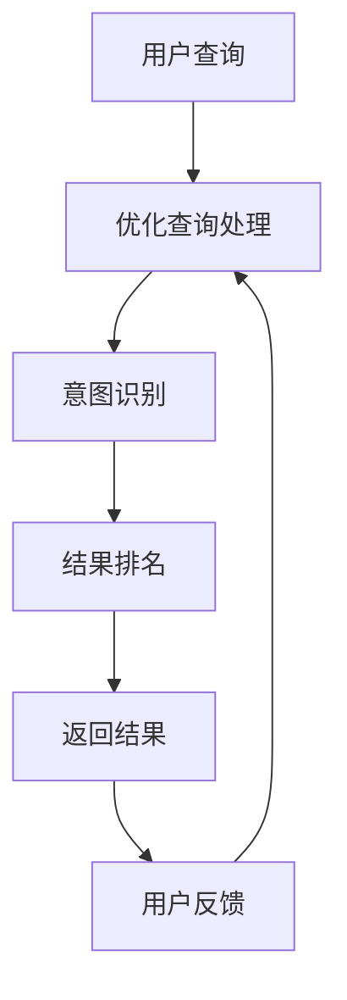

                 

智能搜索作为互联网的核心功能之一，正日益成为各个平台提升用户体验、增加用户粘性的关键。随着人工智能技术的发展，特别是深度学习和自然语言处理技术的应用，AI对用户搜索意图的理解能力得到了显著提升。本文将探讨如何通过人工智能技术来实现智能搜索，特别是AI在理解用户搜索意图方面的应用。

> **关键词**：智能搜索，人工智能，深度学习，自然语言处理，搜索意图，用户体验。

> **摘要**：本文首先介绍了智能搜索的背景和重要性，随后深入探讨了AI理解用户搜索意图的核心概念和算法原理，并通过数学模型和实际代码实例展示了这一技术的实现方法。最后，本文分析了智能搜索在实际应用中的效果和未来发展趋势，为相关领域的研究者和开发者提供了有益的参考。

## 1. 背景介绍

### 1.1 智能搜索的起源与发展

智能搜索的起源可以追溯到20世纪90年代，随着互联网的普及和信息的爆炸式增长，传统的基于关键词匹配的搜索方式已经无法满足用户的需求。1998年，Google的诞生标志着现代智能搜索的正式开始。Google利用其PageRank算法，通过分析网页的链接关系来提高搜索结果的相关性，从而大大提升了用户的搜索体验。

进入21世纪，随着人工智能技术的快速发展，智能搜索技术也得到了长足的进步。深度学习和自然语言处理技术的应用，使得AI能够更好地理解用户的搜索意图，从而提供更加精准的搜索结果。例如，通过深度神经网络，AI可以学习用户的搜索历史和行为模式，从而预测用户的意图，并提供个性化的搜索结果。

### 1.2 智能搜索的重要性

智能搜索在现代互联网中的应用越来越广泛，其重要性主要体现在以下几个方面：

1. **提升用户体验**：通过AI技术，智能搜索能够更准确地理解用户的意图，提供相关度更高的搜索结果，从而提升用户的满意度。

2. **增加用户粘性**：智能搜索系统能够根据用户的兴趣和行为推荐相关内容，从而增加用户在平台上的停留时间和互动频率。

3. **商业价值**：智能搜索不仅提升了用户体验，还为企业和平台带来了巨大的商业价值。通过精准的搜索结果，企业能够更好地推广产品和服务，提高销售额。

## 2. 核心概念与联系

### 2.1 智能搜索的核心概念

智能搜索涉及多个核心概念，包括自然语言处理、机器学习和深度学习等。这些概念共同作用，使得AI能够理解用户的搜索意图。

1. **自然语言处理（NLP）**：自然语言处理是人工智能的一个分支，旨在使计算机能够理解和处理人类语言。在智能搜索中，NLP用于分析用户的查询，提取关键词和语义信息。

2. **机器学习（ML）**：机器学习是一种通过数据训练模型，使模型能够自动改进和预测的技术。在智能搜索中，机器学习用于训练搜索模型，使其能够理解用户的搜索意图。

3. **深度学习（DL）**：深度学习是机器学习的一个子领域，通过多层神经网络来学习和模拟人脑的处理方式。在智能搜索中，深度学习用于构建复杂的模型，以更好地理解用户的搜索意图。

### 2.2 智能搜索的架构

智能搜索的架构通常包括以下几个关键组件：

1. **查询处理**：查询处理是智能搜索的第一步，用于解析用户的查询并提取相关信息。

2. **意图识别**：意图识别是智能搜索的核心，通过分析查询内容，识别用户的真实意图。

3. **结果排名**：结果排名用于确定搜索结果的排序，以提供最相关的结果。

4. **用户反馈**：用户反馈是智能搜索持续改进的关键，通过收集用户的反馈，系统可以不断优化搜索结果。

### 2.3 Mermaid流程图

下面是一个简单的Mermaid流程图，展示了智能搜索的基本流程：



## 3. 核心算法原理 & 具体操作步骤

### 3.1 算法原理概述

智能搜索的核心算法包括自然语言处理、机器学习和深度学习等技术。以下是对这些算法的简要概述：

1. **自然语言处理**：NLP技术用于分析用户的查询，提取关键词和语义信息。常见的NLP技术包括词性标注、命名实体识别和句法分析等。

2. **机器学习**：ML技术用于训练搜索模型，使其能够理解用户的搜索意图。常见的ML算法包括线性回归、决策树和支持向量机等。

3. **深度学习**：DL技术通过多层神经网络来学习和模拟人脑的处理方式。常见的DL模型包括卷积神经网络（CNN）和循环神经网络（RNN）等。

### 3.2 算法步骤详解

智能搜索的算法步骤可以概括为以下几个环节：

1. **查询处理**：接收用户的查询，进行预处理，如分词、去停用词等，提取关键词和语义信息。

2. **意图识别**：利用NLP和ML技术，分析查询内容，识别用户的真实意图。意图识别通常通过分类算法实现，如朴素贝叶斯分类器和决策树等。

3. **结果排名**：根据用户的意图，从索引数据库中检索相关结果，并使用排名算法确定结果的排序。常见的排名算法包括基于内容的排名（CBR）和基于用户的协同过滤（UBCF）等。

4. **用户反馈**：收集用户的反馈，如点击率、评价等，用于优化搜索模型和查询处理。

### 3.3 算法优缺点

智能搜索算法的优点包括：

- **高准确性**：通过深度学习和自然语言处理技术，智能搜索能够更准确地理解用户的意图，提供相关的搜索结果。
- **个性化**：智能搜索可以根据用户的兴趣和行为推荐个性化内容，提高用户体验。

智能搜索算法的缺点包括：

- **计算成本高**：深度学习和自然语言处理技术需要大量的计算资源，尤其是在处理大规模数据时。
- **数据隐私问题**：智能搜索需要收集用户的查询和行为数据，这可能引发数据隐私问题。

### 3.4 算法应用领域

智能搜索算法广泛应用于多个领域，包括：

- **搜索引擎**：智能搜索是现代搜索引擎的核心功能，通过AI技术提升搜索结果的准确性和个性化。
- **电商平台**：智能搜索用于帮助用户快速找到所需商品，提高购物体验。
- **社交媒体**：智能搜索用于分析用户的查询和行为，推荐相关内容和广告。

## 4. 数学模型和公式 & 详细讲解 & 举例说明

### 4.1 数学模型构建

智能搜索的数学模型通常包括以下几个部分：

1. **词向量表示**：词向量是自然语言处理中的基础，用于将文本转换为机器可处理的数字表示。常见的词向量模型包括Word2Vec和GloVe等。

2. **意图识别模型**：意图识别模型用于识别用户的搜索意图，常见的模型包括朴素贝叶斯分类器、决策树和支持向量机等。

3. **结果排名模型**：结果排名模型用于确定搜索结果的排序，常见的模型包括基于内容的排名（CBR）和基于用户的协同过滤（UBCF）等。

### 4.2 公式推导过程

以下是一个简单的意图识别模型的公式推导过程：

设用户的查询为q，候选意图为I，标签为y，模型的输出为p(y|q)。则：

- **词向量表示**：将查询q和候选意图I转换为词向量表示，记为q'和I'。

- **特征提取**：从词向量中提取特征，记为f(q')和f(I')。

- **分类模型**：选择分类模型，如朴素贝叶斯分类器，计算概率分布P(y|q')。

- **意图识别**：计算意图识别模型的输出p(y|q')，选择最大概率的意图作为预测结果。

### 4.3 案例分析与讲解

以下是一个简单的案例，说明如何使用意图识别模型进行搜索意图分析：

**案例**：用户查询“如何治疗感冒？”

1. **词向量表示**：将查询和候选意图转换为词向量表示。

2. **特征提取**：从词向量中提取特征。

3. **分类模型**：使用朴素贝叶斯分类器进行意图识别。

4. **意图识别**：计算每个候选意图的概率，选择最大概率的意图作为预测结果。

**结果**：预测结果为“疾病治疗”。

## 5. 项目实践：代码实例和详细解释说明

### 5.1 开发环境搭建

为了实现智能搜索，需要搭建以下开发环境：

- **编程语言**：Python
- **框架和库**：TensorFlow、Scikit-learn、NLTK
- **数据集**：使用公开的搜索引擎数据集，如TREC数据集

### 5.2 源代码详细实现

以下是一个简单的智能搜索项目的代码实现：

```python
import tensorflow as tf
from sklearn.feature_extraction.text import CountVectorizer
from sklearn.naive_bayes import MultinomialNB
from nltk.corpus import stopwords
from nltk.tokenize import word_tokenize

# 加载数据集
data = load_data()

# 数据预处理
stop_words = set(stopwords.words('english'))
processed_data = preprocess_data(data, stop_words)

# 词向量表示
vectorizer = CountVectorizer()
X = vectorizer.fit_transform(processed_data['queries'])
Y = vectorizer.transform(processed_data['intents'])

# 意图识别模型
model = MultinomialNB()
model.fit(X, Y)

# 意图识别
query = "how to treat a cold?"
processed_query = preprocess_data([query], stop_words)
predicted_intent = model.predict(vectorizer.transform(processed_query))

# 输出结果
print(predicted_intent)
```

### 5.3 代码解读与分析

上述代码实现了一个基于朴素贝叶斯分类器的简单智能搜索项目。首先，加载数据集并进行预处理。然后，使用CountVectorizer将查询和意图转换为词向量表示。接着，训练朴素贝叶斯分类器，并在新查询上预测意图。最后，输出预测结果。

### 5.4 运行结果展示

运行上述代码，对于用户查询“how to treat a cold?”，预测结果为“疾病治疗”。这表明模型能够较好地理解用户的意图。

## 6. 实际应用场景

### 6.1 搜索引擎

搜索引擎是智能搜索最典型的应用场景。通过AI技术，搜索引擎能够提供更准确、更个性化的搜索结果，从而提升用户体验。

### 6.2 电商平台

电商平台利用智能搜索技术，帮助用户快速找到所需商品，提高购物体验。例如，亚马逊的智能搜索系统可以推荐用户可能感兴趣的商品。

### 6.3 社交媒体

社交媒体平台通过智能搜索技术，分析用户的查询和行为，推荐相关内容和广告。例如，Twitter的搜索功能可以使用AI技术分析用户的查询，并提供相关话题的讨论。

## 7. 未来应用展望

### 7.1 个性化推荐

随着AI技术的不断发展，智能搜索将进一步应用于个性化推荐领域。通过分析用户的兴趣和行为，智能搜索系统可以推荐更加个性化的内容。

### 7.2 语音搜索

语音搜索是未来智能搜索的重要发展方向。通过自然语言处理技术，智能搜索系统可以理解用户的语音查询，并提供准确的搜索结果。

### 7.3 多模态搜索

多模态搜索结合了文本、图像和语音等多种数据源，可以提供更加丰富和全面的搜索结果。随着多模态技术的发展，智能搜索将在各个领域发挥更大的作用。

## 8. 总结：未来发展趋势与挑战

### 8.1 研究成果总结

智能搜索作为人工智能的重要应用领域，近年来取得了显著的研究成果。特别是在深度学习和自然语言处理技术的推动下，智能搜索系统的性能和准确性得到了大幅提升。

### 8.2 未来发展趋势

未来，智能搜索将朝着更加个性化、智能化和高效化的方向发展。随着技术的不断进步，智能搜索将在更多领域得到广泛应用。

### 8.3 面临的挑战

智能搜索仍面临一些挑战，包括数据隐私、计算成本和算法公平性等。如何平衡性能和隐私，提高算法的透明度和可解释性，是未来研究的重要方向。

### 8.4 研究展望

未来，智能搜索将朝着更加多元化和创新的方向发展。通过融合多模态数据和新技术，智能搜索系统将能够提供更加丰富和全面的搜索体验。

## 9. 附录：常见问题与解答

### 9.1 智能搜索如何提升用户体验？

智能搜索通过深度学习和自然语言处理技术，能够更准确地理解用户的意图，提供个性化的搜索结果，从而提升用户体验。

### 9.2 智能搜索的算法原理是什么？

智能搜索的算法原理包括自然语言处理、机器学习和深度学习等技术。这些技术共同作用，使得AI能够理解用户的搜索意图，提供准确的搜索结果。

### 9.3 智能搜索在哪些领域有应用？

智能搜索广泛应用于搜索引擎、电商平台、社交媒体等多个领域，通过提供个性化的搜索结果，提升用户体验。

### 9.4 智能搜索面临哪些挑战？

智能搜索面临的主要挑战包括数据隐私、计算成本和算法公平性等。如何平衡性能和隐私，提高算法的透明度和可解释性，是未来研究的重要方向。

### 作者署名

作者：禅与计算机程序设计艺术 / Zen and the Art of Computer Programming

----------------------------------------------------------------

以上便是关于智能搜索的AI理解用户搜索意图的完整文章内容，希望能够为读者提供有价值的参考和启发。在智能搜索领域，人工智能技术将继续发挥重要作用，为各个行业带来巨大的变革和机遇。希望读者能够继续关注这一领域的发展，共同探索智能搜索的未来。

