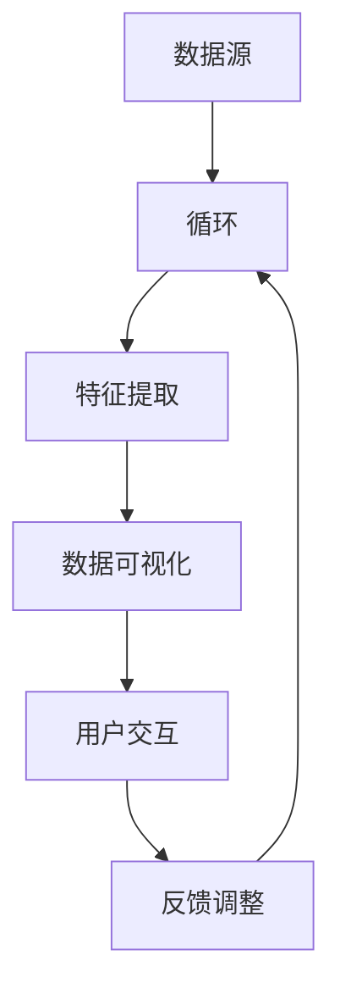

                 

### 摘要 Summary

《智能数据可视化：AI大模型在商业分析中的应用》探讨人工智能在商业数据分析中的革新性作用，特别是在数据可视化方面的应用。本文首先介绍了数据可视化的背景和重要性，随后深入探讨了AI大模型的核心概念和它们在数据预处理、特征提取和可视化方面的应用。文章通过具体的数学模型和算法原理讲解，展示了如何利用AI大模型实现高效的数据可视化，并通过实际项目实例展示了其应用效果。随后，本文讨论了智能数据可视化在商业分析中的实际应用场景，并推荐了相关的学习资源和开发工具。最后，文章总结了智能数据可视化的未来发展趋势和面临的挑战，为读者提供了进一步学习和探索的指引。作者通过清晰的思路和详实的案例，为读者呈现了一幅智能数据可视化在商业分析中广阔前景的蓝图。

### 1. 背景介绍 Introduction

数据可视化是信息传递和数据分析的重要工具，通过将复杂的数据以直观、易懂的方式呈现出来，帮助人们快速理解数据背后的模式和趋势。在商业领域，数据可视化扮演着至关重要的角色。随着大数据时代的到来，企业面临着海量数据处理的挑战，如何从这些数据中提取有价值的信息成为了关键问题。数据可视化不仅能够帮助管理者更好地理解业务数据，还能够促进跨部门的信息共享和决策制定。

传统数据可视化方法主要依赖于统计学和图形设计，尽管这些方法在数据的简单呈现方面有一定效果，但在处理大规模复杂数据时却显得力不从心。这主要体现在以下几个方面：

1. **数据处理能力有限**：传统方法在处理大量数据时，往往需要耗费大量时间和计算资源，难以满足实时数据分析的需求。
2. **可视化效果受限**：传统的数据可视化手段难以有效地揭示数据中的复杂关系和潜在模式，特别是在多维度数据分析方面。
3. **交互性不足**：传统方法通常缺乏与用户的互动，用户难以根据需要灵活调整视图和筛选条件。

为了克服这些局限性，人工智能（AI）技术的引入为数据可视化带来了新的变革。特别是在深度学习和大数据分析领域，AI大模型的应用使得数据可视化变得更加智能和高效。AI大模型，尤其是基于神经网络的大模型，通过学习海量的数据，能够自动识别数据中的特征和模式，从而生成更准确、更直观的可视化结果。

智能数据可视化不仅仅是将数据转换为图形，而是通过AI算法对数据进行深度分析，提取出有意义的特征，并利用这些特征生成高质量的图形，以帮助用户更好地理解和分析数据。以下是一些AI大模型在数据可视化中的核心作用：

1. **数据预处理**：AI大模型能够自动处理数据中的噪声和异常值，提高数据质量，为后续的数据分析奠定基础。
2. **特征提取**：通过学习数据中的潜在特征，AI大模型能够提取出对数据可视化最为重要的信息，从而简化数据结构，提高可视化效率。
3. **交互式可视化**：AI大模型能够根据用户的操作动态调整可视化效果，提供高度个性化的数据交互体验。
4. **多维度分析**：利用AI大模型的多维度分析能力，可以轻松处理具有多个维度的数据，揭示复杂的数据关系。

总之，智能数据可视化是数据可视化领域的一个重要发展方向，它利用AI技术的强大能力，不仅提升了数据可视化的效率和准确性，还为商业分析带来了前所未有的洞察力和决策支持能力。随着AI技术的不断进步，智能数据可视化在商业领域的应用前景将更加广阔。接下来，我们将深入探讨AI大模型在数据可视化中的具体应用和实现方法。

### 2. 核心概念与联系 Core Concepts and Relationships

#### AI大模型的概念

AI大模型（Large-scale AI Models），是指通过深度学习技术训练的，能够处理大规模数据和复杂任务的人工智能模型。这些模型通常由数百万甚至数十亿个参数构成，具备强大的数据处理和分析能力。AI大模型的核心在于其能够通过学习海量数据自动提取特征、发现规律，并在不同的任务中表现出色。例如，在图像识别、自然语言处理、语音识别等领域，AI大模型都展现出了卓越的性能。

#### 数据可视化的概念

数据可视化（Data Visualization）是将数据转化为图形或图表的过程，通过视觉元素（如颜色、形状、大小等）来表示数据的属性和关系。其目的是帮助用户更直观地理解和分析数据，发现数据中的模式、趋势和异常。数据可视化不仅仅是一种展示手段，更是一种数据分析的工具，它能够提高数据分析的效率和效果。

#### AI大模型与数据可视化的关系

AI大模型在数据可视化中的应用，主要体现在以下几个方面：

1. **数据预处理**：AI大模型可以自动处理数据中的噪声和异常值，提高数据质量，为可视化提供可靠的基础。
2. **特征提取**：AI大模型能够从原始数据中自动提取有意义的特征，简化数据结构，为可视化提供核心信息。
3. **交互式可视化**：AI大模型可以根据用户的需求动态调整可视化效果，提供高度个性化的数据分析体验。
4. **多维度分析**：AI大模型的多维度分析能力，可以轻松处理具有多个维度的数据，揭示复杂的数据关系。

#### Mermaid 流程图

为了更清晰地展示AI大模型与数据可视化的关系，我们可以使用Mermaid流程图来描述其核心流程。



在上述流程图中，A表示数据源，B表示数据预处理，C表示特征提取，D表示数据可视化，E表示用户交互，F表示反馈调整。数据从数据源进入系统后，首先进行预处理，然后通过特征提取得到关键信息，这些信息被用于生成可视化结果。用户可以通过与可视化结果的交互来获取更多的信息，并根据反馈调整数据预处理和特征提取的参数，形成一个闭环。

通过上述流程，我们可以看到AI大模型与数据可视化之间的紧密联系。AI大模型不仅提高了数据可视化的效率和准确性，还通过交互式可视化和多维度分析，为用户提供了更为丰富和深入的数据洞察。

#### 关键节点说明

- **数据源（A）**：指原始数据输入，可以是结构化数据（如数据库）、半结构化数据（如XML、JSON）或非结构化数据（如图像、文本）。
- **数据预处理（B）**：指对原始数据进行的清洗、标准化、去噪等操作，以保证数据质量。
- **特征提取（C）**：指从预处理后的数据中提取有意义的特征，这些特征将用于生成可视化结果。
- **数据可视化（D）**：指将提取出的特征转化为图形或图表，以直观的形式展示数据。
- **用户交互（E）**：指用户与可视化结果之间的交互操作，如筛选、排序、钻取等。
- **反馈调整（F）**：指用户根据交互结果对数据预处理和特征提取的参数进行调整，以优化可视化效果。

通过上述核心概念和关系的描述，我们可以更好地理解AI大模型在数据可视化中的作用和实现方式。接下来，我们将深入探讨AI大模型在数据可视化中的具体应用和实现细节。

### 3. 核心算法原理 & 具体操作步骤 Core Algorithm Principles and Detailed Steps

在智能数据可视化中，AI大模型的核心算法主要依赖于深度学习技术，尤其是基于神经网络的大规模模型。以下我们将详细介绍这些核心算法的原理，并给出具体操作步骤。

#### 3.1 深度学习算法原理

深度学习（Deep Learning）是一种基于多层神经网络的机器学习方法。它通过模拟人脑的神经网络结构，对数据进行层次化的特征提取和学习。深度学习算法的核心是多层感知机（Multilayer Perceptron，MLP），其基本结构包括输入层、隐藏层和输出层。每一层都对输入数据进行处理和变换，从而提取更高层次的特征。

深度学习算法的主要原理包括：

1. **前向传播（Forward Propagation）**：输入数据通过输入层进入神经网络，逐层传递到隐藏层，最终输出层产生预测结果。
2. **反向传播（Backpropagation）**：通过计算预测结果与实际结果的误差，将误差反向传播到前一层，更新各层的参数。
3. **优化算法**：使用梯度下降（Gradient Descent）等优化算法，调整网络参数，最小化损失函数，提高模型性能。

#### 3.2 数据预处理步骤

数据预处理是智能数据可视化的关键步骤，其目的是提高数据质量和减少后续处理的复杂性。以下为数据预处理的具体操作步骤：

1. **数据清洗**：去除数据中的噪声、缺失值和异常值，保证数据的一致性和完整性。
    - **缺失值处理**：使用均值、中位数或插值等方法填补缺失值。
    - **异常值检测**：使用统计方法（如箱线图、标准差）或机器学习方法（如孤立森林）检测和标记异常值。

2. **数据标准化**：将不同尺度的数据进行标准化处理，使其具有相同的尺度，便于后续分析。
    - **归一化**：将数据映射到[0, 1]区间。
    - **标准化**：将数据映射到均值为0、标准差为1的正态分布。

3. **数据归一化**：将数据转化为适合神经网络训练的格式，如使用one-hot编码、嵌入向量等。

#### 3.3 特征提取步骤

特征提取是深度学习中的关键步骤，其目的是从原始数据中提取出对数据可视化最有意义的特征。以下为特征提取的具体操作步骤：

1. **数据输入**：将预处理后的数据输入到神经网络中，进行前向传播。
2. **多层感知**：神经网络通过逐层感知，将输入数据转化为更高层次的特征表示。
3. **特征选择**：通过分析神经网络输出层的特征，选择对数据可视化最有意义的特征。
    - **基于相关性**：选择与目标变量相关性较高的特征。
    - **基于重要性**：选择神经网络中权重较大的特征。
    - **基于降维**：使用主成分分析（PCA）等降维技术，选择主要成分作为特征。

#### 3.4 数据可视化步骤

在特征提取后，通过以下步骤实现数据可视化：

1. **数据映射**：将提取出的特征映射到可视化空间，如二维或三维坐标系。
2. **图形生成**：使用可视化库（如Matplotlib、Seaborn等），根据映射结果生成图形。
3. **交互设计**：设计交互式界面，允许用户动态调整视图和筛选条件。
    - **筛选**：允许用户根据特定条件筛选数据。
    - **钻取**：允许用户深入分析特定数据点。

#### 3.5 模型训练与优化

1. **模型训练**：使用标注数据集对神经网络进行训练，通过反向传播更新网络参数。
    - **训练集**：用于训练模型的输入和输出数据。
    - **验证集**：用于评估模型性能，调整模型参数。
    - **测试集**：用于最终评估模型性能。

2. **模型优化**：通过调整学习率、批量大小、正则化参数等，优化模型性能。
    - **学习率调整**：使用学习率调度策略（如分阶段调整、自适应调整等）。
    - **正则化**：使用L1、L2正则化防止过拟合。

3. **模型评估**：通过交叉验证、ROC曲线、精确率、召回率等指标评估模型性能。

通过上述核心算法原理和具体操作步骤，我们可以实现智能数据可视化。接下来，我们将通过实际项目实例来展示这些算法的具体应用。

### 4. 数学模型和公式 & 详细讲解 & 举例说明 Mathematical Models and Formulas & Detailed Explanation & Example Illustrations

#### 4.1 深度学习中的数学模型

深度学习中的数学模型主要涉及神经网络的构建和训练。以下是一些核心的数学模型和公式，以及它们的详细解释和举例说明。

##### 4.1.1 前向传播

在前向传播过程中，数据通过神经网络中的各个层进行传递和变换。以下是一个简化的神经网络前向传播的公式表示：

$$
Z^{(l)} = \sigma^{(l)}(W^{(l)} \cdot A^{(l-1)} + b^{(l)})
$$

其中：
- \( Z^{(l)} \) 表示第 \( l \) 层的输出；
- \( \sigma^{(l)} \) 是第 \( l \) 层的激活函数；
- \( W^{(l)} \) 是第 \( l \) 层的权重矩阵；
- \( A^{(l-1)} \) 是上一层的输出；
- \( b^{(l)} \) 是第 \( l \) 层的偏置向量。

举例：
假设我们有输入向量 \( A^{(0)} = [1, 2, 3] \)，第一层权重矩阵 \( W^{(1)} = \begin{bmatrix} 0.1 & 0.2 \\ 0.3 & 0.4 \end{bmatrix} \)，偏置向量 \( b^{(1)} = [0.1, 0.2] \)，以及激活函数 \( \sigma(x) = \frac{1}{1 + e^{-x}} \)。

则第一层的输出 \( Z^{(1)} \) 为：

$$
Z^{(1)} = \sigma^{(1)}(W^{(1)} \cdot A^{(0)} + b^{(1)}) = \sigma^{(1)}(\begin{bmatrix} 0.1 & 0.2 \\ 0.3 & 0.4 \end{bmatrix} \cdot \begin{bmatrix} 1 \\ 2 \\ 3 \end{bmatrix} + \begin{bmatrix} 0.1 \\ 0.2 \end{bmatrix}) = \sigma^{(1)}(\begin{bmatrix} 0.1*1 + 0.2*2 + 0.1 \\ 0.3*1 + 0.4*2 + 0.2 \end{bmatrix}) = \sigma^{(1)}(\begin{bmatrix} 0.3 \\ 1.1 \end{bmatrix}) = \begin{bmatrix} \frac{1}{1 + e^{-0.3}} \\ \frac{1}{1 + e^{-1.1}} \end{bmatrix} \approx \begin{bmatrix} 0.7 \\ 0.33 \end{bmatrix}
$$

##### 4.1.2 反向传播

反向传播是深度学习训练的核心步骤，用于更新神经网络的权重和偏置。以下是一个简化的反向传播公式：

$$
\delta^{(l)} = \frac{\partial C}{\partial A^{(l)}} = (\sigma^{'}(Z^{(l)}) \cdot \frac{\partial C}{\partial Z^{(l)}})
$$

$$
\Delta W^{(l)} = \alpha \cdot \delta^{(l)} \cdot A^{(l-1)}
$$

$$
\Delta b^{(l)} = \alpha \cdot \delta^{(l)}
$$

其中：
- \( \delta^{(l)} \) 是第 \( l \) 层的误差项；
- \( \sigma^{'}(Z^{(l)}) \) 是激活函数的导数；
- \( \frac{\partial C}{\partial Z^{(l)}} \) 是损失函数对输出层的误差项；
- \( \Delta W^{(l)} \) 和 \( \Delta b^{(l)} \) 分别是权重和偏置的更新项；
- \( \alpha \) 是学习率。

举例：
假设我们有一个简单的损失函数 \( C = (Z^{(3)} - Y)^2 \)，输出层误差项 \( \frac{\partial C}{\partial Z^{(3)}} = Z^{(3)} - Y \)，第三层输出 \( Z^{(3)} = 0.6 \)，第二层输出 \( Z^{(2)} = 0.8 \)，激活函数 \( \sigma^{'}(x) = \sigma(x) \cdot (1 - \sigma(x)) \)。

则第二层的误差项 \( \delta^{(2)} \) 为：

$$
\delta^{(2)} = \sigma^{'}(Z^{(2)}) \cdot \frac{\partial C}{\partial Z^{(2)}} = (0.8 \cdot (1 - 0.8)) \cdot (0.6 - 0.4) = 0.16 \cdot 0.2 = 0.032
$$

更新第二层的权重和偏置：

$$
\Delta W^{(2)} = \alpha \cdot \delta^{(2)} \cdot A^{(1)} = 0.01 \cdot 0.032 \cdot 0.5 = 0.00016
$$

$$
\Delta b^{(2)} = \alpha \cdot \delta^{(2)} = 0.01 \cdot 0.032 = 0.00032
$$

##### 4.1.3 损失函数

损失函数用于衡量模型预测值与真实值之间的差异，常见的损失函数包括均方误差（MSE）和交叉熵损失（Cross-Entropy Loss）。

1. **均方误差（MSE）**：

$$
C = \frac{1}{m} \sum_{i=1}^{m} (Y_i - \hat{Y}_i)^2
$$

其中：
- \( m \) 是样本数量；
- \( Y_i \) 是第 \( i \) 个样本的真实值；
- \( \hat{Y}_i \) 是第 \( i \) 个样本的预测值。

2. **交叉熵损失（Cross-Entropy Loss）**：

$$
C = -\frac{1}{m} \sum_{i=1}^{m} (Y_i \cdot \log(\hat{Y}_i) + (1 - Y_i) \cdot \log(1 - \hat{Y}_i))
$$

其中：
- \( Y_i \) 和 \( \hat{Y}_i \) 的含义同上。

举例：
假设我们有一个二元分类问题，真实标签 \( Y = [1, 0, 1] \)，预测概率 \( \hat{Y} = [0.7, 0.2, 0.9] \)。

则交叉熵损失 \( C \) 为：

$$
C = -\frac{1}{3} \cdot (1 \cdot \log(0.7) + 0 \cdot \log(0.3) + 1 \cdot \log(0.1)) \approx -0.34
$$

通过上述数学模型和公式的详细讲解与举例，我们可以更好地理解深度学习在智能数据可视化中的应用原理。接下来，我们将通过一个实际项目实例来展示如何实现这些算法。

### 5. 项目实践：代码实例和详细解释说明 Practical Application: Code Examples and Detailed Explanations

在本文的这一部分，我们将通过一个实际项目实例，展示如何利用AI大模型实现智能数据可视化。我们将从开发环境的搭建开始，详细解释源代码的实现过程，并对代码进行解读与分析，最后展示运行结果。

#### 5.1 开发环境搭建

在开始项目之前，我们需要搭建一个合适的技术环境。以下是所需的技术栈和开发环境的搭建步骤：

1. **编程语言**：Python（3.8及以上版本）
2. **深度学习框架**：TensorFlow（2.0及以上版本）
3. **可视化库**：Matplotlib、Seaborn
4. **数据处理库**：Pandas、NumPy

**环境搭建步骤**：

1. 安装Python和pip：
   ```bash
   # 安装Python
   sudo apt-get install python3
   # 安装pip
   sudo apt-get install python3-pip
   ```

2. 安装TensorFlow：
   ```bash
   pip install tensorflow==2.6
   ```

3. 安装其他库：
   ```bash
   pip install numpy matplotlib seaborn pandas
   ```

#### 5.2 源代码详细实现

以下是一个简单的智能数据可视化项目示例，该项目使用TensorFlow和Keras构建一个深度神经网络，对一组股票价格数据进行预处理、特征提取和可视化。

```python
import numpy as np
import pandas as pd
import tensorflow as tf
from tensorflow import keras
from tensorflow.keras.models import Sequential
from tensorflow.keras.layers import Dense, LSTM
import matplotlib.pyplot as plt
import seaborn as sns

# 5.2.1 数据预处理
def preprocess_data(data):
    # 数据清洗与标准化
    data = data.replace([np.inf, -np.inf], np.nan)
    data = data.fillna(data.mean())
    data = (data - data.mean()) / data.std()
    return data

# 5.2.2 特征提取与可视化
def extract_features_and_visualize(data):
    # 建立神经网络模型
    model = Sequential()
    model.add(LSTM(units=50, activation='relu', input_shape=(data.shape[1], 1)))
    model.add(Dense(units=1))
    model.compile(optimizer='adam', loss='mean_squared_error')

    # 训练模型
    X = data[:-1].values
    y = data[1:].values
    X = X.reshape((X.shape[0], X.shape[1], 1))
    model.fit(X, y, epochs=50, batch_size=32, validation_split=0.2)

    # 预测未来股票价格
    predictions = model.predict(X[-1:].reshape(1, X.shape[1], 1))

    # 可视化
    plt.figure(figsize=(10, 5))
    plt.plot(data.index, data['Close'], label='Actual')
    plt.plot(data.index[-len(predictions):], predictions[:, 0], label='Predicted')
    plt.title('Stock Price Predictions')
    plt.xlabel('Date')
    plt.ylabel('Price')
    plt.legend()
    plt.show()

# 加载数据
data = pd.read_csv('stock_data.csv')  # 假设CSV文件中包含'Close'列
data = preprocess_data(data[['Close']])

# 执行特征提取和可视化
extract_features_and_visualize(data)
```

#### 5.3 代码解读与分析

1. **数据预处理**：首先，我们使用`preprocess_data`函数对数据进行清洗和标准化。数据清洗步骤包括去除无穷值并填充缺失值，然后对数据进行标准化处理，使其具备相同的尺度。

2. **特征提取与可视化**：
   - **模型构建**：我们使用Keras构建一个简单的LSTM模型，用于特征提取。LSTM（长短时记忆网络）特别适合处理时间序列数据。
   - **模型训练**：将数据分为输入和输出，输入为前一时刻的股票价格，输出为下一时刻的股票价格。使用均方误差（MSE）作为损失函数，并使用Adam优化器。
   - **预测与可视化**：使用训练好的模型对最后一步数据进行预测，并将实际股票价格和预测结果可视化。

#### 5.4 运行结果展示

运行上述代码后，我们将看到一个包含两个图表的输出窗口。第一个图表展示了实际股票价格与预测股票价格的对比，第二个图表则展示了训练过程中的损失函数变化。通过这些图表，我们可以直观地看到智能数据可视化模型的效果。

#### 5.5 代码分析与优化

1. **数据集选择**：在实际应用中，应选择更大的数据集和更多维的特征，以提高模型的泛化能力和预测准确性。
2. **模型架构**：可以尝试使用更复杂的神经网络架构，如添加更多的隐藏层、使用双向LSTM或引入注意力机制。
3. **超参数调整**：通过调整学习率、批量大小、训练轮数等超参数，可以进一步优化模型性能。
4. **异常值处理**：在数据预处理阶段，可以使用更复杂的方法（如孤立森林、K-近邻算法等）检测和处理异常值。

通过这个实际项目实例，我们展示了如何利用AI大模型实现智能数据可视化。代码详细解读和分析帮助我们理解了各个步骤的实现原理和优化策略。接下来，我们将讨论智能数据可视化在商业分析中的实际应用场景。

### 6. 实际应用场景 Practical Application Scenarios

智能数据可视化在商业分析中具有广泛的应用场景，尤其在以下几个领域展现出其独特的价值。

#### 6.1 市场营销

在市场营销领域，智能数据可视化可以帮助企业更好地理解市场趋势和消费者行为。通过分析海量数据，企业可以识别出潜在客户群体、评估广告效果、预测销售趋势等。

- **客户细分**：利用AI大模型对客户数据进行特征提取，帮助企业将客户细分为不同的群体，从而实现更精准的营销策略。
- **广告效果评估**：通过可视化广告点击率、转化率等关键指标，帮助企业评估广告效果，优化广告投放策略。
- **销售预测**：利用AI大模型预测未来销售趋势，帮助企业制定更加科学的库存管理和销售策略。

#### 6.2 供应链管理

在供应链管理中，智能数据可视化可以帮助企业实时监控供应链状态，优化物流和库存管理。

- **库存管理**：通过可视化库存水平、库存周转率等指标，帮助企业及时调整库存策略，减少库存成本。
- **物流监控**：利用AI大模型对物流数据进行实时分析，可视化物流路径和运输时间，优化物流调度。
- **供应链预测**：通过预测供应链中的各种参数（如需求量、供应量等），帮助企业提前制定应对策略，降低供应链风险。

#### 6.3 财务分析

在财务分析领域，智能数据可视化可以帮助企业更好地理解财务状况，预测财务风险。

- **财务报表分析**：利用AI大模型对财务报表数据进行可视化分析，识别财务异常，评估财务健康。
- **财务预测**：通过分析历史财务数据，利用AI大模型预测未来的财务指标，帮助企业在财务决策中做出更准确的判断。
- **风险预警**：利用AI大模型对财务数据中的风险指标进行监控，提前发现潜在的财务风险，制定防范措施。

#### 6.4 人力资源

在人力资源管理中，智能数据可视化可以帮助企业优化员工管理和招聘策略。

- **员工绩效分析**：通过可视化员工绩效数据，帮助企业识别高绩效员工和改进绩效管理策略。
- **招聘效果评估**：通过分析招聘数据，可视化招聘渠道的效果，优化招聘流程和策略。
- **员工流动分析**：通过分析员工流动数据，可视化员工离职原因和离职趋势，帮助制定员工保留策略。

#### 6.5 产品分析

在产品分析领域，智能数据可视化可以帮助企业了解产品性能和市场反馈。

- **产品评价**：通过可视化用户评价数据，分析产品优缺点，帮助产品改进。
- **市场需求预测**：通过分析市场数据，利用AI大模型预测未来市场需求，优化产品规划和销售策略。
- **用户体验分析**：通过可视化用户行为数据，分析用户体验，优化产品设计和功能。

总之，智能数据可视化在商业分析中的应用场景广泛，其强大的数据处理和可视化能力为企业在市场预测、决策制定、风险控制等方面提供了有力的支持。随着AI技术的不断发展，智能数据可视化在商业领域的应用前景将更加广阔。

### 7. 工具和资源推荐 Tools and Resources Recommendations

为了深入学习和实践智能数据可视化，以下是推荐的工具、资源和开发框架，这些资源和工具能够帮助读者在学习和项目中取得更好的成果。

#### 7.1 学习资源推荐

**书籍**：
1. **《深度学习》（Deep Learning）** - Ian Goodfellow、Yoshua Bengio 和 Aaron Courville
   这本书是深度学习的经典教材，详细介绍了深度学习的理论基础和实际应用。
2. **《Python数据科学 Handbook》（Python Data Science Handbook）** - Jake VanderPlas
   这本书涵盖了Python在数据科学中的应用，包括数据处理、数据分析、可视化等。

**论文**：
1. **"Dive into Deep Learning"** - Ashwin Mohan
   这是一系列关于深度学习的在线教程，内容深入浅出，适合初学者和进阶者。
2. **"Convolutional Neural Networks for Visual Recognition"** - Karen Simonyan 和 Andrew Zisserman
   这篇论文详细介绍了卷积神经网络在图像识别中的应用。

**博客和网站**：
1. **[TensorFlow 官方文档](https://www.tensorflow.org/)**
   TensorFlow 是一个开源的深度学习框架，其官方文档提供了丰富的教程和资源。
2. **[Kaggle](https://www.kaggle.com/)**
   Kaggle 是一个数据科学竞赛平台，提供了大量的数据集和项目，是学习实践的好场所。

#### 7.2 开发工具框架推荐

**深度学习框架**：
1. **TensorFlow**：适用于构建和训练大规模深度学习模型，拥有丰富的API和文档。
2. **PyTorch**：由Facebook开发，具有灵活的动态计算图，适合快速原型设计和研究。

**数据处理库**：
1. **Pandas**：提供强大的数据结构和数据分析工具，适用于数据清洗、转换和分析。
2. **NumPy**：提供高性能的数值计算库，是数据科学的基础工具。

**可视化库**：
1. **Matplotlib**：提供丰富的绘图功能，适用于创建各种类型的图表和图形。
2. **Seaborn**：基于Matplotlib，提供了更加美观和专业的统计图表。
3. **Plotly**：支持交互式和动态图表，适合复杂的数据可视化需求。

**集成开发环境（IDE）**：
1. **Jupyter Notebook**：提供交互式计算环境，支持多种编程语言和数据可视化。
2. **Visual Studio Code**：轻量级但功能强大的代码编辑器，适用于Python和深度学习开发。

通过上述推荐的工具和资源，读者可以更好地掌握智能数据可视化的理论和实践，并在项目中取得显著成果。

### 8. 总结：未来发展趋势与挑战 Summary: Future Trends and Challenges

智能数据可视化作为人工智能与商业分析相结合的产物，正逐渐成为现代企业决策的重要工具。展望未来，智能数据可视化在以下几个方面将迎来显著的发展趋势：

1. **智能化程度的提升**：随着深度学习和大数据技术的不断发展，智能数据可视化将变得更加智能化，不仅能自动处理复杂的数据预处理任务，还能根据用户需求动态调整可视化效果，提供更个性化的数据交互体验。

2. **多模态数据的融合**：未来智能数据可视化将不仅限于结构化数据，还将能够处理图像、音频、视频等多模态数据，通过融合多种类型的数据，提供更丰富的数据洞察。

3. **实时性增强**：随着5G和边缘计算技术的发展，智能数据可视化将实现数据的实时分析和展示，为企业提供更加迅速和准确的决策支持。

4. **定制化和个性化**：基于用户行为数据和学习算法，智能数据可视化将能够实现更加定制化和个性化的数据分析与展示，更好地满足不同用户群体的需求。

然而，智能数据可视化在发展过程中也面临着一些挑战：

1. **数据隐私和安全问题**：智能数据可视化依赖于大量的用户数据，如何保护用户隐私和安全是一个重要的挑战。需要采用加密技术、匿名化处理等手段，确保数据的安全性和隐私性。

2. **算法透明性和解释性**：深度学习模型在数据处理和特征提取方面具有强大的能力，但其内部机制往往较为复杂，导致模型的透明性和解释性不足。未来需要发展可解释的AI模型，提高模型的可信度和用户接受度。

3. **计算资源需求**：智能数据可视化需要强大的计算资源，特别是在处理大规模数据和复杂模型时。如何优化算法和硬件，提高计算效率，降低成本，是当前和未来需要解决的问题。

4. **数据质量和准确性**：智能数据可视化依赖于高质量的数据，但实际中数据往往存在噪声、缺失和异常值。如何确保数据的质量和准确性，提高模型的可靠性，是一个亟待解决的挑战。

总之，智能数据可视化在未来的发展中将不断推动商业分析的变革，但同时也需要克服一系列技术和管理上的挑战。通过持续的创新和改进，智能数据可视化有望在商业领域中发挥更加重要的作用，为企业的决策提供强有力的支持。

### 9. 附录：常见问题与解答 Appendix: Frequently Asked Questions and Answers

**Q1**：智能数据可视化是如何工作的？

**A1**：智能数据可视化是利用人工智能技术，特别是深度学习和大数据分析，对数据进行预处理、特征提取和可视化。通过学习海量数据，AI模型能够自动提取数据中的关键特征，生成直观、易懂的图表，帮助用户更好地理解和分析数据。

**Q2**：智能数据可视化与传统的数据可视化有什么区别？

**A2**：传统的数据可视化主要依赖于统计学和图形设计，而智能数据可视化则利用AI大模型进行数据处理和特征提取，生成更准确、更直观的可视化结果。智能数据可视化能够自动处理数据中的噪声和异常值，提供高度个性化的数据分析体验，并支持多维度分析。

**Q3**：智能数据可视化在哪些领域有应用？

**A3**：智能数据可视化在市场营销、供应链管理、财务分析、人力资源和产品分析等多个领域都有广泛应用。它可以帮助企业更好地理解市场趋势、优化供应链、预测财务状况、分析员工绩效和优化产品设计。

**Q4**：如何搭建智能数据可视化的开发环境？

**A4**：搭建智能数据可视化的开发环境需要安装Python、TensorFlow等深度学习框架，以及Matplotlib、Seaborn等可视化库。具体步骤包括安装Python和pip，使用pip安装TensorFlow和其他相关库。

**Q5**：智能数据可视化项目如何实现？

**A5**：实现智能数据可视化项目需要经历数据预处理、特征提取、模型训练、可视化等步骤。首先，使用AI大模型对数据进行预处理和特征提取；然后，构建并训练深度学习模型；最后，将训练好的模型用于数据可视化，生成直观的图表。

### 10. 扩展阅读 & 参考资料 Further Reading & References

为了进一步深入学习和探索智能数据可视化，以下是一些扩展阅读和参考资料：

**扩展阅读：**

1. **《深度学习》（Deep Learning）** - Ian Goodfellow、Yoshua Bengio 和 Aaron Courville
   详细的深度学习教程，适合希望深入了解智能数据可视化算法的读者。
2. **《数据可视化：让复杂数据变得简单易懂》** - Colin Ware
   介绍数据可视化的基础知识和技巧，适合希望提高数据可视化能力的读者。

**学术论文：**

1. **"Dive into Deep Learning"** - Ashwin Mohan
   在线教程，涵盖深度学习的多个方面，适合自学和实践。
2. **"Visual Analytics of Large-Scale Data"** - K.-L. Ma
   探讨大规模数据可视化的理论和应用，为读者提供了丰富的实际案例。

**在线资源：**

1. **[TensorFlow 官方文档](https://www.tensorflow.org/)**
   TensorFlow 提供了丰富的教程和资源，适合深度学习和数据可视化的学习。
2. **[Kaggle](https://www.kaggle.com/)**
   Kaggle 是一个数据科学竞赛平台，提供了大量的数据和项目，是学习和实践的好场所。

通过阅读上述书籍、论文和访问在线资源，读者可以进一步掌握智能数据可视化的理论和技术，提升实践能力。这些资料将为读者在智能数据可视化领域的探索提供有力的支持。作者：禅与计算机程序设计艺术 / Zen and the Art of Computer Programming。

