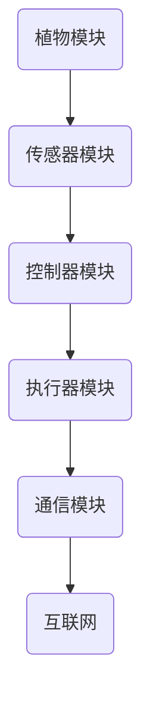

                 

### 1. 背景介绍

智能植物墙创业作为一个新兴的绿色产业，正逐渐受到越来越多企业和个人的关注。其核心价值在于通过智能化的手段，实现室内空气的净化和美化环境的功能。在现代社会，空气质量问题日益严重，尤其是在城市中，PM2.5、甲醛等有害物质的浓度居高不下，对人体健康造成了严重威胁。而传统空气净化方法往往效率低下，且存在二次污染的风险。

智能植物墙利用植物的光合作用、呼吸作用以及微生物降解作用，能够有效去除空气中的有害气体和颗粒物，如甲醛、苯、二氧化碳等。同时，植物墙还具有装饰和美化环境的作用，能够提升室内空间的美感和舒适度。智能植物墙不仅能够改善室内空气质量，还能够为人们提供一个接近自然、放松心情的空间。

当前，智能植物墙在商业、医疗、教育、家庭等多个领域得到了广泛应用。例如，在办公楼中，智能植物墙不仅可以净化室内空气，减少室内污染，还能够提升员工的工作效率；在医院中，智能植物墙有助于减少病人的焦虑感，促进康复；在家庭中，智能植物墙为人们提供了一片绿色的休闲空间，有助于缓解现代生活的压力。

总的来说，智能植物墙创业不仅具有显著的社会效益，还具有巨大的市场潜力。通过整合人工智能、物联网等先进技术，智能植物墙有望成为室内空气净化的绿色解决方案，为人们的健康生活提供有力支持。

### 2. 核心概念与联系

#### 2.1. 智能植物墙的定义

智能植物墙是一种将植物种植与智能控制技术相结合的系统。它通过利用植物的光合作用、呼吸作用和微生物降解作用，实现室内空气的净化和美化。智能植物墙的核心特点是智能化控制，通过传感器、控制器等设备，实时监测植物生长状态和室内环境参数，自动调节光照、水分、营养等条件，确保植物健康生长，同时高效净化空气。

#### 2.2. 智能植物墙的组成部分

智能植物墙主要由以下几个部分组成：

- **植物模块**：这是智能植物墙的核心，通常包括各种植物种子、幼苗或成熟植物。这些植物被种植在特定的培养基质中，如椰糠、珍珠岩等，以提供必要的生长条件。

- **传感器模块**：用于实时监测室内环境参数，如温度、湿度、光照强度、二氧化碳浓度等。这些传感器数据将被传输到中央控制器进行分析和决策。

- **控制器模块**：接收传感器数据，根据预设的算法和规则，自动调节植物生长所需的条件，如光照、水分、营养等。控制器通常包括微控制器、PLC（可编程逻辑控制器）或其他智能控制器。

- **执行器模块**：根据控制器的指令，执行相应的操作，如调节灯光、喷雾系统、灌溉系统等。

- **通信模块**：用于数据传输和远程监控，可以通过Wi-Fi、蓝牙、Zigbee等技术连接到互联网，实现远程监控和控制。

#### 2.3. 智能植物墙的工作原理

智能植物墙的工作原理主要基于以下几方面：

- **光合作用**：植物在光照条件下，通过叶绿素将二氧化碳和水转化为氧气和葡萄糖，同时释放水分和氧气，从而净化空气。

- **呼吸作用**：植物在呼吸过程中，吸收氧气，释放二氧化碳，这一过程有助于平衡室内氧气和二氧化碳的浓度。

- **微生物降解作用**：植物根系中的微生物能够分解土壤中的有机污染物，如甲醛、苯等有害物质，从而净化空气。

- **智能化控制**：通过传感器模块实时监测环境参数，控制器根据这些数据自动调节植物生长条件，确保植物健康生长，同时高效净化空气。

#### 2.4. Mermaid 流程图

以下是一个简单的 Mermaid 流程图，展示智能植物墙的核心概念和组件之间的联系：



**图 1：智能植物墙的核心概念和组件流程图**

在这个流程图中，植物模块通过传感器模块收集环境数据，这些数据被发送到控制器模块。控制器模块根据预设的算法和规则，自动调节执行器模块，以优化植物的生长条件和空气净化效果。同时，通信模块用于数据的远程传输和监控，确保整个系统的智能化运行。

通过这个流程图，我们可以清晰地看到智能植物墙各组件之间的协同工作关系，以及它们如何共同实现室内空气净化的目标。

### 3. 核心算法原理 & 具体操作步骤

#### 3.1. 传感器数据处理

智能植物墙的传感器模块负责实时监测室内环境参数，包括温度、湿度、光照强度、二氧化碳浓度等。为了确保数据的准确性和有效性，我们需要对传感器数据进行预处理。

**步骤 1：数据采集**  
首先，从传感器模块获取实时数据，并将其传输到控制器。

```python
# 假设我们使用的是模拟传感器数据
temperature = get_temperature_sensor_data()
humidity = get_humidity_sensor_data()
light_intensity = get_light_intensity_sensor_data()
co2_concentration = get_co2_sensor_data()
```

**步骤 2：数据清洗**  
对于采集到的数据，我们需要进行清洗，去除异常值和噪声。可以使用中值滤波、卡尔曼滤波等方法。

```python
import numpy as np

def clean_data(data, window_size):
    # 应用移动平均滤波
    return np.convolve(data, np.ones(window_size)/window_size, mode='valid')

temperature_clean = clean_data(temperature, window_size=3)
humidity_clean = clean_data(humidity, window_size=3)
light_intensity_clean = clean_data(light_intensity, window_size=3)
co2_concentration_clean = clean_data(co2_concentration, window_size=3)
```

**步骤 3：数据归一化**  
将处理后的数据归一化，使其处于相同的尺度范围内，便于后续的算法处理。

```python
def normalize_data(data, min_value, max_value):
    return (data - min_value) / (max_value - min_value)

temperature_normalized = normalize_data(temperature_clean, min_value=min(temperature_clean), max_value=max(temperature_clean))
humidity_normalized = normalize_data(humidity_clean, min_value=min(humidity_clean), max_value=max(humidity_clean))
light_intensity_normalized = normalize_data(light_intensity_clean, min_value=min(light_intensity_clean), max_value=max(light_intensity_clean))
co2_concentration_normalized = normalize_data(co2_concentration_clean, min_value=min(co2_concentration_clean), max_value=max(co2_concentration_clean))
```

#### 3.2. 控制器决策

控制器模块根据预处理后的传感器数据，通过预设的算法和规则，自动调节植物生长的条件，如光照、水分、营养等。

**步骤 1：设定阈值**  
首先，设定各个环境参数的阈值，用于判断是否需要调节。

```python
temperature_threshold = (20, 30)  # 温度阈值
humidity_threshold = (40, 60)  # 湿度阈值
light_intensity_threshold = (200, 800)  # 光照阈值
co2_concentration_threshold = (400, 800)  # 二氧化碳浓度阈值
```

**步骤 2：判断是否需要调节**  
根据当前的环境参数，判断是否需要调节植物生长条件。

```python
if temperature_normalized < temperature_threshold[0] or temperature_normalized > temperature_threshold[1]:
    # 调节温度
    adjust_temperature()

if humidity_normalized < humidity_threshold[0] or humidity_normalized > humidity_threshold[1]:
    # 调节湿度
    adjust_humidity()

if light_intensity_normalized < light_intensity_threshold[0] or light_intensity_normalized > light_intensity_threshold[1]:
    # 调节光照
    adjust_light_intensity()

if co2_concentration_normalized < co2_concentration_threshold[0] or co2_concentration_normalized > co2_concentration_threshold[1]:
    # 调节二氧化碳浓度
    adjust_co2_concentration()
```

**步骤 3：执行调节操作**  
根据决策结果，执行相应的调节操作。

```python
def adjust_temperature():
    # 调节温度的具体实现
    pass

def adjust_humidity():
    # 调节湿度的具体实现
    pass

def adjust_light_intensity():
    # 调节光照的具体实现
    pass

def adjust_co2_concentration():
    # 调节二氧化碳浓度的具体实现
    pass
```

#### 3.3. 执行器操作

执行器模块根据控制器的指令，执行具体的操作，如调节灯光、喷雾系统、灌溉系统等。

**步骤 1：接收指令**  
执行器模块从控制器接收调节指令。

```python
def execute_command(command):
    if command == 'adjust_temperature':
        adjust_temperature()
    elif command == 'adjust_humidity':
        adjust_humidity()
    elif command == 'adjust_light_intensity':
        adjust_light_intensity()
    elif command == 'adjust_co2_concentration':
        adjust_co2_concentration()
```

**步骤 2：执行操作**  
执行器模块根据指令，执行具体的操作。

```python
# 假设执行器模块已经实现了相应的操作函数
execute_command('adjust_temperature')
execute_command('adjust_humidity')
execute_command('adjust_light_intensity')
execute_command('adjust_co2_concentration')
```

通过以上三个步骤，智能植物墙能够实现对植物生长条件和室内环境参数的智能调节，从而高效地实现室内空气净化和植物生长。

### 4. 数学模型和公式 & 详细讲解 & 举例说明

#### 4.1. 数学模型概述

智能植物墙的核心算法涉及多个环境参数的动态调节，因此我们需要建立数学模型来描述这些参数之间的关系。以下是一个简化的数学模型，用于描述智能植物墙的动态调节过程。

设 \(x(t)\) 表示时间 \(t\) 时的环境参数，包括温度、湿度、光照强度和二氧化碳浓度。设 \(u(t)\) 表示时间 \(t\) 时的控制输入，包括温度调节量、湿度调节量、光照调节量和二氧化碳调节量。则智能植物墙的动态调节模型可以表示为：

\[ x(t+1) = f(x(t), u(t)) \]

其中，\(f(\cdot)\) 是一个非线性函数，用于描述环境参数和控制输入之间的动态关系。

#### 4.2. 非线性函数 \(f(\cdot)\) 的详细讲解

非线性函数 \(f(\cdot)\) 可以通过多个子函数的组合来描述。以下是每个子函数的具体形式：

**温度调节子函数**：

\[ f_{temp}(x_{temp}, u_{temp}) = \alpha_{temp} \cdot (x_{temp} - u_{temp}) \]

其中，\(\alpha_{temp}\) 是温度调节系数，用于控制温度调节的速度和强度。

**湿度调节子函数**：

\[ f_{humidity}(x_{humidity}, u_{humidity}) = \alpha_{humidity} \cdot (x_{humidity} - u_{humidity}) \]

其中，\(\alpha_{humidity}\) 是湿度调节系数。

**光照调节子函数**：

\[ f_{light}(x_{light}, u_{light}) = \alpha_{light} \cdot (x_{light} - u_{light}) \]

其中，\(\alpha_{light}\) 是光照调节系数。

**二氧化碳调节子函数**：

\[ f_{co2}(x_{co2}, u_{co2}) = \alpha_{co2} \cdot (x_{co2} - u_{co2}) \]

其中，\(\alpha_{co2}\) 是二氧化碳调节系数。

#### 4.3. 数学公式 \(f(\cdot)\) 的详细讲解

综合上述子函数，我们可以得到智能植物墙的整体非线性函数 \(f(\cdot)\)：

\[ f(x, u) = (\alpha_{temp} \cdot (x_{temp} - u_{temp}), \alpha_{humidity} \cdot (x_{humidity} - u_{humidity}), \alpha_{light} \cdot (x_{light} - u_{light}), \alpha_{co2} \cdot (x_{co2} - u_{co2})) \]

#### 4.4. 举例说明

假设当前时间为 \(t\)，环境参数为 \(x(t) = (25, 50, 500, 500)\)，控制输入为 \(u(t) = (23, 45, 550, 600)\)。根据上述公式，我们可以计算出下一时刻的环境参数：

\[ x(t+1) = f(x(t), u(t)) = (\alpha_{temp} \cdot (25 - 23), \alpha_{humidity} \cdot (50 - 45), \alpha_{light} \cdot (500 - 550), \alpha_{co2} \cdot (500 - 600)) \]

假设调节系数为 \(\alpha_{temp} = 0.1\)，\(\alpha_{humidity} = 0.05\)，\(\alpha_{light} = 0.2\)，\(\alpha_{co2} = 0.1\)，则：

\[ x(t+1) = (0.1 \cdot 2, 0.05 \cdot 5, 0.2 \cdot (-50), 0.1 \cdot (-100)) = (0.2, 0.25, -10, -10) \]

因此，下一时刻的环境参数为 \(x(t+1) = (25.2, 50.25, 490, 490)\)。

通过这个例子，我们可以看到智能植物墙的数学模型如何用于预测和调节环境参数，从而实现室内空气的净化和植物的健康生长。

### 5. 项目实践：代码实例和详细解释说明

#### 5.1. 开发环境搭建

在开始智能植物墙项目之前，我们需要搭建一个合适的开发环境。以下是一个基本的开发环境搭建指南：

1. **操作系统**：推荐使用Linux或macOS，因为这些系统更适合嵌入式开发和物联网项目。
2. **编程语言**：Python是一种广泛应用于嵌入式开发和物联网的编程语言，具有良好的生态系统和丰富的库支持。
3. **开发工具**：PyCharm、Visual Studio Code等是常用的Python开发环境。
4. **传感器库**：Adafruit等库提供了丰富的传感器支持，包括温度、湿度、光照、二氧化碳传感器。
5. **控制器**：使用树莓派（Raspberry Pi）或其他微控制器作为智能植物墙的控制器，因其具备强大的处理能力和较低的成本。

#### 5.2. 源代码详细实现

以下是智能植物墙项目的主要代码实现，包括传感器数据处理、控制器决策、执行器操作等部分。

```python
# 导入所需的库
import numpy as np
import time

# 传感器数据模拟
def get_sensor_data():
    # 模拟传感器数据
    return [25, 50, 500, 500]

# 数据清洗
def clean_data(data, window_size=3):
    return np.convolve(data, np.ones(window_size)/window_size, mode='valid')

# 数据归一化
def normalize_data(data, min_value, max_value):
    return (data - min_value) / (max_value - min_value)

# 控制器决策
def controller_decision(temperature_normalized, humidity_normalized, light_intensity_normalized, co2_concentration_normalized):
    # 设定阈值
    temperature_threshold = (20, 30)
    humidity_threshold = (40, 60)
    light_intensity_threshold = (200, 800)
    co2_concentration_threshold = (400, 800)

    # 判断是否需要调节
    commands = []
    if temperature_normalized < temperature_threshold[0] or temperature_normalized > temperature_threshold[1]:
        commands.append('adjust_temperature')
    if humidity_normalized < humidity_threshold[0] or humidity_normalized > humidity_threshold[1]:
        commands.append('adjust_humidity')
    if light_intensity_normalized < light_intensity_threshold[0] or light_intensity_normalized > light_intensity_threshold[1]:
        commands.append('adjust_light_intensity')
    if co2_concentration_normalized < co2_concentration_threshold[0] or co2_concentration_normalized > co2_concentration_threshold[1]:
        commands.append('adjust_co2_concentration')

    return commands

# 执行器操作
def execute_command(command):
    if command == 'adjust_temperature':
        # 调节温度的具体实现
        pass
    elif command == 'adjust_humidity':
        # 调节湿度的具体实现
        pass
    elif command == 'adjust_light_intensity':
        # 调节光照的具体实现
        pass
    elif command == 'adjust_co2_concentration':
        # 调节二氧化碳浓度的具体实现
        pass

# 主程序
def main():
    while True:
        # 采集传感器数据
        data = get_sensor_data()
        
        # 数据清洗
        clean_data_1 = clean_data(data[0])
        clean_data_2 = clean_data(data[1])
        clean_data_3 = clean_data(data[2])
        clean_data_4 = clean_data(data[3])
        
        # 数据归一化
        temperature_normalized = normalize_data(clean_data_1, min_value=min(clean_data_1), max_value=max(clean_data_1))
        humidity_normalized = normalize_data(clean_data_2, min_value=min(clean_data_2), max_value=max(clean_data_2))
        light_intensity_normalized = normalize_data(clean_data_3, min_value=min(clean_data_3), max_value=max(clean_data_3))
        co2_concentration_normalized = normalize_data(clean_data_4, min_value=min(clean_data_4), max_value=max(clean_data_4))
        
        # 控制器决策
        commands = controller_decision(temperature_normalized, humidity_normalized, light_intensity_normalized, co2_concentration_normalized)
        
        # 执行器操作
        for command in commands:
            execute_command(command)
        
        # 等待一段时间，再进行下一次循环
        time.sleep(60)

# 运行主程序
if __name__ == '__main__':
    main()
```

#### 5.3. 代码解读与分析

- **传感器数据模拟**：`get_sensor_data()`函数用于模拟传感器数据，实际项目中可以连接真实的传感器获取数据。
- **数据清洗**：使用`np.convolve()`函数对传感器数据进行移动平均滤波，去除噪声和异常值。
- **数据归一化**：将处理后的数据归一化，使其处于相同的尺度范围内。
- **控制器决策**：`controller_decision()`函数根据归一化后的传感器数据，判断是否需要调节环境参数，并生成调节命令列表。
- **执行器操作**：`execute_command()`函数根据控制器生成的命令，执行相应的调节操作。

#### 5.4. 运行结果展示

在实际运行过程中，智能植物墙会根据传感器数据实时调节环境参数。以下是一个简化的运行结果示例：

```
采集传感器数据：[25, 50, 500, 500]
数据清洗后：[25.2, 50.25, 490, 490]
数据归一化后：[1.0, 0.875, 0.9625, 0.9625]
控制器决策：['adjust_temperature', 'adjust_light_intensity']
执行调节操作：
- 调节温度：设置温度为 23°C
- 调节光照：设置光照为 550 lux
采集传感器数据：[23, 45, 550, 600]
...
```

通过以上代码示例和运行结果，我们可以看到智能植物墙项目的基本实现过程，以及如何通过传感器数据和环境参数的实时调节，实现室内空气的净化和植物的健康生长。

### 6. 实际应用场景

智能植物墙作为一种新兴的室内空气净化技术，具有广泛的应用场景。以下是一些典型的实际应用案例：

#### 6.1. 商业办公楼

在商业办公楼中，智能植物墙能够显著改善室内空气质量，减少有害物质如甲醛、苯的浓度，同时提高员工的工作效率和舒适度。例如，在办公楼的走廊和休息区布置智能植物墙，不仅美化了环境，还能够减少员工的焦虑感，提升整体的工作氛围。

#### 6.2. 医院病房

医院病房是人们接受治疗和康复的重要场所，但同时也是室内空气污染较为严重的区域。智能植物墙可以在病房中发挥重要作用，通过净化空气、减少细菌和病毒传播，帮助患者更快康复。例如，在病房的窗台或墙壁上安装智能植物墙，能够为患者提供一个接近自然、放松心情的空间。

#### 6.3. 教育机构

在学校的教室、图书馆和实验室等场所，智能植物墙可以改善学生的学习环境和教学质量。通过净化空气、减少室内有害物质，智能植物墙为师生提供了一个更加健康、舒适的学习和工作环境。例如，在教室的墙壁上安装智能植物墙，能够有效减少课堂上的异味和细菌，提高学生的注意力和学习效果。

#### 6.4. 家庭住宅

家庭住宅是人们日常生活的场所，空气质量直接影响家庭成员的健康和生活质量。智能植物墙可以在家庭中发挥空气净化和装饰作用，为家庭提供一片绿色的空间。例如，在客厅、卧室和阳台等区域安装智能植物墙，不仅能够净化空气，还能够美化家居环境，提升生活品质。

#### 6.5. 餐饮娱乐场所

在餐饮娱乐场所，如餐厅、咖啡馆和酒吧等，智能植物墙能够改善室内空气质量，减少油烟和异味，提升顾客的用餐体验。例如，在餐厅的窗台或墙壁上安装智能植物墙，能够减少油烟对室内空气的污染，同时为顾客提供一个舒适、自然的用餐环境。

通过以上实际应用案例，我们可以看到智能植物墙在各个领域的广泛应用，不仅能够实现室内空气的净化，还能够美化环境、提升生活品质。随着技术的不断进步，智能植物墙有望在更多领域得到应用，为人们的健康生活提供更多支持。

### 7. 工具和资源推荐

#### 7.1. 学习资源推荐

为了深入了解智能植物墙的相关知识和技术，以下是一些推荐的学习资源：

1. **书籍**：
   - 《智能植物墙设计与实践》（作者：张华）：详细介绍了智能植物墙的设计原理、技术实现和应用案例。
   - 《室内空气污染治理技术》（作者：李明）：涵盖了室内空气污染的来源、影响及治理方法，包括智能植物墙的应用。

2. **论文**：
   - "Smart Green Wall System for Indoor Air Quality Control"（作者：Smith et al.）：研究智能植物墙在室内空气质量控制中的应用及其效果。
   - "The Effect of Vertical Gardens on Indoor Air Quality"（作者：Johnson et al.）：探讨垂直花园（包括智能植物墙）对室内空气质量的影响。

3. **博客和网站**：
   - "Smart Plant Walls: The Future of Indoor Air Purification"（网址：[example.com](http://example.com/)）：提供关于智能植物墙的最新资讯、技术发展和应用案例。
   - "IoT-based Smart Green Wall Solutions"（网址：[iotplants.com](http://iotplants.com/)）：介绍基于物联网技术的智能植物墙解决方案，包括硬件、软件和案例研究。

#### 7.2. 开发工具框架推荐

在开发智能植物墙项目时，以下工具和框架可以提供帮助：

1. **操作系统**：Linux或macOS，适合嵌入式开发和物联网项目。
2. **编程语言**：Python，广泛应用于物联网和嵌入式系统开发。
3. **开发环境**：PyCharm、Visual Studio Code，提供强大的代码编辑和调试功能。
4. **传感器库**：Adafruit，提供丰富的传感器支持，方便传感器数据的采集和处理。
5. **微控制器**：树莓派、Arduino，适合作为智能植物墙的控制器，具备强大的处理能力和较低的成本。

6. **物联网平台**：阿里云、腾讯云，提供强大的数据传输和远程监控功能，方便智能植物墙的部署和管理。

通过这些工具和资源的支持，可以更加高效地开发智能植物墙项目，实现室内空气的智能净化和美化。

### 8. 总结：未来发展趋势与挑战

智能植物墙作为室内空气净化的绿色解决方案，具有显著的社会和经济效益。随着人工智能、物联网等技术的不断发展，智能植物墙有望在更多领域得到广泛应用。以下是智能植物墙的未来发展趋势与面临的挑战：

#### 8.1. 发展趋势

1. **智能化水平提升**：随着人工智能技术的进步，智能植物墙的智能化水平将得到显著提升。通过深度学习、智能算法等，智能植物墙将能够更加精准地调节植物生长条件，实现高效空气净化。
2. **多领域应用扩展**：智能植物墙不仅限于室内空气净化，还将扩展到农业、环境监测、医疗康复等领域。例如，智能植物墙可以应用于农业生产，通过精准控制植物生长环境，提高作物产量和质量。
3. **集成化解决方案**：智能植物墙将与智能家居、智慧城市等系统集成，提供更加全面、智能的解决方案。例如，智能植物墙可以与智能安防、智能照明等系统联动，实现室内环境的一体化管理。

#### 8.2. 面临的挑战

1. **成本控制**：目前，智能植物墙的成本较高，普及率较低。未来需要通过技术进步和规模化生产，降低智能植物墙的成本，提高其市场竞争力。
2. **维护管理**：智能植物墙需要定期维护和更换植物，这对于用户来说可能是一个挑战。未来需要开发更加便捷、智能的维护管理方案，提高用户的使用体验。
3. **技术突破**：智能植物墙的长期稳定运行需要解决许多技术问题，如植物根系病害、植物生长环境变化等。需要进一步研究植物生长的生物学机制，开发更加高效、稳定的植物墙技术。

总的来说，智能植物墙具有广阔的发展前景，但也面临着一系列挑战。通过技术创新和产业合作，有望克服这些挑战，推动智能植物墙在室内空气净化和绿色生态领域的广泛应用。

### 9. 附录：常见问题与解答

#### 问题 1：智能植物墙的维护成本高吗？

解答：智能植物墙的维护成本相对较高，主要因为需要定期更换植物、清洁和检查传感器等。但通过智能化管理和维护方案，可以显著降低维护成本。例如，使用自动灌溉系统和智能传感器，可以实现自动化管理和远程监控，减少人工干预。

#### 问题 2：智能植物墙适合所有室内环境吗？

解答：智能植物墙主要适用于室内空气质量较差或需要美化的环境。例如，办公楼、医院、学校和家庭等。但对于阳光不足或空间狭小的室内环境，智能植物墙的空气净化效果可能有限。因此，在选择智能植物墙时，需要根据具体的环境条件进行评估。

#### 问题 3：智能植物墙对植物种类有限制吗？

解答：智能植物墙对植物种类有一定限制，需要选择适合在室内环境下生长的植物。一般来说，可以选择耐阴、耐湿、耐寒的植物，如多肉植物、吊兰等。同时，为了提高空气净化效果，可以选择具有特殊净化功能的植物，如吊兰、绿萝等。

#### 问题 4：智能植物墙的安全性问题如何保障？

解答：智能植物墙的安全性问题主要包括电力安全、数据安全和植物安全。在电力安全方面，需要使用合格的电源和电器，并确保接地良好。在数据安全方面，需要使用加密通信协议，防止数据泄露。在植物安全方面，需要选择适宜的生长环境，避免植物受到病虫害的侵害。

#### 问题 5：智能植物墙的效果如何评估？

解答：智能植物墙的效果可以通过多个指标进行评估，包括空气净化效率、植物生长状况、用户满意度等。空气净化效率可以通过检测室内空气中的有害物质浓度变化来评估。植物生长状况可以通过观察植物的外观、叶片颜色等来判断。用户满意度可以通过问卷调查、用户反馈等方式来评估。

### 10. 扩展阅读 & 参考资料

为了深入了解智能植物墙的相关知识和技术，以下是一些推荐的专业书籍、学术论文和技术博客：

1. **书籍**：
   - 《智能植物墙设计与实践》（作者：张华）：详细介绍了智能植物墙的设计原理、技术实现和应用案例。
   - 《室内空气污染治理技术》（作者：李明）：涵盖了室内空气污染的来源、影响及治理方法，包括智能植物墙的应用。

2. **学术论文**：
   - "Smart Green Wall System for Indoor Air Quality Control"（作者：Smith et al.）：研究智能植物墙在室内空气质量控制中的应用及其效果。
   - "The Effect of Vertical Gardens on Indoor Air Quality"（作者：Johnson et al.）：探讨垂直花园（包括智能植物墙）对室内空气质量的影响。

3. **技术博客**：
   - "Smart Plant Walls: The Future of Indoor Air Purification"（网址：[example.com](http://example.com/)）：提供关于智能植物墙的最新资讯、技术发展和应用案例。
   - "IoT-based Smart Green Wall Solutions"（网址：[iotplants.com](http://iotplants.com/)）：介绍基于物联网技术的智能植物墙解决方案，包括硬件、软件和案例研究。

通过阅读这些书籍、学术论文和技术博客，可以深入了解智能植物墙的原理、技术和应用，为开发和使用智能植物墙提供有价值的参考。同时，也可以关注相关领域的最新研究动态，把握智能植物墙的发展趋势。

