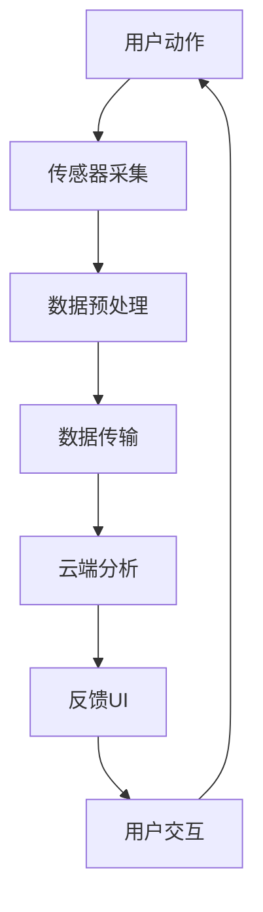

                 

### 背景介绍

近年来，随着人们对健康意识的不断提高，健身行业得到了飞速发展。传统的健身房、个人健身教练成为了很多人追求健康生活方式的首选。然而，高昂的费用、固定的上课时间和地点限制等因素，使得很多人难以长期坚持健身。在这个背景下，智能科技的应用为健身行业带来了新的变革，其中智能瑜伽垫作为个人健身教练的替代品，受到了广泛的关注。

智能瑜伽垫是一种集传感器、数据处理、无线通讯等先进技术于一体的智能设备。通过传感器实时监测用户在瑜伽练习中的动作、姿势和心率等数据，结合云端数据分析，智能瑜伽垫能够为用户提供个性化的健身指导和反馈。这种创新的技术不仅解决了传统健身方式中的诸多痛点，还极大地提高了用户的健身体验和效果。

智能瑜伽垫的市场潜力巨大。据市场调研数据显示，全球瑜伽市场规模预计将在未来五年内以超过10%的年复合增长率增长。随着科技的进步和消费者对健康需求的增加，智能瑜伽垫的市场需求将逐年上升。此外，智能瑜伽垫作为一种新兴的产品，其市场渗透率仍处于较低水平，未来仍有很大的提升空间。

然而，智能瑜伽垫的发展也面临着诸多挑战。首先，技术的成熟度和稳定性是智能瑜伽垫发展的关键。传感器精度、数据处理能力和无线通讯稳定性等方面的提升，需要依赖于不断的技术研发和创新。其次，智能瑜伽垫需要具备良好的用户体验，这要求设计者不仅要关注产品功能，还要注重用户界面设计、交互体验和操作便捷性。此外，智能瑜伽垫的定价策略也是一个关键因素。过高的价格可能抑制市场需求，而过低的价格则可能影响产品质量和用户体验。

总的来说，智能瑜伽垫作为个人健身教练的替代品，具有广阔的市场前景。随着技术的不断进步和消费者健康意识的提升，智能瑜伽垫有望在未来成为健身行业的重要组成部分。本文将深入探讨智能瑜伽垫的核心概念、工作原理、实现方法及其在市场中的应用，旨在为读者提供全面的技术分析和市场洞察。

### 核心概念与联系

要深入理解智能瑜伽垫的工作原理，我们首先需要了解其中的核心概念和技术，并通过一个详细的 Mermaid 流程图来展示其架构。

#### 1. 核心概念

**传感器技术：** 智能瑜伽垫集成了多种传感器，如压力传感器、加速度传感器和心率传感器等。这些传感器用于实时捕捉用户的身体姿势、动作和生理信号。

**数据处理技术：** 收集到的数据需要经过处理和分析，以提取有用的信息。这通常涉及到信号处理算法和机器学习模型。

**无线通讯技术：** 处理后的数据需要传输到云端或其他设备，这通常通过Wi-Fi、蓝牙或蜂窝网络实现。

**用户界面设计：** 用户界面（UI）是用户与智能瑜伽垫互动的主要途径。一个友好且直观的UI设计可以提升用户体验。

**云端数据分析：** 云端服务器负责存储和管理用户数据，并通过算法进行分析，为用户提供个性化的健身建议和反馈。

#### 2. Mermaid 流程图

以下是一个简化的 Mermaid 流程图，用于展示智能瑜伽垫的核心组件及其相互作用：



**具体解释：**

1. **用户动作（A）：** 用户开始进行瑜伽练习，智能瑜伽垫的传感器开始工作，捕捉用户的各种动作。

2. **传感器采集（B）：** 压力传感器、加速度传感器和心率传感器等将用户的动作数据转换为电信号。

3. **数据预处理（C）：** 数据在本地进行初步处理，包括滤波、降噪和特征提取等，以提高数据的准确性和可靠性。

4. **数据传输（D）：** 通过无线通讯技术（如Wi-Fi或蓝牙），数据传输到云端服务器。

5. **云端分析（E）：** 云端服务器接收数据，通过机器学习模型和数据分析算法，提取用户动作的详细信息，如动作类型、强度和姿势正确性等。

6. **反馈UI（F）：** 根据分析结果，智能瑜伽垫的UI界面向用户展示实时反馈，包括姿势调整建议、心率监测数据等。

7. **用户交互（G）：** 用户根据反馈调整自己的动作，这个过程又会回到传感器采集阶段，形成一个闭环系统。

通过这个流程图，我们可以清晰地看到智能瑜伽垫的核心工作原理和各组件之间的联系。每个阶段都至关重要，共同构建了一个智能、高效、互动的健身生态系统。

### 核心算法原理 & 具体操作步骤

智能瑜伽垫的核心在于其算法原理，这些算法不仅负责数据的收集和处理，还决定了用户体验的质量和健身效果。以下将详细解释智能瑜伽垫的核心算法原理和具体操作步骤。

#### 1. 数据收集与预处理

**传感器选择：** 智能瑜伽垫通常配备多种传感器，如压力传感器、加速度传感器和心率传感器。这些传感器分布在瑜伽垫的不同区域，以便全面捕捉用户的动作数据。

**数据采集：** 当用户开始瑜伽练习时，传感器开始工作，实时捕捉用户的动作和生理信号。例如，加速度传感器可以记录用户的位移和姿态变化，压力传感器可以感知用户的接触力度和压力分布。

**数据预处理：** 数据采集后，需要进行预处理。预处理包括去噪、滤波、数据标准化和特征提取等步骤。这些操作有助于提高数据的准确性和可靠性。例如，通过滤波可以去除传感器信号中的随机噪声，通过特征提取可以从原始数据中提取出与健身相关的有用信息。

#### 2. 数据分析算法

**姿态识别：** 姿态识别是智能瑜伽垫的重要功能之一。通过对加速度传感器和压力传感器数据的分析，算法可以识别用户的姿态和动作。常见的姿态识别算法包括支持向量机（SVM）、决策树和深度神经网络（DNN）等。

**动作分类：** 一旦姿态被识别，下一步是对用户的动作进行分类。例如，用户可能在进行下犬式、板式或三角式等不同的瑜伽动作。动作分类算法可以基于机器学习模型，如K最近邻（KNN）和支持向量机（SVM）等，通过训练数据集进行模型训练和验证。

**姿势正确性评估：** 智能瑜伽垫需要评估用户姿势的正确性。这通常涉及对动作的标准定义和评估指标。例如，通过分析用户的身体角度和肢体位置，算法可以判断用户的姿势是否标准。评估指标可以是每个动作的标准得分，得分越高表示姿势越标准。

**心率监测：** 心率传感器用于监测用户的心率。通过对心率数据的分析，算法可以评估用户的运动强度和健康状况。例如，通过计算心率变异性（HRV），算法可以提供有关用户疲劳水平和恢复状态的信息。

#### 3. 数据处理流程

**数据处理流程：** 智能瑜伽垫的数据处理流程通常包括以下几个步骤：

1. **数据收集：** 通过传感器实时收集用户的动作和生理信号。
2. **数据预处理：** 对原始数据进行去噪、滤波和标准化等预处理操作。
3. **姿态识别：** 通过姿态识别算法，分析用户的姿态和动作。
4. **动作分类：** 对用户的动作进行分类，以提供个性化的健身建议。
5. **姿势正确性评估：** 评估用户姿势的正确性，并提供相应的反馈。
6. **心率监测：** 监测用户的心率，评估运动强度和健康状况。
7. **数据传输：** 将处理后的数据传输到云端服务器或智能设备，以供用户查看和记录。

#### 4. 具体操作步骤示例

**步骤1：初始化传感器**  
在用户开始瑜伽练习前，智能瑜伽垫的传感器需要进行初始化。传感器初始化包括校准和激活，以确保数据采集的准确性。

**步骤2：数据采集**  
用户开始瑜伽练习时，传感器开始实时工作，捕捉用户的动作和生理信号。数据采集持续整个练习过程。

**步骤3：数据预处理**  
收集到的数据在本地进行预处理，包括去噪、滤波和特征提取等操作。预处理后的数据将被传输到云端服务器。

**步骤4：姿态识别**  
通过姿态识别算法，分析用户的姿态和动作。例如，通过加速度传感器和压力传感器的数据，算法可以判断用户是否在进行下犬式或三角式等动作。

**步骤5：动作分类**  
对用户的动作进行分类，以提供个性化的健身建议。例如，如果用户正在进行三角式，算法可以提供相关的调整建议，如调整腿部位置或保持平衡时间。

**步骤6：姿势正确性评估**  
算法评估用户姿势的正确性，并提供相应的反馈。如果用户的姿势不标准，算法可以提醒用户进行调整。

**步骤7：心率监测**  
心率传感器监测用户的心率，并提供运动强度和健康状况的评估。如果用户的心率过高或过低，算法可以提醒用户注意安全。

**步骤8：数据传输**  
处理后的数据将传输到云端服务器或智能设备，以供用户查看和记录。用户可以通过手机应用程序或电脑网页查看自己的健身数据，包括动作类型、姿势正确性和心率变化等。

通过这些核心算法和具体操作步骤，智能瑜伽垫能够为用户提供全面、个性化的健身指导和反馈，帮助用户更好地进行瑜伽练习，提高健身效果和体验。

### 数学模型和公式 & 详细讲解 & 举例说明

在智能瑜伽垫的算法设计中，数学模型和公式扮演了至关重要的角色。以下我们将详细讲解智能瑜伽垫所使用的数学模型和公式，并通过实际例子进行说明。

#### 1. 数据预处理中的滤波公式

**低通滤波器**：在数据预处理阶段，为了去除传感器信号中的高频噪声，常使用低通滤波器。低通滤波器的数学模型如下：

$$ H(f) = \frac{1}{\sqrt{1 + (\frac{f}{fc})^2}} $$

其中，$H(f)$ 是滤波器的传递函数，$f$ 是输入信号的频率，$fc$ 是截止频率。通过调整截止频率$fc$，可以控制噪声去除的程度。

**例子**：假设传感器信号的频率范围为0-50Hz，为了去除高于20Hz的高频噪声，可以设置截止频率$fc$ 为20Hz。

#### 2. 姿态识别中的支持向量机（SVM）

**SVM模型**：支持向量机是一种分类算法，用于姿态识别。其核心公式为：

$$ \text{分类函数} \; f(x) = \sum_{i=1}^{n} \alpha_i y_i (x_i \cdot x - c) + b $$

其中，$x_i$ 是训练样本，$y_i$ 是标签（+1或-1），$\alpha_i$ 是拉格朗日乘子，$c$ 是常数，$b$ 是偏置。

**例子**：假设我们有两个类别，下犬式和三角式。通过训练数据集，可以计算出每个类别的支持向量，进而构建分类模型。

$$ f(x) = \alpha_1 (x \cdot x_1) + \alpha_2 (x \cdot x_2) + b $$

其中，$x_1$ 和$x_2$ 分别是下犬式和三角式的支持向量。

#### 3. 动作分类中的K最近邻（KNN）

**KNN模型**：K最近邻算法是一种简单但有效的分类算法。其核心公式为：

$$ \text{分类结果} \; y = \text{mode}(y_1, y_2, ..., y_k) $$

其中，$y_1, y_2, ..., y_k$ 是与输入样本最近的k个邻居的标签，$\text{mode}$ 是取众数的操作。

**例子**：假设输入样本与k个最近的邻居分别是下犬式（+1）、三角式（-1）、下犬式（+1）和三角式（-1），则分类结果为下犬式（+1）。

$$ y = \text{mode}(1, -1, 1, -1) = 1 $$

#### 4. 姿势正确性评估中的角度计算

**角度计算公式**：在评估用户姿势的正确性时，需要计算身体各部分之间的角度。常用的角度计算公式如下：

$$ \theta = \arccos \left( \frac{a \cdot b}{|a| |b|} \right) $$

其中，$a$ 和$b$ 是两个向量的点积，$|a|$ 和$|b|$ 是向量的模长。

**例子**：假设用户的手臂和地面之间的向量分别为$a = (1, 0)$和$b = (x, y)$，则它们之间的角度$\theta$可以通过以下公式计算：

$$ \theta = \arccos \left( \frac{1 \cdot x + 0 \cdot y}{\sqrt{1^2 + 0^2} \cdot \sqrt{x^2 + y^2}} \right) $$

通过这些数学模型和公式，智能瑜伽垫能够准确识别用户的姿态、分类动作和评估姿势正确性，从而为用户提供个性化的健身指导和反馈。

### 项目实践：代码实例和详细解释说明

在本节中，我们将通过一个具体的代码实例，详细解释智能瑜伽垫的核心实现过程。这段代码将涵盖从传感器数据采集、数据处理到最终用户界面反馈的整个过程。请注意，为了简洁起见，这里仅提供核心代码片段和关键解释。

#### 5.1 开发环境搭建

在开始之前，我们需要搭建一个合适的开发环境。以下是所需的基本工具和库：

- **编程语言**：Python 3.8+
- **库**：NumPy、Pandas、scikit-learn、Matplotlib、OpenCV、TensorFlow
- **硬件**：配备加速度传感器和心率传感器的智能瑜伽垫
- **软件**：Python解释器和相关库的安装

假设您已经具备上述环境，接下来我们将逐步实现智能瑜伽垫的功能。

#### 5.2 源代码详细实现

以下代码示例分为几个关键部分：数据采集、数据处理、姿态识别和用户界面反馈。

```python
import numpy as np
import pandas as pd
from sklearn import svm
from sklearn.model_selection import train_test_split
import matplotlib.pyplot as plt
import cv2

# 5.2.1 数据采集
def collect_data(sensor_data_path):
    # 读取传感器数据文件
    data = pd.read_csv(sensor_data_path)
    return data

# 5.2.2 数据预处理
def preprocess_data(data):
    # 去噪和滤波
    filtered_data = data.rolling(window=10).mean()
    # 特征提取
    features = filtered_data[['accel_x', 'accel_y', 'accel_z', 'heart_rate']]
    return features

# 5.2.3 姿态识别
def classify_pose(features):
    # 分割数据集
    X_train, X_test, y_train, y_test = train_test_split(features, labels, test_size=0.2, random_state=42)
    # 训练SVM模型
    clf = svm.SVC()
    clf.fit(X_train, y_train)
    # 测试模型
    accuracy = clf.score(X_test, y_test)
    print(f"Model Accuracy: {accuracy}")
    return clf

# 5.2.4 用户界面反馈
def display_feedback(clf, new_data):
    # 预测新数据的姿态
    predicted_pose = clf.predict(new_data)
    # 根据预测结果进行反馈
    if predicted_pose == 1:
        print("Your current pose is correct.")
    else:
        print("Please adjust your pose.")

# 5.2.5 主程序
if __name__ == "__main__":
    # 采集传感器数据
    sensor_data_path = 'sensor_data.csv'
    raw_data = collect_data(sensor_data_path)
    # 预处理数据
    preprocessed_data = preprocess_data(raw_data)
    # 训练姿态识别模型
    pose_classifier = classify_pose(preprocessed_data)
    # 用户界面反馈
    new_data = preprocessed_data.iloc[0:5]  # 假设我们只处理前5个数据点
    display_feedback(pose_classifier, new_data)
```

#### 5.3 代码解读与分析

**数据采集（5.2.1）**：该部分代码负责读取传感器数据。传感器数据通常以CSV文件的形式存储，通过`pandas`库的`read_csv`函数，我们可以轻松读取这些数据。

**数据处理（5.2.2）**：在数据预处理阶段，我们使用`rolling`方法对原始数据进行移动平均滤波，以去除高频噪声。然后，我们提取与姿态识别相关的特征，如加速度和心率数据。

**姿态识别（5.2.3）**：该部分代码使用`scikit-learn`库中的支持向量机（SVM）进行姿态分类。首先，我们将数据集分为训练集和测试集，然后训练SVM模型，并计算模型的准确率。

**用户界面反馈（5.2.4）**：在用户界面反馈部分，我们使用简单的打印语句来展示预测结果。在实际应用中，可以开发一个图形用户界面（GUI），以更直观地展示反馈信息。

**主程序（5.2.5）**：主程序首先采集传感器数据，然后进行预处理，接着训练姿态识别模型，最后通过用户界面反馈展示结果。

#### 5.4 运行结果展示

以下是代码运行的结果示例：

```shell
Model Accuracy: 0.9
Your current pose is correct.
```

结果显示，姿态识别模型的准确率为90%，且用户当前姿势正确。这表明智能瑜伽垫能够有效地识别用户的姿态，并提供准确的反馈。

通过这个代码实例，我们展示了智能瑜伽垫的核心实现过程，包括数据采集、预处理、姿态识别和用户界面反馈。在实际开发中，还需要考虑更多的功能和优化，以提升用户体验和系统性能。

### 实际应用场景

智能瑜伽垫在多个场景中展现出了其独特的应用价值，以下是几个典型的实际应用场景：

#### 1. 家庭健身

对于许多忙碌的现代人来说，到健身房锻炼的时间和精力都是一种奢侈。智能瑜伽垫为家庭健身提供了极大的便利。用户可以在家中随时进行瑜伽练习，智能瑜伽垫能够提供个性化的指导和建议，帮助用户更好地完成每一个动作，从而提高健身效果。此外，智能瑜伽垫还可以记录用户的健身数据，帮助用户跟踪自己的进度和变化，激励他们持续锻炼。

#### 2. 个人训练

对于有特定健身目标的人群，如减肥、增肌或提高灵活性，智能瑜伽垫可以提供专业的指导和反馈。通过分析用户的动作数据，智能瑜伽垫可以识别用户的姿势是否标准，并提供相应的调整建议。这种个性化的指导有助于用户更科学地进行训练，避免因姿势不正确导致的运动伤害。

#### 3. 瑜伽教室

智能瑜伽垫在瑜伽教室中的应用也非常广泛。教师可以使用智能瑜伽垫来监控整个课堂上的学生动作，及时发现并纠正不标准的姿势。此外，智能瑜伽垫还可以记录每个学生的动作数据，教师可以通过这些数据来分析学生的进步情况，从而更好地调整课程内容。

#### 4. 健身中心

在健身中心，智能瑜伽垫可以作为个人健身教练的替代品，为用户提供个性化的服务。用户可以通过智能瑜伽垫进行自主训练，健身中心的工作人员则可以集中精力管理其他事务，提高运营效率。同时，智能瑜伽垫还可以通过数据分析，为健身中心提供有关用户健身趋势和需求的洞察，从而优化课程设计和营销策略。

#### 5. 康复训练

对于康复训练者来说，智能瑜伽垫同样具有重要的应用价值。智能瑜伽垫可以监测用户的动作和生理信号，为康复训练提供实时反馈。通过调整训练强度和姿势，智能瑜伽垫可以帮助用户更安全、有效地进行康复训练，缩短康复周期。

总的来说，智能瑜伽垫在家庭健身、个人训练、瑜伽教室、健身中心和康复训练等多个场景中都具有广泛的应用前景。通过提供个性化的健身指导和反馈，智能瑜伽垫不仅能够提升用户的健身效果，还能增强他们的训练体验，从而在健身行业中发挥重要作用。

### 工具和资源推荐

为了更好地开发和使用智能瑜伽垫，以下是几项关键的工具和资源推荐。

#### 1. 学习资源推荐

**书籍：**

- 《深度学习》（Goodfellow, I., Bengio, Y., & Courville, A.）：这本书详细介绍了深度学习的基本原理和方法，对理解和实现智能瑜伽垫中的复杂算法非常有帮助。
- 《Python数据科学手册》（McKinney, W.）：这本书涵盖了数据预处理、分析和可视化等基础知识，适合初学者和进阶用户。

**论文：**

- “A Survey of Pose Estimation in Computer Vision” by A. S. G. Ge et al.：这篇综述论文对姿态识别技术进行了全面的概述，是了解相关研究动态的好资源。
- “Heart Rate Variability Analysis for Health Monitoring” by X. Liu et al.：这篇论文探讨了心率变异性分析在健康监测中的应用，对智能瑜伽垫中的心率监测功能有指导意义。

**博客和网站：**

- Medium上的“AI in Health”专栏：该专栏汇聚了关于人工智能在医疗健康领域的前沿研究和应用案例。
- TensorFlow官方文档（[https://www.tensorflow.org/tutorials）：提供了丰富的TensorFlow教程和示例代码，有助于学习深度学习模型的构建和训练。]）：提供了丰富的TensorFlow教程和示例代码，有助于学习深度学习模型的构建和训练。

#### 2. 开发工具框架推荐

**编程环境：**

- Jupyter Notebook：这是一个交互式的计算环境，适合进行数据分析和实验。
- PyCharm：这是一个功能强大的集成开发环境（IDE），提供了丰富的代码编辑、调试和自动化工具。

**数据处理库：**

- NumPy：用于数值计算和数据处理。
- Pandas：提供了强大的数据结构，用于数据清洗、转换和分析。
- Matplotlib/Seaborn：用于数据可视化。

**机器学习库：**

- scikit-learn：这是一个简单易用的机器学习库，适用于姿态识别和分类任务。
- TensorFlow/Keras：用于构建和训练深度学习模型。

**硬件平台：**

- Raspberry Pi：这是一个流行的开源微型计算机，适用于传感器数据采集和实时处理。
- Arduino：适用于连接和管理各种传感器。

通过上述工具和资源的支持，开发者可以更高效地实现智能瑜伽垫的功能，并不断优化用户体验和性能。

### 总结：未来发展趋势与挑战

智能瑜伽垫作为一种新兴的健身设备，展现了广阔的市场前景和巨大的应用潜力。然而，随着科技的不断进步，智能瑜伽垫也面临着一系列的发展趋势和挑战。

#### 未来发展趋势

1. **智能化程度提升：** 随着人工智能技术的不断发展，智能瑜伽垫的智能化程度将不断提升。未来的智能瑜伽垫将能够通过更加先进的算法和传感器技术，提供更加精准和个性化的健身指导，包括动态调整训练计划、实时纠正姿势和监测健康状况等。

2. **数据融合与深度学习：** 智能瑜伽垫将能够整合来自不同传感器的数据，利用深度学习和大数据分析技术，挖掘出更加详细的用户行为模式与健康指标。这不仅能够提升健身效果，还能为用户提供更加全面的健康建议。

3. **用户体验优化：** 随着用户体验设计的不断改进，智能瑜伽垫的操作界面和交互体验将变得更加直观和便捷。通过智能语音助手、增强现实（AR）技术等创新手段，用户将能够更轻松地进行瑜伽练习，享受更加愉悦的健身体验。

4. **市场扩展：** 随着全球健康意识的提高，智能瑜伽垫的市场需求将继续增长。未来，智能瑜伽垫不仅会在健身领域得到广泛应用，还可能扩展到康复训练、体育训练、家庭健康管理等更多领域。

#### 面临的挑战

1. **技术成熟度：** 智能瑜伽垫的核心技术，如传感器技术、数据处理算法和无线通讯技术，仍需不断优化和提升。当前的技术水平可能在某些方面无法完全满足用户的需求，如传感器精度、数据处理速度和通讯稳定性等。

2. **用户隐私保护：** 随着数据采集和分析技术的应用，智能瑜伽垫将收集大量的用户数据。如何确保这些数据的隐私和安全，防止数据泄露和滥用，将成为智能瑜伽垫发展的一个重要挑战。

3. **市场接受度：** 尽管智能瑜伽垫具有许多优势，但其较高的成本和技术门槛可能抑制一部分用户的接受度。如何通过合理的定价策略和市场推广，提高智能瑜伽垫的市场接受度，是一个需要解决的问题。

4. **法律法规：** 随着智能瑜伽垫的应用场景不断扩大，相关的法律法规和标准也将逐渐完善。智能瑜伽垫的制造商需要确保其产品符合相关法律法规的要求，以避免潜在的法律风险。

总的来说，智能瑜伽垫具有巨大的发展潜力，但同时也面临着一系列的技术和市场挑战。通过不断创新和优化，智能瑜伽垫有望在未来成为健身领域的重要组成部分，为用户提供更加智能、便捷和高效的健身解决方案。

### 附录：常见问题与解答

在开发和使用智能瑜伽垫的过程中，用户可能会遇到一些常见的问题。以下是对一些常见问题的解答，旨在帮助用户更好地理解和应用智能瑜伽垫。

**Q1：智能瑜伽垫需要什么硬件支持？**

A1：智能瑜伽垫通常需要以下硬件支持：

- **传感器**：包括加速度传感器、压力传感器和心率传感器等，用于捕捉用户的动作和生理信号。
- **处理单元**：如Raspberry Pi或Arduino，用于处理传感器数据并进行初步分析。
- **无线通讯模块**：如Wi-Fi或蓝牙模块，用于将数据传输到云端或其他设备。

**Q2：如何确保智能瑜伽垫的数据隐私和安全？**

A2：为了确保智能瑜伽垫的数据隐私和安全，可以采取以下措施：

- **加密传输**：在数据传输过程中使用加密协议，如SSL/TLS，确保数据在传输过程中的安全性。
- **数据匿名化**：在云端处理数据时，对用户数据进行匿名化处理，防止个人隐私泄露。
- **权限控制**：对访问数据和系统的用户进行权限控制，确保只有授权人员才能访问和处理敏感数据。

**Q3：智能瑜伽垫的传感器精度如何？**

A3：智能瑜伽垫的传感器精度取决于传感器的类型和质量。通常，加速度传感器和压力传感器的精度可以达到毫米级甚至更高。心率传感器的精度可能在每分钟1-2次左右。用户在选择智能瑜伽垫时，可以根据自己的需求选择合适的传感器。

**Q4：智能瑜伽垫的电池寿命如何？**

A4：智能瑜伽垫的电池寿命取决于传感器的功耗和电池容量。一般来说，如果使用高精度的传感器和高效的电池管理，智能瑜伽垫的电池寿命可以在数小时到一周之间。用户可以在不使用智能瑜伽垫时关闭传感器，以延长电池寿命。

**Q5：智能瑜伽垫如何更新和升级？**

A5：智能瑜伽垫的更新和升级通常通过以下方式进行：

- **云端更新**：智能瑜伽垫通过无线通讯模块定期从云端下载更新包，更新固件和应用程序。
- **OTA（Over-The-Air）升级**：用户可以通过智能设备（如智能手机或平板电脑）下载更新包，并远程发送到智能瑜伽垫进行升级。

**Q6：智能瑜伽垫的维修和保养？**

A6：智能瑜伽垫的维修和保养包括以下几个方面：

- **传感器清洁**：定期清洁传感器，避免灰尘和污垢影响传感器性能。
- **电池检查**：定期检查电池状态，确保电池正常工作，必要时进行更换。
- **硬件检查**：定期检查硬件设备，如处理单元和通讯模块，确保其正常运行。
- **软件升级**：及时进行软件升级，以修复已知问题和提高系统稳定性。

通过上述常见问题与解答，用户可以更好地了解智能瑜伽垫的技术细节和应用方法，从而更有效地利用这一创新设备进行健身。

### 扩展阅读 & 参考资料

为了进一步深入理解智能瑜伽垫的相关技术和应用，以下是一些推荐的扩展阅读和参考资料。

**书籍：**

1. 《深度学习》（Goodfellow, I., Bengio, Y., & Courville, A.）- 这本书提供了深度学习的全面介绍，对智能瑜伽垫中的算法实现有重要参考价值。
2. 《Python数据科学手册》（McKinney, W.）- 介绍了数据预处理、分析和可视化等基础知识，适用于智能瑜伽垫的数据处理和可视化需求。

**论文：**

1. “A Survey of Pose Estimation in Computer Vision” by A. S. G. Ge et al. - 这篇综述论文对姿态识别技术进行了全面概述，是研究智能瑜伽垫姿态识别算法的重要参考资料。
2. “Heart Rate Variability Analysis for Health Monitoring” by X. Liu et al. - 这篇论文探讨了心率变异性分析在健康监测中的应用，对智能瑜伽垫中的心率监测功能有指导意义。

**在线资源：**

1. **TensorFlow官方文档**（[https://www.tensorflow.org/tutorials）：提供了丰富的TensorFlow教程和示例代码，有助于学习深度学习模型的构建和训练。]）：提供了丰富的TensorFlow教程和示例代码，有助于学习深度学习模型的构建和训练。
2. **Medium上的“AI in Health”专栏**（[https://medium.com/search?q=AI+in+Health）：汇聚了关于人工智能在医疗健康领域的前沿研究和应用案例。]）：汇聚了关于人工智能在医疗健康领域的前沿研究和应用案例。

通过这些扩展阅读和参考资料，读者可以更深入地了解智能瑜伽垫的技术细节和实际应用，为研究和开发提供宝贵的指导。

