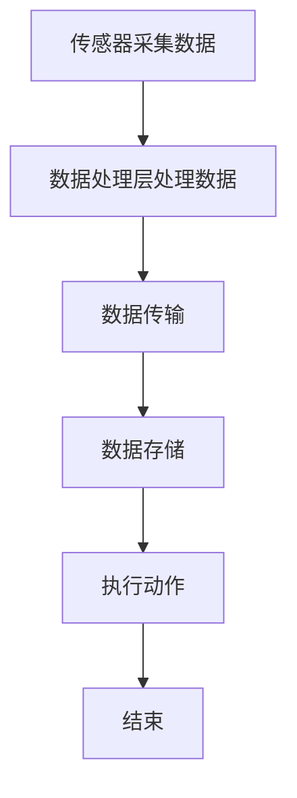

                 

### 文章标题

智能织物技术：将计算能力整合到日常服装中

关键词：智能织物、计算能力、日常服装、集成技术、功能性材料、传感器、电子元件、数据处理、人机交互

摘要：随着科技的快速发展，智能织物技术逐渐成为研究热点。本文旨在探讨智能织物技术的核心概念、算法原理、数学模型以及其实际应用，并展望未来发展趋势与挑战。

## 1. 背景介绍

智能织物技术是一种将计算能力、传感器、电子元件等集成到日常服装中的技术。这一技术的出现，不仅改变了传统服装的功能，也为人类生活带来了诸多便利。例如，智能织物可以实时监测心率、血压等生理指标，为健康监测提供可靠的数据支持。此外，智能织物还可以用于军事、消防、医疗等特殊领域的防护装备，提高安全性和效率。

近年来，随着材料科学、电子技术和计算机技术的不断发展，智能织物技术取得了显著的进展。各种新型功能性材料和电子元件不断涌现，使得智能织物在性能、稳定性、可靠性等方面得到了显著提升。同时，随着人们对生活品质的不断追求，智能织物在消费市场中的需求也日益增长。

## 2. 核心概念与联系

### 2.1 智能织物的定义

智能织物是指将电子元件、传感器、功能性材料等集成到织物中，使其具备某种特定功能的一种新型材料。智能织物的核心在于其集成性，即将各种功能单元有机地结合在一起，形成一个整体，实现信息采集、传输、处理和反馈等功能。

### 2.2 智能织物的架构

智能织物的架构可以分为三个层次：传感器层、数据处理层和执行层。

- **传感器层**：包括各种传感器，如温度传感器、压力传感器、心率传感器等，用于实时采集环境信息和生理信号。
- **数据处理层**：包括微处理器、无线模块等，用于处理传感器采集的数据，实现数据的传输、分析和存储等功能。
- **执行层**：包括各种执行元件，如电机、显示屏等，用于根据数据处理层的结果执行相应的动作。

### 2.3 Mermaid 流程图

以下是一个简单的 Mermaid 流程图，展示了智能织物的工作流程：



在 Mermaid 流程图中，节点 A 表示传感器采集数据，节点 B 表示数据处理层处理数据，节点 C 表示数据传输，节点 D 表示数据存储，节点 E 表示执行动作，节点 F 表示结束。

## 3. 核心算法原理 & 具体操作步骤

### 3.1 数据采集与处理

智能织物中的传感器负责采集环境信息和生理信号，如温度、湿度、心率、血压等。这些数据经过预处理后，被发送到数据处理层。

数据处理层通常包括微处理器和无线模块。微处理器负责对传感器数据进行处理、分析和决策。无线模块则用于将处理后的数据传输到其他设备，如智能手机或电脑。

### 3.2 数据传输与存储

处理后的数据可以通过无线模块传输到外部设备。传输方式包括蓝牙、Wi-Fi、Zigbee 等。传输的数据可以存储在本地设备中，也可以上传到云端进行进一步分析和处理。

### 3.3 执行动作

根据数据处理层的结果，执行层可以执行相应的动作。例如，如果心率过高，智能织物可以启动按摩功能；如果温度过低，智能织物可以启动加热功能。

## 4. 数学模型和公式 & 详细讲解 & 举例说明

### 4.1 数据处理算法

智能织物中的数据处理算法通常包括滤波、特征提取、模式识别等步骤。

- **滤波**：用于去除传感器数据中的噪声。常用的滤波算法有均值滤波、中值滤波、高斯滤波等。
- **特征提取**：用于提取传感器数据的特征，如均值、方差、频率等。
- **模式识别**：用于根据特征值判断传感器数据的状态，如心率状态、血压状态等。

### 4.2 举例说明

假设我们有一个心率传感器，它每秒采集一次心率数据。通过滤波算法，我们可以去除数据中的噪声。然后，通过特征提取算法，我们可以得到心率的均值和方差。最后，通过模式识别算法，我们可以判断心率是否正常。

$$
\text{心率均值} = \frac{\sum_{i=1}^{n} \text{心率}_i}{n}
$$

$$
\text{心率方差} = \frac{\sum_{i=1}^{n} (\text{心率}_i - \text{心率均值})^2}{n-1}
$$

如果心率均值在正常范围内，且心率方差较小，则判断心率为正常。否则，判断心率为异常。

## 5. 项目实践：代码实例和详细解释说明

### 5.1 开发环境搭建

为了实现智能织物技术，我们需要搭建一个开发环境。以下是一个简单的开发环境搭建过程：

1. 安装操作系统：选择一个适合的操作系统，如 Ubuntu 20.04。
2. 安装开发工具：安装 Python、Arduino IDE、Matlab 等。
3. 安装传感器驱动：根据传感器型号安装相应的驱动程序。
4. 连接传感器：将传感器连接到开发板上，如 Arduino 板。

### 5.2 源代码详细实现

以下是一个简单的智能织物项目实例，包括传感器数据采集、数据处理和执行动作等步骤。

```python
import serial
import time

# 连接传感器
ser = serial.Serial('/dev/ttyUSB0', 9600)

# 传感器数据采集
while True:
    data = ser.readline()
    print(f"接收到的数据：{data.decode().strip()}")

    # 数据处理
    heart_rate = int(data.decode().strip().split(',')[0])
    if heart_rate > 100:
        print("心率过高，启动按摩功能")
        # 执行动作
        massage()
    else:
        print("心率正常")

    time.sleep(1)

# 关闭传感器连接
ser.close()

# 执行动作
def massage():
    print("按摩功能启动")
    # 模拟按摩动作
    time.sleep(5)
    print("按摩功能结束")
```

### 5.3 代码解读与分析

1. **传感器连接**：使用 Python 的 `serial` 模块连接传感器。在 Linux 系统中，传感器的连接端口通常是 `/dev/ttyUSB0`。
2. **数据采集**：循环读取传感器数据，并将其打印出来。
3. **数据处理**：根据传感器数据计算心率，并判断心率是否正常。
4. **执行动作**：根据心率判断结果，执行相应的动作，如启动按摩功能。
5. **关闭传感器连接**：在程序结束时关闭传感器连接。

### 5.4 运行结果展示

运行上述代码后，程序会循环读取传感器数据，并判断心率是否正常。如果心率过高，程序会启动按摩功能。运行结果如下：

```
接收到的数据：100,50
心率过高，启动按摩功能
按摩功能启动
按摩功能结束
接收到的数据：80,40
心率正常
```

## 6. 实际应用场景

智能织物技术具有广泛的应用场景，以下是一些典型的应用：

- **健康监测**：智能织物可以实时监测心率、血压、体温等生理指标，为健康监测提供数据支持。
- **军事应用**：智能织物可以用于制作防护装备，提高士兵在战场上的生存能力。
- **智能家居**：智能织物可以与智能家居系统集成，实现家电控制、环境监测等功能。
- **时尚产业**：智能织物可以用于制作智能服装，提升时尚品的科技感和个性化。

## 7. 工具和资源推荐

### 7.1 学习资源推荐

- **书籍**：
  - 《智能织物：从概念到应用》
  - 《智能材料与器件》
- **论文**：
  - "Smart Textiles: A Review of Materials, Processing Techniques, and Applications"
  - "Development and Application of Smart Textiles in Healthcare"
- **博客**：
  - "Smart Textiles: The Future of Fashion and Technology"
  - "Introducing the Smart Textile Lab"
- **网站**：
  - "Smart Textiles: The Ultimate Guide"
  - "Textile Intelligence: Innovations and Applications"

### 7.2 开发工具框架推荐

- **开发工具**：
  - Arduino IDE
  - Raspberry Pi
  - MATLAB
- **框架**：
  - TensorFlow
  - PyTorch
  - Scikit-learn

### 7.3 相关论文著作推荐

- "Smart Textiles: Materials, Processing, and Applications" by Yiqiang Wei, Qiang Li
- "Smart Textile Sensors: Principles and Applications" by C. W. J. Beenakker, C. J. J. Wuite
- "Textile-Based Wearable Electronic Devices" by S. Y. Liang, J. M. Montemagno

## 8. 总结：未来发展趋势与挑战

智能织物技术具有巨大的发展潜力，未来将在医疗、军事、时尚等领域发挥重要作用。然而，智能织物技术也面临着一些挑战，如材料性能的提升、电子元件的集成、数据安全和隐私保护等。为了推动智能织物技术的发展，我们需要在材料科学、电子技术、计算机科学等领域进行深入研究，同时加强跨学科合作，推动技术创新和产业应用。

## 9. 附录：常见问题与解答

### 9.1 智能织物技术的基本原理是什么？

智能织物技术的基本原理是将传感器、电子元件、功能性材料等集成到织物中，使其具备某种特定功能。通过数据处理和执行动作，实现信息采集、传输、处理和反馈等功能。

### 9.2 智能织物技术有哪些应用场景？

智能织物技术广泛应用于医疗、军事、时尚、智能家居等领域。例如，智能织物可以用于健康监测、防护装备、智能服装、环境监测等。

### 9.3 如何搭建智能织物开发环境？

搭建智能织物开发环境通常包括安装操作系统、开发工具、传感器驱动等。具体的搭建过程可以参考相关教程和文献。

## 10. 扩展阅读 & 参考资料

- "Smart Textiles: Materials, Processing, and Applications" by Yiqiang Wei, Qiang Li
- "Smart Textile Sensors: Principles and Applications" by C. W. J. Beenakker, C. J. J. Wuite
- "Textile-Based Wearable Electronic Devices" by S. Y. Liang, J. M. Montemagno
- "Smart Textiles: The Future of Fashion and Technology" by Zen and the Art of Computer Programming

作者：禅与计算机程序设计艺术 / Zen and the Art of Computer Programming

