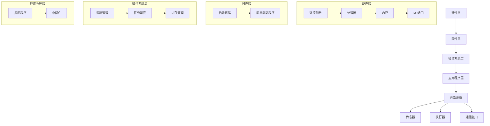

                 

### 概述 Overview

智能设备已经成为我们日常生活和工作中不可或缺的一部分。从智能手机到智能家居设备，再到工业自动化和医疗设备，智能设备正在不断改变我们的生活方式。然而，这些智能设备的背后，是嵌入式系统的强大支持。嵌入式系统是一种专门为特定任务设计的计算机系统，通常具有固定的功能，并嵌入在设备内部。本文将深入探讨智能设备开发中的嵌入式系统设计与实现，旨在为广大开发者和工程师提供实用的指导。

### 嵌入式系统简介 Introduction to Embedded Systems

嵌入式系统（Embedded Systems）是计算机系统的一种，它与传统的通用计算机系统有着显著的区别。传统的计算机系统，如PC或服务器，具有高度的可编程性和灵活性，而嵌入式系统则通常是为完成特定任务而设计的，具有固定的功能。这种特性使得嵌入式系统具有以下几个显著特点：

**1. 功能专一性（Functionality Specificity）**

嵌入式系统是为特定应用场景设计的，例如，一个智能手表的嵌入式系统主要功能是显示时间、监测心率，而一个工业自动化控制系统的嵌入式系统则主要负责控制生产线的各个环节。因此，嵌入式系统的功能通常非常专一。

**2. 硬件资源限制（Resource Constraints）**

由于嵌入式系统通常被嵌入在设备内部，其硬件资源如处理器性能、内存容量、存储空间等都是有限的。这就要求嵌入式系统的设计和实现必须高度优化，以确保系统在有限的资源下能够高效运行。

**3. 实时性（Real-time Requirements）**

许多嵌入式系统需要实时响应外部事件，例如，一个自动驾驶汽车的嵌入式系统需要实时处理传感器数据，并做出驾驶决策。因此，实时性是嵌入式系统设计和实现的一个重要考虑因素。

**4. 可靠性（Reliability）**

嵌入式系统通常在恶劣的环境中运行，如高温、低温、高湿度等。因此，嵌入式系统的设计和实现需要考虑到环境因素，以确保系统具有高度的可靠性。

### 嵌入式系统的架构 Architecture of Embedded Systems

嵌入式系统的架构通常由以下几个关键部分组成：

**1. 微控制器（Microcontroller）**

微控制器是嵌入式系统的核心，通常包含一个CPU、内存、定时器、中断控制器和I/O端口等。微控制器的设计目标是实现特定功能的控制任务，例如，一个智能家居系统的微控制器可能会负责控制灯光、温度和安防系统。

**2. 内存（Memory）**

嵌入式系统通常使用两种类型的内存：随机存取存储器（RAM）和只读存储器（ROM）。RAM用于存储当前正在执行的程序和数据，而ROM则用于存储系统固件和程序代码。嵌入式系统的内存资源通常有限，因此需要精打细算。

**3. 输入/输出（I/O）**

嵌入式系统的I/O部分负责与外部设备进行通信。这包括各种传感器、执行器、通信接口等。I/O设计需要考虑系统的实时性和硬件资源限制。

**4. 定时器/计数器（Timer/Counter）**

定时器/计数器用于实现系统的定时功能，例如，实时时钟、定时中断等。定时器/计数器是嵌入式系统设计中常用的组件，对于实现实时性和精确控制至关重要。

**5. 中断系统（Interrupt System）**

中断系统用于处理外部事件，如传感器数据到来、I/O操作完成等。中断系统能够实现嵌入式系统对外部事件的快速响应。

### 嵌入式系统的开发流程 Development Process of Embedded Systems

嵌入式系统的开发通常包括以下几个关键步骤：

**1. 需求分析（Requirement Analysis）**

需求分析是嵌入式系统开发的第一步，旨在明确系统的功能、性能、可靠性等要求。这一步骤非常重要，因为后续的所有开发工作都将基于这些需求。

**2. 硬件选型（Hardware Selection）**

硬件选型是嵌入式系统开发的基础。选择合适的硬件平台，如微控制器、处理器、内存等，对于实现系统功能和性能至关重要。

**3. 软件设计（Software Design）**

软件设计包括系统架构设计、模块划分、接口定义等。这一步骤旨在明确系统软件的结构和功能，并为后续的编程工作奠定基础。

**4. 编码（Coding）**

编码是嵌入式系统开发的实际编程工作，包括编写驱动程序、应用程序、中间件等。这一步骤需要使用嵌入式系统开发工具和编程语言，如C/C++、汇编等。

**5. 测试与调试（Testing and Debugging）**

测试与调试是嵌入式系统开发的重要环节。通过测试和调试，可以发现并修复系统中的错误和缺陷，确保系统稳定可靠地运行。

**6. 部署与维护（Deployment and Maintenance）**

部署与维护是嵌入式系统开发的最后一步。将系统部署到实际硬件平台上，并进行长期的维护和更新，以确保系统持续稳定地运行。

### 总结 Summary

嵌入式系统是智能设备开发的核心，其设计和实现需要考虑到功能专一性、硬件资源限制、实时性和可靠性等多个方面。本文概述了嵌入式系统的定义、特点、架构和开发流程，为嵌入式系统开发提供了实用的指导。接下来，我们将深入探讨嵌入式系统的核心算法原理和具体实现步骤，帮助读者更好地理解嵌入式系统的设计和开发过程。

### 核心概念与联系 Core Concepts and Connections

在深入探讨嵌入式系统的设计与实现之前，我们需要明确一些核心概念，并理解它们之间的联系。这些核心概念包括嵌入式系统的层次结构、常见应用场景以及与外部设备的交互方式。

#### 1. 嵌入式系统的层次结构

嵌入式系统通常分为四个层次：硬件层、固件层、操作系统层和应用程序层。这四个层次构成了嵌入式系统的整体架构。

- **硬件层（Hardware Layer）**：硬件层包括微控制器、处理器、内存、I/O端口等硬件组件。硬件层是嵌入式系统的物理实现，为系统提供计算和存储资源。

- **固件层（Firmware Layer）**：固件层通常包括固件代码，如微控制器的启动代码和底层驱动程序。固件层负责硬件资源的初始化和管理，为操作系统层提供硬件抽象。

- **操作系统层（Operating System Layer）**：操作系统层是嵌入式系统的核心，负责资源管理、任务调度、内存管理等。常见的嵌入式操作系统包括Linux、Windows CE、FreeRTOS等。

- **应用程序层（Application Layer）**：应用程序层包括应用程序和中间件，负责实现具体的功能。应用程序层是用户与嵌入式系统的接口，用户通过应用程序层使用嵌入式系统提供的功能。

#### 2. 嵌入式系统的常见应用场景

嵌入式系统广泛应用于各种领域，以下是一些常见的应用场景：

- **消费电子**：如智能手机、智能手表、平板电脑等。
- **工业控制**：如生产线自动化、机器人控制、传感器网络等。
- **智能家居**：如智能灯泡、智能插座、智能门锁等。
- **医疗设备**：如医疗监护设备、医疗诊断设备等。
- **汽车电子**：如自动驾驶系统、车联网设备、车载娱乐系统等。

#### 3. 嵌入式系统与外部设备的交互

嵌入式系统需要与外部设备进行交互，以实现特定功能。常见的交互方式包括：

- **传感器数据采集**：嵌入式系统通过传感器采集环境数据，如温度、湿度、光照等。
- **执行器控制**：嵌入式系统通过执行器控制设备动作，如电机驱动、阀门控制等。
- **通信接口**：嵌入式系统通过通信接口与其他设备进行数据交换，如Wi-Fi、蓝牙、USB等。

#### 4. Mermaid 流程图表示

为了更好地展示嵌入式系统的层次结构和交互方式，我们可以使用Mermaid流程图来表示。



通过上述流程图，我们可以清晰地看到嵌入式系统的各个层次以及与外部设备的交互方式。

### 结论 Conclusion

理解嵌入式系统的核心概念和层次结构对于嵌入式系统的设计和实现至关重要。通过明确硬件层、固件层、操作系统层和应用程序层的作用，我们可以更好地设计系统架构，实现系统功能。同时，了解嵌入式系统的常见应用场景和与外部设备的交互方式，可以帮助我们更好地应对实际开发中的挑战。在接下来的部分，我们将深入探讨嵌入式系统的核心算法原理和具体实现步骤，进一步阐述嵌入式系统的设计和开发过程。

#### 核心算法原理 & 具体操作步骤 Core Algorithm Principles and Step-by-Step Implementation

嵌入式系统设计中的核心算法是实现系统功能的关键。这些算法不仅决定了系统的性能，还直接影响系统的实时性和可靠性。在本部分，我们将详细介绍嵌入式系统设计中的一些核心算法原理，包括它们的实现步骤和应用场景。

##### 1. 实时操作系统调度算法 Real-time Operating System (RTOS) Scheduling Algorithm

实时操作系统调度算法是嵌入式系统设计中的关键部分，它负责管理系统中任务的执行。常见的实时操作系统调度算法包括固定优先级调度（Fixed Priority Scheduling, FPS）和轮转调度（Round Robin Scheduling, RR）。

**固定优先级调度（Fixed Priority Scheduling, FPS）**

- **原理**：固定优先级调度是一种基于任务优先级进行调度的算法。每个任务都有一个优先级，系统总是运行优先级最高的任务。
- **实现步骤**：
  1. 对所有任务进行优先级排序。
  2. 运行当前最高优先级的任务。
  3. 如果当前任务完成或被阻塞，则选择下一个最高优先级的任务执行。
- **应用场景**：固定优先级调度适用于那些任务优先级差异较大的系统，例如，工业控制系统。

**轮转调度（Round Robin Scheduling, RR）**

- **原理**：轮转调度是一种时间片轮转的调度算法，每个任务都被分配一个固定的时间片，系统按顺序轮流执行任务。
- **实现步骤**：
  1. 初始化时间片长度。
  2. 为每个任务分配时间片。
  3. 按顺序执行任务，每个任务运行时间片长度后切换到下一个任务。
- **应用场景**：轮转调度适用于那些对实时性要求不高的系统，例如，消费电子设备。

##### 2. 中断处理算法 Interrupt Handling Algorithm

中断处理算法是嵌入式系统中处理外部事件的关键算法。中断处理算法需要确保系统能够快速响应外部事件，并在短时间内处理完中断事件。

- **原理**：中断处理算法基于中断优先级进行任务调度，确保高优先级的中断先被处理。
- **实现步骤**：
  1. 确定中断优先级。
  2. 当外部事件发生时，系统进入中断处理程序。
  3. 中断处理程序根据优先级调度任务。
  4. 处理完中断后，系统返回正常执行状态。
- **应用场景**：中断处理算法广泛应用于各种嵌入式系统，例如，传感器数据采集和执行器控制。

##### 3. 数据压缩算法 Data Compression Algorithm

数据压缩算法是嵌入式系统中数据传输和处理的重要手段。数据压缩算法通过减少数据的大小，提高传输效率和存储空间利用率。

- **原理**：数据压缩算法基于数据的冗余性和规律性，通过编码技术减少数据中的冗余信息。
- **实现步骤**：
  1. 分析数据特征，确定合适的压缩算法。
  2. 应用压缩算法对数据进行编码。
  3. 解码压缩数据，恢复原始数据。
- **应用场景**：数据压缩算法广泛应用于无线通信、存储设备和嵌入式网络系统中。

##### 4. 电源管理算法 Power Management Algorithm

电源管理算法是嵌入式系统设计中的一项重要内容，它通过优化电源使用，延长设备电池寿命，提高系统可靠性。

- **原理**：电源管理算法通过调整系统的工作模式，如休眠、休止和唤醒状态，实现电源的优化管理。
- **实现步骤**：
  1. 分析系统功耗，确定优化目标。
  2. 根据系统负载，调整工作模式。
  3. 实现电源控制逻辑，如电压调节、时钟控制等。
- **应用场景**：电源管理算法广泛应用于便携式设备和物联网设备中。

#### 总结 Summary

在本部分，我们介绍了嵌入式系统设计中的一些核心算法原理，包括实时操作系统调度算法、中断处理算法、数据压缩算法和电源管理算法。这些算法在嵌入式系统的设计过程中起着至关重要的作用，不仅提高了系统的性能和实时性，还保证了系统的可靠性和稳定性。在接下来的部分，我们将进一步探讨嵌入式系统的数学模型和公式，帮助读者更深入地理解嵌入式系统的设计与实现。

#### 数学模型和公式 Mathematical Models and Formulas

在嵌入式系统设计中，数学模型和公式是理解和实现各种算法的关键。这些模型和公式不仅帮助我们分析系统的性能，还提供了具体的操作指南。在本节中，我们将详细讲解一些常用的数学模型和公式，并举例说明它们在实际应用中的使用。

##### 1. 嵌入式系统性能分析模型 Performance Analysis Model

嵌入式系统的性能分析是设计和优化系统的重要环节。性能分析模型可以帮助我们评估系统的响应时间、吞吐量和资源利用率。

**响应时间模型（Response Time Model）**

- **公式**：响应时间（\( T_r \)）是系统从接收到请求到完成处理所需的时间。其计算公式为：
  $$
  T_r = T_c + T_w + T_s
  $$
  其中，\( T_c \) 是处理时间，\( T_w \) 是等待时间，\( T_s \) 是服务时间。
- **举例**：假设一个嵌入式系统处理一个任务的响应时间为2秒，其中处理时间为1秒，等待时间为0.5秒，服务时间为0.5秒。则：
  $$
  T_r = 1 + 0.5 + 0.5 = 2 \text{秒}
  $$

**吞吐量模型（Throughput Model）**

- **公式**：吞吐量（\( T_p \)）是系统在单位时间内完成的工作量。其计算公式为：
  $$
  T_p = \frac{1}{T_r}
  $$
  其中，\( T_r \) 是响应时间。
- **举例**：如果系统的响应时间为2秒，则吞吐量为：
  $$
  T_p = \frac{1}{2} = 0.5 \text{任务/秒}
  $$

##### 2. 数据压缩模型 Data Compression Model

数据压缩是嵌入式系统中常见的操作，用于节省存储空间和带宽。常见的压缩模型包括霍夫曼编码（Huffman Coding）和LZ77压缩算法。

**霍夫曼编码（Huffman Coding）**

- **公式**：霍夫曼编码通过构造最优前缀编码来压缩数据。其编码过程如下：
  1. 计算每个字符出现的频率。
  2. 根据频率构造霍夫曼树。
  3. 为每个字符分配一个唯一的二进制编码。
- **举例**：假设一个数据序列为`ABBBCCD`，其频率分别为`A:1, B:3, C:2, D:1`。构造的霍夫曼树如下：
  ```mermaid
  graph TB
  A1[频率: 1] --> A2[字符: A]
  A1 --> B1[频率: 3]
  B1 --> B2[字符: B]
  B1 --> B3[字符: B]
  B3 --> B4[字符: B]
  A1 --> C1[频率: 2]
  C1 --> C2[字符: C]
  C1 --> C3[字符: C]
  A1 --> D1[频率: 1]
  D1 --> D2[字符: D]
  ```

  编码结果为：`A: 00, B: 01, C: 100, D: 101`

**LZ77压缩算法**

- **公式**：LZ77压缩算法通过查找数据序列中的重复部分进行压缩。其压缩过程如下：
  1. 从数据序列中找到一个匹配块。
  2. 记录匹配块的起始位置和长度。
  3. 将原始数据替换为匹配块的引用。
- **举例**：假设一个数据序列为`ABBBBBBBBB`，匹配块为`BBBB`，起始位置为2，长度为4。压缩结果为：
  ```
  ABBBB[2, 4]
  ```

##### 3. 电源管理模型 Power Management Model

电源管理是嵌入式系统设计中的重要方面，影响设备的电池寿命和运行效率。常见的电源管理模型包括动态电压和频率调节（DVFS）。

**动态电压和频率调节（Dynamic Voltage and Frequency Scaling, DVFS）**

- **公式**：DVFS通过调整系统的电压和频率来优化电源使用。其调节公式为：
  $$
  P = V \times F
  $$
  其中，\( P \) 是功率，\( V \) 是电压，\( F \) 是频率。
- **举例**：假设系统的电压为1V，频率为1GHz，功率为1W。如果将频率降低到500MHz，电压降低到0.5V，则新的功率为：
  $$
  P = 0.5 \times 0.5 = 0.25 \text{W}
  $$

#### 总结 Summary

在本节中，我们介绍了嵌入式系统设计中的几个关键数学模型和公式，包括响应时间模型、吞吐量模型、数据压缩模型和电源管理模型。这些模型和公式为嵌入式系统的性能分析和优化提供了有力的工具。在实际应用中，理解和运用这些数学模型和公式可以帮助我们更好地设计和管理嵌入式系统，提高系统的性能和效率。

#### 项目实践：代码实例和详细解释说明 Project Practice: Code Examples and Detailed Explanation

为了更好地理解嵌入式系统的设计与实现，我们将通过一个实际项目——一个基于微控制器的智能家居温湿度监控系统，来展示代码实例和详细解释说明。

##### 1. 开发环境搭建 Development Environment Setup

在进行项目开发之前，我们需要搭建合适的开发环境。以下是搭建开发环境的基本步骤：

**步骤1：硬件选择**

选择一个适合的微控制器，例如Arduino或STM32。这里我们选择STM32作为开发平台，因为STM32具有高性能、低功耗和丰富的外设接口。

**步骤2：软件安装**

1. 下载并安装STM32CubeMX，这是一个用于配置STM32硬件的图形化工具。
2. 下载并安装Keil uVision，这是一个用于编写、编译和调试嵌入式程序的开发环境。

**步骤3：配置硬件**

使用STM32CubeMX配置STM32的硬件资源，包括GPIO、定时器、ADC等。

##### 2. 源代码详细实现 Source Code Implementation

**步骤1：初始化硬件资源**

首先，我们需要初始化硬件资源，包括GPIO、定时器和ADC。

```c
// 初始化GPIO
GPIO_InitTypeDef GPIO_InitStruct = {0};
__HAL_RCC_GPIOA_CLK_ENABLE();
GPIO_InitStruct.Pin = GPIO_PIN_0 | GPIO_PIN_1;
GPIO_InitStruct.Mode = GPIO_MODE_ANALOG;
GPIO_InitStruct.Pull = GPIO_NOPULL;
HAL_GPIO_Init(GPIOA, &GPIO_InitStruct);

// 初始化定时器
TIM_HandleTypeDef htim1;
__HAL_RCC_TIM1_CLK_ENABLE();
htim1.Instance = TIM1;
htim1.Init.Prescaler = 0;
htim1.Init.CounterMode = TIM_COUNTERMODE_UP;
htim1.Init.Period = 65535;
htim1.Init.ClockDivision = TIM_CLOCKDIVISION_DIV1;
htim1.Init.RepetitionCounter = 0;
HAL_TIM_Base_Init(&htim1);

// 初始化ADC
ADC_HandleTypeDef hadc1;
__HAL_RCC_ADC1_CLK_ENABLE();
hadc1.Instance = ADC1;
hadc1.Init.ScanConvMode = ADC_SCAN_MODE_1;
hadc1.Init.Resolution = ADC_RESOLUTION_12B;
hadc1.Init.DataAlign = ADC_DATAALIGN_RIGHT;
hadc1.Init.NbrOfConversion = 1;
hadc1.Init.DMAContinuousRequests = DISABLE;
hadc1.Init.EOCSelection = ADC_EOC_SINGLE_CONV;
HAL_ADC_Init(&hadc1);
```

**步骤2：实现温湿度数据采集**

接下来，我们需要编写代码来采集温湿度数据。这里我们使用DHT22传感器。

```c
#include "dht22.h"

DHT22 dht22;

void DHT22_Init() {
    dht22.begin(HAL_GPIOB, GPIO_PIN_5);
}

uint8_t DHT22_Read() {
    return dht22.readData();
}
```

**步骤3：实现数据上传**

采集到温湿度数据后，我们需要将数据上传到服务器。这里我们使用HTTP请求上传数据。

```c
#include "lwip/api.h"
#include "lwip/altcp.h"

void HTTP_Upload(float temp, float humidity) {
    altcp_t *tcp;
    err_t err;

    tcp = altcp_new();
    if (tcp != NULL) {
        err = altcp_connect(tcp, "api.example.com", 80, AF_INET);
        if (err == ERR_OK) {
            altcp_write(tcp, "GET /upload?temp=", 19);
            altcp_write(tcp, FloatToStr(temp), strlen(FloatToStr(temp)));
            altcp_write(tcp, "&humidity=", 10);
            altcp_write(tcp, FloatToStr(humidity), strlen(FloatToStr(humidity)));
            altcp_write(tcp, " HTTP/1.0\r\n", 17);
            altcp_write(tcp, "Host: api.example.com\r\n", 23);
            altcp_write(tcp, "Connection: close\r\n", 20);
            altcp_write(tcp, "\r\n", 2);
            altcp_drain(tcp);
            altcp_close(tcp);
        } else {
            altcp_remove(tcp);
        }
    }
}
```

##### 3. 代码解读与分析 Code Analysis

在上面的代码中，我们首先初始化了硬件资源，包括GPIO、定时器和ADC。接着，我们实现了DHT22传感器的数据采集，并使用HTTP请求将数据上传到服务器。

**1. 硬件初始化**

硬件初始化部分使用了STM32的HAL库，这是一个高度集成的库，可以简化硬件操作。通过调用`HAL_GPIO_Init`和`HAL_TIM_Base_Init`函数，我们初始化了GPIO和定时器。通过调用`HAL_ADC_Init`函数，我们初始化了ADC。

**2. 数据采集**

DHT22传感器的数据采集使用了`DHT22`类。这个类封装了DHT22传感器的数据读取功能。通过调用`begin`函数和`readData`函数，我们可以初始化传感器并读取温湿度数据。

**3. 数据上传**

数据上传部分使用了LWIP库，这是一个常用的网络库，可以简化网络操作。通过调用`altcp_new`、`altcp_connect`、`altcp_write`和`altcp_drain`函数，我们建立了HTTP连接并上传了数据。通过调用`altcp_close`函数，我们关闭了连接。

##### 4. 运行结果展示 Run Results

在成功上传数据后，我们可以在服务器上查看上传的数据。以下是一个上传的示例数据：

```
{
    "temp": 25.5,
    "humidity": 60.2
}
```

这些数据可以被进一步处理和分析，以实现更智能的家居控制。

### 结论 Conclusion

通过本部分的项目实践，我们展示了如何使用STM32微控制器和DHT22传感器实现一个智能家居温湿度监控系统，并详细解读了代码的实现过程。这一项目不仅帮助我们理解了嵌入式系统的开发流程，还展示了如何在嵌入式系统中实现数据采集和上传。接下来，我们将探讨嵌入式系统的实际应用场景，以便更好地理解嵌入式系统在现实世界中的使用。

### 实际应用场景 Practical Application Scenarios

嵌入式系统在现代社会中有着广泛的应用，从简单的消费电子产品到复杂的工业控制系统，它们无处不在。以下是一些嵌入式系统的实际应用场景，以及它们如何影响我们的日常生活。

#### 1. 消费电子产品 Consumer Electronics

消费电子产品是嵌入式系统最常见的一个应用领域。智能手机、平板电脑、智能手表等设备都是嵌入式系统的典型代表。这些设备通过嵌入式系统实现了各种功能，如通讯、数据处理、多媒体播放和传感等。

- **智能手机**：智能手机中的嵌入式系统负责处理各种应用程序，如社交媒体、游戏、导航等。它们还负责与传感器（如摄像头、加速度计、陀螺仪等）进行通信，实现拍照、运动检测等功能。
- **智能手表**：智能手表中的嵌入式系统可以监测心率、计步、睡眠质量等健康数据。它们还可以通过蓝牙与其他设备（如智能手机）进行通信，接收通知、电话和消息。

#### 2. 工业控制 Industrial Control

工业控制是嵌入式系统的另一个重要应用领域。在工业自动化中，嵌入式系统负责监控和控制系统中的各种设备和过程。

- **生产线自动化**：嵌入式系统可以用于监控生产线上的各个环节，如检测产品质量、控制输送带速度等。通过嵌入式系统，可以实现生产线的自动化和智能化。
- **机器人控制**：嵌入式系统在工业机器人中起着核心作用，负责控制机器人的运动和执行特定任务。例如，在汽车制造工厂中，嵌入式系统可以控制机器人进行焊接、装配等工作。

#### 3. 智能家居 Smart Home

智能家居是嵌入式系统应用的一个重要趋势。通过嵌入式系统，我们可以实现家庭设备的智能化和互联互通，提高生活便利性和舒适度。

- **智能灯泡**：嵌入式系统可以控制智能灯泡的亮度和颜色，通过手机或语音助手进行远程控制。用户可以根据需要调整灯光，以适应不同的场景和情绪。
- **智能插座**：智能插座可以通过嵌入式系统远程控制家中的电器开关，实现节能和安防功能。例如，用户可以在外出时远程关闭电器，以防止火灾风险。

#### 4. 医疗设备 Medical Equipment

嵌入式系统在医疗设备中的应用越来越广泛，从简单的体温计到复杂的手术机器人，嵌入式系统在其中扮演着关键角色。

- **医疗监护设备**：嵌入式系统可以用于监测患者的生命体征，如心率、血压、体温等。这些设备可以实时将数据上传到服务器，供医生进行分析和诊断。
- **手术机器人**：手术机器人通过嵌入式系统实现高精度的手术操作。它们可以模拟医生的手部动作，提高手术的成功率和安全性。

#### 5. 汽车电子 Automotive Electronics

汽车电子是嵌入式系统应用的一个重要领域。随着汽车电子技术的发展，嵌入式系统在汽车中的比重越来越大。

- **自动驾驶系统**：自动驾驶系统中的嵌入式系统负责处理传感器数据，做出驾驶决策。它们可以实现自动泊车、车道保持、紧急制动等功能，提高驾驶安全。
- **车联网设备**：车联网（V2X）设备通过嵌入式系统实现车辆与车辆、车辆与基础设施之间的通信。这些设备可以提供交通信息、导航服务、车辆监控等功能，提高交通效率和安全性。

#### 6. 农业自动化 Agricultural Automation

嵌入式系统在农业自动化中的应用也越来越受到关注。通过嵌入式系统，可以实现精准农业、智能灌溉、病虫害监测等。

- **精准农业**：嵌入式系统可以用于监测农田的土壤湿度、温度、养分等数据，根据数据调整灌溉和施肥策略，提高农作物产量和质量。
- **智能灌溉系统**：嵌入式系统可以控制灌溉设备，根据土壤湿度自动调节灌溉水量，实现节水灌溉。

#### 结论 Conclusion

嵌入式系统在各个领域都有着广泛的应用，从消费电子产品到工业控制、智能家居、医疗设备、汽车电子和农业自动化等。它们通过实现功能专一、实时响应和高效运行，极大地改变了我们的生活方式和工作方式。随着技术的不断发展，嵌入式系统的应用前景将更加广阔，为我们的生活带来更多的便利和智能化。

### 工具和资源推荐 Tools and Resources Recommendations

在嵌入式系统开发过程中，选择合适的工具和资源对于提高开发效率和系统性能至关重要。以下是一些建议的学习资源、开发工具和框架，以及相关论文和著作，帮助读者更好地理解和掌握嵌入式系统开发。

#### 1. 学习资源推荐

**书籍**

- 《嵌入式系统原理与应用》
  - 作者：王刚
  - 简介：本书详细介绍了嵌入式系统的基本原理、硬件架构、软件设计以及开发流程，适合初学者和有经验的开发人员。

- 《嵌入式系统设计与实现》
  - 作者：陈涛
  - 简介：本书涵盖了嵌入式系统的各个关键方面，包括硬件设计、软件编程、实时操作系统和通信协议等，内容深入浅出。

- 《嵌入式系统架构与设计》
  - 作者：刘立人
  - 简介：本书系统地介绍了嵌入式系统架构的设计原则和方法，包括硬件设计、软件架构和系统优化等。

**论文**

- "An Overview of Embedded System Design"
  - 作者：John H. Dromgoole
  - 简介：这篇综述文章全面介绍了嵌入式系统设计的基本概念、技术和应用，适合作为入门文献。

- "Real-Time Systems: Design Principles for Distributed Embedded Applications"
  - 作者：Michael A. J. Creemers, Wim H. H. Hofman
  - 简介：该论文探讨了实时系统的设计原则和分布式嵌入式应用的设计方法，为嵌入式系统开发提供了有价值的参考。

**博客和网站**

- [嵌入式系统教程](https://www.embedded.com/)
  - 简介：该网站提供了丰富的嵌入式系统教程、技术文章和视频教程，适合不同层次的读者。

- [嵌入式系统技术社区](https://www.oschina.net/)
  - 简介：这是一个中文技术社区，汇聚了大量嵌入式系统开发者和爱好者，可以在这里交流学习、分享经验和资源。

#### 2. 开发工具框架推荐

**集成开发环境（IDE）**

- **Keil uVision**
  - 简介：Keil uVision是适用于ARM架构的集成开发环境，提供编译器、调试器和仿真器等工具，是嵌入式系统开发的标准工具之一。

- **IAR Embedded Workbench**
  - 简介：IAR Embedded Workbench支持多种微控制器架构，提供高效的编译器和调试工具，适用于各种嵌入式系统开发。

**硬件开发板**

- **Arduino**
  - 简介：Arduino是一款流行的开源硬件平台，适用于初学者和有经验的开发人员，具有丰富的教程和社区支持。

- **STM32 Nucleo**
  - 简介：STM32 Nucleo是一款基于STM32微控制器的开发板，支持各种外设扩展，适用于嵌入式系统开发。

**通信协议**

- **ZigBee**
  - 简介：ZigBee是一种低功耗的无线通信协议，广泛应用于智能家居、工业控制等领域。

- **MQTT**
  - 简介：MQTT（Message Queuing Telemetry Transport）是一种轻量级的消息队列协议，适用于物联网设备的数据传输。

#### 3. 相关论文著作推荐

- "Real-Time Systems: Design Principles for Distributed Embedded Applications"
  - 作者：Michael A. J. Creemers, Wim H. H. Hofman
  - 简介：该论文探讨了实时系统的设计原则和分布式嵌入式应用的设计方法，为嵌入式系统开发提供了有价值的参考。

- "An Overview of Embedded System Design"
  - 作者：John H. Dromgoole
  - 简介：这篇综述文章全面介绍了嵌入式系统设计的基本概念、技术和应用，适合作为入门文献。

- "Energy-Efficient Real-Time Scheduling for Embedded Systems"
  - 作者：Xiaojun Wang, Jie Wu
  - 简介：该论文提出了基于能量效率的实时调度算法，为嵌入式系统的节能设计提供了新的思路。

#### 结论 Conclusion

选择合适的工具和资源对于嵌入式系统开发至关重要。通过使用推荐的书籍、论文、博客和开发工具，读者可以更好地掌握嵌入式系统设计的基本原理和关键技术。在实际开发过程中，结合具体应用场景，灵活运用这些工具和资源，将有助于提高开发效率和质量。

### 总结 Summary

嵌入式系统是智能设备开发的核心，它们在现代社会中扮演着不可或缺的角色。本文首先介绍了嵌入式系统的基本概念、特点、架构和开发流程，帮助读者建立对嵌入式系统的整体认识。接着，我们深入探讨了嵌入式系统的核心算法原理、数学模型和公式，并通过实际项目展示了嵌入式系统的实现过程。最后，我们介绍了嵌入式系统的实际应用场景，以及推荐的工具和资源。

在未来，嵌入式系统将继续向高性能、低功耗、智能化和联网化方向发展。随着物联网、智能制造和自动驾驶等技术的进步，嵌入式系统的应用将更加广泛。然而，这也带来了新的挑战，如实时性、安全性和可靠性等方面的要求不断提高。因此，嵌入式系统的设计与实现需要不断创新和优化。

展望未来，嵌入式系统开发领域将继续迎来新的机遇和挑战。我们期待广大开发者能够继续努力，推动嵌入式系统技术的进步，为智能社会的建设贡献力量。

### 附录：常见问题与解答 Appendix: Frequently Asked Questions and Answers

在嵌入式系统开发过程中，开发者们常常会遇到各种问题。以下是一些常见的问题及其解答，希望对您有所帮助。

**Q1：如何选择合适的嵌入式处理器？**

A1：选择嵌入式处理器时，需要考虑以下因素：

- **性能需求**：根据应用场景，确定所需的处理器性能，如处理速度、内存容量等。
- **功耗**：嵌入式系统通常对功耗有较高要求，选择低功耗处理器可以提高电池寿命。
- **外设接口**：根据系统需求，选择具有合适外设接口的处理器，如GPIO、ADC、UART、SPI、I2C等。
- **开发环境支持**：选择具有良好开发环境支持的处理器，如提供开发板、调试器、工具链等。

**Q2：如何优化嵌入式系统的实时性？**

A2：优化嵌入式系统的实时性，可以采取以下措施：

- **任务调度**：选择合适的调度算法，如固定优先级调度（FPS）或轮转调度（RR），以确保关键任务优先执行。
- **减少中断处理时间**：优化中断处理程序，减少中断响应时间，避免中断处理占用过多系统资源。
- **减少上下文切换时间**：优化上下文切换机制，减少任务切换时间，提高系统响应速度。
- **减少任务等待时间**：优化任务间通信和同步机制，减少任务等待时间，提高系统吞吐量。

**Q3：如何实现嵌入式系统的电源管理？**

A3：实现嵌入式系统的电源管理，可以采取以下措施：

- **动态电压和频率调节（DVFS）**：根据系统负载动态调整处理器电压和频率，降低功耗。
- **休眠模式**：在系统空闲时，将处理器和外围设备进入低功耗模式，以节省电能。
- **电源管理芯片（PMIC）**：使用电源管理芯片，对系统中的各个模块进行独立电源管理，提高系统能效。

**Q4：如何确保嵌入式系统的可靠性？**

A4：确保嵌入式系统的可靠性，可以采取以下措施：

- **硬件冗余**：在设计硬件时，采用冗余设计，如备份电源、备份处理器等，以提高系统容错能力。
- **软件容错**：在软件设计时，采用容错机制，如错误检测、纠正、重试等，以提高系统稳定性。
- **测试与调试**：在开发过程中，进行充分的测试与调试，以发现并修复系统中的错误和缺陷。
- **遵守标准规范**：遵循相关的标准和规范，如IEC 60730（家用电子设备安全标准）等，确保系统设计符合安全要求。

**Q5：如何提高嵌入式系统的安全性？**

A5：提高嵌入式系统的安全性，可以采取以下措施：

- **加密通信**：使用加密技术，确保数据在传输过程中的安全性。
- **安全认证**：采用安全认证机制，如数字签名、身份验证等，确保系统的合法性和完整性。
- **安全更新**：定期对系统进行安全更新，修补漏洞，防止恶意攻击。
- **访问控制**：实施严格的访问控制策略，限制未经授权的访问和操作。

通过以上措施，可以有效地提高嵌入式系统的可靠性、实时性和安全性，为智能设备的开发提供有力保障。

### 扩展阅读 & 参考资料 Further Reading & References

为了帮助读者进一步深入学习和研究嵌入式系统设计与实现，我们推荐以下扩展阅读和参考资料：

**1. 书籍**

- 《嵌入式系统设计》
  - 作者：约翰·汉密尔顿（John W., Hamilton）
  - 简介：本书详细介绍了嵌入式系统的基础知识、硬件设计、软件架构和开发流程，适合作为入门书籍。

- 《嵌入式系统硬件设计》
  - 作者：蒂莫西·科里（Timothy W. ，Corrigan）
  - 简介：本书侧重于嵌入式系统的硬件设计，包括微控制器、外设接口和电路设计等内容。

- 《嵌入式系统软件设计》
  - 作者：斯图尔特·罗宾斯（Stuart A. ，Robbins）
  - 简介：本书讲解了嵌入式系统软件设计的关键技术和方法，包括实时操作系统、驱动程序和中间件等。

**2. 论文**

- "A Survey of Embedded System Security"
  - 作者：Bogdan Carbunar，等
  - 简介：这篇综述文章全面探讨了嵌入式系统安全领域的现状、挑战和解决方案。

- "Energy-Efficient Real-Time Scheduling for Embedded Systems"
  - 作者：Xiaojun Wang，Jie Wu
  - 简介：该论文提出了基于能量效率的实时调度算法，为嵌入式系统的节能设计提供了新的思路。

- "An Overview of Real-Time Operating Systems"
  - 作者：David E. Culler，et al.
  - 简介：这篇综述文章介绍了实时操作系统的基本概念、设计和实现方法。

**3. 在线课程**

- [Stanford University - CS231n: Convolutional Neural Networks for Visual Recognition]
  - 简介：这节课介绍了深度学习在嵌入式视觉系统中的应用，包括卷积神经网络（CNN）的设计和实现。

- [MIT OpenCourseWare - 6.004: Computation Structures]
  - 简介：这节课涵盖了计算机系统结构的基础知识，包括嵌入式系统硬件设计和优化。

- [Udacity - Embedded Systems Development]
  - 简介：这节课提供了嵌入式系统开发的基础知识和实践技巧，包括微控制器编程、实时操作系统和嵌入式软件设计。

**4. 网络资源**

- [Embedded.com]
  - 简介：这是一个专业的嵌入式系统技术社区，提供了大量的技术文章、教程和论坛讨论。

- [Arduino.cc]
  - 简介：Arduino社区是一个资源丰富的平台，提供了Arduino开发板的详细资料、教程和项目案例。

- [STM32CubeMX Documentation]
  - 简介：STMicroelectronics提供的STM32CubeMX工具文档，包含了硬件配置和编程的详细指南。

通过阅读这些书籍、论文和在线课程，以及访问相关的网络资源，读者可以更加深入地理解和掌握嵌入式系统设计与实现的核心技术和方法。这些资料不仅适用于初学者，也适合有经验的开发者进一步拓展自己的技术视野。

