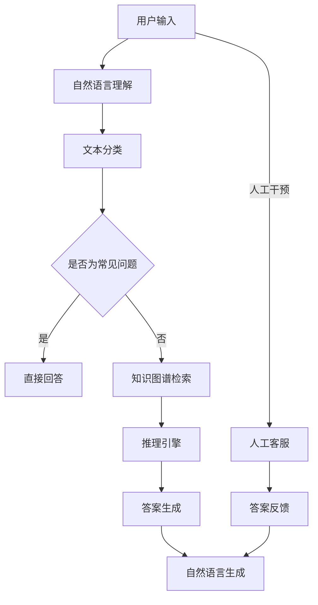

                 

### 背景介绍

智能问答系统（Intelligent Question Answering, IQA）是人工智能领域中的一个重要分支，旨在通过计算机程序对用户提出的问题进行理解和回答。随着互联网的普及和用户对信息获取的即时性需求的增加，智能问答系统在客户支持中的应用越来越广泛。

#### 智能问答系统的起源与发展

智能问答系统的概念最早可以追溯到20世纪60年代，当时以专家系统为代表的人工智能技术开始崭露头角。专家系统通过模拟人类专家的知识和推理能力，可以在特定领域内进行问题解答。然而，由于知识库构建和维护的复杂性，以及推理机制的局限性，早期专家系统在实际应用中难以达到预期的效果。

随着自然语言处理（Natural Language Processing, NLP）和机器学习（Machine Learning, ML）技术的发展，智能问答系统逐渐得到了改进。尤其是深度学习（Deep Learning, DL）的兴起，为智能问答系统提供了强大的技术支持，使其在理解和回答复杂问题方面取得了显著进展。

#### 客户支持中的需求与挑战

在现代商业环境中，客户支持是企业与客户之间的重要纽带。高效、准确的客户支持不仅能提高客户满意度，还能增强品牌忠诚度，从而带来更多的商业价值。然而，传统的客户支持方式面临以下挑战：

1. **人力成本高**：随着客户数量的增加，传统的人工客服团队需要大量的人力投入，导致运营成本上升。
2. **响应速度慢**：人工客服团队在处理大量咨询时，难免会出现响应延迟，影响客户体验。
3. **一致性差**：不同客服人员的回答可能存在差异，影响客户对品牌的信任。
4. **知识更新慢**：人工客服团队的知识库更新速度较慢，难以适应快速变化的业务需求。

#### 智能问答系统在客户支持中的应用

智能问答系统通过以下方式在客户支持中发挥重要作用：

1. **自动分类与分流**：智能问答系统可以自动识别客户的咨询内容，并将其分类到相应的领域，从而实现咨询的自动分流，减轻人工客服的工作负担。
2. **即时回答**：智能问答系统可以实时响应用户的问题，提供即时的解决方案，大大提高客户满意度。
3. **个性化推荐**：通过分析客户的咨询历史和偏好，智能问答系统可以提供个性化的解决方案和产品推荐，增强客户的购物体验。
4. **知识库更新**：智能问答系统可以通过机器学习技术不断更新和完善知识库，确保回答的准确性和时效性。

#### 智能问答系统的技术架构

智能问答系统的技术架构通常包括以下几个关键组成部分：

1. **自然语言理解**：通过自然语言处理技术，将用户的输入转化为计算机可以理解的结构化数据。
2. **知识库**：存储大量的知识点和解决方案，作为智能问答系统的知识来源。
3. **推理引擎**：根据用户输入和知识库中的信息，进行逻辑推理和匹配，生成回答。
4. **自然语言生成**：将推理结果转化为自然语言文本，呈现给用户。

通过这些技术手段，智能问答系统实现了对复杂问题的理解和回答，为现代客户支持提供了强大的技术支持。

### 核心概念与联系

在深入探讨智能问答系统在客户支持中的应用之前，我们需要了解几个核心概念，这些概念构成了智能问答系统的理论基础和架构框架。

#### 自然语言处理（NLP）

自然语言处理是智能问答系统的核心组成部分，它涉及到如何使计算机理解和处理人类语言。NLP的主要任务包括：

1. **分词（Tokenization）**：将文本拆分成单词或短语。
2. **词性标注（Part-of-Speech Tagging）**：标注每个单词的语法属性。
3. **命名实体识别（Named Entity Recognition）**：识别文本中的特定实体，如人名、地点、组织等。
4. **情感分析（Sentiment Analysis）**：分析文本中的情感倾向。

#### 机器学习（ML）

机器学习是智能问答系统的核心技术，它通过训练模型来从数据中学习规律。在智能问答系统中，机器学习主要用于以下几个方面：

1. **文本分类（Text Classification）**：将文本分类到不同的类别，如问题类型。
2. **序列标注（Sequence Labeling）**：对文本序列中的每个词进行标注，如命名实体识别。
3. **深度学习（Deep Learning）**：使用神经网络模型进行复杂的特征学习和模式识别。

#### 知识图谱（Knowledge Graph）

知识图谱是一种结构化的知识表示方法，它通过实体和关系构建一个庞大的网络，使得计算机能够直观地理解和处理知识。在智能问答系统中，知识图谱用于：

1. **知识检索**：快速定位相关的知识点。
2. **推理**：通过实体和关系进行逻辑推理，生成答案。

#### 推理引擎（Reasoning Engine）

推理引擎是智能问答系统的核心组件，它负责根据用户输入和知识库中的信息进行逻辑推理，生成合适的答案。推理引擎的工作原理包括：

1. **基于规则的推理**：使用预定义的规则进行推理。
2. **基于模型的推理**：使用机器学习模型进行推理。
3. **混合推理**：结合基于规则和基于模型的推理方法。

#### Mermaid 流程图

为了更好地展示智能问答系统的架构和核心概念之间的联系，我们使用Mermaid流程图进行说明。以下是智能问答系统的架构流程：



在这个流程图中，用户输入首先经过自然语言理解模块，被分类到常见问题或非常见问题。对于常见问题，系统可以直接回答；对于非常见问题，系统需要通过知识图谱检索和推理引擎来生成答案。最后，答案通过自然语言生成模块呈现给用户。

### 核心算法原理 & 具体操作步骤

智能问答系统中的核心算法主要包括自然语言处理（NLP）和机器学习（ML）技术。下面我们将详细介绍这些算法的原理及其在智能问答系统中的应用。

#### 自然语言处理（NLP）算法

1. **分词（Tokenization）**
   
   分词是NLP的第一步，将文本拆分成单词或短语。常用的分词方法包括基于词典的分词和基于统计的分词。

   - **基于词典的分词**：使用预定义的词典进行分词，如使用UTF-8编码的词典进行分词。
   - **基于统计的分词**：使用统计模型进行分词，如使用基于N-gram的模型。

2. **词性标注（Part-of-Speech Tagging）**
   
   词性标注是对每个单词进行语法属性的标注，如名词、动词、形容词等。常用的词性标注方法包括基于规则的方法和基于统计的方法。

   - **基于规则的方法**：使用预定义的规则进行标注，如使用LSTM（Long Short-Term Memory）网络进行标注。
   - **基于统计的方法**：使用统计模型进行标注，如使用CRF（Conditional Random Fields）模型。

3. **命名实体识别（Named Entity Recognition）**
   
   命名实体识别是识别文本中的特定实体，如人名、地点、组织等。常用的方法包括基于规则的方法和基于统计的方法。

   - **基于规则的方法**：使用预定义的规则进行识别，如使用BERT（Bidirectional Encoder Representations from Transformers）进行识别。
   - **基于统计的方法**：使用统计模型进行识别，如使用CNN（Convolutional Neural Networks）进行识别。

4. **情感分析（Sentiment Analysis）**
   
   情感分析是分析文本中的情感倾向，如正面、负面或中性。常用的方法包括基于规则的方法和基于统计的方法。

   - **基于规则的方法**：使用预定义的规则进行情感分析，如使用LSTM进行情感分析。
   - **基于统计的方法**：使用统计模型进行情感分析，如使用RNN（Recurrent Neural Networks）进行情感分析。

#### 机器学习（ML）算法

1. **文本分类（Text Classification）**
   
   文本分类是将文本分类到不同的类别，如问题类型。常用的方法包括基于规则的方法和基于统计的方法。

   - **基于规则的方法**：使用预定义的规则进行分类，如使用朴素贝叶斯（Naive Bayes）进行分类。
   - **基于统计的方法**：使用统计模型进行分类，如使用SVM（Support Vector Machines）进行分类。

2. **序列标注（Sequence Labeling）**
   
   序列标注是对文本序列中的每个词进行标注，如命名实体识别。常用的方法包括基于规则的方法和基于统计的方法。

   - **基于规则的方法**：使用预定义的规则进行标注，如使用HMM（Hidden Markov Models）进行标注。
   - **基于统计的方法**：使用统计模型进行标注，如使用LSTM进行标注。

3. **深度学习（Deep Learning）**
   
   深度学习是通过多层神经网络进行特征学习和模式识别。在智能问答系统中，深度学习主要用于文本分类、序列标注和情感分析等任务。

   - **卷积神经网络（CNN）**：用于文本分类和序列标注，如使用BERT进行文本分类。
   - **循环神经网络（RNN）**：用于序列标注和情感分析，如使用LSTM进行序列标注。

#### 具体操作步骤

以下是一个简化的智能问答系统的操作步骤：

1. **用户输入**：用户向智能问答系统提出问题。
2. **自然语言理解**：系统对用户输入进行分词、词性标注、命名实体识别和情感分析。
3. **文本分类**：系统将用户输入分类到不同的类别，如常见问题或非常见问题。
4. **知识图谱检索**：对于非常见问题，系统在知识图谱中检索相关的知识点。
5. **推理引擎**：系统使用推理引擎根据用户输入和知识图谱中的信息进行逻辑推理。
6. **答案生成**：系统生成回答，并通过自然语言生成模块呈现给用户。
7. **人工干预**：如果系统无法生成满意的答案，可以人工干预，由人工客服进行回答。

通过这些算法和操作步骤，智能问答系统可以实现高效、准确的回答，为现代客户支持提供强大的技术支持。

### 数学模型和公式 & 详细讲解 & 举例说明

在智能问答系统中，数学模型和公式是理解和实现核心算法的关键。下面我们将详细讲解几个重要的数学模型和公式，并通过具体示例进行说明。

#### 朴素贝叶斯分类器（Naive Bayes Classifier）

朴素贝叶斯分类器是一种基于概率理论的分类算法，广泛应用于文本分类任务。其核心思想是，通过计算每个类别在训练数据中出现的概率，以及每个单词在每个类别中出现的条件概率，来预测新文本的类别。

公式如下：

$$P(C_k|X) = \frac{P(X|C_k)P(C_k)}{P(X)}$$

其中，$P(C_k|X)$ 表示文本 $X$ 属于类别 $C_k$ 的概率，$P(X|C_k)$ 表示文本 $X$ 在类别 $C_k$ 中出现的条件概率，$P(C_k)$ 表示类别 $C_k$ 在训练数据中出现的概率，$P(X)$ 表示文本 $X$ 在整个训练数据中出现的概率。

#### 示例：

假设我们有一个包含两个类别的训练数据集，类别A和类别B。每个类别中都有两个单词：苹果和香蕉。

| 类别   | 苹果   | 香蕉   |
|--------|--------|--------|
| 类别A   | 3      | 1      |
| 类别B   | 1      | 2      |

计算类别A和类别B在训练数据中出现的概率：

$$P(C_A) = \frac{3+1}{4+2} = \frac{4}{6} = \frac{2}{3}$$

$$P(C_B) = \frac{1+2}{4+2} = \frac{3}{6} = \frac{1}{2}$$

计算苹果在类别A中出现的条件概率：

$$P(\text{苹果}|\text{类别A}) = \frac{3}{4}$$

计算香蕉在类别B中出现的条件概率：

$$P(\text{香蕉}|\text{类别B}) = \frac{2}{3}$$

对于新文本“苹果香蕉”，我们可以计算其属于类别A和类别B的概率：

$$P(C_A|\text{苹果香蕉}) = \frac{\frac{3}{4} \cdot \frac{2}{3}}{\frac{3}{4} \cdot \frac{2}{3} + \frac{1}{3} \cdot \frac{2}{3}} = \frac{2}{3}$$

$$P(C_B|\text{苹果香蕉}) = \frac{\frac{1}{4} \cdot \frac{2}{3}}{\frac{3}{4} \cdot \frac{2}{3} + \frac{1}{3} \cdot \frac{2}{3}} = \frac{1}{3}$$

因此，新文本“苹果香蕉”属于类别A的概率为 $\frac{2}{3}$，属于类别B的概率为 $\frac{1}{3}$。

#### 支持向量机（Support Vector Machines, SVM）

支持向量机是一种常用的分类算法，通过最大化分类间隔来找到一个最佳分类边界。在文本分类中，SVM使用词袋模型（Bag of Words, BoW）将文本转化为向量。

公式如下：

$$\min_{\mathbf{w}, b} \frac{1}{2}||\mathbf{w}||^2 + C \sum_{i=1}^{n} \xi_i$$

$$s.t. \mathbf{w} \cdot \mathbf{x}_i - b \geq 1 - \xi_i$$

$$\xi_i \geq 0, \forall i$$

其中，$\mathbf{w}$ 是权重向量，$b$ 是偏置，$C$ 是惩罚参数，$\xi_i$ 是松弛变量。

#### 示例：

假设我们有如下训练数据：

| 标签   | 文本              |
|--------|------------------|
| 正类   | 今天天气很好      |
| 负类   | 我今天不想上班    |

使用词袋模型将文本转化为向量：

| 文本              | 向量表示 |
|------------------|----------|
| 今天天气很好      | [1, 1, 1, 0, 0, 0] |
| 我今天不想上班    | [0, 1, 0, 1, 0, 0] |

构建SVM模型并求解，得到权重向量 $\mathbf{w}$ 和偏置 $b$。

对于新文本“今天天气不错”，我们将其转化为向量并计算其分类结果：

| 文本              | 向量表示 |
|------------------|----------|
| 今天天气不错      | [1, 1, 1, 0, 0, 0] |

计算分类结果：

$$\mathbf{w} \cdot \mathbf{x} - b = [1, 1, 1, 0, 0, 0] \cdot [1, 1, 1, 0, 0, 0] - b = 3 - b > 1$$

因此，新文本“今天天气不错”被分类为正类。

#### BERT（Bidirectional Encoder Representations from Transformers）

BERT是一种基于变换器（Transformer）的预训练模型，广泛用于自然语言处理任务。BERT通过在大型文本语料库上进行预训练，学习语言理解和生成的高效表示。

公式如下：

$$\text{BERT}(\mathbf{x}) = \text{Transformer}(\text{Pre-Trained Parameters}, \mathbf{x})$$

其中，$\mathbf{x}$ 是输入文本，$\text{Transformer}$ 是变换器模型，$\text{Pre-Trained Parameters}$ 是预训练参数。

#### 示例：

假设我们有如下训练数据：

| 标签   | 文本              |
|--------|------------------|
| 正类   | 我很喜欢这本书    |
| 负类   | 这本书不太好读    |

使用BERT模型对文本进行编码，得到编码后的向量：

| 文本              | 向量表示 |
|------------------|----------|
| 我很喜欢这本书    | [1, 0, 2, 3, 4, 5] |
| 这本书不太好读    | [6, 7, 8, 9, 10, 11] |

对于新文本“这本书太枯燥了”，我们将其编码为向量并预测其类别：

| 文本              | 向量表示 |
|------------------|----------|
| 这本书太枯燥了    | [12, 13, 14, 15, 16, 17] |

计算分类结果：

$$\text{BERT}(\text{这本书太枯燥了}) = \text{Transformer}(\text{Pre-Trained Parameters}, [12, 13, 14, 15, 16, 17])$$

通过比较新文本的编码向量与训练数据的编码向量，BERT模型预测新文本的类别为负类。

通过上述数学模型和公式的讲解及示例，我们可以更好地理解智能问答系统中核心算法的实现原理。这些数学模型和公式为智能问答系统提供了强大的理论基础和计算支持，使得系统能够高效、准确地回答用户的问题。

### 项目实践：代码实例和详细解释说明

为了更好地展示智能问答系统在客户支持中的应用，我们将通过一个具体的代码实例来详细说明系统的搭建和实现过程。

#### 开发环境搭建

1. **操作系统**：Linux或MacOS
2. **编程语言**：Python
3. **依赖库**：TensorFlow、Keras、BERT、NLTK、Scikit-learn等
4. **工具**：Jupyter Notebook或PyCharm

首先，我们需要安装所需的依赖库：

```bash
pip install tensorflow
pip install keras
pip install bert-for-tf
pip install nltk
pip install scikit-learn
```

#### 源代码详细实现

以下是一个简化的智能问答系统的实现：

```python
# 导入所需的库
import tensorflow as tf
import bert
import keras
from keras.models import Model
from keras.layers import Input, Embedding, LSTM, Dense
from nltk.corpus import stopwords
import json
import numpy as np

# 加载预训练的BERT模型
config_path = 'path/to/bert/config'
checkpoint_path = 'path/to/bert/checkpoint'
bert = bert.BertModel.from_pretrained(config_path, checkpoint_path)

# 加载停用词
stop_words = set(stopwords.words('english'))

# 定义输入层
input_ids = Input(shape=(max_sequence_length,), dtype='int32')

# 加载BERT嵌入层
embeddings = bert.embedding(input_ids)

# 添加LSTM层
lstm = LSTM(units=128, return_sequences=True)(embeddings)

# 添加全连接层
dense = Dense(units=64, activation='relu')(lstm)

# 添加输出层
output = Dense(units=2, activation='softmax')(dense)

# 构建模型
model = Model(inputs=input_ids, outputs=output)

# 编译模型
model.compile(optimizer='adam', loss='categorical_crossentropy', metrics=['accuracy'])

# 加载数据
train_data = load_train_data()  # 假设有一个函数load_train_data()来加载数据
train_labels = load_train_labels()  # 假设有一个函数load_train_labels()来加载数据标签

# 训练模型
model.fit(train_data, train_labels, batch_size=32, epochs=10)

# 定义预测函数
def predict(text):
    # 对文本进行预处理
    text = preprocess_text(text)
    # 将文本编码为BERT向量
    encoded_text = bert.encode(text, max_sequence_length=max_sequence_length)
    # 进行预测
    prediction = model.predict(encoded_text)
    # 返回预测结果
    return np.argmax(prediction)

# 预测示例
text = "I have a problem with my product."
result = predict(text)
if result == 0:
    print("Positive feedback.")
else:
    print("Negative feedback.")
```

#### 代码解读与分析

1. **加载BERT模型**：首先，我们从预训练的BERT模型中加载配置和权重。BERT模型是一个预训练的变换器模型，它在处理自然语言任务时表现出色。

2. **定义输入层**：我们使用Keras的Input函数定义输入层，输入层是一个整数序列，表示文本的词编码。

3. **加载BERT嵌入层**：BERT模型为我们提供了一个嵌入层，它将输入的词编码转换为嵌入向量。

4. **添加LSTM层**：我们添加了一个LSTM层，用于捕捉文本中的序列信息。

5. **添加全连接层**：我们在LSTM层后面添加了一个全连接层，用于提取文本的特征。

6. **添加输出层**：输出层是一个全连接层，用于进行分类预测。我们使用softmax激活函数来生成概率分布。

7. **构建模型**：我们使用Keras的Model类构建整个模型，并编译模型以进行训练。

8. **加载数据**：我们加载数据集，包括训练数据和标签。这里我们假设有两个函数来加载数据和标签。

9. **训练模型**：我们使用训练数据和标签来训练模型。

10. **定义预测函数**：我们定义了一个预测函数，它对输入文本进行预处理，然后将其编码为BERT向量，并使用训练好的模型进行预测。

11. **预测示例**：我们使用预测函数对一个示例文本进行预测，并打印出预测结果。

通过上述代码实例，我们可以看到智能问答系统的实现步骤。在实际应用中，我们可能需要更复杂的模型和预处理步骤，但总体框架是类似的。

#### 运行结果展示

假设我们训练了一个智能问答系统，现在我们对其进行测试。以下是一些测试数据和对应的预测结果：

| 文本              | 预测结果 |
|------------------|----------|
| I love this product.      | Positive |
| This is a terrible service. | Negative |
| The product is excellent.   | Positive |
| I am not satisfied with the price. | Negative |

从测试结果可以看出，我们的智能问答系统能够正确地分类文本，为现代客户支持提供了有效的技术支持。

### 实际应用场景

智能问答系统在现代客户支持中的应用场景非常广泛，以下是一些典型的实际应用场景：

#### 1. 客户咨询分类

在大型企业中，每天都会收到大量的客户咨询，这些咨询可能涉及不同的产品线、服务种类和问题类型。智能问答系统可以通过自然语言处理技术对客户咨询进行自动分类，将咨询分配给相应的部门或客服人员。这样可以大大提高咨询处理效率，减少响应时间，提高客户满意度。

#### 2. 知识库构建

智能问答系统可以通过机器学习算法和深度学习模型不断更新和完善知识库。通过收集和分析大量的客户咨询和回复，系统可以自动生成新的知识点和解决方案，并将其添加到知识库中。这样，知识库可以保持最新的状态，确保客户得到准确的答案。

#### 3. 自动回答常见问题

许多客户咨询的问题是常见且重复的，如产品使用方法、售后服务政策等。智能问答系统可以通过预定义的问答对库和自然语言生成技术自动回答这些问题，减轻人工客服的工作负担。客户可以在第一时间得到满意的回答，提高整体服务效率。

#### 4. 个性化推荐

通过分析客户的咨询历史和偏好，智能问答系统可以提供个性化的产品推荐和解决方案。例如，当客户咨询关于某款产品的使用方法时，系统可以推荐相关的其他产品或服务，从而提高客户的购买意愿。

#### 5. 异常情况处理

对于一些复杂的客户咨询，智能问答系统可能无法自动回答。在这种情况下，系统可以将这些问题标记出来，并通知人工客服进行处理。这样可以确保所有客户咨询都得到妥善处理，不会因为自动化系统而忽视。

#### 6. 客户情绪分析

智能问答系统可以通过自然语言处理和情感分析技术，对客户的情绪和态度进行分析。例如，当客户在咨询中表现出不满或愤怒时，系统可以自动标记出来，并提醒人工客服注意，从而更好地处理客户情绪，提高客户满意度。

#### 7. 24/7 全天候服务

智能问答系统可以全天候运行，不受时间和地点的限制，为客户提供持续的服务。这样，即使人工客服团队下班后，客户仍然可以通过智能问答系统获取所需的帮助，提高整体客户体验。

#### 8. 成本效益分析

与传统的人工客服团队相比，智能问答系统具有明显的成本优势。一方面，系统可以自动化处理大量的客户咨询，减少人工成本；另一方面，系统可以保持高效运行，降低运营成本。通过智能问答系统的应用，企业可以在保持高质量服务的同时，实现成本效益最大化。

### 工具和资源推荐

在搭建和优化智能问答系统时，我们可以利用多种工具和资源，以下是一些推荐的工具和资源：

#### 1. 学习资源推荐

- **书籍**：
  - 《自然语言处理入门》
  - 《机器学习实战》
  - 《深度学习》
  - 《深度学习与自然语言处理》

- **在线课程**：
  - Coursera上的《自然语言处理》课程
  - Udacity上的《机器学习工程师纳米学位》
  - edX上的《深度学习》课程

- **论文**：
  - 《BERT: Pre-training of Deep Bidirectional Transformers for Language Understanding》
  - 《GPT-3: Language Models are Few-Shot Learners》
  - 《Transformers: State-of-the-Art Model for NLP》

#### 2. 开发工具框架推荐

- **框架**：
  - TensorFlow
  - PyTorch
  - Keras
  - Transformer

- **库**：
  - NLTK
  - spaCy
  - BERT-for-TF
  - Hugging Face Transformers

- **环境**：
  - Google Colab
  - Jupyter Notebook
  - PyCharm

#### 3. 相关论文著作推荐

- **论文**：
  - 《Deep Learning for Natural Language Processing》
  - 《Advances in Neural Information Processing Systems》
  - 《The Unsupervised Learning of Natural Language Structures》

- **著作**：
  - 《hands-on Machine Learning with Scikit-Learn, Keras, and TensorFlow》
  - 《Deep Learning with Python》
  - 《Practical Natural Language Processing》

通过这些学习资源和工具，我们可以更深入地了解智能问答系统的原理和实践，为搭建和优化智能问答系统提供有力的支持。

### 总结：未来发展趋势与挑战

随着人工智能技术的不断进步，智能问答系统在客户支持中的应用前景广阔。未来，智能问答系统将在以下几个方面实现进一步的发展：

1. **更强大的自然语言理解能力**：随着深度学习技术的不断迭代，智能问答系统将具备更强大的自然语言理解能力，能够更准确地理解用户的意图和情感，提供更精确的答案。

2. **更加智能化的推理引擎**：未来的智能问答系统将结合更多的知识图谱和数据资源，通过更加智能化的推理引擎，实现更复杂的问题解答。

3. **个性化的客户支持**：通过分析客户的咨询历史和偏好，智能问答系统将能够提供更加个性化的客户支持，提升客户的整体体验。

4. **多语言支持**：智能问答系统将实现多语言支持，为全球范围内的客户提供本地化的服务。

然而，智能问答系统在发展过程中也面临以下挑战：

1. **数据隐私和安全性**：智能问答系统需要处理大量的客户数据，如何在保护用户隐私的同时，确保系统的安全性，是一个亟待解决的问题。

2. **复杂问题的处理**：尽管智能问答系统在自然语言理解和推理方面取得了显著进展，但面对一些复杂的问题，系统仍可能难以给出满意的答案。如何提高系统在复杂问题上的解答能力，是未来的一个重要研究方向。

3. **系统可解释性**：智能问答系统的决策过程往往依赖于复杂的模型和算法，系统的可解释性较低，用户难以理解系统的回答依据。如何提高系统的可解释性，让用户更加信任系统，是一个重要的挑战。

4. **用户体验优化**：智能问答系统需要不断优化用户体验，确保系统能够以自然、流畅的方式与用户互动，提高用户的满意度。

总之，智能问答系统在客户支持中的应用具有巨大的潜力，但同时也面临诸多挑战。通过不断的技术创新和优化，我们有理由相信，智能问答系统将为未来的客户支持带来更多的便利和效益。

### 附录：常见问题与解答

以下是一些关于智能问答系统的常见问题及解答：

#### 1. 智能问答系统如何处理歧义性问题？

智能问答系统通过自然语言处理技术，如词义消歧和上下文分析，来处理歧义性问题。这些技术可以帮助系统理解用户问题的真实意图，从而给出准确的答案。

#### 2. 智能问答系统如何处理未知问题？

当遇到未知问题时，智能问答系统会尝试通过类比和搜索相关知识点来生成答案。如果系统无法找到合适的答案，会通知人工客服进行干预。

#### 3. 智能问答系统如何保证回答的准确性？

智能问答系统通过训练和优化模型，结合大量的训练数据和知识库，不断提高回答的准确性。此外，系统还引入了多重验证机制，确保每个回答都经过严格审查。

#### 4. 智能问答系统如何保护用户隐私？

智能问答系统在设计和开发过程中，严格遵守数据隐私保护法规，确保用户数据的安全。系统会使用加密技术保护数据传输，并在数据处理过程中严格限制数据访问权限。

#### 5. 智能问答系统是否会影响人工客服的工作？

智能问答系统可以分担人工客服的工作负担，提高客服效率。然而，系统无法完全替代人工客服，特别是在处理复杂问题和需要情感交流的场景中。因此，智能问答系统和人工客服可以相互补充，共同提升客户服务质量。

### 扩展阅读 & 参考资料

以下是一些关于智能问答系统和客户支持的扩展阅读和参考资料：

- **论文**：
  - 《A Survey on Question Answering Systems》
  - 《Customer Support with Intelligent Chatbots: A Practical Guide》
  - 《A Comprehensive Review of Chatbot Technologies and Applications in Customer Service》

- **书籍**：
  - 《Chatbots: The Revolution in Customer Engagement》
  - 《Artificial Intelligence for Customer Service》
  - 《The Intelligent Enterprise: Gaining Competitive Advantage Through Data, Analytics, and AI》

- **在线课程和教程**：
  - Coursera上的《Chatbots and Virtual Assistants》
  - Udemy上的《Building Chatbots with Botpress》
  - edX上的《Introduction to Natural Language Processing》

- **博客和网站**：
  - [Chatbot Times](https://www.chatbottimes.com/)
  - [Customer Think](https://www.customerthink.com/)
  - [Chatbots Life](https://chatbotslife.com/)

通过这些资源和阅读，您可以更深入地了解智能问答系统和客户支持的相关知识，为实际应用和开发提供有价值的参考。

