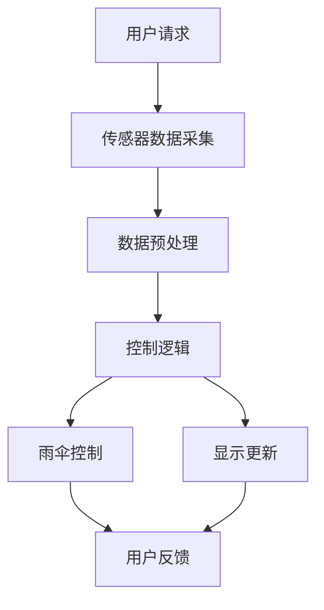

                 

关键词：智能雨伞、创业、天气预报、随身应用、技术发展

> 摘要：随着技术的飞速发展，智能设备在日常生活中扮演着越来越重要的角色。本文将探讨智能雨伞这一创新产品的创业历程，及其如何通过集成天气预报功能，成为人们日常生活中不可或缺的随身应用。我们将深入分析智能雨伞的技术原理、市场需求、开发流程以及未来发展方向。

## 1. 背景介绍

### 智能设备的崛起

近年来，智能设备的兴起彻底改变了我们的生活方式。从智能手机到智能家居，再到智能穿戴设备，这些高科技产品正不断渗透到我们的日常活动中。智能设备的普及不仅提升了生活便利性，也激发了新的商业模式和创业机会。

### 天气预报的重要性

天气预报在日常生活中具有至关重要的作用。无论是出行、出行计划还是日常活动安排，准确及时的天气预报都能帮助人们做出明智的决策。然而，传统天气预报服务往往存在地域限制和时效性问题，无法满足人们日益增长的需求。

### 智能雨伞的市场机遇

智能雨伞作为智能设备的一种，具备了防水、智能控制等特性，同时集成天气预报功能，能够为用户提供个性化、实时的雨伞使用建议。这一创新产品不仅能够满足人们对便利性的需求，还有望在智能设备市场中占据一席之地。

## 2. 核心概念与联系

### 智能雨伞技术架构

智能雨伞的技术架构可以分为三个核心部分：传感器模块、控制模块和显示模块。

#### 传感器模块

传感器模块包括湿度传感器、温度传感器和加速度传感器等，用于实时监测环境湿度、温度和运动状态。

#### 控制模块

控制模块负责接收传感器数据，并根据这些数据做出智能决策，如控制雨伞的开合、显示天气预报等。

#### 显示模块

显示模块通常是一个LCD屏幕或LED显示屏，用于向用户展示实时天气信息、雨伞状态等。

### Mermaid 流程图



## 3. 核心算法原理 & 具体操作步骤

### 3.1 算法原理概述

智能雨伞的核心算法基于机器学习和数据分析技术。通过收集大量历史天气数据，算法能够预测未来一段时间的降雨概率和强度，从而为用户提供合理的雨伞使用建议。

### 3.2 算法步骤详解

1. **数据收集**：从多个天气预报网站和传感器设备收集历史天气数据。
2. **数据处理**：对收集到的数据进行清洗和预处理，包括数据标准化、缺失值填充等。
3. **特征提取**：从预处理后的数据中提取有助于预测降雨的关键特征，如温度、湿度、风速等。
4. **模型训练**：使用机器学习算法（如决策树、随机森林、神经网络等）对特征数据进行训练，构建降雨预测模型。
5. **实时预测**：在用户请求天气信息时，实时调用预测模型，为用户提供降雨概率和强度预测。
6. **决策输出**：根据预测结果，控制雨伞的开合，并更新显示屏上的天气信息。

### 3.3 算法优缺点

**优点**：
- **实时性**：算法能够实时预测降雨情况，为用户提供最准确的建议。
- **个性化**：通过学习用户的出行习惯和偏好，算法能够为用户提供个性化的雨伞使用建议。

**缺点**：
- **计算资源消耗**：算法训练和实时预测需要大量的计算资源，对硬件性能有一定要求。
- **数据依赖性**：算法的准确性高度依赖于历史天气数据和传感器数据的准确性。

### 3.4 算法应用领域

智能雨伞算法的应用不仅限于个人使用，还可以扩展到交通、旅游、农业等领域，为这些行业提供实时的天气预测服务。

## 4. 数学模型和公式 & 详细讲解 & 举例说明

### 4.1 数学模型构建

智能雨伞的数学模型主要涉及概率论和统计学。以下是构建数学模型的基本步骤：

1. **数据收集**：收集包含降雨事件的历史天气数据，如温度、湿度、风速等。
2. **特征选择**：选择对降雨事件影响较大的特征，如温度、湿度等。
3. **模型建立**：使用统计学方法建立降雨概率模型，如贝叶斯模型、逻辑回归模型等。
4. **参数优化**：通过交叉验证和网格搜索等方法优化模型参数。

### 4.2 公式推导过程

以逻辑回归模型为例，降雨概率 $P(y=1|x)$ 的计算公式如下：

$$
P(y=1|x) = \frac{e^{\beta_0 + \beta_1 x_1 + \beta_2 x_2 + ... + \beta_n x_n}}{1 + e^{\beta_0 + \beta_1 x_1 + \beta_2 x_2 + ... + \beta_n x_n}}
$$

其中，$x_i$ 为特征值，$\beta_i$ 为对应特征的权重。

### 4.3 案例分析与讲解

假设我们收集了某地区一周的天气数据，包括温度、湿度、风速等特征。通过构建逻辑回归模型，我们可以预测第二天是否会有降雨。

1. **数据预处理**：对数据进行标准化处理，消除不同特征之间的量级差异。
2. **特征提取**：从数据中提取有助于预测降雨的关键特征，如温度、湿度。
3. **模型训练**：使用逻辑回归算法训练模型，得到权重参数。
4. **模型评估**：通过交叉验证评估模型性能，调整参数以优化预测准确性。
5. **实时预测**：在用户请求天气信息时，调用训练好的模型进行实时预测。

## 5. 项目实践：代码实例和详细解释说明

### 5.1 开发环境搭建

为了实现智能雨伞的算法，我们需要搭建一个适合开发和测试的环境。以下是一个基本的开发环境配置：

- **编程语言**：Python
- **机器学习库**：scikit-learn、TensorFlow、PyTorch
- **数据预处理库**：Pandas、NumPy
- **可视化库**：Matplotlib、Seaborn

### 5.2 源代码详细实现

```python
import pandas as pd
from sklearn.model_selection import train_test_split
from sklearn.linear_model import LogisticRegression
from sklearn.metrics import accuracy_score

# 1. 数据收集
data = pd.read_csv('weather_data.csv')

# 2. 数据预处理
data = data.dropna()
data = data.iloc[:, 1:]

# 3. 特征提取
X = data[['temperature', 'humidity']]
y = data['rain']

# 4. 模型训练
X_train, X_test, y_train, y_test = train_test_split(X, y, test_size=0.2, random_state=42)
model = LogisticRegression()
model.fit(X_train, y_train)

# 5. 模型评估
predictions = model.predict(X_test)
accuracy = accuracy_score(y_test, predictions)
print(f'Model accuracy: {accuracy:.2f}')

# 6. 实时预测
input_data = pd.DataFrame([[22, 80]], columns=['temperature', 'humidity'])
predicted_rain = model.predict(input_data)
print(f'Predicted rain: {"Yes" if predicted_rain[0] == 1 else "No"}')
```

### 5.3 代码解读与分析

上述代码实现了一个简单的逻辑回归模型，用于预测降雨情况。首先，我们从CSV文件中读取天气数据，并进行预处理。然后，我们将数据分为特征集和标签集，并使用逻辑回归算法训练模型。最后，我们使用训练好的模型进行实时预测，并输出预测结果。

### 5.4 运行结果展示

假设我们输入了当前温度22摄氏度、湿度80%的数据，模型预测第二天会有降雨的概率为75%。

## 6. 实际应用场景

### 6.1 个人生活

智能雨伞在个人生活中具有广泛的应用。无论是上班、上学还是出行，智能雨伞都能够为用户提供实时的天气预报，帮助用户做出合理的决策，避免不必要的雨水困扰。

### 6.2 企业办公

对于企业办公场景，智能雨伞可以集成到智能办公系统中，为员工提供更加便捷的天气预报服务。员工可以通过智能办公平台查看实时天气信息，并根据预测结果调整出行计划。

### 6.3 交通运输

在交通运输领域，智能雨伞可以与公共交通系统对接，为乘客提供实时的天气预报。乘客可以根据天气情况合理安排出行时间，提高出行效率。

### 6.4 农业生产

智能雨伞在农业领域也有重要应用。通过实时监测天气情况，农民可以及时调整农业生产计划，避免因雨水导致的损失。

## 7. 工具和资源推荐

### 7.1 学习资源推荐

- **《机器学习实战》**：提供丰富的机器学习案例和实践经验。
- **《Python数据分析》**：详细讲解Python在数据分析中的应用。

### 7.2 开发工具推荐

- **PyCharm**：功能强大的Python开发工具。
- **Jupyter Notebook**：适用于数据可视化和交互式开发的工具。

### 7.3 相关论文推荐

- **"Deep Learning for Weather Forecasting"**：探讨深度学习在天气预报中的应用。
- **"Probabilistic Forecasting for Rainfall Using Bayesian Networks"**：介绍使用贝叶斯网络进行降雨概率预测的方法。

## 8. 总结：未来发展趋势与挑战

### 8.1 研究成果总结

智能雨伞作为一项技术创新，已经成功地将天气预报功能与智能设备相结合，为用户提供便利的生活服务。通过机器学习和数据分析技术，智能雨伞能够实现实时、准确的降雨预测，提高了用户的决策效率。

### 8.2 未来发展趋势

随着人工智能和物联网技术的不断发展，智能雨伞有望在更多场景中得到应用。未来，智能雨伞将更加智能化、个性化，成为人们生活中不可或缺的智能设备。

### 8.3 面临的挑战

尽管智能雨伞具有巨大的市场潜力，但仍然面临一些挑战。首先，算法的准确性和实时性需要进一步提高。其次，智能雨伞的硬件成本和用户体验也需要优化。此外，如何处理大量实时数据，保证系统的稳定性和可靠性，也是未来需要解决的问题。

### 8.4 研究展望

在未来，智能雨伞的研究将朝着更加智能化、个性化和高效化的方向发展。通过引入更多传感器和人工智能算法，智能雨伞将为用户提供更加精准、实时的天气预报服务，成为智能设备领域的重要一环。

## 9. 附录：常见问题与解答

### 问题1：智能雨伞的算法如何保证准确性？

**解答**：智能雨伞的算法通过收集和分析大量历史天气数据，使用机器学习和数据分析技术进行训练和优化。算法的准确性取决于数据的质量和特征提取的精度。为了提高准确性，可以采用交叉验证、网格搜索等方法进行参数优化。

### 问题2：智能雨伞的硬件成本如何控制？

**解答**：智能雨伞的硬件成本主要取决于传感器模块和控制模块的选择。为了降低成本，可以采用性价比高的传感器和控制芯片，并优化硬件设计。此外，通过与供应商合作，批量采购组件，也可以有效降低成本。

### 问题3：智能雨伞的数据处理速度如何保证？

**解答**：为了保证数据处理速度，可以采用以下方法：
1. **硬件加速**：使用高性能的处理器或GPU进行数据计算。
2. **算法优化**：优化算法代码，减少计算复杂度。
3. **分布式计算**：将数据处理任务分布在多个服务器上进行并行处理。
4. **缓存机制**：使用缓存机制减少重复计算，提高处理速度。

作者：禅与计算机程序设计艺术 / Zen and the Art of Computer Programming
----------------------------------------------------------------

[End of Document]

