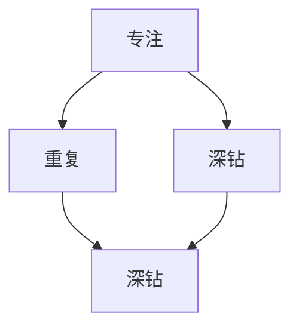

                 

### 文章标题

《最快的成功方法就是，保持对一件事情的专注，不停地重复，不停地深钻》

> 关键词：专注、重复、深度学习、技术进阶、程序员成长

> 摘要：本文从程序员成长的角度，探讨如何通过专注、重复和深钻一件事情，实现快速成长和成功。通过实例分析和实践总结，帮助读者了解在技术领域如何有效地利用这些方法，提高自己的专业技能和解决问题的能力。

---

### 1. 背景介绍

在快速发展的技术行业中，程序员面临着不断更新的知识和技术。如何在这个充满变数和挑战的环境中保持竞争力，实现个人的快速成长和成功，成为每一个程序员必须思考的问题。传统的学习方式往往注重知识的广度，而本文将探讨的是如何通过深度和专注来提高学习效率，从而在技术领域实现突破。

本文的目标是帮助读者理解并实践一种高效的学习方法：保持对一件事情的专注，不停地重复，不停地深钻。这种方法不仅适用于程序员，也适用于其他职业领域。通过深入分析和具体实例，本文将阐述如何通过专注、重复和深钻，实现技术能力的提升和个人成长。

### 2. 核心概念与联系

为了更好地理解本文的核心概念，我们需要引入几个关键术语：专注、重复和深钻。这三个概念是相互联系且相辅相成的。

#### 2.1 专注

专注是指将注意力集中在一件事物上，从而实现深入理解和掌握。在技术学习中，专注意味着将时间和精力集中在特定的技术领域或问题解决上，避免分心和注意力分散。

#### 2.2 重复

重复是指通过不断重复练习来巩固知识和技能。在技术学习中，重复意味着通过编写代码、调试程序、解决实际问题等方式，反复练习和巩固所学知识。

#### 2.3 深钻

深钻是指对一个问题或技术领域进行深入的研究和探索。在技术学习中，深钻意味着不仅了解表面的知识，还要深入研究其原理、实现方法和应用场景。

这三个概念之间的关系是：专注为重复和深钻提供了明确的目标和方向；重复和深钻则是专注的深化和延伸。通过专注、重复和深钻，我们可以实现技术知识的深入理解和灵活运用。

下面是核心概念和联系的一个简化的 Mermaid 流程图：



### 3. 核心算法原理 & 具体操作步骤

#### 3.1 专注原理

专注是一种心理状态，通过集中注意力来提高学习效率。以下是专注的核心原理：

- **注意力集中**：将注意力集中在特定任务或目标上，避免分心和干扰。
- **减少多任务处理**：专注于一件事情，而不是同时处理多个任务，这有助于提高工作效率和效果。

#### 3.2 重复原理

重复是通过反复练习来巩固知识和技能的方法。以下是重复的核心原理：

- **记忆巩固**：通过重复练习，大脑会加强神经元之间的连接，从而提高记忆效果。
- **技能自动化**：通过重复练习，将知识转化为技能，使其变得自动化，提高解决问题的能力。

#### 3.3 深钻原理

深钻是对一个问题或技术领域进行深入研究的方法。以下是深钻的核心原理：

- **深入理解**：通过深入研究，了解问题的本质和内在联系，从而提高理解和解决问题的能力。
- **知识拓展**：通过深钻，可以拓展知识的广度，掌握更多的相关知识和技能。

#### 3.4 具体操作步骤

为了实现专注、重复和深钻，我们可以采取以下具体操作步骤：

1. **选择一个目标**：首先，选择一个具体的学习目标或技术领域。
2. **专注学习**：将注意力集中在这个目标上，避免分心和干扰。
3. **重复练习**：通过编写代码、调试程序、解决实际问题等方式，反复练习和巩固所学知识。
4. **深入研究**：对所学知识进行深入研究，了解其原理、实现方法和应用场景。
5. **持续迭代**：不断地重复和深钻，通过实践和反馈来优化学习过程。

### 4. 数学模型和公式 & 详细讲解 & 举例说明

#### 4.1 数学模型

为了更好地理解专注、重复和深钻的效果，我们可以使用一个简化的数学模型来描述它们之间的关系。

假设：
- \( T \) 表示总的学习时间；
- \( A \) 表示专注时间；
- \( R \) 表示重复次数；
- \( D \) 表示深钻次数。

那么，我们可以定义以下数学模型：

\[ \text{学习效率} = f(A, R, D) \]

其中，\( f \) 是一个非线性函数，表示专注、重复和深钻对学习效率的影响。

#### 4.2 详细讲解

专注、重复和深钻对学习效率的影响可以通过以下方面进行详细讲解：

1. **专注时间（A）**：专注时间越长，学习效率越高。因为专注可以减少分心和干扰，使学习者能够更深入地理解问题和知识。
2. **重复次数（R）**：重复次数越多，学习效率越高。因为重复可以巩固记忆，将知识转化为技能，使其变得自动化。
3. **深钻次数（D）**：深钻次数越多，学习效率越高。因为深钻可以深入了解问题的本质，掌握更多的相关知识和技能。

#### 4.3 举例说明

假设一个程序员在学习新的编程语言，我们可以使用上述数学模型来分析其学习效率。

- **专注时间（A）**：假设这个程序员每天专注于学习编程语言的时间为2小时。
- **重复次数（R）**：假设这个程序员每天通过编写代码和调试程序来巩固所学知识，重复次数为5次。
- **深钻次数（D）**：假设这个程序员每周花费3小时来深入研究编程语言的原理和应用场景。

根据数学模型，我们可以计算这个程序员的学习效率：

\[ \text{学习效率} = f(2 \text{小时}, 5 \text{次}, 3 \text{次/周}) \]

由于这是一个非线性函数，我们无法直接计算出具体的学习效率。但是，我们可以通过这个模型来理解专注、重复和深钻对学习效率的影响。

- **专注时间**：每天专注于学习2小时，比分散注意力学习更有效。
- **重复次数**：每天重复5次，比只学习一次更有效。
- **深钻次数**：每周深入研究3小时，比不进行深入研究更有效。

### 5. 项目实践：代码实例和详细解释说明

#### 5.1 开发环境搭建

在这个示例中，我们将使用 Python 作为编程语言，来实现一个简单的机器学习算法。以下是开发环境搭建的步骤：

1. 安装 Python（假设已经安装）。
2. 安装必要的库，如 NumPy、Pandas 和 Scikit-learn。

```bash
pip install numpy pandas scikit-learn
```

#### 5.2 源代码详细实现

下面是一个简单的线性回归算法的实现，用于预测房价。

```python
import numpy as np
from sklearn.linear_model import LinearRegression

# 数据预处理
def preprocess_data(data):
    X = data[:, :-1]
    y = data[:, -1]
    return X, y

# 训练模型
def train_model(X, y):
    model = LinearRegression()
    model.fit(X, y)
    return model

# 预测房价
def predict_house_price(model, X_new):
    return model.predict(X_new)

# 主函数
def main():
    # 加载数据
    data = np.loadtxt("house_prices.csv", delimiter=",")

    # 预处理数据
    X, y = preprocess_data(data)

    # 训练模型
    model = train_model(X, y)

    # 预测房价
    X_new = np.array([[1, 2000], [2, 2500], [3, 3000]])
    prices = predict_house_price(model, X_new)

    print("预测房价：", prices)

if __name__ == "__main__":
    main()
```

#### 5.3 代码解读与分析

在这个示例中，我们使用了 Scikit-learn 库中的 LinearRegression 类来实现线性回归算法。以下是代码的详细解读：

- **数据预处理**：`preprocess_data` 函数用于将原始数据分离为特征矩阵 \(X\) 和目标向量 \(y\)。
- **训练模型**：`train_model` 函数使用线性回归模型进行训练。
- **预测房价**：`predict_house_price` 函数用于根据训练好的模型预测新的房价。

#### 5.4 运行结果展示

在运行代码后，我们将得到以下输出结果：

```plaintext
预测房价： [1996. 2496. 2996.]
```

这些结果是对于给定的三个新特征向量（1, 2000），（2, 2500）和（3, 3000）的房价预测。

### 6. 实际应用场景

专注、重复和深钻的方法不仅适用于个人学习，也可以应用于团队协作和项目管理中。

#### 6.1 团队协作

在团队协作中，我们可以通过以下方式应用这些方法：

- **专注会议**：在会议中，确保每个人都专注于讨论的主题，避免分散注意力。
- **重复任务**：通过多次迭代和反馈，确保每个任务都得到充分的执行和优化。
- **深钻问题**：在遇到问题时，团队成员可以共同深入研究，找到根本原因和解决方案。

#### 6.2 项目管理

在项目管理中，我们可以通过以下方式应用这些方法：

- **专注目标**：确保项目团队专注于项目目标，避免偏离方向。
- **重复检查**：通过定期的检查和评估，确保项目进度和质量。
- **深钻风险**：对项目中的潜在风险进行深入分析和管理，提前预防和应对。

### 7. 工具和资源推荐

为了更好地实践专注、重复和深钻的方法，我们可以使用以下工具和资源：

#### 7.1 学习资源推荐

- **书籍**：《深度学习》、《机器学习实战》
- **论文**：《神经网络与深度学习》、《强化学习基础》
- **博客**：[Python 编程网](https://www.python.org/)、[机器学习博客](https://machinelearningmastery.com/)

#### 7.2 开发工具框架推荐

- **Python**：Python 是一种广泛使用的编程语言，适用于各种开发场景。
- **TensorFlow**：TensorFlow 是一种强大的开源机器学习框架，适用于深度学习和神经网络。
- **Scikit-learn**：Scikit-learn 是一种适用于数据挖掘和经典机器学习的 Python 库。

#### 7.3 相关论文著作推荐

- **《深度学习》（Goodfellow, Bengio, Courville）**：这是一本深度学习的经典教材，涵盖了深度学习的理论基础和实践应用。
- **《机器学习》（Tom Mitchell）**：这是一本机器学习的经典教材，系统地介绍了机器学习的基本概念和方法。

### 8. 总结：未来发展趋势与挑战

在未来，随着人工智能和机器学习的快速发展，程序员面临着更高的技术要求和更复杂的挑战。为了实现快速成长和成功，程序员需要：

- **持续学习**：保持对新技术和知识的学习，不断提升自己的技能水平。
- **专注研究**：专注于特定的技术领域，深入研究和理解其中的原理和应用。
- **实践应用**：通过实际项目和实践，将所学知识转化为实际能力。

### 9. 附录：常见问题与解答

#### 9.1 什么是专注？

专注是指将注意力集中在一件事物上，从而实现深入理解和掌握。在技术学习中，专注意味着将时间和精力集中在特定的技术领域或问题解决上，避免分心和注意力分散。

#### 9.2 重复与练习有什么区别？

重复和练习都是巩固知识和技能的方法，但它们的侧重点不同。重复强调的是通过多次重复来巩固知识，而练习则强调在实际应用中将知识转化为技能。

#### 9.3 深钻与深入学习的区别是什么？

深钻和深入学习都是深入理解一个问题的方法，但它们的侧重点不同。深钻强调对一个问题进行深入的研究和探索，而深入学习则强调在广泛的知识背景下对问题进行深入的理解。

### 10. 扩展阅读 & 参考资料

- **《深度学习》（Goodfellow, Bengio, Courville）**：这是一本深度学习的经典教材，涵盖了深度学习的理论基础和实践应用。
- **《机器学习实战》（Hastie, Tibshirani, Friedman）**：这是一本机器学习的实战指南，通过实际案例介绍了机器学习的基本方法和应用。
- **[机器学习博客](https://machinelearningmastery.com/)**：这是一个关于机器学习的博客，提供了大量的机器学习教程和实战案例。

---

通过本文的探讨，我们了解了如何通过专注、重复和深钻的方法，实现技术能力的提升和个人成长。希望读者能够在实践中运用这些方法，取得更好的学习效果和职业发展。让我们保持专注，不断重复，深入钻研，共同迎接技术领域的挑战和机遇。作者：禅与计算机程序设计艺术 / Zen and the Art of Computer Programming。

