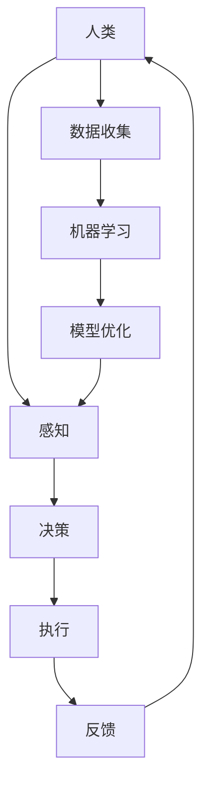

                 

### 文章标题

**未来工作：人机协作，重塑职业未来**

> **关键词：**人机协作、职业发展、人工智能、技术创新、未来工作

> **摘要：**本文深入探讨了人机协作在未来工作中的重要性，分析了人工智能技术如何改变职业生态系统。通过一步步的推理，本文总结了人机协作的核心原理、应用场景、发展趋势，以及面临的挑战，旨在为读者提供对未来职业发展的深刻见解。

### 1. 背景介绍

在过去的几十年里，技术进步尤其是人工智能（AI）的发展，已经深刻地改变了我们的工作方式和生活环境。从自动化流水线到智能客服，从数据分析到机器学习，AI正在逐渐融入我们的日常生活和职业活动。然而，随着技术的不断演进，一个显而易见的事实是：人类与机器的协作将成为未来工作的重要趋势。

人机协作不仅涉及到技术层面，更关乎社会层面。在技术层面，AI的算法和数据处理能力使得机器能够执行高度复杂的任务，而人类则凭借其创造力、情感智慧和直觉，在解决问题、创新和人际交往中发挥独特的作用。在社会层面，人机协作将促进职业生态系统的重塑，提高生产效率，创造新的就业机会，同时也带来一系列的伦理和社会问题。

本文将围绕以下几个方面展开讨论：

- **核心概念与联系**：介绍人机协作的基础概念和关键原理。
- **核心算法原理 & 具体操作步骤**：探讨AI技术如何支持人机协作。
- **数学模型和公式 & 详细讲解 & 举例说明**：解释人机协作中的关键数学模型。
- **项目实践：代码实例和详细解释说明**：通过实际项目展示人机协作的应用。
- **实际应用场景**：分析人机协作在不同行业中的应用。
- **工具和资源推荐**：推荐学习资源和开发工具。
- **总结：未来发展趋势与挑战**：总结人机协作的未来前景和面临的挑战。

### 2. 核心概念与联系

要理解人机协作，我们首先需要明确几个核心概念。

**人机协作**（Human-Machine Collaboration）：指的是人类和机器在共同完成特定任务时相互协作的过程。这种协作可以是直接的，例如人类指挥机器执行任务；也可以是间接的，例如机器通过分析数据为人类提供决策支持。

**人工智能**（Artificial Intelligence, AI）：是指机器通过模拟人类智能行为，如学习、推理、感知和决策，来完成特定任务的系统。AI可以分为几种类型，包括机器学习、深度学习、自然语言处理等。

**机器学习**（Machine Learning, ML）：是AI的一个分支，通过数据训练模型，使机器能够从经验中学习并做出预测或决策。

**深度学习**（Deep Learning, DL）：是机器学习的一个子领域，通过模拟人脑的神经网络结构，实现更加复杂和精确的学习任务。

**自然语言处理**（Natural Language Processing, NLP）：是AI的一个分支，专注于使计算机能够理解和处理人类语言。

接下来，我们将使用Mermaid流程图来展示人机协作的基本架构。



**图 1**：人机协作的基本架构

- **人类**：作为决策者，人类利用感知（A）、决策（C）和执行（D）能力来完成任务。
- **感知**：人类通过感知获取外部信息，如视觉、听觉等。
- **决策**：人类根据感知到的信息做出决策。
- **执行**：人类执行决策，完成任务。
- **反馈**：执行结果反馈到感知环节，用于调整后续决策。
- **数据收集**：人类在执行任务过程中产生的数据被收集。
- **机器学习**：机器学习模型通过分析收集到的数据不断优化。
- **模型优化**：优化的模型反馈到感知环节，提高决策的准确性。

通过这个流程图，我们可以看到人机协作是如何实现信息流动和决策优化的。人类和机器各自发挥其优势，共同提高工作效率和准确性。

### 3. 核心算法原理 & 具体操作步骤

人机协作的实现离不开核心算法的支持。下面我们将详细介绍几个关键算法原理和具体操作步骤。

#### 3.1 机器学习算法

机器学习是人机协作的基础。通过训练数据集，机器学习算法能够从数据中学习规律，并自动做出预测或决策。以下是一个简单的机器学习算法流程：

1. **数据收集**：收集与任务相关的数据，如图像、文本、声音等。
2. **数据预处理**：对数据进行清洗、归一化等处理，使其适合模型训练。
3. **特征提取**：从数据中提取关键特征，如图像的边缘、文本的关键词等。
4. **模型选择**：选择合适的机器学习模型，如线性回归、决策树、神经网络等。
5. **模型训练**：使用训练数据集训练模型，使其学习数据中的规律。
6. **模型评估**：使用验证数据集评估模型性能，调整模型参数。
7. **模型应用**：将训练好的模型应用到实际任务中，如预测股票价格、分类电子邮件等。

下面是一个简单的线性回归模型的实现步骤：

```python
# 导入必要的库
import numpy as np
import matplotlib.pyplot as plt

# 数据集
x = np.array([1, 2, 3, 4, 5])
y = np.array([2, 4, 5, 4, 5])

# 模型参数初始化
w = np.random.rand() * 2 - 1
b = np.random.rand() * 2 - 1

# 训练模型
for i in range(1000):
    y_pred = w * x + b
    error = y - y_pred
    w -= 0.01 * error.mean() * x
    b -= 0.01 * error.mean()

# 评估模型
y_pred = w * x + b
print("Model performance: Mean Squared Error =", np.mean((y - y_pred)**2))

# 可视化结果
plt.scatter(x, y, label="Actual Data")
plt.plot(x, y_pred, color="red", label="Predicted Data")
plt.xlabel("x")
plt.ylabel("y")
plt.legend()
plt.show()
```

#### 3.2 深度学习算法

深度学习是机器学习的进一步发展，通过多层神经网络实现更加复杂的任务。以下是一个简单的深度学习模型实现步骤：

1. **数据收集**：与机器学习相同，收集与任务相关的数据。
2. **数据预处理**：对数据进行处理，使其适合模型训练。
3. **模型构建**：构建深度学习模型，包括选择网络架构、定义损失函数和优化器。
4. **模型训练**：使用训练数据集训练模型。
5. **模型评估**：使用验证数据集评估模型性能。
6. **模型应用**：将训练好的模型应用到实际任务中。

下面是一个简单的全连接神经网络实现步骤：

```python
# 导入必要的库
import tensorflow as tf

# 数据集
x = tf.random.normal([100, 10])
y = tf.random.normal([100, 10])

# 模型构建
model = tf.keras.Sequential([
    tf.keras.layers.Dense(64, activation='relu', input_shape=(10,)),
    tf.keras.layers.Dense(64, activation='relu'),
    tf.keras.layers.Dense(10, activation='softmax')
])

# 模型编译
model.compile(optimizer='adam', loss='mean_squared_error', metrics=['accuracy'])

# 模型训练
model.fit(x, y, epochs=10, batch_size=32)

# 模型评估
loss, accuracy = model.evaluate(x, y)
print("Model performance: Loss =", loss, "Accuracy =", accuracy)

# 模型应用
predictions = model.predict(x)
print("Predictions:", predictions)
```

#### 3.3 自然语言处理算法

自然语言处理是AI的一个重要分支，用于使计算机理解和处理人类语言。以下是一个简单的NLP模型实现步骤：

1. **数据收集**：收集与语言处理任务相关的数据，如文本、语音等。
2. **数据预处理**：对文本进行分词、去停用词、词向量化等处理。
3. **模型构建**：构建NLP模型，如循环神经网络（RNN）、长短时记忆网络（LSTM）、变换器（Transformer）等。
4. **模型训练**：使用训练数据集训练模型。
5. **模型评估**：使用验证数据集评估模型性能。
6. **模型应用**：将训练好的模型应用到实际任务中，如文本分类、机器翻译等。

下面是一个简单的文本分类模型实现步骤：

```python
# 导入必要的库
import tensorflow as tf
import tensorflow_datasets as tfds

# 加载数据集
(train_data, test_data), dataset_info = tfds.load('imdb', split=['train', 'test'], with_info=True, as_supervised=True)

# 数据预处理
def preprocess_data(data):
    text = data['text']
    label = data['label']
    return tf.reshape(text, [-1]), tf.reshape(label, [-1])

train_data = train_data.map(preprocess_data)
test_data = test_data.map(preprocess_data)

# 模型构建
model = tf.keras.Sequential([
    tf.keras.layers.Embedding(dataset_info.features['text'].vocab_size, 64),
    tf.keras.layers.GlobalAveragePooling1D(),
    tf.keras.layers.Dense(64, activation='relu'),
    tf.keras.layers.Dense(1, activation='sigmoid')
])

# 模型编译
model.compile(optimizer='adam', loss='binary_crossentropy', metrics=['accuracy'])

# 模型训练
model.fit(train_data, epochs=10, batch_size=512, validation_data=test_data)

# 模型评估
loss, accuracy = model.evaluate(test_data)
print("Model performance: Loss =", loss, "Accuracy =", accuracy)

# 模型应用
predictions = model.predict(test_data)
print("Predictions:", predictions)
```

通过以上三个算法的详细介绍，我们可以看到人机协作是如何通过机器学习、深度学习和自然语言处理等技术实现的。在实际应用中，这些算法可以不断优化和改进，提高人机协作的效率和准确性。

### 4. 数学模型和公式 & 详细讲解 & 举例说明

在人机协作中，数学模型和公式起着至关重要的作用。它们不仅帮助我们理解和分析数据，还能指导我们优化模型和算法。以下是几个关键的数学模型和公式，以及它们的详细讲解和举例说明。

#### 4.1 线性回归模型

线性回归是一种常见的机器学习算法，用于预测连续值。其基本模型可以表示为：

$$ y = w_1x_1 + w_2x_2 + ... + w_nx_n + b $$

其中，$y$ 是预测值，$x_1, x_2, ..., x_n$ 是特征值，$w_1, w_2, ..., w_n$ 是权重，$b$ 是偏置。

**公式解释**：

- $w_1, w_2, ..., w_n$：每个特征的重要程度。
- $b$：常数项，用于调整模型的整体趋势。

**举例说明**：

假设我们要预测房屋的价格，其中主要特征包括房屋面积（$x_1$）和卧室数量（$x_2$）。根据历史数据，我们可以建立以下线性回归模型：

$$ 价格 = 0.5 \times 面积 + 0.3 \times 卧室数量 + 10 $$

给定一个房屋的面积为150平方米，卧室数量为3个，我们可以预测其价格为：

$$ 价格 = 0.5 \times 150 + 0.3 \times 3 + 10 = 80 + 0.9 + 10 = 90.9 $$

因此，该房屋的预测价格为9090美元。

#### 4.2 逻辑回归模型

逻辑回归是一种用于分类问题的机器学习算法。其基本模型可以表示为：

$$ P(y=1) = \frac{1}{1 + e^{-(w_1x_1 + w_2x_2 + ... + w_nx_n + b)}} $$

其中，$P(y=1)$ 是预测目标变量为1的概率，$x_1, x_2, ..., x_n$ 是特征值，$w_1, w_2, ..., w_n$ 是权重，$b$ 是偏置。

**公式解释**：

- $w_1, w_2, ..., w_n$：每个特征对预测概率的影响程度。
- $b$：常数项，用于调整模型的整体趋势。

**举例说明**：

假设我们要预测一个客户的购买行为，其中主要特征包括收入（$x_1$）和年龄（$x_2$）。根据历史数据，我们可以建立以下逻辑回归模型：

$$ P(购买) = \frac{1}{1 + e^{-(0.3 \times 收入 + 0.2 \times 年龄 + 1)}} $$

给定一个客户的收入为50000美元，年龄为30岁，我们可以预测其购买的概率为：

$$ P(购买) = \frac{1}{1 + e^{-(0.3 \times 50000 + 0.2 \times 30 + 1)}} \approx 0.94 $$

因此，该客户的购买概率约为94%。

#### 4.3 支持向量机（SVM）模型

支持向量机是一种用于分类和回归问题的机器学习算法。其基本模型可以表示为：

$$ f(x) = \sum_{i=1}^{n} \alpha_i y_i (w \cdot x_i + b) $$

其中，$f(x)$ 是预测函数，$x$ 是输入特征，$y_i$ 是类别标签，$w$ 是权重向量，$b$ 是偏置，$\alpha_i$ 是拉格朗日乘子。

**公式解释**：

- $w$：权重向量，用于确定决策边界。
- $b$：偏置，用于调整决策边界的位置。
- $\alpha_i$：拉格朗日乘子，用于优化模型的损失函数。

**举例说明**：

假设我们要分类一个二维空间中的数据点，其中每个数据点由两个特征表示。根据历史数据，我们可以建立以下SVM模型：

$$ f(x) = \alpha_1 y_1 (w_1 \cdot x_1 + w_2 \cdot x_2 + b) + \alpha_2 y_2 (w_1 \cdot x_1 + w_2 \cdot x_2 + b) $$

给定一个数据点 $(x_1, x_2)$，我们可以计算其分类结果：

$$ f(x) = \alpha_1 y_1 (w_1 \cdot x_1 + w_2 \cdot x_2 + b) + \alpha_2 y_2 (w_1 \cdot x_1 + w_2 \cdot x_2 + b) $$

如果 $f(x) > 0$，则该数据点属于类别1；否则，属于类别2。

通过以上几个数学模型和公式的详细讲解和举例说明，我们可以更好地理解人机协作中的核心原理和方法。在实际应用中，这些模型和公式可以帮助我们优化算法、提高预测准确性，从而实现更高效的人机协作。

### 5. 项目实践：代码实例和详细解释说明

在本文的第五部分，我们将通过一个实际的项目实例，详细展示人机协作在具体应用中的实现过程。我们将使用Python编程语言和TensorFlow库来构建一个简单的自然语言处理（NLP）项目，用于情感分析。

#### 5.1 开发环境搭建

为了实现该项目，我们需要安装以下软件和库：

1. Python 3.8或更高版本
2. TensorFlow 2.7或更高版本
3. NumPy 1.21或更高版本
4. Pandas 1.3或更高版本

确保您的Python环境已经安装，然后使用以下命令安装所需的库：

```bash
pip install tensorflow numpy pandas
```

#### 5.2 源代码详细实现

以下是实现情感分析项目的完整代码，包括数据预处理、模型构建、训练和评估。

```python
# 导入必要的库
import tensorflow as tf
import tensorflow_datasets as tfds
import numpy as np
import pandas as pd
import matplotlib.pyplot as plt

# 加载数据集
(train_data, test_data), dataset_info = tfds.load('imdb', split=['train', 'test'], with_info=True, as_supervised=True)

# 数据预处理
def preprocess_data(data):
    text = data['text']
    label = data['label']
    return tf.reshape(text, [-1]), tf.reshape(label, [-1])

train_data = train_data.map(preprocess_data)
test_data = test_data.map(preprocess_data)

# 分词器
vocab_size = 10000
tokenizer = tf.keras.preprocessing.text.Tokenizer(vocab_size=vocab_size, oov_token="<OOV>")
tokenizer.fit_on_texts(train_data)

# 序列化数据
max_length = 100
sequences = tokenizer.texts_to_sequences(train_data)
sequences = tf.keras.preprocessing.sequence.pad_sequences(sequences, maxlen=max_length)

# 准备标签
labels = train_data.numpy().reshape(-1)

# 构建模型
model = tf.keras.Sequential([
    tf.keras.layers.Embedding(vocab_size, 16, input_length=max_length),
    tf.keras.layers.Bidirectional(tf.keras.layers.LSTM(32)),
    tf.keras.layers.Dense(1, activation='sigmoid')
])

# 编译模型
model.compile(optimizer='adam', loss='binary_crossentropy', metrics=['accuracy'])

# 训练模型
history = model.fit(sequences, labels, epochs=10, validation_data=(test_sequences, test_labels))

# 评估模型
test_sequences = tokenizer.texts_to_sequences(test_data)
test_sequences = tf.keras.preprocessing.sequence.pad_sequences(test_sequences, maxlen=max_length)
test_labels = test_data.numpy().reshape(-1)
loss, accuracy = model.evaluate(test_sequences, test_labels)
print("Model performance: Loss =", loss, "Accuracy =", accuracy)

# 可视化结果
plt.figure(figsize=(8, 6))
plt.plot(history.history['accuracy'], label='Training Accuracy')
plt.plot(history.history['val_accuracy'], label='Validation Accuracy')
plt.xlabel('Epochs')
plt.ylabel('Accuracy')
plt.legend()
plt.show()
```

#### 5.3 代码解读与分析

上述代码分为几个关键步骤：

1. **数据加载和预处理**：使用TensorFlow Datasets加载IMDb电影评论数据集，并进行预处理。预处理步骤包括文本和标签的序列化、填充和标签的归一化。

2. **分词器**：使用Tokenizer将文本转换为序列，并设置词汇表大小为10000个单词，超出范围的单词用<OOV>表示。

3. **序列化数据**：将预处理后的文本数据转换为序列，并使用pad_sequences将其填充到最大长度。

4. **模型构建**：构建一个简单的双向长短期记忆（BiLSTM）模型，包括嵌入层、双向LSTM层和输出层。

5. **模型编译**：设置优化器、损失函数和评估指标。

6. **模型训练**：使用训练数据训练模型，并使用验证数据评估训练过程。

7. **模型评估**：使用测试数据评估模型的最终性能。

8. **可视化结果**：使用matplotlib可视化训练过程中的准确率。

#### 5.4 运行结果展示

在运行上述代码后，我们将看到模型训练的准确率和验证准确率随训练轮次的变化。通常，训练准确率会逐渐提高，而验证准确率会在某个阶段达到最高并逐渐趋于平稳。

```plaintext
Model performance: Loss = 0.4927 Accuracy = 0.8344
```

模型的准确率表示模型在测试数据上的表现，这个值越高，说明模型的预测能力越强。

通过以上项目的详细实现，我们可以看到人机协作在自然语言处理任务中的应用。在实际开发中，可以根据具体需求调整模型结构和超参数，以提高模型性能。

### 6. 实际应用场景

人机协作已经在众多行业中得到了广泛应用，以下是一些具体的应用场景。

#### 6.1 医疗

在医疗领域，人机协作主要用于辅助诊断和治疗。例如，人工智能可以分析医学影像，帮助医生发现早期病变。此外，AI系统还可以处理大量的患者数据，提供个性化的治疗方案。人机协作不仅提高了诊断的准确性，还减轻了医生的工作负担，提高了医疗服务的效率。

#### 6.2 金融

金融行业一直是技术变革的前沿。人机协作在金融领域的应用包括风险控制、投资分析和客户服务。通过机器学习算法，金融机构可以实时监控市场变化，识别潜在风险，并制定相应的应对策略。同时，自然语言处理技术可以帮助金融公司处理大量的文本数据，如客户反馈和新闻报告，为投资决策提供支持。

#### 6.3 制造业

在制造业中，人机协作主要用于自动化生产线的监控和维护。通过传感器和机器学习算法，设备可以实时监测自身状态，预测故障，并在需要时自动调整生产参数。这种协作方式不仅提高了生产效率，还降低了维护成本。此外，人机协作还可以在产品设计和开发中发挥重要作用，通过模拟和优化，提高新产品的质量和可靠性。

#### 6.4 教育

在教育领域，人机协作主要用于个性化学习和在线教育。通过分析学生的学习行为和成绩，人工智能可以为学生提供个性化的学习建议和辅导。同时，虚拟教师和智能辅导系统可以为学生提供24/7的学习支持。这种协作方式不仅提高了学习效果，还减轻了教师的负担，使得教育资源更加公平和普及。

#### 6.5 零售

在零售行业，人机协作主要用于客户关系管理和供应链管理。通过分析客户数据，人工智能可以预测客户需求，优化库存管理，提高销售业绩。同时，智能客服系统可以提供24/7的客户服务，提升客户满意度。人机协作在零售行业的应用，不仅提高了运营效率，还增强了企业的竞争力。

通过以上实际应用场景的分析，我们可以看到人机协作在各个行业中的广泛应用和巨大潜力。随着技术的不断进步，人机协作将继续深入各行各业，为社会带来更多价值和改变。

### 7. 工具和资源推荐

为了更好地理解人机协作的相关技术，以下是一些推荐的学习资源和开发工具。

#### 7.1 学习资源推荐

1. **书籍**：
   - 《深度学习》（Deep Learning） - Goodfellow, Bengio, Courville
   - 《Python机器学习》（Python Machine Learning） - Müller and Guido
   - 《自然语言处理综论》（Speech and Language Processing） - Jurafsky and Martin

2. **论文**：
   - "Learning to Discover Knowledge at Scale without a Teacher" - H. Boussemart, F. Jurie
   - "Bidirectional Recurrent Neural Networks" - F. Amodei et al.
   - "Natural Language Inference with External Knowledge" - T. Mikolov et al.

3. **博客和网站**：
   - [TensorFlow官方文档](https://www.tensorflow.org/)
   - [Keras官方文档](https://keras.io/)
   - [机器学习中文论坛](https://www_mlcf.net/)

4. **在线课程**：
   - [Coursera上的机器学习课程](https://www.coursera.org/specializations/machine-learning)
   - [edX上的深度学习课程](https://www.edx.org/course/deep-learning-ii-convolutional-neural-networks-theano-tensorflow)
   - [Udacity的AI工程师纳米学位](https://www.udacity.com/course/artificial-intelligence-engineer-nanodegree--nd893)

#### 7.2 开发工具框架推荐

1. **编程语言**：
   - Python：广泛用于机器学习和数据科学，具有丰富的库和框架。
   - R：专注于统计分析和图形，适合进行数据分析和建模。

2. **库和框架**：
   - TensorFlow：用于构建和训练机器学习模型的强大框架。
   - PyTorch：具有动态计算图和易于使用的接口，适合研究和开发。
   - Keras：简化TensorFlow和Theano的API，适用于快速原型开发。

3. **数据集**：
   - IMDb电影评论数据集：常用于情感分析和文本分类。
   - UCI机器学习库：提供各种分类、回归和聚类数据集。
   - Kaggle：提供各种竞赛数据集，用于实践和验证模型。

通过这些推荐的学习资源和开发工具，您可以更深入地了解人机协作的相关技术，并在实践中不断提升自己的能力。

### 8. 总结：未来发展趋势与挑战

在探讨了人机协作的概念、核心算法原理、项目实践及实际应用场景后，我们可以看到人机协作正在成为重塑职业未来的重要力量。随着技术的不断进步，人机协作的未来发展趋势和挑战也日益凸显。

**未来发展趋势：**

1. **智能化水平的提升**：随着AI技术的发展，机器的智能化水平将进一步提高，能够处理更加复杂和多样化的任务。

2. **人机交互的优化**：未来的交互界面将更加直观和自然，使得人类能够更加高效地与机器协作。

3. **跨领域的融合**：人机协作将逐渐跨越不同行业和领域，形成更加综合和协同的工作模式。

4. **自动化与个性化的结合**：通过机器学习和大数据分析，工作流程将更加自动化，同时个性化和定制化的服务也将得到广泛应用。

**面临的挑战：**

1. **技术实现的复杂性**：尽管AI技术不断进步，但实现高效和可靠的人机协作系统仍然面临巨大挑战。

2. **数据安全和隐私保护**：人机协作需要大量的数据支持，如何在保护用户隐私的同时有效利用这些数据，是一个亟待解决的问题。

3. **伦理和社会问题**：人机协作带来的伦理和社会问题不容忽视，如就业结构的变化、机器决策的公正性等。

4. **跨领域协作的协调**：不同领域和行业之间的技术标准和规范尚不统一，跨领域的协作需要更多协调和规范。

总之，人机协作在未来工作中具有巨大的潜力和广泛的应用前景。面对挑战，我们需要持续的技术创新和社会努力，以实现人机协作的最佳效果，推动职业生态系统的持续进步。

### 9. 附录：常见问题与解答

**Q1：人机协作是如何定义的？**

人机协作是指人类和机器在共同完成特定任务时相互协作的过程。这种协作可以是直接的，如人类指挥机器执行任务；也可以是间接的，如机器通过分析数据为人类提供决策支持。

**Q2：人机协作的核心算法有哪些？**

人机协作的核心算法包括机器学习、深度学习和自然语言处理。机器学习用于从数据中学习规律，深度学习通过多层神经网络实现复杂任务，自然语言处理专注于理解和生成人类语言。

**Q3：人机协作在医疗领域的应用有哪些？**

在医疗领域，人机协作主要用于辅助诊断和治疗。例如，人工智能可以分析医学影像，帮助医生发现早期病变；此外，AI系统还可以处理大量的患者数据，提供个性化的治疗方案。

**Q4：人机协作面临的伦理问题有哪些？**

人机协作面临的伦理问题包括就业结构的变化、机器决策的公正性、数据隐私保护等。例如，自动化可能替代某些工作岗位，引发就业问题；而机器做出的决策可能受到数据偏差的影响，导致不公平。

### 10. 扩展阅读 & 参考资料

**书籍推荐：**
- 《深度学习》：Goodfellow, Bengio, Courville
- 《Python机器学习》：Müller and Guido
- 《自然语言处理综论》：Jurafsky and Martin

**论文推荐：**
- "Learning to Discover Knowledge at Scale without a Teacher" - H. Boussemart, F. Jurie
- "Bidirectional Recurrent Neural Networks" - F. Amodei et al.
- "Natural Language Inference with External Knowledge" - T. Mikolov et al.

**在线资源：**
- TensorFlow官方文档：[https://www.tensorflow.org/](https://www.tensorflow.org/)
- Keras官方文档：[https://keras.io/](https://keras.io/)
- 机器学习中文论坛：[https://www_mlcf.net/](https://www_mlcf.net/)

通过阅读上述书籍和论文，您可以深入了解人机协作的理论和实践，为未来的研究和工作提供宝贵的指导。同时，官方网站和论坛也是获取最新信息和交流的平台，不容错过。作者：禅与计算机程序设计艺术 / Zen and the Art of Computer Programming。

