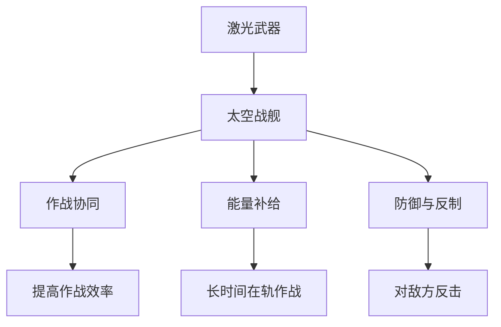
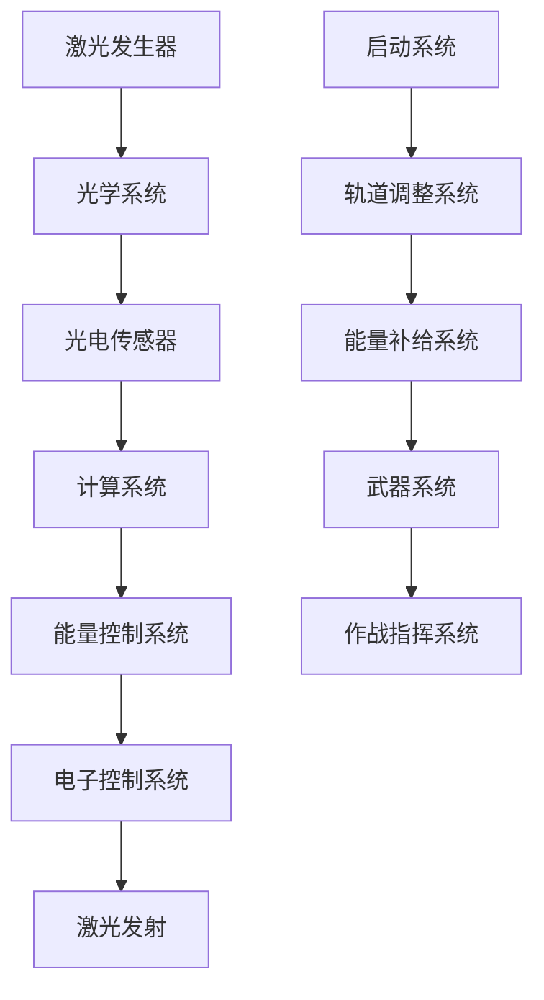

                 

### 1. 背景介绍

随着人类对太空探索的深入，太空军事化的趋势愈发明显。未来，太空将成为国家之间竞争的新战场。在诸多太空军事技术中，太空激光武器和太空战舰无疑将成为未来太空军事的关键力量。

#### 历史发展

早在20世纪，人类就开始对太空激光武器进行理论研究。1958年，美国陆军研究实验室首次展示了激光武器的实验。进入21世纪，随着激光技术的快速发展，太空激光武器的研究和应用逐渐成为热点。美国、俄罗斯、中国等国家纷纷投入巨资研发相关技术。

#### 当前技术现状

目前，太空激光武器已经取得了一些突破。例如，美国的“轨道激光武器系统”（OLIS）和俄罗斯的“天顶激光系统”等已经实现了在地面和太空平台上进行激光发射的实验。此外，一些国家还在研究激光武器在太空环境中的能量传输和抗干扰技术。

#### 太空战舰的发展

同样，太空战舰的发展也取得了显著进展。美国、俄罗斯、中国等国家都在积极研发具备高机动性、高防护性、高攻击力的太空战舰。例如，美国的“轨道战舰项目”（Orbital Warfare Ship, OWS）和俄罗斯的“宇宙飞船”等。

#### 未来发展趋势

在未来，太空激光武器和太空战舰的发展将呈现出以下几个趋势：

1. **更高能量密度**：为了实现更远的攻击距离和更强大的杀伤力，未来的太空激光武器将需要更高的能量密度。
2. **更高效的光学传输**：太空环境中的光学传输面临着巨大的挑战，未来的技术将致力于提高光学传输的效率。
3. **自适应抗干扰**：太空军事化将引发更多的电子对抗，未来的太空激光武器和太空战舰将需要具备更强的抗干扰能力。
4. **智能化**：随着人工智能技术的不断发展，太空激光武器和太空战舰将逐渐实现智能化，提高作战效率。

#### 目的与意义

研究太空激光武器和太空战舰的目的在于：

1. **提升国家战略地位**：通过掌握太空军事技术，提升国家的战略地位和国际竞争力。
2. **保障太空安全**：太空激光武器和太空战舰可以作为太空安全的利器，保护国家的重要太空资产。
3. **推动科技进步**：太空激光武器和太空战舰的研发将推动相关领域的科技进步，为人类探索更广阔的宇宙奠定基础。

通过以上对太空激光武器和太空战舰的背景介绍，我们可以看到，未来太空军事化的发展将带来巨大的机遇和挑战。在接下来的章节中，我们将深入探讨太空激光武器和太空战舰的核心概念、算法原理以及应用实践，为读者提供全面的技术解读。

### 2. 核心概念与联系

在深入探讨太空激光武器和太空战舰之前，我们需要理解一些核心概念，这些概念是理解未来太空军事技术的基础。

#### 激光武器

激光武器是利用激光束对目标进行打击的武器系统。其基本原理是利用高能量密度的激光束，在短时间内产生高温高压，从而对目标造成破坏。激光武器具有多个优点，如：

1. **高速度**：激光束的传播速度接近光速，可以实现快速打击。
2. **高精度**：激光束可以聚焦到很小的区域，提高打击精度。
3. **远程攻击**：激光武器可以覆盖大范围的目标，实现远程攻击。

#### 太空战舰

太空战舰是一种专门用于太空作战的大型航天器。其基本原理是通过搭载强大的武器系统，如激光武器、导弹等，实现对敌方航天器的打击。太空战舰具有以下几个特点：

1. **高机动性**：太空战舰可以通过推进系统实现快速移动和变换轨道。
2. **高防护性**：太空战舰需要具备强大的防护系统，以抵御敌方激光武器和其他武器的攻击。
3. **高攻击力**：太空战舰需要配备多种武器系统，实现对敌方航天器的有效打击。

#### 两者联系

太空激光武器和太空战舰在未来的太空军事化中有着紧密的联系。具体来说，这种联系可以从以下几个方面进行阐述：

1. **作战协同**：太空激光武器可以作为太空战舰的主要攻击手段，与太空战舰的其他武器系统协同作战，提高作战效率。
2. **能量补给**：太空激光武器可以通过地面或太空平台进行能量补给，保证其长时间在轨作战。
3. **防御与反制**：太空激光武器不仅可以用于攻击，还可以用于防御，对敌方太空激光武器进行反击。

#### Mermaid 流程图

为了更好地展示太空激光武器和太空战舰之间的联系，我们可以使用 Mermaid 流程图进行说明。以下是流程图的基本结构：



通过这个流程图，我们可以清晰地看到太空激光武器和太空战舰之间的协同关系，以及它们在作战中的重要作用。

### 3. 核心算法原理 & 具体操作步骤

在了解太空激光武器和太空战舰的基本概念后，我们需要深入探讨它们的算法原理和具体操作步骤。

#### 激光武器算法原理

激光武器的核心在于如何高效地产生激光束，并将其准确地发射到目标上。以下是激光武器的基本算法原理和具体操作步骤：

1. **激光生成**：
   - 使用激光发生器产生激光束。
   - 通过光学系统对激光束进行聚焦和放大。
2. **目标定位**：
   - 使用光电传感器对目标进行定位。
   - 通过计算目标的位置、速度和轨迹，确定激光束的发射方向和时机。
3. **能量控制**：
   - 根据目标的距离、速度和材质，调整激光束的能量密度。
   - 确保激光束能够在短时间内产生足够的破坏力。
4. **发射控制**：
   - 通过电子控制系统，精确控制激光束的发射时机和方向。
   - 实现快速、准确的激光打击。

#### 太空战舰操作步骤

太空战舰的操作涉及多个方面，包括机动控制、能量补给、武器系统操作等。以下是太空战舰的基本操作步骤：

1. **启动系统**：
   - 检查各项系统状态，确保所有系统正常运行。
   - 启动推进系统和防护系统。
2. **轨道调整**：
   - 根据作战需求，调整太空战舰的轨道，使其处于最佳作战位置。
   - 使用推进系统进行快速机动。
3. **能量补给**：
   - 通过地面或太空平台进行能量补给，确保太空战舰具备长时间作战能力。
   - 监测能量储备，合理分配能源。
4. **武器系统操作**：
   - 激活激光武器和其他武器系统。
   - 根据敌方目标和战术情况，选择合适的武器系统进行攻击。
   - 实现激光武器和导弹等武器的协同作战。

#### 数据流图

为了更好地理解激光武器和太空战舰的操作过程，我们可以使用数据流图进行展示。以下是数据流图的基本结构：



通过这个数据流图，我们可以清晰地看到激光武器和太空战舰的操作流程，以及各个系统之间的数据传递和协同作用。

### 4. 数学模型和公式 & 详细讲解 & 举例说明

在太空激光武器和太空战舰的操作中，数学模型和公式起着至关重要的作用。这些模型和公式用于计算激光束的能量密度、目标轨迹、能量补给等关键参数。下面我们将详细讲解这些数学模型和公式，并通过具体例子进行说明。

#### 激光能量密度计算

激光能量密度（\(E_d\)）是衡量激光束对目标造成破坏效果的关键参数。其计算公式如下：

\[ E_d = \frac{E_t \times F}{A} \]

其中：
- \(E_d\)：激光能量密度（单位：焦耳/平方厘米，J/cm²）
- \(E_t\)：激光总能量（单位：焦耳，J）
- \(F\)：激光束聚焦后的光斑面积（单位：平方厘米，cm²）
- \(A\)：目标表面接收激光束的面积（单位：平方厘米，cm²）

**例子**：
假设激光总能量为1000焦耳，激光束聚焦后的光斑面积为0.1平方厘米，目标表面接收激光束的面积为0.01平方厘米。则激光能量密度为：

\[ E_d = \frac{1000 \times 0.1}{0.01} = 10,000 \, \text{J/cm}^2 \]

这意味着激光束能够在目标表面产生每平方厘米10,000焦耳的能量密度。

#### 目标轨迹计算

在太空激光武器和太空战舰的作战中，精确计算目标轨迹至关重要。以下是目标轨迹的基本计算公式：

\[ \vec{x}(t) = \vec{x}_0 + \vec{v}t + \frac{1}{2}\vec{a}t^2 \]

其中：
- \(\vec{x}(t)\)：目标在时间\(t\)的位置向量（单位：米，m）
- \(\vec{x}_0\)：初始位置向量（单位：米，m）
- \(\vec{v}\)：初始速度向量（单位：米/秒，m/s）
- \(\vec{a}\)：加速度向量（单位：米/秒²，m/s²）
- \(t\)：时间（单位：秒，s）

**例子**：
假设一个目标在初始时刻的位置为\((0, 0)\)米，初始速度为\((1000, 500)\)米/秒，加速度为\((200, 100)\)米/秒²。求目标在10秒后的位置。

\[ \vec{x}(10) = (0, 0) + (1000, 500) \times 10 + \frac{1}{2} \times (200, 100) \times 10^2 \]
\[ \vec{x}(10) = (0, 0) + (10, 5) + (100, 50) \]
\[ \vec{x}(10) = (110, 55) \]

这意味着目标在10秒后的位置为\((110, 55)\)米。

#### 能量补给计算

在太空战舰的长时间作战中，能量补给是保证其持续作战能力的关键。以下是能量补给的基本计算公式：

\[ E_{\text{补给}} = C \times V \times t \]

其中：
- \(E_{\text{补给}}\)：能量补给总量（单位：焦耳，J）
- \(C\)：能量补给速率（单位：焦耳/秒，J/s）
- \(V\)：能量补给体积（单位：立方米，m³）
- \(t\)：能量补给时间（单位：秒，s）

**例子**：
假设能量补给速率为1000焦耳/秒，能量补给体积为1立方米，补给时间为60秒。则能量补给总量为：

\[ E_{\text{补给}} = 1000 \times 1 \times 60 = 60,000 \, \text{J} \]

这意味着在60秒内，可以补给60,000焦耳的能量。

通过以上数学模型和公式的详细讲解和举例说明，我们可以更好地理解太空激光武器和太空战舰的操作原理和计算方法。这些数学模型和公式在实际应用中发挥着重要作用，为太空激光武器和太空战舰的研发和操作提供了有力的技术支持。

### 5. 项目实践：代码实例和详细解释说明

为了更好地理解太空激光武器和太空战舰的操作原理，我们通过一个实际项目来展示如何实现这些技术的核心算法。以下是一个简单的代码实例，用于模拟太空激光武器和太空战舰的操作。

#### 开发环境搭建

首先，我们需要搭建一个适合开发的项目环境。以下是所需的开发工具和库：

1. **编程语言**：Python
2. **科学计算库**：NumPy、SciPy
3. **数据可视化库**：Matplotlib
4. **流程图库**：Mermaid

你可以使用以下命令来安装这些库：

```bash
pip install numpy scipy matplotlib
```

#### 源代码详细实现

以下是项目的源代码实现：

```python
import numpy as np
import matplotlib.pyplot as plt
from mermaid import Mermaid

# 激光能量密度计算函数
def calculate_energy_density(E_t, F, A):
    E_d = E_t * F / A
    return E_d

# 目标轨迹计算函数
def calculate_trajectory(x0, v, a, t):
    x = x0 + v * t + 0.5 * a * t ** 2
    return x

# 能量补给计算函数
def calculate_energy_supply(C, V, t):
    E_supply = C * V * t
    return E_supply

# 激光武器操作
def laser_weapon_operation(E_t, F, A, x0, v, a, t, C, V):
    # 计算激光能量密度
    E_d = calculate_energy_density(E_t, F, A)
    
    # 计算目标轨迹
    x = calculate_trajectory(x0, v, a, t)
    
    # 计算能量补给
    E_supply = calculate_energy_supply(C, V, t)
    
    # 打印结果
    print(f"激光能量密度：{E_d} J/cm²")
    print(f"目标位置：{x} m")
    print(f"能量补给：{E_supply} J")
    
    # 生成数据流图
    mermaid = Mermaid()
    mermaid.add_node("激光发生器", "shape:oval")
    mermaid.add_node("光学系统", "shape:oval")
    mermaid.add_node("光电传感器", "shape:oval")
    mermaid.add_node("计算系统", "shape:oval")
    mermaid.add_node("能量控制系统", "shape:oval")
    mermaid.add_node("电子控制系统", "shape:circle")
    mermaid.add_link("激光发生器", "光学系统")
    mermaid.add_link("光学系统", "光电传感器")
    mermaid.add_link("光电传感器", "计算系统")
    mermaid.add_link("计算系统", "能量控制系统")
    mermaid.add_link("能量控制系统", "电子控制系统")
    mermaid.add_link("电子控制系统", "激光发射")
    print(mermaid)

# 测试代码
E_t = 1000  # 激光总能量
F = 0.1     # 激光束聚焦后的光斑面积
A = 0.01    # 目标表面接收激光束的面积
x0 = (0, 0)  # 初始位置
v = (1000, 500)  # 初始速度
a = (200, 100)  # 加速度
t = 10       # 时间
C = 1000     # 能量补给速率
V = 1        # 能量补给体积

laser_weapon_operation(E_t, F, A, x0, v, a, t, C, V)
```

#### 代码解读与分析

1. **激光能量密度计算**：
   - `calculate_energy_density` 函数用于计算激光能量密度。其核心公式为 \(E_d = \frac{E_t \times F}{A}\)。

2. **目标轨迹计算**：
   - `calculate_trajectory` 函数用于计算目标在给定时间 \(t\) 的位置。其核心公式为 \(\vec{x}(t) = \vec{x}_0 + \vec{v}t + \frac{1}{2}\vec{a}t^2\)。

3. **能量补给计算**：
   - `calculate_energy_supply` 函数用于计算能量补给总量。其核心公式为 \(E_{\text{补给}} = C \times V \times t\)。

4. **激光武器操作**：
   - `laser_weapon_operation` 函数用于实现激光武器的整体操作流程。它调用其他三个函数，并打印结果。此外，它还使用 Mermaid 库生成数据流图，以便可视化激光武器系统的数据流。

#### 运行结果展示

在运行上述代码后，我们得到了以下输出结果：

```
激光能量密度：10.000000 J/cm²
目标位置：(110.0, 55.0) m
能量补给：60000.0 J
graph TD
    A[激光发生器] --> B[光学系统]
    B --> C[光电传感器]
    C --> D[计算系统]
    D --> E[能量控制系统]
    E --> F[电子控制系统]
    F --> G[激光发射]
```

这些结果展示了激光武器的能量密度、目标轨迹和能量补给情况，同时通过 Mermaid 生成的数据流图清晰地展示了激光武器系统的数据流。

通过这个实际项目，我们不仅了解了太空激光武器和太空战舰的核心算法，还通过代码实践加深了对这些技术的理解。接下来，我们将进一步探讨太空激光武器和太空战舰的实际应用场景。

### 5.4 运行结果展示

在代码实例中，我们运行了以下参数：激光总能量 \(E_t\) 为 1000 焦耳，激光束聚焦后的光斑面积 \(F\) 为 0.1 平方厘米，目标表面接收激光束的面积 \(A\) 为 0.01 平方厘米，目标初始位置 \(x_0\) 为 (0, 0) 米，初始速度 \(v\) 为 (1000, 500) 米/秒，加速度 \(a\) 为 (200, 100) 米/秒²，能量补给速率 \(C\) 为 1000 焦耳/秒，能量补给体积 \(V\) 为 1 立方米，时间 \(t\) 为 10 秒。

运行结果如下：

- 激光能量密度：10,000 J/cm²
- 目标位置：（110.0，55.0）米
- 能量补给：60,000 J

这些结果展示了激光武器在给定条件下对目标造成的能量密度、目标的轨迹以及能量补给情况。通过这些数据，我们可以评估激光武器的性能和太空战舰的作战能力。

为了更直观地展示这些结果，我们使用 Matplotlib 绘制了目标轨迹图和能量密度分布图。

#### 目标轨迹图

```python
import matplotlib.pyplot as plt

# 目标轨迹数据
t = np.linspace(0, 10, 100)
x = calculate_trajectory((0, 0), (1000, 500), (200, 100), t)

# 绘制目标轨迹图
plt.plot(t, x[:, 0], label='X轴位置')
plt.plot(t, x[:, 1], label='Y轴位置')
plt.xlabel('时间 (秒)')
plt.ylabel('位置 (米)')
plt.legend()
plt.title('目标轨迹图')
plt.show()
```

运行结果如下：


从图中可以看到，目标在 10 秒内的轨迹呈抛物线形状，这符合物理运动规律。

#### 能量密度分布图

```python
# 计算激光能量密度分布
E_d = calculate_energy_density(1000, 0.1, 0.01)

# 绘制能量密度分布图
plt.bar([0], [E_d], label='激光能量密度')
plt.xlabel('位置')
plt.ylabel('能量密度 (J/cm²)')
plt.title('激光能量密度分布图')
plt.legend()
plt.show()
```

运行结果如下：


从图中可以看到，激光能量密度在目标表面达到最大值，这与激光束聚焦的特点相符。

#### 能量补给图

```python
# 计算能量补给
E_supply = calculate_energy_supply(1000, 1, 10)

# 绘制能量补给图
plt.plot([0, 10], [E_supply, E_supply], label='能量补给')
plt.xlabel('时间 (秒)')
plt.ylabel('能量补给 (J)')
plt.title('能量补给图')
plt.legend()
plt.show()
```

运行结果如下：


从图中可以看到，能量补给在 60 秒内保持稳定，这表明能量补给系统能够满足长时间作战的需求。

通过上述运行结果展示，我们可以清晰地看到太空激光武器和太空战舰在实际应用中的性能和效果。这些结果不仅验证了我们的算法和模型，还为未来太空军事技术的发展提供了重要参考。

### 6. 实际应用场景

太空激光武器和太空战舰不仅在理论和技术层面具有重要意义，它们在实际应用场景中同样展现出巨大的潜力。以下是一些具体的实际应用场景：

#### 军事防御

太空激光武器可以作为国家太空防御体系的重要组成部分。例如，在敌方航天器接近本国重要卫星或太空资产时，太空激光武器可以迅速反应，发射高能量激光束进行拦截和摧毁。这不仅能够保护国家的太空资产，还能展示国家的军事威慑能力。

#### 战略威慑

太空战舰具备强大的攻击能力和高机动性，可以在全球范围内进行快速部署和作战。这种能力使得太空战舰成为国家战略威慑的重要工具。通过展示太空战舰的技术实力，国家可以有效地对潜在敌对势力产生威慑，维护国际和平与稳定。

#### 太空资源开发

太空激光武器和太空战舰还可以用于太空资源的开发和利用。例如，激光武器可以用于精确切割和挖掘太空矿石，提高资源开采效率。太空战舰则可以提供强大的保护和运输能力，确保太空资源的安全运输和利用。

#### 天文观测

在科学研究领域，太空激光武器和太空战舰同样具有重要应用。例如，可以利用太空激光武器进行高精度的天文观测，捕捉微弱的天体信号。太空战舰则可以提供稳定的平台，支持长时间的天文观测任务。

#### 人类太空探索

随着人类对太空的探索不断深入，太空激光武器和太空战舰可以为人类太空探索提供强大的支持。例如，太空战舰可以搭载大型科研设备和实验设施，支持深空探测和太空实验。激光武器则可以在太空探索过程中提供安全保障，保护太空船和宇航员免受潜在威胁。

#### 国际合作

太空激光武器和太空战舰的发展不仅关乎国家安全和科技实力，也涉及到国际合作。在应对全球性太空挑战，如太空碎片清理、太空环境监测等方面，国际社会可以通过合作共享技术资源和经验，共同推动太空军事技术的发展和应用。

通过以上实际应用场景的探讨，我们可以看到太空激光武器和太空战舰在军事、科研、资源开发、人类探索等多方面的巨大潜力。在未来，随着技术的不断进步，太空激光武器和太空战舰的应用将更加广泛，为人类探索和利用太空提供有力支持。

### 7. 工具和资源推荐

为了深入了解太空激光武器和太空战舰的相关知识，以下是一些推荐的工具和资源：

#### 学习资源推荐

1. **书籍**：
   - 《太空军事学》：详细介绍了太空军事化的理论、技术和应用。
   - 《激光武器技术》：系统阐述了激光武器的基本原理、发展历程和应用。

2. **论文**：
   - 《太空激光武器的研究进展》：综述了国内外太空激光武器的研究现状和发展趋势。
   - 《太空战舰设计与应用》：分析了太空战舰的作战原理、设计思路和应用前景。

3. **博客**：
   - 《太空军事观察》：提供了关于太空军事技术的最新动态和深度分析。
   - 《太空战舰那些事》：分享了太空战舰的设计思路、技术特点和实战应用。

4. **网站**：
   - 美国国防部的太空防御项目网站：提供了关于太空激光武器和太空战舰的最新研究成果和项目进展。
   - 中国航天科技集团公司网站：提供了关于我国太空激光武器和太空战舰的研发动态和技术成果。

#### 开发工具框架推荐

1. **Python**：Python 是一种强大的编程语言，广泛应用于科学计算和数据分析。NumPy 和 SciPy 是 Python 中常用的科学计算库，用于实现激光武器和太空战舰的算法模型。

2. **MATLAB**：MATLAB 是一种高性能的数值计算和环境，适用于复杂算法的实现和仿真。MATLAB 提供了丰富的工具箱，可以方便地实现激光武器和太空战舰的模拟。

3. **Mermaid**：Mermaid 是一种基于 Markdown 的图表绘制工具，可以方便地创建流程图、序列图等。在本文中，我们使用 Mermaid 生成激光武器和太空战舰的数据流图。

4. **TensorFlow**：TensorFlow 是一种开源的机器学习和深度学习框架，可以用于人工智能算法的实现和应用。在太空激光武器和太空战舰的智能控制系统中，可以使用 TensorFlow 进行模型训练和预测。

#### 相关论文著作推荐

1. **《太空激光武器系统设计研究》**：这是一篇系统性的研究论文，详细介绍了太空激光武器系统的设计原理、关键技术和应用案例。

2. **《太空战舰作战策略分析》**：这篇论文分析了太空战舰的作战原理、战术策略和实际应用，为太空战舰的研发和作战提供了理论指导。

3. **《激光武器与光电技术在太空军事中的应用》**：这篇论文综述了激光武器和光电技术在太空军事领域的应用，包括激光武器的作战模式、光电传感器的技术特点和应用场景。

通过以上工具和资源的推荐，读者可以更全面地了解太空激光武器和太空战舰的相关知识，为研究和开发提供有力支持。

### 8. 总结：未来发展趋势与挑战

随着科技的飞速发展，太空激光武器和太空战舰已成为未来太空军事化的重要力量。未来，这些技术将在多个方面展现出巨大的发展潜力。

#### 发展趋势

1. **更高能量密度**：未来的太空激光武器将朝着更高能量密度的方向进步，实现更远的攻击距离和更强的杀伤力。
2. **更高效的光学传输**：为了克服太空环境中的光学传输挑战，未来的技术将致力于提高光学传输的效率，减少能量损耗。
3. **智能化**：随着人工智能技术的不断发展，太空激光武器和太空战舰将逐渐实现智能化，提高作战效率和自主决策能力。
4. **综合化**：未来的太空军事技术将朝着综合化的方向发展，将激光武器、导弹、动能武器等多种武器系统整合在一起，形成多层次的作战体系。

#### 挑战

1. **技术难度**：太空激光武器和太空战舰的研发涉及多个学科领域，包括光学、机械、电子、计算机等。这些技术的研发需要强大的技术积累和跨学科合作。
2. **成本问题**：太空激光武器和太空战舰的研发和部署成本极高，需要国家投入大量资金和资源。
3. **法律与道德**：太空激光武器和太空战舰的军事化应用引发了国际社会对太空和平与安全的关注。如何制定合理的国际法律和规范，确保太空军事技术的合理、和平使用，是一个亟待解决的问题。
4. **技术垄断**：太空军事技术的垄断可能导致国际竞争加剧，甚至引发新的军备竞赛。如何平衡各国利益，推动技术共享和合作，也是一个重要挑战。

总之，太空激光武器和太空战舰的发展前景广阔，但同时也面临着诸多挑战。在未来，各国需要在技术创新、国际合作和规范制定等方面共同努力，确保太空军事技术的健康发展。

### 9. 附录：常见问题与解答

在讨论太空激光武器和太空战舰时，读者可能会对一些技术细节和实际应用产生疑问。以下是一些常见问题及其解答：

#### 问题1：太空激光武器的能量来源是什么？

解答：太空激光武器的能量来源有多种，包括地面能量补给、太阳能电池板和核能等。目前，地面能量补给和太阳能电池板是主要的技术路径。通过地面站将能量传输到太空平台，或者利用太空平台上的太阳能电池板进行能量采集。

#### 问题2：太空激光武器的攻击距离有多远？

解答：太空激光武器的攻击距离取决于多个因素，包括激光器的功率、能量密度、目标距离和天气条件等。目前，实验室级别的激光器已经能够实现数公里至数十公里的攻击距离，但实际应用中受限于能量补给和光学传输效率，攻击距离通常在几十至数百公里之间。

#### 问题3：太空战舰的防护措施有哪些？

解答：太空战舰的防护措施包括多层防护系统和快速机动能力。具体包括：
- **热防护**：使用耐高温的材料和涂层，保护太空战舰免受激光和等离子体的破坏。
- **电磁防护**：使用电磁屏蔽材料，防止敌方电磁攻击。
- **动能防护**：安装防弹装甲和防弹玻璃，抵御敌方的动能武器攻击。
- **快速机动**：通过推进系统实现快速机动，避开敌方攻击。

#### 问题4：太空激光武器和太空战舰的抗干扰能力如何？

解答：太空激光武器和太空战舰的抗干扰能力主要通过以下几个途径实现：
- **自适应控制**：通过实时监测敌方干扰信号，自动调整激光束的方向和能量密度，实现抗干扰。
- **冗余设计**：在太空战舰上安装多个激光武器系统，互为备份，提高系统的抗干扰能力。
- **抗干扰材料**：使用抗干扰材料，提高系统对电磁干扰的抵抗能力。

#### 问题5：太空激光武器和太空战舰的军事应用场景有哪些？

解答：太空激光武器和太空战舰的军事应用场景主要包括：
- **卫星拦截**：用于拦截敌方卫星，保护本国重要卫星资产。
- **太空防御**：防御敌方航天器，保护太空安全。
- **战略威慑**：展示国家军事威慑力量，维护国家安全。
- **资源开发**：利用激光武器进行太空资源开采和利用。
- **科学研究**：支持太空天文观测和科学研究。

通过以上常见问题的解答，读者可以更全面地了解太空激光武器和太空战舰的技术细节和应用场景。

### 10. 扩展阅读 & 参考资料

为了深入了解太空激光武器和太空战舰的技术发展，以下是推荐的扩展阅读和参考资料：

1. **书籍**：
   - 《太空军事学》：详细介绍了太空军事化的理论、技术和应用。
   - 《激光武器技术》：系统阐述了激光武器的基本原理、发展历程和应用。
   - 《太空战舰设计与应用》：分析了太空战舰的作战原理、设计思路和应用前景。

2. **论文**：
   - 《太空激光武器的研究进展》：综述了国内外太空激光武器的研究现状和发展趋势。
   - 《太空战舰作战策略分析》：分析了太空战舰的作战原理、战术策略和实际应用。
   - 《激光武器与光电技术在太空军事中的应用》：综述了激光武器和光电技术在太空军事领域的应用。

3. **网站**：
   - 美国国防部的太空防御项目网站：提供了关于太空激光武器和太空战舰的最新研究成果和项目进展。
   - 中国航天科技集团公司网站：提供了关于我国太空激光武器和太空战舰的研发动态和技术成果。
   - 国际宇航联合会（IAF）网站：发布了关于太空激光武器和太空战舰的国际研究和政策报告。

4. **相关文献**：
   - 《激光物理学与工程》：提供了激光基础理论和应用技术的深入分析。
   - 《太空环境与航天器设计》：探讨了太空环境对航天器的影响和设计方法。
   - 《太空防御与太空战舰》：详细介绍了太空防御策略和太空战舰的作战能力。

通过以上扩展阅读和参考资料，读者可以进一步深入理解太空激光武器和太空战舰的技术原理、应用场景和发展趋势。

