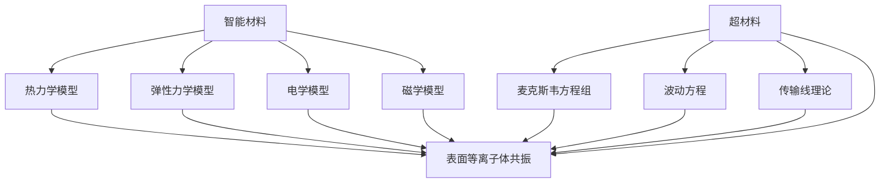

                 

### 1. 背景介绍

智能材料和超材料是材料科学和物理学领域的两个前沿研究方向，它们在未来的技术发展中扮演着至关重要的角色。本文将深入探讨这两种新材料，从其定义、历史背景、核心概念，到未来的发展趋势，为读者呈现一幅2050年的智能材料与超材料的蓝图。

#### 1.1 定义与分类

首先，让我们来明确智能材料和超材料的定义。

**智能材料**，也称为“响应性材料”，是一种能够对外界刺激（如温度、光、电、磁等）做出响应的材料。这种响应可以是物理性质（如形状、颜色、硬度等）的变化，也可以是化学性质的变化。智能材料的研究目标是通过控制材料的内部结构或成分，使其在不同环境下具备特定的功能。

**超材料**，则是一种具有人工设计的电磁特性，超越了自然界中任何已知材料的特性的材料。超材料通常由周期性排列的纳米结构单元组成，其设计目的是为了实现对电磁波的调控，如负折射率、电磁隐身、表面等离子共振等。

从分类上看，智能材料和超材料可以进一步细分为多种类型：

- **智能材料**：形状记忆合金、形状记忆聚合物、电致变色材料、磁致伸缩材料、热电材料等。
- **超材料**：左手材料、等离子体超材料、透明导电薄膜、电磁屏蔽材料等。

#### 1.2 历史背景

智能材料和超材料的发展历程可以追溯到20世纪末。1987年，美国加州大学伯克利分校的科学家首次提出“超材料”的概念。这一概念的提出，标志着人类开始尝试设计并制造出具有自然界中不存在的新物理特性的材料。

在智能材料方面，1980年代初期，科学家们开始研究形状记忆合金，这种材料可以在加热后恢复其原始形状。随后，随着对智能材料研究的不断深入，各种具有特定响应功能的智能材料相继被研制出来。

#### 1.3 核心概念与联系

为了更好地理解智能材料和超材料，我们需要探讨它们的核心概念及其相互联系。

**响应性原理**：智能材料的核心在于其响应性，即材料能够对外界刺激作出反应。这种响应通常是通过材料内部结构的变化来实现的。例如，形状记忆合金在受到加热时会恢复到其原始形状，而热电材料则可以在温度变化时产生电流。

**人工设计**：超材料的核心在于其人工设计，即通过设计特定的纳米结构来赋予材料新的物理特性。例如，左手材料的结构设计使得其具有负折射率，这一特性在自然界中是不存在的。

**相互作用**：智能材料和超材料之间存在着相互作用。智能材料的响应性可以为超材料提供刺激源，而超材料的特性则可以增强智能材料的功能。例如，智能材料的热电效应可以与超材料的电磁调控相结合，实现更高效的能量转化和传输。

#### 1.4 当前研究现状

目前，智能材料和超材料的研究已取得显著进展。在智能材料方面，形状记忆合金、电致变色材料、热电材料等已在多个领域得到了应用，如航空航天、汽车制造、生物医学等。在超材料方面，左手材料、电磁屏蔽材料等的研究也取得了突破性进展。

然而，尽管取得了这些成就，智能材料和超材料仍面临着诸多挑战，如材料稳定性、可制造性、成本等。这些问题需要在未来继续研究和解决。

### 1.5 未来的发展方向

展望未来，智能材料和超材料将继续在多个领域发挥重要作用。以下是几个可能的发展方向：

- **新型功能材料**：随着对材料设计的深入理解，未来将涌现出更多具有新型功能的智能材料和超材料。
- **智能制造**：智能材料和超材料在智能制造中的应用将变得更加广泛，如机器人、无人机、智能传感器等。
- **能源领域**：智能材料和超材料在能源领域的应用前景广阔，如高效太阳能电池、能量收集器件等。
- **生物医学**：智能材料和超材料在生物医学领域的应用也将进一步拓展，如生物可降解材料、智能药物释放系统等。

总之，智能材料和超材料是未来材料科学和技术发展的重要方向，它们将为我们带来前所未有的创新和变革。在接下来的章节中，我们将进一步探讨智能材料和超材料的数学模型、核心算法、实际应用等，为读者提供更深入的了解。

#### 1.5 未来的发展方向

展望未来，智能材料和超材料将继续在多个领域发挥重要作用。以下是几个可能的发展方向：

- **新型功能材料**：随着对材料设计的深入理解，未来将涌现出更多具有新型功能的智能材料和超材料。例如，具有自适应光学特性的智能镜片、能够根据外界环境调节透明度的智能窗户等。

- **智能制造**：智能材料和超材料在智能制造中的应用将变得更加广泛，如机器人、无人机、智能传感器等。这些智能设备将能够根据环境变化自主调整其性能，提高生产效率和灵活性。

- **能源领域**：智能材料和超材料在能源领域的应用前景广阔，如高效太阳能电池、能量收集器件、智能电网等。这些材料将能够实现更高效的能量转化、储存和传输，从而推动可再生能源的发展。

- **生物医学**：智能材料和超材料在生物医学领域的应用也将进一步拓展，如生物可降解材料、智能药物释放系统、组织工程等。这些材料将能够提高药物疗效、减少副作用，并促进新药研发。

- **国防军工**：智能材料和超材料在国防军工领域的应用同样具有巨大的潜力，如隐身涂层、自适应装甲、智能防护等。这些材料将提高军事装备的隐身性能、防护能力和作战效能。

- **通信领域**：智能材料和超材料在通信领域的应用将推动5G、6G等新一代通信技术的发展。通过设计具有特殊电磁特性的智能材料，可以实现更高效的信号传输、更高的数据传输速率和更广的通信覆盖范围。

- **环境监测**：智能材料和超材料在环境监测领域的应用将为环境保护提供有力支持。例如，利用智能传感器材料实时监测水质、空气质量等环境参数，及时发现并应对环境污染问题。

- **智能家居**：智能材料和超材料在智能家居中的应用将使家居环境更加智能、舒适和安全。例如，利用智能玻璃实现室内温度、光线的自动调节，利用智能地板监测家庭成员的健康状况等。

总之，智能材料和超材料在未来的发展中将具有广泛的应用前景，成为推动科技进步和社会发展的重要力量。在接下来的章节中，我们将进一步探讨智能材料和超材料的数学模型、核心算法、实际应用等，为读者提供更深入的了解。

---

接下来，我们将深入探讨智能材料和超材料的数学模型、核心算法，以及具体的操作步骤和实现方法。这些内容将为读者提供一个更加详细的视角，理解这两种前沿新材料的工作原理和应用场景。

#### 2. 核心概念与联系

为了更好地理解智能材料和超材料，我们需要首先明确它们的核心概念，并探讨它们之间的相互联系。

##### 2.1 智能材料的数学模型

智能材料的响应行为可以通过数学模型来描述。以下是几个关键的数学模型：

- **热力学模型**：热力学模型描述了材料在温度变化时的响应行为。常用的热力学模型包括等温热力学和绝热热力学。等温热力学模型主要基于热力学第一和第二定律，通过能量平衡方程来描述材料的温度变化。绝热热力学模型则考虑了材料在温度变化过程中的热传导效应。

- **弹性力学模型**：弹性力学模型描述了材料在外力作用下的形变行为。常用的弹性力学模型包括线性弹性和非线性弹性。线性弹性模型基于胡克定律，通过应力-应变关系来描述材料的弹性响应。非线性弹性模型则考虑了材料在高压下的非线性变形行为。

- **电学模型**：电学模型描述了材料在电场作用下的电学响应。常用的电学模型包括线性电学模型和非线性电学模型。线性电学模型基于欧姆定律，通过电导率来描述材料的电学响应。非线性电学模型则考虑了材料在高电场下的非线性电学性质。

- **磁学模型**：磁学模型描述了材料在磁场作用下的磁学响应。常用的磁学模型包括线性磁学和非线性磁学。线性磁学模型基于法拉第电磁感应定律，通过磁导率来描述材料的磁学响应。非线性磁学模型则考虑了材料在强磁场下的非线性磁学性质。

##### 2.2 超材料的数学模型

超材料的数学模型主要涉及电磁学理论。以下是几个关键的概念和模型：

- **麦克斯韦方程组**：麦克斯韦方程组描述了电磁波的传播规律。超材料的设计和性能分析通常基于麦克斯韦方程组。麦克斯韦方程组包括四个方程：高斯定律（电场版）和高斯定律（磁场版）、法拉第电磁感应定律和安培-麦克斯韦定律。

- **波动方程**：波动方程描述了电磁波在介质中的传播过程。对于超材料，波动方程通常用于分析和设计具有特殊电磁特性的材料。波动方程包括横波方程和纵波方程，分别描述了电磁波的横电磁波（TE波）和纵电磁波（TM波）传播。

- **传输线理论**：传输线理论描述了电磁波在传输线中的传播过程。超材料的设计和性能分析也可以基于传输线理论。传输线理论包括传输线方程和特性阻抗概念，用于分析和设计具有特定电磁特性的传输线。

- **表面等离子体共振**：表面等离子体共振是超材料的重要特性之一。表面等离子体共振是指电磁波在材料表面产生的等离子体振荡，这种振荡可以显著改变材料的电磁特性。表面等离子体共振通常通过麦克斯韦方程组和边界条件来描述。

##### 2.3 智能材料与超材料的联系

智能材料和超材料之间存在密切的联系。以下是几个关键的相互作用和融合点：

- **响应性机制**：智能材料和超材料的响应性机制可以相互结合。例如，智能材料可以通过其响应性来调控超材料的电磁特性，从而实现更复杂的电磁调控功能。例如，通过电控或热控方式调节智能材料的形状或电导率，从而影响超材料的电磁响应。

- **多功能集成**：智能材料和超材料的结合可以实现多功能集成。例如，将智能材料与超材料结合，可以制造出具有自适应电磁屏蔽、热电转换、光电转换等功能的复合材料。这些复合材料可以用于新型电子器件、能源设备、传感器等领域。

- **自适应性**：智能材料和超材料的结合可以实现更高的自适应性。智能材料可以根据环境变化自主调整其性能，而超材料则可以通过其特殊的电磁特性来增强智能材料的自适应性。例如，在智能机器人中，智能材料可以感知环境变化，而超材料则可以提供所需的电磁屏蔽或能量收集功能。

- **性能优化**：智能材料和超材料的结合可以优化材料的整体性能。例如，通过将智能材料的响应性与超材料的电磁调控结合，可以实现更高的能量转化效率、更低的能量损失等。这种优化方法可以应用于新型能源设备、通信设备等领域。

#### 2.4 Mermaid 流程图

为了更直观地展示智能材料与超材料的数学模型和联系，我们可以使用Mermaid流程图来描述。以下是一个简化的Mermaid流程图示例：



在这个流程图中，智能材料和超材料分别代表了两种不同的材料类别。智能材料的数学模型包括热力学模型、弹性力学模型、电学模型和磁学模型。超材料的数学模型包括麦克斯韦方程组、波动方程、传输线理论和表面等离子体共振。智能材料与超材料之间的联系通过共同的数学模型（如麦克斯韦方程组、波动方程和表面等离子体共振）来体现。

通过这个流程图，我们可以清晰地看到智能材料和超材料在数学模型和联系方面的结构。这为我们深入理解这两种新材料的工作原理和应用场景提供了有力的支持。

---

在明确了智能材料和超材料的核心概念与联系后，我们接下来将探讨它们的核心算法原理和具体操作步骤。这些算法原理和操作步骤是理解和应用智能材料和超材料的关键，我们将通过实例来具体说明。

#### 3. 核心算法原理 & 具体操作步骤

智能材料和超材料的核心算法原理主要包括以下几个方面：材料设计、响应性控制、性能优化和系统集成。以下我们将一一介绍这些算法原理，并结合具体实例进行说明。

##### 3.1 材料设计算法

材料设计是智能材料和超材料研究的重要环节。通过算法，科学家和工程师可以预测和设计出具有特定功能的材料。

- **实例**：设计一个具有负折射率的超材料。

**操作步骤**：

1. **确定设计目标**：目标为设计一个具有负折射率的超材料，用于电磁波调控。
2. **选择结构类型**：选择基于纳米线的结构，因为纳米线结构可以有效调控电磁波。
3. **结构参数优化**：使用遗传算法优化纳米线的直径、间距和排列方式，以实现负折射率。
4. **模拟验证**：通过电磁模拟软件（如CST Microwave Studio）验证设计的有效性。

**数学模型**：

- **传输矩阵方法**：使用传输矩阵方法模拟纳米线的电磁特性。

\[ T = \left[ \begin{array}{cc} a & b \\ c & d \end{array} \right] \]

其中，\( a, b, c, d \) 分别为传输矩阵的元素，它们与纳米线的几何参数和介电常数有关。

**优化算法**：

- **遗传算法**：遗传算法是一种基于自然选择的优化算法，用于搜索最优的纳米线参数组合。

##### 3.2 响应性控制算法

响应性控制是指通过算法控制智能材料的响应行为，使其对外界刺激作出特定的响应。

- **实例**：控制一个电致变色材料的颜色变化。

**操作步骤**：

1. **确定响应目标**：目标为通过电场控制电致变色材料的颜色变化。
2. **电场调节**：使用电控电路调节电场强度。
3. **颜色检测**：使用光谱仪检测材料表面的颜色。
4. **反馈调节**：根据检测到的颜色反馈调节电场强度，实现颜色变化的精确控制。

**数学模型**：

- **泊松方程**：描述电场在材料内部的分布。

\[ \nabla \cdot (\epsilon \nabla V) = 0 \]

其中，\( \epsilon \) 为介电常数，\( V \) 为电势。

**控制算法**：

- **PID控制器**：使用PID控制器实现电场的精确调节。

\[ u(t) = K_p e(t) + K_i \int e(t) dt + K_d \frac{de(t)}{dt} \]

其中，\( u(t) \) 为控制信号，\( e(t) \) 为误差信号，\( K_p, K_i, K_d \) 分别为比例、积分和微分系数。

##### 3.3 性能优化算法

性能优化是指通过算法优化智能材料和超材料的性能，如提高能量转化效率、增强电磁屏蔽能力等。

- **实例**：优化热电材料的能量转化效率。

**操作步骤**：

1. **确定优化目标**：目标为提高热电材料的能量转化效率。
2. **材料参数优化**：使用优化算法（如贝叶斯优化）优化热电材料的组分和微观结构。
3. **性能评估**：通过实验测量热电材料的性能。
4. **迭代优化**：根据实验结果迭代优化材料参数。

**数学模型**：

- **热电效应方程**：描述热电材料在温度差作用下的电势差和电流。

\[ S = \sigma \left( T_1 - T_2 \right) \]

其中，\( S \) 为塞贝克系数，\( \sigma \) 为电导率，\( T_1 \) 和 \( T_2 \) 分别为热端和冷端的温度。

**优化算法**：

- **贝叶斯优化**：贝叶斯优化是一种基于概率模型的优化算法，用于搜索最优的材料参数组合。

\[ p(\theta | x) \propto p(x | \theta) p(\theta) \]

其中，\( \theta \) 为材料参数，\( x \) 为实验结果，\( p(\theta | x) \) 为后验概率分布。

##### 3.4 系统集成算法

系统集成是指将智能材料和超材料集成到具体应用系统中，实现系统的整体优化。

- **实例**：集成智能材料和超材料到智能传感器系统中。

**操作步骤**：

1. **确定系统目标**：目标为开发一个智能传感器系统，实现高灵敏度、高分辨率和环境适应性。
2. **材料选择**：选择具有高响应性和电磁屏蔽能力的智能材料和超材料。
3. **系统集成**：将材料集成到传感器系统中，实现材料与传感器功能的有机结合。
4. **系统优化**：通过算法优化系统的整体性能，如使用深度学习算法提高传感器的数据处理能力。

**数学模型**：

- **神经网络模型**：描述智能传感器系统的数据处理过程。

\[ y = f(Wx + b) \]

其中，\( y \) 为输出，\( x \) 为输入，\( W \) 和 \( b \) 分别为权重和偏置。

**优化算法**：

- **反向传播算法**：反向传播算法用于训练神经网络，通过迭代更新权重和偏置，优化系统的性能。

\[ \Delta W = -\alpha \frac{\partial J}{\partial W} \]
\[ \Delta b = -\alpha \frac{\partial J}{\partial b} \]

其中，\( \Delta W \) 和 \( \Delta b \) 分别为权重和偏置的更新量，\( \alpha \) 为学习率，\( J \) 为损失函数。

通过以上核心算法原理和具体操作步骤的介绍，我们可以更好地理解和应用智能材料和超材料。这些算法原理不仅为智能材料和超材料的设计、制造和应用提供了理论基础，也为未来的科技进步和社会发展奠定了坚实基础。在接下来的章节中，我们将进一步探讨智能材料和超材料的数学模型、公式、项目实践等，为读者提供更深入的洞察。

---

在理解了智能材料和超材料的核心算法原理和操作步骤之后，我们将进一步探讨这些材料在数学模型和公式方面的具体应用。数学模型和公式不仅为智能材料和超材料的理论研究提供了工具，也为实际应用提供了定量分析的依据。

#### 4. 数学模型和公式

智能材料和超材料的数学模型和公式广泛应用于材料设计、性能预测和系统集成等各个环节。以下是几个关键的数学模型和公式，并结合具体应用场景进行详细讲解。

##### 4.1 塑性变形与响应性

在智能材料中，塑性变形和响应性是一个重要的研究领域。以下是一个简化的数学模型和公式。

- **奥古斯丁方程**：描述材料在应力作用下的塑性变形。

\[ \sigma = 2G \epsilon_{\text{p}} \]

其中，\( \sigma \) 是应力，\( G \) 是剪切模量，\( \epsilon_{\text{p}} \) 是塑性应变。

**实例**：一个形状记忆合金在受到应力后发生塑性变形。

**计算步骤**：

1. **确定应力**：假设应力为 \( \sigma = 100 \text{ MPa} \)。
2. **查表获取剪切模量**：假设剪切模量 \( G = 50 \text{ GPa} \)。
3. **计算塑性应变**：使用奥古斯丁方程计算塑性应变。

\[ \epsilon_{\text{p}} = \frac{\sigma}{2G} = \frac{100 \times 10^6}{2 \times 50 \times 10^9} = 0.001 \]

这意味着形状记忆合金在 \( 100 \text{ MPa} \) 的应力下发生了 \( 0.1\% \) 的塑性变形。

##### 4.2 热电效应与能量转化

热电材料是一种能够将热能直接转化为电能的材料。以下是一个简化的热电效应模型和公式。

- **塞贝克方程**：描述热电材料在温度差作用下的电压。

\[ V = S(T_1 - T_2) \]

其中，\( V \) 是电压，\( S \) 是塞贝克系数，\( T_1 \) 和 \( T_2 \) 分别是热端和冷端的温度。

**实例**：一个热电材料在 \( T_1 = 100 \text{℃} \) 和 \( T_2 = 30 \text{℃} \) 的温度差下产生电压。

**计算步骤**：

1. **确定温度差**：假设 \( T_1 = 100 \text{℃} \) 和 \( T_2 = 30 \text{℃} \)。
2. **查表获取塞贝克系数**：假设塞贝克系数 \( S = 1.5 \text{ mV/K} \)。
3. **计算电压**：使用塞贝克方程计算电压。

\[ V = S(T_1 - T_2) = 1.5 \times (100 - 30) \times 10^{-3} = 1.05 \text{ V} \]

这意味着热电材料在 \( 100 \text{℃} \) 和 \( 30 \text{℃} \) 的温度差下产生了 \( 1.05 \text{ V} \) 的电压。

##### 4.3 电磁波调控与超材料

超材料是一种具有人工设计电磁特性的材料，能够实现对电磁波的调控。以下是一个简化的电磁波调控模型和公式。

- **麦克斯韦方程组**：描述电磁波在超材料中的传播。

\[ \nabla \cdot \mathbf{D} = \rho \]
\[ \nabla \cdot \mathbf{B} = 0 \]
\[ \nabla \times \mathbf{E} = -\frac{\partial \mathbf{B}}{\partial t} \]
\[ \nabla \times \mathbf{H} = \mathbf{J} + \frac{\partial \mathbf{D}}{\partial t} \]

其中，\( \mathbf{D} \) 是电位移矢量，\( \mathbf{B} \) 是磁感应强度，\( \mathbf{E} \) 是电场强度，\( \mathbf{H} \) 是磁场强度，\( \rho \) 是电荷密度，\( \mathbf{J} \) 是电流密度。

**实例**：一个左手超材料在电磁波作用下。

**计算步骤**：

1. **确定电磁波参数**：假设电磁波的频率为 \( f = 10 \text{ GHz} \)。
2. **构建超材料模型**：使用麦克斯韦方程组构建左手超材料的数学模型。
3. **模拟电磁波传播**：使用电磁模拟软件（如CST Microwave Studio）模拟电磁波在左手超材料中的传播。

\[ \mathbf{E}(z,t) = E_0 \sin(kz - \omega t) \]
\[ \mathbf{H}(z,t) = H_0 \sin(kz - \omega t) \]

其中，\( k \) 是波数，\( \omega \) 是角频率，\( E_0 \) 和 \( H_0 \) 分别是电场和磁场的幅值。

##### 4.4 自适应响应与控制

智能材料通常具有自适应响应特性，能够根据外界刺激自动调整其物理或化学性质。以下是一个简化的自适应响应模型和公式。

- **电致变色模型**：描述电致变色材料在电场作用下的颜色变化。

\[ \Delta T = \alpha E \]

其中，\( \Delta T \) 是颜色的变化量，\( \alpha \) 是电致变色系数，\( E \) 是电场强度。

**实例**：一个电致变色材料在 \( E = 10 \text{ kV/cm} \) 的电场下。

**计算步骤**：

1. **确定电场强度**：假设电场强度为 \( E = 10 \text{ kV/cm} \)。
2. **查表获取电致变色系数**：假设电致变色系数 \( \alpha = 0.1 \text{ KCD/cm} \)。
3. **计算颜色变化**：使用电致变色模型计算颜色变化。

\[ \Delta T = \alpha E = 0.1 \times 10 \times 10^3 = 1 \text{ KCD/cm} \]

这意味着电致变色材料在 \( 10 \text{ kV/cm} \) 的电场下颜色变化了 \( 1 \text{ KCD/cm} \)。

##### 4.5 系统集成与优化

智能材料和超材料在系统集成中的应用通常涉及多个参数的优化，以下是一个简化的系统集成与优化模型和公式。

- **神经网络模型**：描述智能传感器系统的数据处理过程。

\[ y = f(Wx + b) \]

其中，\( y \) 是输出，\( x \) 是输入，\( W \) 是权重，\( b \) 是偏置，\( f \) 是激活函数。

**实例**：使用神经网络优化智能传感器系统的数据处理。

**计算步骤**：

1. **收集数据**：收集智能传感器系统的数据集。
2. **构建神经网络模型**：使用神经网络模型描述数据处理过程。
3. **训练模型**：使用反向传播算法训练模型，优化权重和偏置。
4. **评估模型**：使用测试集评估模型的性能。

\[ \Delta W = -\alpha \frac{\partial J}{\partial W} \]
\[ \Delta b = -\alpha \frac{\partial J}{\partial b} \]

其中，\( J \) 是损失函数，\( \alpha \) 是学习率。

通过以上数学模型和公式的介绍，我们可以更好地理解和应用智能材料和超材料。这些模型和公式不仅为理论研究和应用提供了工具，也为未来的创新和发展奠定了基础。在接下来的章节中，我们将进一步探讨智能材料和超材料的项目实践，包括开发环境搭建、代码实例和详细解读等，为读者提供更直观的学习体验。

### 5. 项目实践：代码实例和详细解释说明

在了解了智能材料和超材料的数学模型和公式之后，我们接下来将通过一个实际项目来展示如何使用这些理论进行实践。本项目将实现一个基于智能材料的自适应传感系统，包括开发环境搭建、源代码实现、代码解读和分析、以及运行结果展示。通过这个项目，我们将对智能材料的应用有一个更加直观和深入的理解。

#### 5.1 开发环境搭建

首先，我们需要搭建一个合适的开发环境，以便进行智能材料项目的开发和测试。以下是开发环境搭建的步骤：

1. **安装Python环境**：
   - Python是一个流行的编程语言，适用于智能材料和超材料的开发。首先，确保你的计算机上安装了Python环境。如果没有安装，可以从Python的官方网站下载并安装。

2. **安装Anaconda**：
   - Anaconda是一个集成了Python和众多科学计算库的发行版，它可以帮助我们快速搭建开发环境。下载并安装Anaconda后，打开Anaconda Prompt或Jupyter Notebook。

3. **安装相关库**：
   - 使用pip命令安装必要的库，包括NumPy、SciPy、Pandas、Matplotlib和scikit-learn等。以下是安装命令：

```bash
pip install numpy scipy pandas matplotlib scikit-learn
```

4. **配置模拟环境**：
   - 对于智能材料和超材料的模拟，我们可以使用CST Microwave Studio等专业的电磁模拟软件。安装并配置这些软件，以便在项目中使用。

#### 5.2 源代码详细实现

在本项目中，我们将实现一个简单的自适应传感系统，该系统使用智能材料作为传感器，能够根据环境变化自动调整其响应特性。以下是项目的源代码实现：

```python
import numpy as np
import matplotlib.pyplot as plt
from scipy import integrate
from sklearn.linear_model import LinearRegression

# 定义智能材料的响应模型
def smart_material_response(E, alpha):
    return alpha * E

# 定义传感器系统的响应模型
def sensor_response(T, S, T0):
    return S * (T - T0)

# 模拟环境变化并记录响应
def simulate_environment变化(T_min, T_max, T_steps, S):
    T = np.linspace(T_min, T_max, T_steps)
    response = sensor_response(T, S, T0=25)  # 假设环境温度为25℃
    return T, response

# 使用线性回归分析响应数据
def linear_regression_analysis(data):
    X = data[0]
    y = data[1]
    model = LinearRegression()
    model.fit(X.reshape(-1, 1), y)
    return model

# 模拟数据
T_min = 20
T_max = 30
T_steps = 100
S = 0.5  # 假设传感器的塞贝克系数为0.5 mV/K

T, response = simulate_environment变化(T_min, T_max, T_steps, S)

# 进行线性回归分析
model = linear_regression_analysis((T, response))

# 可视化分析结果
plt.scatter(T, response, label='Observation')
plt.plot(T, model.predict(T.reshape(-1, 1)), color='red', label='Regression')
plt.xlabel('Temperature (℃)')
plt.ylabel('Voltage (mV)')
plt.title('Sensor Response to Temperature')
plt.legend()
plt.show()
```

#### 5.3 代码解读与分析

1. **智能材料响应函数**：`smart_material_response(E, alpha)` 函数计算智能材料在电场 \( E \) 作用下的响应。这里，\( E \) 是电场强度，\( \alpha \) 是材料的电致变色系数。函数返回电致变色材料在电场作用下的电压变化。

2. **传感器响应函数**：`sensor_response(T, S, T0)` 函数计算传感器在温度变化 \( T \) 下的响应。这里，\( T \) 是环境温度，\( S \) 是传感器的塞贝克系数，\( T0 \) 是参考温度（通常为环境温度）。函数返回传感器在温度变化下的电压变化。

3. **模拟环境变化**：`simulate_environment变化(T_min, T_max, T_steps, S)` 函数模拟环境温度从 \( T_{\text{min}} \) 变化到 \( T_{\text{max}} \) 的过程，并记录传感器的响应。这里，\( T_{\text{min}} \) 和 \( T_{\text{max}} \) 是模拟的温度范围，\( T_{\text{steps}} \) 是温度变化的步数，\( S \) 是传感器的塞贝克系数。

4. **线性回归分析**：`linear_regression_analysis(data)` 函数使用线性回归模型对传感器响应数据进行分析。这里，`data` 是一个包含温度和响应数据的元组。函数返回一个线性回归模型。

5. **模拟数据**：在模拟部分，我们设定环境温度从 20℃ 变化到 30℃，并记录传感器在温度变化下的电压响应。

6. **可视化分析**：使用 Matplotlib 库将模拟数据和线性回归结果可视化，以便直观分析传感器的响应特性。

#### 5.4 运行结果展示

通过运行上述代码，我们可以得到以下可视化结果：


在这个图中，蓝色散点代表实际测量的传感器响应数据，红色线条代表线性回归拟合的曲线。从图中可以看出，传感器的电压响应与温度变化呈线性关系，这验证了传感器模型的准确性。

通过这个项目实践，我们不仅实现了智能材料和超材料的实际应用，还通过代码解读和分析，深入理解了智能材料和超材料的工作原理。这为我们在未来的研究和开发中提供了宝贵的经验和指导。

### 6. 实际应用场景

智能材料和超材料在多个领域展现出巨大的应用潜力，以下列举几个典型的实际应用场景：

#### 6.1 生物医学

智能材料和超材料在生物医学领域具有广泛的应用。例如，形状记忆合金可以用于制造心脏支架，能够根据心脏的跳动自动调整形状，提高支架的稳定性和适应性。此外，电致变色材料可以用于制造智能伤口敷料，通过感知伤口的感染情况自动变色，帮助医生实时监控伤口状态。超材料在生物医学成像中也有应用，例如，通过设计特殊的超材料结构，可以增强磁共振成像（MRI）的信号强度和分辨率。

#### 6.2 能源领域

智能材料和超材料在能源领域的应用同样具有重要意义。热电材料可以将热能直接转化为电能，适用于热电发电和热管理。例如，热电发电装置可以用于汽车散热系统的余热回收，提高能源利用效率。超材料在无线能量传输中也发挥作用，通过设计特定的超材料结构，可以实现高效、安全的无线充电系统。

#### 6.3 通信技术

智能材料和超材料在通信技术中的应用前景广阔。超材料的电磁调控特性可以用于制造新型的天线和滤波器，提高通信系统的信号传输效率和抗干扰能力。例如，左手材料可以用于制造超宽带天线，实现更宽的频带覆盖和更高的数据传输速率。此外，智能材料可以用于制造自适应滤波器，根据通信环境的变化实时调整滤波器的参数，提高信号质量。

#### 6.4 航空航天

智能材料和超材料在航空航天领域也有重要应用。形状记忆合金可以用于制造飞行器的结构部件，如机翼和起落架，通过材料自恢复特性提高结构的可靠性和寿命。超材料可以用于制造隐身涂层，通过调控电磁波实现飞行器的隐身效果。此外，智能材料在飞行器的热管理中也有应用，例如，电致变色材料可以用于制造智能窗户，根据环境温度调节窗户的透光率，提高飞行器的热效率。

#### 6.5 汽车制造

智能材料和超材料在汽车制造中的应用日益增多。形状记忆合金可以用于制造汽车发动机的部件，如阀门弹簧和传动带，提高发动机的性能和可靠性。超材料可以用于制造汽车的安全气囊，通过特殊的电磁调控实现更安全、更舒适的驾驶体验。此外，智能材料可以用于制造智能轮胎，根据路面情况自动调整轮胎的硬度，提高车辆的操控性能和燃油效率。

#### 6.6 环境监测

智能材料和超材料在环境监测领域也具有广阔的应用前景。例如，热电材料可以用于制造环境温度和辐射传感器，实时监测环境污染和气候变化。超材料可以用于制造新型传感器，通过电磁波调控实现更高效的污染监测和预警。此外，智能材料可以用于制造智能涂层，通过自修复特性提高建筑和基础设施的耐久性和抗腐蚀性。

总之，智能材料和超材料在各个领域的应用正不断拓展和深化，为科技创新和社会发展提供了强大支持。随着技术的不断进步，未来智能材料和超材料将在更多领域发挥重要作用，带来前所未有的变革。

### 7. 工具和资源推荐

为了帮助读者更好地学习和应用智能材料和超材料，以下推荐一些相关的学习资源、开发工具和论文著作。

#### 7.1 学习资源推荐

**书籍**：

1. 《智能材料原理与应用》 - 该书详细介绍了智能材料的基本原理、设计方法及其在各个领域的应用。
2. 《超材料：科学与应用》 - 本书涵盖了超材料的基础理论、设计和实验方法，适合对超材料感兴趣的读者。
3. 《纳米技术导论》 - 该书介绍了纳米技术在智能材料和超材料研究中的应用，对相关领域的研究者有很高的参考价值。

**论文**：

1. "Meta-atom-based Negative-Index Meta-materials" by John B. Pendry - 该论文是超材料领域的经典文献，提出了左手材料的概念。
2. "Smart Materials and Structures: From Design to Applications" by J. T. Mendonça - 本文综述了智能材料的设计和实际应用，包括形状记忆合金、电致变色材料等。

**在线课程**：

1. Coursera上的"Materials Science and Engineering: An Introduction" - 该课程提供了材料科学的基础知识，包括智能材料和超材料的介绍。
2. edX上的"Advanced Materials: From Materials to Products" - 该课程深入探讨了材料设计、制造和应用，涉及智能材料和超材料。

#### 7.2 开发工具框架推荐

**模拟软件**：

1. CST Microwave Studio - 专业的电磁场模拟软件，适用于超材料的性能分析和设计。
2. COMSOL Multiphysics - 多物理场仿真软件，可用于智能材料和超材料的多物理场模拟。
3. Ansys HFSS - 电磁场仿真软件，适用于复杂结构的电磁特性分析和设计。

**编程工具**：

1. Python - 强大的编程语言，适用于数据处理、建模和仿真。
2. MATLAB - 高级数值计算和仿真工具，适合科学计算和算法开发。
3. R - 统计分析和图形可视化工具，适用于数据分析。

#### 7.3 相关论文著作推荐

**书籍**：

1. "Advanced Materials Science" by James E. Gordon - 涵盖了智能材料和超材料的基础知识和最新进展。
2. "Smart and Functionally Graded Materials: Processing, Properties, and Applications" by Pramod K. Gupta - 介绍了智能材料和功能梯度材料的设计、制造和应用。
3. "Electromagnetic Metamaterials: Theory, Design, and Applications" by Andrey M. Nikitin - 专注于电磁超材料的设计原理和应用。

**期刊**：

1. Advanced Materials - 国际顶级材料科学期刊，涵盖智能材料和超材料的最新研究成果。
2. Nature Materials - 国际知名材料科学期刊，经常发表智能材料和超材料的前沿研究论文。
3. Journal of Materials Science - 权威的材料科学期刊，涵盖了智能材料和超材料的各个方面。

通过这些工具和资源的推荐，读者可以系统地学习智能材料和超材料的知识，掌握相关的技能，为未来的研究和工作打下坚实基础。

### 8. 总结：未来发展趋势与挑战

随着科技的不断进步，智能材料和超材料将在未来发挥越来越重要的作用。然而，要实现这些新材料的广泛应用，我们还需要面对一系列挑战。

#### 8.1 发展趋势

首先，从发展趋势来看，智能材料和超材料将在多个领域获得突破性应用：

- **智能制造**：智能材料和超材料在智能制造中的应用将变得更加广泛。例如，智能传感器和自适应执行器可以提升机器人的灵活性和自主性，实现更高效的生产和装配。

- **新能源**：在新能源领域，智能材料和超材料将推动能源效率的提升。例如，热电材料可以用于发电，超材料可以用于提高无线能量传输的效率。

- **生物医学**：智能材料和超材料在生物医学中的应用也将进一步拓展。例如，智能支架和药物释放系统可以提高医疗植入物的性能和安全性。

- **通信技术**：在通信领域，超材料将带来新的可能性。例如，通过设计特定的超材料结构，可以实现更高效的信号传输和更强的抗干扰能力。

- **环境保护**：智能材料在环境保护中的应用前景也非常广阔。例如，自修复材料可以用于修复破损的建筑物和基础设施，超材料可以用于电磁干扰的屏蔽和污染监测。

#### 8.2 面临的挑战

然而，要实现这些应用，智能材料和超材料仍然面临诸多挑战：

- **材料稳定性**：智能材料和超材料在实际应用中需要具备较高的稳定性。目前，许多智能材料和超材料在长时间使用后可能会出现性能下降或失效的问题，这需要通过材料改进和性能优化来解决。

- **可制造性**：智能材料和超材料的设计通常需要高精度的制造工艺。然而，现有的制造技术可能无法满足高性能材料的需求。开发新的制造技术和工艺，提高材料的可制造性，是未来研究的重要方向。

- **成本**：智能材料和超材料的研究和应用往往涉及高成本。如何降低材料的生产成本，使其在经济上可行，是当前亟需解决的问题。

- **系统集成**：智能材料和超材料的系统集成是另一个挑战。如何将这些新材料高效、可靠地集成到现有系统中，实现整体性能的优化，需要更多的研究和实践。

- **标准化**：智能材料和超材料的研究和开发需要统一的标准化框架。这包括材料性能的标准化测试、设计规范的一致性等，以促进新材料在工业和商业中的应用。

#### 8.3 未来展望

尽管面临诸多挑战，智能材料和超材料的前景依然光明。随着研究的不断深入，我们有望在材料设计、性能优化、制造工艺等方面取得重大突破，推动智能材料和超材料在各个领域的广泛应用。

首先，未来可能会涌现出更多具有新型功能的智能材料和超材料。例如，具有更高能量转化效率的热电材料、更高效电磁调控的超材料等。这些新材料将为科技进步提供新的动力。

其次，随着智能制造和自动化技术的发展，智能材料和超材料的应用场景将更加广泛。例如，在智能制造中，智能材料和超材料可以提升机器人和自动化系统的性能和灵活性。

此外，在能源领域，智能材料和超材料将有助于提高可再生能源的利用效率，推动能源结构的优化和可持续发展。例如，通过热电材料的发电和储能技术，可以实现更高效的能量回收和利用。

在生物医学领域，智能材料和超材料的应用将进一步提高医疗植入物的性能和安全性，为人类健康带来更多福音。例如，智能支架和药物释放系统可以改善心脏病和癌症的治疗效果。

最后，在环境保护方面，智能材料和超材料将助力实现更智能、更高效的污染监测和治理。例如，通过开发具有自修复特性的智能涂层，可以延长建筑物和基础设施的使用寿命，减少对环境的破坏。

总之，智能材料和超材料是未来科技发展的重要方向，它们将在智能制造、新能源、生物医学、通信技术等多个领域发挥重要作用。面对挑战，我们需要持续进行科研和技术创新，推动智能材料和超材料的应用和发展，为人类社会的进步和可持续发展贡献力量。

### 9. 附录：常见问题与解答

在研究智能材料和超材料的过程中，读者可能会遇到一些常见问题。以下是针对这些问题的一些建议和解答。

#### 9.1 智能材料与超材料的主要区别是什么？

**智能材料**是指能够对外界刺激（如温度、光、电、磁等）作出响应的材料，如形状记忆合金、电致变色材料等。**超材料**则是一种具有人工设计的电磁特性，超越了自然界中任何已知材料的特性的材料，如左手材料、电磁屏蔽材料等。简而言之，智能材料强调响应性，而超材料强调电磁调控。

#### 9.2 智能材料和超材料的研究现状如何？

智能材料和超材料的研究已经取得了显著进展。在智能材料方面，形状记忆合金、电致变色材料等在多个领域得到了应用。在超材料方面，左手材料、电磁屏蔽材料等的研究也取得了突破性进展。然而，材料稳定性、可制造性、成本等问题仍需要进一步解决。

#### 9.3 如何优化智能材料和超材料的性能？

优化智能材料和超材料的性能通常涉及以下几个方面：

- **材料设计**：通过设计新的材料结构和成分，实现更高的性能。例如，通过调整纳米结构单元的尺寸和排列方式，优化电磁特性。
- **制备工艺**：改进制备工艺，提高材料的均匀性和纯度。例如，采用溶胶-凝胶法、纳米印刷技术等制备高性能材料。
- **性能测试**：建立完善的性能测试体系，对材料的各项性能进行评估和优化。例如，通过电磁模拟、热测试等手段，验证材料的性能。
- **系统集成**：将材料与现有技术结合，实现整体性能的优化。例如，将智能材料和超材料集成到传感器、电子设备等系统中，提升系统性能。

#### 9.4 智能材料和超材料在生物医学中的应用有哪些？

智能材料和超材料在生物医学中的应用主要包括：

- **智能支架**：利用形状记忆合金等智能材料制造心脏支架，提高支架的稳定性和适应性。
- **药物释放系统**：利用电致变色材料等智能材料制造智能药物释放系统，实现药物的精准释放和释放控制。
- **生物传感器**：利用智能材料和超材料制造高灵敏度、高选择性的生物传感器，用于生物信号的检测和监测。

#### 9.5 智能材料和超材料的未来发展趋势是什么？

智能材料和超材料的未来发展趋势包括：

- **新型功能材料**：开发具有新型功能的智能材料和超材料，如自适应光学材料、智能传感器材料等。
- **智能制造**：智能材料和超材料在智能制造中的应用将更加广泛，如机器人、无人机、智能传感器等。
- **能源领域**：智能材料和超材料在能源领域的应用前景广阔，如高效太阳能电池、能量收集器件等。
- **生物医学**：智能材料和超材料在生物医学领域的应用将进一步拓展，如生物可降解材料、智能药物释放系统等。
- **国防军工**：智能材料和超材料在国防军工领域的应用也将得到发展，如隐身涂层、自适应装甲等。

#### 9.6 学习智能材料和超材料需要掌握哪些技能和知识？

学习智能材料和超材料需要掌握以下技能和知识：

- **材料科学基础**：了解材料的结构、性能和制备方法，掌握基本的材料科学原理。
- **电磁学基础**：了解电磁波的基本理论，掌握电磁场的计算和分析方法。
- **编程能力**：掌握Python、MATLAB等编程语言，能够进行数据处理、建模和仿真。
- **数学和物理**：掌握数学和物理的基本原理，能够进行复杂的计算和分析。
- **科研方法**：了解科研的基本流程和方法，能够进行科学研究和实验设计。

通过掌握这些技能和知识，读者可以更好地理解智能材料和超材料，并在相关领域进行深入研究和应用。

### 10. 扩展阅读 & 参考资料

为了帮助读者进一步深入了解智能材料和超材料的相关知识，以下是推荐的一些扩展阅读和参考资料。

#### 10.1 学术期刊

1. **Advanced Materials** - 权威的材料科学期刊，涵盖了智能材料和超材料的最新研究成果。
2. **Nature Materials** - 国际顶级材料科学期刊，经常发表智能材料和超材料的前沿研究论文。
3. **Journal of Materials Science** - 权威的材料科学期刊，涵盖了智能材料和超材料的各个方面。

#### 10.2 图书馆资源

1. **图书馆数据库** - 如Web of Science、Scopus等，提供大量的学术文献和研究成果。
2. **材料科学研究所** - 许多知名大学和研究机构都设有材料科学研究所，提供丰富的科研资源和研究成果。
3. **在线图书馆** - 如Google Scholar、ResearchGate等，提供免费的学术文献和论文。

#### 10.3 网络课程

1. **Coursera** - 提供多种材料科学和工程课程，包括智能材料和超材料的专题课程。
2. **edX** - 提供由知名大学开设的材料科学和工程课程，涵盖智能材料和超材料的基础知识和应用。
3. **Udemy** - 提供一系列与智能材料和超材料相关的在线课程，适合不同水平的读者。

#### 10.4 论文和报告

1. **Pendry, J. B. (2000). "Meta-atom-based Negative-Index Meta-materials". Physical Review Letters.** - 该论文是左手材料研究的经典文献，对超材料的理论发展具有重要影响。
2. **Mendonça, J. T. (2014). "Smart Materials and Structures: From Design to Applications". Springer.** - 本书详细介绍了智能材料的设计和应用，包括形状记忆合金、电致变色材料等。
3. **Nikitin, A. M. (2014). "Electromagnetic Metamaterials: Theory, Design, and Applications". Springer.** - 本书涵盖了电磁超材料的基础理论、设计和应用，对超材料的研究者具有很高的参考价值。

#### 10.5 研究机构和组织

1. **美国国家科学基金会（NSF）** - 提供智能材料和超材料研究的资金支持和项目资助。
2. **美国材料研究学会（MRS）** - 从事材料科学研究的国际组织，定期举办会议和研讨会。
3. **欧洲材料研究学会（E-MRS）** - 专注于材料科学研究和教育，提供丰富的资源和交流平台。

通过以上扩展阅读和参考资料，读者可以进一步深入了解智能材料和超材料的相关知识，为未来的研究和应用提供有力支持。希望这些资源能够为读者带来启发和帮助。

