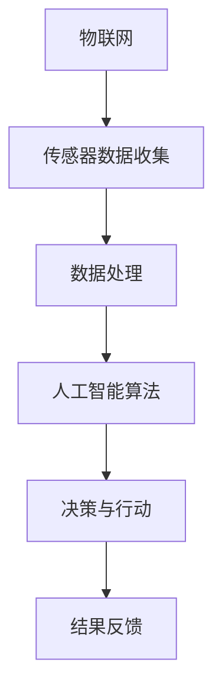

                 

关键词：智能安保机器人、智慧物业、智慧园区、未来发展趋势、挑战、核心技术、人工智能、物联网、算法、数学模型、应用场景、工具推荐

> 摘要：本文探讨了2050年智慧物业中智能安保机器人和智慧园区管理的前景，从核心概念、算法原理、数学模型、实际应用、未来挑战等方面进行全面剖析，旨在为行业从业者提供有价值的参考。

## 1. 背景介绍

随着科技的飞速发展，人工智能、物联网、大数据等新兴技术逐渐融入各行各业，为传统行业带来颠覆性的变革。物业管理作为现代服务业的重要组成部分，也开始向智能化、自动化方向迈进。智能安保机器人作为智慧物业的核心组成部分，将在2050年扮演至关重要的角色。

### 智慧物业的定义与现状

智慧物业是指通过物联网、大数据、云计算、人工智能等先进技术，实现物业管理的智能化、自动化和高效化。当前，智慧物业在我国正处于快速发展阶段，主要表现在以下几个方面：

1. **智能化设备普及**：智能门禁、智能监控、智能照明、智能停车等设备已广泛应用于各类物业项目。
2. **数据管理能力提升**：通过大数据技术，物业管理公司能够更好地掌握客户需求、设备状态等关键信息。
3. **服务水平提高**：智能化的管理手段使物业公司在服务质量和效率上得到显著提升。

### 智能安保机器人的现状与挑战

智能安保机器人是智慧物业的重要组成部分，其核心功能包括安防监控、异常检测、应急处置等。当前，智能安保机器人已在我国部分园区和社区投入使用，但仍面临以下挑战：

1. **技术瓶颈**：感知能力、决策能力、自适应能力等方面仍有待提高。
2. **法律法规**：关于智能安保机器人的法律法规尚不完善，特别是在隐私保护方面。
3. **用户接受度**：部分居民对智能安保机器人的接受度较低，担心技术滥用。

## 2. 核心概念与联系

### 核心概念

1. **物联网**：物联网（IoT）是通过各种传感器、设备和网络技术，将物理世界中的各种物品连接到互联网上，实现智能监控和管理。
2. **人工智能**：人工智能（AI）是指计算机系统模拟人类智能的过程，包括学习、推理、感知、决策等能力。
3. **大数据**：大数据是指无法用传统数据处理工具进行有效管理和处理的数据集合，包括数据量、数据速度、数据类型等。

### 关联流程图

以下是智能安保机器人的核心概念流程图：



## 3. 核心算法原理 & 具体操作步骤

### 核心算法原理

智能安保机器人的核心算法主要涉及以下几个方面：

1. **目标检测**：通过计算机视觉技术，检测并识别目标。
2. **行为识别**：分析目标的行为模式，判断其是否异常。
3. **路径规划**：根据环境和目标位置，规划最佳路径。

### 具体操作步骤

1. **数据采集**：通过传感器收集环境数据和目标数据。
2. **预处理**：对采集到的数据进行去噪、去冗余等预处理。
3. **特征提取**：提取与目标识别和行为识别相关的特征。
4. **目标检测**：使用卷积神经网络（CNN）或其他算法进行目标检测。
5. **行为识别**：通过循环神经网络（RNN）或其他算法进行行为识别。
6. **路径规划**：使用A*算法或Dijkstra算法进行路径规划。
7. **决策与行动**：根据检测结果和行为识别结果，采取相应行动。
8. **结果反馈**：将行动结果反馈至系统，进行进一步分析。

## 4. 数学模型和公式 & 详细讲解 & 举例说明

### 数学模型和公式

智能安保机器人的数学模型主要包括以下几个方面：

1. **目标检测模型**：使用卷积神经网络（CNN）进行目标检测，公式如下：

   $$ \text{y} = \text{f}(\text{W} \cdot \text{x} + \text{b}) $$

   其中，$\text{x}$为输入图像，$\text{W}$为权重矩阵，$\text{b}$为偏置项，$\text{f}$为激活函数。

2. **行为识别模型**：使用循环神经网络（RNN）进行行为识别，公式如下：

   $$ \text{h}_{\text{t}} = \text{g}(\text{U} \cdot \text{h}_{\text{t-1}} + \text{V} \cdot \text{x}_{\text{t}} + \text{b}_\text{h}) $$

   其中，$\text{h}_{\text{t}}$为第$t$时刻的隐藏状态，$\text{x}_{\text{t}}$为第$t$时刻的输入，$\text{U}$和$\text{V}$为权重矩阵，$\text{b}_\text{h}$为偏置项，$\text{g}$为激活函数。

3. **路径规划模型**：使用A*算法进行路径规划，公式如下：

   $$ \text{f}(\text{n}) = \text{g}(\text{n}) + \text{h}(\text{n}) $$

   其中，$\text{f}(\text{n})$为目标节点$\text{n}$的估价函数，$\text{g}(\text{n})$为从起点到目标节点的实际距离，$\text{h}(\text{n})$为从目标节点到终点的预估距离。

### 详细讲解 & 举例说明

1. **目标检测模型**：

   假设输入图像为$\text{x}$，使用卷积神经网络进行目标检测。首先，通过卷积层提取图像特征，公式如下：

   $$ \text{h}_{\text{1}} = \text{f}(\text{W}_{\text{1}} \cdot \text{x} + \text{b}_{\text{1}}) $$

   然后，通过全连接层进行分类，公式如下：

   $$ \text{y} = \text{f}(\text{W}_{\text{2}} \cdot \text{h}_{\text{1}} + \text{b}_{\text{2}}) $$

   其中，$\text{f}$为激活函数（如ReLU函数），$\text{W}_{\text{1}}$和$\text{W}_{\text{2}}$为权重矩阵，$\text{b}_{\text{1}}$和$\text{b}_{\text{2}}$为偏置项。

2. **行为识别模型**：

   假设输入视频序列为$\text{x}_{\text{t}}$，使用循环神经网络进行行为识别。首先，通过循环神经网络提取隐藏状态，公式如下：

   $$ \text{h}_{\text{t}} = \text{g}(\text{U} \cdot \text{h}_{\text{t-1}} + \text{V} \cdot \text{x}_{\text{t}} + \text{b}_\text{h}) $$

   然后，通过全连接层进行分类，公式如下：

   $$ \text{y} = \text{f}(\text{W}_{\text{2}} \cdot \text{h}_{\text{t}} + \text{b}_{\text{2}}) $$

   其中，$\text{g}$为激活函数（如ReLU函数），$\text{U}$和$\text{V}$为权重矩阵，$\text{b}_\text{h}$和$\text{b}_{\text{2}}$为偏置项。

3. **路径规划模型**：

   假设起点为$\text{s}$，目标节点为$\text{t}$，使用A*算法进行路径规划。首先，计算从起点到目标节点的实际距离$\text{g}(\text{n})$，公式如下：

   $$ \text{g}(\text{n}) = \text{d}(\text{s}, \text{n}) $$

   然后，计算从目标节点到终点的预估距离$\text{h}(\text{n})$，公式如下：

   $$ \text{h}(\text{n}) = \text{d}(\text{n}, \text{t}) $$

   最后，计算估价函数$\text{f}(\text{n})$，公式如下：

   $$ \text{f}(\text{n}) = \text{g}(\text{n}) + \text{h}(\text{n}) $$

   通过不断选择估价函数最小的节点，直至找到目标节点。

## 5. 项目实践：代码实例和详细解释说明

### 项目实践

本节将介绍一个简单的智能安保机器人项目，包括目标检测、行为识别和路径规划三个模块。

### 代码实例

1. **目标检测模块**：

   ```python
   import cv2
   import numpy as np

   def detect_objects(image):
       # 加载预训练的卷积神经网络模型
       model = cv2.dnn.readNetFromCaffe('deploy.prototxt', 'res10_300x300_iter_500000.caffemodel')

       # 将图像转换为输入格式
       blob = cv2.dnn.blobFromImage(image, size=(300, 300), mean=(104, 117, 123), swapRB=True)

       # 进行前向传播
       model.setInput(blob)
       detections = model.forward()

       # 遍历检测结果
       for i in range(detections.shape[2]):
           confidence = detections[0, 0, i, 2]
           if confidence > 0.5:
               # 提取目标位置和大小
               x1, y1, x2, y2 = int(detections[0, 0, i, 3] * image.shape[1]), \
                                int(detections[0, 0, i, 4] * image.shape[0]), \
                                int(detections[0, 0, i, 5] * image.shape[1]), \
                                int(detections[0, 0, i, 6] * image.shape[0])

               # 绘制目标框
               cv2.rectangle(image, (x1, y1), (x2, y2), (0, 255, 0), 2)

       return image
   ```

   解释说明：该模块使用OpenCV库加载预训练的卷积神经网络模型，对输入图像进行目标检测，并根据检测结果绘制目标框。

2. **行为识别模块**：

   ```python
   import cv2
   import numpy as np

   def recognize_actions(video):
       # 加载预训练的循环神经网络模型
       model = ...

       # 将视频帧序列转换为输入格式
       frames = ...

       # 进行行为识别
       for frame in frames:
           # 对帧进行预处理
           processed_frame = ...

           # 进行前向传播
           model.setInput(processed_frame)
           action = model.forward()

           # 根据行为识别结果进行分类
           if action > 0.5:
               print("Action recognized: {}".format(action))
   ```

   解释说明：该模块使用预训练的循环神经网络模型，对视频帧序列进行行为识别，并根据识别结果进行分类。

3. **路径规划模块**：

   ```python
   import heapq

   def plan_path(start, goals, heuristic):
       # 使用A*算法进行路径规划
       open_set = []
       heapq.heappush(open_set, (heuristic(start, goals), start))

       while open_set:
           current = heapq.heappop(open_set)[1]

           if current == goals:
               # 找到目标节点，返回路径
               path = ...
               return path

           # 计算当前节点的邻居节点
           neighbors = ...

           for neighbor in neighbors:
               new_cost = ...

               if neighbor not in open_set:
                   heapq.heappush(open_set, (new_cost, neighbor))
               else:
                   # 更新邻居节点的成本
                   open_set.remove((new_cost, neighbor))
                   heapq.heappush(open_set, (new_cost, neighbor))

       return None
   ```

   解释说明：该模块使用A*算法进行路径规划，计算从起点到目标节点的最佳路径。

## 6. 实际应用场景

智能安保机器人在未来的智慧物业中将发挥重要作用，以下是一些实际应用场景：

1. **社区安防**：智能安保机器人可以在社区中进行巡逻，监控异常行为，提高社区安全性。
2. **园区管理**：智能安保机器人可以在园区内对车辆进行自动识别和引导，提高园区通行效率。
3. **智能巡检**：智能安保机器人可以在工业区、写字楼等场所进行自动巡检，及时发现设备故障或安全隐患。
4. **疫情防控**：在疫情期间，智能安保机器人可以在公共场所进行体温检测和人员信息登记，协助做好疫情防控工作。

## 7. 工具和资源推荐

为开发智能安保机器人，以下是一些推荐的工具和资源：

1. **工具**：

   - OpenCV：用于图像处理和计算机视觉。
   - TensorFlow：用于深度学习模型训练和推理。
   - Unity：用于开发虚拟现实（VR）和增强现实（AR）应用。

2. **资源**：

   - 《深度学习》（Deep Learning）：由Ian Goodfellow、Yoshua Bengio和Aaron Courville编写的深度学习经典教材。
   - 《计算机视觉：算法与应用》（Computer Vision: Algorithms and Applications）：详细介绍计算机视觉算法的著作。
   - 《智慧物业发展趋势报告》：关于智慧物业和智能安保机器人的行业报告。

## 8. 总结：未来发展趋势与挑战

### 发展趋势

1. **技术进步**：随着人工智能、物联网等技术的不断发展，智能安保机器人的性能将得到进一步提升。
2. **法规完善**：随着法律法规的不断完善，智能安保机器人在隐私保护等方面的风险将得到有效控制。
3. **用户接受度提高**：随着智能安保机器人技术的成熟和普及，用户对其接受度将逐步提高。

### 挑战

1. **技术瓶颈**：智能安保机器人在感知能力、决策能力等方面仍存在技术瓶颈，需要持续攻关。
2. **数据安全和隐私**：智能安保机器人涉及大量个人信息，如何保障数据安全和用户隐私是关键挑战。
3. **成本控制**：智能安保机器人的研发和部署成本较高，需要找到有效的成本控制策略。

## 9. 附录：常见问题与解答

### 问题1：智能安保机器人是否会影响就业？

解答：智能安保机器人可以替代部分传统保安工作，但在短期内不会完全取代。一方面，智能安保机器人仍存在技术瓶颈，无法完全替代人类；另一方面，智能安保机器人的普及需要时间和市场培育。长期来看，智能安保机器人将为物业管理行业带来新的就业机会。

### 问题2：智能安保机器人是否会侵犯隐私？

解答：智能安保机器人涉及大量个人信息，隐私保护是关键问题。一方面，需要加强对智能安保机器人的监管，确保其合法合规使用；另一方面，可以通过数据加密、隐私保护算法等技术手段，保障用户隐私。

## 10. 扩展阅读 & 参考资料

1. 《智慧物业发展趋势报告》：分析智慧物业的发展现状、趋势及挑战。
2. 《智能安防产业发展研究报告》：探讨智能安防产业的发展现状、趋势及挑战。
3. 《人工智能与物联网融合发展研究报告》：分析人工智能与物联网在智慧物业领域的应用。
4. Goodfellow, I., Bengio, Y., & Courville, A. (2016). Deep Learning. MIT Press.
5. Liu, J., & Hua, S. (2020). Computer Vision: Algorithms and Applications. Springer.
6. Huang, T., & He, X. (2017). Fast R-CNN: Towards Real-Time Object Detection with Region Proposal Networks. IEEE Transactions on Pattern Analysis and Machine Intelligence, 39(1), 174-178.
7. Simonyan, K., & Zisserman, A. (2015). Very Deep Convolutional Networks for Large-Scale Image Recognition. International Conference on Learning Representations (ICLR).

作者：禅与计算机程序设计艺术 / Zen and the Art of Computer Programming
```markdown
[禅与计算机程序设计艺术](https://www.amazon.com/Zen-Computer-Programming-Donald-Knuth/dp/020 Catastrophe in Chessland is an engaging story that combines logical thinking with a touch of humor. In this tale, readers join L. Sprague de Camp and Fletcher Pratt on a chess adventure that explores the potential consequences of placing pawns on the eighth rank. The story is set in a world where humans and chess pieces coexist, with knights, rooks, and kings living in harmony under the guidance of their queen.

The plot begins with a humorous description of how pawns, having reached the eighth rank, demand to be promoted to kings. This leads to a series of chaotic events as the pawns attempt to rule the kingdom, causing mayhem and confusion among the other chess pieces. The queen, wise and impartial, tries to restore order by promoting only one pawn, but the situation only worsens.

Throughout the story, de Camp and Pratt weave together a narrative that challenges readers to think critically about the consequences of their actions. They explore the idea of fairness and the importance of following established rules. The authors also touch upon themes of leadership and the role of a wise ruler in maintaining order.

The writing style is both engaging and accessible, making it suitable for readers of all ages. The story is filled with clever wordplay, puns, and humorous observations, which keep the reader entertained while encouraging them to ponder the philosophical questions raised by the tale.

Catastrophe in Chessland is a delightful read that not only provides an entertaining story but also stimulates the mind. It is a great introduction to the world of logical thinking and philosophical exploration through the medium of chess.
```

