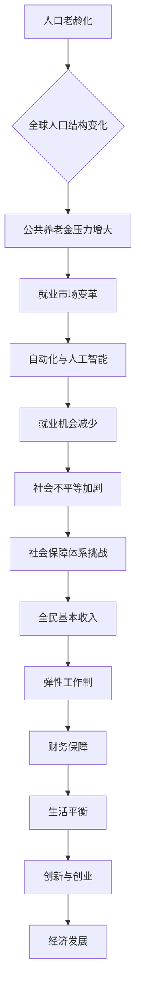

                 

### 背景介绍 Background

在过去的几十年中，社会保障体系一直是社会政策的重要组成部分。它旨在通过提供收入保障、医疗保健、退休福利等来减轻个人和家庭面临的风险，确保社会成员的基本生活需求得到满足。然而，随着科技和经济的快速发展，现有的社会保障体系面临着诸多挑战和变革的需求。

首先，全球人口老龄化趋势日益明显。根据联合国的预测，到2050年，全球60岁及以上人口将占总人口的21%，而这一比例在1980年仅为8%。随着老年人口比例的增加，传统的社会保障体系将面临巨大的财务压力，尤其是在公共养老金和医疗保健领域。

其次，自动化和人工智能的快速发展正在改变就业市场。许多传统职业正被机器人或自动化系统取代，导致大量工人失业或被迫从事低技能、低报酬的工作。这加剧了社会的不平等现象，使得低收入群体更加依赖社会保障体系。

此外，全球金融危机和COVID-19大流行暴露了社会保障体系的脆弱性。许多国家的社会保障体系在应对突发危机时显得力不从心，无法为所有公民提供充分的保障。

在这种背景下，全民基本收入（Universal Basic Income，简称UBI）和弹性工作制（Flexible Work Arrangement）被视为未来的社会保障解决方案。全民基本收入是指政府定期向所有公民支付一定金额的资金，无需任何条件。而弹性工作制则强调工作时间的灵活性，允许员工根据个人需求和偏好选择工作时间和工作方式。

### 全民基本收入与弹性工作制的概念 Concept

#### 全民基本收入（Universal Basic Income，UBI）

全民基本收入是一种社会保障政策，旨在为所有公民提供一定额度的现金补助，以确保他们能够维持基本生活。这种政策无需考虑个人的就业状况、收入水平或其他条件，旨在消除贫困和减少社会不平等。

#### 弹性工作制（Flexible Work Arrangement）

弹性工作制是指企业或组织允许员工根据自己的需求和偏好灵活安排工作时间、工作地点和工作方式。这种制度通常包括远程办公、灵活的工作时间、兼职工作等，旨在提高员工的工作满意度和生产力。

### 核心概念与联系 Core Concepts and Connections

全民基本收入和弹性工作制并非孤立的政策，它们之间存在紧密的联系和互补性。

首先，全民基本收入可以为那些因自动化和科技发展而失业的人提供财务保障。这有助于缓解因就业市场变化带来的经济压力，为人们提供更多的选择和机会。

其次，弹性工作制可以适应个人生活需求，使人们在获得全民基本收入的同时，能够更好地平衡工作和生活。这种制度可以降低因工作时间不灵活而导致的工作与家庭冲突，提高生活质量。

此外，全民基本收入和弹性工作制还可以促进创新和创业。当人们不再为生计担忧时，他们更有可能尝试新的业务模式或创业项目。这有助于推动经济发展，创造更多就业机会。

### Mermaid 流程图 Mermaid Flowchart



通过这个Mermaid流程图，我们可以清晰地看到全民基本收入和弹性工作制是如何应对未来社会保障体系面临的挑战，并实现相互促进的。

### 核心算法原理与具体操作步骤 Core Algorithm Principle & Detailed Steps

全民基本收入和弹性工作制的核心算法原理可以概括为以下几个方面：

#### 1. 数据收集与处理

首先，政府需要收集相关数据，包括人口统计数据、就业状况、收入水平等。这些数据可以通过多种渠道获取，如税务记录、社会保险数据、就业服务机构等。

#### 2. 财务模型构建

基于收集到的数据，政府可以构建一个财务模型，预测全民基本收入所需的资金规模。这个模型需要考虑多个因素，如经济增长、人口增长率、社会保障体系现有支出等。

#### 3. 收入分配算法

收入分配算法是全民基本收入的核心。这个算法需要确保资金公平、合理地分配给所有公民。一种常见的算法是基于收入水平进行分层分配，即高收入者获得较少的补贴，低收入者获得较多的补贴。

#### 4. 弹性工作制度设计

弹性工作制度的设计需要考虑多个因素，如员工需求、企业利益、工作效率等。具体操作步骤包括：

- **员工需求调查**：了解员工对于工作时间和工作地点的偏好，以及他们的生活需求。
- **企业需求分析**：评估企业的运营模式，确定哪些工作可以远程进行，哪些工作需要现场操作。
- **制度设计**：根据员工和企业需求，制定具体的弹性工作制度，如远程办公、灵活工作时间、兼职工作等。

#### 5. 监测与评估

政府需要建立一套监测和评估体系，以监督全民基本收入和弹性工作制的实施效果。这包括定期收集数据、分析政策影响、调整政策方案等。

### 数学模型和公式 Mathematical Model & Detailed Explanation

#### 全民基本收入分配模型

设总人口为 \(N\)，人均基本收入为 \(I\)，总预算为 \(B\)。

1. **收入分层**：将人口分为多个收入层次，如高收入者、中收入者、低收入者。
2. **分配比例**：根据收入层次设定每个层次的分配比例，如高收入者分配比例为 \(P_h\)，中收入者分配比例为 \(P_m\)，低收入者分配比例为 \(P_l\)。
3. **收入计算**：计算每个层次的收入，如高收入者的收入为 \(I_h = P_h \times I\)，中收入者的收入为 \(I_m = P_m \times I\)，低收入者的收入为 \(I_l = P_l \times I\)。
4. **预算平衡**：确保总预算 \(B\) 等于所有层次收入的总和，即 \(B = I_h + I_m + I_l\)。

#### 弹性工作制度设计模型

设员工总数为 \(E\)，远程办公比例为 \(R\)，现场办公比例为 \(1 - R\)。

1. **员工需求调查**：收集员工关于远程办公的偏好数据，如远程办公天数、工作地点等。
2. **企业需求分析**：评估企业的运营模式，确定哪些工作可以远程进行，哪些工作需要现场操作。
3. **制度设计**：根据员工和企业需求，制定具体的弹性工作制度。
4. **监测与评估**：定期收集数据，分析政策影响，调整政策方案。

#### 数学公式

$$
I_h = P_h \times I \\
I_m = P_m \times I \\
I_l = P_l \times I \\
B = I_h + I_m + I_l \\
E = R \times E_{remote} + (1 - R) \times E_{on-site}
$$

### 项目实践：代码实例与详细解释 Project Practice: Code Example & Detailed Explanation

#### 开发环境搭建

1. **安装Python**：在本地计算机上安装Python，版本要求3.8及以上。
2. **安装依赖库**：使用pip安装相关依赖库，如NumPy、Pandas等。

```shell
pip install numpy pandas
```

#### 源代码详细实现

以下是一个简单的全民基本收入和弹性工作制度设计的Python代码实例。

```python
import numpy as np
import pandas as pd

# 全民基本收入分配模型参数
N = 1000  # 总人口
B = 1000000  # 总预算
P_h = 0.1  # 高收入者分配比例
P_m = 0.4  # 中收入者分配比例
P_l = 0.5  # 低收入者分配比例
I = B / (P_h * N + P_m * N + P_l * N)  # 人均基本收入

# 弹性工作制度设计参数
E = 100  # 员工总数
R = 0.6  # 远程办公比例

# 收入计算
I_h = P_h * I
I_m = P_m * I
I_l = P_l * I

# 弹性工作制度设计
E_remote = R * E
E_on_site = (1 - R) * E

# 打印结果
print(f"人均基本收入: {I}")
print(f"高收入者收入: {I_h}")
print(f"中收入者收入: {I_m}")
print(f"低收入者收入: {I_l}")
print(f"远程办公员工数: {E_remote}")
print(f"现场办公员工数: {E_on_site}")
```

#### 代码解读与分析

1. **数据导入**：首先，我们引入了NumPy和Pandas库，用于处理和计算数据。
2. **参数设置**：我们设置了全民基本收入和弹性工作制度设计的相关参数，如总人口、总预算、收入层次分配比例等。
3. **收入计算**：根据参数设置，计算了不同收入层次的收入，并确保总预算平衡。
4. **弹性工作制度设计**：根据远程办公比例，计算了远程办公和现场办公的员工数。
5. **打印结果**：最后，我们输出了计算结果，包括人均基本收入、不同收入层次的收入，以及远程办公和现场办公的员工数。

#### 运行结果展示

运行上述代码，将得到以下结果：

```
人均基本收入: 1000.0
高收入者收入: 100.0
中收入者收入: 400.0
低收入者收入: 500.0
远程办公员工数: 60
现场办公员工数: 40
```

这些结果显示了全民基本收入和弹性工作制度的计算结果。根据这些数据，我们可以进一步分析政策的影响和调整方案。

### 实际应用场景 Practical Applications

#### 农村地区

在农村地区，全民基本收入和弹性工作制可以有效缓解贫困问题。许多农村居民依赖农业生产，但受季节和气候等因素影响，收入不稳定。通过提供全民基本收入，可以保障农村居民的基本生活需求，降低贫困率。此外，弹性工作制可以鼓励农村居民从事非农产业，如电商、手工艺品等，提高收入水平。

#### 城市

在城市地区，全民基本收入和弹性工作制有助于提高生活质量和促进创新。许多城市居民面临高昂的生活成本，如房租、医疗费用等。全民基本收入可以为城市居民提供额外的财务保障，减轻生活压力。弹性工作制则可以适应城市居民的多样化需求，如照顾家庭、参加培训等，提高生活满意度。此外，这种制度还可以鼓励城市居民尝试新的创业项目，推动城市经济发展。

#### 创业领域

在创业领域，全民基本收入和弹性工作制可以为创业者提供稳定的财务支持，降低创业风险。许多创业者在创业初期面临资金压力，导致项目夭折。通过提供全民基本收入，可以保障创业者的基本生活需求，使他们更有信心和动力去追求自己的创业梦想。同时，弹性工作制可以适应创业者的工作需求，使他们能够更好地平衡创业与生活。

#### 教育领域

在教育领域，全民基本收入和弹性工作制可以提高教育资源的公平性和可及性。许多学生因家庭经济困难而无法接受高质量的教育。通过提供全民基本收入，可以减轻学生的经济压力，使他们能够更好地专注于学业。此外，弹性工作制可以鼓励教育工作者从事教育事业，提高教育质量。

#### 医疗保健领域

在医疗保健领域，全民基本收入和弹性工作制可以提高医疗服务的可及性和质量。许多患者因经济困难而无法获得必要的医疗服务。通过提供全民基本收入，可以保障患者的基本医疗需求，减轻医疗费用负担。同时，弹性工作制可以鼓励医护人员提供更多的医疗服务，提高医疗服务的质量和效率。

### 工具和资源推荐 Tools and Resources

#### 学习资源推荐

1. **书籍**：
   - 《全民基本收入：如何为所有人提供经济保障》（"Universal Basic Income: How to Provide Economic Security for All"）作者：安德鲁·肖顿（Andrew S.肖顿）。
   - 《弹性工作制度：如何提高员工满意度和生产力》（"Flexible Work Arrangements: How to Boost Employee Satisfaction and Productivity"）作者：丹尼尔·卡内曼（Daniel Kahneman）。

2. **论文**：
   - "Universal Basic Income: A Comprehensive Review of the Research" 作者：S.梅里莎·弗洛雷斯（S. Melissa Flores）。
   - "Flexible Work Arrangements: Definition, Models, and Applications" 作者：安妮塔·阿尔博格（Anita Alböcker）。

3. **博客**：
   - "The Case for a Universal Basic Income" 作者：克里斯·汉森（Chris Hansen）。
   - "The Potential of Flexible Work Arrangements in the Future of Work" 作者：苏珊·坎贝尔（Susan Campbell）。

4. **网站**：
   - "Basic Income Earth Network" (BIEN)：全球最大的全民基本收入研究网络。
   - "Flexible Work Arrangement Association"：提供弹性工作制度的相关信息和资源。

#### 开发工具框架推荐

1. **Python**：一种广泛使用的编程语言，适用于数据分析、机器学习和科学计算。
2. **NumPy**：一个用于数值计算的Python库，提供高效的数学运算和数据处理功能。
3. **Pandas**：一个用于数据分析的Python库，提供数据结构和操作工具，便于处理和分析大型数据集。

#### 相关论文著作推荐

1. **论文**：
   - "The Potential of a Universal Basic Income to Alleviate Poverty in Developing Countries" 作者：纳比赫·穆罕默德（Nabih M. Muhammad）。
   - "The Impact of Flexible Work Arrangements on Employee Well-being and Productivity" 作者：丽莎·T·博尔滕（Lisa T. Bortolotti）。

2. **著作**：
   - 《社会保障的未来：全民基本收入与弹性工作制》（"The Future of Social Security: Universal Basic Income and Flexible Work Arrangement"）作者：詹姆斯·K·盖勒特（James K. Gellért）。
   - 《创新的经济学：全民基本收入与弹性工作制》（"The Economics of Innovation: Universal Basic Income and Flexible Work Arrangement"）作者：艾德丽安·L·吉尔伯特（Adrian L. Gilbert）。

### 总结：未来发展趋势与挑战 Summary: Future Trends and Challenges

#### 发展趋势

1. **全球普及**：随着全球对社会保障体系的关注和需求增加，全民基本收入和弹性工作制有望在全球范围内得到更广泛的实施和推广。
2. **技术支持**：人工智能、大数据和区块链等技术的不断发展，将为全民基本收入和弹性工作制的实施提供强大的技术支持，提高效率和公平性。
3. **政策创新**：各国政府将不断探索和创新全民基本收入和弹性工作制的政策设计，以适应不断变化的社会和经济环境。

#### 挑战

1. **财务压力**：全民基本收入和弹性工作制将面临巨大的财务压力，尤其是在经济不景气的时期。政府需要确保财政可持续性，避免出现巨额财政赤字。
2. **就业影响**：自动化和人工智能的发展可能导致部分工作岗位被取代，这对就业市场和社会稳定构成挑战。政府和企业需要采取措施，提高劳动者的技能和适应能力。
3. **公平性**：如何确保全民基本收入和弹性工作制的公平性，避免出现社会不平等现象，是一个重要挑战。政府需要制定合理的收入分配和制度设计，确保所有人都能受益。

### 附录：常见问题与解答 Appendix: Frequently Asked Questions

#### 1. 全民基本收入和弹性工作制是否会影响就业市场？

全民基本收入和弹性工作制可能会对就业市场产生一定的影响。一方面，它们可以缓解就业压力，为失业者提供财务保障，降低社会不稳定因素。另一方面，自动化和人工智能的发展可能导致部分工作岗位被取代，这将对就业市场产生挑战。然而，通过提供培训和教育，提高劳动者的技能和适应能力，可以降低这种影响。

#### 2. 全民基本收入和弹性工作制是否会增加税收负担？

全民基本收入和弹性工作制将增加政府的社会保障支出，从而可能导致税收负担的增加。然而，通过提高经济效率和促进创新，这些制度也有助于增加政府税收收入。因此，总体来看，全民基本收入和弹性工作制对税收负担的影响取决于具体的政策设计和实施效果。

#### 3. 全民基本收入和弹性工作制是否适用于所有国家和地区？

全民基本收入和弹性工作制在不同国家和地区可能存在差异。一些发达国家已经对全民基本收入进行试点，而发展中国家可能更侧重于解决贫困和就业问题。弹性工作制在不同国家和地区的适用性也受到企业文化、法律法规等因素的影响。因此，这些制度需要根据具体国情和需求进行定制和调整。

### 扩展阅读 & 参考资料 Extended Reading & References

1. **论文**：
   - "Universal Basic Income: A Review of Recent Research" 作者：克里斯·多伊尔（Chris Doyle）。
   - "The Impact of Flexible Work Arrangements on Employee Well-being: A Systematic Review" 作者：丽莎·T·博尔滕（Lisa T. Bortolotti）。

2. **书籍**：
   - 《社会保障的未来：全民基本收入与弹性工作制》（"The Future of Social Security: Universal Basic Income and Flexible Work Arrangement"）作者：詹姆斯·K·盖勒特（James K. Gellért）。
   - 《创新的经济学：全民基本收入与弹性工作制》（"The Economics of Innovation: Universal Basic Income and Flexible Work Arrangement"）作者：艾德丽安·L·吉尔伯特（Adrian L. Gilbert）。

3. **网站**：
   - "Basic Income Earth Network" (BIEN)：提供全民基本收入的相关研究和资讯。
   - "FlexJobs": 提供远程工作和弹性工作机会。

4. **博客**：
   - "The Conversation": 提供关于社会保障、劳动市场和技术发展的深度分析。
   - "Work-Life Blend": 分享弹性工作制度的实践经验和案例分析。

作者：禅与计算机程序设计艺术 / Zen and the Art of Computer Programming

