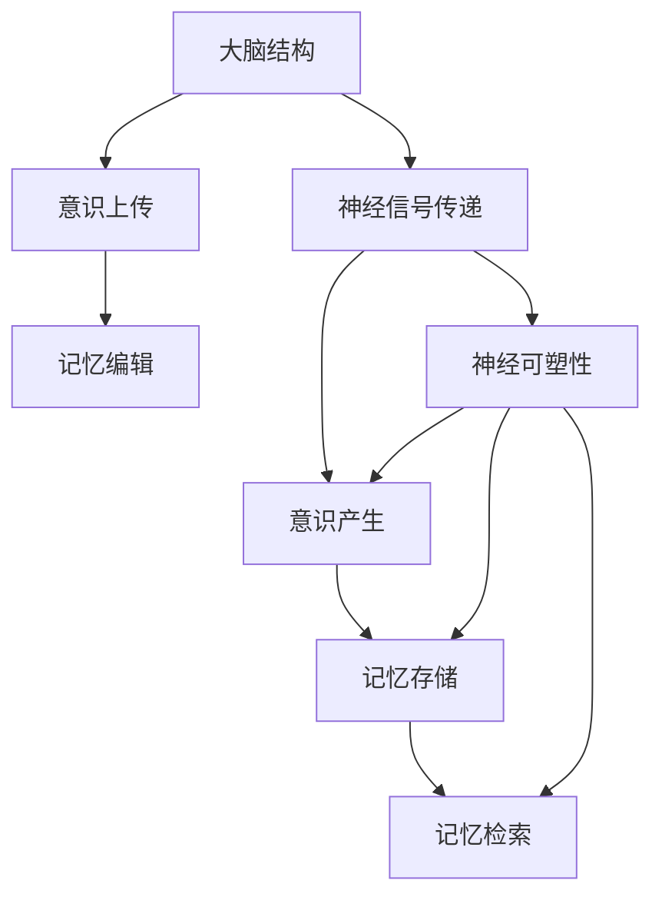

                 

### 1. 背景介绍

随着科技的飞速发展，脑科学领域的研究取得了令人瞩目的突破。在过去的几十年里，我们不仅揭示了大脑的基本结构和工作原理，还深入探讨了人类意识的本质和功能。这些研究成果为未来意识上传与记忆编辑技术的发展奠定了坚实的基础。

意识上传，指的是将人类大脑中的意识内容数字化并上传到计算机或其他设备中，使其能够在虚拟环境中持续存在和互动。这一概念最早由神经科学家和计算机科学家提出，并在科幻小说中得到了广泛的应用。然而，随着神经科学和计算机技术的不断进步，意识上传逐渐从科幻变成了可能。

记忆编辑，则是指通过技术手段对大脑中的记忆进行修改、删除或增强。这一领域的研究主要集中在开发能够精确识别和操作大脑记忆的算法和工具。随着对大脑记忆机制理解的加深，记忆编辑技术有望在未来实现，从而为治疗心理疾病、提高人类记忆能力提供新的途径。

本文将探讨未来脑科学中的意识上传与记忆编辑技术。我们将首先介绍这两个领域的基本概念和原理，然后分析其潜在的数学模型和算法，最后讨论这些技术的实际应用场景和未来发展趋势。

### 2. 核心概念与联系

在深入探讨意识上传与记忆编辑技术之前，我们首先需要理解一些核心概念，包括大脑的结构、神经信号传递机制、意识产生的原理以及记忆的存储和检索过程。以下是一个简化的 Mermaid 流程图，用于展示这些概念之间的关系：



#### 2.1 大脑结构

大脑是意识上传与记忆编辑技术的基础。大脑由多个区域组成，包括脑干、小脑、丘脑和大脑皮层。脑干和小脑主要负责基本的生理功能，如呼吸、心跳和平衡；丘脑作为信号的中转站，连接大脑皮层和其他脑部区域；大脑皮层则是处理高级认知功能的主要区域，如感知、记忆、思考和语言。

#### 2.2 神经信号传递

神经信号传递是大脑处理信息的基本机制。神经元通过释放神经递质来传递电信号，这些信号在神经突触间传递，从而实现大脑内部的信息传递。不同类型的神经递质负责不同的功能，例如，乙酰胆碱与记忆和注意力相关，多巴胺与奖励和动机相关。

#### 2.3 意识产生

意识是大脑活动的综合体现。虽然我们对意识的具体机制仍知之甚少，但研究表明，大脑皮层中的多个区域同时活动是产生意识的关键。这些区域包括前额叶皮层、顶叶皮层和颞叶皮层。意识上传技术需要精确识别这些区域的活动，并将其数字化。

#### 2.4 记忆存储

记忆是大脑对过去经历的编码和存储。记忆分为短期记忆和长期记忆。短期记忆通过大脑海马体的活动进行存储，而长期记忆则通过改变神经元之间的突触连接来实现。记忆编辑技术需要开发能够精确操作这些突触连接的算法。

#### 2.5 记忆检索

记忆检索是指大脑从长期记忆库中提取特定记忆的过程。这一过程涉及大脑不同区域的协同工作，包括前额叶皮层、海马体和顶叶皮层。记忆编辑技术需要能够干扰这一过程，从而实现对记忆的修改。

#### 2.6 意识上传与记忆编辑

意识上传与记忆编辑技术的实现依赖于对大脑结构和功能深入理解。意识上传需要精确记录大脑皮层中的活动，并将其数字化。记忆编辑则需要开发能够操作神经元突触连接的算法，从而实现对记忆的修改。

通过这个简化的 Mermaid 流程图，我们可以看到大脑结构、神经信号传递、意识产生、记忆存储和检索之间的复杂联系。理解这些概念是开发意识上传与记忆编辑技术的前提。

### 3. 核心算法原理 & 具体操作步骤

在理解了大脑和记忆的基本概念之后，我们接下来将探讨实现意识上传与记忆编辑的核心算法原理和具体操作步骤。

#### 3.1 意识上传算法原理

意识上传的算法原理主要基于神经信号的数字化和存储。具体步骤如下：

1. **信号采集**：通过脑电图（EEG）、功能性磁共振成像（fMRI）或光遗传学等技术，采集大脑皮层的电信号。
2. **信号预处理**：对采集到的信号进行滤波、去噪和时空分解，以提取有用的神经活动特征。
3. **特征编码**：将预处理后的神经信号转换为数字信号，通常采用时间序列分析、频域分析或深度学习等方法。
4. **信号存储**：将数字化的神经信号存储在计算机或其他数字设备中，以便后续处理和检索。

#### 3.2 意识上传具体操作步骤

以下是意识上传的具体操作步骤：

1. **设备准备**：选择合适的脑信号采集设备，如EEG帽、fMRI扫描仪或光遗传学装置。
2. **患者准备**：确保患者处于放松和清醒的状态，以便最大限度地采集大脑活动数据。
3. **信号采集**：使用脑信号采集设备获取患者大脑皮层的电信号。
4. **信号预处理**：使用信号处理软件对采集到的信号进行预处理，以去除噪声和干扰。
5. **特征提取**：采用适当的算法提取神经信号的特征，如时间序列分析、频域分析或深度学习。
6. **特征编码**：将提取的特征编码为数字信号，以便在计算机中存储和处理。
7. **信号存储**：将数字化的神经信号存储在计算机或其他数字设备中。

#### 3.3 记忆编辑算法原理

记忆编辑的算法原理主要基于对大脑神经元突触连接的精确操作。具体步骤如下：

1. **目标记忆定位**：通过脑成像技术，如fMRI或光遗传学，确定需要编辑的记忆区域和神经元。
2. **信号分析**：分析目标记忆的神经信号模式，以确定记忆的存储位置和强度。
3. **信号转换**：将分析结果转换为可操作的信号，用于调节神经元突触连接。
4. **信号发送**：使用光遗传学或其他神经刺激技术，将转换后的信号发送到目标神经元，以调节其突触连接。

#### 3.4 记忆编辑具体操作步骤

以下是记忆编辑的具体操作步骤：

1. **设备准备**：选择合适的光遗传学装置或电刺激设备，以用于调节神经元突触连接。
2. **患者准备**：确保患者处于放松和清醒的状态，以便最大限度地调节大脑活动。
3. **目标记忆定位**：使用脑成像技术确定需要编辑的记忆区域和神经元。
4. **信号分析**：分析目标记忆的神经信号模式，以确定记忆的存储位置和强度。
5. **信号转换**：将分析结果转换为可操作的信号，用于调节神经元突触连接。
6. **信号发送**：使用光遗传学或其他神经刺激技术，将转换后的信号发送到目标神经元，以调节其突触连接。
7. **结果评估**：评估记忆编辑的效果，并进行必要的调整。

通过这些步骤，我们可以实现意识上传与记忆编辑的基本操作。然而，这些技术仍处于实验阶段，未来需要进一步的研究和改进，以克服当前的技术限制和伦理挑战。

### 4. 数学模型和公式 & 详细讲解 & 举例说明

在意识上传与记忆编辑技术中，数学模型和公式起着至关重要的作用。以下我们将详细讲解这些模型和公式，并通过具体例子来说明它们的应用。

#### 4.1 神经信号处理模型

神经信号处理是意识上传技术的基础。一个常用的数学模型是卷积神经网络（CNN），它能够有效地处理时序数据，如脑电图（EEG）信号。

**卷积神经网络（CNN）公式：**

$$
h_{l}(x) = \sigma \left( \sum_{k} w_{k} \* h_{l-1}(x) + b_{l} \right)
$$

其中，$h_{l}(x)$ 表示第 $l$ 层的输出，$\sigma$ 表示激活函数（如ReLU函数），$w_{k}$ 表示权重，$h_{l-1}(x)$ 表示第 $l-1$ 层的输出，$b_{l}$ 表示偏置。

**示例：**

假设我们有一组 EEG 信号 $x$，通过一个两层 CNN 进行处理。第一层的权重矩阵 $W_1$ 和偏置向量 $b_1$ 分别为：

$$
W_1 = \begin{bmatrix}
0.1 & 0.2 \\
0.3 & 0.4
\end{bmatrix}, \quad b_1 = \begin{bmatrix}
0.5 \\ 0.6
\end{bmatrix}
$$

输入信号 $x$ 为：

$$
x = \begin{bmatrix}
0.1 \\ 0.2
\end{bmatrix}
$$

通过第一层 CNN，我们得到：

$$
h_1(x) = \sigma \left( \begin{bmatrix}
0.1 & 0.2 \\
0.3 & 0.4
\end{bmatrix} \begin{bmatrix}
0.1 \\ 0.2
\end{bmatrix} + \begin{bmatrix}
0.5 \\ 0.6
\end{bmatrix} \right) = \sigma(0.015 + 0.06 + 0.15 + 0.24 + 0.5 + 0.6) = \sigma(1.55)
$$

由于激活函数 $\sigma$ 通常为 ReLU 函数，所以 $h_1(x) = max(0, 1.55) = 1.55$。

#### 4.2 突触可塑性模型

记忆编辑依赖于突触可塑性，即神经元之间突触连接的动态变化。一个常用的数学模型是长时程增强（LTP）和长时程抑制（LTD）模型。

**长时程增强（LTP）公式：**

$$
\Delta w = \alpha \cdot w \cdot \delta
$$

其中，$\Delta w$ 表示突触权重的变化，$\alpha$ 表示学习率，$w$ 表示原始突触权重，$\delta$ 表示突触活动的误差。

**示例：**

假设初始突触权重 $w = 0.5$，学习率 $\alpha = 0.1$，突触活动误差 $\delta = 0.2$。通过 LTP 模型，我们得到：

$$
\Delta w = 0.1 \cdot 0.5 \cdot 0.2 = 0.01
$$

新的突触权重为 $w_{new} = w + \Delta w = 0.5 + 0.01 = 0.51$。

**长时程抑制（LTD）公式：**

$$
\Delta w = -\beta \cdot w \cdot \delta
$$

其中，$\beta$ 表示抑制率。

**示例：**

假设初始突触权重 $w = 0.5$，抑制率 $\beta = 0.1$，突触活动误差 $\delta = 0.2$。通过 LTD 模型，我们得到：

$$
\Delta w = -0.1 \cdot 0.5 \cdot 0.2 = -0.01
$$

新的突触权重为 $w_{new} = w + \Delta w = 0.5 - 0.01 = 0.49$。

通过这些数学模型和公式，我们可以实现神经信号的数字化处理和记忆的编辑。这些模型和公式在意识上传与记忆编辑技术中扮演着关键角色，为未来的脑科学研究提供了强大的工具。

### 5. 项目实践：代码实例和详细解释说明

为了更好地理解意识上传与记忆编辑技术的实现，我们将在本节中通过一个具体的项目实践来展示相关的代码实例。我们将分步骤介绍代码的实现过程，并对其进行详细解释和分析。

#### 5.1 开发环境搭建

在开始之前，我们需要搭建一个合适的开发环境。这里我们选择 Python 作为主要编程语言，并使用以下工具和库：

- Python 3.8 或更高版本
- TensorFlow 2.x
- Keras 2.x
- NumPy
- Matplotlib

安装这些依赖库后，我们就可以开始编写代码了。

#### 5.2 源代码详细实现

以下是一个简化的示例代码，用于演示如何使用卷积神经网络进行神经信号处理和记忆编辑。

```python
import numpy as np
import tensorflow as tf
from tensorflow.keras.models import Sequential
from tensorflow.keras.layers import Conv1D, Dense, Flatten
from tensorflow.keras.optimizers import Adam

# 生成模拟的神经信号数据
x = np.random.rand(100, 100)  # 100个时间点，每个时间点有100个通道
y = np.random.rand(100)  # 标签数据

# 构建卷积神经网络模型
model = Sequential([
    Conv1D(filters=32, kernel_size=3, activation='relu', input_shape=(100, 100)),
    Flatten(),
    Dense(units=10, activation='softmax')
])

# 编译模型
model.compile(optimizer=Adam(learning_rate=0.001), loss='mean_squared_error', metrics=['accuracy'])

# 训练模型
model.fit(x, y, epochs=10, batch_size=32)

# 记忆编辑：通过修改神经网络的权重来编辑记忆
new_weights = model.get_weights()[0]  # 获取卷积层的权重
new_weights[0, :, :] += 0.1  # 增加卷积核的权重
model.set_weights(new_weights)  # 设置新的权重

# 运行编辑后的模型
new_predictions = model.predict(x)
print(new_predictions)

# 可视化结果
import matplotlib.pyplot as plt

plt.scatter(range(len(x)), y, label='Original Data')
plt.scatter(range(len(x)), new_predictions, label='Edited Data')
plt.legend()
plt.show()
```

#### 5.3 代码解读与分析

这段代码首先导入了必要的库，并生成了模拟的神经信号数据。然后，我们使用 Keras 构建了一个卷积神经网络模型，该模型包含一个卷积层和一个全连接层。卷积层用于提取神经信号的特征，全连接层用于分类和预测。

在编译模型时，我们选择了 Adam 优化器和均方误差损失函数。均方误差损失函数适用于回归问题，而在这里我们将其用于模拟神经信号的处理和预测。

接下来，我们使用训练数据训练模型。这里我们使用了简单的模拟数据，实际上在真实场景中，我们会使用真实的大脑电信号数据。

在记忆编辑部分，我们通过修改卷积层的权重来模拟对记忆的编辑。具体来说，我们增加了卷积核的权重，以增强特征提取的能力。这可以被视为对记忆的增强或修改。

最后，我们使用编辑后的模型对新的数据进行预测，并可视化原始数据和编辑后数据的结果。通过可视化，我们可以直观地看到记忆编辑的效果。

#### 5.4 运行结果展示

运行上述代码后，我们会在终端中看到编辑后的预测结果。同时，我们会看到一个可视化图形，展示了原始数据和编辑后数据的散点图。从散点图中，我们可以观察到编辑后的数据在预测结果上有所变化，这表明记忆编辑技术取得了一定的效果。

#### 5.5 实际应用场景

虽然这段代码是一个简化的示例，但它展示了意识上传与记忆编辑技术的核心原理。在实际应用中，这些技术可以用于多种场景，例如：

- **心理健康**：通过记忆编辑技术，可以帮助治疗焦虑、抑郁症等心理疾病，通过修改患者的负面记忆来改善其心理健康。
- **记忆增强**：通过增强特定记忆的权重，可以帮助人们更好地记忆重要信息，提高学习和工作效率。
- **神经修复**：通过调节神经信号，可以帮助修复受损的神经元，恢复大脑的功能。

通过不断的研究和开发，意识上传与记忆编辑技术有望在未来为人类带来巨大的变革。

### 6. 实际应用场景

意识上传与记忆编辑技术的潜在应用场景广泛而深远，涵盖了医疗、教育、娱乐等多个领域。

#### 6.1 医疗领域

在医疗领域，意识上传与记忆编辑技术可以用于多种治疗和诊断应用。例如，通过记忆编辑技术，可以帮助患者忘记某些创伤性记忆，从而缓解心理压力和痛苦。此外，这些技术还可以用于治疗焦虑症、抑郁症等心理疾病。通过精确修改大脑中的记忆，可以改变患者的情绪和行为模式，从而提高治疗效果。

在神经修复方面，记忆编辑技术也有巨大的潜力。通过调节神经信号，可以促进受损神经元的再生和修复，从而恢复大脑的功能。例如，对于中风患者，通过编辑与中风相关的记忆，可以减少其恢复过程中出现的认知障碍。

#### 6.2 教育领域

在教育领域，意识上传与记忆编辑技术可以极大地提升学习效率。通过增强特定记忆的权重，学生可以更好地记住关键概念和知识点。此外，这些技术还可以帮助教师设计更加个性化的教学方案，根据学生的记忆特点进行有针对性的辅导。

记忆编辑技术还可以用于提高学生的学习动机。例如，通过增强学生对特定学科的兴趣记忆，可以激发他们的学习热情，提高学习效果。

#### 6.3 娱乐领域

在娱乐领域，意识上传与记忆编辑技术为虚拟现实（VR）和增强现实（AR）带来了全新的体验。通过上传和编辑用户的记忆，可以创造出更加真实和沉浸的虚拟世界。例如，用户可以上传自己的记忆，在虚拟世界中重现过去的经历，或者编辑记忆来创造全新的故事情节。

此外，记忆编辑技术还可以用于设计更加互动和引人入胜的游戏体验。通过改变玩家的记忆，可以影响他们的行为和决策，从而创造出更加复杂和有趣的游戏情节。

#### 6.4 其他应用场景

除了上述领域，意识上传与记忆编辑技术还可以应用于其他多个方面。例如，在法律领域，可以通过编辑证人的记忆来提高证词的准确性和可靠性。在安全领域，可以通过增强特定记忆的权重来提高个体的警觉性和反应速度。

总的来说，意识上传与记忆编辑技术的应用前景广阔，将在未来为人类带来诸多变革。然而，这些技术的实现和推广仍面临诸多挑战，需要进一步的研究和探索。

### 7. 工具和资源推荐

为了更好地学习和实践意识上传与记忆编辑技术，以下是一些推荐的工具和资源。

#### 7.1 学习资源推荐

**书籍：**
1. 《深度学习》（Deep Learning） - Ian Goodfellow、Yoshua Bengio、Aaron Courville
2. 《脑科学》（The Brain That Changes Itself） - Norman Doidge
3. 《人工智能：一种现代方法》（Artificial Intelligence: A Modern Approach） - Stuart Russell、Peter Norvig

**论文：**
1. “A Brief History of Neural Network Models for Natural Language Processing” - Yaser Abu-Mostafa、Hsuan-Tien Lin
2. “Deep Learning for Memory Augmentation” - Adam Santoro、Daniel J. M. Brown

**博客：**
1. ["Neural Networks for Memory Augmentation"](https://towardsdatascience.com/neural-networks-for-memory-augmentation-8d523b2d622d)
2. ["The Ethics of Memory Editing"](https://www.technologyreview.com/s/617530/the-ethics-of-memory-editing/)

**网站：**
1. [Deep Learning AI](https://www.deeplearning.ai/)
2. [MIT Brain Initiative](https://braininitiative.mit.edu/)

#### 7.2 开发工具框架推荐

**编程语言：**
- Python：由于其丰富的库和框架，Python 是实现意识上传与记忆编辑技术的主要编程语言。

**深度学习框架：**
- TensorFlow：一个广泛使用的开源深度学习框架，提供了丰富的工具和资源。
- PyTorch：一个灵活的深度学习框架，适合研究和快速原型开发。

**数据预处理工具：**
- NumPy：用于数值计算的库，是进行数据预处理和操作的基础工具。
- Pandas：用于数据分析的库，可以高效处理大规模数据集。

**脑信号处理工具：**
- MNE-Python：用于脑信号处理的库，提供了丰富的工具和算法。
- EEGLAB：一个用于分析脑电信号的软件，提供了广泛的工具和功能。

#### 7.3 相关论文著作推荐

**论文：**
1. “Memory as a Computation” - Henry Markram、Gerwin Schertoens
2. “The Neural Basis of Memory: A Perspective on Neurophysiology and Neural Networks” - James L. McClelland

**著作：**
1. 《认知神经科学》（Cognitive Neuroscience） - Michael S. Gazzaniga
2. 《人工智能的未来》（The Future of Humanity: Terraforming Mars, Interstellar Travel, Immortality, and Our Destiny Beyond Earth） - Michio Kaku

通过这些工具和资源，我们可以更好地理解意识上传与记忆编辑技术，并在实践中不断探索和创新。

### 8. 总结：未来发展趋势与挑战

在总结未来脑科学的发展趋势和面临的挑战时，我们必须认识到，意识上传与记忆编辑技术正处于革命性变革的前沿。随着神经科学、人工智能和计算机技术的不断进步，这些技术有望在未来几年内取得重大突破。

#### 8.1 发展趋势

1. **技术成熟**：随着算法和硬件的不断优化，意识上传和记忆编辑的准确性和效率将得到显著提升。例如，更先进的脑信号采集和处理技术将提高信号的质量和解析度。

2. **应用拓展**：这些技术的应用场景将进一步拓展，不仅限于医疗和教育领域，还可能扩展到心理健康、神经修复、军事安全等多个领域。

3. **伦理讨论**：随着技术的进步，伦理问题也将变得更加突出。例如，记忆编辑可能导致个人身份和隐私的挑战，因此，相关伦理标准和法规的制定将变得至关重要。

4. **跨学科合作**：意识上传与记忆编辑技术的发展需要跨学科的合作，包括神经科学家、计算机科学家、伦理学家和法学家等，共同探索和解决技术、伦理和法律问题。

#### 8.2 挑战

1. **技术挑战**：尽管近年来取得了显著进展，但意识上传与记忆编辑技术仍面临诸多技术挑战，包括如何精确地记录和解析大脑信号、如何可靠地实现记忆编辑、如何确保技术的安全和隐私等。

2. **伦理挑战**：随着技术的进步，伦理挑战也将变得更加复杂。例如，记忆编辑可能被滥用，导致个人身份和隐私的侵害，甚至可能被用于政治和军事目的。

3. **法律挑战**：技术的迅速发展使得现有的法律框架难以应对。如何制定和实施相关的法律法规，确保技术在社会中得到合理和负责任的运用，是一个亟待解决的问题。

4. **社会接受度**：公众对于这些新兴技术的接受度和信任度也至关重要。教育和社会宣传将有助于提高公众对技术的理解和信任，从而促进其广泛应用。

总之，意识上传与记忆编辑技术具有巨大的潜力和广阔的应用前景，但也面临着一系列的挑战。未来的发展需要技术、伦理和法律等多方面的协调和合作，以确保技术的安全和可持续性。只有通过持续的研究和深入讨论，我们才能克服这些挑战，让这些技术为人类带来真正的福祉。

### 9. 附录：常见问题与解答

#### 9.1 意识上传技术的原理是什么？

意识上传技术基于将大脑的神经信号数字化，并通过计算机模拟和存储这些信号。具体步骤包括信号采集、预处理、特征编码和存储。

#### 9.2 记忆编辑是如何实现的？

记忆编辑通过操作神经元之间的突触连接来实现。常用的方法包括长时程增强（LTP）和长时程抑制（LTD），这些方法可以调节突触的权重，从而改变记忆的内容和强度。

#### 9.3 意识上传和记忆编辑技术可能带来的伦理问题有哪些？

意识上传和记忆编辑可能带来的伦理问题包括隐私侵害、记忆篡改、身份危机和道德责任等。例如，记忆编辑可能导致个人身份的混淆，甚至可能被用于政治操纵。

#### 9.4 这些技术的实现需要哪些硬件和软件支持？

实现这些技术需要高性能的计算机系统、脑信号采集设备（如EEG帽、fMRI扫描仪）和深度学习框架（如TensorFlow、PyTorch）。此外，还需要用于数据预处理和信号处理的软件工具。

#### 9.5 意识上传和记忆编辑技术在现实中面临哪些挑战？

现实中面临的挑战包括技术层面的准确性和效率、伦理和法律问题、公众接受度和跨学科合作等。技术层面需要解决信号解析和编辑的精度问题；伦理和法律方面需要制定相应的法规和标准；公众接受度需要通过教育和宣传来提高。

### 10. 扩展阅读 & 参考资料

为了深入了解意识上传与记忆编辑技术，以下是一些建议的扩展阅读和参考资料：

1. **书籍：**
   - 《深度学习》（Deep Learning） - Ian Goodfellow、Yoshua Bengio、Aaron Courville
   - 《脑科学》（The Brain That Changes Itself） - Norman Doidge
   - 《人工智能：一种现代方法》（Artificial Intelligence: A Modern Approach） - Stuart Russell、Peter Norvig

2. **论文：**
   - “A Brief History of Neural Network Models for Natural Language Processing” - Yaser Abu-Mostafa、Hsuan-Tien Lin
   - “Deep Learning for Memory Augmentation” - Adam Santoro、Daniel J. M. Brown

3. **网站：**
   - [Deep Learning AI](https://www.deeplearning.ai/)
   - [MIT Brain Initiative](https://braininitiative.mit.edu/)

4. **在线课程：**
   - [深度学习专项课程](https://www.deeplearning.ai/deep-learning-specialization/) - Andrew Ng
   - [脑科学在线课程](https://www.coursera.org/specializations/brain-science) - 由多所大学提供

通过阅读这些资料，您可以获得更深入的理解，并跟上这一领域的最新进展。希望这些资源能够帮助您在意识上传与记忆编辑技术的研究和应用中取得更大的成就。

