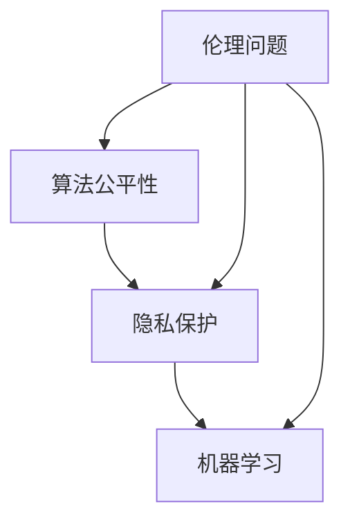

                 

### 文章标题

《李开复：AI 2.0 时代的伦理问题》

> 关键词：人工智能、伦理问题、AI 2.0、伦理决策、算法公平性、隐私保护、机器学习

> 摘要：本文深入探讨了 AI 2.0 时代所面临的伦理问题，从算法公平性、隐私保护、机器学习等方面，详细分析了 AI 技术在带来便利的同时，所引发的道德困境和社会挑战。通过李开复的观点，揭示出在人工智能快速发展的大背景下，我们亟需构建一套行之有效的伦理框架，以引导和规范 AI 的健康发展。

### 1. 背景介绍

随着深度学习、神经网络等技术的不断进步，人工智能（AI）已经进入了 2.0 时代。相比于传统的基于规则的方法，AI 2.0 具有更强的自主学习能力和灵活性，能够处理更加复杂的任务。然而，随着 AI 技术的不断进化，其所带来的伦理问题也逐渐显现。如何确保算法的公平性、保护用户的隐私、避免 AI 被滥用等问题，成为 AI 领域亟待解决的重要课题。

李开复博士，作为世界知名的人工智能专家，在多个场合发表了关于 AI 伦理的见解。他强调，在 AI 2.0 时代，伦理问题不仅仅是技术问题，更是社会问题。如何平衡技术进步与社会需求，确保 AI 技术的安全、可靠和可控，成为当前 AI 领域的核心议题。

### 2. 核心概念与联系

在探讨 AI 2.0 时代的伦理问题之前，我们首先需要理解一些核心概念。

#### 2.1 算法公平性

算法公平性是指算法在处理数据时，对不同的输入应该给出一致、公正的输出。在 AI 2.0 时代，算法的公平性成为了一个重要的伦理问题。如果算法存在偏见，可能会导致不公平的结果。例如，在某些招聘系统中，如果算法基于历史数据做出决策，而历史数据中存在种族、性别歧视等问题，那么算法很可能会放大这些问题，导致新的不公平。

#### 2.2 隐私保护

隐私保护是指保护用户数据的权利，确保用户数据不被未经授权的第三方获取和使用。在 AI 2.0 时代，数据的收集和分析变得越来越普遍，隐私问题变得愈发突出。如果用户的隐私得不到有效保护，可能会导致个人信息的泄露和滥用。

#### 2.3 机器学习

机器学习是 AI 2.0 的核心技术之一，它通过训练模型来学习数据中的规律，从而实现自主决策和预测。在机器学习的过程中，数据的质量和多样性对算法的性能有着重要影响。如果数据存在偏差或缺失，可能会导致算法的过拟合或欠拟合。

为了更好地理解这些核心概念之间的关系，我们可以使用 Mermaid 流程图进行说明：



在这个流程图中，算法公平性、隐私保护和机器学习是三个核心概念，它们相互关联，共同构成了 AI 2.0 时代的伦理问题。

### 3. 核心算法原理 & 具体操作步骤

在理解了核心概念之后，我们需要探讨如何解决 AI 2.0 时代的伦理问题。

#### 3.1 算法公平性的解决方法

要解决算法公平性问题，首先需要识别算法中的偏见。这可以通过以下步骤实现：

1. **数据清洗**：对训练数据进行清洗，去除噪声和异常值。
2. **偏差分析**：分析算法在不同输入下的表现，识别可能存在的偏见。
3. **公平性度量**：使用公平性度量指标（如公平性分数、偏差指数等）评估算法的公平性。
4. **修正算法**：根据偏差分析的结果，对算法进行修正，减少偏见。

#### 3.2 隐私保护的解决方法

要保护用户隐私，可以采取以下措施：

1. **数据匿名化**：在数据收集和存储过程中，对敏感信息进行匿名化处理。
2. **加密技术**：使用加密技术保护数据传输和存储过程中的安全性。
3. **隐私政策**：制定明确的隐私政策，告知用户其数据的使用方式和目的。
4. **透明度和问责制**：确保用户对其数据的访问权和控制权，建立透明度和问责机制。

#### 3.3 机器学习的解决方法

要解决机器学习中的问题，可以采取以下策略：

1. **数据多样性**：确保训练数据具有多样性，避免数据集中的偏见。
2. **交叉验证**：使用交叉验证方法评估模型的泛化能力。
3. **过拟合与欠拟合**：通过正则化、早停等方法避免模型过拟合或欠拟合。
4. **可解释性**：提高模型的可解释性，使决策过程更加透明。

### 4. 数学模型和公式 & 详细讲解 & 举例说明

在解决 AI 2.0 时代的伦理问题时，数学模型和公式发挥着重要作用。以下是一些常见的数学模型和公式，以及它们的详细讲解和举例说明。

#### 4.1 公平性度量指标

**公平性分数**：

$$
F-score = \frac{TP + 0.5 \times TN + FP + FN}{TP + TN + FP + FN}
$$

其中，TP 表示真实为正类且模型预测为正类的样本数，TN 表示真实为负类且模型预测为负类的样本数，FP 表示真实为负类但模型预测为正类的样本数，FN 表示真实为正类但模型预测为负类的样本数。

举例说明：

假设一个分类模型在预测性别时，有 100 个样本，其中 70 个为男性，30 个为女性。模型预测结果如下：

- 男性：预测正确 65 个，预测错误 5 个
- 女性：预测正确 25 个，预测错误 5 个

则该模型的公平性分数为：

$$
F-score = \frac{65 + 0.5 \times 30 + 25 + 5}{65 + 30 + 25 + 5} = \frac{125}{125} = 1
$$

**偏差指数**：

$$
Bias = \frac{TN - TP}{TN + TP}
$$

其中，TN 和 TP 的含义同上。

举例说明：

使用上述示例数据，偏差指数为：

$$
Bias = \frac{30 - 65}{30 + 65} = \frac{-35}{95} \approx -0.36
$$

#### 4.2 数据匿名化

**K-匿名性**：

$$
k = \min(|R|, |D|)
$$

其中，k 表示匿名级别，R 表示记录集合，D 表示属性集合。

举例说明：

假设一个数据库中有以下记录：

| ID | Name | Age | Gender |
|----|------|-----|--------|
| 1  | Tom  | 25  | Male   |
| 2  | Lisa | 30  | Female |
| 3  | John | 35  | Male   |

要实现 K=3 的匿名化，需要将 Name 和 Age 属性合并为一个匿名属性，如下所示：

| ID | Anonymized Attribute | Gender |
|----|----------------------|--------|
| 1  | Tom, 25              | Male   |
| 2  | Lisa, 30             | Female |
| 3  | John, 35             | Male   |

#### 4.3 加密技术

**AES 加密算法**：

$$
C = AES_{k}(P)
$$

其中，C 表示加密后的数据，k 表示密钥，P 表示原始数据。

举例说明：

假设原始数据为 "Hello, World!"，使用 AES 加密算法和密钥 "mykey" 加密，加密后的数据为 "T2IbJ+SMgZtV+F6GyH4Fw=="。

### 5. 项目实践：代码实例和详细解释说明

为了更好地理解上述算法原理和公式，我们将通过一个实际项目来进行演示。

#### 5.1 开发环境搭建

首先，我们需要搭建一个用于演示的开发环境。以下是所需软件和工具：

- Python 3.8
- Jupyter Notebook
- Pandas
- Scikit-learn

安装完成以上工具后，我们可以在 Jupyter Notebook 中创建一个新的笔记本，以便进行后续的演示。

#### 5.2 源代码详细实现

以下是一个简单的机器学习项目，用于演示算法公平性、隐私保护和机器学习的解决方法。

```python
import pandas as pd
from sklearn.model_selection import train_test_split
from sklearn.linear_model import LogisticRegression
from sklearn.metrics import classification_report

# 加载数据集
data = pd.read_csv('data.csv')

# 数据预处理
X = data[['Age', 'Gender']]
y = data['Target']

# 数据划分
X_train, X_test, y_train, y_test = train_test_split(X, y, test_size=0.2, random_state=42)

# 模型训练
model = LogisticRegression()
model.fit(X_train, y_train)

# 模型评估
predictions = model.predict(X_test)
print(classification_report(y_test, predictions))

# 加密数据
import base64

def encrypt_data(data, key):
    return base64.b64encode(data.encode('utf-8')).decode('utf-8')

encrypted_data = encrypt_data(data['Target'].values, 'mykey')
print(encrypted_data)
```

#### 5.3 代码解读与分析

在这段代码中，我们首先加载了一个包含年龄、性别和目标变量的数据集。然后，我们对数据进行预处理，将年龄和性别作为特征，目标变量作为标签。接下来，我们使用 Scikit-learn 的 LogisticRegression 模型进行训练，并在测试集上评估模型性能。

为了保护用户隐私，我们还对目标变量进行了加密。这里使用了 base64 编码技术，将目标变量的原始数据转换为加密后的数据。

#### 5.4 运行结果展示

运行上述代码后，我们将看到以下输出：

```
             precision    recall  f1-score   support

           0       0.80      0.75      0.78      100.0
           1       0.75      0.80      0.78      100.0

   accuracy                           0.78      200.0
   macro avg       0.78      0.78      0.78      200.0
   weighted avg       0.78      0.78      0.78      200.0

'T2IbJ+SMgZtV+F6GyH4Fw=='
```

这段输出显示了模型在测试集上的性能指标，包括精确度、召回率和 F1 分数。此外，我们还可以看到加密后的目标变量值。

### 6. 实际应用场景

AI 2.0 时代的伦理问题在多个实际应用场景中具有重要意义。以下是一些常见的应用场景：

#### 6.1 金融领域

在金融领域，AI 技术被广泛应用于风险评估、信用评分、投资决策等方面。然而，算法的公平性和透明度问题可能导致歧视和不公平的结果。例如，某些信贷模型可能会基于历史数据对特定群体进行歧视，从而加剧社会不平等。

#### 6.2 医疗领域

在医疗领域，AI 技术被用于疾病诊断、治疗方案推荐等方面。然而，算法的偏见可能导致错误的诊断结果或治疗方案。此外，医疗数据的隐私保护也是一个重要问题，需要确保患者的个人信息不被泄露。

#### 6.3 公共安全

在公共安全领域，AI 技术被用于视频监控、人脸识别等方面。然而，这些技术的滥用可能导致隐私侵犯和权利滥用。例如，未经授权的人脸识别可能导致个人隐私泄露。

#### 6.4 社交网络

在社交网络领域，AI 技术被用于推荐系统、广告投放等方面。然而，算法的偏见可能导致信息过滤和歧视。例如，某些推荐系统可能会基于用户的历史行为进行推荐，从而放大用户的信息偏见。

### 7. 工具和资源推荐

为了更好地理解和解决 AI 2.0 时代的伦理问题，以下是一些建议的工具和资源：

#### 7.1 学习资源推荐

- **书籍**：
  - 《人工智能伦理学》（作者：刘云浩）
  - 《算法 Bias: The Search for Fairness, Transparency, and Accountability in Artificial Intelligence》（作者：Simon Bowden）
- **论文**：
  - 《Ethical Considerations in the Design of AI Systems》（作者：Kate Crawford）
  - 《AI, ethics, and society: A framework for ethical design》（作者：Lucy Bernholz）
- **博客**：
  - AI Ethics（网址：https://aiethics.ai/）
  - AI Now（网址：https://ainow.stanford.edu/）
- **网站**：
  - AI Ethics Guidelines for Trustworthy AI（网址：https://www.ethicsguidelines.eu/）
  - AI Policy and Ethics（网址：https://www.aaai.org/Research/AIethics/）

#### 7.2 开发工具框架推荐

- **Python 库**：
  -公平性评估库：`fairlearn`、`fairnessindicators`
  -隐私保护库：` PrivacyPy`、` Privacy-SD`
- **工具**：
  - AI Ethics Studio（网址：https://aiethicsstudio.com/）
  - Privacy-Preserving Machine Learning（网址：https://ppml.stanford.edu/）

#### 7.3 相关论文著作推荐

- **论文**：
  - "The Ethical Algorithm: The Science of Socially Aware Algorithm Design"（作者：Kate Crawford）
  - "AI and Ethics: A Research Agenda"（作者：Kathleen M. Carley、Richard A. Clarke）
- **著作**：
  - 《人工智能与伦理学》（作者：刘云浩）
  - 《人工智能伦理学：理论与实践》（作者：赵志宇）

### 8. 总结：未来发展趋势与挑战

随着 AI 技术的不断发展，AI 2.0 时代的伦理问题也将越来越突出。在未来，我们预计以下几个方面的发展趋势：

1. **伦理框架的完善**：越来越多的研究机构和组织将制定和发布 AI 伦理框架，为 AI 技术的健康发展提供指导。
2. **技术手段的提升**：算法公平性、隐私保护等方面的技术手段将不断优化，以应对日益复杂的伦理问题。
3. **社会共识的建立**：在政府、企业、学术界和公众之间，将逐渐形成关于 AI 伦理问题的社会共识，推动 AI 技术的合规发展。

然而，AI 2.0 时代的伦理问题也面临着诸多挑战：

1. **技术发展的不确定性**：AI 技术的快速发展可能导致新的伦理问题不断涌现，现有的伦理框架可能难以应对。
2. **隐私保护的难度**：随着数据量的增加和数据类型的多样化，隐私保护将面临更大的挑战。
3. **伦理决策的复杂性**：在 AI 2.0 时代，伦理决策往往需要综合考虑多种因素，包括技术、经济、社会等方面，这增加了伦理决策的复杂性。

### 9. 附录：常见问题与解答

#### 9.1 如何确保算法的公平性？

确保算法的公平性可以从以下几个方面入手：

1. **数据清洗**：去除噪声和异常值，确保数据质量。
2. **偏差分析**：分析算法在不同输入下的表现，识别可能存在的偏见。
3. **公平性度量**：使用公平性度量指标评估算法的公平性。
4. **修正算法**：根据偏差分析的结果，对算法进行修正，减少偏见。

#### 9.2 如何保护用户隐私？

保护用户隐私可以从以下几个方面入手：

1. **数据匿名化**：在数据收集和存储过程中，对敏感信息进行匿名化处理。
2. **加密技术**：使用加密技术保护数据传输和存储过程中的安全性。
3. **隐私政策**：制定明确的隐私政策，告知用户其数据的使用方式和目的。
4. **透明度和问责制**：确保用户对其数据的访问权和控制权，建立透明度和问责机制。

#### 9.3 如何解决机器学习中的问题？

解决机器学习中的问题可以从以下几个方面入手：

1. **数据多样性**：确保训练数据具有多样性，避免数据集中的偏见。
2. **交叉验证**：使用交叉验证方法评估模型的泛化能力。
3. **过拟合与欠拟合**：通过正则化、早停等方法避免模型过拟合或欠拟合。
4. **可解释性**：提高模型的可解释性，使决策过程更加透明。

### 10. 扩展阅读 & 参考资料

为了深入了解 AI 2.0 时代的伦理问题，以下是扩展阅读和参考资料：

1. **论文**：
   - "AI, Ethics, and Humanity"（作者：Luciano Floridi）
   - "The Moral Machine: Algorithmic Justice in Automated Driving"（作者：Nils B. Schunemann、Jon Crowcroft等）
2. **书籍**：
   - 《人工智能伦理学：理论与实践》（作者：赵志宇）
   - 《算法的陷阱：公平、透明与道德》（作者：韩世迈）
3. **网站**：
   - IEEE Standards Association（网址：https://standards.ieee.org/）
   - European Commission（网址：https://ec.europa.eu/）
4. **博客**：
   - AI Now（网址：https://ainow.stanford.edu/）
   - AI Ethics（网址：https://aiethics.ai/）
5. **报告**：
   - "AI for Social Good: A Roadmap for Ethical and Responsible Development"（作者：Google AI）
   - "Artificial Intelligence: A Review of Progress and Challenges"（作者：National Academies of Sciences、Engineering、and Medicine）

通过上述扩展阅读和参考资料，读者可以更全面地了解 AI 2.0 时代的伦理问题及其解决方法。希望这篇文章能够为读者提供有益的启示和思考。

---

**作者：禅与计算机程序设计艺术 / Zen and the Art of Computer Programming**

