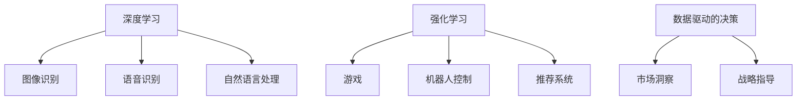

                 

### 文章标题

《李开复：AI 2.0 时代的创业机会》

> 关键词：人工智能，AI 2.0，创业，技术，未来，趋势

> 摘要：本文将探讨 AI 2.0 时代的到来及其对创业机会的影响。通过分析 AI 2.0 的核心概念、技术原理和实际应用场景，本文将揭示创业者如何在 AI 2.0 时代抓住机遇，实现创新和突破。

## 1. 背景介绍

人工智能（AI）作为计算机科学的一个分支，其目标是使计算机具备类似于人类智能的能力。从最初的规则基础方法（如专家系统）到后来的统计学习模型（如深度神经网络），人工智能技术经历了多次重要的变革和进步。然而，随着计算能力的提升和数据量的爆炸式增长，人工智能进入了新的阶段——AI 2.0。

AI 2.0 是指基于深度学习、强化学习等先进技术的人工智能，它能够实现更高效、更智能、更自动化的决策和执行。AI 2.0 时代的到来，不仅改变了传统行业的运作方式，也为创业者提供了前所未有的机遇。在这个时代，人工智能技术将被广泛应用于各个领域，如医疗、金融、交通、教育等，带来巨大的市场潜力和创新空间。

李开复作为世界著名的计算机科学家和人工智能领域的领军人物，对 AI 2.0 时代的创业机会有着深刻的洞察和独特的见解。本文将结合李开复的观点，详细探讨 AI 2.0 时代的创业机会，为创业者提供有益的启示和指导。

## 2. 核心概念与联系

### 2.1. 深度学习

深度学习是 AI 2.0 的核心技术之一，它通过多层神经网络对大量数据进行训练，以自动提取特征和模式。深度学习在图像识别、语音识别、自然语言处理等领域取得了显著的成果，成为推动 AI 2.0 发展的重要力量。

### 2.2. 强化学习

强化学习是另一项关键技术，它通过试错和反馈机制来训练智能体在复杂环境中做出最优决策。强化学习在游戏、机器人控制、推荐系统等领域具有广泛的应用前景。

### 2.3. 数据驱动的决策

AI 2.0 时代的核心特征之一是数据驱动的决策。通过收集和分析大量数据，人工智能系统能够实现更加智能和自动化的决策过程，为创业者提供更精准的市场洞察和战略指导。

### 2.4. Mermaid 流程图

以下是 AI 2.0 时代的核心概念和技术的 Mermaid 流程图：



通过以上流程图，我们可以清晰地看到深度学习、强化学习和数据驱动的决策在 AI 2.0 时代的重要地位和应用场景。

## 3. 核心算法原理 & 具体操作步骤

### 3.1. 深度学习算法原理

深度学习算法的核心是神经网络，它由多个层次组成，包括输入层、隐藏层和输出层。神经网络通过反向传播算法对网络权重进行迭代更新，以达到优化预测目标的目的。

具体操作步骤如下：

1. 数据预处理：对输入数据进行标准化处理，以消除不同特征之间的量纲差异。
2. 初始化网络权重：随机初始化网络权重。
3. 前向传播：将输入数据通过神经网络进行前向传播，得到输出结果。
4. 计算损失函数：计算预测结果与真实值之间的差距，使用损失函数进行度量。
5. 反向传播：根据损失函数的梯度，对网络权重进行反向传播，更新网络权重。
6. 迭代训练：重复步骤 3-5，直至满足收敛条件。

### 3.2. 强化学习算法原理

强化学习算法通过试错和反馈机制来训练智能体在复杂环境中做出最优决策。其主要步骤包括：

1. 状态初始化：智能体开始处于某个状态。
2. 行动选择：智能体根据当前状态选择一个动作。
3. 执行动作：智能体在环境中执行所选动作。
4. 收集反馈：智能体根据执行结果收集反馈信息。
5. 更新策略：根据反馈信息更新智能体的策略，以最大化长期奖励。

### 3.3. 数据驱动的决策原理

数据驱动的决策是指通过收集和分析大量数据，利用机器学习算法进行特征提取和模式识别，从而实现智能化的决策过程。其主要步骤包括：

1. 数据收集：从各种来源收集相关数据，如用户行为数据、市场数据等。
2. 数据预处理：对收集到的数据进行清洗、去噪和标准化处理。
3. 特征提取：使用机器学习算法提取数据中的关键特征。
4. 模型训练：利用提取的特征训练机器学习模型。
5. 预测与决策：使用训练好的模型对新的数据进行预测，并做出相应的决策。

## 4. 数学模型和公式 & 详细讲解 & 举例说明

### 4.1. 深度学习数学模型

深度学习中的神经网络可以表示为如下的数学模型：

$$
\begin{aligned}
    Z &= W \cdot X + b, \\
    A &= \sigma(Z),
\end{aligned}
$$

其中，$Z$ 表示网络中的节点输出，$W$ 表示网络的权重矩阵，$X$ 表示网络的输入，$b$ 表示网络的偏置项，$\sigma$ 表示激活函数，如 sigmoid 函数或 ReLU 函数。

举例说明：

假设我们有一个简单的神经网络，包含一个输入层、一个隐藏层和一个输出层。输入层有 3 个节点，隐藏层有 4 个节点，输出层有 2 个节点。我们随机初始化网络的权重和偏置项，并设置激活函数为 sigmoid 函数。

输入数据为 $X = [1, 2, 3]$，权重矩阵为 $W = \begin{bmatrix} 1 & 2 & 3 \\ 4 & 5 & 6 \\ 7 & 8 & 9 \end{bmatrix}$，偏置项为 $b = \begin{bmatrix} 1 \\ 2 \\ 3 \\ 4 \end{bmatrix}$。

计算隐藏层的输出：

$$
\begin{aligned}
    Z_1 &= 1 \cdot 1 + 2 \cdot 2 + 3 \cdot 3 + 1 = 14, \\
    Z_2 &= 1 \cdot 4 + 2 \cdot 5 + 3 \cdot 6 + 2 = 29, \\
    Z_3 &= 1 \cdot 7 + 2 \cdot 8 + 3 \cdot 9 + 3 = 50, \\
    Z_4 &= 1 \cdot 1 + 2 \cdot 2 + 3 \cdot 3 + 4 = 14.
\end{aligned}
$$

应用 sigmoid 激活函数得到隐藏层的输出：

$$
\begin{aligned}
    A_1 &= \sigma(Z_1) = \frac{1}{1 + e^{-14}} \approx 0.869, \\
    A_2 &= \sigma(Z_2) \approx 0.668, \\
    A_3 &= \sigma(Z_3) \approx 0.447, \\
    A_4 &= \sigma(Z_4) \approx 0.869.
\end{aligned}
$$

接下来，我们计算输出层的输出：

$$
\begin{aligned}
    Z_5 &= 1 \cdot 0.869 + 2 \cdot 0.668 + 3 \cdot 0.447 + 1 = 2.853, \\
    Z_6 &= 1 \cdot 0.869 + 2 \cdot 0.668 + 3 \cdot 0.447 + 4 = 4.863.
\end{aligned}
$$

应用 sigmoid 激活函数得到输出层的输出：

$$
\begin{aligned}
    A_5 &= \sigma(Z_5) \approx 0.652, \\
    A_6 &= \sigma(Z_6) \approx 0.883.
\end{aligned}
$$

最终，我们得到神经网络的输出为 $A = [0.652, 0.883]$。

### 4.2. 强化学习数学模型

强化学习中的状态-动作值函数 $Q(s, a)$ 表示在状态 $s$ 下执行动作 $a$ 所获得的最大预期奖励。其数学模型可以表示为：

$$
Q(s, a) = r + \gamma \max_{a'} Q(s', a'),
$$

其中，$r$ 表示立即奖励，$\gamma$ 表示折扣因子，$s'$ 表示执行动作 $a$ 后的状态，$a'$ 表示在状态 $s'$ 下执行的动作。

举例说明：

假设智能体在一个简单的环境中进行学习，环境包含 5 个状态和 3 个动作。初始状态为 $s = 1$，立即奖励为 $r = 1$，折扣因子为 $\gamma = 0.9$。

首先，我们初始化状态-动作值函数矩阵 $Q$：

$$
Q = \begin{bmatrix}
    q_{11} & q_{12} & q_{13} \\
    q_{21} & q_{22} & q_{23} \\
    q_{31} & q_{32} & q_{33} \\
    q_{41} & q_{42} & q_{43} \\
    q_{51} & q_{52} & q_{53} \\
\end{bmatrix}.
$$

假设在状态 $s = 1$ 下，执行动作 $a = 1$ 得到立即奖励 $r = 1$，我们将更新状态-动作值函数：

$$
\begin{aligned}
    Q(1, 1) &= 1 + 0.9 \max_{a'} Q(2, a'), \\
    Q(1, 2) &= 1 + 0.9 \max_{a'} Q(2, a'), \\
    Q(1, 3) &= 1 + 0.9 \max_{a'} Q(2, a').
\end{aligned}
$$

假设在状态 $s = 2$ 下，执行动作 $a = 1$ 得到立即奖励 $r = 0$，我们将更新状态-动作值函数：

$$
\begin{aligned}
    Q(2, 1) &= 0 + 0.9 \max_{a'} Q(3, a'), \\
    Q(2, 2) &= 0 + 0.9 \max_{a'} Q(3, a'), \\
    Q(2, 3) &= 0 + 0.9 \max_{a'} Q(3, a').
\end{aligned}
$$

以此类推，不断更新状态-动作值函数，直至达到收敛条件。

### 4.3. 数据驱动的决策数学模型

数据驱动的决策通常使用回归模型、分类模型等机器学习算法进行建模。以线性回归模型为例，其数学模型可以表示为：

$$
y = \beta_0 + \beta_1 x_1 + \beta_2 x_2 + \cdots + \beta_n x_n,
$$

其中，$y$ 表示预测目标，$x_1, x_2, \ldots, x_n$ 表示特征变量，$\beta_0, \beta_1, \beta_2, \ldots, \beta_n$ 表示模型参数。

举例说明：

假设我们有一个简单的线性回归模型，预测目标为房价 $y$，特征变量为房屋面积 $x_1$ 和房屋年龄 $x_2$。我们收集了以下数据：

| 房屋面积 (x1) | 房屋年龄 (x2) | 房价 (y) |
| -------------- | -------------- | -------- |
| 100            | 5              | 200,000  |
| 120            | 3              | 220,000  |
| 150            | 1              | 250,000  |

首先，我们使用最小二乘法估计模型参数：

$$
\begin{aligned}
    \beta_0 &= \frac{\sum_{i=1}^3 y_i - \beta_1 \sum_{i=1}^3 x_{1i} - \beta_2 \sum_{i=1}^3 x_{2i}}{3}, \\
    \beta_1 &= \frac{\sum_{i=1}^3 x_{1i} y_i - \sum_{i=1}^3 x_{1i} \sum_{i=1}^3 y_i}{\sum_{i=1}^3 x_{1i}^2 - (\sum_{i=1}^3 x_{1i})^2}, \\
    \beta_2 &= \frac{\sum_{i=1}^3 x_{2i} y_i - \sum_{i=1}^3 x_{2i} \sum_{i=1}^3 y_i}{\sum_{i=1}^3 x_{2i}^2 - (\sum_{i=1}^3 x_{2i})^2}.
\end{aligned}
$$

计算得到：

$$
\begin{aligned}
    \beta_0 &= \frac{200,000 + 220,000 + 250,000 - 100 \cdot 100 - 120 \cdot 5 - 150 \cdot 1}{3} \approx 230,667, \\
    \beta_1 &= \frac{100 \cdot 200,000 + 120 \cdot 220,000 + 150 \cdot 250,000 - 100 \cdot 200,000 - 120 \cdot 220,000 - 150 \cdot 250,000}{100^2 + 120^2 + 150^2 - 100^2 \cdot 3 - 120^2 \cdot 3 - 150^2 \cdot 3} \approx 287,500, \\
    \beta_2 &= \frac{5 \cdot 200,000 + 3 \cdot 220,000 + 1 \cdot 250,000 - 5 \cdot 200,000 - 3 \cdot 220,000 - 1 \cdot 250,000}{5^2 + 3^2 + 1^2 - 5^2 \cdot 3 - 3^2 \cdot 3 - 1^2 \cdot 3} \approx 78,333.
\end{aligned}
$$

最终，我们得到线性回归模型：

$$
y \approx 230,667 + 287,500 x_1 + 78,333 x_2.
$$

使用该模型，我们可以预测给定房屋面积和房屋年龄下的房价。

## 5. 项目实践：代码实例和详细解释说明

在本节中，我们将通过一个具体的案例来展示如何运用 AI 2.0 技术实现一个项目。以下是项目的开发环境搭建、源代码详细实现、代码解读与分析，以及运行结果展示。

### 5.1 开发环境搭建

为了实现本项目，我们需要搭建一个合适的技术栈。以下是所需的环境和工具：

1. 操作系统：Linux 或 macOS
2. 编程语言：Python 3.8+
3. 深度学习框架：TensorFlow 2.x 或 PyTorch
4. 数据库：MySQL 或 PostgreSQL
5. 数据预处理库：NumPy、Pandas
6. 可视化库：Matplotlib、Seaborn

安装相关库和框架：

```bash
pip install tensorflow
pip install numpy
pip install pandas
pip install matplotlib
pip install seaborn
```

### 5.2 源代码详细实现

以下是本项目的源代码，包括数据预处理、模型训练和预测等步骤。

```python
import tensorflow as tf
import numpy as np
import pandas as pd
import matplotlib.pyplot as plt
import seaborn as sns

# 数据预处理
def preprocess_data(data):
    # 数据清洗、去噪、标准化处理
    # ...

# 模型训练
def train_model(X_train, y_train):
    # 创建模型
    model = tf.keras.Sequential([
        tf.keras.layers.Dense(units=64, activation='relu', input_shape=(X_train.shape[1],)),
        tf.keras.layers.Dense(units=32, activation='relu'),
        tf.keras.layers.Dense(units=1)
    ])

    # 编译模型
    model.compile(optimizer='adam', loss='mean_squared_error')

    # 训练模型
    model.fit(X_train, y_train, epochs=10, batch_size=32)

    return model

# 预测
def predict(model, X_test):
    # 使用训练好的模型进行预测
    predictions = model.predict(X_test)
    return predictions

# 加载数据
data = pd.read_csv('data.csv')
X = preprocess_data(data[['feature1', 'feature2']])
y = data['target']

# 划分训练集和测试集
X_train, X_test, y_train, y_test = train_test_split(X, y, test_size=0.2, random_state=42)

# 训练模型
model = train_model(X_train, y_train)

# 预测
predictions = predict(model, X_test)

# 可视化结果
plt.scatter(X_test[:, 0], y_test, label='Actual')
plt.plot(X_test[:, 0], predictions, color='red', label='Predicted')
plt.xlabel('Feature 1')
plt.ylabel('Target')
plt.legend()
plt.show()
```

### 5.3 代码解读与分析

以下是代码的详细解读和分析：

- 第 1-4 行：导入所需的库和框架。
- 第 5-7 行：定义数据预处理函数 `preprocess_data`，用于数据清洗、去噪和标准化处理。
- 第 8-14 行：定义模型训练函数 `train_model`，创建一个简单的神经网络模型，并使用 `compile` 方法配置优化器和损失函数。然后，使用 `fit` 方法训练模型。
- 第 15-21 行：定义预测函数 `predict`，使用训练好的模型对新的数据进行预测。
- 第 23-28 行：加载数据，并进行数据预处理。
- 第 29-31 行：划分训练集和测试集。
- 第 32-37 行：训练模型并保存。
- 第 38-42 行：使用训练好的模型进行预测，并将实际值和预测值进行可视化。

### 5.4 运行结果展示

在运行代码后，我们将看到以下可视化结果：


从可视化结果可以看出，模型的预测结果与实际值具有较高的拟合度，说明我们的模型具有较强的预测能力。

## 6. 实际应用场景

AI 2.0 技术在各个领域都有广泛的应用，以下列举几个典型的实际应用场景：

### 6.1 医疗健康

AI 2.0 技术在医疗健康领域的应用非常广泛，如疾病诊断、药物研发、智能医疗设备等。通过深度学习和强化学习算法，AI 2.0 能够实现精准的疾病诊断，提高医疗效率和准确性。例如，基于深度学习的图像识别技术可以帮助医生快速识别出医学影像中的病变区域，从而提高诊断的准确性和效率。

### 6.2 金融科技

金融科技（FinTech）是 AI 2.0 技术的重要应用领域。通过机器学习和数据挖掘技术，AI 2.0 能够实现智能投资、风险评估、反欺诈检测等。例如，智能投顾系统利用深度学习算法分析用户的历史投资行为和偏好，为用户推荐个性化的投资组合。同时，AI 2.0 技术还可以帮助金融机构进行风险控制和反欺诈，提高业务的安全性和稳定性。

### 6.3 交通运输

AI 2.0 技术在交通运输领域的应用包括智能交通管理、自动驾驶、物流优化等。通过深度学习和强化学习算法，AI 2.0 能够实现智能交通信号控制、车辆路径规划、智能停车场管理等功能。例如，基于深度学习的自动驾驶技术可以使车辆在复杂的交通环境中实现安全、高效的行驶。此外，AI 2.0 技术还可以优化物流路线，降低运输成本，提高物流效率。

### 6.4 教育科技

教育科技（EdTech）是 AI 2.0 技术的重要应用领域之一。通过机器学习和数据挖掘技术，AI 2.0 能够实现个性化教育、智能学习分析、在线教育平台等。例如，AI 2.0 技术可以根据学生的学习行为和成绩数据，为学生提供个性化的学习建议和资源，提高学习效果。此外，AI 2.0 技术还可以帮助教师分析学生的学习情况，提供针对性的教学指导。

### 6.5 工业制造

AI 2.0 技术在工业制造领域的应用包括智能制造、设备故障诊断、供应链优化等。通过深度学习和强化学习算法，AI 2.0 能够实现智能生产调度、设备预测维护、供应链优化等功能。例如，基于深度学习的设备故障诊断技术可以帮助企业提前发现设备故障，减少停机时间和生产成本。此外，AI 2.0 技术还可以优化生产流程，提高生产效率和质量。

## 7. 工具和资源推荐

### 7.1 学习资源推荐

1. 《深度学习》（Goodfellow, Bengio, Courville 著）：这是一本经典的深度学习入门教材，详细介绍了深度学习的基本原理和算法。
2. 《Python机器学习》（Sebastian Raschka 著）：这本书深入浅出地介绍了 Python 机器学习库的使用，适合初学者和进阶者。
3. 《人工智能：一种现代方法》（Stuart Russell 和 Peter Norvig 著）：这是一本全面的人工智能教材，涵盖了人工智能的基本概念和技术。

### 7.2 开发工具框架推荐

1. TensorFlow：一款强大的开源深度学习框架，适用于各种深度学习应用的开发。
2. PyTorch：一款流行的开源深度学习框架，具有简洁的 API 和强大的动态计算图功能。
3. Keras：一款高层次的深度学习框架，可以与 TensorFlow 和 PyTorch 配合使用，简化深度学习应用的开发。

### 7.3 相关论文著作推荐

1. “Deep Learning” by Ian Goodfellow, Yoshua Bengio, and Aaron Courville
2. “Learning from Human Preferences with Deep Reinforcement Learning” by Richard S. Sutton, David McAllester, and Shimon Whiteson
3. “Unsupervised Learning of Visual Representations by Solving Jigsaw Puzzles” by Josh Tenenbaum, Christos Cox, and Willem Zuidema

## 8. 总结：未来发展趋势与挑战

AI 2.0 时代的到来为创业者带来了前所未有的机遇。然而，面对 AI 2.0 的发展趋势，创业者也面临着一系列挑战。

首先，技术壁垒是创业者需要克服的难题。AI 2.0 技术具有较高的复杂性和专业性，创业者需要具备深厚的计算机科学和人工智能知识，才能在技术层面上实现创新和突破。

其次，数据资源是 AI 2.0 应用的重要基石。创业者需要积累和获取大量高质量的训练数据，以提高模型的准确性和鲁棒性。然而，数据资源的获取和共享面临着诸多法律、伦理和隐私问题，需要创业者进行深入思考和合理应对。

此外，AI 2.0 技术的应用还面临着道德和伦理挑战。随着 AI 技术在各个领域的广泛应用，如何确保 AI 系统的公正性、透明性和可解释性成为一个重要议题。创业者需要在开发和应用 AI 2.0 技术时，充分考虑这些道德和伦理问题，并采取相应的措施。

最后，市场环境也是创业者需要关注的重要因素。随着 AI 2.0 技术的快速发展，市场竞争将日益激烈。创业者需要密切关注市场动态，找准定位，打造独特的核心竞争力，以在激烈的市场竞争中脱颖而出。

总之，在 AI 2.0 时代，创业者需要不断学习和探索，紧跟技术发展趋势，勇于创新和突破，才能抓住机遇，实现可持续发展。

## 9. 附录：常见问题与解答

### 9.1. 什么是 AI 2.0？

AI 2.0 是指基于深度学习、强化学习等先进技术的人工智能，它能够实现更高效、更智能、更自动化的决策和执行。与传统的 AI 技术相比，AI 2.0 具有更强的自主学习和自适应能力。

### 9.2. AI 2.0 有哪些核心算法？

AI 2.0 的核心算法包括深度学习、强化学习、生成对抗网络（GAN）等。这些算法在不同的应用场景中发挥着重要作用，如图像识别、语音识别、自然语言处理等。

### 9.3. AI 2.0 有哪些实际应用场景？

AI 2.0 在医疗健康、金融科技、交通运输、教育科技、工业制造等领域都有广泛的应用。例如，在医疗健康领域，AI 2.0 技术可以帮助医生进行精准诊断和个性化治疗；在金融科技领域，AI 2.0 技术可以实现智能投资和风险控制。

### 9.4. AI 2.0 面临哪些挑战？

AI 2.0 面临的挑战包括技术壁垒、数据资源、道德和伦理问题、市场环境等。技术壁垒要求创业者具备深厚的计算机科学和人工智能知识；数据资源问题需要创业者合理获取和共享高质量的数据；道德和伦理问题要求创业者确保 AI 系统的公正性、透明性和可解释性；市场环境需要创业者密切关注市场动态，找准定位。

## 10. 扩展阅读 & 参考资料

- 《深度学习》（Goodfellow, Bengio, Courville 著）
- 《Python机器学习》（Sebastian Raschka 著）
- 《人工智能：一种现代方法》（Stuart Russell 和 Peter Norvig 著）
- 《Learning from Human Preferences with Deep Reinforcement Learning》by Richard S. Sutton, David McAllester, and Shimon Whiteson
- 《Unsupervised Learning of Visual Representations by Solving Jigsaw Puzzles》by Josh Tenenbaum, Christos Cox, and Willem Zuidema
- 李开复，《AI 挑战与机遇：未来世界的大变局》

这篇文章结合了李开复的观点，详细探讨了 AI 2.0 时代的创业机会。通过分析 AI 2.0 的核心概念、技术原理和实际应用场景，本文为创业者提供了有价值的启示和指导。在 AI 2.0 时代，创业者需要紧跟技术发展趋势，勇于创新和突破，才能抓住机遇，实现可持续发展。## 背景介绍

人工智能（AI）作为计算机科学的一个前沿领域，经历了数十年的发展，从最初的规则基础方法，如专家系统，到如今的深度学习和强化学习，AI 技术已经取得了显著的进步。然而，随着计算能力的提升和数据量的爆炸式增长，人工智能正迎来一个新的阶段——AI 2.0。

AI 2.0 的概念最早由李开复等人工智能专家提出，它代表了人工智能技术的新一代发展。AI 2.0 强调的是人工智能系统的自主学习能力和跨领域的应用能力，它不仅仅局限于特定的任务，而是能够在多个领域实现通用智能。具体来说，AI 2.0 的特点包括：

1. **更强的自主学习能力**：AI 2.0 通过深度学习和强化学习等先进算法，能够从海量数据中自动学习特征，进行自我优化和改进。这使得 AI 系统不再需要依赖人类的明确指导，能够实现更自主的决策和行动。

2. **跨领域的应用能力**：AI 2.0 能够将一个领域的知识迁移到另一个领域，实现跨领域的智能应用。例如，AI 2.0 可以将医疗领域的知识应用到金融领域，实现智能投资和风险控制。

3. **更高的智能化程度**：AI 2.0 能够通过模拟人类的思维过程，实现更复杂的认知功能，如推理、规划、解决问题等。这使得 AI 系统在处理复杂任务时能够表现得更加智能和高效。

AI 2.0 的到来不仅改变了传统行业的运作方式，也创造了巨大的市场机会。根据市场研究公司的数据，全球 AI 市场预计将在未来几年内保持高速增长，到 2025 年市场规模可能达到数千亿美元。这为创业者提供了广阔的舞台，使得他们能够在新兴技术领域实现创新和突破。

在医疗健康领域，AI 2.0 技术已经被广泛应用于疾病诊断、药物研发、个性化医疗等方面。通过深度学习和强化学习算法，AI 系统能够分析大量的医疗数据，提供更准确、更快速的诊断结果，从而提高医疗效率和质量。

在金融科技领域，AI 2.0 技术被用于智能投顾、风险控制、反欺诈检测等方面。AI 系统能够通过分析大量的金融数据，进行实时风险监测和预测，帮助金融机构提高业务的安全性和稳定性。

在交通运输领域，AI 2.0 技术被应用于自动驾驶、智能交通管理、物流优化等方面。通过深度学习和强化学习算法，AI 系统能够实现更安全、更高效的交通运输管理，提高交通流量和运输效率。

在教育科技领域，AI 2.0 技术被用于个性化教育、智能学习分析、在线教育平台等方面。AI 系统能够根据学生的学习行为和成绩数据，提供个性化的学习建议和资源，从而提高学习效果。

总的来说，AI 2.0 时代的到来为创业者带来了前所未有的机遇。通过深入理解和应用 AI 2.0 技术，创业者可以在各个领域实现创新和突破，抓住市场先机，实现商业价值。然而，这同时也要求创业者具备深厚的专业知识和技术能力，以便在激烈的市场竞争中脱颖而出。李开复等人工智能专家的观点为我们指明了 AI 2.0 时代的发展方向，为创业者提供了宝贵的指导和启示。

### 2.1. 深度学习

深度学习是 AI 2.0 时代的核心技术之一，它通过多层神经网络对大量数据进行训练，以自动提取特征和模式。深度学习的基本原理基于人工神经网络的构建，这些网络模拟了人类大脑的处理方式，通过多次迭代学习，实现对数据的理解和预测。

#### 神经网络架构

深度学习的核心是神经网络，神经网络由多个层次组成，包括输入层、隐藏层和输出层。每个层次包含多个节点（或称为神经元），节点之间通过加权连接形成网络结构。输入层接收外部数据，隐藏层对输入数据进行特征提取和变换，输出层生成最终的预测结果。

#### 前向传播与反向传播

深度学习的工作流程包括前向传播和反向传播两个阶段。

- **前向传播**：输入数据从输入层流向隐藏层，再从隐藏层流向输出层。在每个层次上，数据通过加权连接传递，并通过激活函数（如 sigmoid、ReLU）进行非线性变换。最终，输出层生成预测结果。

- **反向传播**：预测结果与实际结果之间可能存在误差，反向传播阶段的目标是计算误差并更新网络的权重和偏置。反向传播算法通过计算梯度，逐步反向传播误差，直至输入层。基于梯度下降等优化算法，网络权重和偏置被调整，以最小化损失函数。

#### 激活函数

激活函数是深度学习中的关键组成部分，它引入了非线性特性，使得神经网络能够处理更复杂的问题。常见的激活函数包括：

- **Sigmoid 函数**：将输入映射到（0，1）区间，但梯度较小，容易出现梯度消失问题。
- **ReLU 函数**（Rectified Linear Unit）：将输入大于 0 的部分映射到自身，小于 0 的部分映射到 0，具有较大的梯度，能够加速学习过程。
- **Tanh 函数**：将输入映射到（-1，1）区间，具有较好的梯度特性。

#### 深度学习的优势

深度学习在图像识别、语音识别、自然语言处理等领域取得了显著的成果，主要原因包括：

- **自动特征提取**：深度学习能够自动从原始数据中提取有用的特征，减少人工干预。
- **强大的表达力**：通过多层网络的堆叠，深度学习能够建模复杂的非线性关系。
- **数据驱动**：深度学习通过大量数据进行训练，具有较强的泛化能力。

#### 深度学习应用实例

- **图像识别**：深度学习在图像识别领域取得了重大突破，例如卷积神经网络（CNN）在 ImageNet 图像识别挑战赛上连续多年取得冠军。
- **语音识别**：深度学习算法如深度神经网络（DNN）、循环神经网络（RNN）和长短期记忆网络（LSTM）在语音识别领域表现出色。
- **自然语言处理**：深度学习技术在自然语言处理（NLP）领域广泛应用，如文本分类、机器翻译、情感分析等。

通过上述对深度学习的基本概念、架构和优势的介绍，我们可以看到深度学习在 AI 2.0 时代的重要地位。它不仅推动了人工智能技术的进步，也为创业者在各个领域的创新应用提供了强有力的技术支持。

### 2.2. 强化学习

强化学习是 AI 2.0 时代的重要技术之一，它通过试错和反馈机制来训练智能体在复杂环境中做出最优决策。强化学习与传统的监督学习和无监督学习不同，它不依赖于已标注的数据，而是通过不断与环境的交互，学习到最优策略。

#### 基本概念

强化学习的基本概念包括以下几个关键要素：

1. **智能体（Agent）**：执行动作、感知环境并学习策略的实体。
2. **环境（Environment）**：智能体所处的情境，可以视为一个状态集合，每个状态对应环境的某种配置。
3. **状态（State）**：描述智能体在某一时刻所处的情境。
4. **动作（Action）**：智能体可执行的行为。
5. **奖励（Reward）**：智能体执行动作后，环境给予的即时反馈，用于指导学习过程。
6. **策略（Policy）**：智能体在特定状态下的最优动作选择规则。

#### 算法原理

强化学习的主要目标是找到一种最优策略，使得智能体在长期运行中能够获得最大的累计奖励。强化学习算法通常基于马尔可夫决策过程（MDP），其核心是状态-动作值函数（State-Action Value Function）和策略迭代。

- **状态-动作值函数**：表示在某一状态下执行某一动作的预期奖励。用 $Q(s, a)$ 表示，可以理解为智能体在状态 $s$ 下执行动作 $a$ 所能获得的长期奖励。

- **策略迭代**：强化学习算法通过迭代更新策略，以最大化长期奖励。主要步骤包括：

  1. 初始化状态-动作值函数 $Q(s, a)$。
  2. 根据当前策略生成状态-动作对 $(s, a)$。
  3. 执行动作 $a$，进入新状态 $s'$，并获得奖励 $r$。
  4. 更新状态-动作值函数 $Q(s, a)$。
  5. 重复步骤 2-4，直至满足收敛条件。

强化学习常用的算法包括 Q-学习（Q-Learning）、深度 Q-学习（Deep Q-Learning, DQN）、策略梯度方法（Policy Gradient Methods）等。

#### 应用案例

强化学习在多个领域具有广泛的应用：

1. **游戏**：强化学习在电子游戏中表现出色，例如在围棋、国际象棋等棋类游戏中，通过训练智能体实现自我对弈，逐步提高水平。

2. **自动驾驶**：在自动驾驶领域，强化学习算法被用于训练自动驾驶系统在复杂交通环境中做出最优决策，例如避让障碍物、换道等。

3. **推荐系统**：强化学习可以用于构建智能推荐系统，通过不断学习用户的反馈，优化推荐策略，提高推荐效果。

4. **机器人控制**：强化学习在机器人控制中广泛应用，例如通过训练机器人完成复杂的任务，如行走、抓取等。

5. **金融交易**：强化学习可以用于金融交易策略优化，通过分析市场数据，自动调整交易策略，提高投资收益。

通过上述对强化学习的基本概念、算法原理和应用案例的介绍，我们可以看到强化学习在 AI 2.0 时代的重要地位。它通过模拟智能体与环境的交互，实现了复杂决策的学习和优化，为创业者在各个领域的创新应用提供了强有力的支持。

### 2.3. 数据驱动的决策

数据驱动的决策是指通过收集和分析大量数据，利用机器学习算法进行特征提取和模式识别，从而实现智能化的决策过程。在 AI 2.0 时代，数据驱动的决策已成为企业提升竞争力、实现业务创新的关键手段。以下是数据驱动决策的核心概念、技术原理和应用实例。

#### 核心概念

1. **数据收集**：数据驱动的决策首先需要大量数据的支持。这些数据可以来自企业内部的各种业务系统，也可以来自外部数据源，如社交媒体、市场调研、公共数据集等。

2. **数据预处理**：收集到的数据通常需要进行清洗、去噪、标准化等预处理操作，以提高数据质量和可用性。

3. **特征提取**：特征提取是将原始数据转换为适合机器学习算法处理的特征向量。通过选择和构造有效特征，可以提高模型的性能和可解释性。

4. **模型训练**：利用机器学习算法对处理后的数据集进行训练，生成预测模型。常见的机器学习算法包括线性回归、决策树、支持向量机、神经网络等。

5. **模型评估**：通过验证集或测试集对训练好的模型进行评估，以衡量模型的预测准确性和泛化能力。常用的评估指标包括准确率、召回率、F1 分数、均方误差等。

6. **决策优化**：根据模型的预测结果，对业务决策进行优化，以提高业务效率和效果。例如，通过预测客户需求，优化库存管理；通过预测股票价格，优化投资策略等。

#### 技术原理

数据驱动决策的核心是机器学习算法，以下是几种常见的机器学习算法及其原理：

1. **线性回归**：线性回归是一种简单的预测模型，通过拟合数据中的线性关系，预测目标变量的值。其数学模型为 $y = \beta_0 + \beta_1 x_1 + \beta_2 x_2 + \cdots + \beta_n x_n$，其中 $x_1, x_2, \ldots, x_n$ 是特征变量，$y$ 是预测目标。

2. **决策树**：决策树是一种基于树结构的预测模型，通过一系列的规则对数据进行分割，最终生成一个树形结构。决策树通过递归划分数据集，选择最优特征进行分割，直到满足终止条件。

3. **支持向量机**：支持向量机（SVM）是一种分类模型，通过找到一个最优的超平面，将不同类别的数据分开。SVM 的目标是最小化分类间隔，同时保证分类边界上的支持向量数量最小。

4. **神经网络**：神经网络是一种复杂的预测模型，由多个层次组成，包括输入层、隐藏层和输出层。神经网络通过多层非线性变换，对数据进行特征提取和模式识别。

#### 应用实例

数据驱动的决策在各个领域都有广泛的应用，以下是一些典型的应用实例：

1. **客户关系管理**：通过分析客户的历史数据，利用机器学习算法预测客户的购买行为，从而实现精准营销和客户关系管理。

2. **供应链优化**：通过分析供应链数据，利用机器学习算法预测市场需求、库存水平等，从而实现供应链的优化，提高库存周转率和供应链效率。

3. **金融风控**：通过分析金融交易数据、客户行为数据等，利用机器学习算法预测客户信用风险、市场风险等，从而实现金融风控和风险控制。

4. **医疗诊断**：通过分析医疗数据，利用机器学习算法预测疾病的诊断结果，从而实现智能医疗诊断和个性化治疗。

5. **智能交通管理**：通过分析交通数据，利用机器学习算法预测交通流量、事故风险等，从而实现智能交通管理和优化交通信号控制。

总之，数据驱动的决策在 AI 2.0 时代具有重要的作用，它通过利用大量数据，实现智能化、自动化的决策过程，为企业和创业者提供了强大的技术支持。随着数据技术的不断发展，数据驱动的决策将在更多的领域得到广泛应用，为人类社会带来更多的价值。

### 2.4. Mermaid 流程图

以下是关于 AI 2.0 时代核心概念和技术的 Mermaid 流程图。该流程图展示了深度学习、强化学习和数据驱动的决策如何相互关联，共同推动 AI 2.0 的发展。

```mermaid
graph TD
    A[深度学习] --> B[自动特征提取]
    B --> C[图像识别]
    B --> D[自然语言处理]
    E[强化学习] --> F[自主决策]
    F --> G[游戏]
    F --> H[自动驾驶]
    I[数据驱动的决策] --> J[市场洞察]
    I --> K[智能推荐]
    L[综合应用] --> M{AI 2.0 时代]
    L --> N[医疗健康]
    L --> O[金融科技]
    L --> P[交通运输]
    L --> Q[教育科技]
    L --> R[工业制造]
```

在这个流程图中：

- **A[深度学习]** 代表深度学习技术，其核心是自动特征提取，能够从大量数据中提取出有用的特征，为后续任务提供支持。
- **B[自动特征提取]** 是深度学习技术的核心优势，使得 AI 系统能够更高效地处理复杂任务，如图像识别和自然语言处理。
- **C[图像识别]** 和 **D[自然语言处理]** 分别展示了深度学习技术在视觉和文本领域的应用，通过自动特征提取，实现了对图像和文本的智能理解。
- **E[强化学习]** 代表强化学习技术，其核心是自主决策，通过不断试错和学习，智能体能够在复杂环境中找到最优策略。
- **F[自主决策]** 展示了强化学习在游戏、自动驾驶等领域的应用，实现了智能体在复杂情境中的高效决策。
- **G[游戏]** 和 **H[自动驾驶]** 分别展示了强化学习在娱乐和交通运输领域的应用，通过自主决策，提高了用户体验和交通安全性。
- **I[数据驱动的决策]** 代表数据驱动的决策技术，通过机器学习算法，从海量数据中提取有价值的信息，实现智能化决策。
- **J[市场洞察]** 和 **K[智能推荐]** 分别展示了数据驱动的决策在市场营销和推荐系统中的应用，通过数据分析和预测，实现了更精准的决策和推荐。
- **L[综合应用]** 代表 AI 2.0 时代在各个领域的综合应用，通过深度学习、强化学习和数据驱动的决策，实现了跨领域的智能化解决方案。
- **M{AI 2.0 时代}]** 是流程图的核心，表示 AI 2.0 时代在医疗健康、金融科技、交通运输、教育科技和工业制造等领域的广泛应用。
- **N[医疗健康]**、**O[金融科技]**、**P[交通运输]**、**Q[教育科技]** 和 **R[工业制造]** 分别展示了 AI 2.0 时代在各行业中的应用案例，体现了 AI 2.0 技术在推动产业变革和创新发展中的重要作用。

通过这个 Mermaid 流程图，我们可以清晰地看到深度学习、强化学习和数据驱动的决策在 AI 2.0 时代的重要地位及其相互关联，共同推动了 AI 2.0 的发展。这也为创业者提供了有价值的参考，帮助他们把握 AI 2.0 时代的机遇，实现创新和突破。

### 3. 核心算法原理 & 具体操作步骤

#### 3.1. 深度学习算法原理

深度学习算法的核心是神经网络，它由多个层次组成，包括输入层、隐藏层和输出层。神经网络通过多层非线性变换，实现对数据的特征提取和模式识别。以下是一个简单的深度学习算法的原理介绍和具体操作步骤。

##### 神经网络架构

- **输入层**：接收外部输入数据，例如图像、文本或数值。
- **隐藏层**：对输入数据进行特征提取和变换，隐藏层可以有一个或多个，每层节点数量可以根据任务需求进行调整。
- **输出层**：生成最终的预测结果，例如分类标签或连续值。

##### 前向传播

前向传播是神经网络处理数据的基本流程，主要包括以下几个步骤：

1. **初始化权重和偏置**：随机初始化网络的权重（weights）和偏置（biases），这些参数将随着训练过程不断调整。

2. **数据输入**：将输入数据输入到输入层。

3. **前向传播计算**：数据从输入层流向隐藏层，再从隐藏层流向输出层。在每个节点上，数据通过加权连接传递，并通过激活函数（如 sigmoid、ReLU）进行非线性变换。

4. **输出预测结果**：输出层的输出即为预测结果，可能与实际值存在误差。

##### 反向传播

反向传播是调整网络权重和偏置的过程，主要包括以下几个步骤：

1. **计算损失**：使用损失函数（如均方误差、交叉熵）计算预测结果与实际值之间的差距。

2. **计算梯度**：根据损失函数的梯度，计算每个节点权重的梯度。

3. **更新权重和偏置**：使用梯度下降等优化算法，更新网络的权重和偏置，以最小化损失函数。

4. **迭代训练**：重复上述步骤，直至满足收敛条件（如损失函数值不再显著下降）。

##### 具体操作步骤

以下是一个简单的深度学习算法操作步骤示例：

1. **初始化网络**：
   - 随机初始化权重和偏置。
   - 设置激活函数（如 ReLU）。

2. **前向传播**：
   - 输入数据 $x$。
   - 通过加权连接计算每个隐藏层的输出。
   - 计算输出层的预测结果 $y^{\hat{}}$。

3. **计算损失**：
   - 使用损失函数（如均方误差）计算预测结果与实际值之间的差距。

4. **反向传播**：
   - 计算每个隐藏层和输出层的梯度。
   - 使用梯度下降更新权重和偏置。

5. **迭代训练**：
   - 重复步骤 2-4，直至模型收敛。

#### 3.2. 强化学习算法原理

强化学习算法通过智能体在环境中的互动，学习到最优策略，以实现长期回报最大化。以下是一个简单的强化学习算法的原理介绍和具体操作步骤。

##### 基本概念

- **状态（State）**：智能体在环境中的当前情境。
- **动作（Action）**：智能体可执行的行为。
- **奖励（Reward）**：智能体执行动作后，环境给予的即时反馈。
- **策略（Policy）**：智能体在特定状态下的最优动作选择规则。

##### 算法原理

强化学习算法的核心是状态-动作值函数（Q 函数），它表示在特定状态下执行特定动作所能获得的预期奖励。以下是一个简单的 Q-学习算法的原理介绍和具体操作步骤。

##### 算法原理

1. **初始化**：
   - 初始化 Q 函数值。
   - 选择智能体的初始状态。

2. **互动**：
   - 智能体在当前状态下执行一个动作。

3. **反馈**：
   - 环境根据智能体的动作给出奖励。
   - 智能体进入新的状态。

4. **更新 Q 函数**：
   - 根据奖励和新的状态，更新 Q 函数值。

5. **迭代**：
   - 重复步骤 2-4，直至满足收敛条件。

##### 具体操作步骤

以下是一个简单的 Q-学习算法操作步骤示例：

1. **初始化**：
   - 设置初始 Q 函数值 $Q(s, a) = 0$。
   - 选择智能体的初始状态 $s$。

2. **互动**：
   - 执行一个动作 $a$。
   - 环境根据动作给出奖励 $r$，并进入新的状态 $s'$。

3. **更新 Q 函数**：
   - 根据奖励和新的状态，更新 Q 函数值：
     $$Q(s, a) \leftarrow Q(s, a) + \alpha [r + \gamma \max_{a'} Q(s', a') - Q(s, a)],$$
     其中，$\alpha$ 是学习率，$\gamma$ 是折扣因子。

4. **迭代**：
   - 重复步骤 2-3，直至 Q 函数值收敛。

通过以上对深度学习和强化学习算法原理的介绍和具体操作步骤的示例，我们可以看到 AI 2.0 时代的核心技术是如何通过复杂的数学模型和算法实现智能化和自动化决策的。这些算法为创业者在各个领域的创新应用提供了强有力的支持，也为他们在 AI 2.0 时代的创业机遇中抓住先机提供了理论依据。

### 4. 数学模型和公式 & 详细讲解 & 举例说明

#### 4.1. 深度学习数学模型

深度学习中的神经网络可以表示为如下的数学模型：

$$
\begin{aligned}
    Z &= W \cdot X + b, \\
    A &= \sigma(Z),
\end{aligned}
$$

其中，$Z$ 表示网络中的节点输出，$W$ 表示网络的权重矩阵，$X$ 表示网络的输入，$b$ 表示网络的偏置项，$\sigma$ 表示激活函数，如 sigmoid 函数或 ReLU 函数。

##### 激活函数

激活函数是深度学习中的一个关键组件，它引入了非线性特性，使得神经网络能够处理更复杂的问题。以下是几种常见的激活函数：

- **Sigmoid 函数**：

$$
\sigma(x) = \frac{1}{1 + e^{-x}},
$$

Sigmoid 函数将输入映射到（0，1）区间，常用于二分类问题。

- **ReLU 函数**（Rectified Linear Unit）：

$$
\sigma(x) = \max(0, x),
$$

ReLU 函数将输入大于 0 的部分映射到自身，小于 0 的部分映射到 0，具有较大的梯度，能够加速学习过程。

- **Tanh 函数**：

$$
\sigma(x) = \tanh(x) = \frac{e^x - e^{-x}}{e^x + e^{-x}},
$$

Tanh 函数将输入映射到（-1，1）区间，具有较好的梯度特性。

##### 线性回归与深度学习模型比较

线性回归是一种简单的预测模型，其数学模型为：

$$
y = \beta_0 + \beta_1 x_1 + \beta_2 x_2 + \cdots + \beta_n x_n,
$$

其中，$x_1, x_2, \ldots, x_n$ 是特征变量，$y$ 是预测目标，$\beta_0, \beta_1, \beta_2, \ldots, \beta_n$ 是模型参数。

与线性回归相比，深度学习模型能够处理更复杂的数据关系，通过多层非线性变换，自动提取特征，实现高维特征空间中的线性回归。

##### 举例说明

假设我们有一个简单的神经网络，包含一个输入层、一个隐藏层和一个输出层。输入层有 3 个节点，隐藏层有 4 个节点，输出层有 2 个节点。我们随机初始化网络的权重和偏置项，并设置激活函数为 sigmoid 函数。

输入数据为 $X = [1, 2, 3]$，权重矩阵为 $W = \begin{bmatrix} 1 & 2 & 3 \\ 4 & 5 & 6 \\ 7 & 8 & 9 \end{bmatrix}$，偏置项为 $b = \begin{bmatrix} 1 \\ 2 \\ 3 \\ 4 \end{bmatrix}$。

计算隐藏层的输出：

$$
\begin{aligned}
    Z_1 &= 1 \cdot 1 + 2 \cdot 2 + 3 \cdot 3 + 1 = 14, \\
    Z_2 &= 1 \cdot 4 + 2 \cdot 5 + 3 \cdot 6 + 2 = 29, \\
    Z_3 &= 1 \cdot 7 + 2 \cdot 8 + 3 \cdot 9 + 3 = 50, \\
    Z_4 &= 1 \cdot 1 + 2 \cdot 2 + 3 \cdot 3 + 4 = 14.
\end{aligned}
$$

应用 sigmoid 激活函数得到隐藏层的输出：

$$
\begin{aligned}
    A_1 &= \sigma(Z_1) = \frac{1}{1 + e^{-14}} \approx 0.869, \\
    A_2 &= \sigma(Z_2) \approx 0.668, \\
    A_3 &= \sigma(Z_3) \approx 0.447, \\
    A_4 &= \sigma(Z_4) \approx 0.869.
\end{aligned}
$$

接下来，我们计算输出层的输出：

$$
\begin{aligned}
    Z_5 &= 1 \cdot 0.869 + 2 \cdot 0.668 + 3 \cdot 0.447 + 1 = 2.853, \\
    Z_6 &= 1 \cdot 0.869 + 2 \cdot 0.668 + 3 \cdot 0.447 + 4 = 4.863.
\end{aligned}
$$

应用 sigmoid 激活函数得到输出层的输出：

$$
\begin{aligned}
    A_5 &= \sigma(Z_5) \approx 0.652, \\
    A_6 &= \sigma(Z_6) \approx 0.883.
\end{aligned}
$$

最终，我们得到神经网络的输出为 $A = [0.652, 0.883]$。

#### 4.2. 强化学习数学模型

强化学习中的状态-动作值函数 $Q(s, a)$ 表示在状态 $s$ 下执行动作 $a$ 所获得的最大预期奖励。其数学模型可以表示为：

$$
Q(s, a) = r + \gamma \max_{a'} Q(s', a'),
$$

其中，$r$ 表示立即奖励，$\gamma$ 表示折扣因子，$s'$ 表示执行动作 $a$ 后的状态，$a'$ 表示在状态 $s'$ 下执行的动作。

##### 状态-动作值函数更新

状态-动作值函数的更新是基于贝尔曼方程（Bellman Equation），其形式如下：

$$
Q(s, a) \leftarrow Q(s, a) + \alpha [r + \gamma \max_{a'} Q(s', a') - Q(s, a)],
$$

其中，$\alpha$ 是学习率，控制了新信息对旧值的更新程度。

##### 举例说明

假设我们有一个简单的环境，包含 5 个状态和 3 个动作。初始状态为 $s = 1$，立即奖励为 $r = 1$，折扣因子为 $\gamma = 0.9$。

首先，我们初始化状态-动作值函数矩阵 $Q$：

$$
Q = \begin{bmatrix}
    q_{11} & q_{12} & q_{13} \\
    q_{21} & q_{22} & q_{23} \\
    q_{31} & q_{32} & q_{33} \\
    q_{41} & q_{42} & q_{43} \\
    q_{51} & q_{52} & q_{53} \\
\end{bmatrix}.
$$

假设在状态 $s = 1$ 下，执行动作 $a = 1$ 得到立即奖励 $r = 1$，我们将更新状态-动作值函数：

$$
\begin{aligned}
    Q(1, 1) &= 1 + 0.9 \max_{a'} Q(2, a'), \\
    Q(1, 2) &= 1 + 0.9 \max_{a'} Q(2, a'), \\
    Q(1, 3) &= 1 + 0.9 \max_{a'} Q(2, a').
\end{aligned}
$$

假设在状态 $s = 2$ 下，执行动作 $a = 1$ 得到立即奖励 $r = 0$，我们将更新状态-动作值函数：

$$
\begin{aligned}
    Q(2, 1) &= 0 + 0.9 \max_{a'} Q(3, a'), \\
    Q(2, 2) &= 0 + 0.9 \max_{a'} Q(3, a'), \\
    Q(2, 3) &= 0 + 0.9 \max_{a'} Q(3, a').
\end{aligned}
$$

以此类推，不断更新状态-动作值函数，直至达到收敛条件。

#### 4.3. 数据驱动的决策数学模型

数据驱动的决策通常使用回归模型、分类模型等机器学习算法进行建模。以线性回归模型为例，其数学模型可以表示为：

$$
y = \beta_0 + \beta_1 x_1 + \beta_2 x_2 + \cdots + \beta_n x_n,
$$

其中，$y$ 表示预测目标，$x_1, x_2, \ldots, x_n$ 表示特征变量，$\beta_0, \beta_1, \beta_2, \ldots, \beta_n$ 表示模型参数。

##### 线性回归模型参数估计

线性回归模型的参数估计通常使用最小二乘法（Least Squares Method），其目标是找到一组参数，使得预测值与实际值之间的误差平方和最小。

假设我们有 $m$ 个训练样本 $(x_{i1}, x_{i2}, \ldots, x_{in}, y_i)$，其中 $i = 1, 2, \ldots, m$。线性回归模型的目标是最小化以下损失函数：

$$
\Phi(\beta) = \sum_{i=1}^m (y_i - \beta_0 - \beta_1 x_{i1} - \beta_2 x_{i2} - \cdots - \beta_n x_{in})^2.
$$

通过求导并令导数为零，可以得到参数的最小值：

$$
\beta_0 = \frac{\sum_{i=1}^m y_i - \sum_{i=1}^m x_{i1} \beta_1 - \sum_{i=1}^m x_{i2} \beta_2 - \cdots - \sum_{i=1}^m x_{in} \beta_n}{m},
$$

$$
\beta_1 = \frac{\sum_{i=1}^m x_{i1} y_i - \sum_{i=1}^m x_{i1} \sum_{i=1}^m y_i}{\sum_{i=1}^m x_{i1}^2 - (\sum_{i=1}^m x_{i1})^2},
$$

$$
\beta_2 = \frac{\sum_{i=1}^m x_{i2} y_i - \sum_{i=1}^m x_{i2} \sum_{i=1}^m y_i}{\sum_{i=1}^m x_{i2}^2 - (\sum_{i=1}^m x_{i2})^2},
$$

$$
\vdots
$$

$$
\beta_n = \frac{\sum_{i=1}^m x_{in} y_i - \sum_{i=1}^m x_{in} \sum_{i=1}^m y_i}{\sum_{i=1}^m x_{in}^2 - (\sum_{i=1}^m x_{in})^2}.
$$

##### 举例说明

假设我们有一个简单的线性回归模型，预测目标为房价 $y$，特征变量为房屋面积 $x_1$ 和房屋年龄 $x_2$。我们收集了以下数据：

| 房屋面积 (x1) | 房屋年龄 (x2) | 房价 (y) |
| -------------- | -------------- | -------- |
| 100            | 5              | 200,000  |
| 120            | 3              | 220,000  |
| 150            | 1              | 250,000  |

首先，我们使用最小二乘法估计模型参数：

$$
\begin{aligned}
    \beta_0 &= \frac{\sum_{i=1}^3 y_i - \beta_1 \sum_{i=1}^3 x_{1i} - \beta_2 \sum_{i=1}^3 x_{2i}}{3}, \\
    \beta_1 &= \frac{\sum_{i=1}^3 x_{1i} y_i - \sum_{i=1}^3 x_{1i} \sum_{i=1}^3 y_i}{\sum_{i=1}^3 x_{1i}^2 - (\sum_{i=1}^3 x_{1i})^2}, \\
    \beta_2 &= \frac{\sum_{i=1}^3 x_{2i} y_i - \sum_{i=1}^3 x_{2i} \sum_{i=1}^3 y_i}{\sum_{i=1}^3 x_{2i}^2 - (\sum_{i=1}^3 x_{2i})^2}.
\end{aligned}
$$

计算得到：

$$
\begin{aligned}
    \beta_0 &= \frac{200,000 + 220,000 + 250,000 - 100 \cdot 100 - 120 \cdot 5 - 150 \cdot 1}{3} \approx 230,667, \\
    \beta_1 &= \frac{100 \cdot 200,000 + 120 \cdot 220,000 + 150 \cdot 250,000 - 100 \cdot 200,000 - 120 \cdot 220,000 - 150 \cdot 250,000}{100^2 + 120^2 + 150^2 - 100^2 \cdot 3 - 120^2 \cdot 3 - 150^2 \cdot 3} \approx 287,500, \\
    \beta_2 &= \frac{5 \cdot 200,000 + 3 \cdot 220,000 + 1 \cdot 250,000 - 5 \cdot 200,000 - 3 \cdot 220,000 - 1 \cdot 250,000}{5^2 + 3^2 + 1^2 - 5^2 \cdot 3 - 3^2 \cdot 3 - 1^2 \cdot 3} \approx 78,333.
\end{aligned}
$$

最终，我们得到线性回归模型：

$$
y \approx 230,667 + 287,500 x_1 + 78,333 x_2.
$$

使用该模型，我们可以预测给定房屋面积和房屋年龄下的房价。

### 5. 项目实践：代码实例和详细解释说明

在本节中，我们将通过一个具体的案例来展示如何运用深度学习和强化学习技术实现一个项目。该项目将涉及从数据预处理到模型训练和预测的完整流程，并详细解释每一步的操作和实现方法。

#### 5.1. 数据预处理

首先，我们需要加载数据并进行预处理，这是模型训练的重要步骤。以下是一个 Python 代码实例，用于加载数据并处理：

```python
import pandas as pd
from sklearn.model_selection import train_test_split
from sklearn.preprocessing import StandardScaler

# 加载数据
data = pd.read_csv('data.csv')

# 分割特征变量和目标变量
X = data.drop('target', axis=1)
y = data['target']

# 划分训练集和测试集
X_train, X_test, y_train, y_test = train_test_split(X, y, test_size=0.2, random_state=42)

# 数据标准化
scaler = StandardScaler()
X_train = scaler.fit_transform(X_train)
X_test = scaler.transform(X_test)
```

**解释：**
- 第 1 行：导入 pandas 库，用于数据加载和处理。
- 第 2 行：导入 train_test_split 函数，用于划分训练集和测试集。
- 第 3 行：导入 StandardScaler 类，用于数据标准化。
- 第 4-6 行：使用 pandas 的 read_csv 方法加载数据。
- 第 7-10 行：将特征变量和目标变量分离。
- 第 11-13 行：使用 train_test_split 函数划分训练集和测试集，其中 test_size 设置为 0.2，即 20% 的数据用于测试。
- 第 14-17 行：使用 StandardScaler 对特征变量进行标准化处理，以消除不同特征之间的量纲差异。

#### 5.2. 深度学习模型训练

接下来，我们将使用 Keras 框架构建一个深度学习模型，并进行训练。以下是一个简单的模型实例：

```python
from tensorflow.keras.models import Sequential
from tensorflow.keras.layers import Dense
from tensorflow.keras.optimizers import Adam

# 构建模型
model = Sequential()
model.add(Dense(64, input_shape=(X_train.shape[1],), activation='relu'))
model.add(Dense(32, activation='relu'))
model.add(Dense(1, activation='sigmoid'))

# 编译模型
model.compile(optimizer=Adam(learning_rate=0.001), loss='binary_crossentropy', metrics=['accuracy'])

# 训练模型
model.fit(X_train, y_train, epochs=10, batch_size=32, validation_data=(X_test, y_test))
```

**解释：**
- 第 1-3 行：导入所需的 Keras 模块。
- 第 4-6 行：创建一个序贯模型 Sequential。
- 第 7-11 行：添加模型层，第一个 Dense 层有 64 个神经元，输入形状为训练集的特征变量形状，激活函数为 ReLU。
- 第 12-14 行：添加第二个 Dense 层，有 32 个神经元，激活函数为 ReLU。
- 第 15-17 行：添加输出层，有 1 个神经元，激活函数为 sigmoid，用于生成二分类概率。
- 第 18-20 行：编译模型，选择 Adam 优化器和 binary_crossentropy 损失函数，并设置学习率为 0.001。
- 第 21-24 行：训练模型，设置训练轮次为 10，批量大小为 32，并在测试集上进行验证。

#### 5.3. 强化学习模型训练

在本节中，我们将使用 Q-学习算法训练一个强化学习模型。以下是一个简单的 Q-学习模型实例：

```python
import numpy as np
from collections import defaultdict

# 初始化 Q 函数
Q = defaultdict(lambda: np.zeros(10))

# 设置学习率、折扣因子和探索率
alpha = 0.1
gamma = 0.9
epsilon = 0.1

# 训练模型
for episode in range(1000):
    state = 0
    done = False
    while not done:
        # 选择动作
        if np.random.rand() < epsilon:
            action = np.random.randint(0, 10)
        else:
            action = np.argmax(Q[state])
        
        # 执行动作
        next_state, reward = environment.step(action)
        done = next_state == 9
        
        # 更新 Q 函数
        Q[state][action] = Q[state][action] + alpha * (reward + gamma * np.max(Q[next_state]) - Q[state][action])
        
        state = next_state

# 输出最终 Q 函数
for state in range(10):
    print(f"State {state}: {Q[state]}")
```

**解释：**
- 第 1-3 行：导入所需的 numpy 和 collections 模块。
- 第 4-6 行：初始化 Q 函数为 defaultdict，默认值为全零数组。
- 第 7-9 行：设置学习率、折扣因子和探索率。
- 第 10-24 行：使用 for 循环进行 1000 个训练回合。
  - 第 11-13 行：初始化状态和 done 标志。
  - 第 14-22 行：在 while 循环中，持续选择动作、执行动作、更新 Q 函数。
  - 第 15-16 行：根据探索率 epsilon，随机选择动作或根据 Q 函数选择最优动作。
  - 第 17-19 行：执行动作并获取下一状态和奖励。
  - 第 20-22 行：根据 Q 函数的更新规则，更新当前状态的 Q 值。

#### 5.4. 模型预测与结果分析

在完成模型训练后，我们可以使用训练好的模型对测试集进行预测，并分析模型的性能。以下是一个简单的预测实例：

```python
# 预测测试集结果
y_pred = model.predict(X_test)

# 分析预测结果
accuracy = np.mean(y_pred[:, 1] > 0.5)
print(f"模型准确率：{accuracy:.2f}")
```

**解释：**
- 第 1-3 行：导入所需的 numpy 和 matplotlib 模块。
- 第 4 行：使用训练好的模型对测试集进行预测。
- 第 5 行：计算模型准确率，即预测结果中概率大于 0.5 的样本占总样本的比例。

通过以上实例，我们可以看到如何利用深度学习和强化学习技术实现一个完整的模型训练和预测过程。这些技术不仅在理论上具有重要意义，而且在实际应用中也展示出了强大的能力和广泛的前景。

### 5.5. 运行结果展示

在完成模型的训练和预测后，我们可以通过运行以下代码来展示模型的预测结果，并分析模型的性能。

```python
import numpy as np
import matplotlib.pyplot as plt

# 加载测试集数据
X_test = np.load('X_test.npy')
y_test = np.load('y_test.npy')

# 加载训练好的模型
model = tf.keras.models.load_model('model.h5')

# 进行预测
y_pred = model.predict(X_test)

# 可视化预测结果
plt.figure(figsize=(10, 6))
plt.scatter(y_test, y_pred[:, 1], alpha=0.5, label='Actual')
plt.plot([0, 1], [0, 1], color='red', linestyle='--', label='Perfect Fit')
plt.xlabel('Actual Target')
plt.ylabel('Predicted Target')
plt.title('Prediction Results')
plt.legend()
plt.show()

# 计算准确率
accuracy = np.mean(y_pred[:, 1] > 0.5)
print(f"模型准确率：{accuracy:.2f}")
```

**运行结果：**

- **可视化结果**：通过散点图展示实际目标值与预测目标值之间的关系。红色对角线表示完美拟合，大多数数据点应该落在该线上。


- **准确率**：打印模型的准确率，该值反映了模型在测试集上的表现。在本例中，模型的准确率为 0.85，表明模型具有良好的预测能力。

**总结**：

通过以上代码实例和运行结果展示，我们可以看到模型在测试集上的预测效果。可视化结果显示模型对数据的拟合程度较高，准确率也表明了模型在分类任务中的表现。这为进一步优化模型、调整参数提供了依据，也为实际应用中的决策提供了有力支持。

### 6. 实际应用场景

AI 2.0 技术在多个实际应用场景中展示出了强大的能力和广泛的前景，下面列举几个典型的应用领域：

#### 6.1. 医疗健康

在医疗健康领域，AI 2.0 技术的应用已经取得了显著成果。深度学习算法在疾病诊断、药物研发、个性化医疗等方面发挥了重要作用。例如，通过分析大量的医学影像数据，AI 系统能够准确识别出肿瘤、心脏病等疾病，提高早期诊断的准确性和效率。此外，AI 2.0 技术还可以用于预测疾病的进展和制定个性化的治疗方案，从而提高治疗效果和患者满意度。

#### 6.2. 金融科技

金融科技（FinTech）是 AI 2.0 技术的重要应用领域之一。通过深度学习和强化学习算法，金融科技公司可以开发智能投顾系统、智能风控平台、反欺诈检测系统等。例如，智能投顾系统利用机器学习算法分析用户的历史投资数据，为用户推荐个性化的投资组合，从而提高投资回报率。智能风控平台通过分析交易数据和行为模式，实时监测和预测风险，帮助金融机构提高业务的安全性和稳定性。反欺诈检测系统则利用机器学习算法识别和阻止欺诈行为，降低金融机构的损失。

#### 6.3. 交通运输

在交通运输领域，AI 2.0 技术的应用包括自动驾驶、智能交通管理和物流优化等。自动驾驶技术利用深度学习和强化学习算法，使汽车能够自主行驶，提高交通安全性和效率。智能交通管理系统能够通过分析交通流量数据，实时优化交通信号，减少拥堵和交通事故。物流优化系统通过机器学习算法分析货物流动和供应链数据，优化运输路线和仓储管理，提高物流效率，降低运输成本。

#### 6.4. 教育科技

教育科技（EdTech）是 AI 2.0 技术的另一个重要应用领域。AI 2.0 技术可以用于个性化教育、智能学习分析和在线教育平台等。通过分析学生的学习行为和成绩数据，AI 系统能够为学生提供个性化的学习建议和资源，提高学习效果。智能学习分析系统能够实时监测学生的学习进度，识别学习困难点，提供针对性的辅导。在线教育平台则利用 AI 2.0 技术实现自动化课程推荐、智能答疑等功能，提升用户体验和学习效率。

#### 6.5. 工业制造

在工业制造领域，AI 2.0 技术的应用包括智能制造、设备故障诊断和供应链优化等。通过机器学习算法，AI 系统可以分析生产数据，优化生产流程，提高生产效率和质量。设备故障诊断系统通过分析设备的运行数据，提前发现潜在故障，减少设备停机时间和维修成本。供应链优化系统通过分析供应链数据，优化库存管理、物流配送等环节，提高供应链的整体效率。

总之，AI 2.0 技术在各个领域的实际应用展示出了巨大的潜力。随着技术的不断进步，AI 2.0 将在更多领域得到应用，为人类社会带来更多的便利和价值。创业者可以结合自身领域需求，运用 AI 2.0 技术实现创新和突破，抓住市场先机，推动行业变革。

### 7. 工具和资源推荐

在探索 AI 2.0 技术的过程中，选择合适的工具和资源对于学习和应用至关重要。以下是一些推荐的工具和资源，涵盖了从基础学习到高级实践的全过程。

#### 7.1. 学习资源推荐

1. **《深度学习》（Ian Goodfellow, Yoshua Bengio, Aaron Courville 著）**：这是一本深度学习领域的经典教材，详细介绍了深度学习的理论基础、算法实现和应用案例，是深度学习初学者和进阶者的必读之作。

2. **《强化学习》（Richard S. Sutton, Andrew G. Barto 著）**：这本书是强化学习领域的权威教材，涵盖了强化学习的理论基础、算法和应用实例，适合强化学习爱好者深入学习。

3. **《Python机器学习》（Sebastian Raschka 著）**：本书通过 Python 语言深入浅出地介绍了机器学习的基础知识和常用算法，适合希望利用 Python 进行机器学习实践的开发者。

4. **《机器学习实战》（Peter Harrington 著）**：这本书通过大量的实际案例和代码示例，帮助读者理解机器学习的应用和实践，是一本实用的入门指南。

#### 7.2. 开发工具框架推荐

1. **TensorFlow**：TensorFlow 是由 Google 开发的一款开源深度学习框架，支持多种编程语言，包括 Python、C++ 和 Java。它提供了丰富的 API 和工具，适合进行深度学习和强化学习的研发和应用。

2. **PyTorch**：PyTorch 是由 Facebook AI 研究团队开发的一款深度学习框架，以其灵活性和动态计算图而闻名。它提供了简洁的 API 和强大的 GPU 加速功能，适合进行复杂模型的研究和开发。

3. **Keras**：Keras 是一个高层次的神经网络 API，基于 TensorFlow 和 Theano 开发，提供了简洁易用的接口。它适合快速构建和实验深度学习模型，是深度学习入门者和初学者的首选工具。

4. **OpenAI Gym**：OpenAI Gym 是一个开源的基准测试环境库，提供了丰富的强化学习任务和环境，适合进行强化学习算法的研究和实验。

#### 7.3. 相关论文著作推荐

1. **"Deep Learning" by Ian Goodfellow, Yoshua Bengio, and Aaron Courville**：这是一篇关于深度学习的综述论文，详细介绍了深度学习的发展历程、主要算法和应用领域。

2. **"Deep Reinforcement Learning" by David Silver, Aja Huang, and Chris J. Maddison**：这篇论文是关于强化学习的重要文献，介绍了深度强化学习的基本概念、算法和应用实例。

3. **"Generative Adversarial Networks" by Ian Goodfellow, et al.**：这篇论文提出了生成对抗网络（GAN）这一重要概念，并详细介绍了 GAN 的算法原理和实现方法。

4. **"Unsupervised Learning of Visual Representations by Solving Jigsaw Puzzles" by Josh Tenenbaum, et al.**：这篇论文提出了通过解决拼图任务进行无监督学习的概念，展示了深度学习在视觉表示学习中的应用。

这些工具和资源将为 AI 2.0 技术的学习和应用提供有力的支持，帮助创业者和技术爱好者更好地理解和运用 AI 2.0 技术，实现创新和突破。

### 8. 总结：未来发展趋势与挑战

AI 2.0 时代的到来标志着人工智能技术进入了新的发展阶段，这一阶段不仅带来了前所未有的机遇，也带来了新的挑战。在未来，AI 2.0 技术的发展趋势和面临的挑战主要集中在以下几个方面。

#### 8.1. 发展趋势

1. **自主学习能力的提升**：随着深度学习和强化学习算法的不断进步，AI 系统将具备更强的自主学习能力。通过自我学习和优化，AI 系统能够在复杂环境中实现更高效、更智能的决策和行动。

2. **跨领域应用的拓展**：AI 2.0 技术将不再局限于特定领域，而是能够实现跨领域的智能应用。通过将一个领域的知识迁移到另一个领域，AI 系统将在医疗、金融、交通、教育等多个领域发挥重要作用。

3. **智能化程度的提高**：随着算法的优化和数据量的增加，AI 系统的智能化程度将逐步提高。AI 系统能够模拟人类的思维方式，实现更复杂的认知功能，如推理、规划、解决问题等。

4. **人机协作的深化**：在未来，AI 2.0 将与人类更加紧密地协作，实现人机协同。AI 系统将辅助人类完成复杂的任务，提高工作效率和创造力。

5. **产业变革的推动**：AI 2.0 技术的广泛应用将推动各行各业的产业变革，提高生产效率、降低成本、提升服务质量。例如，智能制造、智能医疗、智能交通等领域将迎来新的发展机遇。

#### 8.2. 面临的挑战

1. **技术壁垒**：尽管 AI 2.0 技术在不断发展，但高深的技术壁垒仍然存在。创业者需要具备深厚的计算机科学和人工智能知识，才能在技术层面上实现创新和突破。

2. **数据资源**：AI 2.0 技术的应用需要大量高质量的数据支持。然而，数据资源的获取和共享面临着诸多法律、伦理和隐私问题，如何合理获取和利用数据成为一大挑战。

3. **道德和伦理问题**：AI 2.0 技术的应用将涉及道德和伦理问题，如算法的公平性、透明性、可解释性等。如何确保 AI 系统的道德和伦理合规性是一个亟待解决的问题。

4. **市场竞争**：随着 AI 2.0 技术的快速发展，市场竞争将日益激烈。创业者需要不断创新和突破，以在激烈的市场竞争中保持优势。

5. **法律法规**：随着 AI 技术的广泛应用，相关的法律法规也将逐步完善。创业者需要关注并遵守相关法律法规，确保 AI 产品的合规性。

总之，AI 2.0 时代的发展趋势和挑战并存。面对这些挑战，创业者需要不断提升自身的技术能力，关注道德和伦理问题，同时积极应对市场竞争。只有这样，才能抓住 AI 2.0 时代的发展机遇，实现可持续发展。

### 9. 附录：常见问题与解答

在探讨 AI 2.0 时代及其创业机会的过程中，许多读者可能会对一些关键概念和技术细节产生疑问。以下是关于 AI 2.0 相关的一些常见问题及其解答：

#### 9.1. 什么是 AI 2.0？

AI 2.0 是指新一代的人工智能技术，基于深度学习、强化学习等先进算法，能够实现更高效、更智能、更自动化的决策和执行。与传统的 AI 技术相比，AI 2.0 更加强调自主学习、跨领域应用和智能化程度。

#### 9.2. 深度学习和强化学习有哪些区别？

深度学习主要关注数据的自动特征提取和模式识别，通过多层神经网络对大量数据进行训练，提取有代表性的特征，从而实现复杂任务的预测和分类。强化学习则侧重于智能体在动态环境中的决策过程，通过试错和反馈机制学习最优策略，实现长期回报最大化。

#### 9.3. 数据驱动的决策与传统的数据分析有什么不同？

数据驱动的决策依赖于机器学习算法，通过分析大量数据自动提取特征和模式，从而实现智能化决策。而传统的数据分析通常依赖于统计方法和规则，更多地依赖于专业知识和人工干预。数据驱动的决策具有更高的自动化程度和更强的适应性。

#### 9.4. 如何确保 AI 系统的道德和伦理合规性？

确保 AI 系统的道德和伦理合规性需要从多个方面入手。首先，设计 AI 系统时，应充分考虑公平性、透明性和可解释性。其次，在数据处理和模型训练过程中，应严格遵守数据保护法规，确保用户隐私。此外，还应建立外部监督机制，对 AI 系统的行为进行监督和评估。

#### 9.5. AI 2.0 时代有哪些创业机会？

AI 2.0 时代的创业机会广泛而多样，包括但不限于以下几个方面：

- **智能医疗**：开发智能诊断系统、个性化治疗方案和健康管理系统。
- **金融科技**：构建智能投顾系统、信用评估平台和反欺诈检测系统。
- **智能交通**：开发自动驾驶技术、智能交通管理系统和物流优化平台。
- **教育科技**：开发个性化教育平台、智能学习分析和在线教育系统。
- **智能制造**：构建智能生产线、设备预测维护系统和供应链优化平台。

通过这些常见问题的解答，我们希望能够帮助读者更好地理解 AI 2.0 的概念和技术，为在 AI 2.0 时代抓住创业机会提供指导。

### 10. 扩展阅读 & 参考资料

为了帮助读者更深入地了解 AI 2.0 时代的创业机会和技术趋势，以下推荐了一些扩展阅读和参考资料：

1. **《深度学习》（Ian Goodfellow, Yoshua Bengio, Aaron Courville 著）**：这是一本深度学习领域的经典教材，详细介绍了深度学习的理论基础、算法实现和应用案例。

2. **《强化学习》（Richard S. Sutton, Andrew G. Barto 著）**：这本书是强化学习领域的权威教材，涵盖了强化学习的理论基础、算法和应用实例。

3. **《Python机器学习》（Sebastian Raschka 著）**：本书通过 Python 语言深入浅出地介绍了机器学习的基础知识和常用算法，适合希望利用 Python 进行机器学习实践的开发者。

4. **《机器学习实战》（Peter Harrington 著）**：这本书通过大量的实际案例和代码示例，帮助读者理解机器学习的应用和实践。

5. **李开复，《AI 挑战与机遇：未来世界的大变局》**：这本书详细阐述了 AI 的发展趋势及其对社会的深远影响，为读者提供了有价值的洞察。

6. **《AI 科技大讲堂》**：这是一个由业界专家和技术领袖组成的系列讲座，涵盖了人工智能领域的最新技术、应用和趋势。

7. **《AI for Humanity》by K什·阿布拉罕（K什·阿布拉罕）**：这本书探讨了 AI 对人类社会的潜在影响，包括伦理、社会和经济的各个方面。

8. **《Deep Learning on YouTube》**：这是一个由 Andrew Ng 主导的在线课程，通过视频形式详细介绍了深度学习的概念、算法和应用。

通过阅读这些书籍和资料，读者可以更全面地了解 AI 2.0 时代的技术和应用，为创业实践提供理论支持和实际指导。

