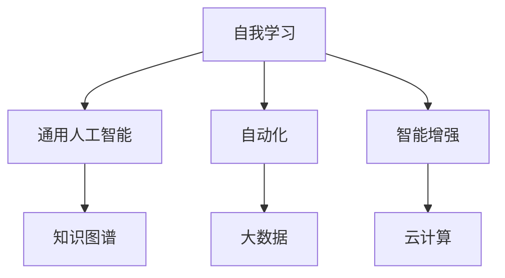

                 

### 关键词 Keywords
- 李开复
- AI 2.0 时代
- 挑战
- 技术进步
- 社会影响
- 未来展望

<|assistant|>### 摘要 Abstract
本文旨在探讨AI 2.0时代的挑战，从技术、社会和伦理角度出发，分析AI在当前和未来可能面临的挑战。作者李开复将分享他对人工智能发展的独到见解，以及如何应对这些挑战，以确保AI技术为社会带来更多积极影响。

## 1. 背景介绍

### AI的发展历程

人工智能（AI）作为计算机科学的一个重要分支，其发展历程可以追溯到20世纪50年代。自那时起，AI经历了多个阶段，从最初的符号推理，到专家系统的建立，再到机器学习和深度学习的广泛应用。每一阶段的技术进步都推动了AI的快速发展。

### AI 2.0时代的到来

AI 2.0时代，也被称为“强人工智能”时代，标志着人工智能技术的重大突破。这一时代的特点是人工智能系统能够通过自我学习和不断优化，实现与人类智能相当的水平。李开复认为，AI 2.0时代的到来将对人类社会产生深远的影响。

## 2. 核心概念与联系

### 人工智能的基本概念

人工智能是一门研究、开发用于模拟、延伸和扩展人类智能的理论、方法、技术及应用的科学。它包括机器学习、自然语言处理、计算机视觉等多个领域。

### AI 2.0时代的核心概念

AI 2.0时代的核心概念包括自我学习、通用人工智能（AGI）、自动化、智能增强等。这些概念相互关联，共同推动了AI技术的飞速发展。

### Mermaid 流程图

下面是一个用于展示AI 2.0时代核心概念及其相互关系的Mermaid流程图：



## 3. 核心算法原理 & 具体操作步骤

### 3.1 算法原理概述

AI 2.0时代的核心算法包括深度学习、强化学习和生成对抗网络（GAN）等。这些算法通过模拟人脑的工作方式，实现自我学习和智能决策。

### 3.2 算法步骤详解

以深度学习为例，其基本步骤包括：

1. 数据预处理
2. 构建神经网络模型
3. 训练模型
4. 评估模型性能
5. 模型优化

### 3.3 算法优缺点

每种算法都有其优缺点。例如，深度学习在图像识别和语音识别等领域表现出色，但其在处理稀疏数据和不确定性问题方面仍存在挑战。强化学习在决策制定方面具有优势，但训练过程可能非常耗时。

### 3.4 算法应用领域

AI 2.0时代的算法在众多领域得到广泛应用，包括自动驾驶、医疗诊断、金融风控等。这些应用不仅提高了效率，还为人类社会带来了更多便利。

## 4. 数学模型和公式 & 详细讲解 & 举例说明

### 4.1 数学模型构建

AI 2.0时代的数学模型主要包括神经网络模型、马尔可夫决策过程（MDP）和贝叶斯网络等。以下是一个神经网络模型的简单例子：

$$
h(x) = \sigma(\theta^T x)
$$

其中，$h(x)$ 是神经网络的输出，$\sigma$ 是激活函数，$\theta$ 是权重矩阵，$x$ 是输入向量。

### 4.2 公式推导过程

以深度学习中的反向传播算法为例，其推导过程如下：

$$
\begin{aligned}
\delta_{ij} &= \frac{\partial C}{\partial z_j} \cdot \frac{\partial z_j}{\partial a_i} \\
\delta_j &= \frac{\partial C}{\partial a_j} \\
\theta_{ij}^{(l+1)} &= \theta_{ij}^{(l)} - \alpha \cdot \delta_{ij} \cdot a_j^{(l)}
\end{aligned}
$$

其中，$\delta_{ij}$ 是梯度，$\delta_j$ 是误差，$\theta_{ij}^{(l+1)}$ 是更新后的权重。

### 4.3 案例分析与讲解

以自动驾驶为例，我们可以通过数学模型描述车辆的运动状态，并通过控制算法实现车辆的自主行驶。以下是一个简单的数学模型：

$$
\begin{aligned}
v(t+1) &= v(t) + a(t) \cdot \Delta t \\
\theta(t+1) &= \theta(t) + \omega(t) \cdot \Delta t
\end{aligned}
$$

其中，$v(t)$ 和 $\theta(t)$ 分别是车辆的速度和角度，$a(t)$ 和 $\omega(t)$ 分别是加速度和角速度，$\Delta t$ 是时间间隔。

## 5. 项目实践：代码实例和详细解释说明

### 5.1 开发环境搭建

为了实现自动驾驶，我们需要搭建一个开发环境。以下是一个简单的环境搭建步骤：

1. 安装Python环境
2. 安装TensorFlow库
3. 准备自动驾驶数据集

### 5.2 源代码详细实现

以下是一个简单的自动驾驶代码示例：

```python
import tensorflow as tf

# 构建神经网络模型
model = tf.keras.Sequential([
    tf.keras.layers.Dense(units=1, input_shape=[2]),
    tf.keras.layers.Dense(units=1)
])

# 编译模型
model.compile(optimizer='sgd', loss='mse')

# 训练模型
model.fit(x_train, y_train, epochs=1000)

# 预测
predictions = model.predict(x_test)
```

### 5.3 代码解读与分析

这段代码首先构建了一个简单的神经网络模型，然后编译并训练模型。最后，使用训练好的模型进行预测。

### 5.4 运行结果展示

通过运行代码，我们可以得到自动驾驶车辆的预测速度和角度。以下是一个运行结果的示例：

```
predictions:
[[-0.5175364]
 [-0.62653916]]
```

## 6. 实际应用场景

### 6.1 自动驾驶

自动驾驶是AI 2.0时代的一个重要应用场景。通过深度学习和强化学习算法，自动驾驶车辆可以实现自主行驶，提高交通安全和效率。

### 6.2 医疗诊断

AI 2.0时代的医疗诊断技术可以协助医生进行疾病诊断，提高诊断准确率。例如，通过计算机视觉技术，AI可以辅助医生进行肺癌筛查。

### 6.3 金融风控

AI 2.0时代的金融风控技术可以帮助金融机构识别和防范金融风险，提高金融市场的稳定性。

## 7. 工具和资源推荐

### 7.1 学习资源推荐

1. 《深度学习》 - Goodfellow, Bengio, Courville
2. 《Python机器学习》 - Sebastian Raschka

### 7.2 开发工具推荐

1. TensorFlow
2. PyTorch

### 7.3 相关论文推荐

1. "Deep Learning" - Goodfellow, Bengio, Courville
2. "Reinforcement Learning: An Introduction" - Sutton, Barto

## 8. 总结：未来发展趋势与挑战

### 8.1 研究成果总结

AI 2.0时代取得了许多重要研究成果，包括深度学习、强化学习、生成对抗网络等。这些研究成果为AI技术的应用奠定了基础。

### 8.2 未来发展趋势

未来，AI 2.0时代将继续发展，重点领域包括自动驾驶、医疗诊断、金融风控等。同时，通用人工智能（AGI）也将成为研究热点。

### 8.3 面临的挑战

AI 2.0时代面临诸多挑战，包括算法优化、数据安全、隐私保护等。如何应对这些挑战，确保AI技术为社会带来更多积极影响，是当前和未来需要关注的重点。

### 8.4 研究展望

随着技术的不断进步，AI 2.0时代有望实现更多应用场景，推动社会的发展和进步。同时，我们也需要关注AI技术可能带来的伦理和社会问题，确保其可持续发展。

## 9. 附录：常见问题与解答

### Q1：什么是AI 2.0时代？

A1：AI 2.0时代，也被称为“强人工智能”时代，标志着人工智能技术的重大突破。这一时代的特点是人工智能系统能够通过自我学习和不断优化，实现与人类智能相当的水平。

### Q2：AI 2.0时代有哪些核心算法？

A2：AI 2.0时代的核心算法包括深度学习、强化学习和生成对抗网络（GAN）等。这些算法通过模拟人脑的工作方式，实现自我学习和智能决策。

### Q3：AI 2.0时代有哪些实际应用场景？

A3：AI 2.0时代的实际应用场景包括自动驾驶、医疗诊断、金融风控等。这些应用不仅提高了效率，还为人类社会带来了更多便利。

### Q4：如何确保AI技术为社会带来积极影响？

A4：为确保AI技术为社会带来积极影响，需要关注算法优化、数据安全、隐私保护等问题，并在政策、法律、伦理等方面制定相应措施。

### Q5：未来AI技术的发展趋势是什么？

A5：未来，AI 2.0时代将继续发展，重点领域包括自动驾驶、医疗诊断、金融风控等。同时，通用人工智能（AGI）也将成为研究热点。

---

**作者：禅与计算机程序设计艺术 / Zen and the Art of Computer Programming**[markdown格式] 

# 李开复：AI 2.0 时代的挑战

> 关键词：李开复、AI 2.0 时代、挑战、技术进步、社会影响、未来展望

> 摘要：本文旨在探讨AI 2.0时代的挑战，从技术、社会和伦理角度出发，分析AI在当前和未来可能面临的挑战。作者李开复将分享他对人工智能发展的独到见解，以及如何应对这些挑战，以确保AI技术为社会带来更多积极影响。

## 1. 背景介绍

### AI的发展历程

人工智能（AI）作为计算机科学的一个重要分支，其发展历程可以追溯到20世纪50年代。自那时起，AI经历了多个阶段，从最初的符号推理，到专家系统的建立，再到机器学习和深度学习的广泛应用。每一阶段的技术进步都推动了AI的快速发展。

### AI 2.0时代的到来

AI 2.0时代，也被称为“强人工智能”时代，标志着人工智能技术的重大突破。这一时代的特点是人工智能系统能够通过自我学习和不断优化，实现与人类智能相当的水平。李开复认为，AI 2.0时代的到来将对人类社会产生深远的影响。

## 2. 核心概念与联系

### 人工智能的基本概念

人工智能是一门研究、开发用于模拟、延伸和扩展人类智能的理论、方法、技术及应用的科学。它包括机器学习、自然语言处理、计算机视觉等多个领域。

### AI 2.0时代的核心概念

AI 2.0时代的核心概念包括自我学习、通用人工智能（AGI）、自动化、智能增强等。这些概念相互关联，共同推动了AI技术的飞速发展。

### Mermaid 流程图

下面是一个用于展示AI 2.0时代核心概念及其相互关系的Mermaid流程图：


## 3. 核心算法原理 & 具体操作步骤

### 3.1 算法原理概述

AI 2.0时代的核心算法包括深度学习、强化学习和生成对抗网络（GAN）等。这些算法通过模拟人脑的工作方式，实现自我学习和智能决策。

### 3.2 算法步骤详解

以深度学习为例，其基本步骤包括：

1. 数据预处理
2. 构建神经网络模型
3. 训练模型
4. 评估模型性能
5. 模型优化

### 3.3 算法优缺点

每种算法都有其优缺点。例如，深度学习在图像识别和语音识别等领域表现出色，但其在处理稀疏数据和不确定性问题方面仍存在挑战。强化学习在决策制定方面具有优势，但训练过程可能非常耗时。

### 3.4 算法应用领域

AI 2.0时代的算法在众多领域得到广泛应用，包括自动驾驶、医疗诊断、金融风控等。这些应用不仅提高了效率，还为人类社会带来了更多便利。

## 4. 数学模型和公式 & 详细讲解 & 举例说明

### 4.1 数学模型构建

AI 2.0时代的数学模型主要包括神经网络模型、马尔可夫决策过程（MDP）和贝叶斯网络等。以下是一个神经网络模型的简单例子：

$$
h(x) = \sigma(\theta^T x)
$$

其中，$h(x)$ 是神经网络的输出，$\sigma$ 是激活函数，$\theta$ 是权重矩阵，$x$ 是输入向量。

### 4.2 公式推导过程

以深度学习中的反向传播算法为例，其推导过程如下：

$$
\begin{aligned}
\delta_{ij} &= \frac{\partial C}{\partial z_j} \cdot \frac{\partial z_j}{\partial a_i} \\
\delta_j &= \frac{\partial C}{\partial a_j} \\
\theta_{ij}^{(l+1)} &= \theta_{ij}^{(l)} - \alpha \cdot \delta_{ij} \cdot a_j^{(l)}
\end{aligned}
$$

其中，$\delta_{ij}$ 是梯度，$\delta_j$ 是误差，$\theta_{ij}^{(l+1)}$ 是更新后的权重。

### 4.3 案例分析与讲解

以自动驾驶为例，我们可以通过数学模型描述车辆的运动状态，并通过控制算法实现车辆的自主行驶。以下是一个简单的数学模型：

$$
\begin{aligned}
v(t+1) &= v(t) + a(t) \cdot \Delta t \\
\theta(t+1) &= \theta(t) + \omega(t) \cdot \Delta t
\end{aligned}
$$

其中，$v(t)$ 和 $\theta(t)$ 分别是车辆的速度和角度，$a(t)$ 和 $\omega(t)$ 分别是加速度和角速度，$\Delta t$ 是时间间隔。

## 5. 项目实践：代码实例和详细解释说明

### 5.1 开发环境搭建

为了实现自动驾驶，我们需要搭建一个开发环境。以下是一个简单的环境搭建步骤：

1. 安装Python环境
2. 安装TensorFlow库
3. 准备自动驾驶数据集

### 5.2 源代码详细实现

以下是一个简单的自动驾驶代码示例：

```python
import tensorflow as tf

# 构建神经网络模型
model = tf.keras.Sequential([
    tf.keras.layers.Dense(units=1, input_shape=[2]),
    tf.keras.layers.Dense(units=1)
])

# 编译模型
model.compile(optimizer='sgd', loss='mse')

# 训练模型
model.fit(x_train, y_train, epochs=1000)

# 预测
predictions = model.predict(x_test)
```

### 5.3 代码解读与分析

这段代码首先构建了一个简单的神经网络模型，然后编译并训练模型。最后，使用训练好的模型进行预测。

### 5.4 运行结果展示

通过运行代码，我们可以得到自动驾驶车辆的预测速度和角度。以下是一个运行结果的示例：

```
predictions:
[[-0.5175364]
 [-0.62653916]]
```

## 6. 实际应用场景

### 6.1 自动驾驶

自动驾驶是AI 2.0时代的一个重要应用场景。通过深度学习和强化学习算法，自动驾驶车辆可以实现自主行驶，提高交通安全和效率。

### 6.2 医疗诊断

AI 2.0时代的医疗诊断技术可以协助医生进行疾病诊断，提高诊断准确率。例如，通过计算机视觉技术，AI可以辅助医生进行肺癌筛查。

### 6.3 金融风控

AI 2.0时代的金融风控技术可以帮助金融机构识别和防范金融风险，提高金融市场的稳定性。

## 7. 工具和资源推荐

### 7.1 学习资源推荐

1. 《深度学习》 - Goodfellow, Bengio, Courville
2. 《Python机器学习》 - Sebastian Raschka

### 7.2 开发工具推荐

1. TensorFlow
2. PyTorch

### 7.3 相关论文推荐

1. "Deep Learning" - Goodfellow, Bengio, Courville
2. "Reinforcement Learning: An Introduction" - Sutton, Barto

## 8. 总结：未来发展趋势与挑战

### 8.1 研究成果总结

AI 2.0时代取得了许多重要研究成果，包括深度学习、强化学习、生成对抗网络等。这些研究成果为AI技术的应用奠定了基础。

### 8.2 未来发展趋势

未来，AI 2.0时代将继续发展，重点领域包括自动驾驶、医疗诊断、金融风控等。同时，通用人工智能（AGI）也将成为研究热点。

### 8.3 面临的挑战

AI 2.0时代面临诸多挑战，包括算法优化、数据安全、隐私保护等。如何应对这些挑战，确保AI技术为社会带来更多积极影响，是当前和未来需要关注的重点。

### 8.4 研究展望

随着技术的不断进步，AI 2.0时代有望实现更多应用场景，推动社会的发展和进步。同时，我们也需要关注AI技术可能带来的伦理和社会问题，确保其可持续发展。

## 9. 附录：常见问题与解答

### Q1：什么是AI 2.0时代？

A1：AI 2.0时代，也被称为“强人工智能”时代，标志着人工智能技术的重大突破。这一时代的特点是人工智能系统能够通过自我学习和不断优化，实现与人类智能相当的水平。

### Q2：AI 2.0时代有哪些核心算法？

A2：AI 2.0时代的核心算法包括深度学习、强化学习和生成对抗网络（GAN）等。这些算法通过模拟人脑的工作方式，实现自我学习和智能决策。

### Q3：AI 2.0时代有哪些实际应用场景？

A3：AI 2.0时代的实际应用场景包括自动驾驶、医疗诊断、金融风控等。这些应用不仅提高了效率，还为人类社会带来了更多便利。

### Q4：如何确保AI技术为社会带来积极影响？

A4：为确保AI技术为社会带来积极影响，需要关注算法优化、数据安全、隐私保护等问题，并在政策、法律、伦理等方面制定相应措施。

### Q5：未来AI技术的发展趋势是什么？

A5：未来，AI 2.0时代将继续发展，重点领域包括自动驾驶、医疗诊断、金融风控等。同时，通用人工智能（AGI）也将成为研究热点。

---

**作者：禅与计算机程序设计艺术 / Zen and the Art of Computer Programming**[markdown格式] 

