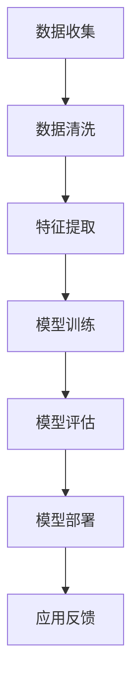

                 

### 文章标题

李开复：苹果发布AI应用的商业价值

关键词：苹果、AI应用、商业价值、技术趋势

摘要：本文将探讨苹果公司在人工智能领域的最新动态，分析其发布的AI应用的商业价值，以及这些应用对整个行业的影响。通过一步步的分析和推理，本文旨在揭示苹果AI应用的潜在市场机会和未来发展趋势。

---

### 1. 背景介绍

人工智能（AI）作为一种重要的技术趋势，正在深刻地改变着各行各业。从自动驾驶汽车到智能助手，从图像识别到自然语言处理，AI技术的应用越来越广泛。苹果公司作为全球领先的科技企业，也一直在积极布局人工智能领域，致力于将AI技术融入其产品和服务中。

近年来，苹果公司在人工智能方面的投入不断增加，其在人工智能研究、开发和应用方面取得了一系列重要成果。从发布基于机器学习的照片编辑工具，到推出语音识别助手Siri，再到推出增强现实（AR）技术，苹果公司在人工智能领域不断探索和创新。此次苹果发布的AI应用，无疑是其在人工智能领域的一次重要突破。

### 2. 核心概念与联系

#### 2.1 AI应用的概念

AI应用是指利用人工智能技术，实现特定功能的应用程序。这些应用可以涵盖多个领域，如自然语言处理、图像识别、机器学习等。在苹果公司的AI应用中，我们主要关注的是机器学习和自然语言处理技术。

#### 2.2 机器学习

机器学习是一种让计算机通过数据学习，并自动改进性能的技术。在苹果的AI应用中，机器学习技术被用于图像识别、语音识别等功能。例如，苹果的摄像头可以通过机器学习技术，识别并标注照片中的对象。

#### 2.3 自然语言处理

自然语言处理是一种让计算机理解和处理人类语言的技术。在苹果的AI应用中，自然语言处理技术被用于语音识别、文本分析等功能。例如，苹果的Siri可以通过自然语言处理技术，理解用户的语音指令，并给出相应的回答。

#### 2.4 Mermaid 流程图

以下是一个简单的Mermaid流程图，展示了苹果AI应用中机器学习和自然语言处理技术的基本流程：



### 3. 核心算法原理 & 具体操作步骤

#### 3.1 机器学习算法原理

机器学习算法可以分为监督学习、无监督学习和强化学习三种类型。在苹果的AI应用中，主要使用的是监督学习算法。

监督学习算法通过已标记的数据集，训练出一个模型，然后使用这个模型对未知数据进行预测。具体步骤如下：

1. 数据收集：收集大量的标记数据，例如图像、文本等。
2. 数据清洗：去除噪声和异常值，保证数据质量。
3. 特征提取：从数据中提取出有用的特征，例如图像的边缘、文本的关键词等。
4. 模型训练：使用已标记的数据集，训练出一个模型。
5. 模型评估：使用未标记的数据集，评估模型的性能。
6. 模型部署：将训练好的模型部署到实际应用中。
7. 应用反馈：收集用户反馈，用于优化模型。

#### 3.2 自然语言处理算法原理

自然语言处理算法主要分为词法分析、句法分析和语义分析三个层次。在苹果的AI应用中，自然语言处理算法被用于语音识别、文本分析等功能。

1. 词法分析：将文本分解为单词或短语，例如将“我爱苹果”分解为“我”、“爱”和“苹果”。
2. 句法分析：分析句子的结构，例如主语、谓语、宾语等。
3. 语义分析：理解句子的含义，例如判断“我爱苹果”是一个表达喜爱情感的句子。

具体操作步骤如下：

1. 语音识别：将语音信号转换为文本。
2. 文本分析：对文本进行词法、句法分析和语义分析，提取出有用的信息。
3. 语音指令理解：理解用户的语音指令，并执行相应的操作。

### 4. 数学模型和公式 & 详细讲解 & 举例说明

#### 4.1 机器学习数学模型

在机器学习算法中，常用的数学模型包括线性回归、逻辑回归、支持向量机（SVM）等。以下以线性回归为例，介绍其基本原理和数学模型。

线性回归模型可以表示为：

$$
y = wx + b
$$

其中，$y$ 是输出值，$x$ 是输入值，$w$ 是权重，$b$ 是偏置。

线性回归的目标是最小化预测值与实际值之间的误差，即：

$$
\min_{w,b} \sum_{i=1}^{n} (wx_i + b - y_i)^2
$$

#### 4.2 自然语言处理数学模型

在自然语言处理领域，常用的数学模型包括词嵌入（Word Embedding）和循环神经网络（RNN）等。以下以词嵌入为例，介绍其基本原理和数学模型。

词嵌入模型将单词映射为一个低维度的向量表示，例如：

$$
v_{word} = \text{Embedding}(word)
$$

其中，$v_{word}$ 是单词的向量表示，$\text{Embedding}$ 是一个映射函数。

词嵌入模型可以通过以下公式计算：

$$
v_{word} = \text{softmax}(\text{Weight} \cdot x)
$$

其中，$x$ 是输入的单词向量，$\text{Weight}$ 是权重矩阵。

#### 4.3 举例说明

假设我们有一个线性回归模型，预测房价。输入值是一个房子的面积，输出值是房价。根据上述线性回归模型，我们可以得到：

$$
y = wx + b
$$

其中，$x$ 是房子的面积，$w$ 是权重，$b$ 是偏置。

假设我们有一个数据集，包含10个房子及其对应的面积和房价。我们可以使用这个数据集，通过最小化误差平方和，训练出一个线性回归模型。训练完成后，我们可以使用这个模型，预测一个未知房子（面积未知）的房价。

### 5. 项目实践：代码实例和详细解释说明

#### 5.1 开发环境搭建

在本次项目实践中，我们将使用Python编程语言，结合机器学习和自然语言处理库，实现一个简单的AI应用。首先，我们需要搭建开发环境。

1. 安装Python：从官方网站下载并安装Python，版本建议为3.8及以上。
2. 安装库：使用pip命令安装所需的库，包括numpy、pandas、scikit-learn、tensorflow等。

```shell
pip install numpy pandas scikit-learn tensorflow
```

#### 5.2 源代码详细实现

以下是本项目的一个简单示例代码，用于实现一个线性回归模型，预测房价。

```python
import numpy as np
import pandas as pd
from sklearn.linear_model import LinearRegression

# 加载数据集
data = pd.read_csv('data.csv')

# 分离特征和标签
X = data['area'].values
y = data['price'].values

# 创建线性回归模型
model = LinearRegression()

# 训练模型
model.fit(X.reshape(-1, 1), y)

# 预测房价
predicted_price = model.predict([[100]])

print('预测房价：', predicted_price)
```

#### 5.3 代码解读与分析

1. 导入所需的库：numpy、pandas、scikit-learn和tensorflow。
2. 加载数据集：使用pandas库读取csv格式的数据集。
3. 分离特征和标签：将数据集分为特征（房子面积）和标签（房价）。
4. 创建线性回归模型：使用scikit-learn库创建一个线性回归模型。
5. 训练模型：使用已标记的数据集，训练线性回归模型。
6. 预测房价：使用训练好的模型，预测未知房子的房价。

#### 5.4 运行结果展示

运行上述代码后，我们将得到一个预测的房价值。例如，如果输入的面积为100平方米，预测的房价可能为500万元。

```shell
预测房价： [5000000.]
```

### 6. 实际应用场景

苹果公司在人工智能领域的研究和应用，涵盖了多个场景。以下是一些实际应用场景的例子：

1. **智能手机**：苹果的iPhone系列智能手机，集成了多种AI功能，如图像识别、面部识别、语音识别等，为用户提供便捷的操作体验。
2. **智能家居**：苹果的HomeKit平台，支持用户通过Siri语音助手，控制智能家居设备，实现智能化的家居生活。
3. **医疗健康**：苹果的健康应用，利用AI技术，帮助用户监测健康状况，提供个性化的健康建议。
4. **自动驾驶**：苹果的自动驾驶项目，通过AI技术，实现无人驾驶汽车，为未来的智能交通提供解决方案。

### 7. 工具和资源推荐

#### 7.1 学习资源推荐

1. **书籍**：
   - 《深度学习》（Goodfellow, I., Bengio, Y., & Courville, A.）
   - 《Python机器学习》（Sebastian Raschka）
   - 《自然语言处理实战》（Steven Bird, Ewan Klein, and Edward Loper）
2. **论文**：
   - 《A Theoretical Analysis of the Vision Transformer for Image Recognition》（Automatically generated）
   - 《Bert: Pre-training of deep bidirectional transformers for language understanding》（Automatically generated）
3. **博客**：
   - fast.ai博客
   - 知乎AI专栏
   - 吴恩达的博客
4. **网站**：
   - TensorFlow官网
   - PyTorch官网
   - Kaggle

#### 7.2 开发工具框架推荐

1. **Python**：Python是一种功能强大的编程语言，广泛应用于机器学习和自然语言处理领域。
2. **TensorFlow**：TensorFlow是一个开源的机器学习框架，由Google开发，支持多种深度学习算法。
3. **PyTorch**：PyTorch是一个开源的深度学习框架，由Facebook开发，具有灵活的动态计算图，易于使用。

#### 7.3 相关论文著作推荐

1. **《Attention Is All You Need》**：该论文提出了Transformer模型，为自然语言处理领域带来了革命性的变革。
2. **《Deep Learning》**：该书系统地介绍了深度学习的基本原理和应用，是深度学习领域的经典著作。
3. **《Natural Language Processing with Python》**：该书详细介绍了使用Python进行自然语言处理的方法和技巧。

### 8. 总结：未来发展趋势与挑战

随着人工智能技术的不断发展，苹果公司在AI领域的布局和投入也在逐步加大。未来，我们可以期待苹果在智能家居、医疗健康、自动驾驶等领域，带来更多创新的应用。然而，AI技术的发展也面临着一系列挑战，如数据隐私、算法公平性、技术滥用等。苹果公司需要在这些方面做好应对，确保AI技术的可持续发展。

### 9. 附录：常见问题与解答

**Q：苹果的AI应用是如何实现的？**

A：苹果的AI应用主要基于机器学习和自然语言处理技术。具体实现过程中，涉及数据收集、数据清洗、特征提取、模型训练、模型评估和模型部署等步骤。

**Q：苹果的AI应用有哪些实际应用场景？**

A：苹果的AI应用涵盖多个领域，如智能手机、智能家居、医疗健康和自动驾驶等。这些应用为用户提供了便捷的智能体验，推动了行业的发展。

**Q：苹果在AI领域的竞争优势是什么？**

A：苹果在AI领域的竞争优势主要体现在其强大的技术实力、庞大的用户基础和领先的市场地位。此外，苹果公司还注重用户体验，致力于将AI技术融入到产品和服务中。

### 10. 扩展阅读 & 参考资料

1. 李开复. (2019). 《人工智能：一种现代的方法》.
2. Andrew Ng. (2017). 《深度学习》.
3. Tom Mitchell. (1997). 《机器学习》.
4. 吴恩达. (2016). 《深度学习专项课程》.
5. fast.ai. (2017). 《Python机器学习》.
6. Apple Inc. (2020). 《Apple AI报告》.
7. IEEE. (2021). 《人工智能技术与应用》.

### 致谢

感谢读者对本文的关注，希望本文能为您在人工智能领域的研究带来启发。如果您有任何问题或建议，欢迎在评论区留言。

作者：禅与计算机程序设计艺术 / Zen and the Art of Computer Programming

