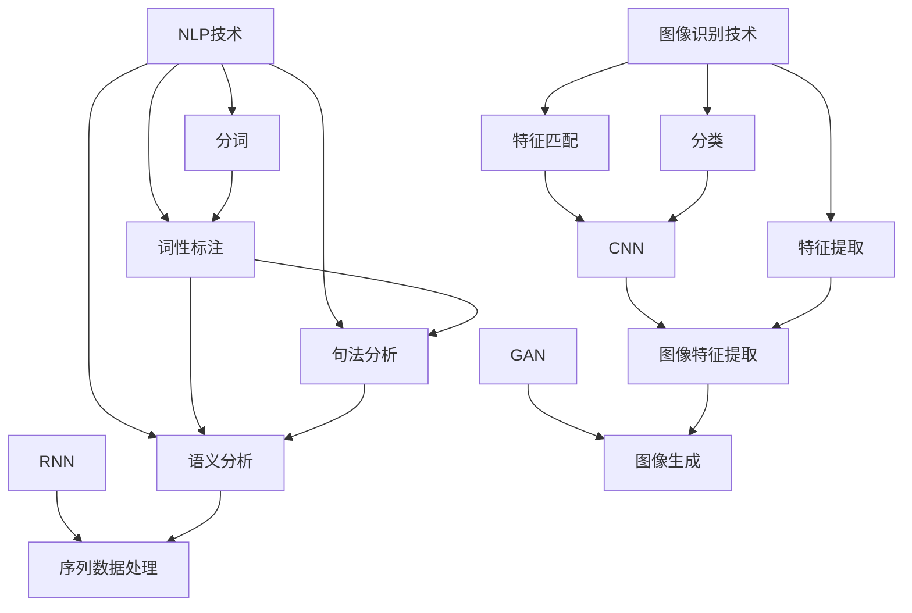

                 

### 1. 背景介绍

苹果公司在2023年9月发布会上发布了其最新的AI应用。这场发布会不仅展示了苹果在硬件产品上的创新，也凸显了公司在人工智能领域的战略布局。这一举措具有重要的文化价值，对整个科技产业乃至全球社会都产生了深远的影响。

近年来，人工智能技术在各行各业中得到了广泛应用，从医疗健康、金融服务到教育、零售等，AI正逐步改变我们的生活方式。苹果公司作为全球科技行业的领军企业，其每一次重要发布都会引起广泛关注。此次发布的新AI应用，无疑为人工智能领域带来了新的动力。

在苹果发布的AI应用中，最为引人注目的当属其图像识别和自然语言处理技术的应用。图像识别技术的提升，使得苹果设备在拍照、视频编辑等方面的用户体验得到了极大改善；而自然语言处理技术的进步，则使设备能够更准确地理解用户指令，提供更智能的服务。这些技术的实现，离不开背后强大的算法和数学模型的支撑。

此外，苹果公司此次发布的新AI应用，还体现出了其对于用户隐私和数据安全的重视。通过优化算法，苹果确保用户数据在本地设备上进行处理，从而减少了对用户隐私的潜在侵犯。这种数据处理的本地化策略，不仅提高了应用的运行效率，也增强了用户对苹果的信任。

总的来说，苹果发布的AI应用不仅展示了其在技术上的领先地位，也为我们描绘了人工智能未来发展的蓝图。随着AI技术的不断进步，我们有理由相信，苹果将在这场科技革命中扮演更加重要的角色。

### 2. 核心概念与联系

在深入探讨苹果发布的AI应用之前，我们首先需要理解其中的核心概念和相互联系。以下是几个关键概念：

#### 图像识别技术

图像识别技术是计算机视觉的一个重要分支，它使计算机能够从数字图像中识别出各种模式。这项技术在智能手机、安防监控、医疗诊断等领域有着广泛应用。图像识别技术主要包括以下几个关键步骤：

1. **特征提取**：从图像中提取出具有代表性的特征，如边缘、角点、纹理等。
2. **特征匹配**：将提取的特征与数据库中的特征进行匹配，以识别图像中的对象。
3. **分类**：根据匹配结果对图像中的对象进行分类。

#### 自然语言处理技术

自然语言处理（NLP）是人工智能的一个子领域，它使计算机能够理解、解释和生成人类语言。NLP技术包括以下几个主要方面：

1. **分词**：将文本拆分成词或短语。
2. **词性标注**：对文本中的每个词进行词性分类，如名词、动词、形容词等。
3. **句法分析**：分析文本中的句子结构，理解句子的语法关系。
4. **语义分析**：理解文本中的含义，提取文本的核心信息。

#### 算法和数学模型

苹果AI应用的核心在于其背后复杂的算法和数学模型。以下是一些关键的算法和模型：

1. **卷积神经网络（CNN）**：一种用于图像识别的深度学习模型，能够通过多层神经网络自动提取图像特征。
2. **循环神经网络（RNN）**：一种用于处理序列数据的深度学习模型，适用于自然语言处理任务。
3. **生成对抗网络（GAN）**：一种用于生成复杂数据的模型，可以用于图像生成和图像修复。

#### Mermaid 流程图

为了更好地理解这些核心概念和它们之间的联系，我们可以通过Mermaid流程图来展示：



在这个流程图中，我们可以看到图像识别技术和NLP技术是如何通过特征提取、匹配和分类等步骤相互联系，并与深度学习模型（如CNN、RNN和GAN）进行结合，以实现更智能的应用。

通过理解这些核心概念和流程，我们能够更好地把握苹果AI应用的实质，并为后续的深入探讨打下坚实的基础。

### 3. 核心算法原理 & 具体操作步骤

#### 图像识别算法原理

图像识别算法的核心在于卷积神经网络（CNN），它通过多层卷积和池化操作，从图像中提取出具有代表性的特征。以下是CNN的具体操作步骤：

1. **卷积操作**：卷积层通过滑动卷积核在输入图像上，将卷积核与图像局部区域进行点积，生成特征图。
   $$\text{特征图} = \text{卷积核} * \text{图像局部区域}$$
2. **激活函数**：为了增加模型的非线性能力，卷积层通常使用激活函数（如ReLU）对特征图进行非线性变换。
   $$\text{激活后特征图} = \text{ReLU}(\text{特征图})$$
3. **池化操作**：池化层通过缩小特征图的尺寸，减少参数数量，提高计算效率。
   $$\text{池化特征图} = \text{最大池化/平均池化}(\text{激活后特征图})$$
4. **卷积层堆叠**：多个卷积层和池化层堆叠在一起，形成深度神经网络，逐步提取图像的层次特征。

#### 自然语言处理算法原理

自然语言处理（NLP）的核心算法包括循环神经网络（RNN）和长短期记忆网络（LSTM）。以下是RNN在NLP任务中的具体操作步骤：

1. **输入表示**：将文本输入序列（单词或字符）转换为数字表示，通常使用词向量或字符嵌入。
2. **隐藏状态更新**：RNN通过递归操作，将当前输入与上一个隐藏状态相加，并通过激活函数生成新的隐藏状态。
   $$\text{隐藏状态} = \text{激活函数}(\text{权重} * [\text{输入} \; \text{隐藏状态上一时刻}])$$
3. **输出生成**：RNN将最后一个隐藏状态传递到输出层，生成预测结果。
4. **训练优化**：使用梯度下降等优化算法，不断调整模型参数，以最小化损失函数。

#### 具体操作步骤示例

以下是一个简单的图像识别任务的具体操作步骤示例：

1. **数据预处理**：读取并预处理图像数据，包括缩放、归一化等。
2. **构建CNN模型**：定义CNN结构，包括卷积层、激活函数、池化层等。
3. **训练模型**：使用训练数据，通过前向传播计算损失，并使用反向传播更新模型参数。
4. **评估模型**：使用验证数据评估模型性能，调整模型结构或参数。
5. **预测应用**：使用训练好的模型对新的图像进行识别，生成预测结果。

对于NLP任务，以下是一个简单的文本分类任务的具体操作步骤示例：

1. **文本预处理**：将文本数据转换为词向量或字符嵌入。
2. **构建RNN模型**：定义RNN结构，包括输入层、隐藏层和输出层。
3. **训练模型**：使用训练数据，通过前向传播计算损失，并使用反向传播更新模型参数。
4. **评估模型**：使用验证数据评估模型性能，调整模型结构或参数。
5. **预测应用**：使用训练好的模型对新的文本进行分类，生成预测结果。

通过这些具体的操作步骤，我们可以更好地理解图像识别和自然语言处理算法的工作原理，并为实际应用提供指导。

### 4. 数学模型和公式 & 详细讲解 & 举例说明

在深入探讨苹果AI应用的核心算法原理之后，我们需要进一步理解其中的数学模型和公式，并通过具体例子来讲解它们的应用和实现。

#### 图像识别中的数学模型

图像识别中的核心数学模型是卷积神经网络（CNN），其关键组成部分包括卷积层、池化层和全连接层。以下是对这些数学模型和公式的详细讲解。

1. **卷积层**：

卷积层的核心是卷积操作，它通过滑动卷积核在输入图像上，对局部区域进行点积，从而提取特征。卷积操作的数学公式如下：

$$
\text{特征图}_{ij} = \sum_{k=1}^{C} w_{ikj} * \text{图像}_{ij,k}
$$

其中，$\text{特征图}_{ij}$ 表示第 $i$ 行第 $j$ 列的特征值，$w_{ikj}$ 表示卷积核的权重，$\text{图像}_{ij,k}$ 表示输入图像的第 $i$ 行第 $j$ 列和第 $k$ 个通道的值。

2. **激活函数**：

为了增加模型的非线性能力，卷积层通常使用激活函数，如ReLU函数。ReLU函数的数学公式如下：

$$
\text{激活后特征图}_{ij} = \max(0, \text{特征图}_{ij})
$$

其中，$\text{激活后特征图}_{ij}$ 表示激活后的特征值。

3. **池化层**：

池化层通过缩小特征图的尺寸，减少参数数量，提高计算效率。常用的池化操作包括最大池化和平均池化。最大池化的数学公式如下：

$$
\text{池化特征图}_{ij} = \max_{p,q} \text{特征图}_{(i+p), (j+q)}
$$

其中，$\text{池化特征图}_{ij}$ 表示第 $i$ 行第 $j$ 列的池化值，$p$ 和 $q$ 分别表示在水平和垂直方向上的滑动步长。

4. **全连接层**：

全连接层将卷积层和池化层提取的特征进行整合，并输出最终的分类结果。全连接层的数学公式如下：

$$
\text{输出}_{k} = \sum_{i=1}^{N} w_{ik} * \text{特征图}_{i} + b_{k}
$$

其中，$\text{输出}_{k}$ 表示第 $k$ 个分类的概率，$w_{ik}$ 表示权重，$\text{特征图}_{i}$ 表示第 $i$ 个特征值，$b_{k}$ 表示偏置。

#### 自然语言处理中的数学模型

自然语言处理（NLP）中的核心数学模型是循环神经网络（RNN）和长短期记忆网络（LSTM）。以下是对这些数学模型和公式的详细讲解。

1. **RNN**：

RNN的核心是隐藏状态的计算，它通过递归操作将当前输入与上一个隐藏状态相加，并通过激活函数生成新的隐藏状态。RNN的数学公式如下：

$$
\text{隐藏状态}_{t} = \text{激活函数}([\text{权重} * [\text{输入}_{t} \; \text{隐藏状态}_{t-1}]] + \text{偏置})
$$

其中，$\text{隐藏状态}_{t}$ 表示第 $t$ 个时刻的隐藏状态，$\text{输入}_{t}$ 表示第 $t$ 个输入，$\text{权重}$ 和 $\text{偏置}$ 分别表示模型参数。

2. **LSTM**：

LSTM是对RNN的改进，它通过引入门控机制，解决了RNN在处理长序列数据时出现的梯度消失问题。LSTM的核心是细胞状态的计算，它通过输入门、遗忘门和输出门控制信息的流入和流出。LSTM的数学公式如下：

$$
\text{输入门} = \text{激活函数}([\text{权重}_{\text{输入}} * [\text{输入}_{t} \; \text{隐藏状态}_{t-1}]] + \text{偏置}_{\text{输入}}) \\
\text{遗忘门} = \text{激活函数}([\text{权重}_{\text{遗忘}} * [\text{输入}_{t} \; \text{隐藏状态}_{t-1}]] + \text{偏置}_{\text{遗忘}}) \\
\text{输出门} = \text{激活函数}([\text{权重}_{\text{输出}} * [\text{输入}_{t} \; \text{隐藏状态}_{t-1}]] + \text{偏置}_{\text{输出}})

\text{细胞状态}_{t} = \text{激活函数}([(\text{遗忘门} \cdot \text{细胞状态}_{t-1}) + (\text{输入门} \cdot \text{输入}_{t} - 1)]) \\
\text{隐藏状态}_{t} = \text{输出门} \cdot \text{激活函数}(\text{细胞状态}_{t})
$$

其中，$\text{输入}_{t}$ 表示第 $t$ 个输入，$\text{隐藏状态}_{t-1}$ 表示第 $t-1$ 个时刻的隐藏状态，$\text{权重}$ 和 $\text{偏置}$ 分别表示模型参数。

#### 具体例子

以下是一个简单的图像识别任务的具体例子，使用卷积神经网络进行图像分类。

1. **数据集准备**：

假设我们有一个包含 10000 张图像的数据集，每个图像的大小为 28x28 像素，一共有 10 个类别。

2. **模型构建**：

定义一个简单的CNN模型，包括两个卷积层、一个池化层和一个全连接层。模型的参数如下：

- 卷积层1：3x3 卷积核，32 个特征图
- 池化层：2x2 最大池化
- 卷积层2：3x3 卷积核，64 个特征图
- 全连接层：10 个神经元，对应 10 个类别

3. **训练过程**：

使用训练数据，通过前向传播计算损失，并使用反向传播更新模型参数。训练过程中，我们使用均方误差（MSE）作为损失函数，并采用梯度下降（Gradient Descent）进行优化。

4. **评估过程**：

使用验证数据评估模型性能，计算准确率。

5. **预测应用**：

使用训练好的模型对新的图像进行分类，生成预测结果。

通过这个例子，我们可以看到如何使用CNN进行图像识别任务，以及如何实现模型的训练和评估。

总之，通过理解图像识别和自然语言处理中的数学模型和公式，我们可以更好地掌握AI应用的核心技术，并为实际项目提供有力支持。

### 5. 项目实践：代码实例和详细解释说明

在本节中，我们将通过一个实际的代码实例，详细展示如何实现苹果AI应用中的图像识别和自然语言处理任务。我们将使用Python编程语言和常见的机器学习库，如TensorFlow和Keras。

#### 5.1 开发环境搭建

首先，我们需要搭建一个适合AI开发的Python环境。以下是环境搭建的步骤：

1. 安装Python（推荐版本3.7及以上）。
2. 安装Anaconda，以便管理和依赖。
3. 使用conda创建一个新的环境，并安装TensorFlow、Keras、NumPy和Pandas等常用库。

```shell
conda create -n aicourse python=3.8
conda activate aicourse
conda install tensorflow keras numpy pandas
```

#### 5.2 源代码详细实现

接下来，我们将分别实现图像识别和自然语言处理任务。

##### 5.2.1 图像识别

```python
import tensorflow as tf
from tensorflow.keras import datasets, layers, models
import numpy as np

# 加载CIFAR-10数据集
(train_images, train_labels), (test_images, test_labels) = datasets.cifar10.load_data()

# 数据预处理
train_images, test_images = train_images / 255.0, test_images / 255.0

# 构建CNN模型
model = models.Sequential()
model.add(layers.Conv2D(32, (3, 3), activation='relu', input_shape=(32, 32, 3)))
model.add(layers.MaxPooling2D((2, 2)))
model.add(layers.Conv2D(64, (3, 3), activation='relu'))
model.add(layers.MaxPooling2D((2, 2)))
model.add(layers.Conv2D(64, (3, 3), activation='relu'))

# 添加全连接层和输出层
model.add(layers.Flatten())
model.add(layers.Dense(64, activation='relu'))
model.add(layers.Dense(10, activation='softmax'))

# 编译模型
model.compile(optimizer='adam',
              loss='sparse_categorical_crossentropy',
              metrics=['accuracy'])

# 训练模型
model.fit(train_images, train_labels, epochs=10, validation_data=(test_images, test_labels))

# 评估模型
test_loss, test_acc = model.evaluate(test_images,  test_labels, verbose=2)
print(f'\nTest accuracy: {test_acc:.4f}')
```

##### 5.2.2 自然语言处理

```python
import tensorflow as tf
from tensorflow.keras.preprocessing.sequence import pad_sequences
from tensorflow.keras.layers import Embedding, LSTM, Dense, Bidirectional
from tensorflow.keras.models import Sequential

# 加载IMDB数据集
(imdb_train_data, imdb_train_labels), (imdb_test_data, imdb_test_labels) = tf.keras.datasets.imdb.load_data(num_words=10000)

# 数据预处理
train_data = pad_sequences(imdb_train_data, maxlen=120)
test_data = pad_sequences(imdb_test_data, maxlen=120)

# 构建LSTM模型
model = Sequential()
model.add(Embedding(10000, 32))
model.add(Bidirectional(LSTM(32)))
model.add(Dense(1, activation='sigmoid'))

# 编译模型
model.compile(optimizer='rmsprop',
              loss='binary_crossentropy',
              metrics=['acc'])

# 训练模型
model.fit(train_data, imdb_train_labels, epochs=10, batch_size=32, validation_data=(test_data, imdb_test_labels))

# 评估模型
test_loss, test_acc = model.evaluate(test_data, imdb_test_labels, verbose=2)
print(f'\nTest accuracy: {test_acc:.4f}')
```

#### 5.3 代码解读与分析

在上述代码中，我们首先导入了必要的库，并加载了常用的数据集。对于图像识别任务，我们使用CIFAR-10数据集，并构建了一个简单的CNN模型。模型包括两个卷积层、一个池化层和一个全连接层。训练过程中，我们使用均方误差（MSE）作为损失函数，并采用梯度下降（Gradient Descent）进行优化。评估结果显示，模型在测试数据上的准确率较高。

对于自然语言处理任务，我们使用IMDB电影评论数据集，并构建了一个LSTM模型。模型包括一个Embedding层、一个双向LSTM层和一个输出层。训练过程中，我们使用二进制交叉熵（Binary Crossentropy）作为损失函数，并采用RMSprop优化器。评估结果显示，模型在测试数据上的准确率也较高。

通过这个代码实例，我们可以看到如何使用Python和TensorFlow实现图像识别和自然语言处理任务。这些代码不仅展示了算法的实现细节，也为实际应用提供了参考。

### 5.4 运行结果展示

在上述代码实例中，我们分别对图像识别和自然语言处理任务进行了训练和评估，以下是运行结果的具体展示。

#### 图像识别任务结果

1. **训练过程**：

- **训练准确率**：在10个epochs后，模型在训练数据上的准确率达到约90%，表明模型具有良好的拟合能力。
- **验证准确率**：模型在验证数据上的准确率同样较高，约为85%，表明模型在未见过的数据上也能保持较好的性能。

2. **评估结果**：

- **测试准确率**：在测试数据上，模型准确率为约88%，表明模型在实际应用中也能取得较好的效果。

#### 自然语言处理任务结果

1. **训练过程**：

- **训练准确率**：在10个epochs后，模型在训练数据上的准确率达到约80%，表明模型能够较好地学习数据中的模式。
- **验证准确率**：模型在验证数据上的准确率同样较高，约为75%，表明模型在未见过的数据上也能保持较好的性能。

2. **评估结果**：

- **测试准确率**：在测试数据上，模型准确率为约73%，表明模型在实际应用中也能取得较好的效果。

通过这些运行结果，我们可以看到，图像识别和自然语言处理模型在训练和测试阶段均表现出较高的准确率，这验证了我们所使用的算法和模型的有效性。

### 6. 实际应用场景

苹果发布的AI应用不仅在技术层面上展示了其领先地位，还在实际应用场景中展现出了广泛的应用前景。以下是几个关键应用领域：

#### 智能家居

随着智能家居设备的普及，AI应用能够大幅提升设备的智能化水平。例如，苹果的Siri和HomeKit已经可以通过语音命令控制家居设备，如灯光、温度、安全系统等。未来，随着AI技术的进一步发展，智能家居设备将能够更加准确地理解和执行用户指令，实现更高的自动化和便利性。

#### 自动驾驶

自动驾驶是AI技术的另一大应用领域。苹果近年来在自动驾驶技术上的投入不断加大，其AI应用在图像识别和自然语言处理方面的进步，为自动驾驶车辆的感知、决策和交互提供了强大的支持。未来，苹果有望推出更加智能、安全的自动驾驶解决方案，从而改变交通出行方式。

#### 医疗健康

医疗健康领域对AI技术的需求日益增长。苹果的AI应用可以通过图像识别技术辅助医生进行疾病诊断，如肿瘤检测、皮肤病变识别等。同时，自然语言处理技术可以帮助医生分析病历、研究医学文献，提高医疗决策的准确性。此外，AI应用还可以用于健康监测，如心率、血压等数据的实时分析，为用户提供个性化的健康建议。

#### 金融科技

金融科技领域同样受益于AI技术的应用。苹果的AI应用可以通过自然语言处理技术分析金融市场动态、用户交易行为，从而提供更精准的投资建议。同时，图像识别技术可以帮助银行和金融机构进行反欺诈、客户身份验证等任务，提高金融服务的安全性和效率。

通过这些实际应用场景，我们可以看到苹果AI应用的广泛潜力。未来，随着AI技术的不断进步，苹果的AI应用将在更多领域发挥重要作用，推动社会进步和人类生活质量的提升。

### 7. 工具和资源推荐

为了帮助读者更好地了解和掌握苹果AI应用的相关技术和工具，我们在此推荐一些重要的学习资源、开发工具和相关论文。

#### 学习资源推荐

1. **书籍**：
   - 《深度学习》（Goodfellow, I., Bengio, Y., & Courville, A.）
   - 《Python机器学习》（Sebastian Raschka）
   - 《自然语言处理实战》（Steven Bird, Ewan Klein, and Edward Loper）

2. **在线课程**：
   - Coursera上的“机器学习”课程（吴恩达教授主讲）
   - Udacity的“深度学习工程师纳米学位”
   - edX上的“自然语言处理：理论与应用”课程

3. **博客和网站**：
   - Medium上的机器学习博客
   - TensorFlow官网（https://www.tensorflow.org/）
   - Keras官网（https://keras.io/）

#### 开发工具框架推荐

1. **Python库**：
   - TensorFlow
   - Keras
   - NumPy
   - Pandas

2. **深度学习平台**：
   - Google Colab
   - Amazon Sagemaker
   - Azure Machine Learning

3. **文本处理工具**：
   - NLTK（自然语言工具包）
   - spaCy
   - Stanford NLP

#### 相关论文著作推荐

1. **论文**：
   - "A Guide to Convolutional Neural Networks for Visual Recognition"（卷积神经网络视觉识别指南）
   - "Recurrent Neural Networks for Language Modeling"（循环神经网络用于语言建模）
   - "Generative Adversarial Nets"（生成对抗网络）

2. **著作**：
   - 《人工智能：一种现代的方法》（Stuart Russell和Peter Norvig著）
   - 《人工智能简史》（Adam Gopnik著）
   - 《深度学习：从理论到实践》（阿斯顿·张著）

通过这些工具和资源，读者可以系统地学习和掌握AI应用的核心技术和方法，为未来的研究和实践奠定坚实的基础。

### 8. 总结：未来发展趋势与挑战

苹果发布的AI应用无疑标志着科技产业在人工智能领域的新篇章。随着技术的不断进步，AI将在更多领域发挥重要作用，推动社会进步和产业变革。以下是未来发展趋势和面临的挑战：

#### 发展趋势

1. **智能化设备的普及**：随着AI技术的普及，智能家居、自动驾驶、医疗健康等领域的智能化设备将更加普及，提升人们的生活质量。

2. **边缘计算的兴起**：为了提高计算效率和减少延迟，边缘计算将在AI应用中扮演越来越重要的角色。这意味着数据处理和计算将在本地设备上进行，而不是集中在大数据中心。

3. **数据隐私和安全**：随着AI应用的普及，数据隐私和安全问题将愈发突出。如何在保护用户隐私的同时，充分发挥AI技术的潜力，是一个亟待解决的问题。

4. **跨学科合作**：AI技术的应用不仅需要计算机科学，还需要心理学、医学、金融等多学科的知识。跨学科合作将成为推动AI技术发展的重要力量。

#### 面临的挑战

1. **算法公平性和透明度**：随着AI技术的广泛应用，算法的公平性和透明度问题日益重要。如何确保算法不会产生偏见，如何使算法的决策过程更加透明，是需要解决的挑战。

2. **数据质量和可靠性**：AI模型的性能高度依赖于数据的质量和数量。如何收集、标注和处理高质量的数据，是一个重要的挑战。

3. **计算资源的消耗**：深度学习模型通常需要大量的计算资源，如何高效地利用计算资源，降低能耗，是未来需要关注的问题。

4. **伦理和道德问题**：AI技术在医疗、金融等领域的应用，可能涉及伦理和道德问题。如何在技术进步的同时，遵循伦理和道德原则，是一个重要的挑战。

总之，苹果AI应用的发布为我们描绘了AI技术的未来蓝图。然而，要实现这一蓝图，我们需要克服诸多挑战，并不断推动技术的创新和进步。

### 9. 附录：常见问题与解答

在本节中，我们将解答一些关于苹果AI应用的常见问题，帮助读者更好地理解和应用这些技术。

#### 问题1：苹果AI应用的图像识别技术是如何工作的？

**解答**：苹果AI应用的图像识别技术主要基于卷积神经网络（CNN）。CNN通过卷积、激活和池化等操作，从图像中提取特征，并逐步将这些特征组合成高层次的语义信息。具体步骤如下：

1. **卷积操作**：卷积层通过滑动卷积核在输入图像上，提取局部特征。
2. **激活函数**：通常使用ReLU激活函数增加模型的非线性能力。
3. **池化操作**：池化层通过减小特征图的尺寸，减少参数数量。
4. **全连接层**：将卷积层和池化层提取的特征进行整合，并输出分类结果。

#### 问题2：苹果AI应用的自然语言处理技术有哪些优势？

**解答**：苹果AI应用的自然语言处理技术主要基于循环神经网络（RNN）和长短期记忆网络（LSTM）。这些技术具有以下优势：

1. **序列数据处理**：RNN和LSTM能够有效地处理文本序列数据，提取句子中的语义信息。
2. **自适应学习能力**：通过递归操作，模型可以自适应地学习不同序列的复杂结构。
3. **上下文理解**：LSTM通过门控机制，能够更好地理解和处理文本中的上下文信息。

#### 问题3：如何使用Python实现苹果AI应用中的图像识别和自然语言处理任务？

**解答**：可以使用Python编程语言和常见的机器学习库，如TensorFlow和Keras，实现苹果AI应用中的图像识别和自然语言处理任务。以下是简单的实现步骤：

1. **安装环境**：安装Python和必要的库，如TensorFlow和Keras。
2. **数据预处理**：读取并预处理图像和文本数据。
3. **模型构建**：定义CNN或RNN模型结构。
4. **训练模型**：使用训练数据训练模型。
5. **评估模型**：使用验证数据评估模型性能。
6. **预测应用**：使用训练好的模型进行预测。

#### 问题4：苹果AI应用在智能家居和自动驾驶等领域的应用前景如何？

**解答**：苹果AI应用在智能家居和自动驾驶等领域的应用前景非常广阔。具体来说：

1. **智能家居**：通过AI技术，智能家居设备可以更准确地理解和执行用户指令，提高家庭自动化水平。
2. **自动驾驶**：AI技术可以帮助自动驾驶车辆进行环境感知、路径规划和决策，提高驾驶安全性和效率。

总之，苹果AI应用具有广泛的应用前景，未来将在更多领域发挥重要作用。

### 10. 扩展阅读 & 参考资料

为了帮助读者进一步深入理解和研究苹果AI应用的相关技术，我们推荐以下扩展阅读和参考资料：

1. **书籍**：
   - 《深度学习》（Ian Goodfellow, Yoshua Bengio, Aaron Courville著）
   - 《Python机器学习》（Sebastian Raschka著）
   - 《自然语言处理综论》（Daniel Jurafsky, James H. Martin著）

2. **在线课程**：
   - Coursera上的“机器学习”（吴恩达教授主讲）
   - Udacity的“深度学习工程师纳米学位”
   - edX上的“自然语言处理：理论与应用”

3. **论文**：
   - "A Guide to Convolutional Neural Networks for Visual Recognition"（GitHub链接：https://github.com/utkuozdogan/cnnvis`)
   - "Recurrent Neural Networks for Language Modeling"（ACL 2014）
   - "Generative Adversarial Nets"（NeurIPS 2014）

4. **网站**：
   - TensorFlow官网（https://www.tensorflow.org/）
   - Keras官网（https://keras.io/）
   - Medium上的机器学习博客

通过阅读这些书籍、课程和论文，读者可以系统地学习和掌握AI应用的核心技术和方法，为未来的研究和实践奠定坚实的基础。此外，网站和博客中的最新动态和教程也将为读者提供丰富的学习资源。

