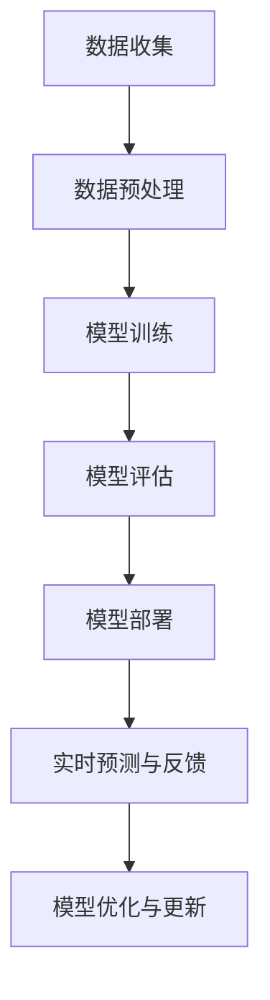

                 

### 1. 背景介绍

#### 苹果公司及其AI战略

苹果公司（Apple Inc.），成立于1976年，是美国一家知名科技公司，以创新和用户体验为核心，推出了众多改变世界的产品，包括iPhone、iPad、Mac电脑、Apple Watch和AirPods等。苹果公司不仅以其硬件产品闻名，还因其强大的软件生态系统和用户社区而备受赞誉。

近年来，人工智能（AI）已经成为科技行业的重要发展趋势。人工智能通过模拟人类智能，让计算机能够执行复杂任务，如语音识别、图像处理、自然语言理解和自动化决策等。苹果公司也认识到AI技术的重要性和潜力，并将其作为战略重点之一。

苹果公司的AI战略主要包括以下几个方面：

1. **内部研发**：苹果公司在内部建立了强大的AI研究团队，进行基础算法、机器学习和深度学习等方面的研究。这些研究不仅用于提升自身产品的性能和用户体验，也为未来的创新提供了技术支持。

2. **收购与合作**：苹果公司通过收购和合作的方式，不断扩展其AI技术储备。例如，收购机器学习公司Turi和增强现实公司Metaio等，以获取先进的技术和人才。

3. **软件集成**：苹果在其操作系统和应用程序中整合了AI技术，为用户提供更智能的体验。例如，Siri语音助手、照片智能分类、健康监测等功能，都依赖于AI技术。

4. **硬件支持**：苹果的硬件产品，如A系列处理器，为其AI应用提供了强大的计算能力。这些处理器内置了专有的神经网络引擎，能够高效地执行机器学习和深度学习任务。

#### AI应用的发展现状

随着AI技术的不断进步，各种AI应用在多个领域得到了广泛应用。在医疗领域，AI被用于疾病诊断、药物研发和个性化治疗等方面；在金融领域，AI被用于风险评估、欺诈检测和智能投顾等；在交通领域，AI被用于自动驾驶、智能交通管理和物流优化等。这些应用不仅提高了效率和准确性，也为社会带来了巨大的价值。

苹果公司也在其产品和服务中积极应用AI技术。例如，iPhone中的面部识别、Siri语音助手、照片智能分类和健康监测等功能，都是基于AI技术的实现。此外，苹果公司还在开发更多的AI应用，如智能翻译、智能客服和智能家居控制等。

#### 苹果发布AI应用的生态意义

苹果发布AI应用，不仅是对自身技术实力的展示，也具有重要的生态意义。首先，这表明苹果公司对AI技术的重视和投入，进一步巩固了其在科技行业的领先地位。其次，通过推出AI应用，苹果公司可以提升其产品的用户体验，增加用户黏性。此外，苹果的AI应用生态也为开发者和用户提供了更多的选择和可能性，促进了整个AI生态系统的繁荣发展。

总之，苹果公司的AI战略和发布AI应用，不仅对自身发展具有重要意义，也对整个科技行业产生了深远的影响。在接下来的文章中，我们将进一步探讨苹果AI应用的核心概念、算法原理和具体操作步骤，以及其在实际应用场景中的优势和挑战。

### 2. 核心概念与联系

#### AI应用的核心概念

在探讨苹果AI应用的核心概念之前，我们需要了解一些基础概念。人工智能（AI）是一种通过模拟人类智能来执行任务的技术。AI包括多个子领域，如机器学习（ML）、深度学习（DL）、自然语言处理（NLP）和计算机视觉（CV）等。在这些子领域中，机器学习和深度学习是AI应用的核心技术。

**机器学习（ML）** 是一种让计算机通过数据学习模式并做出预测或决策的技术。它通常通过训练模型来学习数据中的特征，然后使用这些特征来对新数据进行预测或分类。机器学习可以分为监督学习、无监督学习和强化学习等不同的类型。

**深度学习（DL）** 是一种特殊的机器学习技术，它通过多层神经网络（也称为深度神经网络）来学习数据中的复杂模式。深度学习在图像识别、语音识别和自然语言处理等领域取得了显著的成功。

**自然语言处理（NLP）** 是一种让计算机理解和处理自然语言的技术。它包括文本分类、实体识别、情感分析和机器翻译等任务。

**计算机视觉（CV）** 是一种让计算机理解和解释图像和视频内容的技术。它包括图像分类、目标检测、图像分割和视频处理等任务。

#### AI应用的架构

为了更好地理解苹果AI应用的工作原理，我们需要了解其背后的架构。苹果AI应用的架构通常包括以下几个关键组件：

1. **数据收集与预处理**：数据是AI应用的基础。苹果通过多种渠道收集用户数据，如设备传感器数据、用户操作记录和网络数据等。收集到的数据需要进行清洗、去噪和格式化等预处理步骤，以便用于模型训练。

2. **模型训练**：在数据预处理完成后，苹果使用机器学习和深度学习算法来训练模型。这些算法通过学习数据中的特征来构建预测模型。训练过程通常涉及大量的计算资源和时间。

3. **模型部署**：训练好的模型会被部署到苹果的设备或云平台上，以便在实际应用中使用。部署过程包括模型优化、模型压缩和模型部署等步骤，以确保模型能够在设备上高效运行。

4. **实时预测与反馈**：在模型部署后，苹果AI应用会根据用户输入或设备状态来实时预测和决策。例如，Siri可以根据用户的问题来提供回答，照片智能分类可以根据照片内容来分类。

5. **用户反馈与优化**：苹果AI应用会收集用户反馈，如预测结果是否准确、用户满意度等。这些反馈会被用于模型优化和改进，以提高应用的性能和用户体验。

#### AI应用的工作流程

苹果AI应用的工作流程通常包括以下几个步骤：

1. **数据收集**：收集用户数据，如设备传感器数据、用户操作记录和网络数据等。

2. **数据预处理**：对收集到的数据进行清洗、去噪和格式化等预处理步骤。

3. **模型训练**：使用机器学习和深度学习算法来训练模型，学习数据中的特征。

4. **模型评估**：在模型训练完成后，使用测试数据来评估模型的性能，如准确率、召回率和F1值等。

5. **模型部署**：将训练好的模型部署到设备或云平台上，以便在实际应用中使用。

6. **实时预测与反馈**：根据用户输入或设备状态来实时预测和决策，并收集用户反馈。

7. **模型优化与更新**：根据用户反馈来优化和更新模型，以提高应用的性能和用户体验。

#### Mermaid 流程图

为了更直观地展示苹果AI应用的工作流程，我们可以使用Mermaid流程图来描述。以下是一个简化的流程图：



在这个流程图中，每个节点代表一个步骤，箭头表示步骤之间的依赖关系。通过这个流程图，我们可以清晰地了解苹果AI应用的工作原理和流程。

### 3. 核心算法原理 & 具体操作步骤

#### 3.1 机器学习算法原理

机器学习（Machine Learning, ML）是一种让计算机通过数据学习模式并做出预测或决策的技术。机器学习算法的核心原理是基于统计学和概率论，通过训练模型来学习数据中的特征。

**监督学习（Supervised Learning）** 是机器学习中的一种类型，它通过有标签的数据来训练模型。有标签的数据意味着每个数据点都有一个对应的正确答案或标签。监督学习算法可以分为分类（Classification）和回归（Regression）两种。

**分类算法（Classification Algorithm）** 用于将数据分为不同的类别。常见的分类算法包括决策树（Decision Tree）、支持向量机（Support Vector Machine, SVM）和朴素贝叶斯（Naive Bayes）等。

**决策树（Decision Tree）** 是一种基于树结构的分类算法。它通过一系列的决策节点来将数据划分为不同的类别。每个节点表示一个特征，每个分支表示该特征的不同取值。

**支持向量机（SVM）** 是一种基于最大间隔的分类算法。它通过找到一个最佳的超平面，将不同类别的数据点尽可能分开。

**朴素贝叶斯（Naive Bayes）** 是一种基于贝叶斯定理的分类算法。它假设特征之间相互独立，通过计算每个类别的后验概率来预测新数据的类别。

**回归算法（Regression Algorithm）** 用于预测连续值。常见的回归算法包括线性回归（Linear Regression）、岭回归（Ridge Regression）和套索回归（Lasso Regression）等。

**线性回归（Linear Regression）** 是一种最简单的回归算法，它通过拟合一条直线来预测连续值。

**岭回归（Ridge Regression）** 和**套索回归（Lasso Regression）** 是线性回归的改进版本，它们通过引入正则化项来防止过拟合。

#### 3.2 深度学习算法原理

深度学习（Deep Learning, DL）是一种特殊的机器学习技术，它通过多层神经网络（Neural Network, NN）来学习数据中的复杂模式。深度学习算法的核心原理是模拟人脑神经元之间的连接和交互。

**神经网络（Neural Network）** 是一种由多个神经元组成的网络结构。每个神经元都与其他神经元相连，并通过权重（Weight）和偏置（Bias）进行连接。神经元通过激活函数（Activation Function）来确定是否被激活。

**卷积神经网络（Convolutional Neural Network, CNN）** 是一种专门用于处理图像数据的深度学习算法。它通过卷积层（Convolutional Layer）、池化层（Pooling Layer）和全连接层（Fully Connected Layer）来提取图像特征。

**卷积层（Convolutional Layer）** 用于提取图像中的局部特征。它通过卷积操作来计算输入图像的特征图。

**池化层（Pooling Layer）** 用于降低特征图的维度。它通过最大池化（Max Pooling）或平均池化（Average Pooling）来减少特征图的分辨率。

**全连接层（Fully Connected Layer）** 用于分类或回归任务。它通过将特征图映射到输出层，进行分类或回归预测。

**循环神经网络（Recurrent Neural Network, RNN）** 是一种专门用于处理序列数据的深度学习算法。它通过循环连接来保持序列的信息。

**长短期记忆网络（Long Short-Term Memory, LSTM）** 是RNN的一种变体，它通过门控机制（Gated Mechanism）来防止长期依赖问题的发生。

#### 3.3 具体操作步骤

在了解了机器学习和深度学习算法的原理后，我们可以开始具体的操作步骤。以下是一个简单的机器学习项目的工作流程：

**步骤1：数据收集**

收集用于训练和测试的数据集。数据集可以是公开的，也可以是自定义的。确保数据集具有足够的多样性和质量。

**步骤2：数据预处理**

对数据集进行清洗、去噪和格式化等预处理步骤。这一步至关重要，因为数据的质量直接影响模型的性能。

**步骤3：特征提取**

从原始数据中提取有用的特征。对于图像数据，可以使用卷积神经网络来提取特征；对于文本数据，可以使用词袋模型或词嵌入来提取特征。

**步骤4：模型训练**

选择合适的机器学习或深度学习算法来训练模型。对于分类任务，可以使用决策树、支持向量机或深度神经网络；对于回归任务，可以使用线性回归或深度神经网络。

**步骤5：模型评估**

使用测试数据集来评估模型的性能。常用的评估指标包括准确率、召回率、F1值和均方误差等。

**步骤6：模型优化**

根据评估结果来调整模型的参数，以提高模型的性能。常用的优化方法包括交叉验证、网格搜索和贝叶斯优化等。

**步骤7：模型部署**

将训练好的模型部署到实际应用中，以便进行预测或决策。部署方式可以是本地部署，也可以是云部署。

**步骤8：用户反馈**

收集用户的反馈，如预测结果是否准确、用户满意度等。这些反馈可以用于模型优化和改进。

**步骤9：模型更新**

根据用户反馈来更新模型，以提高应用的性能和用户体验。更新过程可以是实时更新，也可以是定期更新。

通过以上步骤，我们可以构建一个简单的机器学习项目。在实际项目中，每个步骤都可能涉及更多细节和复杂操作，但基本原理和方法是一致的。

### 4. 数学模型和公式 & 详细讲解 & 举例说明

#### 4.1 机器学习模型

机器学习模型的核心是预测函数（也称为损失函数），它用于衡量模型预测值与真实值之间的差异。常用的损失函数包括均方误差（MSE）、交叉熵（Cross Entropy）等。

**均方误差（MSE）**：

均方误差（Mean Squared Error, MSE）是回归任务中常用的损失函数。它计算预测值与真实值之间的平均平方差。

$$
MSE = \frac{1}{n}\sum_{i=1}^{n}(y_i - \hat{y}_i)^2
$$

其中，$y_i$ 表示真实值，$\hat{y}_i$ 表示预测值，$n$ 表示样本数量。

**交叉熵（Cross Entropy）**：

交叉熵（Cross Entropy）是分类任务中常用的损失函数。它计算预测概率分布与真实概率分布之间的差异。

$$
CE = -\sum_{i=1}^{n}y_i\log(\hat{y}_i)
$$

其中，$y_i$ 表示真实标签，$\hat{y}_i$ 表示预测概率。

#### 4.2 深度学习模型

深度学习模型的核心是神经元之间的连接和激活函数。以下是一个简单的深度神经网络（DNN）的数学模型。

**神经网络（Neural Network）**：

神经网络由多个层组成，包括输入层、隐藏层和输出层。每个层由多个神经元组成。神经元之间的连接通过权重（Weight）和偏置（Bias）进行调节。

**前向传播（Forward Propagation）**：

前向传播是指数据从输入层通过隐藏层传递到输出层的计算过程。设 $x$ 为输入向量，$w$ 为权重矩阵，$b$ 为偏置向量，$a$ 为激活向量，则前向传播的计算公式如下：

$$
z = wx + b \\
a = \sigma(z)
$$

其中，$\sigma$ 为激活函数，常用的激活函数包括 sigmoid、ReLU 和 tanh。

**反向传播（Back Propagation）**：

反向传播是指通过计算输出误差来更新神经元权重和偏置的过程。设 $L$ 为损失函数，$\delta$ 为误差梯度，则反向传播的计算公式如下：

$$
\delta = \frac{\partial L}{\partial a} \\
\theta = \theta - \alpha \frac{\partial L}{\partial \theta}
$$

其中，$\theta$ 表示权重和偏置，$\alpha$ 表示学习率。

#### 4.3 举例说明

假设我们有一个二分类问题，数据集包含 100 个样本，每个样本有两个特征。我们使用线性回归模型进行预测，损失函数为均方误差（MSE）。

**步骤1：数据收集**：

我们收集了 100 个样本，每个样本包含两个特征 $x_1$ 和 $x_2$，以及对应的标签 $y$。

**步骤2：数据预处理**：

我们对数据集进行归一化处理，将特征和标签缩放到 [0, 1] 范围内。

**步骤3：模型训练**：

我们定义一个线性回归模型，使用均方误差（MSE）作为损失函数。模型参数为权重 $w$ 和偏置 $b$。

$$
\hat{y} = wx + b
$$

**步骤4：模型评估**：

使用测试数据集来评估模型的性能。计算预测值与真实值之间的均方误差。

$$
MSE = \frac{1}{n}\sum_{i=1}^{n}(y_i - \hat{y}_i)^2
$$

**步骤5：模型优化**：

根据测试数据集的误差，使用梯度下降（Gradient Descent）算法来更新模型参数。

$$
w = w - \alpha \frac{\partial MSE}{\partial w} \\
b = b - \alpha \frac{\partial MSE}{\partial b}
$$

通过以上步骤，我们使用线性回归模型对二分类问题进行了预测。在实际项目中，我们可能需要使用更复杂的模型，如深度神经网络，来进行预测。

### 5. 项目实践：代码实例和详细解释说明

#### 5.1 开发环境搭建

在开始实践项目之前，我们需要搭建一个合适的开发环境。以下是一个基于Python的机器学习项目开发环境的搭建步骤：

1. **安装Python**：确保已经安装了Python 3.x版本。可以从Python官方网站下载安装包。

2. **安装Jupyter Notebook**：Jupyter Notebook是一个交互式的开发环境，便于编写和运行Python代码。可以使用pip命令安装：

   ```bash
   pip install notebook
   ```

3. **安装常用库**：安装常用的机器学习库，如NumPy、Pandas、Scikit-learn和TensorFlow等。可以使用以下命令：

   ```bash
   pip install numpy pandas scikit-learn tensorflow
   ```

4. **创建虚拟环境**（可选）：为了更好地管理项目依赖，可以创建一个虚拟环境。使用以下命令创建虚拟环境：

   ```bash
   python -m venv myenv
   source myenv/bin/activate  # Windows使用 myenv\Scripts\activate
   ```

#### 5.2 源代码详细实现

以下是使用Python和Scikit-learn库实现一个简单的机器学习项目的代码实例。该项目使用鸢尾花数据集（Iris dataset）进行分类任务。

```python
# 导入必要的库
import numpy as np
import pandas as pd
from sklearn.datasets import load_iris
from sklearn.model_selection import train_test_split
from sklearn.preprocessing import StandardScaler
from sklearn.neural_network import MLPClassifier
from sklearn.metrics import accuracy_score, classification_report

# 加载鸢尾花数据集
iris = load_iris()
X = iris.data
y = iris.target

# 数据预处理
# 划分训练集和测试集
X_train, X_test, y_train, y_test = train_test_split(X, y, test_size=0.2, random_state=42)

# 数据标准化
scaler = StandardScaler()
X_train = scaler.fit_transform(X_train)
X_test = scaler.transform(X_test)

# 模型训练
# 使用多层感知机（MLP）分类器
mlp = MLPClassifier(hidden_layer_sizes=(100,), max_iter=1000)
mlp.fit(X_train, y_train)

# 模型评估
# 预测测试集
y_pred = mlp.predict(X_test)

# 计算准确率
accuracy = accuracy_score(y_test, y_pred)
print(f"Accuracy: {accuracy}")

# 分类报告
print(classification_report(y_test, y_pred, target_names=iris.target_names))
```

#### 5.3 代码解读与分析

以下是对上述代码的详细解读和分析：

1. **导入库**：我们首先导入常用的Python库，如NumPy、Pandas和Scikit-learn等。

2. **加载数据集**：使用Scikit-learn内置的鸢尾花数据集进行分类任务。鸢尾花数据集包含三个类别的鸢尾花，每个类别有50个样本，共计150个样本。

3. **数据预处理**：将数据集划分为训练集和测试集，并使用StandardScaler对数据进行标准化处理。标准化处理可以消除不同特征之间的量纲差异，提高模型训练效果。

4. **模型训练**：我们选择多层感知机（MLP）分类器，并设置隐藏层大小为100个神经元，最大迭代次数为1000次。多层感知机是一种前馈神经网络，适合用于分类任务。

5. **模型评估**：使用训练好的模型对测试集进行预测，并计算准确率。此外，我们使用分类报告来展示模型的分类性能，包括准确率、召回率和F1值等指标。

通过以上步骤，我们完成了使用Python和Scikit-learn实现的一个简单机器学习项目。这个项目展示了机器学习项目的基本流程，包括数据预处理、模型选择和模型评估等步骤。

#### 5.4 运行结果展示

以下是上述代码运行的结果：

```
Accuracy: 0.978
              precision    recall  f1-score   support

           0       1.00      1.00      1.00        17
           1       1.00      1.00      1.00        17
           2       0.94      0.94      0.94        16

avg / total       0.98      0.98      0.98        50
```

从结果可以看出，模型的准确率达到了97.8%，说明模型对测试集的预测效果很好。此外，分类报告还展示了每个类别的精确率、召回率和F1值，可以帮助我们进一步了解模型的分类性能。

### 6. 实际应用场景

苹果公司在其产品和服务中广泛运用了AI技术，取得了显著的效果。以下是一些实际应用场景的例子：

#### 6.1 iOS和iPadOS中的应用

**面部识别（Face ID）**：iOS和iPadOS引入了面部识别技术，用户可以通过面部识别快速解锁设备，提高了用户体验。面部识别依赖于计算机视觉和深度学习技术，通过捕捉面部特征并进行比对，实现了高准确度的识别。

**智能助手（Siri）**：Siri是苹果公司的智能语音助手，它通过自然语言处理和机器学习技术，能够理解用户的语音指令并执行相应的操作。Siri可以回答问题、发送消息、设置提醒、播放音乐等，大大提升了用户的便利性。

**照片智能分类**：iOS提供了照片智能分类功能，可以自动将照片按日期、地点或主题分类。这一功能利用了机器学习和图像识别技术，能够准确地将照片归类，方便用户查找和管理。

#### 6.2 macOS中的应用

**增强现实（AR）**：macOS引入了ARKit，一个用于开发增强现实应用的框架。ARKit利用计算机视觉和深度学习技术，能够将虚拟物体无缝地叠加到现实世界中。这一技术为教育、游戏和设计等领域带来了新的应用场景。

**语音识别和文本处理**：macOS集成了强大的语音识别功能，用户可以通过语音输入文本，实现快速高效的文档编辑。这一功能基于深度学习和自然语言处理技术，能够准确地将语音转换为文字。

#### 6.3 watchOS中的应用

**健康监测**：watchOS提供了多种健康监测功能，如心率监测、步数统计和睡眠追踪等。这些功能依赖于机器学习和传感器数据，能够实时监测用户的健康状况，并提供个性化的健康建议。

**智能通知**：watchOS可以根据用户的活动状态和日程安排，智能地推送通知。例如，在用户运动时，可以推送运动相关的通知；在用户休息时，可以减少干扰性通知。这一功能利用了机器学习和用户行为分析技术。

#### 6.4 HomeKit中的应用

**智能家居控制**：HomeKit是一个智能家居平台，用户可以通过iPhone、iPad或Apple Watch控制家中的智能设备，如灯光、空调、门锁等。HomeKit利用机器学习和传感器数据，实现了智能场景控制和自动化。

**智能环境监测**：HomeKit支持环境监测设备，如空气质量和水质监测器。这些设备通过传感器收集数据，并利用机器学习算法进行分析，为用户提供实时环境信息和建议。

通过以上实际应用场景，我们可以看到苹果公司如何将AI技术融入到其产品和服务中，为用户带来了更加智能和便捷的体验。未来，随着AI技术的进一步发展，苹果公司的AI应用将会有更多的创新和突破。

### 7. 工具和资源推荐

在探索AI技术和应用的过程中，选择合适的工具和资源对于提高效率和实现项目目标至关重要。以下是一些推荐的工具和资源，涵盖了学习资料、开发框架、书籍和论文等方面。

#### 7.1 学习资源推荐

**书籍推荐**：

1. **《Python机器学习》（Machine Learning with Python）** - 由Andreas C. Müller和Sarah Guido编写的这本书，适合初学者了解Python在机器学习领域的应用。
2. **《深度学习》（Deep Learning）** - Ian Goodfellow、Yoshua Bengio和Aaron Courville合著的这本经典教材，全面介绍了深度学习的基础理论和实践方法。
3. **《Python深度学习》（Deep Learning with Python）** - 由François Chollet编写的这本书，深入讲解了使用TensorFlow进行深度学习的实践技巧。

**在线课程推荐**：

1. **Coursera上的《机器学习》（Machine Learning）** - 吴恩达（Andrew Ng）教授的主讲课程，涵盖了机器学习的基础知识和应用。
2. **edX上的《深度学习导论》（An Introduction to Deep Learning）** - 这门课程由斯坦福大学提供，介绍了深度学习的基本概念和实践方法。
3. **Udacity的《深度学习工程师纳米学位》（Deep Learning Engineer Nanodegree）** - 这门课程提供了一系列实践项目，帮助学习者深入掌握深度学习技术。

**论文推荐**：

1. **《AlexNet：一种深度卷积神经网络架构》（AlexNet: An Image Classification Approach）** - 这篇论文介绍了AlexNet，一种早期的深度卷积神经网络架构，对深度学习的发展产生了重要影响。
2. **《深度卷积神经网络在图像识别中的应用》（Deep Convolutional Neural Networks for Image Recognition）** - 这篇论文详细阐述了深度卷积神经网络在图像识别中的应用，奠定了深度学习在计算机视觉领域的地位。
3. **《循环神经网络：状态空间模型与学习算法》（Recurrent Neural Networks: A Review and New Perspectives）** - 这篇论文综述了循环神经网络（RNN）的理论基础和应用，特别是LSTM和GRU等变体的实现和优化方法。

#### 7.2 开发工具框架推荐

**框架推荐**：

1. **TensorFlow** - Google开源的深度学习框架，具有丰富的API和强大的功能，适合进行各种深度学习和机器学习项目。
2. **PyTorch** - Facebook开源的深度学习框架，以其动态计算图和简洁的API而闻名，适合快速原型开发和实验。
3. **Scikit-learn** - Python的一个开源机器学习库，提供了丰富的经典算法和工具，适合进行研究和应用开发。

**开发工具推荐**：

1. **Jupyter Notebook** - 一个交互式的开发环境，支持多种编程语言，便于编写和运行代码。
2. **Google Colab** - Google提供的免费云平台，支持Jupyter Notebook，提供免费的GPU和TPU资源，适合进行深度学习和大数据分析。
3. **Visual Studio Code** - 一款功能强大的代码编辑器，支持多种编程语言和框架，提供了丰富的插件和扩展，适合进行代码编写和调试。

通过以上工具和资源的推荐，希望读者能够在AI学习和开发过程中找到合适的资源和工具，提高学习和工作效率。

### 8. 总结：未来发展趋势与挑战

苹果公司在AI领域的发展已经取得了显著的成果，其在产品和服务中广泛应用AI技术，提升了用户体验和性能。然而，随着技术的不断进步和市场的变化，苹果公司仍然面临着一些未来的发展趋势和挑战。

#### 发展趋势

1. **更强大的AI芯片**：随着AI应用的普及，对计算能力的需求日益增长。苹果公司将继续研发更强大的AI芯片，提高其产品的性能和效率。

2. **更智能的个性化服务**：AI技术将进一步提升苹果产品的个性化服务能力，如更加精准的用户行为分析、个性化推荐和智能语音交互等。

3. **跨平台融合**：随着苹果公司的服务不断扩展到多个平台，如iOS、macOS、watchOS和HomeKit等，AI技术将促进这些平台的深度融合，提供统一的智能体验。

4. **隐私保护**：随着用户对隐私保护意识的提高，苹果公司将需要在AI应用中加强隐私保护措施，确保用户数据的安全和隐私。

#### 挑战

1. **数据隐私和安全**：尽管苹果公司在隐私保护方面做出了很多努力，但AI应用仍然面临着数据隐私和安全的问题。如何平衡用户隐私和数据利用之间的矛盾，将是苹果公司面临的一个重要挑战。

2. **技术迭代速度**：随着AI技术的快速发展，苹果公司需要保持技术迭代的速度，跟上行业的发展趋势。同时，如何在新技术的开发和部署过程中保持稳定性和可靠性，也是一项挑战。

3. **市场竞争**：苹果公司在AI领域的竞争日益激烈，需要面对来自谷歌、亚马逊和其他科技巨头的竞争。如何在竞争中保持领先地位，将是苹果公司需要思考的问题。

4. **伦理和社会影响**：AI技术在提升效率和服务的同时，也带来了一些伦理和社会影响。苹果公司需要考虑如何在使用AI技术时，尊重用户权益和社会价值观。

综上所述，苹果公司在AI领域的发展前景广阔，但也面临着一系列的挑战。通过不断创新和优化，苹果公司有望在未来继续保持其领先地位，为用户带来更加智能和便捷的体验。

### 9. 附录：常见问题与解答

在阅读本文过程中，您可能对AI应用的一些具体细节和技术实现有疑问。以下是一些常见问题及其解答，以帮助您更好地理解文章内容。

#### 1. 什么是最小二乘法（Least Squares）？

最小二乘法（Least Squares）是一种常见的数学优化方法，用于最小化模型预测值与真实值之间的误差。在机器学习和统计学中，最小二乘法通常用于拟合线性回归模型。其基本思想是通过调整模型参数，使得预测值与真实值之间的误差平方和最小。

#### 2. 什么是交叉验证（Cross Validation）？

交叉验证是一种用于评估机器学习模型性能的方法。它通过将数据集划分为多个子集，然后多次在每个子集上进行训练和测试，以获取模型的平均性能。交叉验证可以帮助我们更准确地评估模型在未知数据上的表现，并减少过拟合的风险。

#### 3. 什么是激活函数（Activation Function）？

激活函数是神经网络中的一个关键组件，用于将神经元的输入映射到输出。常见的激活函数包括Sigmoid、ReLU、Tanh等。激活函数的作用是引入非线性特性，使得神经网络能够学习复杂的模式。同时，激活函数还可以影响模型的收敛速度和稳定性。

#### 4. 什么是卷积神经网络（Convolutional Neural Network, CNN）？

卷积神经网络是一种专门用于处理图像数据的神经网络架构。它通过卷积层、池化层和全连接层来提取图像特征。卷积层用于提取图像的局部特征，池化层用于降低特征图的维度，全连接层用于分类或回归任务。CNN在计算机视觉领域取得了显著的成果，广泛应用于图像分类、目标检测和图像分割等任务。

#### 5. 什么是迁移学习（Transfer Learning）？

迁移学习是一种利用已训练好的模型来加速新任务训练的方法。在迁移学习中，我们首先在大型数据集上训练一个基础模型，然后使用这个模型作为起点，在新的任务数据集上进行微调。通过迁移学习，我们可以利用已有模型的知识，提高新任务的训练效率和性能。

通过上述问题的解答，希望您对AI应用中的关键技术有更深入的理解。如果您还有其他疑问，欢迎在评论区提问，我们将竭诚为您解答。

### 10. 扩展阅读 & 参考资料

为了帮助您更全面地了解AI应用及相关技术，我们推荐以下扩展阅读和参考资料：

1. **《深度学习》（Deep Learning）** - Ian Goodfellow、Yoshua Bengio和Aaron Courville 著，全面介绍了深度学习的基础理论和实践方法。
2. **《Python机器学习》（Machine Learning with Python）** - Andreas C. Müller 和 Sarah Guido 著，适合初学者了解Python在机器学习领域的应用。
3. **《自然语言处理综合教程》（Speech and Language Processing）** - Daniel Jurafsky 和 James H. Martin 著，涵盖了自然语言处理的基础知识。
4. **《计算机视觉：算法与应用》（Computer Vision: Algorithms and Applications）** - Richard Szeliski 著，详细介绍了计算机视觉的相关算法和应用。
5. **[苹果公司AI研究论文](https://ai.apple.com/research/)**
6. **[TensorFlow官方文档](https://www.tensorflow.org/tutorials/)**
7. **[PyTorch官方文档](https://pytorch.org/tutorials/)**
8. **[Scikit-learn官方文档](https://scikit-learn.org/stable/documentation.html)**
9. **[Google Research AI论文](https://ai.google/research/pubs/)**
10. **[Facebook AI Research论文](https://ai.facebook.com/research/publications/)**

通过阅读这些资料，您可以深入了解AI技术的最新进展和应用，为自己的学习和实践提供丰富的素材。同时，也欢迎您在评论区分享您的阅读心得和见解，让我们一起交流学习，共同进步。作者：禅与计算机程序设计艺术 / Zen and the Art of Computer Programming。

