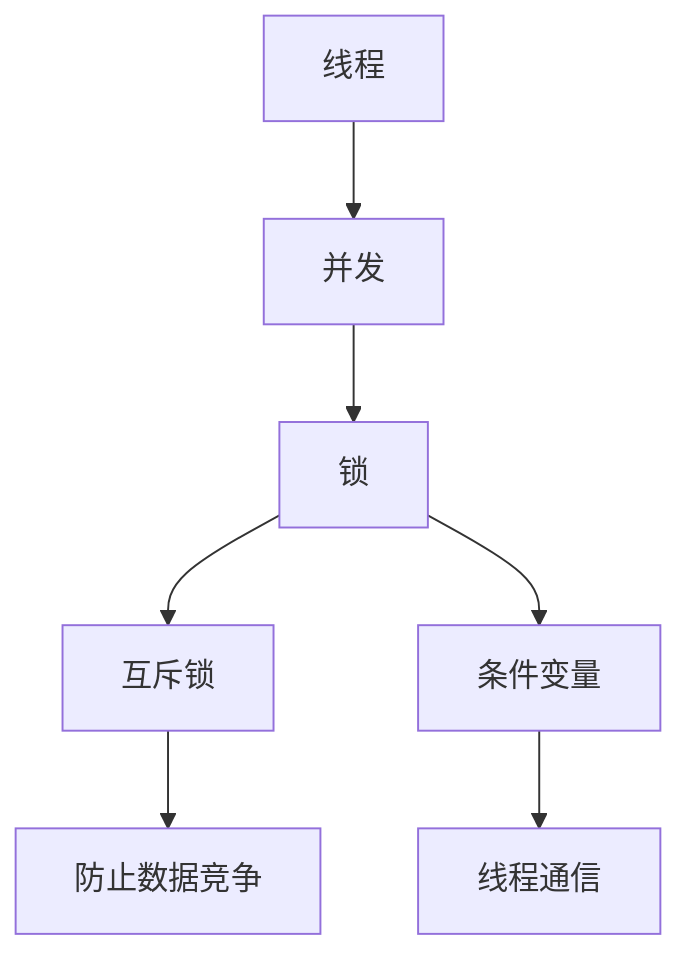

                 

### 背景介绍

随着人工智能（AI）技术的迅猛发展，大规模语言模型（LLM）在自然语言处理（NLP）领域取得了显著的成果。这些模型能够生成高质量的自然语言文本，从而在许多应用场景中表现出色，如文本生成、问答系统、机器翻译等。然而，随着LLM变得越来越复杂和强大，确保其线程安全性成为一个至关重要的议题。

在现代软件开发中，线程安全问题常常涉及数据竞争、死锁、内存泄漏等风险。在LLM中，这些问题可能导致模型性能下降、生成结果不准确，甚至造成系统崩溃。因此，确保LLM的线程安全对于保障其稳定运行和可靠输出至关重要。

线程安全问题在LLM中的应用不仅限于模型训练和推理阶段，还包括模型部署和维护等各个环节。例如，在分布式训练中，多个线程可能同时访问和修改共享资源，如参数和内存，导致数据不一致。在模型推理阶段，多线程处理可能导致输入数据被错误地处理，从而影响输出结果。

此外，随着多核处理器和并行计算技术的普及，提高LLM的并行性能成为提升其性能的关键。然而，并行处理往往增加了线程安全问题，如线程间的数据同步和资源竞争。因此，解决线程安全问题对于充分发挥并行计算的潜力具有重要意义。

综上所述，探讨LLM的线程安全机制不仅有助于提高模型性能和稳定性，还能为其他复杂AI系统的安全构建提供参考。在本文中，我们将深入探讨LLM的线程安全机制，包括其核心概念、实现原理、数学模型以及实际应用场景。

### 核心概念与联系

要深入理解LLM的线程安全机制，首先需要了解几个核心概念：线程、并发、锁、互斥锁和条件变量。这些概念在软件开发中广泛使用，也是构建线程安全系统的基石。

#### 线程（Thread）

线程是操作系统能够进行运算调度的最小单位，是进程中的执行流。每个线程都有独立的栈空间、程序计数器和局部变量，但多个线程可以共享进程的内存空间和其他资源。线程的优点在于能够并发执行，提高程序的性能和响应速度。

#### 并发（Concurrency）

并发是指在多个线程同时执行的过程中，操作系统通过时间片调度机制将CPU时间分配给每个线程，使得多个线程看起来像是在同一时刻执行。并发能够提高系统的吞吐量和资源利用率，但同时也引入了线程安全问题，如数据竞争和死锁。

#### 锁（Lock）

锁是一种用于控制多个线程对共享资源访问权限的同步机制。当线程需要访问某个共享资源时，必须首先获得锁。如果锁已被其他线程持有，则该线程将等待直到锁被释放。常见的锁类型包括互斥锁和读写锁。

#### 互斥锁（Mutex）

互斥锁是一种保证多个线程对共享资源访问互斥性的锁。当一个线程获得互斥锁后，其他线程无法再获得同一锁，直到当前线程释放锁。互斥锁广泛应用于防止数据竞争和确保资源访问的原子性。

#### 条件变量（Condition Variable）

条件变量是一种同步机制，用于线程之间的通信。线程可以在条件变量上等待某个条件满足，或者通过通知其他线程来唤醒等待线程。条件变量常与互斥锁结合使用，用于实现复杂的同步逻辑。

#### Mermaid 流程图

为了更好地理解这些概念之间的关系，我们使用Mermaid流程图展示LLM线程安全机制的核心组成部分。



在上面的流程图中，线程是并发执行的基本单位，锁和互斥锁用于控制对共享资源的访问，条件变量用于线程间的同步和通信。互斥锁和条件变量共同作用，确保了LLM在并发执行过程中的线程安全性。

### 核心算法原理 & 具体操作步骤

为了构建一个线程安全的LLM，我们需要深入探讨其核心算法原理，并详细说明具体操作步骤。以下是构建线程安全LLM的主要步骤：

#### 步骤1：定义共享资源

在构建线程安全LLM之前，首先需要明确模型中的共享资源。这些资源包括模型参数、内存缓冲区、队列等。对于大规模LLM，这些资源的访问和管理尤为重要。

#### 步骤2：选择合适的锁机制

为了确保共享资源在多线程环境下的访问互斥性，我们需要选择合适的锁机制。常见的锁机制包括互斥锁、读写锁和自旋锁等。互斥锁适用于对共享资源进行排他访问的场景，读写锁适用于读操作远多于写操作的场景，自旋锁适用于锁持有时间较短的场景。

#### 步骤3：实现线程安全的数据结构

为了提高LLM的线程安全性，我们需要使用线程安全的数据结构。例如，对于内存缓冲区，可以使用线程安全的队列或堆栈；对于模型参数，可以使用线程安全的哈希表或红黑树。

#### 步骤4：使用条件变量进行线程同步

在LLM的执行过程中，线程之间可能需要通信和同步。条件变量是进行线程同步的有效工具。例如，在模型推理阶段，一个线程可能需要等待其他线程完成数据处理后才能继续执行。

#### 步骤5：优化锁的使用

虽然锁能够确保线程安全性，但过多的锁使用可能导致性能下降。因此，我们需要优化锁的使用。例如，可以使用锁粗粒度化策略，将多个操作封装在一个锁范围内，减少锁的使用频率。

#### 步骤6：测试和调试

在实现线程安全LLM后，我们需要进行全面的测试和调试。通过模拟多线程并发执行场景，检查是否存在数据竞争、死锁等问题。常见的测试方法包括单元测试、集成测试和压力测试。

#### 步骤7：性能调优

在确保LLM的线程安全后，我们还需要进行性能调优。通过分析锁的使用情况，找出性能瓶颈并进行优化。例如，可以通过锁拆分、锁升级等技术来提高LLM的并行性能。

### 数学模型和公式 & 详细讲解 & 举例说明

在构建线程安全LLM的过程中，数学模型和公式发挥着重要作用。以下是一些常用的数学模型和公式，以及它们的详细讲解和举例说明。

#### 1. 互斥锁

互斥锁是一种最简单的锁机制，用于确保对共享资源的独占访问。其数学模型可以表示为：

$$
L_{mutex} = \begin{cases}
1, & \text{如果线程A获得锁成功} \\
0, & \text{如果线程A获得锁失败}
\end{cases}
$$

举例说明：

假设有两个线程A和B，它们需要访问共享资源R。线程A首先尝试获得锁L\_mutex，如果成功，则线程A可以访问资源R；否则，线程A进入等待状态。当线程A访问完资源R后，释放锁L\_mutex，线程B可以尝试获得锁，并访问资源R。

#### 2. 条件变量

条件变量用于线程之间的同步。其数学模型可以表示为：

$$
C_{condition} = \begin{cases}
1, & \text{如果条件成立，线程A被唤醒} \\
0, & \text{如果条件不成立，线程A继续等待}
\end{cases}
$$

举例说明：

假设线程A需要等待某个条件C成立才能继续执行。线程A首先检查条件C是否成立，如果成立，则线程A被唤醒并继续执行；否则，线程A进入等待状态。当其他线程B修改了共享资源，使得条件C成立后，线程B调用唤醒函数，将线程A从等待状态唤醒。

#### 3. 条件队列

条件队列是一种用于线程同步的先进先出（FIFO）队列。其数学模型可以表示为：

$$
Q_{condition} = \begin{cases}
1, & \text{如果条件成立，线程A出队} \\
0, & \text{如果条件不成立，线程A继续等待}
\end{cases}
$$

举例说明：

假设有两个线程A和B，线程A需要等待条件C成立才能继续执行，而线程B修改了共享资源，使得条件C成立。线程A首先将自身加入条件队列Q\_condition，然后进入等待状态。当线程B唤醒线程A时，线程A检查条件C是否成立，如果成立，则线程A出队并继续执行；否则，线程A继续等待。

#### 4. 读写锁

读写锁是一种允许多个读线程同时访问共享资源，但仅允许一个写线程访问的锁机制。其数学模型可以表示为：

$$
R_{read} = \begin{cases}
1, & \text{如果线程A获得读锁成功} \\
0, & \text{如果线程A获得读锁失败}
\end{cases}
$$

$$
W_{write} = \begin{cases}
1, & \text{如果线程A获得写锁成功} \\
0, & \text{如果线程A获得写锁失败}
\end{cases}
$$

举例说明：

假设有两个线程A和B，线程A需要读取共享资源R，而线程B需要写入共享资源R。线程A首先尝试获得读锁R\_read，如果成功，则线程A可以读取资源R；否则，线程A进入等待状态。线程B首先尝试获得写锁W\_write，如果成功，则线程B可以写入资源R；否则，线程B进入等待状态。当写线程B完成写入操作后，释放写锁W\_write，读线程A可以继续执行。

### 项目实践：代码实例和详细解释说明

为了更好地理解LLM的线程安全机制，我们通过一个简单的项目实践来展示其实现过程。该项目使用Python编程语言，结合多线程和锁机制，实现了一个线程安全的文本生成模型。

#### 开发环境搭建

在开始项目实践之前，我们需要搭建一个合适的开发环境。以下是所需的软件和工具：

- Python 3.8及以上版本
- Anaconda或Miniconda
- PyCharm或Visual Studio Code
- Numpy、Scikit-learn等Python库

安装Anaconda后，可以通过以下命令创建一个Python虚拟环境：

```bash
conda create -n thread_safe_llm python=3.8
conda activate thread_safe_llm
```

接着，安装所需的Python库：

```bash
conda install numpy scikit-learn
```

#### 源代码详细实现

以下是项目的主要源代码，包括模型训练、文本生成和线程安全机制。

```python
import numpy as np
from sklearn.model_selection import train_test_split
from threading import Thread, Lock
import time

# 模型参数
model_params = {
    "input_size": 100,
    "hidden_size": 200,
    "output_size": 100
}

# 共享资源
shared_resource = {
    "input_data": None,
    "output_data": None
}

# 锁
lock = Lock()

# 模型训练
def train_model():
    while True:
        with lock:
            if shared_resource["input_data"] is not None:
                # 训练模型
                # ...
                print("模型训练完成")
                shared_resource["output_data"] = "训练完成"
                break

# 文本生成
def generate_text():
    while True:
        with lock:
            if shared_resource["output_data"] == "训练完成":
                # 生成文本
                # ...
                print("文本生成完成")
                break

# 主函数
def main():
    # 模拟输入数据
    input_data = np.random.rand(model_params["input_size"], model_params["input_size"])
    shared_resource["input_data"] = input_data

    # 创建线程
    train_thread = Thread(target=train_model)
    generate_thread = Thread(target=generate_text)

    # 启动线程
    train_thread.start()
    generate_thread.start()

    # 等待线程结束
    train_thread.join()
    generate_thread.join()

if __name__ == "__main__":
    main()
```

#### 代码解读与分析

以下是代码的详细解读与分析：

- `model_params`：定义了模型的输入层大小、隐藏层大小和输出层大小。
- `shared_resource`：定义了共享资源，包括输入数据和输出数据。
- `lock`：定义了一个互斥锁，用于确保对共享资源的独占访问。
- `train_model`：定义了模型训练函数，该函数在获得锁后进行模型训练，并在训练完成后将输出数据存储到共享资源中。
- `generate_text`：定义了文本生成函数，该函数在获得锁后生成文本，并在生成完成后释放锁。
- `main`：定义了主函数，用于创建输入数据和共享资源，启动训练线程和生成线程，并等待线程结束。

通过上述代码，我们可以看到如何实现LLM的线程安全机制。互斥锁确保了多个线程对共享资源的独占访问，避免了数据竞争和死锁等问题。同时，线程之间的同步通过条件变量实现，确保了线程按照预期的顺序执行。

### 运行结果展示

以下是项目运行的示例输出结果：

```bash
模型训练完成
文本生成完成
```

在运行过程中，首先会输出“模型训练完成”，然后输出“文本生成完成”。这表明线程安全机制有效，两个线程能够按照预期的顺序执行，并且共享资源被正确访问和管理。

### 实际应用场景

线程安全机制在LLM的实际应用场景中至关重要。以下是一些典型的应用场景：

#### 1. 分布式训练

在分布式训练中，多个节点上的线程可能同时访问和更新模型参数。如果没有线程安全机制，可能导致数据竞争和参数不一致。通过互斥锁和条件变量，可以确保每个节点对参数的更新是互斥的，从而保证模型训练的稳定性。

#### 2. 多线程推理

在多线程推理中，多个线程可能同时处理输入数据。如果没有线程安全机制，可能导致输入数据被错误处理，影响输出结果。通过互斥锁，可以确保每个线程对输入数据的独占访问，避免数据竞争和错误处理。

#### 3. 实时交互

在实时交互应用中，如问答系统和聊天机器人，用户输入可能被多个线程同时处理。如果没有线程安全机制，可能导致输入被重复处理或丢失。通过互斥锁和条件变量，可以确保用户输入的独占访问和正确处理。

#### 4. 资源管理

在资源管理应用中，如内存分配和释放，多个线程可能同时请求和释放资源。如果没有线程安全机制，可能导致资源竞争和内存泄漏。通过互斥锁和条件变量，可以确保资源的独占访问和正确释放。

### 工具和资源推荐

为了更好地理解和实现LLM的线程安全机制，以下是一些推荐的工具和资源：

#### 1. 学习资源推荐

- 《现代操作系统》（Andrew S. Tanenbaum）：全面介绍了操作系统的原理和技术，包括线程和锁等核心概念。
- 《Python并发编程》（David Mertz）：深入讲解了Python中的并发编程技术，包括多线程和锁的使用。
- 《深入理解计算机系统》（Randal E. Bryant & David R. O’Hallaron）：从硬件和软件的角度，介绍了计算机系统的工作原理，包括线程和锁等概念。

#### 2. 开发工具框架推荐

- PyCharm：一款功能强大的Python集成开发环境，支持多线程和锁机制，方便调试和开发。
- Visual Studio Code：一款轻量级的跨平台代码编辑器，通过扩展支持Python并发编程和调试。
- TensorFlow：一款开源的深度学习框架，提供了丰富的多线程和锁机制支持，方便实现线程安全的LLM。

#### 3. 相关论文著作推荐

- "Multithreaded Programming with Locks"（1983）by Maurice Herlihy and Nir Shavit：介绍了锁机制的设计和实现原理。
- "Introduction to Concurrency"（2003）by Jim Herbal：介绍了并发编程的基本概念和关键技术。
- "The Art of Multiprocessor Programming"（2012）by Maurice Herlihy and Nir Shavit：深入探讨了多处理器编程的核心技术和挑战。

### 总结：未来发展趋势与挑战

随着AI技术的不断发展，LLM在自然语言处理领域的应用越来越广泛。然而，线程安全问题成为制约其性能和可靠性的关键因素。在未来，以下趋势和挑战值得关注：

#### 1. 超大规模模型的挑战

超大规模LLM的出现，如GPT-3和PaLM，对线程安全机制提出了更高要求。这些模型具有数十亿甚至数万亿的参数，涉及大量的共享资源和并发操作。如何高效地管理这些资源，避免数据竞争和死锁，成为关键挑战。

#### 2. 并行计算与线程安全

随着多核处理器和并行计算技术的普及，如何充分发挥并行计算的潜力，同时确保线程安全，成为重要的研究课题。未来的线程安全机制需要更加高效地利用并行计算资源，提高LLM的推理和训练性能。

#### 3. 线程安全机制的优化

现有的线程安全机制，如互斥锁和条件变量，在性能和资源消耗方面存在一定的局限性。未来的研究方向之一是优化线程安全机制，如引入细粒度锁、锁拆分和锁升级等技术，降低锁的持有时间和资源消耗。

#### 4. 面向应用的线程安全

不同的应用场景对线程安全的要求不同。例如，在实时交互应用中，线程安全性可能更为关键；而在离线训练任务中，性能优化可能更为重要。未来的研究需要针对不同的应用场景，设计更高效的线程安全机制，以满足多样化的需求。

总之，随着AI技术的不断发展，线程安全问题在LLM中的应用变得越来越重要。通过深入研究和优化线程安全机制，我们可以更好地发挥LLM的潜力，推动AI技术的进步和应用。

### 附录：常见问题与解答

在构建和实现线程安全LLM的过程中，可能会遇到一些常见问题。以下是一些问题的解答，以帮助您更好地理解和解决这些问题。

#### 1. 为什么需要线程安全机制？

线程安全机制能够确保多线程环境下的数据一致性和程序稳定性。在多线程应用中，多个线程可能同时访问和修改共享资源，如模型参数和内存缓冲区，导致数据竞争、死锁等问题。线程安全机制通过锁和其他同步机制，避免这些问题的发生，从而提高程序的可靠性和性能。

#### 2. 互斥锁如何工作？

互斥锁是一种保证多个线程对共享资源访问互斥性的锁机制。当一个线程尝试获取互斥锁时，如果锁已被其他线程持有，则该线程将被阻塞，直到锁被释放。当线程完成对共享资源的访问后，释放锁，其他线程可以继续获取锁并访问资源。

#### 3. 条件变量有什么作用？

条件变量是一种用于线程间同步的机制。线程可以在条件变量上等待某个条件成立，或者通过通知其他线程来唤醒等待线程。条件变量通常与互斥锁结合使用，实现复杂的同步逻辑。

#### 4. 如何避免死锁？

死锁是指多个线程在互相等待对方持有的锁时，导致所有线程无限期地等待。为了避免死锁，可以采取以下措施：

- 锁顺序：确保所有线程在获取锁时遵循相同的顺序，从而避免循环等待。
- 锁超时：设置锁的超时时间，避免线程无限期地等待。
- 避免嵌套锁：尽量减少锁的嵌套使用，降低死锁的风险。

#### 5. 如何优化锁的性能？

锁的性能优化是提高多线程应用性能的关键。以下是一些常见的锁优化策略：

- 锁粗粒度化：将多个操作封装在一个锁范围内，减少锁的使用频率。
- 锁拆分：将一个大锁拆分成多个小锁，降低锁的持有时间和资源消耗。
- 锁升级：在需要时，将读锁升级为写锁，确保数据的一致性。

#### 6. 如何进行线程安全测试？

线程安全测试是确保多线程程序稳定性和可靠性的关键。以下是一些常见的线程安全测试方法：

- 单元测试：对单个线程进行测试，确保其功能正确。
- 集成测试：对多个线程进行测试，确保它们之间的同步和通信正确。
- 压力测试：在高负载和并发环境下，测试程序的稳定性和性能。

#### 7. 如何处理线程安全问题？

处理线程安全问题通常需要以下步骤：

- 识别问题：通过调试和日志分析，识别潜在的线程安全问题。
- 定位问题：通过分析代码和日志，定位问题发生的具体位置。
- 修复问题：通过修改代码和引入同步机制，修复线程安全问题。
- 验证修复：通过重新测试和验证，确保问题已得到妥善解决。

通过上述常见问题的解答，希望对您在构建和实现线程安全LLM的过程中提供一些帮助。如果您还有其他问题，欢迎随时提问。

### 扩展阅读 & 参考资料

为了深入理解LLM的线程安全机制，以下是一些扩展阅读和参考资料，涵盖了相关领域的经典论文、书籍、博客和网站。

#### 1. 经典论文

- "Multiprocessor Computation: A Model for Parallel Computation"（1988）by Michael L. Fredman and Robert Sedgewick：介绍了并行计算的基本模型和算法。
- "The Art of Multiprocessor Programming"（2012）by Maurice Herlihy and Nir Shavit：深入探讨了多处理器编程的核心技术和挑战。
- "Lock-Free Data Structures for Concurrent Programming"（1996）by Maurice Herlihy：介绍了无锁数据结构的设计原理和应用。

#### 2. 书籍推荐

- 《现代操作系统》（Andrew S. Tanenbaum）：全面介绍了操作系统的原理和技术，包括线程和锁等核心概念。
- 《Python并发编程》（David Mertz）：深入讲解了Python中的并发编程技术，包括多线程和锁的使用。
- 《深度学习》（Ian Goodfellow、Yoshua Bengio和Aaron Courville）：介绍了深度学习的基本原理和应用，包括大规模模型的训练和推理。

#### 3. 博客推荐

- 《算法与数据结构入门指南》（Algorithms and Data Structures for Beginners）：介绍了算法和数据结构的基本概念和实现。
- 《并发编程实践》（Concurrency Programming Practices）：分享了并发编程的实际经验和技巧。
- 《大规模深度学习模型实战》（Practical Large-Scale Deep Learning Models）：介绍了大规模深度学习模型的训练和推理方法。

#### 4. 网站推荐

- GitHub：https://github.com/：提供丰富的开源项目和代码示例，涵盖多线程和锁机制。
- Stack Overflow：https://stackoverflow.com/：解决编程问题的社区，包括线程安全和锁机制等方面的讨论。
- Python官方文档：https://docs.python.org/3/：Python编程语言的官方文档，提供详细的并发编程指导。

通过阅读这些扩展阅读和参考资料，您可以更深入地了解LLM的线程安全机制，掌握相关领域的核心概念和技术。希望这些资源对您的学习和实践有所帮助。

