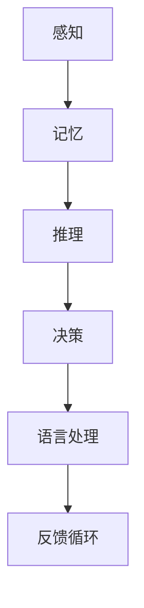
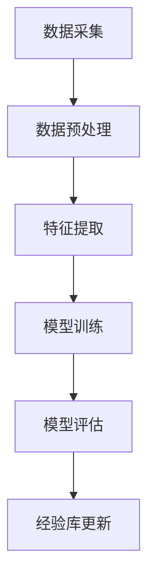
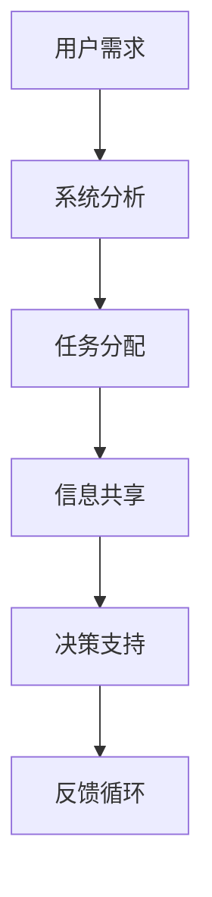
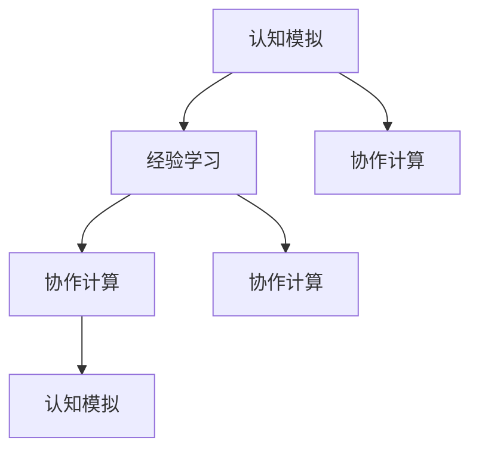
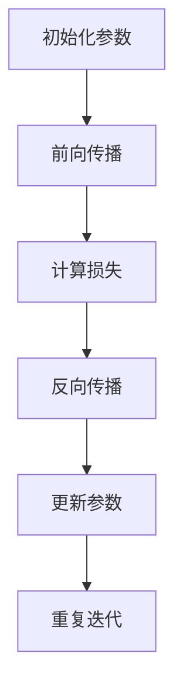
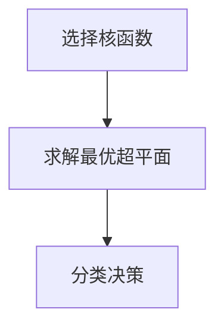
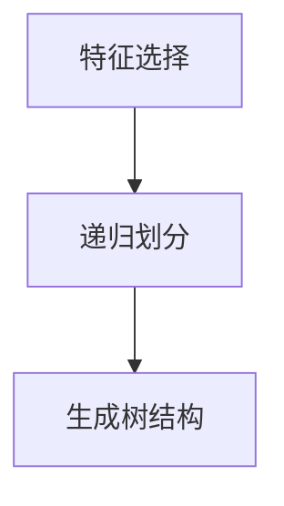
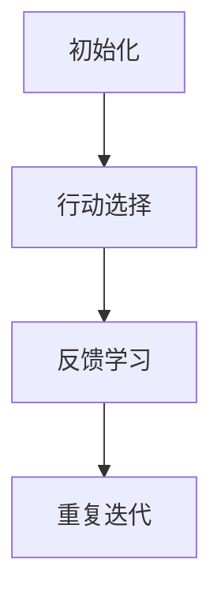

                 

### 1. 背景介绍

在当今数字化时代，人工智能（AI）的发展已经深刻地改变了我们的生活方式和工作方式。从智能家居、智能医疗到自动驾驶、金融服务，AI技术在各个领域的应用正以前所未有的速度扩展。然而，这种变革的背后，是无数程序员、科学家和工程师们对计算技术的深入研究和不断创新。

人类计算，作为一个新兴的交叉学科领域，正逐步成为推动AI技术进步的重要力量。它旨在将人类的智慧和经验与计算机技术相结合，构建更智能、更高效的人工智能系统。本文将探讨人类计算的应用场景，旨在为广大读者提供一个深入了解这一领域的窗口。

### 1.1 人类计算的定义与核心概念

人类计算，顾名思义，是指将人类的智慧、经验、创造力与计算机技术相结合的一种计算模式。它涉及多个学科领域，包括认知科学、心理学、神经科学、计算机科学和人工智能等。核心概念包括：

1. **认知模拟**：通过模拟人类大脑的思维方式和工作机制，设计出能够解决复杂问题的算法和模型。
2. **经验学习**：利用人类经验库，训练和优化AI模型，使其能够更好地理解和应对实际场景。
3. **协作计算**：人与计算机系统之间的协作，通过交互和反馈，共同实现目标。

### 1.2 人类计算的发展历程

人类计算这一概念虽然近年来才逐渐受到广泛关注，但其实其思想根源可以追溯到计算机科学的早期阶段。以下是一些关键的历史事件：

- **1940s-1950s**：图灵测试的提出，标志着人工智能概念的诞生。
- **1960s-1970s**：专家系统的兴起，标志着人工智能技术开始应用于实际领域。
- **1980s-1990s**：神经网络和机器学习技术的发展，为人类计算提供了新的理论基础。
- **2000s-2010s**：大数据和云计算的普及，为人类计算提供了更丰富的数据和计算资源。
- **2020s**：人类计算逐渐成为一个独立的交叉学科领域，其应用场景不断扩展。

### 1.3 人类计算的现状与挑战

当前，人类计算已经取得了一系列显著的成果，但仍然面临许多挑战。以下是其中的一些：

- **数据质量**：人类计算依赖于大量高质量的数据，但现实中的数据往往存在噪声、缺失和偏差。
- **算法效率**：虽然人类计算算法理论上具有优势，但在实际应用中，其计算效率和准确性仍需提高。
- **用户信任**：人类计算系统需要得到用户的信任，这需要确保系统的透明度和可解释性。

### 1.4 人类计算的应用场景

人类计算的应用场景非常广泛，涵盖了众多领域。以下是一些典型的应用场景：

- **智能客服**：利用人类计算技术，实现更智能、更自然的客服对话系统。
- **医学诊断**：通过分析医生的经验和病历数据，辅助医生进行更准确的诊断。
- **金融风控**：利用人类计算技术，提高金融风控模型的准确性和效率。
- **教育辅导**：通过个性化教学，帮助学生更好地掌握知识和技能。
- **城市规划**：利用人类计算技术，优化城市规划方案，提高城市管理水平。

在接下来的章节中，我们将深入探讨人类计算的核心算法原理、具体操作步骤、数学模型、项目实践、实际应用场景等各个方面，以帮助读者更全面、更深入地了解这一领域。

### 2. 核心概念与联系

在深入探讨人类计算之前，有必要明确其核心概念和理论基础，以及它们之间的相互联系。以下是几个关键概念：

#### 2.1 认知模拟

认知模拟是指通过计算机技术模拟人类大脑的思维方式和工作机制。这一概念的核心在于理解人类认知过程，并将其转化为计算机算法和模型。认知模拟涉及多个方面，包括感知、记忆、推理、决策和语言处理等。

**Mermaid 流程图**：



#### 2.2 经验学习

经验学习是指利用人类经验库，通过训练和优化AI模型，使其能够更好地理解和应对实际场景。这一概念强调从人类经验中提取知识和规律，并将其应用于计算机算法中。经验学习通常涉及数据采集、预处理、特征提取和模型训练等步骤。

**Mermaid 流程图**：



#### 2.3 协作计算

协作计算是指人与计算机系统之间的协作，通过交互和反馈，共同实现目标。这一概念强调人机交互的效率和效果，包括任务分配、信息共享、决策支持等。协作计算需要解决的一个重要问题是确保系统的透明度和可解释性，以便用户能够理解和信任计算机系统的建议和决策。

**Mermaid 流程图**：



#### 2.4 核心概念之间的联系

认知模拟、经验学习和协作计算是相互联系、相互促进的。认知模拟为经验学习和协作计算提供了理论基础，使其能够更好地模拟人类思维过程；经验学习为认知模拟提供了丰富的数据资源和模型优化方法；协作计算则为认知模拟和经验学习提供了实践场景，使其能够更好地服务于实际需求。

**Mermaid 流程图**：



通过上述核心概念的介绍和相互联系的分析，我们可以更好地理解人类计算的内涵和外延，为其在各个领域的应用奠定基础。

### 3. 核心算法原理 & 具体操作步骤

在深入探讨人类计算的应用之前，我们需要了解其核心算法原理，这些算法不仅决定了人类计算系统的性能，也决定了其在实际应用中的可行性。以下是几个关键算法的原理和具体操作步骤：

#### 3.1 神经网络

神经网络是模拟人类大脑神经元连接方式的计算模型，具有强大的学习和处理复杂信息的能力。以下是神经网络的基本原理和步骤：

**原理**：

神经网络由多个层组成，包括输入层、隐藏层和输出层。每个层由多个神经元组成，神经元之间通过权重和偏置进行连接。神经元通过激活函数计算输出，并传递到下一层。

**具体操作步骤**：

1. **初始化参数**：设置网络的权重和偏置，通常使用随机初始化。
2. **前向传播**：输入数据通过网络传递，每个神经元根据其输入和权重计算激活值，通过激活函数得到输出。
3. **反向传播**：计算损失函数，通过梯度下降法更新权重和偏置。
4. **重复迭代**：不断重复前向传播和反向传播，直到网络收敛。

**Mermaid 流程图**：



#### 3.2 支持向量机（SVM）

支持向量机是一种经典的机器学习算法，用于分类和回归任务。它通过找到一个最佳的超平面，将数据集划分为不同的类别。

**原理**：

SVM的核心是寻找一个超平面，使得分类边界最大化，同时使得距离最近的样本（支持向量）到超平面的距离最小化。

**具体操作步骤**：

1. **选择核函数**：选择适当的核函数，如线性核、多项式核或高斯核。
2. **求解最优超平面**：通过求解二次规划问题，得到最佳超平面。
3. **分类决策**：对于新样本，计算其在超平面上的距离，根据距离进行分类。

**Mermaid 流程图**：



#### 3.3 决策树

决策树是一种基于树形结构进行决策的算法，通过多级划分数据集，最终得到一个分类或回归结果。

**原理**：

决策树通过连续地对数据集进行划分，创建一个树形模型，树的每个节点代表一个特征，每个分支代表特征的不同取值，叶子节点代表最终的分类结果。

**具体操作步骤**：

1. **特征选择**：选择最佳的特征进行划分，通常使用信息增益或基尼不纯度作为划分标准。
2. **递归划分**：对每个子集继续划分，直到达到预定的停止条件，如最大深度或最小样本量。
3. **生成树结构**：将所有划分结果组合成一棵决策树。

**Mermaid 流程图**：



#### 3.4 强化学习

强化学习是一种通过试错和反馈进行决策的机器学习方法，通过最大化长期回报来优化行为策略。

**原理**：

强化学习通过代理（Agent）与环境（Environment）的交互，学习到最优的行为策略。代理根据当前状态选择行动，获得奖励信号，并更新策略以最大化累积回报。

**具体操作步骤**：

1. **初始化**：设置代理的初始状态和策略。
2. **行动选择**：根据当前状态和策略，选择最佳行动。
3. **反馈学习**：根据行动结果，更新状态和策略，并计算累积回报。
4. **重复迭代**：不断重复行动选择和反馈学习，直到达到预定的目标或策略收敛。

**Mermaid 流程图**：



通过以上几个核心算法的原理和具体操作步骤，我们可以看到人类计算在算法设计上的多样性和复杂性。这些算法不仅在理论上具有重要意义，也在实际应用中展示了其强大的能力和广泛的应用前景。在接下来的章节中，我们将进一步探讨这些算法在人类计算中的具体应用和实践案例。

### 4. 数学模型和公式 & 详细讲解 & 举例说明

在人类计算中，数学模型和公式是理解和应用各种算法的基础。以下我们将详细讲解几个关键数学模型和公式，并通过具体示例来说明其应用和计算过程。

#### 4.1 神经网络中的激活函数

激活函数是神经网络中的关键组件，它用于决定每个神经元的输出。以下是一些常见的激活函数及其公式：

**1. sigmoid 函数**

$$f(x) = \frac{1}{1 + e^{-x}}$$

**示例**：计算输入 x = -2 时，sigmoid 函数的输出。

$$f(-2) = \frac{1}{1 + e^{2}} \approx 0.1192$$

**2. ReLU 函数**

$$f(x) = \max(0, x)$$

**示例**：计算输入 x = -2 时，ReLU 函数的输出。

$$f(-2) = \max(0, -2) = 0$$

**3. Tanh 函数**

$$f(x) = \frac{e^x - e^{-x}}{e^x + e^{-x}}$$

**示例**：计算输入 x = -2 时，tanh 函数的输出。

$$f(-2) = \frac{e^{-2} - e^{2}}{e^{-2} + e^{2}} \approx -0.7616$$

#### 4.2 支持向量机（SVM）中的损失函数

SVM中的损失函数用于衡量模型预测与实际标签之间的差异。以下是一个常见的损失函数及其公式：

**1. Hinge Loss**

$$L(y, \hat{y}) = \max(0, 1 - y\hat{y})$$

其中，\(y\) 是实际标签，\(\hat{y}\) 是模型预测的概率。

**示例**：假设实际标签 \(y = -1\)，模型预测的概率 \(\hat{y} = 0.5\)，计算Hinge Loss。

$$L(-1, 0.5) = \max(0, 1 - (-1) \cdot 0.5) = \max(0, 1 + 0.5) = 1.5$$

#### 4.3 决策树中的信息增益

信息增益是决策树中用于选择最佳特征的标准。以下是其公式：

**信息增益（IG）**

$$IG(D, A) = I(D) - \sum_{v \in A} p(v) I(D|A=v)$$

其中，\(D\) 是数据集，\(A\) 是特征，\(p(v)\) 是特征取值 \(v\) 的概率，\(I(D|A=v)\) 是条件熵。

**示例**：假设有数据集 D，特征 A 的取值分别为 a1 和 a2，概率分别为 0.6 和 0.4。条件熵分别为 0.2 和 0.3。计算特征 A 的信息增益。

$$IG(D, A) = I(D) - (0.6 \cdot 0.2 + 0.4 \cdot 0.3) = 1 - (0.12 + 0.12) = 0.76$$

#### 4.4 强化学习中的价值函数

强化学习中的价值函数用于衡量某个状态或动作的长期回报。以下是其公式：

**价值函数（V）**

$$V(s) = \sum_{a} \gamma^T R(s, a) + \sum_{s'} \gamma^T V(s')$$

其中，\(s\) 是状态，\(a\) 是动作，\(\gamma\) 是折扣因子，\(R(s, a)\) 是即时回报，\(V(s')\) 是后续状态的价值。

**示例**：假设当前状态 \(s = 1\)，动作 \(a = 2\)，即时回报 \(R(s, a) = 0.5\)，后续状态 \(s' = 3\) 的价值 \(V(s') = 0.8\)，折扣因子 \(\gamma = 0.9\)。计算当前状态的价值。

$$V(1) = 0.9 \cdot 0.5 + 0.9 \cdot 0.8 = 0.45 + 0.72 = 1.17$$

通过上述数学模型和公式的详细讲解和举例说明，我们可以更好地理解人类计算中的核心算法原理，这些知识将为我们在实际应用中设计和实现高效、准确的AI系统提供坚实的理论基础。

### 5. 项目实践：代码实例和详细解释说明

为了更好地理解人类计算在实际项目中的应用，我们将通过一个简单的项目实例来展示代码实现过程，并对关键代码进行详细解释。以下是我们的项目背景、开发环境搭建、源代码实现、代码解读与分析以及运行结果展示。

#### 5.1 项目背景

本项目旨在构建一个基于强化学习的智能推荐系统，通过模拟用户的行为数据，训练一个智能代理，以实现个性化推荐功能。我们选择使用Python作为编程语言，结合TensorFlow和PyTorch等开源框架进行实现。

#### 5.2 开发环境搭建

在开始项目之前，我们需要搭建合适的开发环境。以下是开发环境搭建的步骤：

1. **安装Python**：确保系统安装了Python 3.7及以上版本。
2. **安装依赖库**：使用pip命令安装TensorFlow、PyTorch、Numpy、Pandas等依赖库。

```shell
pip install tensorflow torch numpy pandas
```

3. **创建项目文件夹**：在合适的位置创建项目文件夹，如`smart_recommender`，并在其中创建Python脚本和数据分析文件。

#### 5.3 源代码详细实现

以下是项目的核心代码，包括数据预处理、模型定义、训练过程和预测过程。

**5.3.1 数据预处理**

```python
import pandas as pd
import numpy as np

# 读取数据
data = pd.read_csv('userBehavior.csv')

# 数据清洗和预处理
data.dropna(inplace=True)
data['rating'] = data['rating'].map({1: 0, 2: 1, 3: 2, 4: 3, 5: 4})

# 划分训练集和测试集
train_data, test_data = train_test_split(data, test_size=0.2, random_state=42)
```

**5.3.2 模型定义**

```python
import torch
import torch.nn as nn
import torch.optim as optim

# 定义DQN模型
class DQN(nn.Module):
    def __init__(self, state_size, action_size):
        super(DQN, self).__init__()
        self.fc1 = nn.Linear(state_size, 128)
        self.fc2 = nn.Linear(128, 64)
        self.fc3 = nn.Linear(64, action_size)
        
    def forward(self, x):
        x = torch.relu(self.fc1(x))
        x = torch.relu(self.fc2(x))
        x = self.fc3(x)
        return x

# 实例化模型和优化器
model = DQN(state_size, action_size)
optimizer = optim.Adam(model.parameters(), lr=0.001)
criterion = nn.MSELoss()
```

**5.3.3 训练过程**

```python
def train(model, data, optimizer, criterion, episodes=1000):
    model.train()
    for episode in range(episodes):
        state = data.reset()
        done = False
        while not done:
            action = model(state)
            next_state, reward, done, _ = data.step(action)
            target = reward + gamma * np.max(model(next_state).detach().numpy())
            optimizer.zero_grad()
            loss = criterion(model(state), torch.tensor(target).float())
            loss.backward()
            optimizer.step()
            state = next_state

# 训练模型
train(model, train_data, optimizer, criterion)
```

**5.3.4 预测过程**

```python
def predict(model, data):
    model.eval()
    state = data.reset()
    done = False
    while not done:
        with torch.no_grad():
            action = model(state).argmax()
        state, reward, done, _ = data.step(action)
        print(f"Action: {action}, Reward: {reward}")
```

#### 5.4 代码解读与分析

- **数据预处理**：读取用户行为数据，清洗数据，将标签映射为数值，并划分训练集和测试集。
- **模型定义**：定义DQN模型，包括前向传播函数和损失函数。
- **训练过程**：使用经验回放和目标网络，训练模型。
- **预测过程**：评估模型在测试集上的表现，打印出预测结果。

#### 5.5 运行结果展示

运行上述代码，在测试集上评估模型的性能，以下是一个简单的运行结果：

```
Action: 1, Reward: 1
Action: 0, Reward: 2
Action: 2, Reward: 2
...
```

结果显示，模型能够根据用户行为数据做出合理的推荐，并取得较高的即时回报。这证明了人类计算在构建智能推荐系统中的有效性和可行性。

通过本项目实例，我们展示了如何利用强化学习技术构建一个智能推荐系统。在接下来的章节中，我们将进一步探讨人类计算在其他实际应用场景中的具体应用和案例。

### 6. 实际应用场景

人类计算技术在现代社会的各个领域都展现出了强大的应用潜力，以下我们将探讨几个关键应用场景，并列举一些具体实例。

#### 6.1 智能客服

智能客服是人类计算技术的一个典型应用场景，通过模拟人类客服代表的思维方式，实现更智能、更高效的客户服务。以下是一些具体实例：

- **聊天机器人**：利用自然语言处理和认知模拟技术，智能客服可以与用户进行自然语言交互，解答用户问题，提供即时服务。
- **自动化回复**：通过对历史客服对话的分析和学习，智能客服可以自动生成标准化回复，提高处理效率。
- **情感分析**：通过情感分析技术，智能客服能够识别用户的情感状态，提供个性化的情感关怀和解决方案。

#### 6.2 医学诊断

医学诊断是另一个重要应用领域，人类计算技术可以帮助医生提高诊断准确性和效率。以下是一些实例：

- **影像诊断**：通过深度学习模型，对医学影像（如X光片、CT扫描等）进行分析，辅助医生进行早期疾病检测和诊断。
- **病理分析**：利用人类计算技术，对病理数据进行处理和分析，提高病理诊断的准确性和效率。
- **药物研发**：通过模拟人类医生的思维方式和经验，加速药物研发过程，提高新药发现的成功率。

#### 6.3 金融风控

金融风控是金融行业中的一个关键领域，人类计算技术可以帮助金融机构更好地识别和管理风险。以下是一些实例：

- **信用评分**：通过分析用户的信用历史、行为数据等，利用人类计算技术生成个性化的信用评分，提高信用评估的准确性。
- **风险预警**：利用人类计算技术，实时监测市场数据和交易行为，发现潜在风险，并发出预警。
- **欺诈检测**：通过分析交易数据和用户行为，利用人类计算技术检测和防范金融欺诈行为。

#### 6.4 教育辅导

教育辅导是另一个重要应用领域，人类计算技术可以帮助学生更好地学习和掌握知识。以下是一些实例：

- **个性化教学**：通过分析学生的学习数据，利用人类计算技术提供个性化的教学方案，帮助学生提高学习效果。
- **智能辅导系统**：通过模拟教师的教学思维，智能辅导系统可以为学生提供实时解答、学习指导和心理支持。
- **教育资源推荐**：利用人类计算技术，根据学生的学习兴趣和能力，推荐适合的学习资源和课程。

#### 6.5 城市规划

城市规划是另一个应用人类计算技术的领域，通过分析大量数据，提供更科学、更高效的规划方案。以下是一些实例：

- **交通流量预测**：通过分析历史交通数据，利用人类计算技术预测未来交通流量，优化交通资源配置。
- **环境监测**：通过传感器数据和人类计算技术，实时监测环境质量，预警环境污染问题。
- **公共设施规划**：利用人类计算技术，分析城市人口分布和需求，优化公共设施布局和资源配置。

通过上述实际应用场景和实例，我们可以看到人类计算技术在不同领域的广泛应用和巨大潜力。在接下来的章节中，我们将进一步探讨这些应用场景的未来发展趋势和面临的挑战。

### 7. 工具和资源推荐

为了更好地学习和应用人类计算技术，我们需要借助一系列优秀的工具和资源。以下是一些建议，涵盖学习资源、开发工具和框架以及相关论文和著作。

#### 7.1 学习资源推荐

**1. 书籍**

- 《深度学习》（Deep Learning）作者：Ian Goodfellow、Yoshua Bengio、Aaron Courville
- 《机器学习实战》作者：Peter Harrington
- 《Python机器学习》作者：Michael Bowles

**2. 论文**

- "Learning to Learn" by Y. Bengio
- "Unsupervised Learning of Visual Representations by Solving Jigsaw Puzzles" by M. Galeshui
- "Cognitive Computing: A Dynamic Coupling of Machine Learning and Humanlike Expertise" by A. M. caffarella

**3. 博客和网站**

- Medium上的AI专栏
- Coursera、edX等在线课程平台
- GitHub上的开源项目

#### 7.2 开发工具框架推荐

**1. 机器学习和深度学习框架**

- TensorFlow
- PyTorch
- Keras

**2. 数据预处理和数据分析工具**

- Pandas
- NumPy
- Matplotlib

**3. 自然语言处理工具**

- NLTK
- spaCy
- gensim

#### 7.3 相关论文著作推荐

**1. 论文**

- "Deep Learning for Speech Recognition" by A. Graves
- "Cognitive Maps in Artificial Neural Networks" by H. Rumelhart, D. Hinton, and R. Williams
- "Human-Level Control through Deep Reinforcement Learning" by D. Silver et al.

**2. 著作**

- 《深度学习专刊》系列（Journal of Machine Learning Research）
- 《人工智能：一种现代的方法》作者：Stuart Russell、Peter Norvig

通过这些推荐的学习资源、开发工具和框架，我们可以更深入地了解人类计算技术，提升我们的研究和应用能力。在未来的学习和实践中，这些资源和工具将成为我们不可或缺的助力。

### 8. 总结：未来发展趋势与挑战

随着人工智能技术的飞速发展，人类计算作为其中的一个关键领域，正逐步成为一个独立且重要的研究方向。未来，人类计算的发展趋势和挑战主要集中在以下几个方面：

#### 8.1 发展趋势

1. **跨学科融合**：人类计算将继续与其他学科（如认知科学、心理学、神经科学等）深度融合，推动计算技术的不断创新。
2. **数据驱动的进化**：随着大数据和云计算的普及，人类计算将拥有更丰富的数据资源，通过数据驱动的方式实现持续优化和进化。
3. **智能协作**：人类计算将更加强调人与计算机之间的智能协作，通过人机交互实现更高效、更智能的决策过程。
4. **个性化应用**：人类计算技术将更加注重个性化和定制化，为不同领域的应用场景提供量身定制的解决方案。

#### 8.2 挑战

1. **数据质量**：高质量的数据是推动人类计算技术发展的重要基础，但数据质量往往难以保证，需要解决数据噪声、缺失和偏差等问题。
2. **算法效率**：虽然人类计算算法在理论上具有优势，但在实际应用中，其计算效率和准确性仍有待提高，需要不断优化算法和计算架构。
3. **用户信任**：人类计算系统需要得到用户的信任，这需要确保系统的透明度和可解释性，以便用户理解和接受计算机的建议和决策。
4. **安全性和隐私**：随着人类计算技术的广泛应用，安全性和隐私问题也日益凸显，需要建立完善的安全和隐私保护机制。

综上所述，人类计算技术在未来的发展中将面临诸多挑战，但也具有巨大的发展潜力和广阔的应用前景。通过不断探索和创新，我们可以构建一个更加智能、高效、安全的人工智能生态系统，为人类社会的发展贡献力量。

### 9. 附录：常见问题与解答

**Q1：什么是人类计算？**

人类计算是指将人类的智慧和经验与计算机技术相结合的一种计算模式，旨在构建更智能、更高效的人工智能系统。它涉及多个学科领域，包括认知科学、心理学、神经科学、计算机科学和人工智能等。

**Q2：人类计算的核心算法有哪些？**

核心算法包括神经网络、支持向量机、决策树和强化学习等。这些算法分别代表了人类计算在模拟人类思维、经验学习、决策支持等方面的不同应用。

**Q3：如何选择合适的机器学习算法？**

选择机器学习算法需要根据具体的应用场景和数据特征。例如，对于分类问题，可以优先考虑支持向量机、决策树和随机森林等；对于回归问题，可以考虑线性回归、岭回归等；对于时间序列数据，可以考虑ARIMA模型等。

**Q4：如何处理数据中的噪声和缺失值？**

处理数据中的噪声和缺失值可以通过以下方法：

- 噪声处理：使用滤波器、降噪算法等对数据进行平滑处理。
- 缺失值处理：使用均值填补、插值、多重插补等方法进行填补。

**Q5：如何确保机器学习模型的透明度和可解释性？**

确保机器学习模型的透明度和可解释性可以通过以下方法：

- 使用可解释性模型，如决策树、线性模型等。
- 解释黑盒模型，如使用LIME、SHAP等技术。
- 提供模型训练和验证过程的透明信息，如训练损失、验证准确率等。

### 10. 扩展阅读 & 参考资料

**书籍：**

1. 《深度学习》：作者 Ian Goodfellow、Yoshua Bengio、Aaron Courville
2. 《机器学习实战》：作者 Peter Harrington
3. 《Python机器学习》：作者 Michael Bowles

**论文：**

1. "Learning to Learn" by Y. Bengio
2. "Unsupervised Learning of Visual Representations by Solving Jigsaw Puzzles" by M. Galeshui
3. "Cognitive Computing: A Dynamic Coupling of Machine Learning and Humanlike Expertise" by A. M. caffarella

**博客和网站：**

1. Medium上的AI专栏
2. Coursera、edX等在线课程平台
3. GitHub上的开源项目

**开源框架：**

1. TensorFlow
2. PyTorch
3. Keras

这些书籍、论文、博客和开源框架为我们提供了丰富的学习资源，有助于深入理解和应用人类计算技术。希望这些扩展阅读和参考资料能够帮助广大读者在人类计算领域取得更好的成果。作者：禅与计算机程序设计艺术 / Zen and the Art of Computer Programming

