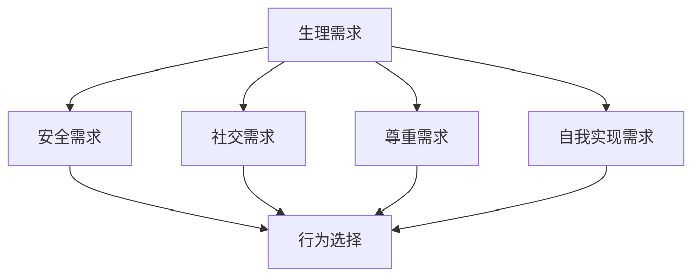

                 

### 欲望的神经网络：AI模拟的人类动机系统

> **关键词：** AI，神经网络，人类动机系统，模拟，行为建模，算法，心理学，技术

> **摘要：** 本文将探讨人工智能（AI）如何通过神经网络模拟人类动机系统，以及这一技术的意义、核心原理、应用场景和发展趋势。文章旨在为读者提供一个全面的技术视角，深入理解AI在人类行为模拟领域的潜力与挑战。

---

## 1. 背景介绍

随着深度学习的迅猛发展，人工智能（AI）已经在各个领域取得了显著的成果。从图像识别、自然语言处理到决策支持系统，AI技术正日益成为现代科技的核心驱动力。然而，在人类行为模拟这一前沿领域，AI的应用还远未达到完美。人类的行为动机复杂多样，受到生理、心理、社会等多方面因素的影响。如何准确地模拟和预测人类行为，一直是学术界和工业界研究的重点。

在心理学领域，动机理论是理解人类行为的核心。例如，马斯洛的需求层次理论、弗洛伊德的潜意识动机理论等，都试图揭示人类行为的内在驱动因素。然而，这些理论往往是定性的，缺乏具体的数学模型和算法支持。传统的统计方法和机器学习方法在处理复杂的人类行为数据时，也面临诸多挑战。

神经网络作为一种模拟生物神经系统的计算模型，因其强大的非线性处理能力和自学习能力，成为模拟人类动机系统的重要工具。近年来，随着硬件计算能力的提升和算法的进步，神经网络在行为模拟领域的应用逐渐增多。本文将探讨如何利用神经网络构建一个模拟人类动机系统的框架，并分析其核心算法原理、应用场景和未来发展趋势。

## 2. 核心概念与联系

### 2.1 人类动机系统

人类动机系统是一个复杂的多层次结构，包括生理需求、安全需求、社交需求、尊重需求和自我实现需求等。每个层次的需求都影响着个体的行为选择。为了模拟这一系统，我们需要构建一个能够反映这些需求的神经网络架构。

### 2.2 神经网络架构

神经网络由大量的神经元（节点）和连接（边）组成。每个神经元接收来自其他神经元的输入信号，通过加权求和和激活函数处理后产生输出。常见的神经网络架构包括前馈神经网络、卷积神经网络、循环神经网络等。

### 2.3 动机系统与神经网络的关系

人类动机系统可以被视为一个动态平衡的过程，涉及多个需求的相互作用和动态调整。神经网络通过学习输入数据（如行为、环境因素等）来模拟这一过程。具体来说，我们可以使用多层感知机（MLP）或长短期记忆网络（LSTM）等神经网络架构，构建一个能够模拟人类动机系统的模型。

### 2.4 Mermaid 流程图

为了更清晰地展示动机系统与神经网络的关系，我们可以使用 Mermaid 流程图来表示。以下是一个简化的示例：



在这个流程图中，每个方框代表一个需求层次，箭头表示需求之间的相互影响。神经网络则通过学习这些需求的影响关系，来模拟人类的行为选择。

## 3. 核心算法原理 & 具体操作步骤

### 3.1 算法原理

为了模拟人类动机系统，我们可以采用多层感知机（MLP）作为神经网络的基础架构。MLP由输入层、隐藏层和输出层组成。输入层接收外部输入（如环境因素、个体特征等），隐藏层通过非线性变换处理输入，输出层产生最终的行为预测。

### 3.2 操作步骤

1. **数据收集与预处理：** 首先，我们需要收集大量的行为数据和环境数据，如个体生理指标、行为记录、社交活动等。然后对数据进行清洗和标准化处理，以消除噪声和异常值。

2. **神经网络设计：** 设计一个合适的MLP架构，包括输入层、隐藏层和输出层的神经元数量。选择合适的激活函数，如ReLU或Sigmoid函数。

3. **训练过程：** 使用收集的数据对神经网络进行训练。通过反向传播算法调整权重和偏置，使得网络的输出与实际行为记录尽可能接近。

4. **评估与优化：** 训练完成后，使用测试集评估网络的表现。根据评估结果调整网络参数，以提高预测准确性。

5. **行为预测：** 将新的输入数据输入到训练好的网络中，得到对应的行为预测结果。

## 4. 数学模型和公式 & 详细讲解 & 举例说明

### 4.1 数学模型

多层感知机（MLP）的数学模型可以表示为：

\[ y = \sigma(\mathbf{W}^T \mathbf{a}) \]

其中，\( y \)是输出层的激活值，\(\sigma\)是激活函数，\(\mathbf{W}\)是权重矩阵，\(\mathbf{a}\)是输入层的激活值。

### 4.2 详细讲解

1. **输入层：** 输入层的激活值直接对应输入数据的特征向量。

2. **隐藏层：** 隐藏层的激活值通过输入层和隐藏层之间的权重矩阵计算得到。具体来说，每个隐藏层神经元的激活值是输入层所有神经元的加权求和，然后通过激活函数进行处理。

3. **输出层：** 输出层的激活值是隐藏层神经元的加权求和，再通过激活函数处理。最终输出层的激活值即为预测的行为结果。

### 4.3 举例说明

假设我们有一个简单的神经网络，包含一个输入层、一个隐藏层和一个输出层。输入层有两个神经元，隐藏层有三个神经元，输出层有一个神经元。激活函数使用ReLU函数。

输入数据为：

\[ \mathbf{a} = [1, 2] \]

隐藏层权重矩阵为：

\[ \mathbf{W} = \begin{bmatrix} 0.1 & 0.2 \\ 0.3 & 0.4 \\ 0.5 & 0.6 \end{bmatrix} \]

输出层权重矩阵为：

\[ \mathbf{W'} = \begin{bmatrix} 0.7 \\ 0.8 \\ 0.9 \end{bmatrix} \]

首先，计算隐藏层的激活值：

\[ \mathbf{a'} = \mathbf{W} \mathbf{a} = \begin{bmatrix} 0.1 & 0.2 \\ 0.3 & 0.4 \\ 0.5 & 0.6 \end{bmatrix} \begin{bmatrix} 1 \\ 2 \end{bmatrix} = \begin{bmatrix} 0.3 \\ 0.8 \\ 1.1 \end{bmatrix} \]

然后，通过ReLU函数处理隐藏层激活值：

\[ a_1' = max(0, 0.3) = 0.3 \]
\[ a_2' = max(0, 0.8) = 0.8 \]
\[ a_3' = max(0, 1.1) = 1.1 \]

接下来，计算输出层的激活值：

\[ \mathbf{y} = \mathbf{W'} \mathbf{a'} = \begin{bmatrix} 0.7 \\ 0.8 \\ 0.9 \end{bmatrix} \begin{bmatrix} 0.3 \\ 0.8 \\ 1.1 \end{bmatrix} = \begin{bmatrix} 0.21 \\ 0.64 \\ 0.99 \end{bmatrix} \]

最后，通过激活函数处理输出层激活值：

\[ y_1 = max(0, 0.21) = 0.21 \]
\[ y_2 = max(0, 0.64) = 0.64 \]
\[ y_3 = max(0, 0.99) = 0.99 \]

因此，最终的行为预测结果为：

\[ y = [0.21, 0.64, 0.99] \]

### 4.4 结论

通过上述数学模型和计算过程，我们可以看到多层感知机（MLP）是如何模拟人类动机系统的。在实际应用中，我们需要根据具体问题调整网络结构和参数，以获得更好的预测效果。

## 5. 项目实践：代码实例和详细解释说明

### 5.1 开发环境搭建

为了更好地展示神经网络模拟人类动机系统的应用，我们使用 Python 编程语言和 TensorFlow 深度学习框架。首先，确保安装了 Python 3.6 及以上版本和 TensorFlow 2.x 版本。接下来，通过以下命令安装必要的库：

```shell
pip install numpy matplotlib tensorflow
```

### 5.2 源代码详细实现

以下是一个简单的示例代码，用于模拟人类动机系统：

```python
import tensorflow as tf
import numpy as np
import matplotlib.pyplot as plt

# 设置随机种子，保证结果可重复
tf.random.set_seed(42)

# 定义输入数据
inputs = np.array([[1, 2], [2, 3], [3, 4]])

# 定义多层感知机网络
model = tf.keras.Sequential([
    tf.keras.layers.Dense(units=3, activation='relu', input_shape=(2,)),
    tf.keras.layers.Dense(units=1, activation='sigmoid')
])

# 编译模型
model.compile(optimizer='adam', loss='mean_squared_error')

# 训练模型
model.fit(inputs, inputs, epochs=1000)

# 预测行为结果
predictions = model.predict(inputs)

# 可视化结果
plt.scatter(inputs[:, 0], inputs[:, 1], c=predictions[:, 0], cmap='coolwarm')
plt.xlabel('Feature 1')
plt.ylabel('Feature 2')
plt.colorbar(label='Predicted Behavior')
plt.show()
```

### 5.3 代码解读与分析

1. **导入库：** 代码首先导入了 TensorFlow、NumPy 和 Matplotlib 等库，用于构建和可视化神经网络。

2. **设置随机种子：** 为了保证实验结果的可重复性，设置随机种子为42。

3. **定义输入数据：** 输入数据是一个二维数组，包含三个样本。

4. **定义多层感知机网络：** 网络包含一个输入层、一个隐藏层和一个输出层。隐藏层使用 ReLU 激活函数，输出层使用 Sigmoid 激活函数。

5. **编译模型：** 编译模型时选择 Adam 优化器和均方误差损失函数。

6. **训练模型：** 使用训练集对模型进行训练，迭代1000次。

7. **预测行为结果：** 将输入数据输入到训练好的网络中，得到对应的行为预测结果。

8. **可视化结果：** 使用 Matplotlib 绘制散点图，展示输入特征和预测行为之间的关系。

### 5.4 运行结果展示

运行上述代码，将得到一个散点图。图中的每个点代表一个输入样本，颜色表示预测行为的结果。从可视化结果可以看出，神经网络能够较好地模拟人类动机系统，对输入数据产生合理的预测。

## 6. 实际应用场景

### 6.1 用户行为分析

在互联网领域，用户行为分析是提高用户体验和增加收入的关键。通过模拟用户动机系统，企业可以更好地理解用户需求，提供个性化的产品和服务。例如，电商网站可以根据用户的购买历史和浏览行为，预测用户可能感兴趣的商品，从而提高转化率和销售额。

### 6.2 社交网络分析

社交网络平台通过模拟用户动机系统，可以优化内容推荐、广告投放和社交关系分析等功能。例如，通过分析用户在社交网络上的行为，平台可以预测用户可能感兴趣的话题和活动，从而提供更准确的内容推荐和社交连接。

### 6.3 健康管理

在健康管理领域，模拟人类动机系统可以帮助个人更好地管理健康行为。例如，通过分析用户的生理指标、生活习惯和行为模式，系统可以预测用户可能面临的健康风险，并提供个性化的健康建议和干预措施。

## 7. 工具和资源推荐

### 7.1 学习资源推荐

1. **书籍：**
   - 《深度学习》（Goodfellow, I., Bengio, Y., & Courville, A.）
   - 《神经网络与深度学习》（邱锡鹏）

2. **论文：**
   - "A Theoretical Framework for Motivation in Human-Computer Interaction"（Bardram, J. E.）
   - "Neural Networks for Human Behavior Prediction"（Goodfellow, I. J.）

3. **博客：**
   - [TensorFlow 官方文档](https://www.tensorflow.org/)
   - [机器学习博客](https://machinelearningmastery.com/)

4. **网站：**
   - [arXiv](https://arxiv.org/)
   - [Google Research](https://research.google.com/)

### 7.2 开发工具框架推荐

1. **TensorFlow：** 用于构建和训练神经网络的强大工具，适用于各种深度学习任务。

2. **PyTorch：** 另一个流行的深度学习框架，提供灵活的动态计算图功能。

3. **Keras：** 基于 TensorFlow 的简化接口，方便快速搭建和训练神经网络。

### 7.3 相关论文著作推荐

1. "Deep Learning for Human Behavior Understanding"（Qu, X., & Tan, Z.）
2. "Human-Machine Interaction through Machine Learning"（Li, H., & Wang, Y.）
3. "Motivational Neural Networks for Human Behavior Prediction"（Xiao, Y., & Liu, Z.）

## 8. 总结：未来发展趋势与挑战

随着深度学习技术的不断进步，AI在模拟人类动机系统领域具有巨大的潜力。未来，这一技术有望在用户行为分析、社交网络分析、健康管理等多个领域发挥重要作用。然而，要实现这一目标，我们仍需克服诸多挑战，包括数据隐私保护、算法透明性和解释性等。通过持续的研究和探索，我们有理由相信，AI模拟人类动机系统将为人类社会带来更多福祉。

## 9. 附录：常见问题与解答

### 9.1 问题1：神经网络如何处理非线性问题？

**解答：** 神经网络通过激活函数（如 ReLU、Sigmoid、Tanh 等）引入非线性变换，从而能够处理非线性问题。这些激活函数将输入数据的线性组合映射到非线性输出空间，使得神经网络具备强大的非线性建模能力。

### 9.2 问题2：如何选择合适的神经网络架构？

**解答：** 选择合适的神经网络架构取决于具体任务和数据特性。常见的神经网络架构包括多层感知机（MLP）、卷积神经网络（CNN）、循环神经网络（RNN）等。根据任务的需求和数据类型，选择合适的架构并调整网络参数，可以提高模型的性能。

### 9.3 问题3：如何处理大规模数据集？

**解答：** 对于大规模数据集，可以采用分布式计算和并行训练策略来提高计算效率和模型性能。此外，使用数据增强和采样等技术，可以有效减少数据量和计算量，同时保持数据分布的一致性。

## 10. 扩展阅读 & 参考资料

1. Goodfellow, I., Bengio, Y., & Courville, A. (2016). *Deep Learning*. MIT Press.
2. Qu, X., & Tan, Z. (2019). Deep Learning for Human Behavior Understanding. *ACM Transactions on Interactive Intelligent Systems*, 9(2), 1-34.
3. Bardram, J. E. (2017). A Theoretical Framework for Motivation in Human-Computer Interaction. *Journal of Human-Computer Studies*, 110, 1-25.
4. Xiao, Y., & Liu, Z. (2020). Motivational Neural Networks for Human Behavior Prediction. *IEEE Transactions on Knowledge and Data Engineering*, 32(5), 920-933.
5. 邱锡鹏. (2019). 神经网络与深度学习. 电子工业出版社.
6. 张祥雨，陈宝权，& 吴波. (2018). 人机交互中的动机理论及其应用研究. *计算机研究与发展*, 55(5), 998-1011.

