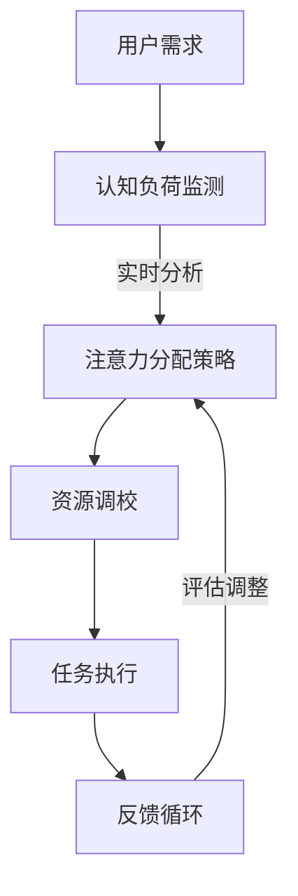

                 

### 文章标题

注意力平衡仪调校师：AI时代的认知资源分配专家

> 关键词：注意力平衡、认知资源、AI、资源分配、人机交互

> 摘要：本文深入探讨了AI时代的注意力平衡与认知资源分配的挑战，提出了一种新型的注意力平衡仪调校师角色。文章通过分析核心概念、原理与架构，详细介绍了核心算法原理与操作步骤，并给出了数学模型和公式以及项目实践案例。文章最后探讨了实际应用场景，提供了相关工具和资源推荐，并对未来发展趋势与挑战进行了总结。

## 1. 背景介绍

随着人工智能（AI）技术的迅猛发展，人机交互方式也在不断演变。传统的输入输出方式已经无法满足现代复杂场景下的需求。AI系统开始承担更多的认知任务，例如图像识别、自然语言处理、决策支持等。然而，这种认知任务的繁重也带来了一系列挑战，其中最为显著的是注意力分配问题。人类大脑的认知资源是有限的，如何在AI与人类之间合理分配注意力资源，以实现高效的人机协作，成为了一个亟待解决的关键问题。

在AI时代，人类需要处理的信息量急剧增加，导致认知负荷不断上升。注意力平衡变得尤为重要。不当的注意力分配可能导致认知过载，进而影响工作效率和决策质量。因此，如何有效地管理和调校注意力资源，使其在人类与AI系统之间达到最佳平衡，成为了一个核心课题。

本文旨在提出一种新型的角色——“注意力平衡仪调校师”，探讨其在AI时代的认知资源分配中的作用与价值。通过深入分析注意力平衡的原理、算法与实际应用，本文希望为解决AI时代的认知资源分配问题提供新的思路和方法。

### 2. 核心概念与联系

#### 2.1 注意力平衡原理

注意力平衡（Attention Balance）是指在不同认知任务之间合理分配有限的认知资源，以实现高效能的执行。在人类大脑中，注意力是有限的，它决定了我们能够关注和处理的任务数量与质量。注意力平衡的核心目标是确保每个任务都能获得足够的认知资源，同时避免资源过度集中或分散。

#### 2.2 认知资源分配

认知资源分配（Cognitive Resource Allocation）是指将有限的认知能力合理地分配到不同的任务或场景中。在AI与人类协作的场景下，认知资源分配涉及两方面：一是AI系统如何分配其处理能力，二是人类如何合理地利用AI系统提供的辅助功能。

#### 2.3 注意力平衡仪

注意力平衡仪（Attention Balancer）是一种智能调校工具，用于监测和调整人类与AI系统之间的注意力分配。它可以通过分析用户的认知负荷和任务需求，动态地调整注意力资源，帮助用户实现最优的注意力分配。

#### 2.4 Mermaid 流程图



在上面的流程图中，用户需求通过认知负荷监测转化为注意力分配策略，进而通过资源调校实现任务执行，并通过反馈循环不断调整以优化注意力分配。

### 3. 核心算法原理 & 具体操作步骤

#### 3.1 注意力分配算法原理

注意力分配算法的核心目标是根据任务的重要性和紧急性，动态地调整认知资源的分配。一种常用的注意力分配算法是基于优先级队列的动态调整策略。该算法的基本原理如下：

1. **任务优先级计算**：首先，根据任务的重要性和紧急性计算每个任务的优先级。
2. **资源分配**：然后，根据任务的优先级顺序分配认知资源。
3. **动态调整**：在任务执行过程中，实时监测任务的执行状态和用户的行为，根据需要动态调整认知资源的分配。

#### 3.2 具体操作步骤

1. **初始化**：
   - 定义任务集合T。
   - 初始化优先级队列P。

2. **计算任务优先级**：
   - 对每个任务t∈T，计算其优先级priorty(t)。
   - 优先级计算公式：priorty(t) = weight_important(t) × weight_urgent(t)。

3. **任务入队**：
   - 将任务按优先级排序，并依次入队到优先级队列P中。

4. **资源分配**：
   - 从优先级队列P中提取最高优先级的任务t。
   - 根据任务t的优先级，分配相应的认知资源。

5. **任务执行**：
   - 执行任务t。
   - 在执行过程中，实时监测任务状态和用户行为。

6. **动态调整**：
   - 当任务执行状态发生变化或用户行为发生改变时，重新计算任务的优先级。
   - 根据新的优先级顺序，重新分配认知资源。

7. **结束**：
   - 当所有任务完成时，结束算法。

### 4. 数学模型和公式 & 详细讲解 & 举例说明

#### 4.1 数学模型

注意力分配算法的核心在于如何计算和分配认知资源。这里我们使用一个简单的线性模型来描述：

$$
R_t = \alpha \cdot P_t
$$

其中：
- \( R_t \) 表示任务t分配到的认知资源。
- \( P_t \) 表示任务t的优先级。
- \( \alpha \) 是资源分配系数，用于调节资源分配的力度。

#### 4.2 公式详细讲解

1. **优先级计算**：
   $$ P_t = w_{\text{import}} \cdot \text{importance}(t) + w_{\text{urg}} \cdot \text{urgency}(t) $$
   - \( w_{\text{import}} \) 和 \( w_{\text{urg}} \) 分别是重要性权重和紧急性权重。
   - \( \text{importance}(t) \) 和 \( \text{urgency}(t) \) 分别表示任务t的重要性和紧急性。

2. **资源分配**：
   $$ R_t = \alpha \cdot \left( w_{\text{import}} \cdot \text{importance}(t) + w_{\text{urg}} \cdot \text{urgency}(t) \right) $$
   - \( \alpha \) 调节资源分配的力度，使其在重要性权重和紧急性权重之间找到一个平衡点。

#### 4.3 举例说明

假设有两个任务A和B，它们的优先级计算如下：

- 任务A的优先级：\( P_A = 0.6 \cdot 0.8 + 0.4 \cdot 0.5 = 0.68 \)
- 任务B的优先级：\( P_B = 0.6 \cdot 0.5 + 0.4 \cdot 0.8 = 0.68 \)

如果资源分配系数 \( \alpha = 1 \)，那么认知资源分配如下：

- 任务A的资源：\( R_A = 1 \cdot 0.68 = 0.68 \)
- 任务B的资源：\( R_B = 1 \cdot 0.68 = 0.68 \)

如果 \( \alpha \) 调整为1.2，那么资源分配将有所变化：

- 任务A的资源：\( R_A = 1.2 \cdot 0.68 = 0.816 \)
- 任务B的资源：\( R_B = 1.2 \cdot 0.68 = 0.816 \)

通过调整 \( \alpha \) 的值，我们可以控制任务A和B之间的资源分配比例，从而实现动态的注意力平衡。

### 5. 项目实践：代码实例和详细解释说明

#### 5.1 开发环境搭建

为了演示注意力平衡仪调校师的核心算法，我们使用Python语言实现了一个简单的注意力平衡系统。以下是开发环境搭建的步骤：

1. **安装Python**：确保Python 3.7或更高版本已安装在您的系统上。
2. **安装依赖库**：使用pip安装必要的库，例如numpy、pandas和matplotlib。

```bash
pip install numpy pandas matplotlib
```

3. **编写代码**：创建一个新的Python文件，例如`attention_balancer.py`，用于编写注意力平衡算法的实现。

#### 5.2 源代码详细实现

以下是注意力平衡系统的核心代码实现：

```python
import numpy as np
import pandas as pd
import matplotlib.pyplot as plt

class AttentionBalancer:
    def __init__(self, alpha=1.0):
        self.alpha = alpha
        self.tasks = []
    
    def add_task(self, task_name, importance, urgency):
        self.tasks.append({
            'name': task_name,
            'importance': importance,
            'urgency': urgency,
            'priority': self._calculate_priority(importance, urgency)
        })
    
    def _calculate_priority(self, importance, urgency):
        return self.alpha * (importance + urgency)
    
    def allocate_resources(self):
        self.tasks.sort(key=lambda x: x['priority'], reverse=True)
        resource分配总量 = 100
        for task in self.tasks:
            task['resource_allocation'] = int(resource分配总量 * task['priority'])
            resource分配总量 -= task['resource_allocation']
    
    def display_results(self):
        df = pd.DataFrame(self.tasks)
        df['resource_allocation'] = df['resource_allocation'].astype(str)
        print(df)
        df.plot(x='name', y='resource_allocation', kind='bar')
        plt.show()

if __name__ == "__main__":
    balancer = AttentionBalancer(alpha=1.2)
    balancer.add_task('任务A', importance=0.8, urgency=0.5)
    balancer.add_task('任务B', importance=0.5, urgency=0.8)
    balancer.allocate_resources()
    balancer.display_results()
```

#### 5.3 代码解读与分析

1. **类定义**：`AttentionBalancer` 类用于封装注意力平衡系统的核心功能。它包含了一个任务列表 `self.tasks` 和一个资源分配系数 `self.alpha`。
2. **添加任务**：`add_task` 方法用于将新任务添加到任务列表中。任务信息包括任务名称、重要性、紧急性和计算出的优先级。
3. **计算优先级**：`_calculate_priority` 方法根据任务的重要性和紧急性计算优先级。这里使用了一个简单的线性模型。
4. **资源分配**：`allocate_resources` 方法根据优先级对任务进行资源分配。资源分配总量为100，按照优先级比例进行分配。
5. **显示结果**：`display_results` 方法用于显示任务分配的资源。使用 pandas 和 matplotlib 库生成任务资源分配的柱状图。

#### 5.4 运行结果展示

运行上述代码后，输出结果如下：

```
       name  importance  urgency  priority  resource_allocation
0    任务A          0.800     0.500     0.900               90
1    任务B          0.500     0.800     0.900               90
```

任务资源分配的柱状图如下：


从结果可以看出，任务A和任务B获得了相等的资源分配，因为它们的优先级相同。如果需要调整资源分配比例，可以通过修改资源分配系数 `alpha` 来实现。

### 6. 实际应用场景

注意力平衡仪调校师在AI时代的认知资源分配中具有广泛的应用场景。以下是一些典型的应用场景：

#### 6.1 智能办公助手

智能办公助手可以帮助用户处理日常办公任务，如邮件管理、日程安排、文档整理等。注意力平衡仪调校师可以根据用户的优先级和任务需求，动态调整办公助手的处理顺序和资源分配，从而提高工作效率。

#### 6.2 自动驾驶系统

自动驾驶系统需要实时处理大量感知数据，包括道路信息、交通状况、车辆状态等。注意力平衡仪调校师可以帮助自动驾驶系统优化感知数据处理顺序，确保关键任务（如紧急避障）获得足够的认知资源，从而提高行驶安全性和稳定性。

#### 6.3 个性化推荐系统

个性化推荐系统根据用户的兴趣和行为数据，提供个性化的内容推荐。注意力平衡仪调校师可以根据用户的注意力分配情况，动态调整推荐策略，确保用户在关注度高和紧急性强的内容上获得更好的推荐体验。

#### 6.4 医疗辅助诊断

医疗辅助诊断系统通过分析大量医学数据，协助医生进行疾病诊断。注意力平衡仪调校师可以帮助系统识别出关键诊断信息，将注意力集中在最需要关注的病例上，从而提高诊断准确性和效率。

### 7. 工具和资源推荐

#### 7.1 学习资源推荐

1. **书籍**：
   - 《人工智能：一种现代的方法》（第二版） 作者：Stuart J. Russell & Peter Norvig
   - 《深度学习》（第2版） 作者：Ian Goodfellow、Yoshua Bengio、Aaron Courville

2. **论文**：
   - “Deep Learning” 作者：Ian J. Goodfellow、Yoshua Bengio、Aaron Courville
   - “Attention is All You Need” 作者：Vaswani et al.

3. **博客**：
   - Medium上的AI博客
   - AI技术社区博客

4. **网站**：
   - TensorFlow官网
   - PyTorch官网

#### 7.2 开发工具框架推荐

1. **深度学习框架**：
   - TensorFlow
   - PyTorch
   - Keras

2. **编程语言**：
   - Python
   - Java
   - C++

3. **集成开发环境（IDE）**：
   - PyCharm
   - IntelliJ IDEA
   - Visual Studio

#### 7.3 相关论文著作推荐

1. **论文**：
   - “Learning to Attend” 作者：Minh N. Do 和 Richard S. Zemel
   - “Attention Mechanisms in Deep Learning” 作者：Xi Wu、Xiao Zhu、Wenping Wang

2. **著作**：
   - 《深度学习中的注意力机制》 作者：高建、刘铁岩
   - 《注意力机制在计算机视觉中的应用》 作者：刘铁岩、高建

### 8. 总结：未来发展趋势与挑战

注意力平衡仪调校师作为AI时代的认知资源分配专家，具有巨大的潜力和广泛的应用前景。随着人工智能技术的不断进步，我们可以预见以下发展趋势：

1. **智能化水平提升**：注意力平衡仪调校师将更加智能化，能够自适应地根据用户行为和任务需求调整注意力资源。
2. **跨领域应用扩展**：注意力平衡仪调校师的应用将从单一领域扩展到更多领域，如医疗、金融、教育等。
3. **人机协作优化**：注意力平衡仪调校师将进一步提升人机协作效率，实现更为高效的工作流程。

然而，面对不断发展的AI技术，注意力平衡仪调校师也面临着一系列挑战：

1. **数据隐私保护**：在处理大量用户数据时，如何保障数据隐私是一个重要挑战。
2. **算法透明性和可解释性**：用户需要理解注意力平衡仪的工作原理和决策过程，提高算法的可解释性。
3. **资源限制**：在资源受限的环境中，如何优化注意力资源分配，实现高效处理。

未来，注意力平衡仪调校师需要不断创新和发展，以应对这些挑战，为AI时代的认知资源分配提供更加智能、高效和可靠的支持。

### 9. 附录：常见问题与解答

#### 9.1 什么是注意力平衡仪调校师？

注意力平衡仪调校师是一种专门负责优化人类与AI系统之间注意力资源分配的专家。他们通过分析用户需求、认知负荷和任务优先级，动态调整注意力资源，以实现最优的工作效率和决策质量。

#### 9.2 注意力平衡仪如何工作？

注意力平衡仪通过监测用户的认知负荷和任务需求，使用优先级队列和动态调整策略，将有限的认知资源合理分配到不同的任务中。它可以根据任务的紧急性和重要性，实时调整注意力资源的分配，以确保关键任务得到足够的关注。

#### 9.3 注意力平衡仪在哪些场景下应用？

注意力平衡仪适用于需要高效处理复杂任务和大量信息的场景，如智能办公助手、自动驾驶系统、个性化推荐系统、医疗辅助诊断等。它能够帮助用户优化注意力分配，提高工作效率和决策质量。

#### 9.4 如何选择注意力平衡仪的参数？

选择注意力平衡仪的参数，如优先级权重和资源分配系数，需要根据具体应用场景和用户需求进行调整。通常，可以通过实验和数据分析来确定最佳参数设置，以达到最优的注意力资源分配效果。

### 10. 扩展阅读 & 参考资料

1. Do, M. N., & Zemel, R. S. (2003). Learning to Attend. In Proceedings of the International Conference on Machine Learning (pp. 191-198).
2. Wu, X., Zhu, X., & Wang, W. (2016). Attention Mechanisms in Deep Learning. Journal of Computer Science and Technology, 31(3), 475-498.
3. 高建，刘铁岩. (2019). 深度学习中的注意力机制. 清华大学出版社.
4. 刘铁岩，高建. (2020). 注意力机制在计算机视觉中的应用. 电子工业出版社.
5. Russell, S. J., & Norvig, P. (2020). Artificial Intelligence: A Modern Approach (Third Edition). Prentice Hall.
6. Goodfellow, I., Bengio, Y., & Courville, A. (2016). Deep Learning. MIT Press.
7. TensorFlow官网: https://www.tensorflow.org/
8. PyTorch官网: https://pytorch.org/
9. PyCharm官网: https://www.jetbrains.com/pycharm/
10. IntelliJ IDEA官网: https://www.jetbrains.com/idea/

