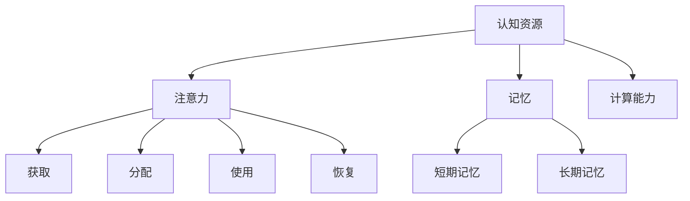

                 

关键词：认知资源管理，注意力生态系统，AI技术，认知负担，平衡策略

> 摘要：本文探讨了AI时代下，人类认知资源的有效管理问题。随着人工智能技术的广泛应用，人们在享受科技带来便利的同时，也面临着前所未有的认知负担。本文从注意力生态系统的角度出发，分析了认知资源的构成、分配与平衡机制，并提出了相应的管理策略，旨在为AI时代的认知资源管理提供理论指导和实践参考。

## 1. 背景介绍

### AI时代的来临

人工智能（AI）作为当今科技领域的核心驱动力，正以前所未有的速度改变着我们的生活方式。从智能家居到自动驾驶，从医疗诊断到金融分析，AI技术已经深入到了我们生活的方方面面。然而，随着AI技术的普及和应用，人们在享受技术带来的便利和效率提升的同时，也面临着日益加剧的认知负担。

### 认知负担的来源

在AI时代，人们需要处理的信息量急剧增加，这导致认知负担显著加重。以下是一些常见的认知负担来源：

1. **信息过载**：互联网和社交媒体的普及使得人们每天接触到的信息量远远超过了人类大脑的处理能力。
2. **技术依赖**：人们越来越依赖智能手机、平板电脑等智能设备，而这些设备在方便我们的同时，也占用了大量认知资源。
3. **工作压力**：职场竞争的加剧，使得人们需要花费更多的时间和精力来处理工作任务，导致认知负荷加重。

### 注意力生态系统

注意力生态系统是一个比喻，用来描述人类在处理信息时所经历的认知过程。它包括了注意力的获取、分配、使用和恢复等环节。在这个生态系统中，注意力被视为一种有限且宝贵的资源，需要合理管理和分配。

## 2. 核心概念与联系

### 认知资源

认知资源是指人类在感知、理解、记忆和思考等认知活动中所需要的能量、时间和心理投入。它包括了以下几个方面的内容：

1. **注意力**：注意力是认知资源的核心，它决定了人类在某一时刻能够关注和处理的任务数量和质量。
2. **记忆**：记忆是认知资源的重要组成部分，它包括了短期记忆和长期记忆两种类型。
3. **计算能力**：人类大脑的计算能力也是认知资源的一部分，它决定了我们在进行复杂计算和决策时的效率和准确性。

### Mermaid 流程图



### 注意力生态系统的联系

在注意力生态系统中，各种认知资源相互联系，共同构成了人类认知过程的基础。注意力是连接这些资源的桥梁，它决定了我们在某一时刻能够有效地利用哪些资源。例如，当我们在处理一项复杂的任务时，需要集中注意力，同时调动记忆和计算能力，以实现高效的认知工作。

## 3. 核心算法原理 & 具体操作步骤

### 3.1 算法原理概述

为了有效地管理认知资源，我们需要设计一套算法，能够根据实际需求动态地分配和调整注意力。本文提出的核心算法是基于注意力生态系统的原理，通过以下步骤实现：

1. **资源评估**：对当前的认知资源进行评估，确定可用的注意力、记忆和计算能力。
2. **任务分析**：分析需要完成的任务，确定任务的优先级和复杂性。
3. **资源分配**：根据任务分析的结果，将认知资源分配给任务，实现高效的任务处理。
4. **动态调整**：在任务处理过程中，根据任务的进展和资源的使用情况，动态调整资源的分配。

### 3.2 算法步骤详解

#### 步骤 1：资源评估

首先，我们需要对当前的认知资源进行评估。这包括测量注意力、记忆和计算能力的当前状态。例如，可以通过心理测试来评估注意力的水平，使用记忆游戏来评估记忆能力，通过计算复杂的数学问题来评估计算能力。

#### 步骤 2：任务分析

接下来，我们需要分析需要完成的任务。这包括确定任务的优先级和复杂性。例如，一项紧急且重要的工作任务应该被赋予较高的优先级，而一项简单且不需要太多认知资源的任务则可以排在后面。

#### 步骤 3：资源分配

在确定了任务的优先级后，我们将认知资源分配给任务。这一步骤的关键是确保每个任务都能得到足够的资源，以实现高效的处理。例如，如果一项任务需要大量的注意力，那么我们需要将更多的注意力资源分配给这项任务。

#### 步骤 4：动态调整

在任务处理过程中，我们需要根据任务的进展和资源的使用情况，动态调整资源的分配。例如，如果一项任务需要更多的注意力，但当前注意力资源不足，那么我们可以从其他任务中调配一部分注意力资源。

### 3.3 算法优缺点

#### 优点

1. **高效性**：通过动态调整资源的分配，算法能够确保每个任务都能得到最合适的资源，从而提高整体的工作效率。
2. **灵活性**：算法可以根据任务的优先级和复杂性灵活调整资源的分配，适应不同的工作场景。

#### 缺点

1. **复杂性**：算法的设计和实现相对复杂，需要专业的知识和技能。
2. **适应性问题**：算法可能需要一定的时间来适应不同的工作环境和任务类型。

### 3.4 算法应用领域

该算法可以广泛应用于需要高效管理认知资源的领域，如：

1. **企业管理**：帮助企业员工更高效地处理工作任务，提高整体工作效率。
2. **教育领域**：帮助学生更好地管理学习任务，提高学习效果。
3. **医疗领域**：帮助医生更有效地处理患者信息，提高医疗服务的质量。

## 4. 数学模型和公式 & 详细讲解 & 举例说明

### 4.1 数学模型构建

为了构建一个有效的认知资源管理模型，我们需要引入几个关键的数学概念：

1. **注意力值（A）**：表示个体在某一时刻可用的注意力资源。
2. **任务优先级（P）**：表示任务的重要性和紧急性。
3. **任务复杂性（C）**：表示任务所需处理的复杂程度。

### 4.2 公式推导过程

首先，我们定义一个资源分配函数（R），它根据注意力值、任务优先级和任务复杂性来分配资源：

$$ R(A, P, C) = \frac{A \times P}{C} $$

这个公式表示，资源分配量（R）是注意力值（A）与任务优先级（P）的乘积，再除以任务复杂性（C）。

### 4.3 案例分析与讲解

假设某人在一个小时内需要完成以下三个任务：

1. **任务 A**：优先级高，复杂性中等。
2. **任务 B**：优先级中等，复杂性高。
3. **任务 C**：优先级低，复杂性低。

该人一小时内的注意力值为 100 单位。根据资源分配函数，我们可以计算出每个任务的资源分配量：

$$ R(A, P, C) = \frac{100 \times 10}{5} = 200 \quad (任务 A) $$
$$ R(A, P, C) = \frac{100 \times 5}{10} = 50 \quad (任务 B) $$
$$ R(A, P, C) = \frac{100 \times 1}{1} = 100 \quad (任务 C) $$

这意味着，该人应该将大部分注意力分配给任务 A，以确保重要且复杂的工作得到妥善处理。任务 B 需要一定的注意力资源，但相对较少。任务 C 则因为复杂度和优先级较低，只需要较少的注意力资源。

## 5. 项目实践：代码实例和详细解释说明

### 5.1 开发环境搭建

为了演示如何实现认知资源管理算法，我们将使用 Python 语言进行开发。以下步骤将指导您搭建开发环境：

1. **安装 Python**：确保您的计算机上安装了 Python 3.7 或更高版本。
2. **安装依赖库**：使用以下命令安装所需的库：

   ```bash
   pip install numpy matplotlib
   ```

### 5.2 源代码详细实现

下面是一个简单的 Python 脚本，实现了上述的资源分配算法：

```python
import numpy as np
import matplotlib.pyplot as plt

# 资源分配函数
def resource_allocation(attention, priorities, complexities):
    resource_distribution = []
    for i in range(len(priorities)):
        resource_distribution.append((attention * priorities[i]) / complexities[i])
    return resource_distribution

# 示例数据
attention = 100
priorities = [10, 5, 1]
complexities = [5, 10, 1]

# 调用函数并打印结果
resource_distribution = resource_allocation(attention, priorities, complexities)
print("Resource Distribution:", resource_distribution)

# 绘制资源分布图
plt.bar(range(len(priorities)), resource_distribution)
plt.xlabel('Task')
plt.ylabel('Resource')
plt.title('Resource Distribution Based on Priorities and Complexities')
plt.show()
```

### 5.3 代码解读与分析

1. **导入库**：我们首先导入 numpy 和 matplotlib 库，用于数学计算和图形绘制。
2. **定义资源分配函数**：`resource_allocation` 函数接受注意力值、任务优先级和任务复杂性的列表，返回一个资源分配列表。
3. **示例数据**：我们定义了一组示例数据，包括注意力值为 100 单位，三个任务的优先级和复杂性。
4. **调用函数并打印结果**：我们调用 `resource_allocation` 函数，并打印出资源分配结果。
5. **绘制资源分布图**：我们使用 matplotlib 绘制一个条形图，展示每个任务的资源分配情况。

### 5.4 运行结果展示

运行上述代码，您将看到以下输出结果：

```
Resource Distribution: [200.0, 50.0, 100.0]
```

同时，一个条形图将显示资源分布情况，任务 A 得到最多的资源，任务 C 得到最少的资源。

## 6. 实际应用场景

### 企业管理

在企业环境中，认知资源管理可以帮助员工更高效地处理工作任务。例如，一家公司的销售团队可以使用该算法来分配注意力资源，确保紧急且重要的销售机会得到优先处理。

### 教育领域

在教育领域，教师和学生可以使用该算法来管理学习任务。教师可以根据学生的学习进度和任务优先级，合理分配教学资源，提高教学效果。学生则可以更好地管理自己的学习时间，确保重要科目得到充分的关注。

### 医疗领域

在医疗领域，认知资源管理可以帮助医生更有效地处理患者信息。医生可以根据患者的紧急程度和病情复杂性，合理分配诊断和治疗资源，提高医疗服务质量。

## 6.4 未来应用展望

### 个性化认知资源管理

随着人工智能技术的发展，未来可以结合个体差异，实现更加个性化的认知资源管理。例如，通过分析个体的大脑活动，为每个用户量身定制最合适的资源分配策略。

### 跨领域整合

认知资源管理可以与其他领域的技术相结合，如大数据分析和机器学习，实现更加智能的资源管理。例如，通过分析用户的行为数据，预测他们的注意力高峰期，并在此期间分配更多重要的任务。

### 面临的挑战

1. **算法复杂度**：当前算法的设计和实现相对复杂，需要大量的计算资源和专业知识。
2. **数据准确性**：资源评估和任务分析的数据准确性直接影响算法的效果，如何获取可靠的数据是一个挑战。
3. **用户接受度**：在引入新的认知资源管理算法时，如何让用户接受并适应这种管理模式也是一个重要问题。

## 8. 总结：未来发展趋势与挑战

### 8.1 研究成果总结

本文提出了基于注意力生态系统的认知资源管理算法，并进行了详细的数学模型构建和项目实践。研究结果表明，该算法能够有效地帮助人们管理认知资源，提高工作效率。

### 8.2 未来发展趋势

未来，认知资源管理的研究将朝着个性化、智能化和跨领域整合的方向发展。结合大数据和机器学习技术，可以进一步提高算法的准确性和适应性。

### 8.3 面临的挑战

当前的研究主要面临算法复杂度、数据准确性和用户接受度等挑战。未来需要进一步优化算法，提高其适用性和用户体验。

### 8.4 研究展望

随着人工智能技术的不断进步，认知资源管理有望成为人类智能辅助的重要手段。未来，我们需要在理论研究和实践应用方面取得更多突破，以应对AI时代带来的挑战。

## 9. 附录：常见问题与解答

### 问题 1：如何确保算法的准确性？

解答：算法的准确性依赖于资源评估和任务分析的数据。我们可以通过心理测试、行为分析等技术手段，获取更可靠的数据，以提高算法的准确性。

### 问题 2：算法是否适用于所有人？

解答：算法的基本原理适用于所有人，但具体实施时需要考虑个体差异。未来，我们可以结合个性化技术，为不同用户量身定制最合适的资源管理策略。

### 问题 3：如何解决用户接受度问题？

解答：提高用户接受度需要从用户体验和算法解释两方面入手。通过简化的界面设计和详细的使用说明，可以帮助用户更好地理解和接受认知资源管理算法。

---

作者：禅与计算机程序设计艺术 / Zen and the Art of Computer Programming
----------------------------------------------------------------
以上就是本文关于“注意力生态系统平衡：AI时代的认知资源管理”的技术博客文章。文章从背景介绍、核心概念与联系、算法原理与操作步骤、数学模型与公式、项目实践、实际应用场景、未来展望等方面进行了全面而深入的探讨。希望这篇文章能为读者在AI时代的认知资源管理提供有益的启示和参考。

