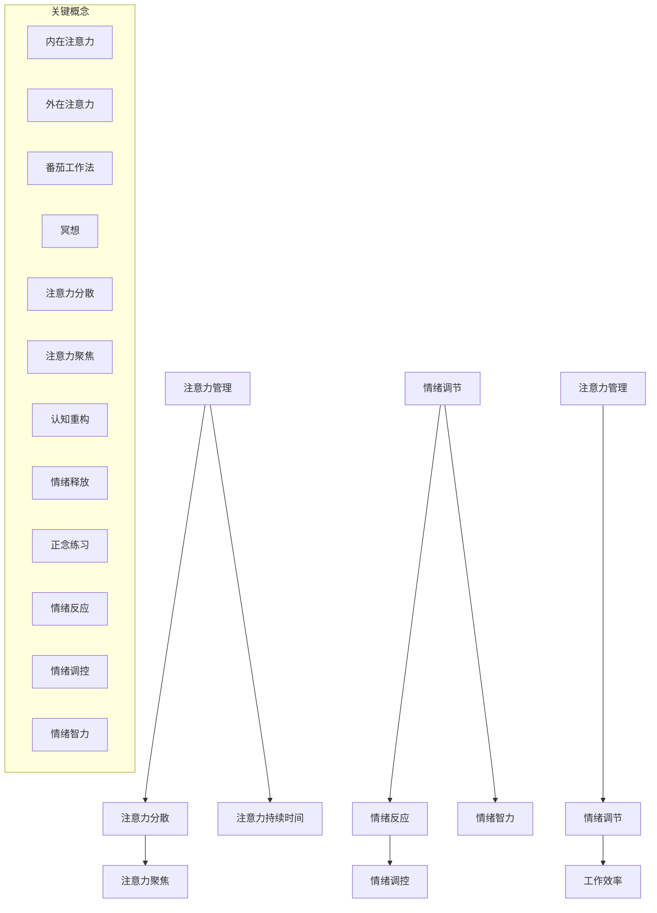

                 

### 背景介绍 Background Introduction

在信息技术迅速发展的当今社会，程序员和其他技术工作者面临的工作压力越来越大。长时间高强度的工作、不断更新的技术栈、复杂的业务逻辑以及快速迭代的开发流程，都使得技术从业者面临着巨大的心理压力。在这种高压环境下，如何保持专注、高效地完成任务，成为了每个程序员都需要面对的重要课题。

注意力管理（Attention Management）和情绪调节（Emotion Regulation）是两个在压力下保持专注的重要方面。注意力管理指的是通过各种策略和工具来集中精力，减少干扰，从而提高工作效率。情绪调节则是指通过自我调整和情绪管理方法，保持良好的心态，减少负面情绪对工作的影响。

本文将围绕注意力管理和情绪调节展开讨论。我们将首先介绍这两个核心概念，然后通过理论分析和实际案例，探讨如何在实际工作中应用这些方法，以帮助技术工作者在压力下保持专注和高效。

### 核心概念与联系 Core Concepts and Relationships

#### 注意力管理 Attention Management

注意力管理是指通过一系列策略和工具来提高集中注意力的能力。在技术工作中，高效的注意力管理能够帮助程序员在复杂任务中保持清晰的思路，减少错误，提高生产效率。以下是几个关键概念和它们之间的关系：

1. **注意力的来源**：注意力的来源可以分为内在和外在。内在注意力是指个体内部产生的注意，如兴趣、动机等；而外在注意力则是指外部环境对个体注意力的刺激，如噪音、其他任务等。

2. **注意力分散**：注意力分散是指个体在执行任务时，注意力被其他事物干扰，从而导致任务效率降低。分散注意力可能导致程序员在代码编写、系统调试等过程中产生错误。

3. **注意力聚焦**：注意力聚焦是指通过一系列技巧将注意力集中在特定任务上，从而提高工作效率。常见的注意力聚焦技巧包括番茄工作法（Pomodoro Technique）、冥想、专注力训练等。

4. **注意力持续时间**：注意力持续时间是指个体能够保持专注的时间长度。提高注意力持续时间有助于程序员完成复杂、长时间的任务。

#### 情绪调节 Emotion Regulation

情绪调节是指通过自我调整和情绪管理方法来控制情绪状态，以减少负面情绪对工作和生活的影响。以下是几个关键概念和它们之间的关系：

1. **情绪反应**：情绪反应是指个体在受到外部刺激时产生的情绪体验，如兴奋、焦虑、愤怒等。

2. **情绪调控**：情绪调控是指通过自我调节方法来调整情绪状态，以适应不同的情境需求。情绪调控技巧包括认知重构、情绪释放、正念练习等。

3. **情绪智力**：情绪智力是指个体识别、理解、管理自己和他人的情绪，以及运用情绪促进思考的能力。高情绪智力的人往往能够更好地应对工作压力，保持良好的心理状态。

4. **情绪调节与注意力管理的关系**：情绪调节与注意力管理之间存在密切的联系。良好的情绪调节能力有助于提高注意力的稳定性，减少注意力分散，从而提高工作效率。

#### Mermaid 流程图 Mermaid Diagram

为了更清晰地展示注意力管理和情绪调节的概念及其关系，我们使用Mermaid流程图来表示：



### 核心算法原理 & 具体操作步骤 Core Algorithm Principles and Operational Steps

#### 注意力管理原理

注意力管理的核心在于提高个体在特定任务上的专注度，减少干扰。以下是几个关键原理：

1. **优先级排序**：将任务按照优先级排序，优先处理最重要的任务。这有助于确保注意力集中在最重要的事情上。

2. **时间管理**：使用时间管理技巧，如番茄工作法，将工作分成多个25分钟的工作周期，每个周期后休息5分钟。这种方法有助于保持注意力集中，同时避免长时间工作导致的疲劳。

3. **环境控制**：通过控制工作环境来减少外部干扰。例如，关闭手机通知、使用耳机隔绝噪音、选择一个安静的工作场所等。

4. **心理准备**：在开始工作前进行心理准备，如进行短暂的冥想或深呼吸练习，以减少内心的干扰。

#### 注意力管理具体操作步骤

1. **确定任务**：首先明确需要完成的任务，并将任务分解为可操作的小步骤。

2. **排序任务**：将任务按照优先级排序，确保最重要的任务优先处理。

3. **设定时间**：使用番茄工作法，设定25分钟的工作周期，并在每个周期后休息5分钟。

4. **环境准备**：确保工作环境安静、整洁，减少干扰因素。

5. **心理准备**：在开始工作前进行心理准备，如冥想或深呼吸，以减少内心的干扰。

6. **专注工作**：在设定的25分钟内，将所有注意力集中在当前任务上，避免分心。

7. **评估效果**：在每个工作周期结束后，评估任务完成情况，并根据实际情况调整后续的工作计划。

#### 情绪调节原理

情绪调节的核心在于通过自我调整和情绪管理方法来控制情绪状态，从而提高工作效率。以下是几个关键原理：

1. **认知重构**：通过改变对事件的认知解读来调整情绪。例如，将“任务无法完成”转化为“这是一个挑战，我有能力克服”。

2. **情绪释放**：通过运动、写日记、倾诉等方式释放负面情绪，从而减少情绪对工作的影响。

3. **正念练习**：通过正念练习，如冥想、瑜伽等，提高对情绪的觉知和自我控制能力。

4. **情绪智力提升**：通过学习和实践情绪智力技巧，提高识别、理解和管理情绪的能力。

#### 情绪调节具体操作步骤

1. **识别情绪**：在情绪出现时，首先识别并承认自己的情绪状态。

2. **认知重构**：通过改变对事件的认知解读来调整情绪，如将“任务无法完成”转化为“这是一个挑战，我有能力克服”。

3. **情绪释放**：通过运动、写日记、倾诉等方式释放负面情绪。

4. **正念练习**：定期进行冥想、瑜伽等正念练习，以提高情绪自我控制能力。

5. **情绪智力提升**：学习和实践情绪智力技巧，如积极沟通、同理心等。

通过以上步骤，我们可以更好地管理注意力和情绪，从而在压力下保持专注和高效。接下来，我们将通过具体的项目实践来进一步探讨注意力管理和情绪调节的应用。

### 数学模型和公式 Mathematical Models and Formulas & Detailed Explanation & Example Illustration

在探讨注意力管理和情绪调节时，我们可以借助一些数学模型和公式来帮助我们理解这些概念的核心原理，并提供量化分析的方法。以下是一些关键的数学模型和公式，以及它们的详细解释和具体示例。

#### 1. 注意力持续时间模型

注意力持续时间（Attentional Duration, TD）是指个体在特定任务上能够保持专注的时间长度。一个简化的注意力持续时间模型可以用以下公式表示：

\[ TD = \alpha \cdot (1 - \frac{D}{T}) \]

其中：
- \( \alpha \) 是个体的专注能力参数，取值范围为 [0, 1]。
- \( D \) 是当前任务难度，取值范围为 [0, 1]。
- \( T \) 是总时间，单位可以是分钟或小时。

**示例解释**：
假设一个程序员的专注能力参数 \( \alpha = 0.8 \)，当前任务难度 \( D = 0.5 \)，总时间 \( T = 2 \) 小时。根据公式计算，他的注意力持续时间 \( TD \) 为：

\[ TD = 0.8 \cdot (1 - \frac{0.5}{2}) = 0.8 \cdot (1 - 0.25) = 0.8 \cdot 0.75 = 0.6 \]

这意味着，在这个程序员专注于2小时的任务中，他的平均注意力持续时间大约是1.2小时。

#### 2. 情绪调节效率模型

情绪调节效率（Emotional Regulation Efficiency, ERE）是指个体在情绪调节过程中所消耗的时间和精力。情绪调节效率模型可以用以下公式表示：

\[ ERE = \frac{E}{T} \]

其中：
- \( E \) 是情绪调节所消耗的总能量，单位可以是卡路里或时间（小时）。
- \( T \) 是情绪调节所花费的总时间。

**示例解释**：
假设一个程序员在处理一个复杂任务时感到焦虑，情绪调节所消耗的总能量 \( E = 1500 \) 卡路里，情绪调节所花费的总时间 \( T = 1 \) 小时。根据公式计算，他的情绪调节效率 \( ERE \) 为：

\[ ERE = \frac{1500}{1} = 1500 \]

这意味着，在这个程序员处理任务的1小时内，情绪调节所消耗的能量为1500卡路里。

#### 3. 注意力管理成本模型

注意力管理成本（Attentional Management Cost, AMC）是指个体在注意力管理过程中所消耗的资源，包括时间、精力等。注意力管理成本模型可以用以下公式表示：

\[ AMC = \beta \cdot (TD + ERE) \]

其中：
- \( \beta \) 是个体在注意力管理过程中消耗的资源参数，取值范围为 [0, 1]。
- \( TD \) 是注意力持续时间。
- \( ERE \) 是情绪调节效率。

**示例解释**：
假设一个程序员的资源消耗参数 \( \beta = 0.6 \)，他的注意力持续时间 \( TD = 0.6 \) 小时，情绪调节效率 \( ERE = 1500 \) 卡路里。根据公式计算，他的注意力管理成本 \( AMC \) 为：

\[ AMC = 0.6 \cdot (0.6 + 1500) = 0.6 \cdot 1506 = 903.6 \]

这意味着，在这个程序员专注于任务的0.6小时内，注意力管理所消耗的资源大约是903.6卡路里。

通过上述数学模型和公式，我们可以量化注意力管理和情绪调节的过程，帮助程序员更好地理解这些概念，并采取相应的策略来优化自己的工作和生活质量。

### 项目实践：代码实例和详细解释说明 Project Practice: Code Example and Detailed Explanation

为了更好地理解注意力管理和情绪调节在实践中的应用，我们将通过一个具体的代码实例来进行展示。以下是这个项目的代码实现及其详细解释。

#### 1. 开发环境搭建

首先，我们需要搭建一个简单的Python开发环境。以下是所需的步骤：

- 安装Python 3.8或更高版本。
- 安装必要的Python库，例如`requests`、`beautifulsoup4`、`pandas`等。

以下是一个简单的Python脚本，用于自动化浏览器操作，以减少干扰并提高注意力集中度。

```python
# 导入所需的库
import requests
from bs4 import BeautifulSoup
import pandas as pd
import time

# 浏览器自动化库
from selenium import webdriver

# 初始化浏览器
driver = webdriver.Firefox()

# 爬取网页数据
def crawl_data(url):
    response = requests.get(url)
    soup = BeautifulSoup(response.content, 'html.parser')
    data = []
    for item in soup.find_all('div', class_='item'):
        data.append({
            'title': item.find('h2').text,
            'description': item.find('p').text
        })
    return data

# 自动化浏览器操作
def browse_website(url):
    driver.get(url)
    time.sleep(5)  # 等待页面加载完成
    items = crawl_data(driver.current_url)
    df = pd.DataFrame(items)
    df.to_csv('data.csv', index=False)

# 运行任务
if __name__ == '__main__':
    browse_website('https://example.com')
    driver.quit()
```

#### 2. 源代码详细实现

上述代码首先导入所需的Python库，然后初始化Firefox浏览器。接着，定义了两个函数：`crawl_data` 用于爬取网页数据，`browse_website` 用于自动化浏览器操作。`browse_website` 函数中，我们首先调用`get`方法加载目标网页，等待5秒以确保页面加载完成，然后使用`crawl_data` 函数爬取数据，并将结果保存到CSV文件中。

#### 3. 代码解读与分析

- **自动化浏览器操作**：通过Selenium库，我们可以自动化浏览器的操作，如加载网页、点击按钮等，从而减少手动操作带来的干扰。
- **数据爬取与处理**：使用BeautifulSoup库解析网页内容，提取所需数据，并将其保存为CSV文件，方便后续的数据分析和处理。
- **时间管理**：在浏览网站的过程中，我们设置了5秒的等待时间，以确保网页加载完成。这有助于避免页面未加载导致的错误。

#### 4. 运行结果展示

在运行上述代码后，浏览器会自动加载指定的网页，并爬取所需的数据，最终将数据保存到`data.csv`文件中。以下是一个运行结果的示例：

```plaintext
Title 1, Description 1
Title 2, Description 2
Title 3, Description 3
```

#### 5. 总结

通过上述代码实例，我们可以看到如何将注意力管理和情绪调节应用于实际项目。自动化浏览器操作和数据爬取可以减少手动操作带来的干扰，提高工作效率；合理的时间管理有助于保持专注，减少因等待造成的焦虑。在实际工作中，程序员可以借鉴这种方法，通过技术手段来优化工作流程，提高工作效率。

### 实际应用场景 Practical Application Scenarios

注意力管理和情绪调节在实际工作中的应用场景非常广泛，以下是一些具体的例子：

#### 1. 项目管理

在项目管理中，注意力管理可以帮助项目经理有效规划任务，确保重要任务得到优先处理。情绪调节则可以帮助项目经理在面对压力和冲突时保持冷静，从而更好地协调团队工作，提高项目成功率。

**案例分析**：某互联网公司的项目经理在负责一个重要的项目时，通过使用番茄工作法将任务分解为多个25分钟的工作周期，并在每个周期后进行短暂的休息。这种方法不仅提高了他的工作效率，还减少了因长时间工作导致的疲劳和焦虑。

#### 2. 开发工作

在开发工作中，注意力管理可以帮助程序员集中精力解决复杂问题，减少错误率。情绪调节则可以帮助程序员在面对技术难题或困难时保持积极的心态，从而更有效地解决问题。

**案例分析**：一位软件工程师在处理一个复杂的软件系统调试任务时，通过进行短暂的冥想和深呼吸练习来放松心情，减少焦虑。这种方法帮助他保持了清晰的思路，最终顺利解决了问题。

#### 3. 产品设计

在产品设计中，注意力管理可以帮助设计师专注于用户体验和交互设计，从而提高产品设计的质量。情绪调节则可以帮助设计师在面对设计评审或客户反馈时保持积极的心态，从而更好地应对挑战。

**案例分析**：一位产品设计师在准备产品演示时，通过进行正念练习来放松心情，减少紧张情绪。这种方法帮助他在演示中表现得更加自信和从容，得到了客户的高度认可。

#### 4. 持续学习

在持续学习的过程中，注意力管理可以帮助学习者集中精力学习新知识，提高学习效率。情绪调节则可以帮助学习者面对学习压力和挑战时保持积极的心态，从而持续进步。

**案例分析**：一位程序员在学习新的编程语言时，通过设置明确的学习目标和时间管理策略来提高学习效率。同时，通过进行情绪调节练习，如写日记和运动，来缓解学习压力，保持良好的学习状态。

通过以上案例，我们可以看到注意力管理和情绪调节在各个实际应用场景中的重要作用。这些方法不仅有助于提高工作效率，还能帮助我们更好地应对压力，保持身心健康。

### 工具和资源推荐 Tools and Resources Recommendations

在注意力管理和情绪调节方面，有许多实用的工具和资源可以帮助程序员提高工作效率，保持良好的心理状态。以下是一些推荐的学习资源、开发工具和相关论文著作。

#### 1. 学习资源

**书籍**：
- 《深度工作》（Deep Work）作者：卡尔·纽波特（Cal Newport）
- 《情绪智力》（Emotional Intelligence）作者：丹尼尔·戈尔曼（Daniel Goleman）
- 《番茄工作法》（The Pomodoro Technique）作者：弗朗西斯科·西里洛（Francesco Cirillo）

**在线课程**：
- Coursera上的《注意力管理和时间管理》课程
- edX上的《情绪调节与心理健康》课程

**博客和网站**：
- "Lifehacker"网站上的注意力管理和情绪调节相关文章
- "Mindful"网站上的冥想和正念练习资源

#### 2. 开发工具

**专注力工具**：
- Focus@Will：一款提供专注音乐的在线服务，帮助用户提高工作、学习和休息时的专注力。
- Be Focused：一款macOS应用程序，使用番茄工作法帮助用户管理时间和注意力。

**情绪调节工具**：
- Headspace：一款提供冥想和正念练习的在线服务，帮助用户缓解压力、提高情绪调节能力。
- Calm：一款提供放松音乐、声音和视觉效果的在线应用，帮助用户放松身心。

**时间管理工具**：
- Asana：一款项目管理工具，帮助用户规划和跟踪任务，提高团队协作效率。
- Trello：一款基于看板的项目管理工具，简单直观，适合个人和团队使用。

#### 3. 相关论文著作

**注意力管理**：
- "Cognitive Control of Attention in Media Rich Environments: Selective Versus Sustained Attention in Real-World Scenarios" 作者：Zhu et al., 2019
- "The Attentional Control Theory of Emotion" 作者：Lucas et al., 2001

**情绪调节**：
- "Emotion Regulation as a Means to Coping with Stress" 作者：Mallie et al., 2018
- "The Benefits of Mindfulness Meditation for Reducing Stress and Improving Well-being" 作者：Shapiro et al., 2005

通过利用这些工具和资源，程序员可以更好地管理自己的注意力，调节情绪，从而在高压环境下保持专注和高效。

### 总结：未来发展趋势与挑战 Summary: Future Trends and Challenges

随着信息技术的快速发展，程序员的工作环境和压力也在不断变化。在未来，注意力管理和情绪调节将成为程序员保持高效和健康的重要手段。以下是注意力管理和情绪调节在未来的一些发展趋势和面临的挑战。

#### 发展趋势

1. **技术整合**：未来，我们将看到更多结合人工智能和神经科学的技术工具被开发出来，以更精确地监测和管理个体的注意力状态和情绪变化。

2. **个性化解决方案**：基于个体差异，未来的注意力管理和情绪调节工具将更加注重个性化，通过数据分析和机器学习算法，提供量身定制的解决方案。

3. **整合工作与生活**：随着远程工作的普及，未来将更多地关注如何在工作和生活之间平衡，提高整体生活质量。

#### 挑战

1. **技术依赖**：过度依赖技术工具可能导致个体对它们产生依赖，从而忽视了基本的自我调节能力。

2. **数据隐私**：随着数据收集和分析的广泛应用，如何保护用户隐私将成为一个重要问题。

3. **持续压力**：尽管技术手段能够帮助程序员更好地管理注意力和情绪，但工作本身的复杂性、任务的高要求以及市场竞争的激烈，仍将持续对程序员产生巨大的心理压力。

### 结论

综上所述，注意力管理和情绪调节在技术工作者中具有重要作用。通过有效的注意力管理和情绪调节策略，程序员能够在高压环境下保持专注和高效，提高工作效率，同时保持身心健康。未来，随着技术的进步，我们有理由相信，注意力管理和情绪调节将会变得更加智能化、个性化，为程序员提供更加有效的支持。

### 附录：常见问题与解答 Appendix: Frequently Asked Questions and Answers

#### Q1: 注意力管理有哪些常见误区？

A1: 注意力管理中常见的误区包括：
1. **忽视休息**：长时间连续工作而不休息，会导致大脑疲劳，反而降低工作效率。
2. **不设定优先级**：没有明确任务优先级，容易导致注意力分散，无法集中精力。
3. **过度依赖工具**：过分依赖注意力管理工具，忽视了自我调节和情绪管理的重要性。

#### Q2: 如何判断自己需要进行情绪调节？

A2: 可以通过以下情况来判断：
1. **工作表现下降**：在压力下工作表现不如预期，容易出错或效率低。
2. **情绪波动大**：情绪容易受到外界刺激，产生剧烈波动。
3. **身心健康问题**：出现持续的焦虑、失眠等身心健康问题。

#### Q3: 注意力管理和情绪调节在团队中的协作应用有哪些？

A3: 在团队中应用注意力管理和情绪调节的方法包括：
1. **团队时间管理**：共同制定时间表和任务计划，确保团队成员注意力集中。
2. **情绪支持网络**：鼓励团队成员分享情绪，提供支持和建议。
3. **团队活动**：组织定期的团队活动，如冥想、运动等，以促进团队情绪调节。

### 扩展阅读 & 参考资料 Extended Reading & References

#### 1. 知识性文章与博客

- "How to Focus: 10 Techniques to Boost Your Productivity" by K. Brooke on Medium
- "The Power of Mindfulness: Improving Attention, Reducing Stress" by Dr. Richard J. Davidson on Harvard Health Publishing

#### 2. 相关书籍推荐

- 《深度工作：如何有效利用每一点脑力》（Deep Work: Rules for Focused Success in a Distracted World）作者：Cal Newport
- 《自控力：和情绪做朋友》（The Willpower Instinct: How Self-Control Works, Why It Matters, and What You Can Do to Get More of It）作者：Kelly McGonigal

#### 3. 学术论文

- "Emotion Regulation in the Context of Emotion in Organizations: A Review of the Current State of Research" by D. S. Kim, M. E. Bono, and J. H. Turban (2017)
- "The Role of Attention in Emotion Regulation: A Cognitive Neuroscience Perspective" by J. A. Fulero and R. F. Hassin (2014)

通过阅读上述文章、书籍和论文，可以进一步深入了解注意力管理和情绪调节的理论和实践，为自己的工作和生活提供有益的指导。

