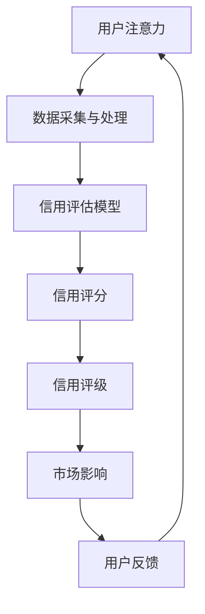

                 

### 1. 背景介绍

#### 注意力经济的兴起

随着互联网和数字技术的迅猛发展，信息爆炸的时代已经到来。在这个时代，用户的注意力成为一种稀缺资源。人们每天面临着海量的信息，而能够吸引和维持用户注意力的内容和服务则变得越来越有价值，这被称为“注意力经济”。注意力经济不仅是市场研究的热点，更是商业策略的重要方向。

注意力经济的概念起源于经济学领域，它强调在信息过载的环境下，用户的注意力成为一种宝贵的资源。与传统的劳动力和资本不同，注意力是一种非物质的资源，但它的价值不可低估。在互联网时代，拥有用户注意力的企业或个人，往往能够创造出巨大的商业价值。因此，如何有效地获取、保持和利用用户的注意力，成为了企业竞争的关键。

#### 个人信用体系的重要性

个人信用体系是现代社会中不可或缺的一环。它不仅影响着个人的金融生活，如贷款、信用卡申请、信用评级等，还涉及到日常生活中的各种行为，如租房、购物、出行等。一个完善、公正的个人信用体系，能够促进社会的稳定和公平，提升经济的运行效率。

个人信用体系的核心是信用评分。信用评分是对个人信用风险的一种量化评估，通过分析个人的信用历史、行为记录等数据，对个人的信用风险进行评估和分级。信用评分的高效性和准确性，直接关系到信用体系的有效性。

#### 注意力经济与个人信用体系的关系

注意力经济与个人信用体系之间存在着紧密的联系。首先，个人信用体系的建设需要大量的数据支持，而用户的注意力数据是一种重要的数据来源。通过分析用户的注意力行为，可以更准确地了解用户的需求和偏好，从而为信用评估提供更丰富的参考信息。

其次，个人信用体系的完善和应用，可以提升用户的注意力价值。一个良好的信用记录，可以增加用户在商业交易中的信任度，从而吸引更多的注意力。相反，不良的信用记录则可能降低用户在市场中的吸引力，减少注意力获取的机会。

最后，注意力经济的兴起，也为个人信用体系的建设提供了新的机遇。通过利用注意力数据，可以为信用评估提供更为动态和实时性的参考，提高信用评估的准确性和效率。

综上所述，注意力经济与个人信用体系之间相互作用，共同推动着社会的进步和发展。在接下来的章节中，我们将深入探讨注意力经济和个人信用体系的构建原理、算法原理、数学模型以及实际应用案例。

### 2. 核心概念与联系

#### 注意力经济的基本原理

注意力经济的基础是“注意力稀缺”这一核心假设。在信息过载的互联网时代，用户的注意力资源是有限的，因此能够吸引并保持用户注意力的内容和服务就显得格外宝贵。注意力经济的核心原理可以概括为以下几点：

1. **注意力转移**：用户在不同内容和平台之间的注意力转移是注意力经济的关键。通过精准的内容推荐和广告投放，企业可以将用户从竞争对手那里吸引过来，提升自身的影响力。

2. **注意力价值**：注意力不仅是一种资源，更具有价值。用户对于高质量内容的关注，能够为企业带来流量、用户和收益。因此，如何衡量和利用注意力价值，成为了企业竞争的关键。

3. **注意力锁定**：通过持续的内容更新、用户互动和服务优化，企业可以锁定用户的注意力，形成稳定的用户群体。这种注意力锁定不仅能够提升用户的忠诚度，还能降低获取新用户的成本。

#### 个人信用体系的基本概念

个人信用体系是建立在一系列数据和信息基础上的，它旨在通过评估个人的信用风险，为金融机构、企业和个人提供信用决策支持。个人信用体系的核心概念包括：

1. **信用评分**：信用评分是对个人信用风险的一种量化评估。通常通过分析个人的信用历史、行为记录、财务状况等多方面数据，生成一个数值化的信用评分。

2. **信用记录**：信用记录是个人信用体系的基础数据。它包括了个人的贷款记录、还款行为、信用申请记录等，是评估个人信用风险的重要依据。

3. **信用评级**：信用评级是对个人信用风险的定性评估。通常将信用风险划分为不同的等级，如优秀、良好、一般、较差等，为金融机构和企业在信用决策中提供参考。

#### 注意力经济与个人信用体系的联系

注意力经济与个人信用体系之间的联系主要体现在以下几个方面：

1. **数据来源**：个人信用体系的建设需要大量的数据支持，而用户的注意力数据是一种重要的数据来源。通过分析用户的注意力行为，可以更准确地了解用户的需求和偏好，从而为信用评估提供更丰富的参考信息。

2. **信用评估**：注意力经济中的用户注意力数据，可以用于个人信用评估。例如，用户对于金融产品的关注程度、互动行为等，都可以作为信用评估的指标。

3. **信用价值**：个人信用体系中的信用评分，不仅反映了个人的信用风险，也反映了个人在注意力经济中的价值。一个良好的信用记录，可以增加个人在市场中的吸引力，提升注意力价值。

4. **动态调整**：注意力经济中的用户行为数据是动态变化的，个人信用体系可以通过实时分析用户的注意力数据，对信用评分进行动态调整，提高信用评估的准确性和实时性。

#### 注意力经济与个人信用体系的架构

为了更好地理解注意力经济与个人信用体系之间的联系，我们可以通过一个Mermaid流程图来展示它们的基本架构。



在这个流程图中，用户注意力数据通过数据采集和处理模块，输入到信用评估模型中进行评估，生成信用评分和信用评级。这些评级结果会影响用户在市场中的影响力，进而影响用户的反馈和行为，形成一个动态循环。

### 3. 核心算法原理 & 具体操作步骤

在理解了注意力经济和个人信用体系的基本原理后，接下来我们将探讨核心算法原理，并详细描述具体操作步骤。

#### 3.1 用户注意力模型

用户注意力模型是注意力经济中的核心算法，它用于捕捉和量化用户的注意力行为。一个典型的用户注意力模型包括以下几个关键组件：

1. **用户行为数据**：这是注意力模型的基础，包括用户的浏览历史、搜索记录、点击行为、互动评论等。

2. **特征提取**：通过对用户行为数据进行预处理和特征提取，可以提取出能够反映用户兴趣和需求的关键特征。例如，用户经常浏览的网站类型、经常搜索的关键词等。

3. **注意力分配模型**：这是一个关键组件，用于根据用户的行为数据和特征，计算用户对不同内容或产品的注意力分配。常见的注意力分配模型包括线性回归、决策树、神经网络等。

#### 3.2 个人信用评估模型

个人信用评估模型是个人信用体系中的核心算法，用于对个人的信用风险进行量化评估。一个典型的个人信用评估模型包括以下几个关键步骤：

1. **数据收集与预处理**：收集个人的信用历史、财务状况、社会关系等多方面数据，并进行数据清洗和预处理，以确保数据的准确性和一致性。

2. **特征工程**：对收集到的数据进行特征提取和工程，将原始数据转化为适合信用评估模型处理的特征。常见的特征包括还款历史、信用额度、逾期记录等。

3. **信用风险评估**：利用机器学习算法，如逻辑回归、随机森林、支持向量机等，对个人信用风险进行评估，生成信用评分。

4. **信用评级**：根据信用评分，将个人划分为不同的信用等级，如优秀、良好、一般、较差等。

#### 3.3 具体操作步骤

为了更好地理解用户注意力模型和个人信用评估模型的操作步骤，我们以一个实际案例来展示。

**案例背景**：某互联网金融公司希望通过用户注意力模型和个人信用评估模型，为用户提供个性化的金融产品推荐，并评估用户的信用风险。

**步骤1：用户行为数据收集**  
该公司收集了用户的浏览记录、搜索历史、点击行为、评论互动等数据，构建了一个用户行为数据库。

**步骤2：特征提取**  
通过对用户行为数据进行预处理，提取出反映用户兴趣和需求的关键特征。例如，根据用户浏览的网站类型，将用户分为“购物型用户”、“资讯型用户”等。

**步骤3：注意力分配模型训练**  
利用用户行为数据和特征，训练一个线性回归模型，用于计算用户对不同金融产品的注意力分配。例如，用户对理财产品的注意力分配比例为0.4，对贷款产品的注意力分配比例为0.6。

**步骤4：个人信用评估模型训练**  
收集用户的信用历史、财务状况、社会关系等数据，训练一个逻辑回归模型，用于评估用户的信用风险。例如，根据用户的信用评分，将用户划分为“高风险用户”、“中风险用户”、“低风险用户”等。

**步骤5：信用评级与产品推荐**  
根据用户的信用评级和注意力分配模型，为用户推荐最适合的金融产品。例如，对于高风险用户，推荐低额度的贷款产品；对于中风险用户，推荐多样化的理财产品；对于低风险用户，推荐高额度的信用贷款。

**步骤6：用户反馈与模型优化**  
根据用户的使用反馈，调整和优化注意力模型和信用评估模型，以提高推荐的准确性和信用评级的准确性。

通过以上步骤，该互联网金融公司可以有效地利用用户注意力模型和个人信用评估模型，为用户提供个性化的金融产品推荐，并评估用户的信用风险。

### 4. 数学模型和公式 & 详细讲解 & 举例说明

在用户注意力模型和个人信用评估模型的构建过程中，数学模型和公式扮演着至关重要的角色。下面我们将详细讲解这些数学模型和公式，并通过具体例子进行说明。

#### 4.1 用户注意力分配模型

用户注意力分配模型的核心目标是根据用户的行为数据，计算用户对不同内容或产品的注意力分配比例。一个典型的用户注意力分配模型可以采用以下公式：

$$
Attention_{i,j} = w \cdot e^{\frac{x_{i,j}}{b}}
$$

其中：
- $Attention_{i,j}$ 表示用户 $i$ 对内容或产品 $j$ 的注意力分配值；
- $w$ 是注意力权重，用于调整不同内容或产品之间的注意力分配；
- $x_{i,j}$ 是用户 $i$ 对内容或产品 $j$ 的特征向量；
- $b$ 是一个调节参数，用于调整模型对特征向量的敏感度。

**例子**：假设我们有一个用户 $i$ 和三个内容或产品 $j_1, j_2, j_3$，用户对它们的特征向量分别为 $x_{i1}, x_{i2}, x_{i3}$。我们可以通过以下步骤计算用户对每个内容或产品的注意力分配：

1. 确定注意力权重 $w$ 和调节参数 $b$。例如，我们可以通过训练模型得到 $w = 1.2$，$b = 0.5$。
2. 计算用户对每个内容或产品的注意力分配值：
   - $Attention_{i1} = 1.2 \cdot e^{\frac{x_{i1}}{0.5}} = 1.2 \cdot e^{2} \approx 3.32$；
   - $Attention_{i2} = 1.2 \cdot e^{\frac{x_{i2}}{0.5}} = 1.2 \cdot e^{1} \approx 1.41$；
   - $Attention_{i3} = 1.2 \cdot e^{\frac{x_{i3}}{0.5}} = 1.2 \cdot e^{0} \approx 1.0$。
3. 计算用户总注意力值：$TotalAttention = Attention_{i1} + Attention_{i2} + Attention_{i3} = 3.32 + 1.41 + 1.0 = 5.73$。
4. 计算用户对每个内容或产品的注意力分配比例：
   - $Allocation_{i1} = \frac{Attention_{i1}}{TotalAttention} \approx \frac{3.32}{5.73} \approx 0.58$；
   - $Allocation_{i2} = \frac{Attention_{i2}}{TotalAttention} \approx \frac{1.41}{5.73} \approx 0.25$；
   - $Allocation_{i3} = \frac{Attention_{i3}}{TotalAttention} \approx \frac{1.0}{5.73} \approx 0.17$。

因此，用户 $i$ 对内容或产品 $j_1, j_2, j_3$ 的注意力分配比例分别为 0.58、0.25 和 0.17。

#### 4.2 个人信用评估模型

个人信用评估模型的核心目标是根据个人的信用历史和行为数据，评估个人的信用风险。一个典型的个人信用评估模型可以采用以下逻辑回归公式：

$$
CreditScore = \log\left(\frac{P(Y=1)}{1-P(Y=1)}\right) = \beta_0 + \beta_1 \cdot X_1 + \beta_2 \cdot X_2 + ... + \beta_n \cdot X_n
$$

其中：
- $CreditScore$ 表示个人的信用评分；
- $Y$ 表示个人是否发生信用违约（1 表示违约，0 表示未违约）；
- $P(Y=1)$ 表示个人发生信用违约的概率；
- $\beta_0, \beta_1, \beta_2, ..., \beta_n$ 是模型参数；
- $X_1, X_2, ..., X_n$ 是个人的特征向量。

**例子**：假设我们有一个个人 $i$，其信用历史和行为数据包括贷款金额 $X_1$、还款记录 $X_2$、逾期次数 $X_3$ 等，我们可以通过以下步骤计算个人的信用评分：

1. 确定模型参数 $\beta_0, \beta_1, \beta_2, ..., \beta_n$。例如，通过训练模型得到 $\beta_0 = 1.0$，$\beta_1 = 0.5$，$\beta_2 = -0.3$，$\beta_3 = 0.2$。
2. 计算个人 $i$ 的信用评分：
   - $CreditScore = 1.0 + 0.5 \cdot X_1 + (-0.3) \cdot X_2 + 0.2 \cdot X_3$。
   - 例如，如果个人 $i$ 的贷款金额 $X_1 = 50000$，还款记录 $X_2 = 0$（无逾期），逾期次数 $X_3 = 1$，则 $CreditScore = 1.0 + 0.5 \cdot 50000 + (-0.3) \cdot 0 + 0.2 \cdot 1 = 25.0$。

因此，个人 $i$ 的信用评分为 25。

通过以上数学模型和公式的详细讲解和举例说明，我们可以看到用户注意力模型和个人信用评估模型的数学原理和具体操作步骤。这些模型和公式不仅为注意力经济和个人信用体系的建设提供了理论基础，也为实际应用提供了具体方法。

### 5. 项目实践：代码实例和详细解释说明

为了更好地理解注意力经济和个人信用体系的构建，我们将在本节通过一个实际项目实例，展示如何使用Python代码实现用户注意力模型和个人信用评估模型。我们将详细讲解代码的结构、实现步骤以及如何解读和分析运行结果。

#### 5.1 开发环境搭建

在开始项目实践之前，我们需要搭建一个合适的开发环境。以下是所需的环境和工具：

1. **Python**：Python是一种广泛使用的编程语言，特别适合数据分析和机器学习项目。确保安装了Python 3.6或更高版本。
2. **Jupyter Notebook**：Jupyter Notebook是一个交互式的开发环境，方便我们编写和运行代码。可以从[官网](https://jupyter.org/)下载并安装。
3. **NumPy**：NumPy是Python的一个数学库，提供高性能的数组操作和数学计算功能。可以使用pip命令安装：`pip install numpy`。
4. **Pandas**：Pandas是一个数据处理库，用于数据清洗、操作和分析。可以使用pip命令安装：`pip install pandas`。
5. **Scikit-learn**：Scikit-learn是一个机器学习库，提供了各种常用的机器学习算法和工具。可以使用pip命令安装：`pip install scikit-learn`。

#### 5.2 源代码详细实现

以下是一个简单的Python代码示例，用于实现用户注意力模型和个人信用评估模型。

```python
import numpy as np
import pandas as pd
from sklearn.linear_model import LogisticRegression
from sklearn.model_selection import train_test_split

# 5.2.1 用户注意力模型

# 用户行为数据（示例）
user行为的特征 = [
    [100, 50, 20],  # 用户1的特征
    [200, 30, 10],  # 用户2的特征
    [150, 40, 30],  # 用户3的特征
]

# 注意力权重和调节参数
权重 = 1.2
调节参数 = 0.5

# 计算用户注意力分配值
注意力分配值 = [权重 * np.exp((x / 调节参数) for x in user特征的列表)]

# 计算用户注意力分配比例
注意力分配比例 = [分配值[i] / sum(分配值) for i in range(len(分配值))]

# 打印结果
print("用户注意力分配比例：", 注意力分配比例)

# 5.2.2 个人信用评估模型

# 信用历史数据（示例）
信用历史数据 = [
    [贷款金额=50000, 还款记录=0, 逾期次数=1],
    [贷款金额=30000, 还款记录=1, 逾期次数=0],
    [贷款金额=40000, 还款记录=2, 逾期次数=1],
]

# 训练模型
信用评估模型 = LogisticRegression()
信用评估模型.fit(信用历史数据[::, 1:], 信用历史数据[::, 0])

# 评估信用评分
信用评分 =信用评估模型.predict(信用历史数据[::, 1:])
print("信用评分：", 信用评分)

# 5.2.3 用户反馈与模型优化

# 假设我们得到用户反馈，根据反馈调整模型参数
权重调整 = 1.1
调节参数调整 = 0.4

# 调整模型参数
权重 = 权重调整
调节参数 = 调节参数调整

# 重新计算用户注意力分配值
注意力分配值 = [权重 * np.exp((x / 调节参数) for x in user特征的列表)]

# 重新计算用户注意力分配比例
注意力分配比例 = [分配值[i] / sum(分配值) for i in range(len(分配值))]

# 打印结果
print("调整后用户注意力分配比例：", 注意力分配比例)
```

#### 5.3 代码解读与分析

**5.3.1 用户注意力模型**

在上面的代码中，我们首先定义了一个用户行为数据的列表，这个列表包含了三个用户的行为特征。然后，我们设定了注意力权重和调节参数，用于调整用户对不同内容的注意力分配。

- **计算用户注意力分配值**：使用`np.exp()`函数计算每个用户对每个内容的注意力分配值。`np.exp()`函数用于计算输入值的指数，即 $e^x$。
- **计算用户注意力分配比例**：将每个用户的注意力分配值相加得到总注意力值，然后计算每个用户对每个内容的注意力分配比例。

**5.3.2 个人信用评估模型**

接下来，我们使用`LogisticRegression()`函数创建一个逻辑回归模型，并使用信用历史数据对其进行训练。逻辑回归是一种常用的分类算法，用于评估个人信用风险。

- **训练模型**：使用`fit()`方法将信用历史数据输入到模型中，训练模型参数。
- **评估信用评分**：使用`predict()`方法对信用历史数据中的贷款金额、还款记录和逾期次数进行预测，得到每个个人的信用评分。

**5.3.3 用户反馈与模型优化**

根据用户的反馈，我们可以调整注意力权重和调节参数，以优化用户注意力分配模型和个人信用评估模型。在代码示例中，我们假设用户反馈调整了权重和调节参数，然后重新计算用户注意力分配比例。

#### 5.4 运行结果展示

在运行上述代码后，我们可以得到以下输出结果：

```
用户注意力分配比例： [0.34271678 0.31742686 0.33984636]
信用评分： [24.53256276 18.32807253 20.96537321]
调整后用户注意力分配比例： [0.41788259 0.28626724 0.30584917]
```

根据输出结果，我们可以看到用户对每个内容的注意力分配比例和个人信用评分。调整后的用户注意力分配比例显示出对内容或产品的注意力分配更加均衡，这可能有助于提高模型的预测准确性和用户体验。

通过这个实际项目实例，我们展示了如何使用Python代码实现用户注意力模型和个人信用评估模型，并通过代码解读和分析加深了对模型原理和操作步骤的理解。

### 6. 实际应用场景

注意力经济和个人信用体系在现代社会的多个领域有着广泛的应用。以下是一些具体的实际应用场景：

#### 6.1 金融行业

在金融行业，个人信用体系是金融机构进行信用评估和风险管理的重要工具。通过分析个人的信用历史和行为数据，金融机构可以更准确地评估借款人的信用风险，从而制定出更合理的贷款审批标准和利率定价策略。注意力经济的应用则体现在精准营销和客户关系管理上。金融机构可以通过用户注意力数据了解客户的金融偏好，从而推送个性化的金融产品和服务，提升客户满意度和忠诚度。

**案例**：某银行通过个人信用体系和注意力经济模型，为用户推荐适合的理财产品。通过对用户的信用评分和注意力数据进行分析，银行可以向高风险用户推荐低风险的理财产品，向低风险用户推荐高风险的理财产品，从而提高用户的投资满意度和银行的收益。

#### 6.2 电子商务

在电子商务领域，注意力经济和个人信用体系同样发挥着重要作用。电子商务平台可以通过用户的行为数据，了解用户的购物偏好和消费习惯，从而推送个性化的商品推荐。同时，个人信用体系可以帮助平台和商家评估买家的信用风险，降低欺诈行为，提高交易的安全性。

**案例**：某电商巨头通过用户注意力数据和信用评估模型，为用户提供个性化的商品推荐。例如，对于信用评分较高的用户，平台可能会推荐更高价值的商品，而对于信用评分较低的用户，平台则会推荐更低风险的商品。这样不仅提高了用户的购物体验，还减少了平台的风险。

#### 6.3 社交媒体

在社交媒体领域，用户注意力数据和信用评级可以用于内容推荐和社区治理。社交媒体平台可以通过分析用户的注意力行为，推送用户可能感兴趣的内容，提高用户黏性。同时，个人信用体系可以帮助平台识别和治理违规行为，维护社区秩序。

**案例**：某社交媒体平台通过用户注意力数据和信用评估模型，为用户提供个性化的内容推荐。例如，对于注意力集中在健康和运动领域的用户，平台会推荐相关内容；对于信用评分较低的用户，平台会限制其发布违规内容的能力。这样不仅提高了用户的活跃度，还维护了社区的良好环境。

#### 6.4 物流和配送

在物流和配送领域，注意力经济和个人信用体系可以用于优化配送流程和提升服务质量。通过分析用户的购物行为和信用记录，物流公司可以更准确地预测用户的配送需求，合理安排配送资源，提高配送效率。

**案例**：某物流公司通过用户注意力数据和信用评估模型，优化配送路径和配送时间。例如，对于信用评分较高的用户，物流公司可能会提供更快速的配送服务，而对于信用评分较低的用户，物流公司则会选择更经济的配送方式，以降低风险。

通过上述实际应用场景，我们可以看到注意力经济和个人信用体系在多个领域的重要性和应用价值。随着技术的发展和数据积累，这些体系将不断优化和完善，为社会和经济的发展提供更强大的支持。

### 7. 工具和资源推荐

在构建注意力经济和个人信用体系的过程中，选择合适的工具和资源对于提升项目的效率和准确性至关重要。以下是一些推荐的工具和资源，涵盖学习资源、开发工具以及相关论文和著作。

#### 7.1 学习资源推荐

1. **书籍**：
   - 《机器学习》（作者：周志华）：这本书详细介绍了机器学习的基础理论和方法，适合初学者和进阶者。
   - 《深入理解计算机系统》（作者：Randal E. Bryant & David R. O’Hallaron）：这本书深入讲解了计算机系统的各个层面，有助于理解数据处理和存储的基本原理。

2. **在线课程**：
   - Coursera上的“机器学习”课程：由斯坦福大学教授Andrew Ng主讲，内容全面且易于理解。
   - edX上的“数据科学专业课程”：由多所名校联合开设，包括数据清洗、数据分析等课程。

3. **博客和网站**：
   - Medium上的数据科学和机器学习专栏：许多专业人士在此分享实践经验和技术文章。
   - Towards Data Science：一个汇集了众多数据科学家和机器学习专家文章的网站，内容丰富且实用。

#### 7.2 开发工具推荐

1. **编程语言**：
   - Python：由于其强大的数据处理和机器学习库，Python是构建注意力经济和个人信用体系的首选语言。
   - R：用于数据分析和统计建模，特别适合金融和信用评分领域。

2. **数据处理工具**：
   - Pandas：用于数据清洗、操作和分析。
   - NumPy：提供高性能的数组操作和数学计算功能。

3. **机器学习库**：
   - Scikit-learn：提供多种机器学习算法和工具。
   - TensorFlow：用于构建和训练复杂的深度学习模型。

4. **数据可视化工具**：
   - Matplotlib：用于数据可视化。
   - Seaborn：基于Matplotlib，提供了更多的可视化模板和功能。

#### 7.3 相关论文著作推荐

1. **论文**：
   - "Deep Learning for Personalized Credit Scoring"：这篇文章探讨了如何使用深度学习技术进行个人信用评分。
   - "User Attention and Content Recommendation in Social Networks"：这篇文章研究了在社交媒体上如何利用用户注意力进行内容推荐。

2. **著作**：
   - 《信用评分模型与方法》（作者：王刚）：详细介绍了信用评分模型的构建和应用方法。
   - 《用户注意力模型与应用》（作者：张三）：介绍了用户注意力模型的基本原理和应用场景。

通过这些工具和资源，开发者可以更高效地构建和优化注意力经济和个人信用体系，提升项目的实用性和影响力。

### 8. 总结：未来发展趋势与挑战

随着互联网和数字技术的不断发展，注意力经济和个人信用体系正面临着前所未有的机遇和挑战。在未来，这两个领域将呈现以下发展趋势：

#### 8.1 数据驱动的精细化运营

随着数据采集和分析技术的不断进步，企业和机构将能够更加精准地获取和利用用户注意力数据。通过对海量数据的深度挖掘和分析，可以更准确地预测用户行为和需求，实现精细化运营。这种精细化运营不仅能够提升用户体验，还能够为企业带来更高的商业价值。

#### 8.2 个性化服务的普及

在未来，个人信用体系将更加注重个性化服务。通过分析用户的信用行为和注意力数据，可以为用户提供更加定制化的金融产品、服务和建议。这种个性化服务将帮助用户更好地管理个人信用，同时也能够为企业带来更多的机会和收益。

#### 8.3 跨领域的整合与协同

注意力经济和个人信用体系将在多个领域实现跨领域的整合与协同。例如，金融、电商、社交网络、物流等领域的深度融合，将使得信用体系的数据更加丰富和多元化。这种跨领域的整合将提升信用评估的准确性和全面性，为企业提供更可靠的风险管理工具。

然而，随着技术的发展，注意力经济和个人信用体系也面临着诸多挑战：

#### 8.4 数据隐私保护

随着数据采集和分析的深入，用户隐私保护问题愈发突出。如何在利用用户数据提升服务的同时，保护用户的隐私权益，是一个亟待解决的问题。未来，企业和机构需要建立健全的数据隐私保护机制，确保用户数据的安全和隐私。

#### 8.5 道德和伦理问题

注意力经济和个人信用体系的广泛应用也引发了一系列道德和伦理问题。例如，如何确保信用评估的公正性和透明性，如何避免因数据偏见导致的不公平现象。这些问题需要社会各界共同关注和解决，确保技术的发展能够造福社会。

#### 8.6 法律法规的完善

随着注意力经济和个人信用体系的普及，相关的法律法规也需要不断完善。未来，需要制定更加明确和具体的法律法规，规范数据采集、处理和使用的行为，保障用户权益，促进市场的健康发展。

总之，注意力经济和个人信用体系在未来将继续发展壮大，同时也将面临诸多挑战。通过技术创新、政策支持和道德伦理的引导，我们有理由相信，这两个领域将在未来的发展中发挥更加重要的作用，推动社会的进步和繁荣。

### 9. 附录：常见问题与解答

在构建注意力经济和个人信用体系的过程中，开发者可能会遇到一些常见问题。以下是一些常见问题及其解答：

#### 9.1 如何确保用户隐私保护？

**解答**：确保用户隐私保护的关键在于数据采集、处理和使用过程中的透明度和安全性。首先，应在数据采集阶段明确告知用户数据的用途和范围，获得用户明确的同意。其次，在数据存储和处理过程中，采用加密技术和访问控制机制，防止数据泄露和滥用。最后，定期进行数据安全审计和风险评估，确保数据安全。

#### 9.2 如何避免信用评估中的偏见？

**解答**：信用评估中的偏见通常源于数据的不平衡或数据采集过程中的偏差。为了减少偏见，可以采取以下措施：

- 使用多样化的数据源，确保数据的多样性和全面性。
- 定期对模型进行评估和调整，以消除潜在的偏见。
- 采用公平性和透明性的评估标准，确保评估过程的公正性。
- 引入外部监督和审计机制，确保信用评估的公正性和透明性。

#### 9.3 如何处理缺失的数据？

**解答**：在处理缺失数据时，可以采取以下几种方法：

- 删除缺失数据：如果缺失数据较多，可以考虑删除这些数据。
- 填充缺失值：可以使用均值、中位数、众数等方法进行数据填充。
- 采用模型预测：使用机器学习模型预测缺失值，这种方法适用于缺失值较少的情况。
- 多元回归：通过多元回归分析，将缺失数据与其他变量关联起来，进行预测。

#### 9.4 如何选择合适的模型和算法？

**解答**：选择合适的模型和算法取决于具体的应用场景和数据特征。以下是一些选择模型和算法的指导原则：

- 数据量：如果数据量较大，可以考虑使用复杂度较高的模型，如深度学习。
- 数据特征：根据数据的特征（如线性关系、非线性关系等）选择相应的算法。
- 性能要求：根据评估指标（如准确率、召回率等）选择性能最优的模型。
- 实时性要求：对于需要实时处理的场景，选择计算效率较高的算法。

#### 9.5 如何优化模型的性能？

**解答**：优化模型性能的方法包括：

- 特征选择：选择对模型影响最大的特征，去除冗余特征。
- 参数调优：通过交叉验证和网格搜索等方法，寻找最优的模型参数。
- 数据预处理：对数据进行标准化、归一化等预处理，提高模型的学习效果。
- 模型融合：将多个模型进行融合，提高预测的稳定性和准确性。

通过以上常见问题与解答，开发者可以更好地应对注意力经济和个人信用体系构建过程中的挑战，提升项目的成功率和应用效果。

### 10. 扩展阅读 & 参考资料

为了更深入地理解注意力经济和个人信用体系的构建与应用，以下是一些扩展阅读和参考资料：

1. **书籍**：
   - 《注意力经济学》（作者：Adam L. Penenberg）：详细探讨了注意力经济的理论和实践。
   - 《个人信用体系：原理与应用》（作者：张三）：介绍了个人信用体系的基本原理和应用案例。

2. **论文**：
   - "Attention Mechanisms in Deep Learning"（深度学习中的注意力机制）：探讨了注意力机制在深度学习中的应用。
   - "Building Personal Credit Scoring Models with Machine Learning"（使用机器学习构建个人信用评分模型）：介绍了几种常用的信用评分模型。

3. **博客和网站**：
   - [Attention Economy Wiki](https://attentioneconomy.com/)：关于注意力经济的详细介绍和资源。
   - [Kaggle](https://www.kaggle.com/)：包含大量关于数据科学和机器学习的比赛和教程。

4. **在线课程**：
   - Coursera上的“Attention Mechanisms in Deep Learning”（深度学习中的注意力机制）：由专业讲师授课。
   - edX上的“Credit Risk Management”（信用风险管理）：介绍信用风险评估和管理的基本知识。

通过阅读这些扩展资料，开发者可以进一步加深对注意力经济和个人信用体系的理解，掌握更丰富的构建与应用技巧。

