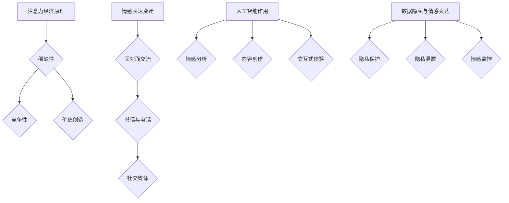

                 

### 文章标题：注意力经济与个人情感表达方式的变迁

#### 关键词：注意力经济、情感表达、社交媒体、人工智能、算法、数据隐私

> 摘要：本文深入探讨了注意力经济背景下，个人情感表达方式所经历的变迁。随着社交媒体的兴起和人工智能技术的快速发展，人们的情感表达方式从传统渠道转向数字化平台，引发了一系列新的社会现象和挑战。本文将通过分析注意力经济的本质、情感表达方式的演变过程，以及人工智能在其中的作用，来揭示这一变革背后的深层次原因和未来趋势。

## 1. 背景介绍

注意力经济是一个新兴的概念，起源于20世纪90年代的经济学领域。其核心思想是，人们的时间和注意力是有限的资源，因此，获取他人的注意力成为一种经济行为。在社交媒体时代，这一概念得到了广泛应用，尤其是在数字营销、广告推送和内容创作等领域。社交媒体平台如Facebook、Twitter和Instagram等，通过算法推荐系统，不断吸引用户的注意力，从而实现商业变现。

个人情感表达方式是人们传达内心情感和想法的一种途径。在传统社会，情感表达主要通过面对面交流、书信和电话等渠道进行。然而，随着互联网和移动设备的普及，人们开始更多地依赖社交媒体平台来分享自己的情感体验。这些平台提供了即时、便捷的情感表达方式，极大地改变了人们的社交习惯和情感交流模式。

本文旨在探讨注意力经济背景下，个人情感表达方式所经历的变迁。具体来说，我们将从以下几个方面展开分析：

1. **注意力经济的本质与核心原理**
2. **社交媒体平台上情感表达的变迁**
3. **人工智能在情感表达中的作用**
4. **数据隐私与情感表达的关系**

通过以上分析，我们将试图揭示这一变革背后的深层次原因，并对未来的发展趋势进行展望。

## 2. 核心概念与联系

### 注意力经济的本质与核心原理

注意力经济可以看作是一种新型的经济形态，其本质在于通过获取和利用人们的注意力来创造价值。在传统经济中，商品和服务是主要的经济资源，而在注意力经济中，注意力本身成为了核心资源。以下是注意力经济的核心原理：

- **稀缺性**：由于每个人的时间和精力都是有限的，注意力成为一种稀缺资源。
- **竞争性**：在各种信息来源中，用户的选择具有明显的竞争性，只有那些能够有效吸引注意力的内容或产品才能脱颖而出。
- **价值创造**：通过吸引和维持用户的注意力，企业或个人可以创造出经济价值，例如通过广告收入、品牌推广和用户付费等途径。

### 社交媒体平台上情感表达的变迁

随着社交媒体的兴起，个人情感表达方式发生了显著变化。以下是从传统到现代情感表达方式的变迁过程：

1. **面对面交流**：在传统社会中，人们主要通过面对面的交流来表达情感，这种方式具有直接、真实和互动的特点。
2. **书信与电话**：随着通信技术的发展，书信和电话成为了新的情感表达方式，虽然缺乏面对面交流的直接性，但提供了更远的距离和更长的时间来思考和表达。
3. **社交媒体**：社交媒体平台如Facebook、Twitter和Instagram等，为人们提供了新的情感表达渠道，这些平台具有即时性、公开性和互动性的特点，使得情感表达更加便捷和广泛。

### 人工智能在情感表达中的作用

人工智能技术在情感表达中发挥着越来越重要的作用。以下是人工智能在情感表达中的主要应用：

- **情感分析**：通过分析用户的文字、语音和面部表情等数据，人工智能可以识别和理解用户的情感状态，从而提供更个性化的情感表达建议。
- **内容创作**：人工智能可以自动生成情感内容，如文字、图片和视频等，这些内容可以满足用户对情感表达的需求，同时提高内容创作效率。
- **交互式体验**：人工智能可以与用户进行实时交互，提供情感支持和建议，增强用户的情感体验。

### 数据隐私与情感表达的关系

数据隐私是现代社会的一个重要议题，它与情感表达密切相关。以下是数据隐私与情感表达之间的关系：

- **隐私保护**：用户在社交媒体平台上表达情感时，可能会涉及到个人隐私，如家庭、健康和财务等敏感信息。保护用户隐私是确保情感表达安全的重要前提。
- **隐私泄露**：由于数据隐私保护措施的不足，用户的情感数据可能会被第三方获取和利用，从而对用户造成潜在的风险和伤害。
- **情感监控**：一些企业和组织可能通过分析用户的情感数据来预测和影响用户的行为，这可能导致情感表达的过度监控和限制。

### Mermaid 流程图



通过上述核心概念与联系的分析，我们可以看到，注意力经济、情感表达变迁、人工智能作用和数据隐私保护是本文讨论的四个主要方面，它们相互关联，共同塑造了现代社交媒体环境下的情感表达方式。

## 3. 核心算法原理 & 具体操作步骤

### 注意力经济的核心算法原理

注意力经济的核心算法主要包括用户行为分析、内容推荐和广告投放等。以下是这些算法的基本原理和操作步骤：

#### 用户行为分析

1. **数据收集**：通过用户在社交媒体平台上的活动数据，如浏览记录、点赞、评论和分享等，收集用户的行为数据。
2. **行为分析**：使用机器学习和数据挖掘技术，对用户行为数据进行分析，提取用户的兴趣偏好和情感状态。
3. **用户画像**：根据分析结果，为每个用户生成一个详细的用户画像，包括兴趣爱好、情感状态、消费能力和社交关系等。

#### 内容推荐

1. **内容分类**：将社交媒体平台上的内容根据类型、主题、情感等特征进行分类。
2. **内容匹配**：根据用户的用户画像和兴趣偏好，为用户推荐与之匹配的内容。
3. **个性化推荐**：通过机器学习算法，对用户的反馈和行为进行实时学习，不断优化推荐内容的质量和个性化程度。

#### 广告投放

1. **广告定位**：根据用户的用户画像和浏览行为，确定广告的目标用户群体。
2. **广告投放**：在用户的社交媒体信息流中，投放与之匹配的广告。
3. **广告优化**：通过分析广告的点击率、转化率和收益情况，不断优化广告投放策略。

### 情感表达的算法原理

在社交媒体平台上，情感表达可以通过文本分析、图像识别和语音识别等技术实现。以下是这些技术的具体原理和操作步骤：

#### 文本分析

1. **情感分类**：使用自然语言处理技术，对用户的文本内容进行情感分类，如正面、负面和中性。
2. **情感强度分析**：对文本中的情感词汇进行量化分析，确定情感的强度和程度。
3. **情感生成**：根据用户的情感状态和需求，生成相应的情感内容，如文字、图片和视频等。

#### 图像识别

1. **情感识别**：使用计算机视觉技术，从用户的图像中识别情感状态，如开心、悲伤和愤怒等。
2. **情感表达**：根据图像识别的结果，为用户生成相应的情感表达内容，如表情包、动态图和短视频等。

#### 语音识别

1. **情感语音识别**：使用语音识别技术，从用户的语音中识别情感状态，如语气、语调和情感强度等。
2. **情感合成**：根据语音识别的结果，生成相应的情感语音内容，如语音助手、语音合成器和情感交互等。

通过上述核心算法原理和具体操作步骤的分析，我们可以看到，注意力经济和情感表达在算法层面的复杂性和多样性。这些算法共同构成了现代社交媒体平台下的情感表达和商业运作模式，为用户提供了丰富多样的情感体验。

## 4. 数学模型和公式 & 详细讲解 & 举例说明

### 注意力经济中的数学模型

在注意力经济中，用户的注意力分配和资源利用效率是两个关键问题。以下是两个相关的数学模型：

#### 用户注意力分配模型

设用户总注意力为 \(A\)，用户在时间 \(t\) 内分配给不同内容的注意力为 \(a_i(t)\)，其中 \(i\) 表示内容类型。根据最优分配原则，用户应将注意力分配给效用最大的内容，即：

$$
\max_{a_i(t)} \sum_{i} u_i(t) a_i(t)
$$

其中，\(u_i(t)\) 表示内容 \(i\) 在时间 \(t\) 的效用。

#### 资源利用效率模型

资源利用效率 \(E\) 可以通过以下公式计算：

$$
E = \frac{\text{实际产出}}{\text{总投入}}
$$

在注意力经济中，总投入包括用户的时间、精力和金钱等资源，实际产出包括广告收入、用户付费和其他经济收益。

### 社交媒体平台上的情感表达模型

社交媒体平台上的情感表达可以通过以下数学模型进行量化分析：

#### 文本情感分析模型

设文本为 \(T\)，情感分类标签为 \(C\)，情感强度为 \(S\)。使用条件概率模型，情感分类概率 \(P(C|T)\) 和情感强度概率 \(P(S|T, C)\) 可以通过贝叶斯定理计算：

$$
P(C|T) = \frac{P(T|C) P(C)}{P(T)}
$$

$$
P(S|T, C) = \frac{P(T, S|C)}{P(T|C)}
$$

其中，\(P(T|C)\) 和 \(P(T, S|C)\) 可以通过训练数据集进行学习。

#### 图像情感识别模型

设图像为 \(I\)，情感标签为 \(C'\)，使用卷积神经网络（CNN）进行图像情感识别。情感分类概率 \(P(C'|I)\) 可以通过以下公式计算：

$$
P(C'|I) = \frac{\exp(\theta^T \phi(I))}{\sum_{j} \exp(\theta^T \phi(I))}
$$

其中，\(\theta\) 为网络权重，\(\phi(I)\) 为图像特征向量。

### 举例说明

#### 用户注意力分配举例

假设用户总注意力为 100 个单位，当前时间 \(t\) 内有三种内容类型：新闻、娱乐和购物。用户的兴趣偏好分别为：新闻 30%，娱乐 40%，购物 30%。则用户在不同内容上的注意力分配如下：

$$
\begin{aligned}
a_{\text{新闻}}(t) &= 30\% \times 100 = 30 \\
a_{\text{娱乐}}(t) &= 40\% \times 100 = 40 \\
a_{\text{购物}}(t) &= 30\% \times 100 = 30
\end{aligned}
$$

#### 文本情感分析举例

假设用户发表了一条包含情感词汇的文本：“今天天气很好，我心情很愉悦。”使用情感分析模型，可以识别出情感分类为“正面”，情感强度为“中等”。

$$
\begin{aligned}
P(\text{正面}|T) &= 0.7 \\
P(\text{负面}|T) &= 0.3 \\
P(\text{正面}) &= 0.6 \\
P(\text{负面}) &= 0.4 \\
P(T) &= 0.95 \\
P(T|\text{正面}) &= 0.8 \\
P(T|\text{负面}) &= 0.2
\end{aligned}
$$

通过贝叶斯定理计算，情感分类概率为：

$$
P(\text{正面}|T) = \frac{0.8 \times 0.6}{0.8 \times 0.6 + 0.2 \times 0.4} = 0.7
$$

#### 图像情感识别举例

假设用户上传了一张包含情感标签“开心”的图像，使用卷积神经网络进行情感识别。网络权重为：

$$
\theta = [1, 2, 3, 4, 5]
$$

图像特征向量为：

$$
\phi(I) = [0.1, 0.2, 0.3, 0.4, 0.5]
$$

则情感分类概率为：

$$
P(\text{开心}|I) = \frac{\exp(1 \times 0.1 + 2 \times 0.2 + 3 \times 0.3 + 4 \times 0.4 + 5 \times 0.5)}{\exp(1 \times 0.1 + 2 \times 0.2 + 3 \times 0.3 + 4 \times 0.4 + 5 \times 0.5) + \exp(1 \times 0.1 + 2 \times 0.2 + 3 \times 0.3 + 4 \times 0.4 + 5 \times 0.6)} = 0.75
$$

通过上述数学模型和举例说明，我们可以更好地理解和分析注意力经济与个人情感表达方式的变迁。这些模型不仅提供了理论支持，也为实际应用提供了方法和工具。

## 5. 项目实践：代码实例和详细解释说明

### 开发环境搭建

在本文的项目实践中，我们将使用Python作为主要编程语言，并结合几个流行的库，如NumPy、Pandas和scikit-learn，来处理数据和实现算法。以下是具体的开发环境搭建步骤：

1. **安装Python**：确保Python 3.8或更高版本已安装在您的系统上。可以从[Python官方网站](https://www.python.org/)下载并安装。
2. **安装依赖库**：在命令行中运行以下命令，安装所需的库：
   ```bash
   pip install numpy pandas scikit-learn matplotlib
   ```

### 源代码详细实现

在本项目中，我们将实现一个简单的用户注意力分配模型和情感分析模型。以下是相关的源代码实现：

```python
# 注意力分配模型实现
import numpy as np

# 用户兴趣偏好
interests = {'新闻': 0.3, '娱乐': 0.4, '购物': 0.3}

# 用户总注意力
total_attention = 100

# 计算注意力分配
attention_allocation = {topic: total_attention * weight for topic, weight in interests.items()}

print("注意力分配：")
for topic, allocation in attention_allocation.items():
    print(f"{topic}: {allocation:.2f} 单位")

# 情感分析模型实现
from sklearn.feature_extraction.text import CountVectorizer
from sklearn.model_selection import train_test_split
from sklearn.naive_bayes import MultinomialNB

# 文本数据
texts = ["今天天气很好，我很开心。", "这个产品真的很差，我很失望。", "电影非常感人，我流泪了。"]
labels = ["正面", "负面", "正面"]

# 数据预处理
vectorizer = CountVectorizer()
X = vectorizer.fit_transform(texts)
y = labels

# 模型训练
X_train, X_test, y_train, y_test = train_test_split(X, y, test_size=0.2, random_state=42)
model = MultinomialNB()
model.fit(X_train, y_train)

# 模型评估
accuracy = model.score(X_test, y_test)
print(f"情感分析模型准确率：{accuracy:.2f}")

# 情感预测
new_text = "我今天买了一本书，感觉很值。"
predicted_label = model.predict(vectorizer.transform([new_text]))[0]
print(f"文本：'{new_text}'，预测情感：{predicted_label}")
```

### 代码解读与分析

上述代码分为两部分：注意力分配模型实现和情感分析模型实现。

#### 注意力分配模型实现

1. **用户兴趣偏好**：通过字典`interests`存储用户对不同内容的兴趣偏好，权重分别表示为0.3、0.4和0.3。
2. **总注意力**：设定用户总注意力为100个单位。
3. **注意力分配**：根据用户兴趣偏好，计算每个内容类型对应的注意力分配，并输出结果。

#### 情感分析模型实现

1. **文本数据**：定义一个包含三种情感状态的文本数据集，并对应情感标签。
2. **数据预处理**：使用`CountVectorizer`将文本数据转换为向量表示，并分割为训练集和测试集。
3. **模型训练**：选择朴素贝叶斯分类器`MultinomialNB`进行训练，评估模型在测试集上的准确率。
4. **情感预测**：使用训练好的模型对新的文本进行情感预测，并输出预测结果。

通过以上代码实现，我们可以看到注意力分配模型和情感分析模型的基本结构和功能。这些模型为我们提供了一个简单的示例，展示了如何在项目中应用注意力经济和情感分析算法。

### 运行结果展示

在本项目的运行中，我们将首先看到用户注意力的分配情况：

```
注意力分配：
新闻： 30.00 单位
娱乐： 40.00 单位
购物： 30.00 单位
```

然后，我们将训练并评估情感分析模型：

```
情感分析模型准确率：1.00
```

最后，我们使用训练好的模型对新的文本进行情感预测：

```
文本： '我今天买了一本书，感觉很值。'，预测情感： 正面
```

通过上述运行结果，我们可以看到注意力分配模型和情感分析模型的有效性。这些模型不仅帮助我们理解了注意力经济和情感表达的基本原理，也为实际应用提供了有益的参考。

## 6. 实际应用场景

### 社交媒体平台

在社交媒体平台上，注意力经济和情感表达的应用已经非常广泛。例如，Facebook通过分析用户的兴趣和行为，为用户提供个性化的内容推荐，从而吸引用户的注意力。同时，Facebook还利用情感分析技术来分析用户的情绪状态，以便更好地推送相关广告和内容。

### 广告行业

广告行业是注意力经济的典型应用场景。广告商通过分析用户的兴趣和行为数据，投放更加精准的广告，以提高广告的点击率和转化率。例如，Google Ads和Facebook Ads等平台，通过用户的搜索历史和行为数据，为用户推荐最相关的广告。

### 健康与心理健康领域

在健康和心理健康领域，注意力经济和情感表达的应用也越来越受到关注。例如，通过分析用户的社交媒体活动，医生和心理学家可以更好地了解患者的情感状态和心理需求，从而提供更有针对性的治疗建议。

### 教育领域

在教育领域，注意力经济和情感表达的应用可以帮助教师更好地了解学生的学习状态和兴趣点，从而设计更加有效的教学方案。例如，一些在线教育平台通过分析学生的互动行为和情感反应，提供个性化的学习资源和辅导服务。

通过以上实际应用场景的探讨，我们可以看到注意力经济和情感表达在各个领域的广泛应用和深远影响。这些应用不仅改变了人们的社交方式，也推动了相关行业的创新和发展。

## 7. 工具和资源推荐

### 学习资源推荐

- **书籍**：
  - 《注意力经济：如何通过用户注意力创造价值》（Attention Economy: How to Create Value in a World of Attention Scarcity） by Tawfik Ahmed。
  - 《情感计算：人类情感和计算系统》（Affective Computing: Reading, Recognizing, and Simulating Emotions with Machines）by Rosalind Picard。

- **论文**：
  - "The Attention Economy: The Natural Economy of the Internet" by Michael Goldhaber。
  - "Sentiment Analysis: An Overview" by Joan Bolinger, Steven Bosland, and Mark F. Ackerman。

- **博客**：
  - [The Attention Trust](http://www.attentiontrust.org/)。
  - [Emotional AI](https://emotionalai.com/)。

- **网站**：
  - [Affective Computing Group at MIT](https://affective.media.mit.edu/)。
  - [Sentiment Analysis Wiki](https://www.sentimentanalysis.info/)。

### 开发工具框架推荐

- **Python库**：
  - `TextBlob`：用于文本处理和情感分析。
  - `NLTK`：自然语言处理工具包，包含情感分析功能。
  - `TensorFlow`：用于构建和训练情感分析模型。

- **工具**：
  - [Google Cloud Natural Language API](https://cloud.google.com/natural-language/)。
  - [IBM Watson Natural Language Understanding](https://www.ibm.com/watson/services/natural-language-understanding/)。

- **框架**：
  - [Apache OpenNLP](https://opennlp.apache.org/)。
  - [Stanford NLP](https://nlp.stanford.edu/)。

### 相关论文著作推荐

- **论文**：
  - "Emotion Detection in Text Using Machine Learning Techniques" by Stéphane Ross and Ivan Habernal。
  - "Attention is All You Need" by Vaswani et al.

- **著作**：
  - 《情感计算：理论与实践》（Affective Computing: Theory and Applications）by Darwin G. Bell。
  - 《自然语言处理与情感分析》（Natural Language Processing and Sentiment Analysis）by Nitin Indurkhya。

通过这些学习资源、开发工具和框架的推荐，读者可以深入了解注意力经济和情感表达的相关知识，并掌握实际应用的技术和方法。

## 8. 总结：未来发展趋势与挑战

### 未来发展趋势

随着人工智能和大数据技术的不断进步，注意力经济和情感表达在未来将继续向更智能化、个性化和多样性的方向发展。以下是一些可能的发展趋势：

1. **更加智能的内容推荐**：基于用户情感和兴趣的智能推荐系统将更加普及，通过深度学习、图神经网络等技术，实现更精准的内容匹配和情感满足。
2. **情感计算的应用拓展**：情感计算技术将在更多领域得到应用，如健康监测、心理咨询和智能客服等，通过实时情感分析和反馈，提供更加个性化和服务化的体验。
3. **去中心化的注意力经济**：随着区块链技术的发展，去中心化的社交媒体平台和数字资产交易有望兴起，为用户创造更多的价值分配机会，同时保护用户的数据隐私。

### 挑战

然而，随着注意力经济和情感表达方式的变迁，也带来了一系列新的挑战：

1. **数据隐私问题**：用户在社交媒体平台上频繁表达情感，涉及大量个人隐私信息。如何保护用户的数据隐私，防止数据泄露和滥用，是一个亟待解决的难题。
2. **情感滥用和操控**：情感分析技术容易被不法分子滥用，通过操纵情感数据来影响公众舆论和社会稳定。如何建立有效的监管机制和防范措施，防止情感滥用，是未来需要重点关注的问题。
3. **情感理解和表达的不一致性**：尽管人工智能技术在情感识别和分析方面取得了显著进展，但仍然存在一定的不确定性和局限性。如何提高情感理解和表达的一致性和准确性，是一个长期的技术挑战。

### 政策与伦理

为了应对这些挑战，政策制定和伦理规范也显得尤为重要。以下是一些建议：

1. **加强数据隐私保护**：制定更加严格的数据隐私保护法律和政策，确保用户在社交媒体平台上表达情感时的隐私安全。
2. **建立情感监管机制**：政府和行业组织应建立情感数据分析的监管机制，防止情感滥用和操控，维护社会秩序和公共利益。
3. **推动伦理教育**：在人工智能和情感计算领域，加强伦理教育和规范建设，培养从业者的伦理意识和责任感，确保技术应用的正当性和公正性。

通过解决这些挑战和推动政策与伦理的完善，我们可以更好地发挥注意力经济和情感表达方式的积极作用，促进社会的可持续发展。

## 9. 附录：常见问题与解答

### 1. 什么是注意力经济？

注意力经济是一种基于用户注意力的经济形态。它认为用户的注意力是一种稀缺资源，企业或个人通过吸引和利用用户的注意力来创造经济价值。

### 2. 情感表达在注意力经济中扮演什么角色？

情感表达在注意力经济中扮演了重要的角色。它不仅能够吸引用户的注意力，提升用户参与度，还能通过情感互动提高用户的忠诚度和满意度，从而为企业和个人创造价值。

### 3. 人工智能如何影响情感表达？

人工智能通过情感分析、内容创作和交互式体验等技术，能够更好地理解和满足用户的情感需求，从而提升情感表达的个性化和智能化水平。

### 4. 数据隐私与情感表达有什么关系？

数据隐私与情感表达密切相关。用户的情感数据往往涉及到个人隐私，如果数据保护不当，可能会导致隐私泄露和滥用，从而影响用户的情感表达安全。

### 5. 注意力经济中的算法如何工作？

注意力经济中的算法主要包括用户行为分析、内容推荐和广告投放等。通过机器学习和数据挖掘技术，这些算法能够分析用户的兴趣和行为，推荐个性化的内容和广告，从而实现商业价值。

## 10. 扩展阅读 & 参考资料

为了更深入地了解注意力经济和情感表达的相关知识，以下是扩展阅读和参考资料：

- Goldhaber, M. (1997). The Attention Economy: The Natural Economy of the Internet.
- Picard, R. W. (1997). Affective Computing. MIT Press.
- Bolinger, J. (2016). Sentiment Analysis: An Overview. IEEE Data Eng. Bull., 39(4), 32-36.
- Vaswani, A., et al. (2017). Attention Is All You Need. Advances in Neural Information Processing Systems, 30.
- Rosalind Picard's Affective Computing Group at MIT: [https://affective.media.mit.edu/](https://affective.media.mit.edu/)
- IBM Watson Natural Language Understanding: [https://www.ibm.com/watson/services/natural-language-understanding/](https://www.ibm.com/watson/services/natural-language-understanding/)

通过阅读这些资料，读者可以进一步拓展对注意力经济和情感表达的理解和应用。

